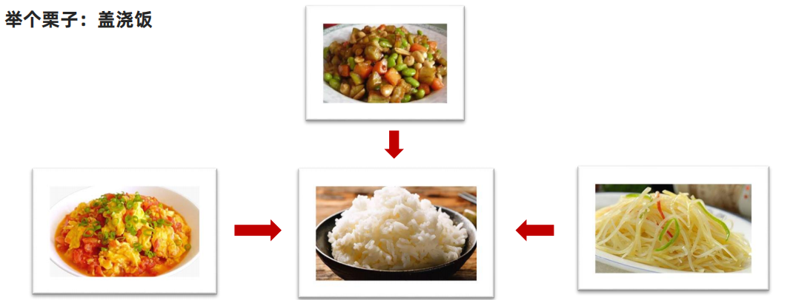

# JavaScript 进阶 - 第1天

> 学习作用域、变量提升、闭包等语言特征，加深对 JavaScript 的理解，掌握变量赋值、函数声明的简洁语法，降低代码的冗余度。

- 作用域
- 函数进阶
- 解构赋值
- 综合案例

## 作用域

> 了解作用域对程序执行的影响及作用域链的查找机制，使用闭包函数创建隔离作用域避免全局变量污染。

作用域（scope）规定了变量能够被访问的“范围”，离开了这个“范围”变量便不能被访问，作用域分为全局作用域和局部作用域。

### 局部作用域

局部作用域分为函数作用域和块作用域。

#### 函数作用域

在函数内部声明的变量只能在函数内部被访问，外部无法直接访问。

```html
<script>
  // 声明 counter 函数
  function counter(x, y) {
    // 函数内部声明的变量
    const s = x + y
    console.log(s) // 18
  }
  // 设用 counter 函数
  counter(10, 8)
  // 访问变量 s
  console.log(s)// 报错
</script>
```

总结：

1. 函数内部声明的变量，在函数外部无法被访问
2. 函数的参数也是函数内部的局部变量
3. 不同函数内部声明的变量无法互相访问

#### 块作用域

在 JavaScript 中使用 `{}` 包裹的代码称为代码块，代码块内部声明的变量外部将【有可能】无法被访问。

```html
<script>
  {
    // age 只能在该代码块中被访问
    let age = 18;
    console.log(age); // 正常
  }
  
  // 超出了 age 的作用域
  console.log(age) // 报错
  
  let flag = true;
  if(flag) {
    // str 只能在该代码块中被访问
    let str = 'hello world!'
    console.log(str); // 正常
  }
  
  // 超出了 age 的作用域
  console.log(str); // 报错
  
  for(let t = 1; t <= 6; t++) {
    // t 只能在该代码块中被访问
    console.log(t); // 正常
  }
  
  // 超出了 t 的作用域
  console.log(t); // 报错
</script>
```


总结：

1. `let` 声明的变量会产生块作用域，`var` 不会产生块作用域
2. `const` 声明的常量也会产生块作用域
3. 不同代码块之间的变量无法互相访问
4. 推荐使用 `let` 或 `const`

### 全局作用域

`<script>` 标签和 `.js` 文件的【最外层】就是所谓的全局作用域，在此声明的变量在函数内部也可以被访问。

```html
<script>
  // 此处是全局
  
  function sayHi() {
    // 此处为局部
  }

  // 此处为全局
</script>
```

全局作用域中声明的变量，任何其它作用域都可以被访问，如下代码所示：

```html
<script>
    // 全局变量 name
    const name = '小明'
  
  	// 函数作用域中访问全局
    function sayHi() {
      // 此处为局部
      console.log('你好' + name)
    }

    // 全局变量 flag 和 x
    const flag = true
    let x = 10
  
  	// 块作用域中访问全局
    if(flag) {
      let y = 5
      console.log(x + y) // x 是全局的
    }
</script>
```

总结：

1. 为 `window` 对象动态添加的属性默认也是全局的，不推荐！
2. 函数中未使用任何关键字声明的变量为全局变量，不推荐！！！
3. 尽可能少的声明全局变量，防止全局变量被污染

JavaScript 中的作用域是程序被执行时的底层机制，了解这一机制有助于规范代码书写习惯，避免因作用域导致的语法错误。

### 作用域链

嵌套关系的作用域串联起来形成了作用域链

**作用：**作用域链本质上是底层的变量查找机制（就近原则）

- 在函数被执行时，会优先查找当前函数作用域中查找变量
- 如果当前作用域查找不到则会逐级向上查找父级作用域直到全局作用域

```html
<body>
  <script>
    // 全局作用域
    // let a = 11
    let b = 22
    // 局部作用域
    function f() {
      // let a = 1
      // 局部作用域
      function g() {
        // a = 2
        console.log(a)  // ?
      }
      g() // 调用g
    }
    f() // 调用 f

  </script>
</body>
```


总结：

1.嵌套关系的作用域串联起来形成了作用域链

2.查找规则：就近原则 

- 当前作用域用找不到，则会逐级查找父级作用域直到全局作用域
- 都找不到则提示错误，这个变量没有被定义过

3.子作用域能够访问父作用域，父级作用域无法访问子级作用域

### 垃圾回收机制

垃圾回收机制(Garbage Collection)  简称 GC

JS中内存的分配和回收都是自动完成的，内存在不使用的时候会被垃圾回收器自动回收

**内存的生命周期**

JS环境中分配的内存, 一般有如下生命周期： 

1.内存分配：当我们声明变量、函数、对象的时候，系统会自动为他们分配内存 

2.内存使用：即读写内存，也就是使用变量、函数等 

3.内存回收：使用完毕，由垃圾回收器自动回收不再使用的内存 

**说明：**

- 全局变量一般不会回收(关闭页面回收)
- 一般情况下局部变量的值, 不用了, 会被自动回收掉

**内存泄漏：**程序中分配的内存由于某种原因程序未释放或无法释放叫做内存泄漏

### 闭包

**概念：**一个函数对周围状态的引用捆绑在一起，闭包让开发者可以从内部函数访问外部函数的作用域

>简单理解：闭包 =  内层函数 + 外层函数的变量 

```html
<body>
  <script>
    // 1. 闭包 : 内层函数 + 外层函数变量
    // function outer() {
    //   const a = 1
    //   function f() {
    //     console.log(a)
    //   }
    //   f()
    // }
    // outer()

    // 2. 闭包的应用： 实现数据的私有。统计函数的调用次数
    // let count = 1
    // function fn() {
    //   count++
    //   console.log(`函数被调用${count}次`)
    // }

    // 3. 闭包的写法  统计函数的调用次数
    function outer() {
      let count = 1
      function fn() {
        count++
        console.log(`函数被调用${count}次`)
      }
      return fn
    }
    const re = outer()
    // const re = function fn() {
    //   count++
    //   console.log(`函数被调用${count}次`)
    // }
    re()
    re()
    // const fn = function() { }  函数表达式
    // 4. 闭包存在的问题： 可能会造成内存泄漏
  </script>
</body>
```

总结：

1.怎么理解闭包？

- 闭包 = 内层函数 + 外层函数的变量

2.闭包的作用？

- 封闭数据，实现数据私有，外部也可以访问函数内部的变量
- 闭包很有用，因为它允许将函数与其所操作的某些数据（环境）关联起来

3.闭包可能引起的问题？

- 内存泄漏

### 变量提升

变量提升是 JavaScript 中比较“奇怪”的现象，它允许在变量声明之前即被访问（仅存在于var声明变量）

**说明：**

1. 变量提升出现在当前作用域的最前面


2. 提升时，只提升变量声明，不提升变量赋值
3. let/const 声明的变量不存在变量提升
4. 实际开发中推荐先声明再访问变量

```html
<body>
  <script>
    var age
    // var变量提升
    // 1. 变量提升会提升到当前作用域的最前面
    // 2. 只提升变量声明，不提升变量赋值
    console.log(age) // ?
    age = 18
    console.log(age) // ?

    function fn() {
      var uname
      console.log(uname)
      uname = 'andy'
    }
    fn()
  </script>
</body>
```

>JS初学者经常花很多时间才能习惯变量提升，还经常出现一些意想不到的bug，正因为如此，ES6 引入了块级作用域，用let或者const声明变量，让代码写法更加规范和人性化。

注：关于变量提升的原理分析会涉及较为复杂的词法分析等知识，而开发中使用 `let` 可以轻松规避变量的提升，因此在此不做过多的探讨，有兴趣可[查阅资料](https://segmentfault.com/a/1190000013915935)。

## 函数

> 知道函数参数默认值、动态参数、剩余参数的使用细节，提升函数应用的灵活度，知道箭头函数的语法及与普通函数的差异。

### 函数提升

函数提升与变量提升比较类似。

说明：

1. 函数提升提升到当前作用域最前面
2. 函数提升只提升声明，不提升调用
3. 函数表达式不存在提升的现象
4. 函数提升能够使函数的声明调用更灵活

```html
<body>
  <script>
    function fn() {
      console.log('函数提升')
    }
    var fun
    // 函数提升
    // 1.函数提升提升到当前作用域最前面
    // 2.函数提升只提升声明，不提升调用
    // 3.函数表达式不存在提升的现象
    // 4.函数提升能够使函数的声明调用更灵活
    fn()
    fun()
    fun = function () {
      console.log('函数表达式不存在提升')
    }
    fun()
  </script>

```

### 函数参数

#### arguments对象（了解）

`arguments` 是函数内部内置的伪数组变量，它包含了调用函数时传入的所有实参。

```html
<body>
  <script>
    // arguments对象获取所有实参
    function sum() {
      // 1. arguments 只存在于函数中 伪数组
      // 2. arguments 可以得到传递过来的所有实参 [1, 2]
      // console.log(arguments)
      let sum = 0
      for (let i = 0; i < arguments.length; i++) {
        sum += arguments[i]
      }
      console.log(sum)
    }
    sum(1, 2)
    sum(1, 2, 3)
    sum(1, 2, 3, 4)
    // console.log(arguments) 外面无法使用

  </script>
</body>
```

总结：

1. arguments是一个伪数组，只存在于函数中
2. arguments的作用是动态获取函数的实参
3. 可以通过for循环依次得到传递过来的实参

#### 剩余参数

**剩余参数:**  允许我们将一个不定数量的参数表示为一个数组

**简单理解：**用于获取多余的实参，并形成一个真数组

**使用场景：** 

也可以解决形参和实参个数不匹配的问题

```html
<body>
  <script>
    // 剩余参数获得多余的实参 返回真数组
    // function sum(x, y, ...other) {
    //   console.log(x, y, other)
    // }
    // sum(1, 2)
    // sum(1, 2, 3)
    // sum(1, 2, 3, 4)

    // 1. 求和效果
    function sum(...other) {
      // console.log(other)  // [1, 2, 3, 4]
      let sum = 0
      other.forEach(function (ele) {
        sum += ele
      })
      console.log(sum)
    }
    sum(1, 2)
    sum(1, 2, 3)
    sum(1, 2, 3, 4)

  </script>
</body>
```

**剩余参数和arguments区别**

1. ... 是语法符号，置于最末函数形参之前，用于获取多余的实参
2. 借助 ... 获取的剩余实参，是个真数组
3. 箭头函数不支持arguments，但是可以使用剩余参数

开发中，还是提倡多使用 剩余参数

#### 展开运算符(…)

展开运算符,将一个数组/对象进行展开

~~~html
<body>
  <script>
    // 展开运算符：将一个数组/对象进行展开，咱们先讲展开数组
    // 1. 基本使用, 不修改原数组
    const arr = [1, 2, 3]
    console.log(...arr)
    console.log(arr)

    //2. 使用场景： 求数组最大值/最小值，数组合并
    // console.log(Math.max(1, 3, 8))
    console.log(Math.max(...arr))  // 3
    console.log(Math.min(...arr))  // 1
    const arr1 = [1, 2, 3]
    const arr2 = [4, 5, 6]
    // console.log([arr1, arr2])
    console.log([...arr1, ...arr2])

  </script>
</body>
~~~

>剩余参数：函数参数使用，把多个元素收集起来生成一个真数组 （凝聚）
>
>展开运算符：将数组展开成各个元素（拆散）

### 箭头函数

箭头函数比函数表达式更简洁的一种写法

使用场景：箭头函数更适用于那些本来需要匿名函数的地方，写法更简单

```html
<body>
  <script>
    // 箭头函数
    // 1. 基本语法
    // const fn = function () {
    //   console.log('我是函数表达式')
    // }
    // fn()
    // const fn = () => {
    //   console.log('我是箭头函数')
    // }
    // fn()

    // 2. 细节使用
    // 2.1 如果只有一个形参则可以省略小括号,其余个数不能省略，如果没有参数则写空的小括号
    // const sum = (x) => {
    //   console.log(x + x)
    // }
    // sum(2)
    // const sum = x => {
    //   console.log(x + x)
    // }
    // sum(2)

    // 2.2 如果函数体只有一句代码，则可以省略大括号，这句代码就是返回值（省略return）
    // const sum = x => {
    //   return x + x
    // }
    // const sum = x => x + x
    // console.log(sum(5))

    // 2.3 如果返回的是一个对象，则需要用小括号把对象包裹起来
    // const fn = function() {
    //   return {name: '佩奇'}
    // }
    // const fn = () => ({ name: '佩奇' })
    // console.log(fn())

    // 2.4 箭头函数里面没有 arguments，但是有剩余参数
    const fn = (...other) => {
      // console.log(arguments)
      console.log(other)
    }
    fn(1, 2)
  </script>
</body>
```

**用法细节：** 

1. 当箭头函数只有一个参数时，可以省略参数的小括号，其余个数不能省略（没有参数也需要写小括号）
2. 当箭头函数的函数体只有一句代码 可以省略函数体大括号，这句代码就是返回值（可以不用写return）
3. 如果返回的是个对象，则需要把对象用小括号包裹
4. 箭头函数里面没有arguments，但是有剩余参数

总结：

1. 箭头函数属于表达式函数，因此不存在函数提升
2. 箭头函数只有一个参数时可以省略圆括号 `()`
3. 箭头函数函数体只有一行代码时可以省略花括号 `{}`，并自动做为返回值被返回
4. 箭头函数中没有 `arguments`，只能使用 `...` 动态获取实参

####  箭头函数中的this

以前函数中的this指向是根据如何调用来确定的。简单理解就是this指向调用者

箭头函数本身没有this,它只会沿用上一层作用域的this 

~~~html
 <body>
  <button class="btn1">点击</button>
  <button class="btn2">5秒后启用</button>
  <script>
    // 1. 以前this的指向：  指向调用者
    // console.log(this)  // window
    // // 普通函数
    // function fn() {
    //   console.log(this)  // window
    // }
    // window.fn()
    // // 对象方法里面的this
    // const obj = {
    //   name: 'andy',
    //   sayHi: function () {
    //     console.log(this)  // obj
    //   }
    // }
    // obj.sayHi()

    // 2. 箭头函数的中this指向-沿用上一层作用域的this 
    const fn = () => {
      console.log(this)  // window
    }
    fn()
    // const obj = {
    //   name: 'andy',
    //   sayHi: () => {
    //     console.log(this)  // window
    //   }
    // }
    // obj.sayHi()

    const obj = {
      name: 'andy',
      sayHi: function () {
        const fun = () => {
          console.log(this)  // obj 
        }
        fun()
      }
    }
    obj.sayHi()

    // 3. 我们可以根据需求来选择是否使用箭头函数 this
    // document.querySelector('.btn1').addEventListener('click', function () {
    //   this.style.color = 'red'
    // })
    document.querySelector('.btn1').addEventListener('click', () => {
      // this.style.color = 'red'
      // 此处不能用 this 指向 Window不是 按钮了
      document.querySelector('.btn1').style.color = 'red'
    })

    document.querySelector('.btn2').addEventListener('click', function () {
      this.disabled = true
      // setTimeout(function () {
      //   console.log(this) //  定时器里面的this 指向 window 
      //   this.disabled = false
      // }, 5000)

      setTimeout(() => {
        console.log(this) //  
        this.disabled = false
      }, 5000)
    })
  </script>
</body>
~~~

### ES6对象简写

1. 在对象中，如果属性名和属性值一致，可以简写只写属性名即可
2. 在对象中，方法（函数）可以简写

~~~html
<body>
  用户名: <input type="text" class="username"> <br>
  密　码: <input type="password" class="password"> <br>
  <button>点击</button>
  <script>
    // ES6对象属性和方法的简写
    // 1. 对象属性的简写 (点击按钮生成对象)
    document.querySelector('button').addEventListener('click', function () {
      const username = document.querySelector('.username').value
      const password = document.querySelector('.password').value
      // const obj = {
      //   username: username,
      //   password: password
      // }
      // 属性名和属性值相同的时候，可以只写属性名
      // 2. 对象方法的简写
      // const obj = {
      //   username,
      //   password,
      //   sayHi: function() {
      //     console.log('hi~')
      //   }
      // }
      const obj = {
        username,
        password,
        sayHi() {
          console.log('hi~')
        }
      }
      console.log(obj)
    })


  </script>
~~~

## 解构赋值

> 知道解构的语法及分类，使用解构简洁语法快速为变量赋值。

解构赋值：可以将数组中的值或对象的属性取出，赋值给其他变量

解构：其实就是把一个事物的结构进行拆解

### 数组解构

基本语法：

1. 右侧数组的值将被赋值给左侧的变量
2. 变量的顺序对应数组值的位置依次进行赋值操作

```html
<body>
  <script>
    // 数组解构
    // 1. 基本语法
    const [a, b, c] = [1, 2, 3]
    console.log(a)
    console.log(b)
    console.log(c)

    // 2. 典型的使用场景  交换2个变量的值
    let x = 1
    let y = 2;
    [y, x] = [x, y]
    console.log(x, y);

    // 3. js 2个特殊情况需要加分号
    // 3.1 如果是小括号开头的则需要加分号
    (function () { })();
    (function () { })();
    // 3.2 如果是中括号开头的则需要加分号

  </script>
</body>
```

**变量和值不匹配的情况**

~~~html
<body>
  <script>
    // 数组解构变量和值不匹配的情况

    // 1. 变量多，值少的情况
    // const [a, b, c, d] = ['小米', '华为', '苹果']
    // console.log(a)
    // console.log(b)
    // console.log(c)
    // console.log(d) // undefined

    // 2. 防止undefined传值，可以设置默认值
    // const [a, b, c, d = '三星'] = ['小米', '华为', '苹果']
    // console.log(a)
    // console.log(b)
    // console.log(c)
    // console.log(d)

    // 3. 变量少，值多的情况
    // const [a, b] = ['小米', '华为', '苹果']
    // console.log(a)
    // console.log(b)

    // 4. 利用剩余参数解决变量少值多的情况
    // const [a, ...b] = ['小米', '华为', '苹果']
    // console.log(a)
    // console.log(b)

    // 5. 按需导入，忽略某些值
    const [a, , c, d] = ['小米', '华为', '苹果', 'vivo']
    console.log(a)
    console.log(c)
    console.log(d)
  </script>
</body>
~~~

### 对象解构

对象解构赋值：可以将对象的属性取出，赋值给其他变量

```html
<body>
  <script>
    const username = 'andy'
    const user = {
      username: '小明',
      age: 18
    }
    // 1. 对象解构赋值基本使用
    // const { username, age, gender } = user
    // console.log(username)  // 小明
    // console.log(age)  // 18
    // console.log(gender)  // undefined

    // 1.1 要求变量名和属性名必须一致
    // 1.2 如果变量名和属性名不一致，则默认为 undefined
    // 1.3 变量名不要和外面的变量名冲突，否则会报错

    // 2. 更改解构变量名（重命名）  变量名: 新变量名
    // const { username: uname, age } = user
    // console.log(uname)  // 小明
    // console.log(age)  // 18

    // 3. 对象数组解构
    const arr = [
      {
        username: '小明',
        age: 18
      }
    ]

    const [{ username: uname, age }] = arr
    console.log(uname)
    console.log(age)
  </script>
</body>
```

注：支持多维解构赋值

~~~html
<body>
  <script>
    // 1. 这是后台传递过来的数据
    const msg = {
      "code": 200,
      "msg": "获取新闻列表成功",
      "data": [
        {
          "id": 1,
          "title": "5G商用自己，三大运用商收入下降",
          "count": 58
        },
        {
          "id": 2,
          "title": "国际媒体头条速览",
          "count": 56
        },
        {
          "id": 3,
          "title": "乌克兰和俄罗斯持续冲突",
          "count": 1669
        },

      ]
    }

    // 需求1： 请将以上msg对象  采用对象解构的方式 只选出  data 方面后面使用渲染页面
    // const { data } = msg
    // console.log(data)
    // 需求2： 上面msg是后台传递过来的数据，我们需要把data选出当做参数传递给 函数
    // const { data } = msg
    // msg 虽然很多属性，但是我们利用解构只要 data值
    function render({ data }) {
      // const { data } = arr
      // 我们只要 data 数据
      // 内部处理
      console.log(data)

    }
    render(msg)

    // 需求3， 为了防止msg里面的data名字混淆，要求渲染函数里面的数据名改为 myData
    function render({ data: myData }) {
      // 要求将 获取过来的 data数据 更名为 myData
      // 内部处理
      console.log(myData)

    }
    render(msg)

  </script>
~~~

## 综合案例

### filter遍历数组

filter() 方法创建一个新的数组，新数组中的元素是符合条件的所有元素

主要使用场景： 筛选数组符合条件的元素，并返回筛选之后元素的新数组，不影响原数组

~~~html
<body>
  <script>
    // filter 筛选数组元素
    const arr = [10, 20, 30, 40]
    // const newArr = arr.filter(function (ele, index) {
    //   // console.log(ele)
    //   // console.log(index)
    //   // return 筛选条件
    //   return ele >= 30
    //   // return ele + 30 都是真的所以都选出来了
    // })

    const newArr = arr.filter(ele => ele >= 30)
    console.log(newArr)
  </script>
</body>
~~~

## 拓展-垃圾回收机制算法

堆栈空间分配区别：

1. 栈（操作系统）: 由操作系统自动分配释放函数的参数值、局部变量等，基本数据类型放到栈里面。
2. 堆（操作系统）: 一般由程序员分配释放，若程序员不释放，由垃圾回收机制回收。复杂数据类型放到堆里面。

下面介绍两种常见的浏览器垃圾回收算法: 引用计数法 和 标记清除法

### 引用计数

IE采用的引用计数算法, 定义“内存不再使用”，就是看一个对象是否有指向它的引用，没有引用了就回收对象

算法： 

1. 跟踪记录被引用的次数
2. 如果被引用了一次，那么就记录次数1,多次引用会累加 ++
3. 如果减少一个引用就减1 -- 
4. 如果引用次数是0 ，则释放内存

### 标记清除法

现代的浏览器已经不再使用引用计数算法了。

现代浏览器通用的大多是基于标记清除算法的某些改进算法，总体思想都是一致的。

核心：

1. 标记清除算法将“不再使用的对象”定义为“无法达到的对象”。 
2. 就是从根部（在JS中就是全局对象）出发定时扫描内存中的对象。凡是能从根部到达的对象，都是还需要使用的。

3.那些无法由根部出发触及到的对象被标记为不再使用，稍后进行回收。 


# JavaScript 进阶 - 第2天

> 了解面向对象编程的基础概念及构造函数的作用，体会 JavaScript 一切皆对象的语言特征，掌握常见的对象属性和方法的使用。

- 深入对象
- 内置构造函数
- 综合案例

## 深入对象

> 了解面向对象的基础概念，能够利用构造函数创建对象。

### 创建对象三种方式

~~~html
<body>
  <script>
    // 1. 利用字面量创建对象（常用的一种方式）
    const o = {
      name: '佩奇'
    }
    console.log(o)

    // 2. 利用 new Object 创建对象 （了解）
    // const oo = new Object({ name: '佩奇' })
    const oo = new Object()
    oo.name = '佩奇'
    console.log(oo)

    // 3. 利用构造函数创建对象

  </script>
~~~

### 构造函数

**构造函数：**是一种特殊的函数，主要用来创建对象(初始化对象)

**使用场景：**常规的 {...} 语法允许创建一个对象。比如我们创建了佩奇的对象，继续创建乔治的对象还需要重新写一遍，此时可以通过构造函数来快速创建多个类似的对象

```html
<body>
  <script>
    // 构造函数：是一种特殊的函数，用来创建对象（并完成初始化对象）
    // 1. 构造函数的2个约定 首字母要大写, 利用new关键字来调用函数
    // function Pig() {

    // }
    // console.log(new Pig)
    // console.log(Pig())
    function Pig(name, age, gender) {
      // this.name 属性   
      // name 是形参也就是属性值
      this.name = name
      this.age = age
      this.gender = gender
      // return 123
    }
    const peiqi = new Pig('佩奇', 6, '女')
    console.log(peiqi)
    const qiaozhi = new Pig('乔治', 3, '男')
    console.log(qiaozhi)

    // 2. 构造函数创建对象说明
    // 2.1 new 关键字 实例化对象
    // 2.2 如果构造函数没有参数，则可以省略小括号
    // 2.3 构造函数里面无需写 return
    // 2.4 new Object()  new Date() 也是在实例化对象
  </script>
</body>
```

说明：

1. 使用 new 关键字调用函数的行为被称为实例化
2. 实例化构造函数时没有参数时可以省略 ()
3. 构造函数内部无需写return，返回值即为新创建的对象
4. newObject（）  new Date（）也是实例化构造函数

#### new 实例化过程

1. 创建新空对象
2. 构造函数this指向新对象
3. 执行构造函数代码
4. 返回新对象

### 实例成员&静态成员

#### 实例成员

实例成员：

通过构造函数创建的对象称为实例对象，实例对象中的属性和方法称为实例成员(实例属性和实例方法）

```html
<body>
  <script>
    // 实例成员和静态成员
    // 1. 实例成员：实例对象上的属性和方法属于实例成员
    function Pig(name) {
      this.name = name
    }
    const peiqi = new Pig('佩奇')
    const qiaozhi = new Pig('乔治')
    peiqi.name = '小猪佩奇'  // 实例属性
    peiqi.sayHi = () => {  // 实例方法
      console.log('hi~~')
    }
    console.log(peiqi)
    console.log(qiaozhi)
    console.log(peiqi === qiaozhi)
  </script>
```

>说明：
>
>1. 为构造函数传入参数，创建结构相同但值不同的对象
>
>2. 构造函数创建的实例对象彼此独立互不影响

#### 静态成员

构造函数的属性和方法被称为静态成员（静态属性和静态方法）

```html
<script>
  // 2. 静态成员 ： 构造函数上的属性和方法称为静态成员
  function Pig(name) {
    this.name = name
  }
  Pig.eyes = 2  // 静态属性
  Pig.sayHi = function () {  // 静态方法
    console.log(this)
  }
  Pig.sayHi()
  console.log(Pig.eyes)  // 2
</script>
```

说明：

1. 静态成员只能构造函数来访问
2. 静态方法中的this指向构造函数

比如 Date.now()    Math.PI   Math.random()

### 一切皆对象

引用类型:  

  Object，Array，RegExp，Date等

基本数据类型：

  字符串、数值、布尔、undefined、null 

但是，我们会发现有些特殊情况：

其实字符串、数值、布尔、等基本类型也都有专门的构造函数，这些我们称为包装类型

**包装类型执行过程：**

- 创建一个 String 类型的实例
- 调用实例上的特定方法
- 销毁实例

JS中几乎所有的数据都可以基于构造函数创建，不同的构造器创建出来的数据拥有不同的属性和方法

~~~html
<body>
  <script>
    // 包装类型
    // const str = 'andy'
    // console.log(str.length)

    // 包装过程
    // const str = new String('andy')
    // str.substring()
    // str = null 
  </script>
</body>
~~~

## 内置构造函数

> 掌握各引用类型和包装类型对象属性和方法的使用。

### Object

Object是内置的构造函数，用于创建普通对象。

推荐使用字面量方式声明对象，而不是Object构造函数

学习三个常用静态方法（静态方法就是只有构造函数Object可以调用的）

```html
<body>
  <script>
    // Object 三种静态方法
    const o = { name: '佩奇', age: 6, gender: '女' }

    // 1. Object.keys()  得到对象所有属性（重点） 返回的是数组
    const key = Object.keys(o)
    console.log(key)

    // 2. Object.values()  得到对象所有属性值（重点）返回的是数组
    const value = Object.values(o)
    console.log(value)

    // 3. Object.assign(目标对象, 源对象)  对象的拷贝   assign 赋值的意思
    const oo = {}
    Object.assign(oo, o)
    oo.name = '小猪佩奇'
    console.log(oo)
    console.log(o)
    // 3.1 注意 拷贝对象之后是两个不同的对象，不会相互影响
  </script>
</body>
```

总结：

1. 推荐使用字面量方式声明对象，而不是 `Object` 构造函数
2. `Object.assign` 静态方法创建新的对象
3. `Object.keys` 静态方法获取对象中所有属性
4. `Object.values` 表态方法获取对象中所有属性值

### Array

Array 是内置的构造函数，用于创建数组

创建数组建议使用字面量创建，不用 Array构造函数创建

```html
<body>
  <script>
    // 数组reduce方法
    // arr.reduce(function(上一次值, 当前值){}, 初始值)
    // const arr = [1, 5, 8]

    // 1. 没有初始值 
    // const total = arr.reduce(function (prev, current) {
    //   return prev + current
    // })
    // console.log(total)

    // 上一次值    当前值    返回值  (第一次循环)
    //   1         5         6
    // 上一次值    当前值    返回值  (第二次循环)
    //   6         8        14

    const arr = [1, 5, 8]

    // 2. 有初始值
    const total = arr.reduce(function (prev, current) {
      return prev + current
    }, 10)
    console.log(total)

    // 上一次值    当前值    返回值  (第一次循环)
    //   10         1         11
    // 上一次值    当前值    返回值  (第二次循环)
    //   11         5         16
    // 上一次值    当前值    返回值  (第三次循环)
    //   16         8         24

  </script>
</body>
```


总结：

1. 推荐使用字面量方式声明数组，而不是 `Array` 构造函数

2. 实例方法 `forEach` 用于遍历数组，替代 `for` 循环 (重点)

3. 实例方法 `filter` 过滤数组单元值，生成新数组(重点)

4. 实例方法 `map` 迭代原数组，生成新数组(重点)

5. 实例方法 `join` 数组元素拼接为字符串，返回字符串(重点)

6. 实例方法  `find`  查找元素， 返回符合测试条件的第一个数组元素值，如果没有符合条件的则返回 undefined(重点)

7. 实例方法`every` 检测数组所有元素是否都符合指定条件，如果**所有元素**都通过检测返回 true，否则返回 false(重点)

8. 实例方法`some` 检测数组中的元素是否满足指定条件   **如果数组中有**元素满足条件返回 true，否则返回 false

9. 实例方法 `concat`  合并两个数组，返回生成新数组

10. 实例方法 `sort` 对原数组单元值排序

11. 实例方法 `splice` 删除或替换原数组单元

12. 实例方法 `reverse` 反转数组

13. 实例方法 `findIndex`  查找元素的索引值


### String

`String` 是内置的构造函数，用于创建字符串。

```html
<body>
  <script>
    // 字符串方法split 
    const str = '传智播客'
    // 1. split('分隔符')  把字符串转换为数组
    console.log(str.split(''))
    const str1 = '小米,华为,苹果'
    console.log(str1.split(','))

    // 2. join('分隔符')可以把数组转换为字符串

    // 3. 把传智播客这字符串做一个翻转 变成 客播智传

    // 把字符串转换为数组， 数组里面reverse翻转，再把数组转换为字符串
    console.log(str.split('').reverse())
    console.log(str.split('').reverse().join(''))
  </script>
</body>
```

总结：

1. 实例属性 `length` 用来获取字符串的度长(重点)
2. 实例方法 `split('分隔符')` 用来将字符串拆分成数组(重点)
3. 实例方法 `substring（需要截取的第一个字符的索引[,结束的索引号]）` 用于字符串截取(重点)
4. 实例方法 `startsWith(检测字符串[, 检测位置索引号])` 检测是否以某字符开头(重点)
5. 实例方法 `includes(搜索的字符串[, 检测位置索引号])` 判断一个字符串是否包含在另一个字符串中，根据情况返回 true 或 false(重点)
6. 实例方法 `toUpperCase` 用于将字母转换成大写
7. 实例方法 `toLowerCase` 用于将就转换成小写
8. 实例方法 `indexOf`  检测是否包含某字符
9. 实例方法 `endsWith` 检测是否以某字符结尾
10. 实例方法 `replace` 用于替换字符串，支持正则匹配
11. 实例方法 `match` 用于查找字符串，支持正则匹配

注：String 也可以当做普通函数使用，这时它的作用是强制转换成字符串数据类型。

### Number

`Number` 是内置的构造函数，用于创建数值。

```html
<body>
  <script>
    // 数字 toFixed 方法
    const num = 12.345
    console.log(num.toFixed(2))  // 12.35
    console.log(num.toFixed(1))  // 12.3
    const num1 = 12
    console.log(num1.toFixed(2))  // 12.00
  </script>
</body>
```

总结：

1. 推荐使用字面量方式声明数值，而不是 `Number` 构造函数
2. 实例方法 `toFixed` 用于设置保留小数位的长度


# JavaScript 进阶 - 第3天笔记

> 了解构造函数原型对象的语法特征，掌握 JavaScript 中面向对象编程的实现方式，基于面向对象编程思想实现 DOM 操作的封装。

- 编程思想
- 构造函数
- 原型
- 综合案例

## 编程思想

> 学习 JavaScript 中基于原型的面向对象编程序的语法实现，理解面向对象编程的特征。

### 面向过程

面向过程就是分析出解决问题所需要的步骤，然后用函数把这些步骤一步一步实现，使用的时候再一个一个的依次

调用就可以了。

 举个栗子：蛋炒饭


### 面向对象

面向对象是把事务分解成为一个个对象，然后由对象之间分工与合作。



在面向对象程序开发思想中，每一个对象都是功能中心，具有明确分工。

面向对象编程具有灵活、代码可复用、容易维护和开发的优点，更适合多人合作的大型软件项目。

面向对象的特性：

- 封装性


- 继承性
- 多态性

### 编程思想对比

**面向过程**

优点：性能比面向对象高，适合跟硬件联系很紧密的东西，例如单片机就采用的面向过程编程。

缺点：不灵活、复用性较差

**面向对象**

优点：易维护、易复用、易扩展，由于面向对象有封装、继承、多态性的特性，可以设计出低耦合的系统，使系统 更加灵活、更加易于维护 

缺点：性能比面向过程低

>生活离不开蛋炒饭，也离不开盖浇饭，选择不同而已，只不过前端不同于其他语言，面向过程更多

## 构造函数

封装是面向对象思想中比较重要的一部分，js面向对象可以通过构造函数实现的封装

把公共的属性和方法抽取封装到构造函数里面来实现数据的共享，这样创建的实例对象可以使用这些属性和方法了

```html
<body>
  <script>
    // 1. 构造函数实现封装，封装人的姓名、年龄和 sayHi方法

    function Person(name, age) {
      this.name = name
      this.age = age
      this.sayHi = function () {
        console.log('hi~')
      }
    }

    // 实例化
    const zs = new Person('张三', 18)
    const ls = new Person('李四', 19)
    console.log(zs)
    console.log(ls)
    console.log(zs === ls)  // false 

    // 2. 构造函数实现封装有个小问题
    console.log(zs.sayHi === ls.sayHi)  // false 两个函数不一样

  </script>
</body>
```

总结：

1.  构造函数体现了面向对象的封装特性
2.  构造函数实例创建的对象彼此独立、互不影响


封装是面向对象思想中比较重要的一部分，js面向对象可以通过构造函数实现的封装。

前面我们学过的构造函数方法很好用，但是 存在`浪费内存`的问题

## 原型

### 原型对象-prototype

是什么？JavaScript 规定，每一个构造函数都有一个prototype属性，指向另一个对象，所以我们也称为原型对象

**使用场景：**

可以解决：构造函数封装时函数（方法）会多次创建，占用内存的问题

原型对象可以挂载函数，对象实例化不会多次创建原型对象里面的函数，节约内存

```html
<body>
  <script>
    // 1. 构造函数实现封装，封装人的姓名、年龄和 sayHi方法

    function Person(name, age) {
      this.name = name
      this.age = age
      // this.sayHi = function () {
      //   console.log('hi~')
      // }
    }
    Person.prototype.sayHi = function () {
      console.log('hi~')
    }
    console.log(Person.prototype)  // 原型对象
    // 实例化
    const zs = new Person('张三', 18)
    const ls = new Person('李四', 19)
    zs.sayHi()
    ls.sayHi()
    // console.log(zs)
    // console.log(ls)

    // 构造函数实现封装有个小问题
    console.log(zs.sayHi === ls.sayHi)  //  true


  </script>
</body>
```

**构造函数和原型对象中的this 都指向实例化的对象**

> 1. 箭头函数不能做构造函数，因为箭头函数里面没有this
> 2. 原型对象里面的函数如果需要用到this，也不要用箭头函数

```html
<body>
  <script>
    // 1. 构造函数this指向 实例对象
    function Person(name, age) {
      this.name = name
    }

    // 2. 原型对象this指向 实例对象
    Person.prototype.sayHi = function () {
      console.log('hi~')
      console.log(this)  // 指向实例对象 zs
    }

    const zs = new Person('张三')
    zs.sayHi()

  </script>
</body>
```

### constructor 属性


在哪里？ 每个原型对象里面都有个constructor 属性（constructor 构造函数）

作用：该属性指向该原型对象的构造函数， 简单理解，就是指向我的爸爸，我是有爸爸的孩子

**使用场景：**

如果有多个对象的方法，我们可以给原型对象采取对象形式赋值.

但是这样就会覆盖构造函数原型对象原来的内容，这样修改后的原型对象 constructor 就不再指向当前构造函数了

此时，我们可以在修改后的原型对象中，添加一个 constructor 指向原来的构造函数。

~~~html
<body>
  <script>
    // constructor属性
    function Person(name) {
      this.name = name
    }

    // 1. constructor属性在原型对象里面
    // console.log(Person.prototype)

    // 2.  constructor属性 指向原型对象的构造函数
    console.log(Person.prototype.constructor === Person)  // true

    // 3. 有什么使用场景呢？
    // Person.prototype.sing = function () {
    //   console.log('我会唱歌')
    // }
    // Person.prototype.dance = function () {
    //   console.log('我会跳舞')
    // }

    // console.log(Person.prototype)

    Person.prototype = {
      // 手动指定一个constructor 指回构造函数
      constructor: Person,
      sing() {
        console.log('我会唱歌')
      },
      dance() {
        console.log('我会跳舞')
      }
    }
    console.log(Person.prototype)

  </script>
</body>
~~~


### 原型

对象都会有一个属性 __proto__  指向构造函数的prototype 原型对象

之所以我们对象可以使用构造函数 prototype 原型对象的方法，就是因为对象有 __proto__ 原型的存在

~~~html
<body>
  <script>
    // 构造函数
    function Person(name) {
      this.name = name
    }

    // 1. 实例对象里面有 __proto__ 属性
    const zs = new Person('张三')
    console.log(zs)

    // 2.  __proto__ 指向原型对象 
    console.log(zs.__proto__ === Person.prototype)  // true

    // 3. 注意事项
    // 3.1 prototype 原型对象    __proto__ 原型
    // 3.2 __proto__ 非标准属性，在现代浏览器里面显示的是 [[Prototype]] 但是他们是等价的
    // 3.3 __proto__ 尽量不要修改它，否则会影响性能

  </script>
</body>
~~~

注意：

1. __proto__ 原先是JS非标准属性，但是 es6 规范中开始标准化， [[prototype]]和__proto__意义相同
2. 尽量不要修改这个属性，对性能影响非常严重的
3. 约定： prototype原型对象而  __proto__原型

### 原型链

__proto__属性链状结构称为原型链

作用：原型链为对象成员查找机制提供一个方向，或者说一条路线


```html
<body>
  <script>
    // __proto__属性链状结构称为原型链

    // Person构造函数
    function Person(name) {
      this.name = name
    }

    // 1. 实例对象
    const zs = new Person('张三')
    zs.sayHi = function () {
      console.log('实例对象的方法')
    }
    // zs.sayHi()
    // 2. Person 原型对象
    Person.prototype.sayHi = function () {
      console.log('Person原型对象的方法')
    }
    // zs.sayHi()
    // 3. Ojbect 原型对象
    Object.prototype.sayHi = function () {
      console.log('Object原型对象的方法')
    }
    // zs.sayHi()

    // 4. null
    zs.sayHi()
    // console.log(zs.sayHi)  // undefined
  </script>
</body>
```

①当访问一个对象成员(属性/方法)时，首先查找这个对象自身有没有该成员(属性/方法)

②如果没有就查找它的原型对象（也就是 __proto__指向的 prototype 原型对象）

③如果还没有就查找原型对象的原型对象（Object的原型对象）

④依此类推一直找到 Object 为止（null）

⑤原型链就在于为对象成员查找机制提供一个方向，或者说一条路线

#### instanceof 运算符

用来检测构造函数.prototype 是否存在于实例对象的原型链上

~~~html
<body>
  <script>
    // instanceof 运算符 
    // 语法:  实例对象  instanceof  构造函数
    // 作用： 检测构造函数的原型对象是否在实例对象的原型链上
    // Person构造函数
    function Person(name) {
      this.name = name
    }

    function Person1(name) {
      this.name = name
    }
    const zs = new Person('张三')
    console.log(zs instanceof Person)  // true
    console.log(zs instanceof Person1)  // false

    // 数组 
    const arr = [1, 2, 3]
    console.log(arr instanceof Array)  //  true
    console.log(arr instanceof Object)  //  true 

    console.log(arr) // __proto__
    console.log(arr.__proto__ === Array.prototype) // true
    console.log(Array.prototype.__proto__ === Object.prototype) // true
  </script>
</body>
~~~


### 原型继承

继承是面向对象编程的另一个特征。龙生龙、凤生凤、老鼠的儿子会打洞描述的正是继承的含义

有些公共的属性和方法可以写到父级身上，子级通过继承也可以使用这些属性和方法

JavaScript 中大多是借助原型对象实现继承的特性

~~~html
<body>
  <script>
    // 1. 抽取封装 公共的属性和方法  Person构造函数
    // 父级
    function Person() {
      this.eyes = 2
    }
    Person.prototype.eat = function () {
      console.log('我会吃饭')
    }
    console.log(new Person())
    console.log(new Person() === new Person())  // false

    // 男人构造函数
    function Man() {

    }
    // 女人构造函数
    function Woman() {

    }
    // 2. 继承-借助于原型对象
    Man.prototype = new Person()
    Man.prototype.constructor = Man
    console.log(Man.prototype)
    const zs = new Man()
    // console.log(zs)

    Woman.prototype = new Person()
    Woman.prototype.constructor = Woman

    const xl = new Woman()
    // console.log(xl)

    Woman.prototype.baby = function () {
      console.log('我会生孩子')
    }
    console.log(xl)
    console.log(zs)  // 张三没有baby方法了

  </script>
</body>
~~~


# JavaScript 进阶 - 第4天

## 深浅拷贝

### 浅拷贝

浅拷贝：把对象拷贝给一个新的对象，开发中我们经常需要复制一个对象

如果直接赋值，则复制的是地址，修改任何一个对象，另一个对象都会变化

常见方法：

1. 拷贝对象：Object.assgin() / 展开运算符 {...obj} 拷贝对象
2. 拷贝数组：Array.prototype.concat() 或者 [...arr]

~~~html
<body>
  <script>
    // 浅拷贝方法

    // 1. 对象拷贝
    // const obj = {
    //   name: '佩奇'
    // }
    // 1.1 Object.assign()
    // const newObj = {}
    // Object.assign(newObj, obj)
    // // console.log(newObj)
    // console.log(newObj === obj)  // false
    // newObj.name = '乔治'
    // console.log(obj)
    // console.log(newObj)

    // 1.2 展开运算符
    // const newObj = { ...obj }
    // console.log(newObj === obj)  // false
    // newObj.name = '乔治'
    // console.log(obj)
    // console.log(newObj)


    // // 2. 数组拷贝
    // const arr = ['佩奇', '乔治']
    // 2.1 concat 方法实现数组浅拷贝
    // const arr1 = []
    // const newArr = arr1.concat(arr)
    // console.log(newArr)
    // newArr[1] = '猪爸爸'
    // console.log(arr)
    // console.log(newArr)

    // 2.2 展开运算符
    // const newArr = [...arr]
    // console.log(newArr)
    // newArr[1] = '猪爸爸'
    // console.log(arr)
    // console.log(newArr)

    // 3. 浅拷贝的问题如果遇到多层拷贝还是会影响原来的对象
    const obj = {
      name: '佩奇',
      family: {
        father: '猪爸爸'
      }
    }
    const newObj = { ...obj }
    // console.log(newObj)
    newObj.family.father = 'dad'
    console.log(newObj)
    console.log(obj)
  </script>
</body>
~~~

**浅拷贝注意：**

- 如果是基本数据类型拷贝值
- 如果是引用数据类型拷贝的是地址

简单理解：如果是单层对象，没问题，如果有多层就有问题，还是会影响原来对象

### 深拷贝

深拷贝：拷贝多层，不再拷贝地址

常见方法：

1. 通过 JSON 序列化实现
2. lodash库 实现
3. 通过递归实现

#### 通过JSON序列化实现

JSON.stringify()  序列化为 JSON 字符串，然后再JSON.parse() 转回对象格式

~~~html
<body>
  <script>
    // 深拷贝实现方式一：JSON序列化（常用的方式）
    // const obj = {
    //   name: '佩奇',
    //   family: {
    //     father: '猪爸爸'
    //   },
    //   hobby: ['跳泥坑', '唱歌']
    // }

    // // console.log(JSON.stringify(obj))
    // // console.log(JSON.parse(JSON.stringify(obj)))
    // const newObj = JSON.parse(JSON.stringify(obj))
    // console.log(newObj === obj)  // false
    // newObj.family.father = 'dad'
    // console.log(obj)
    // console.log(newObj)

    // 注意事项：JSON.stringify序列化的时候会忽略 function undefined
    const obj = {
      name: '佩奇',
      love: undefined,
      family: {
        father: '猪爸爸'
      },
      hobby: ['跳泥坑', '唱歌'],
      sayHi() {
        console.log('我会唱歌')
      }
    }
    const newObj = JSON.parse(JSON.stringify(obj))
    console.log(newObj)
  </script>
</body>
~~~

>缺点：function 或 undefined等，在序列化过程中会被忽略

####  js库 lodash实现深拷贝

官网地址：https://www.lodashjs.com/

~~~html
<body>
  <!-- 引入lodash库 -->
  <script src="./js/lodash.min.js"></script>
  <script>
    const obj = {
      name: '佩奇',
      love: undefined,
      family: {
        father: '猪爸爸'
      },
      hobby: ['跳泥坑', '唱歌'],
      sayHi() {
        console.log('我会唱歌')
      }
    }
    // lodash 库实现
    const newObj = _.cloneDeep(obj)
    // console.log(newObj)
    newObj.family.father = 'dad'
    console.log(obj)
    console.log(newObj)

  </script>
</body>
~~~

#### 通过递归实现深拷贝

递归：

所谓递归就是一种函数调用自身的操作

- 简单理解:函数内部自己调用自己, 就是递归，这个函数就是递归函数
- 递归函数的作用和循环效果类似
- 由于递归很容易发生“栈溢出”错误（stackoverflow），所以记得添加退出条件 return

~~~html
<body>
  <script>
    // 函数自己调用自己，称为递归

    // 1.利用函数递归打印3句话
    let i = 1
    function fn() {
      console.log(`我是第${i}句话`)
      if (i >= 3) return
      i++
      fn()  // 递归
    }
    fn()

    // 2. 练习 利用递归函数实现 setTimeout 每隔一秒钟输出当前时间
    function timer() {
      const time = new Date().toLocaleString()
      console.log(time)  // 输出当前时间
      setTimeout(timer, 1000)  // 函数递归
    }
    timer()

  </script>
</body>
~~~

深拷贝思路：

1. 深拷贝的核心是利用函数递归
2. 封装函数，里面先判断拷贝的是数组还是对象
3. 然后开始遍历
4. 如果属性值是引用数据类型（比如数组或者对象），则再次递归函数
5. 如果属性值是基本数据类型，则直接赋值即可

~~~html
<body>
  <script>
    // 递归实现深拷贝 - 简版实现对象和数组的拷贝
    const obj = {
      name: '佩奇',
      family: {
        father: '猪爸爸'
      },
      hobby: ['跳泥坑', '唱歌'],
    }

    // 封装深拷贝函数 cloneDeep()
    function cloneDeep(oldObj) {
      // 先判断拷贝的是数组还是对象
      const newObj = Array.isArray(oldObj) ? [] : {}

      // 遍历拷贝属性和值
      for (let k in oldObj) {
        // console.log(k)  // k 是属性
        // console.log(oldObj[k])  // oldObj[k] 是属性值
        // 把旧对象的值给新对象的属性
        if (typeof oldObj[k] === 'object') {
          // 如果属性值是引用数据类型，则需要递归再次拷贝
          newObj[k] = cloneDeep(oldObj[k])

        } else {
          // 否则属性值是基本数据类型，则直接赋值即可
          newObj[k] = oldObj[k]
        }
      }

      // 返回新对象
      return newObj
    }
    const newObj = cloneDeep(obj)
    newObj.family.father = 'dad'
    console.log(newObj)
    console.log(obj) 
  </script>
~~~

## 异常处理

> 了解 JavaScript 中程序异常处理的方法，提升代码运行的健壮性。

### throw

异常处理是指预估代码执行过程中可能发生的错误，然后最大程度的避免错误的发生导致整个程序无法继续运行

总结：

1. throw 抛出异常信息，程序也会终止执行
2. throw 后面跟的是错误提示信息
3. Error 对象配合 throw 使用，能够设置更详细的错误信息

```html
<script>
  function counter(x, y) {

    if(!x || !y) {
      // throw '参数不能为空!';
      throw new Error('参数不能为空!')
    }

    return x + y
  }

  counter()
</script>
```

总结：

1. `throw` 抛出异常信息，程序也会终止执行
2. `throw` 后面跟的是错误提示信息
3. `Error` 对象配合 `throw` 使用，能够设置更详细的错误信息

### try ... catch

```html
<script>
   function foo() {
      try {
        // 查找 DOM 节点
        const p = document.querySelector('.p')
        p.style.color = 'red'
      } catch (error) {
        // try 代码段中执行有错误时，会执行 catch 代码段
        // 查看错误信息
        console.log(error.message)
        // 终止代码继续执行
        return

      }
      finally {
          alert('执行')
      }
      console.log('如果出现错误，我的语句不会执行')
    }
    foo()
</script>
```

总结：

1. `try...catch` 用于捕获错误信息
2. 将预估可能发生错误的代码写在 `try` 代码段中
3. 如果 `try` 代码段中出现错误后，会执行 `catch` 代码段，并截获到错误信息


### debugger

相当于断点调试

## 处理this

> 了解函数中 this 在不同场景下的默认值，知道动态指定函数 this 值的方法。

### 改变this

 JavaScript 中允许指定（改变）函数中 this 的指向，有 3 个方法可以动态指定普通函数中 this 的指向

- call()
- apply()
- bind()

#### call

使用 `call` 方法调用函数，同时指定函数中 `this` 的值，使用方法如下代码所示：

```html
<body>
  <script>
    // 1. 改变this指向 - call 
    const obj = { name: '佩奇' }

    // call() 作用： 第一个调用函数  第二改变this指向
    function fun(x, y) {
      console.log(this)
      // console.log(x + y)
      return x + y
    }
    fun()  // this 指向window
    // fun.call(obj)  //  this 指向 obj 对象
    // fun.call(obj, 1, 2)  //  this 指向 obj 对象
    console.log(fun.call(obj, 1, 2))  // 返回值就是函数 返回值

    // 2. call的应用场景 - 检测数据类型
    // 2.1 typeof 检测数据类型不够精确的
    console.log(typeof '123') // string
    console.log(typeof []) // object
    console.log(typeof null) // object

    // 2.2 Object.prototype.toString()  返回的结果是[object xxx类型]
    // console.log(Object.prototype.toString('123')) //  [object Object]
    console.log(Object.prototype.toString.call('123'))  // [object String]
    console.log(Object.prototype.toString.call(123))  // [object Number]
    console.log(Object.prototype.toString.call([]))  // [object Array]
    console.log(Object.prototype.toString.call(null))  // [object Null]
  </script>
</body>
```

总结：

1. `call` 方法能够在调用函数的同时指定 `this` 的值
2. 使用 `call` 方法调用函数时，第1个参数为 `this` 指定的值
3. `call` 方法的其余参数会依次自动传入函数做为函数的参数

#### apply

使用 `call` 方法**调用函数**，同时指定函数中 `this` 的值，使用方法如下代码所示：

```html
<body>
  <script>
    // 改变this指向apply 
    // 1. 基本使用
    const obj = { name: '佩奇' }
    function fun(x, y) {
      console.log(this)
      console.log(x + y)
    }
    fun()
    // fun.apply()  // 1. 作用1调用函数
    // fun.apply(obj)  // 2. 作用2 改变this指向 obj
    fun.apply(obj, [1, 2])  // 参数必须是数组

    // 2. 使用场景- 求数组的最大值/最小值
    console.log(Math.max(...[1, 2, 3]))  // 3

    // apply 或者 call 如果不需要改变this指向 写 null 
    console.log(Math.max.apply(null, [8, 2, 3]))  // 8
    console.log(Math.min.apply(null, [8, 2, 3]))  // 2

  </script>
</body>
```

总结：

1. `apply` 方法能够在调用函数的同时指定 `this` 的值
2. 使用 `apply` 方法调用函数时，第1个参数为 `this` 指定的值
3. `apply` 方法第2个参数为数组，数组的单元值依次自动传入函数做为函数的参数

#### bind

`bind` 方法并**不会调用函数**，而是创建一个指定了 `this` 值的新函数，使用方法如下代码所示：

```html
<body>
  <button class="code">发送验证码</button>
  <script>
    const obj = { name: '佩奇' }
    //改变this指向-bind方法
    // 1. 基本使用
    function fun(x, y, z) {
      console.log(this)
      console.log(x + y + z)
    }
    // fun()
    // fun.bind()  // bind不会调用函数
    // const fn = fun.bind()  // 返回的是对原来函数的拷贝
    // console.log(fn)
    // console.log(fn === fun)  // false

    // const fn = fun.bind(obj)  // bind 可以改变this指向
    const fn = fun.bind(obj, 1, 2, 3)  // 


    fn()  // 调用函数


    // 2. 使用场景 - 不需要调用函数，但是又想改变函数内部的this指向

    // 1. 发送短信5秒倒计时业务
    const codeBtn = document.querySelector('.code')
    let flag = true  // 开关变量，用来防止多次点击
    codeBtn.addEventListener('click', function () {
      if (flag) {
        // 1.2 利用定时器做倒计时效果 setInterval 
        let i = 5
        // 点击之后立马变化文字
        this.innerHTML = `05秒后重新获取`
        // 定时器
        let timerId = setInterval(function () {
          i--
          this.innerHTML = `0${i}秒后重新获取`

          // 1.3 时间到了 就显示文字为 重新获取
          if (i === 0) {
            this.innerHTML = `重新获取`
            // 停止定时器
            clearInterval(timerId)
            flag = true
          }
        }.bind(this), 1000)
        // 关闭开关 
        flag = false
      }
    })
  </script>
</body>
```

注：`bind` 方法创建新的函数，与原函数的唯一的变化是改变了 `this` 的值。

| 方法  | 相同点       | 传递参数                    | 是否调用函数 | 使用场景                                       |
| ----- | ------------ | --------------------------- | ------------ | ---------------------------------------------- |
| call  | 改变this指向 | 传递参数列表  arg1, arg2... | 调用函数     | Object.prototype.toString.call()  检测数据类型 |
| apply | 改变this指向 | 参数是数组                  | 调用函数     | 跟数组相关，比如求数组最大值和最小值等         |
| bind  | 改变this指向 | 传递参数列表  arg1, arg2... | 不调用函数   | 改变定时器内部的this指向                       |

### this指向

this的取值 不取决于函数的定义，而是取决于怎么调用的（this指向调用者）

- 全局内调用： fn()  指向window
- 对象内的方法调用：obj.fn()  指向调用对象
- 构造函数调用：newPerson()   指向实例对象
- 事件处理函数中调用：指向当前触发事件的DOM元素
- 特殊调用 比如 call、apply、bind可以改变this指向，fun.call(obj)    指向 obj

~~~html
<body>
  <button>点击</button>
  <script>
    // this指向总结
    // 1. 普通函数
    // 1.1 全局内调用
    function fn() {
      console.log(this)  // window
    }
    fn()

    // 1.2 对象内调用
    const obj = {
      name: '佩奇',
      sayHi() {
        console.log(this) // obj
      }
    }
    obj.sayHi()

    // 1.3 构造函数内this
    function Person() {
      this.name = name
      console.log(this)
    }
    const zs = new Person()

    // 1.4 事件处理函数中的this
    document.querySelector('button').addEventListener('click', function () {
      console.log(this)
    })

    // 1.5 特殊调用 call  apply  bind 可以改变this指向
    const o = { name: '佩奇' }
    function fun() {
      console.log(this)
    }
    fun.call(o)


    // 2. 箭头函数 没有this，是沿用上一级作用域的this 


  </script>
</body>
~~~

## 性能优化

### 防抖（debounce）

防抖: 单位时间内，频繁触发事件，只执行最后一次

举个栗子：王者荣耀回城，只要被打断就需要重新来

使用场景：

- 搜索框搜索输入。只需用户最后一次输入完，再发送请求
- 手机号、邮箱验证输入检测
  ​

~~~html
<!DOCTYPE html>
<html lang="en">

<head>
  <meta charset="UTF-8">
  <meta http-equiv="X-UA-Compatible" content="IE=edge">
  <meta name="viewport" content="width=device-width, initial-scale=1.0">
  <title>利用防抖实现性能优化</title>
  <style>
    .box {
      width: 500px;
      height: 500px;
      background-color: #ccc;
      color: #fff;
      text-align: center;
      font-size: 100px;
    }
  </style>
</head>

<body>
  <div class="box"></div>
  <script src="./js/lodash.min.js"></script>
  <script>
    // 利用防抖实现性能优化
    //需求： 鼠标在盒子上移动，里面的数字就会变化 + 1
    const box = document.querySelector('.box')
    let i = 1
    function mouseMove() {
      box.innerHTML = i++
      // 如果里面存在大量消耗性能的代码，比如dom操作，比如数据处理，可能造成卡顿
    }
    // 添加事件
    // box.addEventListener('mousemove', mouseMove)

    // 利用lodash库实现防抖 - 500毫秒之后采取+1
    // 语法: _.debounce(fun, 时间)
    box.addEventListener('mousemove', _.debounce(mouseMove, 500))
  </script>
</body>

</html>
~~~

#### 手写防抖函数

核心思路：

防抖的核心就是利用定时器 (setTimeout) 来实现

①：声明一个定时器变量 

②:  当鼠标每次滑动都先判断是否有定时器了，如果有定时器先清除以前的定时器

③：如果没有定时器则开启定时器，记得存到变量里面

④：在定时器里面调用要执行的函数

~~~html
<!DOCTYPE html>
<html lang="en">

<head>
  <meta charset="UTF-8">
  <meta http-equiv="X-UA-Compatible" content="IE=edge">
  <meta name="viewport" content="width=device-width, initial-scale=1.0">
  <title>防抖函数实现</title>
  <style>
    .box {
      width: 500px;
      height: 500px;
      background-color: #ccc;
      color: #fff;
      text-align: center;
      font-size: 100px;
    }
  </style>
</head>

<body>
  <div class="box"></div>
  <script src="./js/lodash.min.js"></script>
  <script>
    // 利用防抖实现性能优化
    //需求： 鼠标在盒子上移动，里面的数字就会变化 + 1
    const box = document.querySelector('.box')
    let i = 1
    function mouseMove() {
      box.innerHTML = i++
      // 如果里面存在大量消耗性能的代码，比如dom操作，比如数据处理，可能造成卡顿
    }
    // box.addEventListener('mousemove', _.debounce(mouseMove, 500))

    // 手写防抖函数
    // 核心是利用 setTimeout定时器来实现
    // 1. 声明定时器变量
    // 2. 每次鼠标移动（事件触发）的时候都要先判断是否有定时器，如果有先清除以前的定时器
    // 3. 如果没有定时器，则开启定时器，存入到定时器变量里面
    // 4. 定时器里面写函数调用
    function debounce(fn, t) {
      let timer
      // return 返回一个匿名函数
      return function () {
        // 2.3.4
        if (timer) clearTimeout(timer)
        timer = setTimeout(function () {
          fn()  // 加小括号调用 fn函数
        }, t)
      }
    }
    box.addEventListener('mousemove', debounce(mouseMove, 500))

    //  debounce(mouseMove, 500)  // 调用函数
    // debounce(mouseMove, 500)  = function () { 2.3.4}
  </script>
</body>

</html>
~~~

### 节流（throttle）

节流：单位时间内，频繁触发事件，只执行一次

举个栗子：

- 王者荣耀技能冷却，期间无法继续释放技能
- 和平精英 98k 换子弹期间不能射击

使用场景：

- 高频事件:鼠标移动 mousemove、页面尺寸缩放 resize、滚动条滚动scroll 等等

~~~html
<!DOCTYPE html>
<html lang="en">

<head>
  <meta charset="UTF-8">
  <meta http-equiv="X-UA-Compatible" content="IE=edge">
  <meta name="viewport" content="width=device-width, initial-scale=1.0">
  <title>利用防抖实现性能优化</title>
  <style>
    .box {
      width: 500px;
      height: 500px;
      background-color: #ccc;
      color: #fff;
      text-align: center;
      font-size: 100px;
    }
  </style>
</head>

<body>
  <div class="box"></div>
  <script src="./js/lodash.min.js"></script>
  <script>
    // 利用节流实现性能优化
    //需求： 鼠标在盒子上移动，里面的数字就会变化 + 1
    const box = document.querySelector('.box')
    let i = 1
    function mouseMove() {
      box.innerHTML = i++
      // 如果里面存在大量消耗性能的代码，比如dom操作，比如数据处理，可能造成卡顿
    }
    // box.addEventListener('mousemove', mouseMove)

    // 利用lodash库实现节流 - 500毫秒之后采取+1
    // 语法: _.throttle(fun, 时间)
    box.addEventListener('mousemove', _.throttle(mouseMove, 3000))


  </script>
</body>

</html>
~~~

#### 手写节流函数

~~~html
<!DOCTYPE html>
<html lang="en">

<head>
  <meta charset="UTF-8">
  <meta http-equiv="X-UA-Compatible" content="IE=edge">
  <meta name="viewport" content="width=device-width, initial-scale=1.0">
  <title>利用节流实现性能优化</title>
  <style>
    .box {
      width: 500px;
      height: 500px;
      background-color: #ccc;
      color: #fff;
      text-align: center;
      font-size: 100px;
    }
  </style>
</head>

<body>
  <div class="box"></div>
  <script src="./js/lodash.min.js"></script>
  <script>
    // 利用节流实现性能优化
    //需求： 鼠标在盒子上移动，里面的数字就会变化 + 1
    const box = document.querySelector('.box')
    let i = 1
    function mouseMove() {
      box.innerHTML = i++
      // 如果里面存在大量消耗性能的代码，比如dom操作，比如数据处理，可能造成卡顿
    }
    // box.addEventListener('mousemove', mouseMove)

    // 利用lodash库实现节流 -
    // 语法: _.throttle(fun, 时间)
    // box.addEventListener('mousemove', _.throttle(mouseMove, 3000))

    // 手写一个节流函数- 每隔 500ms + 1

    // 节流的核心就是利用定时器(setTimeout) 来实现
    // 1.声明一个定时器变量
    // 2.当鼠标每次滑动都先判断是否有定时器了，如果有定时器则不开启新定时器
    // 3.如果没有定时器则开启定时器，记得存到变量里面
    // 3.1定时器里面调用执行的函数
    // 3.2定时器里面要把定时器清空
    function throttle(fn, t) {
      let timer = null
      return function () {
        if (!timer) {
          timer = setTimeout(function () {
            fn()
            // 清空定时器
            timer = null
          }, t)
        }
      }
    }

    box.addEventListener('mousemove', throttle(mouseMove, 3000))


  </script>
</body>

</html>
~~~

| 性能优化 | 说明                                     | 使用场景                                                     |
| -------- | ---------------------------------------- | ------------------------------------------------------------ |
| 防抖     | 单位时间内，频繁触发事件，只执行最后一次 | 搜索框搜索输入、手机号、邮箱验证输入检测                     |
| 节流     | 单位时间内，频繁触发事件，只执行一次     | 高频事件:鼠标移动 mousemove、页面尺寸缩放 resize、滚动条滚动scroll 等等 |


