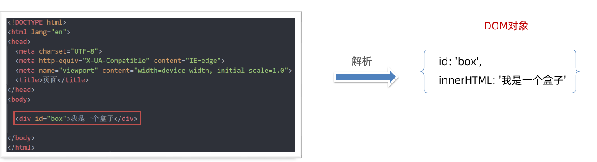
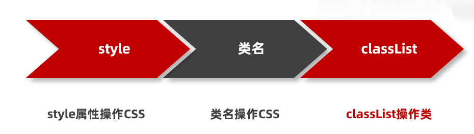
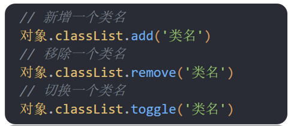

# Web APIs - 第1天笔记

> 掌握DOM属性操作，完成元素内容设置，元素属性设置，控制元素样式

- DOM简介
- 获取DOM元素
- 操作元素内容
- 操作元素属性
- 定时器-间隔函数
- 综合案例


| 描述                        | 属性/方法                         | 效果                         |
| --------------------------- | --------------------------------- | ---------------------------- |
| 获取DOM对象                 | document.querySelector()          | 获取指定的第一个元素         |
| document.querySelectorAll() | 获取指定的所有元素                |                              |
| 操作元素内容                | 元素.innerText                    | 操作元素内容，不解析标签     |
| 元素.innerHTML              | 操作元素内容，解析标签            |                              |
| 操作元素样式                | 元素.style.width                  | 通过style操作样式            |
| 元素.className              | 通过类名操作样式                  |                              |
| 元素.classList.add()        | 增加类名                          |                              |
| 元素.classList.remove()     | 删除类名                          |                              |
| 元素.classList.toggle()     | 切换类名                          |                              |
| 间隔函数                    | setInterval(function()  {}, 1000) | 定时器，每隔指定时间重复执行 |

## 课程介绍

> web APIs 作用：  JavaScript 去操作页面文档和浏览器

### 什么是 API

API: 应用程序接口（Application Programming Interface）

接口：无需关心内部如何实现，程序员只需要调用就可以很方便实现某些功能

## DOM简介

**DOM**（Document Object Model——文档对象模型）

**作用：**DOM用来 操作网页文档，开发网页特效和实现用户交互

DOM的核心思想就是把网页内容当做**对象**来处理，通过对象的属性和方法对网页内容操作

 

### document 对象

是 DOM 里提供的一个对象，是DOM顶级对象

作为网页内容的入口

所以它提供的属性和方法都是用来访问和操作网页内容的

例：document.write()

## 获取DOM对象

### 利用css选择器来获取DOM元素

**语法：**

~~~javascript
const box = document.querySelector('div')
~~~

**参数: **

包含一个或多个有效的CSS选择器 字符串

**返回值：**

CSS选择器匹配的第一个元素对象

如果没有匹配到，则返回 null

~~~javascript
// 利用css选择器来获取DOM元素
// 1. document.querySelector() 选择指定css选择器的第一个元素
// 1.1 参数是字符串的css选择器
const box = document.querySelector('div')
console.log(box)

// 1.2 返回值是dom对象
console.log(typeof box)  // object
console.dir(box)

const box = document.querySelector('.box')
console.log(box)

const li = document.querySelector('ol li')
console.log(li)   // 只选择满足条件的第一个元素li

const li = document.querySelector('ol li:nth-child(2)')
console.log(li)   // 选择第2个小li

// 1.3 如果获取不到则返回 null
const p = document.querySelector('p')
console.log(p)  // null
~~~

### 选择指定css选择器的所有元素

**语法：**

~~~javascript
const lis = document.querySelectorAll('.nav li')
~~~

**参数:**

包含一个或多个有效的CSS选择器 字符串

**返回值：**

CSS选择器匹配的NodeList  伪数组

~~~javascript
// 2. document.querySelectorAll() 选择指定css选择器的所有元素
// 2.1 参数还是字符串的css选择器
const lis = document.querySelectorAll('.nav li')

// 2.2 返回值是一个伪数组里面包含了所有的dom对象 li
console.log(lis)

// 2.3 伪数组
// (1) 有长度和索引号
// (2) 没有数组的一些常用方法 比如 push  pop  splice等方法
// lis.push(1)
// console.log(lis)  // 因为lis是伪数组无法使用push方法所以报错

// 2.4 利用循环遍历伪数组得到里面的每一个元素对象
for (let i = 0; i < lis.length; i++) {
  console.log(lis[i]) // 里面的每一个元素对象
}

// 2.5 即使只有1个元素，我们querySelectorAll 获得的也是一个伪数组，里面只有1个元素而已

const boxs = document.querySelectorAll('.box')
console.log(boxs)
~~~

### 其他方式(了解)

| 语法                   | 实例                                   | 描述                           |
| ---------------------- | -------------------------------------- | ------------------------------ |
| getElementById         | document.getElementById('box')         | 根据id获取元素，单个元素       |
| getElementsByTagName   | document.getElementsByTagName('li')    | 根据标签名获取元素，伪数组     |
| getElementsByClassName | document.getElementsByClassName('one') | 根据类名获取元素，伪数组       |
| getElementsByName      | document.getElementsByName('sex')      | 根据name属性值获取元素，伪数组 |

```javascript
// 1. getElementById   根据id获取
const box = document.getElementById('box')
console.log(box)

// 2. getElementsByClassName   根据类名获取  返回伪数组
const items = document.getElementsByClassName('item')
console.log(items)

// 3. getElementsByTagName  根据标签名获取 返回伪数组
const ps = document.getElementsByTagName('p')
console.log(ps)

// 4. getElementsByName  根据name属性获取 返回伪数组
const inputs = document.getElementsByName('username')
console.log(inputs)

```

## 操作元素内容
DOM对象可以操作页面标签，所以本质上就是操作DOM对象（增删改查）

如果想要操作标签元素的内容，则可以使用如下2种方式：

1.对象.innerText 属性

2.对象.innerHTML 属性

### innerText

1. `innerText` 将文本内容添加/更新到任意标签位置，**文本中包含的标签不会被解析。**

```html
<script>
  // 操作DOM元素内容
  // 1. 对象.innerText 增删改查
  // 1.1 查
  console.log(box.innerText)  // 古丽扎娜
  // 1.2 改
  box.innerText = '迪丽热巴'
  // 1.3 增
  const box1 = document.querySelector('.box1')
  console.log(box1)
  box1.innerText = '佟丽丫丫'
  // 1.4 删  给空字符串可以删除内容
  box.innerText = ''
  box1.innerText = ''
</script>
```

### innerHTML

1. `innerHTML` 将文本内容添加/更新到任意标签位置，**文本中包含的标签会被解析。**

```html
<script>
  // 2. 对象.innerHTML  会解析标签
  box.innerHTML = '<strong>迪丽热巴</strong>'
</script>
```

总结：如果文本内容中包含 `html` 标签时推荐使用 `innerHTML`，否则建议使用 `innerText` 属性。

### 年会抽奖案例

~~~html

<!DOCTYPE html>
<html lang="en">

<head>
  <meta charset="UTF-8" />
  <meta http-equiv="X-UA-Compatible" content="IE=edge" />
  <meta name="viewport" content="width=device-width, initial-scale=1.0" />
  <title>年会抽奖</title>
  <style>
    .wrapper {
      width: 840px;
      height: 420px;
      background: url(./images/bg01.jpg) no-repeat center / cover;
      padding: 100px 250px;
      box-sizing: border-box;
    }

    .wrapper span {
      color: #b10e0d;
    }
  </style>
</head>

<body>
  <div class="wrapper">
    <strong>年会抽奖</strong>
    <h1>一等奖：<span class="one">???</span></h1>
    <h3>二等奖：<span class="two">???</span></h3>
    <h5>三等奖：<span class="three">???</span></h5>
  </div>

  <script>
    // 数组
    const arr = ['迪丽热巴', '古丽扎娜', '佟丽丫丫', '马尔扎哈']
    // 1. 一等奖的做法
    // 1.1 利用随机数选取数组中的名字
    const random = Math.floor(Math.random() * arr.length)
    console.log(random) // 0 ~ 3 之间的随机整数
    console.log(arr[random]) // 随机名字

    // 1.2 把名字放入对应的盒子里面 span
    const one = document.querySelector('.one')
    one.innerText = arr[random]

    // 1.3 不允许重复抽奖，所以要把刚才选出来的名字从数组中删除
    // arr.splice(随机数, 1)  // 可以删除刚才抽取的名字
    arr.splice(random, 1)
    console.log(arr)

    // 2. 二等奖的做法
    // 2.1 利用随机数选取数组中的名字
    const random2 = Math.floor(Math.random() * arr.length)
    console.log(arr[random2]) // 数组里面的名字

    // 2.2 把名字放入对应的盒子里面 span
    const two = document.querySelector('.two')
    two.innerText = arr[random2]

    // 2.3 不允许重复抽奖，所以要把刚才选出来的名字从数组中删除
    arr.splice(random2, 1)
    console.log(arr)

    // 3. 三等奖的做法
    // 3.1 利用随机数选取数组中的名字
    const random3 = Math.floor(Math.random() * arr.length)
    console.log(arr[random3]) // 数组里面的名字

    // 3.2 把名字放入对应的盒子里面 span
    const three = document.querySelector('.three')
    three.innerText = arr[random3]

    // 3.3 不允许重复抽奖，所以要把刚才选出来的名字从数组中删除
    arr.splice(random3, 1)
    console.log(arr)
  </script>
</body>

</html>
~~~

##操作元素属性 

1. 操作元素常用属性
2. 操作元素样式属性
3. 操作 表单元素 属性
4. 自定义属性

### 常用属性修改

可以通过DOM操作元素属性，比如通过 src 更换 图片地址

最常见的属性比如：` href`、`title`、`src` 等等

1. 直接能过属性名修改，最简洁的语法

```html
<script>
  // 1. 先获取这个元素
  const img = document.querySelector('img')
  // 2. 操作DOM元素常见属性
  // 2.1 查
  console.log(img.src)
  // 2.2 改
  img.src = './images/3.png'
  // 2.3 增
  img.title = '我是播仔，我是不是很可爱'
  // 2.4 删
  img.alt = ''
</script>
```

**随机背景案例**

~~~html

<!DOCTYPE html>
<html lang="en">

<head>
  <meta charset="UTF-8">
  <meta http-equiv="X-UA-Compatible" content="IE=edge">
  <meta name="viewport" content="width=device-width, initial-scale=1.0">
  <title>随机显示图片案例</title>
  <style>
    img {
      width: 600px;
    }
  </style>
</head>

<body>
  
  <script>
    // 随机显示图片案例
    // 图片地址
    const arr = [
      './images/1.png',
      './images/2.png',
      './images/3.png',
      './images/4.png'
    ]
    // 获取图片元素
    const img = document.querySelector('img')

    // 1. 利用随机数抽取数组中的一个地址
    const random = Math.floor(Math.random() * arr.length)
    console.log(arr[random]) // 得到图片地址

    // 2. 把地址赋值给图片src属性
    img.src = arr[random]
  </script>
</body>

</html>
~~~


### 操作样式属性

还可以通过 DOM对象修改标签元素的样式属性

- 比如通过 轮播图小圆点自动更换颜色 样式
- 点击按钮可以滚动图片，这是移动的的位置 translateX 等等

#### 通过 style 属性操作元素样式

```html
<script>
  // 通过style操作元素样式
  // 1. 先要获取这个box元素对象
  const box = document.querySelector('.box')

  // 2. 通过style来从操作样式
  box.style.width = '300px'
  box.style.marginTop = '50px'
  box.style.backgroundColor = 'skyblue'

  // 3. 注意事项
  // 3.1 给样式赋值的时候，千万不要忘了加单位比如 300px
  // 3.2 如果有-的样式，我们采取的是小驼峰命名法比如 marginTop
  // 3.3 一定不要忘了加 style 属性
</script>
```

>**注意：**
>
>1.修改样式通过style属性引出
>
>2.如果属性有-连接符，需要转换为小驼峰命名法
>
>3.赋值的时候，需要的时候不要忘记加css单位

#### 操作类名(className) 操作CSS

如果修改的样式比较多，直接通过style属性修改比较繁琐，我们可以通过借助于css类名的形式

**核心：**把多个样式放到css一个类中，然后把这个类添加到这个元素身上

**语法：**

~~~html
<script>
  // 通过类名操作元素样式
  // 1. 获取box盒子
  const box = document.querySelector('.box')
  // 2. 利用类名操作元素样式
  // box.className = 'circle'
  box.className = 'box circle'
  // 3. 利用类名操作样式添加的新的类名会覆盖掉原先的类名
</script>
~~~

>注意：
>
>1.由于class是关键字, 所以使用className去代替
>
>2.className是使用新值换旧值, 如果需要添加一个类,需要保留之前的类名

#### 通过 classList 操作类控制CSS

为了解决className 容易覆盖以前的类名，我们可以通过classList方式追加和删除类名

  

~~~html
<script>
  // 1. 获取box盒子
  const box = document.querySelector('.box')
  // 2.通过classList操作元素样式(推荐)
  // 2.1 追加类名
  // box.classList.add('circle')
  // 2.2 删除类名
  // box.classList.remove('box')
  // 2.3 切换类名： 如果元素身上有这个类名，那么就删除，如果没有这个类名则添加
  box.classList.toggle('circle')
</script>
~~~

### 操作表单元素属性

表单很多情况，也需要修改属性，比如点击眼睛，可以看到密码，本质是把表单类型转换为文本框

正常的有属性有取值的跟其他的标签属性没有任何区别

>**获取:** DOM对象.属性
>
>**设置:** DOM对象.属性= 新值

表单属性中添加就有效果，移除就没有效果，一律使用布尔值表示 

比如实现禁用按钮，勾选按钮等

如果为 `true` 代表添加了该属性 

如果是 `false` 代表移除了该属性

比如： `disabled`、`checked`、`selected`

~~~html
<script>
  // 操作表单属性
  // 1. 操作表单 type 和 value 属性
  // 1.1 修改type属性
  const username = document.querySelector('[name=username]')
  console.log(username)
  // username.type = 'password'

  // 1.2 操作表单的 value 属性
  // console.log(username.value)  // 查
  // username.value = '用户名试试'  // 增
  // username.value = '请输入用户名' // 改
  // username.value = ''  // 删

  // 2. 禁用按钮或者是勾选复选框  布尔型
  // 2.1 禁用按钮  
  const button = document.querySelector('button')
  // button.disabled = true  // true 是禁用
  button.disabled = false  // false 是不禁用

  // 2.2 勾选复选框
  const agree = document.querySelector('[name=agree]')
  console.log(agree)
  // agree.checked = true // true 是选中复选框
  agree.checked = false // flase 是不选中复选框
</script>
~~~

### 自定义属性（重要）

**标准属性:** 标签天生自带的属性 比如class、id、title等, 可以直接使用点语法操作比如：`对象.title`

**自定义属性：**

- 在html5中推出来了专门的data-自定义属性  
- 使用场景：通过自定义属性可以存储数据，后期可以使用这个数据
- 在标签上一律以data-开头
- 在DOM对象上一律以dataset对象方式获取

~~~html
<script>
  // 自定义属性
  // 1. 获取盒子
  const box = document.querySelector('.box')

  // 2. 得到自定义属性值
  // console.log(box.dataset)  // 得到一个对象集合
  // console.log(box.dataset.id) // 1
  // console.log(box.dataset)  // 得到一个对象集合
  console.log(box.dataset.name) // box
</script>
~~~

## 定时器-间隔函数

网页中经常会需要一种功能：每隔一段时间需要自动执行一段代码，不需要我们手动去触发

例如：网页中的`倒计时`

要实现这种需求，需要`定时器函数`

定时器函数有两种:  `间隔函数`和 延迟函数

`setInterval` 是 JavaScript 中内置的函数，它的作用是间隔固定的时间自动重复执行另一个函数，也叫定时器函数。

### 开启定时器:

**语法**

```html
<script>
  setInterval(function () {
    console.log('我是1秒钟执行一次')
  }, 1000)
</script>
```

**作用：**每隔一段时间调用这个函数

**注意：**间隔时间单位是毫秒

### 关闭定时器

需要定时器`变量名`来关闭

返回的是一个唯一的`数字`

~~~html
<script>
  let timer = setInterval(repeat, 1000)  // 注意调用的时候直接写函数名字不需要写小括号
  console.log(timer) //  1
  let timer1 = setInterval(repeat, 1000)  // 注意调用的时候直接写函数名字不需要写小括号
  console.log(timer1) //  2
  // 2. 关闭定时器
  clearInterval(timer)

</script>
~~~

## 综合案例-轮播图定时版

~~~html
<!DOCTYPE html>
<html lang="en">

  <head>
    <meta charset="UTF-8" />
    <meta http-equiv="X-UA-Compatible" content="IE=edge" />
    <meta name="viewport" content="width=device-width, initial-scale=1.0" />
    <title>综合案例-定时版轮播图</title>
    <style>
      * {
        box-sizing: border-box;
      }

      .slider {
        width: 560px;
        height: 400px;
        overflow: hidden;
      }

      .slider-wrapper {
        width: 100%;
        height: 320px;
      }

      .slider-wrapper img {
        width: 100%;
        height: 100%;
        display: block;
      }

      .slider-footer {
        height: 80px;
        background-color: rgb(100, 67, 68);
        padding: 12px 12px 0 12px;
        position: relative;
      }

      .slider-footer .toggle {
        position: absolute;
        right: 0;
        top: 12px;
        display: flex;
      }

      .slider-footer .toggle button {
        margin-right: 12px;
        width: 28px;
        height: 28px;
        appearance: none;
        border: none;
        background: rgba(255, 255, 255, 0.1);
        color: #fff;
        border-radius: 4px;
        cursor: pointer;
      }

      .slider-footer .toggle button:hover {
        background: rgba(255, 255, 255, 0.2);
      }

      .slider-footer p {
        margin: 0;
        color: #fff;
        font-size: 18px;
        margin-bottom: 10px;
      }

      .slider-indicator {
        margin: 0;
        padding: 0;
        list-style: none;
        display: flex;
        align-items: center;
      }

      .slider-indicator li {
        width: 8px;
        height: 8px;
        margin: 4px;
        border-radius: 50%;
        background: #fff;
        opacity: 0.4;
        cursor: pointer;
      }

      .slider-indicator li.active {
        width: 12px;
        height: 12px;
        opacity: 1;
      }
    </style>
  </head>

  <body>
    <div class="slider">
      <div class="slider-wrapper">
        
      </div>
      <div class="slider-footer">
        <p>对人类来说会不会太超前了？</p>
        <ul class="slider-indicator">
          <li class="active"></li>
          <li></li>
          <li></li>
          <li></li>
          <li></li>
          <li></li>
          <li></li>
          <li></li>
        </ul>
        <div class="toggle">
          <button class="prev">&lt;</button>
          <button class="next">&gt;</button>
        </div>
      </div>
    </div>
    <script>
      // 初始数据
      const sliderData = [
        { url: './images/slider01.jpg', title: '对人类来说会不会太超前了？', color: 'rgb(100, 67, 68)' },
        { url: './images/slider02.jpg', title: '开启剑与雪的黑暗传说！', color: 'rgb(43, 35, 26)' },
        { url: './images/slider03.jpg', title: '真正的jo厨出现了！', color: 'rgb(36, 31, 33)' },
        { url: './images/slider04.jpg', title: '李玉刚：让世界通过B站看到东方大国文化', color: 'rgb(139, 98, 66)' },
        { url: './images/slider05.jpg', title: '快来分享你的寒假日常吧~', color: 'rgb(67, 90, 92)' },
        { url: './images/slider06.jpg', title: '哔哩哔哩小年YEAH', color: 'rgb(166, 131, 143)' },
        { url: './images/slider07.jpg', title: '一站式解决你的电脑配置问题！！！', color: 'rgb(53, 29, 25)' },
        { url: './images/slider08.jpg', title: '谁不想和小猫咪贴贴呢！', color: 'rgb(99, 72, 114)' },
      ]
      // 获取元素
      const img = document.querySelector('.slider-wrapper img')
      const p = document.querySelector('.slider-footer p')
      const footer = document.querySelector('.slider-footer')

      // 1. 声明1个变量，利用定时器实现变量++，依次拿到下一个数组中的对象
      // 1.1 声明变量 i 
      let i = 0  // 信号量

      // 1.2 开启定时器实现i++
      setInterval(function () {
        i++
        // 无缝衔接 如果播放到了最后一张 第8张，则快速复原为第1张播放
        // 其实这个8就是数组的长度
        // if (i >= sliderData.length) {
        //   i = 0
        // }

        // 改为三元运算符的写法
        // i = i >= sliderData.length ? 0 : i

        // 利用取余来实现
        i = i % sliderData.length


        console.log(i)
        // 1.3 依次拿到下一个数组中的对象
        // console.log(sliderData[i])

        // 2. 利用对象更换图片、文字、背景颜色、小圆点
        // 2.1 更换图片
        img.src = sliderData[i].url

        // 2.2 更换文字内容
        p.innerText = sliderData[i].title

        // 2.3 更换背景颜色
        footer.style.backgroundColor = sliderData[i].color

        // 2.4 更换小圆点
        // 先把以前的 active 类 移除掉  顺序不能颠倒
        document.querySelector('.slider-indicator .active').classList.remove('active')

        // 添加小圆点
        document.querySelector(`.slider-indicator li:nth-child(${i + 1})`).classList.add('active')

      }, 1000)

    </script>
  </body>

</html>
~~~


# Web APIs -第二天笔记

> 掌握事件绑定处理和事件对象，完成常见网页交互

- 事件监听
- 事件类型
- 事件对象
- 拓展知识
- 综合案例


## 事件监听

以前写的代码都是自动执行的，我们希望一段代码在某个特定的时机才去执行，比如

- 点击按钮可以弹出警示框
- 比如鼠标经过显示下拉菜单等等

### 事件

事件是程序在运行的时候，发生的特定动作或者特定的事情

- 比如`点击`按钮、
- 比如`鼠标经过`菜单等等

通常，当事件发生时，可以做些事情

- 比如点击按钮，可以 `弹出警示框`
- 比如鼠标经过某个盒子，可以`显示下拉菜单`

###  事件监听

事件发生后，想要执行的代码写到`事件处理函数`里面

- 当触发指定的事件时，则事件处理函数就会被执行
- 事件监听是将事件处理函数注册到元素对象身上
- 事件监听也称为: 事件注册、事件绑定

**语法：**

```JavaScript
元素对象.addEventListener('事件类型', 事件处理函数)
```

事件监听三要素

- 事件源(谁被触发了)
- 事件类型  (什么情况下触发，点击还是鼠标经过等)
- 事件处理函数（要做什么事情）

~~~html
<!DOCTYPE html>
<html lang="en">
  <head>
    <meta charset="UTF-8">
    <meta http-equiv="X-UA-Compatible" content="IE=edge">
    <meta name="viewport" content="width=device-width, initial-scale=1.0">
    <title>事件监听</title>
  </head>
  <body>
    <button class="btn">唐伯虎</button>
    <script>
      // 需求： 点击button按钮，页面会弹出一个警示框，内容显示 '秋香'
      // 事件监听语法:
      // 元素对象.addEventListener('事件类型', 事件处理函数)
      // 1. 获取元素对象 button按钮
      const btn = document.querySelector('.btn')
      // 2. 事件监听 
      btn.addEventListener('click', function () {
        alert('秋香')
      })
    </script>
  </body>
</html>
~~~

>**注意：**
>
>1.事件类型要加引号，小写
>
>2.函数是点击之后再去执行，每次点击都会执行一次

### 回调函数

**回调函数:**当一个函数当做`参数`来传递给另外一个函数的时候，这个函数就是回调函数（`回头调用`的函数）

**作用：**完成某些特定任务

~~~html
<script>
  // 1. 定时器间隔函数，里面第一个参数又是函数，这个匿名函数就是回调函数
  setInterval(function () {
    console.log('我是回调函数')
  }, 1000)

  // 2. addEventListener 函数的第二个参数也是函数，这个匿名函数也是回调函数
  btn.addEventListener('click', function () {
    console.log('我是回调函数')
  })
</script>
~~~

### 事件监听版本

1. DOM0 事件

   事件源.on事件类型 = function() { }

   ~~~javascript
   btn.onclick = function () {
     alert('我是弹窗1')
   }
   ~~~

2. DOM 2事件

   事件源.addEventListener(事件类型，事件处理函数)

   ~~~javascript
   btn.addEventListener('click', function () {
     console.log('我是回调函数')
   })
   ~~~

>**区别：**
>
>on 方式同名事件会被覆盖，addEventListener则不会，同时拥有事件更多特性，推荐使用

## 事件类型

将众多的事件类型分类可分为：鼠标事件、键盘事件、表单事件、焦点事件等，我们逐一展开学习。

事件类型的大小写敏感的字符串，统一用小写字母

 

### 鼠标事件

鼠标事件是指跟鼠标操作相关的事件，如单击、经过等。

```html
<body>
  <div class="box"></div>
  <script>
    // 鼠标事件类型
    const box = document.querySelector('.box')
    // 1. 鼠标点击
    box.addEventListener('click', function () {
      console.log('我点击了盒子')
    })
    // 2. 鼠标经过
    box.addEventListener('mouseenter', function () {
      console.log('我鼠标经过了盒子')
    })
    // 3. 鼠标离开
    box.addEventListener('mouseleave', function () {
      console.log('我鼠标离开了盒子')
    })
  </script>
</body>
```

### 焦点事件

主要是针对于表单是否获得光标的事件， 获得焦点  focus 、失去焦点 blur

~~~html
<!DOCTYPE html>
<html lang="en">

  <head>
    <meta charset="UTF-8">
    <meta http-equiv="X-UA-Compatible" content="IE=edge">
    <meta name="viewport" content="width=device-width, initial-scale=1.0">
    <title>焦点事件</title>
    <style>
      [type=text] {
        width: 245px;
        height: 50px;
        padding-left: 20px;
        border: 1px solid #ccc;
        font-size: 17px;
        outline: none;
      }
    </style>
  </head>

  <body>
    <input type="text" class="search-text">
    <input type="text" class="search">
    <script>
      // 1. 焦点事件(手动触发)
      const search_text = document.querySelector('.search-text')
      // 1.1 获得焦点  focus
      search_text.addEventListener('focus', function () {
        console.log('获得了焦点')
      })
      // 1.2 失去焦点 blur
      search_text.addEventListener('blur', function () {
        console.log('失去了焦点')
      })
      // 2. 拓展 自动获得焦点 focus()    自动失去焦点 blur()
      //  2.1 语法: 元素.focus()  比如百度首页搜索框自动获得焦点
      const search = document.querySelector('.search')
      search.focus()
    </script>
  </body>

</html>
~~~


###  键盘事件和 input事件

| 事件    | 触发时机                | 得到表单值            |
| ------- | ----------------------- | --------------------- |
| keydown | 按下键盘时触发          | 不带最后一次按键值 ab |
| keyup   | 弹起键盘时触发          | 输入内容   abc        |
| input   | 表单value发生变化时触发 | 输入内容   abc        |

~~~html
<!DOCTYPE html>
<html lang="en">

<head>
  <meta charset="UTF-8">
  <meta http-equiv="X-UA-Compatible" content="IE=edge">
  <meta name="viewport" content="width=device-width, initial-scale=1.0">
  <title>input事件和键盘事件</title>
  <style>
    textarea {
      width: 300px;
      height: 30px;
      padding: 10px;
      border-color: transparent;
      outline: none;
      resize: none;
      background: #f5f5f5;
      border-radius: 4px;
    }
  </style>
</head>

<body>
  <textarea id="tx" placeholder="发一条友善的评论" rows="2"></textarea>
  <script>
    // 获取元素
    const tx = document.querySelector('#tx')

    // 1. 键盘事件 
    // 1.1 键盘按下事件  keydown  当我们按下键盘的时候就触发
    tx.addEventListener('keydown', function () {
      console.log('我是keydown事件' + tx.value)
    })

    // 1.2 键盘弹起事件  keyup 当我们键盘弹起的时候就触发
    tx.addEventListener('keyup', function () {
      console.log('我是keyup事件' + tx.value)
    })

    // 2. 用户输入事件 input ，是表单value的值发生变化的时候触发
    tx.addEventListener('input', function () {
      console.log('我是input事件' + tx.value)
    })
    // 3. 注意事项
    // 3.1 执行顺序  keydown →  input   →  keyup
    // 3.2 keydown 获取值的时候得不到最后一次按键的值， keyup和input可以得到用户输入内容
  </script>
</body>

</html>
~~~

>**注意事项**
>
>1. 执行顺序  keydown →  input   →  keyup
>2. keydown 获取值的时候得不到最后一次按键的值， keyup和input可以得到用户输入内容

## 事件对象

**事件对象是什么？ **

- 也是个对象，这个对象里有事件触发时的相关信息，包含属性和方法
- 例如：鼠标点击事件中，事件对象就存了鼠标点在哪个位置等信息

**使用场景**

- 可以判断用户按下哪个键，比如按下回车键可以发布新闻
- 可以判断鼠标点击了哪个元素，从而做相应的操作

```html
<body>
  <div class="box"></div>
  <textarea id="tx" placeholder="发一条友善的评论" rows="2"></textarea>
  <script>
    // 事件对象
    const box = document.querySelector('.box')
    box.addEventListener('click', function (e) {
      console.log(e)
    })
    const tx = document.querySelector('#tx')
    tx.addEventListener('keyup', function (e) {
      // e 就是事件对象
      // console.log(e)
      // console.log(e.key)  // a 
      // 用户如果按下的是回车键，则弹出框提示按下了回车键
      if (e.key === 'Enter') {
        alert('您按下了回车键')
      }
    })
  </script>
</body>
```

事件回调函数的【第1个参数】即所谓的事件对象，通常习惯性的将这个对数命名为 `event`、`ev` 、`ev` 。

   

## 环境对象

> 能够分析判断函数运行在不同环境中 this 所指代的对象。

**环境对象：**指的是函数内部特殊的 this,  它指向一个对象，并且受当前环境影响

**作用：**弄清楚this的指向，可以让我们代码更简洁

- 函数的调用方式不同，this 指代的对象也不同
- 【谁调用， this 就是谁】 是判断 this 指向的粗略规则
- 直接调用函数，其实相当于是 window.函数，所以 this 指代 window

```html
<body>
  <button>点击</button>
  <script>
    // 环境对象 this   粗略规则： 谁调用函数，this就指向谁

    // 1. 全局环境
    // console.log(this)  // this 指向 window 全局对象

    // 2. 普通函数
    function fn() {
      console.log(this)  // this 指向 window 全局对象
    }
    window.fn()

    // 3. 对象方法
    const obj = {
      uname: '佩奇',
      sing: function () {
        console.log(this)  // this 指向 obj对象
      }
    }
    obj.sing()

    // 4. 事件
    const btn1 = document.querySelector('button')
    btn1.addEventListener('click', function () {
      // console.log(this)  // this 指向 btn 这个对象
      // btn1.style.backgroundColor = 'pink'
      this.style.backgroundColor = 'pink'
    })
  </script>
</body>
```

## 排他思想

是一种思路，目的是突出显示某个元素

比如，有多个元素，当鼠标经过时，只有当前元素会添加高亮样式，其余的元素移除样式

 

口诀：注意顺序

①：排除其他人

②：保留我自己


# Web APIs - 第3天

> 目标：学习事件流，事件委托，其他事件等知识，优化多个事件绑定和实现常见网页交互

- 事件流
- 移除事件监听
- 其他事件
- 元素尺寸与位置
- 综合案例


## 事件流

**为什么要学习事件流？**

- 可以帮我们解决一些疑惑，比如点击子盒子会会弹出2次的问题

事件流指的是事件完整执行过程中的`流动路径`

当触发事件时，会经历两个阶段，分别是`捕获阶段`、`冒泡阶段`


事件捕获概念：

当一个元素的事件被触发时，会从DOM的根元素开始依次调用同名事件 (从外到里)

### 捕获

事件捕获需要写对应代码才能看到效果

**语法：**

```html
 元素.addEventListener('click', 回调函数， 是否使用捕获)  
```

```html
<body>
  <div class="father">
    父盒子
    <div class="son">子盒子</div>
  </div>
  <script>
    // 事件流
    const father = document.querySelector('.father')
    const son = document.querySelector('.son')
    // 1. 事件捕获
    // // 点击父盒子
     father.addEventListener('click', function () {
       alert('我是爸爸')
     }, true)  // 事件捕获
     // 点击子盒子
     son.addEventListener('click', function () {
       alert('我是儿子')
     }, true) // 事件捕获
  </script>
</body>

```

>说明：
>
>- addEventListener第三个参数传入 true 代表是捕获阶段触发（很少使用）
>- 若传入false代表冒泡阶段触发，默认就是 false

###事件冒泡

 事件冒泡概念: 

当一个元素的事件被触发时，同样的事件将会在该元素的所有祖先元素中依次被触发。这一过程被称为事件冒泡

- 简单理解：当一个元素触发事件后，会依次向上调用所有父级元素的 `同名事件`
- 事件冒泡是`默认`存在的，或者第三个参数传入 `false` 都是冒泡
- `实际工作都是使用事件冒泡为主`

~~~html
<body>
  <div class="father">
    父盒子
    <div class="son">子盒子</div>
  </div>
  <script>
    // 事件流
    const father = document.querySelector('.father')
    const son = document.querySelector('.son')
    // 2. 事件冒泡
    // 点击父盒子
    father.addEventListener('click', function () {
      alert('我是爸爸')
    })
    // 点击子盒子
    son.addEventListener('click', function () {
      alert('我是儿子')
    }, false) 
  </script>
</body>
~~~

### 阻止冒泡

**问题：**因为默认就有冒泡阶段的存在，所以容易导致事件影响到父级元素（祖先元素）

**需求：**若想把事件就限制在当前元素内，就需要阻止事件冒泡

**前提：**

阻止事件冒泡需要拿到`事件对象`

```html
<body>
  <div class="father">
    父盒子
    <div class="son">子盒子</div>
  </div>
  <script>
    // 事件流
    const father = document.querySelector('.father')
    const son = document.querySelector('.son')
    // 1. 事件冒泡
    // 点击父盒子
    father.addEventListener('click', function () {
      alert('我是爸爸')
    })
    // 点击子盒子
    son.addEventListener('click', function (e) {
      alert('我是儿子')
      // 1.1 先获取事件对象
      // 1.2 事件对象.stopPropagation()  注意是个方法 
      e.stopPropagation()
    }) 
  </script>
</body>
```

结论：事件对象中的 `ev.stopPropagation` 方法，专门用来阻止事件冒泡（事件传播）

>鼠标经过事件：
>
>mouseover 和 mouseout 会有冒泡效果
>
>mouseenter  和 mouseleave   没有冒泡效果 (推荐)

### 事件委托

**事件委托(EventDelegation)**：是JavaScript中注册事件的常用技巧，也称为事件委派、事件代理

简单理解：原本需要注册在子元素的事件委托给父元素，让父元素担当事件监听的职务

**为什么要用事件委托呢？**

- 如果同时给多个元素注册事件，还需要利用循环多次注册事件
- 大量的事件监听是比较耗费性能的，如下代码所示

~~~html
<script>
  // 假设页面中有 10000 个 button 元素
  const buttons = document.querySelectorAll('table button');

  for(let i = 0; i <= buttons.length; i++) {
    // 为 10000 个 button 元素添加了事件
    buttons.addEventListener('click', function () {
      // 省略具体执行逻辑...
    })
  }
</script>
~~~

事件委托是利用事件流的特征解决一些开发需求的知识技巧

- 优点：减少注册次数，可以提高程序性能
- 原理：事件委托其实是利用事件冒泡的特点
  - 给父元素注册事件，当我们触发子元素的时候，会冒泡到父元素身上，从而触发父元素的事件

利用事件委托方式如何得到当前点击的元素呢？

- 实现：事件对象.target. tagName 可以获得真正触发事件的元素

```html
<body>
  <ul>
    <li>第1个孩子</li>
    <li>第2个孩子</li>
    <li>第3个孩子</li>
    <li>第4个孩子</li>
    <li>第5个孩子</li>
  </ul>
  <script>
    // 需求： 点击每个小li都会有弹窗效果
    // 1. 获取父元素ul
    const ul = document.querySelector('ul')

    // 2. 给ul注册点击事件
    ul.addEventListener('click', function (e) {
      // alert('我会弹窗')
      // 3. 利用事件对象.target 得到目标元素
      // console.log(e.target)
      // e.target.style.color = 'pink'

      // 需求2：点击哪个小li，对应的li变色
      // console.dir(e.target.tagName) 可以得到目标元素的标签名
      if (e.target.tagName === 'LI') {
        e.target.style.color = 'pink'
      }
    })
  </script>
```

### 阻止默认行为

阻止元素发生默认的行为

例如：

- 当点击提交按钮时阻止对表单的提交
- 阻止链接的跳转等等

**语法：**

~~~javascript
事件对象.preventDefault()
~~~

~~~html
<body>
  <form action="">
    姓名: <input type="text" name="username">
    <button>提交</button>
  </form>
  <a href="http://www.baidu.com">点击跳转</a>
  <script>
    // 阻止默认行为
    const form = document.querySelector('form')
    const input = document.querySelector('[name=username]')
    form.addEventListener('submit', function (e) {
      // 如果input表单的值为空则不允许提交
      if (input.value === '') {
        // return 无法阻止提交事件
        e.preventDefault()  // 阻止提交事件
      }
    })

    document.querySelector('a').addEventListener('click', function (e) {
      e.preventDefault()
    })
  </script>
</body>
~~~

## 事件解绑（了解）

移除事件处理函数，也称为解绑事件

~~~html
<body>
  <button class="l2">移除L2事件监听</button>
  <button class="l0">移除L0事件监听</button>
  <script>
    // 需求：按钮就点击一次，然后移除点击事件

    // 1. l2事件监听
    const l2 = document.querySelector('.l2')

    l2.addEventListener('click', fn)
    function fn() {
      alert('我点击了')
      // 移除事件监听
      l2.removeEventListener('click', fn)
    }

    // 2. l0事件监听
    const l0 = document.querySelector('.l0')
    l0.onclick = function () {
      alert('我点击了')
      // 移除事件监听
      l0.onclick = null
    }
  </script>
</body>
~~~

## 其他事件

### 页面加载事件

加载外部资源（如图片、外联CSS和JavaScript等）加载完毕时触发的事件

为什么要学？

- 有些时候需要等页面资源全部处理完了做一些事情
- 老代码喜欢把 script 写在 head 中，这时候直接找 dom 元素找不到

**事件名：load**

监听页面所有资源加载完毕：

~~~javascript
window.addEventListener('load', function() {
    // xxxxx
})
~~~

当初始的 HTML 文档被完全加载和解析完成之后就触发，而无需等待样式表、图像等完全加载

**事件名：DOMContentLoaded**

~~~javascript
document.addEventListener('DOMContentLoaded', function() {
    // xxxxx
})
~~~

### 元素滚动事件

滚动条在滚动的时候持续触发的事件

为什么要学？

- 很多网页需要检测用户把页面滚动到某个区域后做一些处理，比如固定导航栏，比如返回顶部

**事件名：scroll**

监听整个页面滚动：

~~~javascript
window.addEventListener('scroll', function() {
    // xxxxx
})
~~~

>scrollTop / scrollLeft, 被卷去的头部或者左侧，可以读取，也可以修改（赋值）

### 页面尺寸事件

会在窗口尺寸改变的时候触发事件：

~~~javascript
window.addEventListener('resize', function() {
    // xxxxx
})
~~~

>clientWidth和clientHeight，获取元素的可见部分宽高（不包含border，margin，滚动条等）

## 元素尺寸与位置

获取元素的自身宽高、包含元素自身设置的宽高、padding、border


# Web APIs - 第4天笔记

> 目标: 了解DOM节点的增删改查，掌握利用数据操作页面，完成移动端通讯录案例

- 日期对象
- 节点操作
- M端事件
- JS插件
- 综合案例


## 日期对象


日期对象：用来表示日期和时间的对象

作用：可以得到当前系统日期和时间

Date是JavaScript内置对象

日期对象使用必须先`实例化`：创建一个日期对象并获取时间

在代码中发现了 `new` 关键字时，一般将这个操作称为实例化

### 实例化

~~~javascript
<body>
  <script>
    // 1. 实例化日期对象
    // 1.1 得到当前的日期和时间
    const date = new Date()
    console.log(date)

    // 1.2 得到指定的日期和时间
    const date1 = new Date('2099-12-12 08:08:08')
    console.log(date1)
  </script>
</body>
~~~

### 格式化日期对象

| 方法          | 作用               | 说明                 |
| ------------- | ------------------ | -------------------- |
| getFullYear() | 获得年份           | 获取四位年份         |
| getMonth()    | 获得月份           | 取值为 0 ~ 11        |
| getDate()     | 获取月份中的每一天 | 不同月份取值也不相同 |
| getDay()      | 获取星期           | 取值为 0 ~ 6         |
| getHours()    | 获取小时           | 取值为 0 ~ 23        |
| getMinutes()  | 获取分钟           | 取值为 0 ~ 59        |
| getSeconds()  | 获取秒             | 取值为 0 ~ 59        |

 ~~~javascript
<body>
  <script>
    // 2. 格式化日期对象-转换成开发中常见的日期和时间格式
    const myDate = new Date()
    console.log(myDate.getFullYear()) // 得到年份 数字型的 2023
    console.log(myDate.getMonth() + 1) // 得到月份 数字型的 0 需要加1
    console.log(myDate.getDate()) // 得到几号 数字型的 27 
    console.log(myDate.getDay()) // 得到星期  数字型 5 
    console.log(myDate.getHours()) // 得到小时
    console.log(myDate.getMinutes()) // 得到分钟
    console.log(myDate.getSeconds()) // 得到秒数
    console.log(`现在的日期是:${myDate.getFullYear()}年${myDate.getMonth() + 1}月${myDate.getDate()}日`)

  </script>
</body>
 ~~~

### 格式化日期对象另外方法

| 方法                 | 作用                                     | 说明               |
| -------------------- | ---------------------------------------- | ------------------ |
| toLocaleString()     | 返回该日期对象的字符串（包含日期和时间） | 2099/9/20 18:30:43 |
| toLocaleDateString() | 返回日期对象日期部分的字符串             | 2099/9/20          |
| toLocaleTimeString() | 返回日期对象时间部分的字符串             | 18:30:43           |

~~~html
<body>
  <div class="box"></div>
  <script>

    const date = new Date()
    console.log(date.toLocaleString())  // 2023/1/27 23:19:20
    console.log(date.toLocaleDateString())  // 2023/1/27 
    console.log(date.toLocaleTimeString())  // 23:19:20

    // 1. 封装一个 getDateTime函数，里面格式化时间对象
    function getDateTime() {
      const date = new Date()

      return date.toLocaleString()
    }
    // 注意： 先写上这句话，防止盒子有1秒的空白期
    document.querySelector('.box').innerText = getDateTime()
    // 3. 显示到box盒子里面，并且添加定时器
    setInterval(function () {
      document.querySelector('.box').innerText = getDateTime()
    }, 1000)
  </script>
</body>
~~~

### 时间戳

什么是时间戳:

- 是指1970年01月01日00时00分00秒起至现在的总毫秒数(数字型)，它是一种特殊的计量时间的方式

**使用场景：** 计算倒计时效果，需要借助于时间戳完成

算法：

- 将来的时间戳  -  现在的时间戳  =  剩余时间毫秒数  
- 剩余时间毫秒数转换为年月日时分秒就是倒计时时间

~~~javascript
    // 1. 实例化
  const date = new Date()
  // 2. 获取时间戳
  console.log(date.getTime())
// 还有一种获取时间戳的方法
  console.log(+new Date())
  // 还有一种获取时间戳的方法
  console.log(Date.now())

~~~


获取时间戳的方法，分别为 getTime 和 Date.now 和  +new Date()

## DOM 节点

**DOM树：**DOM 将 HTML文档以树状结构直观的表现出来，我们称之为 DOM 树 或者 节点树

**节点（Node）**是DOM树(节点树)中的单个点。包括文档本身、元素、文本以及注释都属于是节点。

- `元素节点`（重点）
  - 所有的标签 比如 body、 div
  - html 是根节点
- 属性节点
  - 所有的属性 比如 href
- 文本节点
  - 所有的文本  

 

### 查找节点

利用节点关系查找节点，返回的都是对象

- 父节点
- 子节点
- 兄弟节点

有了查找节点可以使我们选择元素更加方便

#### 父节点

语法：

~~~JavaScript
元素.parentNode
~~~

~~~html
<body>
  <div class="pop">
    <a href="javascript:;" class="close"></a>
  </div>
  <script>
    // 点击关闭按钮可以关闭父盒子
    const closeBtn = document.querySelector('.close')
    // 利用孩子选取父节点,返回的也是一个元素对象
    console.log(closeBtn.parentNode)
    closeBtn.addEventListener('click', function () {
      this.parentNode.style.display = 'none'
    })
  </script>
</body>
~~~

#### 子节点

**语法:**

~~~javascript
父元素.children
~~~

~~~html
<body>
  <ul>
    <li>我是第1个孩子</li>
    <li>我是第2个孩子</li>
    <li>我是第3个孩子</li>
    <li>我是第4个孩子</li>
  </ul>
  <script>
    // 1. 查询子节点
    const ul = document.querySelector('ul')
    console.log(ul.children)

    // 2. 查询兄弟节点
    const li2 = document.querySelector('ul li:nth-child(2)')
    // console.log(li2)
    console.log(li2.previousElementSibling) // 上一个兄弟
    console.log(li2.nextElementSibling)  // 下一个兄弟
    console.log(ul.children[0]) // 第一个孩子
    console.log(ul.children[2]) // 第三个孩子
  </script>
</body>
~~~

#### 兄弟节点

~~~html
<body>
  <ul>
    <li>我是第1个孩子</li>
    <li>我是第2个孩子</li>
    <li>我是第3个孩子</li>
    <li>我是第4个孩子</li>
  </ul>
  <script>
    // 2. 查询兄弟节点
    const li2 = document.querySelector('ul li:nth-child(2)')
    // console.log(li2)
    console.log(li2.previousElementSibling) // 上一个兄弟
    console.log(li2.nextElementSibling)  // 下一个兄弟
    console.log(ul.children[0]) // 第一个孩子
    console.log(ul.children[2]) // 第三个孩子
  </script>
</body>
~~~

### 增加节点

很多情况下，我们需要在页面中增加元素

- 比如，点击发布按钮，可以新增一条信息

一般情况下，我们新增节点，按照如下操作：

- 创建一个新的节点
- 把创建的新的节点放入到指定的元素内部

1. 父元素最后一个子节点之后，插入节点元素

   ~~~javascript
   element.append()
   ~~~

2. 父元素第一个子元素的之前，插入节点元素

   ~~~javascript
   element.prepend()
   ~~~

如下代码演示：

```html
<body>
  <ul>
    <li>我是小li</li>
  </ul>
  <script>
    // 1. 创建节点
    const li = document.createElement('li')
    li.innerHTML = '我是放到后面的'
    console.log(li)

    // 2. 追加给父元素
    const ul = document.querySelector('ul')
    // 2.1 append 放到ul 的最后面 类似css的 after伪元素
    ul.append(li)
    // 2.2 prepend放到 ul 的最前面 类似css的 before伪元素
    const firstli = document.createElement('li')
    firstli.innerHTML = '我是放到前面的'
    ul.prepend(firstli)
  </script>
</body>
```

### 删除节点

若一个节点在页面中已不需要时，可以删除它

**语法：**

~~~JavaScript
element.remove()
~~~

>1. 把对象从它所属的 DOM 树中删除
>2. 删除节点和隐藏节点（display:none） 有区别的： 隐藏节点还是存在的，但是删除，则从DOM树中删除

```html
<!DOCTYPE html>
<html lang="en">

  <head>
    <meta charset="UTF-8">
    <meta http-equiv="X-UA-Compatible" content="IE=edge">
    <meta name="viewport" content="width=device-width, initial-scale=1.0">
    <title>删除节点</title>
  </head>

  <body>
    <div class="remove">我要删除</div>
    <div class="none">我要隐藏</div>
    <script>
      // 1. 删除节点, remove 会从dom树中删除这个元素
      const remove = document.querySelector('.remove')
      remove.remove()

      // 2. display:none 隐藏元素，页面看不见，但是dom树中还存在这个标签
      const none = document.querySelector('.none')
      none.style.display = 'none'
    </script>
  </body>

</html>
```

## M端事件

M端(移动端)有自己独特的地方。比如`触屏事件 touch`（也称触摸事件），Android 和 IOS都有。

touch 对象代表一个触摸点。触摸点可能是一根手指，也可能是一根触摸笔。触屏事件可响应用户手指（或触控笔）对屏幕或者触控板操作。

常见的触屏事件如下：


~~~javascript
<body>
  <div class="box"></div>
  <script>
    // 触摸事件
    const box = document.querySelector('.box')
    // 1. 手指触屏开始事件 touchstart
    box.addEventListener('touchstart', function () {
      console.log('我开始摸了')
    })
    // 2. 手指触屏滑动事件 touchmove
    box.addEventListener('touchmove', function () {
      console.log('我一直摸')
    })

    // 3. 手指触屏结束事件  touchend
    box.addEventListener('touchend', function () {
      console.log('我摸完了')
    })
  </script>
</body>
~~~

## JS插件

插件: 就是别人写好的一些代码,我们只需要复制对应的代码,就可以直接实现对应的效果

学习插件的思路：

1.看官网。了解这个插件可以完成什么需求           https://www.swiper.com.cn/ 

2.查看基本使用流程 。     https://www.swiper.com.cn/usage/index.html

3.写个小demo。看在线演示,找到符合自己需求的demo      https://www.swiper.com.cn/demo/index.html

4.应用的开发中。

### AlloyFinger 

AlloyFinger 是腾讯 AlloyTeam 团队开源的超轻量级 Web 手势插件，为元素注册各种手势事件

github地址：<https://github.com/AlloyTeam/AlloyFinger>

使用步骤：

1. 下载js库：<http://alloyteam.github.io/AlloyFinger/alloy_finger.js>
2. 将AlloyFinger库引入当前文件：<scriptsrc="alloy_finger.js"></script> 

​    或者使用在线地址：<script src="<https://unpkg.com/alloyfinger@0.1.16/alloy_finger.js>"></script>

3. 配置

   ~~~javascript
   new AlloyFinger(element, {  // element 是给哪个元素做滑动事件
     swipe: function (e) {
       // 滑动的时候要做的事情 e.direction 可以判断上下左右滑动 Left  Right 等
     }
   })
   ~~~

## 综合案例

### 遍历数组forEach

~~~JavaScript
arr.forEach(function (element, index) { /* … */ })
~~~

- element是数组元素
- index是数组元素的索引号

### 字符串截取

~~~JavaScript
字符串.substring(起始索引号, [结束索引号])
~~~

### 思想转变（相当重要）

本次案例，我们尽量减少dom操作，采取`操作数据`的形式，为了后期Vue做铺垫

增加和删除都是针对于`数组的操作`，然后根据`数组数据渲染页面`（数据驱动视图）

**事件委托的两个重要作用：**

1. 减少了注册次数
2. 给新增元素注册事件


# Web APIs - 第5天笔记

> 目标： 能够利用JS操作浏览器,具备利用本地存储实现学生就业表的能力

- BOM操作
- 综合案例


## js组成

JavaScript的组成

- ECMAScript:
  - 规定了js基础语法核心知识。
  - 比如：变量、分支语句、循环语句、对象等等


- Web APIs :
  - DOM   文档对象模型， 定义了一套操作HTML文档的API
  - BOM   浏览器对象模型，定义了一套操作浏览器窗口的API

 

## window对象

**BOM** (Browser Object Model ) 是浏览器对象模型

- window对象是一个全局对象，也可以说是JavaScript中的顶级对象
- 像document、alert()、console.log()这些都是window的属性，基本BOM的属性和方法都是window的
- 所有通过var定义在全局作用域中的变量、函数都会变成window对象的属性和方法
- window对象下的属性和方法调用的时候可以省略window

 

## 定时器-延迟函数

JavaScript 内置的一个用来让代码延迟执行的函数，叫 setTimeout

**语法：**

~~~JavaScript
setTimeout(回调函数, 延迟时间)
~~~

setTimeout 仅仅只执行一次，所以可以理解为就是把一段代码延迟执行, 平时省略window

间歇函数 setInterval : 每隔一段时间就执行一次， , 平时省略window

清除延时函数：

~~~JavaScript
clearTimeout(timerId)
~~~

>注意点
>
>1. 延时函数需要等待,所以后面的代码先执行
>2. 返回值是一个正整数，表示定时器的编号

~~~html
<body>
  <script>
    // 定时器之延迟函数

    // 1. 开启延迟函数
    let timerId = setTimeout(function () {
      console.log('我只执行一次')
    }, 3000)

    // 1.1 延迟函数返回的还是一个正整数数字，表示延迟函数的编号
    console.log(timerId)

    // 1.2 延迟函数需要等待时间，所以下面的代码优先执行

    // 2. 关闭延迟函数
    clearTimeout(timerId)

  </script>
</body>
~~~

## location对象 

location (地址) 它拆分并保存了 URL 地址的各个组成部分， 它是一个对象

| 属性/方法 | 说明                                                 |
| --------- | ---------------------------------------------------- |
| href      | 属性，获取完整的 URL 地址，赋值时用于地址的跳转      |
| search    | 属性，获取地址中携带的参数，符号 ？后面部分          |
| hash      | 属性，获取地址中的啥希值，符号 # 后面部分            |
| reload()  | 方法，用来刷新当前页面，传入参数 true 时表示强制刷新 |

~~~html
<body>
  <form>
    <input type="text" name="search"> <button>搜索</button>
  </form>
  <a href="#/music">音乐</a>
  <a href="#/download">下载</a>

  <button class="reload">刷新页面</button>
  <script>
    // location 对象  
    // 1. href属性 （重点） 得到完整地址，赋值则是跳转到新地址
    console.log(location.href)
    // location.href = 'http://www.itcast.cn'

    // 2. search属性  得到 ? 后面的地址 
    console.log(location.search)  // ?search=笔记本

    // 3. hash属性  得到 # 后面的地址
    console.log(location.hash)

    // 4. reload 方法  刷新页面
    const btn = document.querySelector('.reload')
    btn.addEventListener('click', function () {
      // location.reload() // 页面刷新
      location.reload(true) // 强制页面刷新 ctrl+f5
    })
  </script>
</body>
~~~

## navigator对象

navigator是对象，该对象下记录了浏览器自身的相关信息

常用属性和方法：

- 通过 userAgent 检测浏览器的版本及平台

~~~javascript
// 检测 userAgent（浏览器信息）
(function () {
  const userAgent = navigator.userAgent
  // 验证是否为Android或iPhone
  const android = userAgent.match(/(Android);?[\s\/]+([\d.]+)?/)
  const iphone = userAgent.match(/(iPhone\sOS)\s([\d_]+)/)
  // 如果是Android或iPhone，则跳转至移动站点
  if (android || iphone) {
    location.href = 'http://m.itcast.cn'
  }})();
~~~

## histroy对象

history (历史)是对象，主要管理历史记录， 该对象与浏览器地址栏的操作相对应，如前进、后退等

**使用场景**

history对象一般在实际开发中比较少用，但是会在一些OA 办公系统中见到。

 

常见方法：

 

~~~html
<body>
  <button class="back">←后退</button>
  <button class="forward">前进→</button>
  <script>
    // histroy对象

    // 1.前进
    const forward = document.querySelector('.forward')
    forward.addEventListener('click', function () {
      // history.forward() 
      history.go(1)
    })
    // 2.后退
    const back = document.querySelector('.back')
    back.addEventListener('click', function () {
      // history.back()
      history.go(-1)
    })
  </script>
</body>

~~~

## 本地存储（今日重点）

本地存储：将数据存储在本地浏览器中

常见的使用场景：

<https://todomvc.com/examples/vanilla-es6/>    页面刷新数据不丢失

好处：

1、页面刷新或者关闭不丢失数据，实现数据持久化

2、容量较大，sessionStorage和 localStorage 约 5M 左右

###  localStorage（重点）

**作用:** 数据可以长期保留在本地浏览器中，刷新页面和关闭页面，数据也不会丢失

**特性：**以键值对的形式存储，并且存储的是字符串， 省略了window


~~~html
<!DOCTYPE html>
<html lang="en">

<head>
  <meta charset="UTF-8">
  <meta http-equiv="X-UA-Compatible" content="IE=edge">
  <meta name="viewport" content="width=device-width, initial-scale=1.0">
  <title>本地存储-localstorage</title>
</head>

<body>
  <script>
    // 本地存储 - localstorage 存储的是字符串 
    // 1. 存储
    localStorage.setItem('age', 18)

    // 2. 获取
    console.log(typeof localStorage.getItem('age'))

    // 3. 删除
    localStorage.removeItem('age')
  </script>
</body>

</html>
~~~

### sessionStorage（了解）

特性：

- 用法跟localStorage基本相同
- 区别是：当页面浏览器被关闭时，存储在 sessionStorage 的数据会被清除

存储：sessionStorage.setItem(key,value)

获取：sessionStorage.getItem(key)

删除：sessionStorage.removeItem(key)

### localStorage 存储复杂数据类型

**问题：**本地只能存储字符串,无法存储复杂数据类型.

**解决：**需要将复杂数据类型转换成 JSON字符串,在存储到本地

**语法：**JSON.stringify(复杂数据类型)

JSON字符串：

- 首先是1个字符串
- 属性名使用双引号引起来，不能单引号
- 属性值如果是字符串型也必须双引号

~~~html
<body>
  <script>
    // 本地存储复杂数据类型
    const goods = {
      name: '小米',
      price: 1999
    }
    // localStorage.setItem('goods', goods)
    // console.log(localStorage.getItem('goods'))

    // 1. 把对象转换为JSON字符串  JSON.stringify
    localStorage.setItem('goods', JSON.stringify(goods))
    // console.log(typeof localStorage.getItem('goods'))

  </script>
</body>
~~~


**问题：**因为本地存储里面取出来的是字符串，不是对象，无法直接使用

**解决： **把取出来的字符串转换为对象

**语法：**JSON.parse(JSON字符串)

~~~html
<body>
  <script>
    // 本地存储复杂数据类型
    const goods = {
      name: '小米',
      price: 1999
    }
    // localStorage.setItem('goods', goods)
    // console.log(localStorage.getItem('goods'))

    // 1. 把对象转换为JSON字符串  JSON.stringify
    localStorage.setItem('goods', JSON.stringify(goods))
    // console.log(typeof localStorage.getItem('goods'))

    // 2. 把JSON字符串转换为对象  JSON.parse
    console.log(JSON.parse(localStorage.getItem('goods')))

  </script>
</body>
~~~

## 综合案例

### 数组map 方法

**使用场景：**

map 可以遍历数组处理数据，并且返回新的数组

**语法：**

~~~javascript
<body>
  <script>
  const arr = ['red', 'blue', 'pink']
  // 1. 数组 map方法 处理数据并且 返回一个数组
   const newArr = arr.map(function (ele, index) {
    // console.log(ele)  // 数组元素
    // console.log(index) // 索引号
    return ele + '颜色'
	})
console.log(newArr)
</script>
</body>
~~~

>map 也称为映射。映射是个术语，指两个元素的集之间元素相互“对应”的关系。
>
>map重点在于有返回值，forEach没有返回值（undefined）

### 数组join方法

**作用：**join() 方法用于把数组中的所有元素转换一个字符串

**语法：**

~~~html
<body>
  <script>
    const arr = ['red', 'blue', 'pink']

    // 1. 数组 map方法 处理数据并且 返回一个数组
    const newArr = arr.map(function (ele, index) {
      // console.log(ele)  // 数组元素
      // console.log(index) // 索引号
      return ele + '颜色'
    })
    console.log(newArr)

    // 2. 数组join方法  把数组转换为字符串
    // 小括号为空则逗号分割
    console.log(newArr.join())  // red颜色,blue颜色,pink颜色
    // 小括号是空字符串，则元素之间没有分隔符
    console.log(newArr.join(''))  //red颜色blue颜色pink颜色
    console.log(newArr.join('|'))  //red颜色|blue颜色|pink颜色
  </script>
</body>
~~~


# Web APIs - 第6天笔记

> 目标：能够利用正则表达式完成小兔鲜注册页面的表单验证，具备常见的表单验证能力

- 正则表达式
- 综合案例
- 阶段案例


## 正则表达式

**正则表达式**（Regular Expression）是一种字符串匹配的模式（规则）

**使用场景：**

- 例如验证表单：手机号表单要求用户只能输入11位的数字 (匹配)
- 过滤掉页面内容中的一些敏感词(替换)，或从字符串中获取我们想要的特定部分(提取)等 

 


### 正则基本使用

1. 定义规则

   ~~~JavaScript
   const reg =  /表达式/
   ~~~

   - 其中` /   / `是正则表达式字面量
   - 正则表达式也是`对象 `

2. 使用正则

   - `test()方法`   用来查看正则表达式与指定的字符串是否匹配
   - 如果正则表达式与指定的字符串匹配 ，返回`true`，否则`false`

~~~html
<body>
  <script>
    // 正则表达式的基本使用
    const str = 'web前端开发'
    // 1. 定义规则
    const reg = /web/

    // 2. 使用正则  test()
    console.log(reg.test(str))  // true  如果符合规则匹配上则返回true
    console.log(reg.test('java开发'))  // false  如果不符合规则匹配上则返回 false
  </script>
</body>
~~~

### 元字符

1. **普通字符:**

- 大多数的字符仅能够描述它们本身，这些字符称作普通字符，例如所有的字母和数字。
- 普通字符只能够匹配字符串中与它们相同的字符。    
- 比如，规定用户只能输入英文26个英文字母，普通字符的话  /[abcdefghijklmnopqrstuvwxyz]/

2. **元字符(特殊字符）**

- 是一些具有特殊含义的字符，可以极大提高了灵活性和强大的匹配功能。
- 比如，规定用户只能输入英文26个英文字母，换成元字符写法： /[a-z]/  

#### 边界符

正则表达式中的边界符（位置符）用来提示字符所处的位置，主要有两个字符


>如果 ^ 和 $ 在一起，表示必须是精确匹配

~~~html
<body>
  <script>
    // 元字符之边界符
    // 1. 匹配开头的位置 ^
    const reg = /^web/
    console.log(reg.test('web前端'))  // true
    console.log(reg.test('前端web'))  // false
    console.log(reg.test('前端web学习'))  // false
    console.log(reg.test('we'))  // false

    // 2. 匹配结束的位置 $
    const reg1 = /web$/
    console.log(reg1.test('web前端'))  //  false
    console.log(reg1.test('前端web'))  // true
    console.log(reg1.test('前端web学习'))  // false
    console.log(reg1.test('we'))  // false  

    // 3. 精确匹配 ^ $
    const reg2 = /^web$/
    console.log(reg2.test('web前端'))  //  false
    console.log(reg2.test('前端web'))  // false
    console.log(reg2.test('前端web学习'))  // false
    console.log(reg2.test('we'))  // false 
    console.log(reg2.test('web'))  // true
    console.log(reg2.test('webweb'))  // flase 
  </script>
</body>
~~~

#### 量词

量词用来设定某个模式重复次数


> 注意： 逗号左右两侧千万不要出现空格

~~~html
<body>
  <script>
    // 元字符之量词
    // 1. * 重复次数 >= 0 次
    const reg1 = /^w*$/
    console.log(reg1.test(''))  // true
    console.log(reg1.test('w'))  // true
    console.log(reg1.test('ww'))  // true
    console.log('-----------------------')

    // 2. + 重复次数 >= 1 次
    const reg2 = /^w+$/
    console.log(reg2.test(''))  // false
    console.log(reg2.test('w'))  // true
    console.log(reg2.test('ww'))  // true
    console.log('-----------------------')

    // 3. ? 重复次数  0 || 1 
    const reg3 = /^w?$/
    console.log(reg3.test(''))  // true
    console.log(reg3.test('w'))  // true
    console.log(reg3.test('ww'))  // false
    console.log('-----------------------')


    // 4. {n} 重复 n 次
    const reg4 = /^w{3}$/
    console.log(reg4.test(''))  // false
    console.log(reg4.test('w'))  // flase
    console.log(reg4.test('ww'))  // false
    console.log(reg4.test('www'))  // true
    console.log(reg4.test('wwww'))  // false
    console.log('-----------------------')

    // 5. {n,} 重复次数 >= n 
    const reg5 = /^w{2,}$/
    console.log(reg5.test(''))  // false
    console.log(reg5.test('w'))  // false
    console.log(reg5.test('ww'))  // true
    console.log(reg5.test('www'))  // true
    console.log('-----------------------')

    // 6. {n,m}   n =< 重复次数 <= m
    const reg6 = /^w{2,4}$/
    console.log(reg6.test('w'))  // false
    console.log(reg6.test('ww'))  // true
    console.log(reg6.test('www'))  // true
    console.log(reg6.test('wwww'))  // true
    console.log(reg6.test('wwwww'))  // false

    // 7. 注意事项： 逗号两侧千万不要加空格否则会匹配失败

  </script>
~~~

#### 范围

表示字符的范围，定义的规则限定在某个范围，比如只能是英文字母，或者数字等等，用表示范围

 

~~~html
<body>
  <script>
    // 元字符之范围  []  
    // 1. [abc] 匹配包含的单个字符， 多选1
    const reg1 = /^[abc]$/
    console.log(reg1.test('a'))  // true
    console.log(reg1.test('b'))  // true
    console.log(reg1.test('c'))  // true
    console.log(reg1.test('d'))  // false
    console.log(reg1.test('ab'))  // false

    // 2. [a-z] 连字符 单个
    const reg2 = /^[a-z]$/
    console.log(reg2.test('a'))  // true
    console.log(reg2.test('p'))  // true
    console.log(reg2.test('0'))  // false
    console.log(reg2.test('A'))  // false
    // 想要包含小写字母，大写字母 ，数字
    const reg3 = /^[a-zA-Z0-9]$/
    console.log(reg3.test('B'))  // true
    console.log(reg3.test('b'))  // true
    console.log(reg3.test(9))  // true
    console.log(reg3.test(','))  // flase

    // 用户名可以输入英文字母，数字，可以加下划线，要求 6~16位
    const reg4 = /^[a-zA-Z0-9_]{6,16}$/
    console.log(reg4.test('abcd1'))  // false 
    console.log(reg4.test('abcd12'))  // true
    console.log(reg4.test('ABcd12'))  // true
    console.log(reg4.test('ABcd12_'))  // true

    // 3. [^a-z] 取反符
    const reg5 = /^[^a-z]$/
    console.log(reg5.test('a'))  // false 
    console.log(reg5.test('A'))  // true
    console.log(reg5.test(8))  // true

  </script>
</body>
~~~

#### 字符类

某些常见模式的简写方式，区分字母和数字


 

## 替换和修饰符

replace 替换方法，可以完成字符的替换

 

~~~html
<body>
  <script>
    // 替换和修饰符
    const str = '欢迎大家学习前端，相信大家一定能学好前端，都成为前端大神'
    // 1. 替换  replace  需求：把前端替换为 web
    // 1.1 replace 返回值是替换完毕的字符串
    // const strEnd = str.replace(/前端/, 'web') 只能替换一个
  </script>
</body>
~~~

修饰符约束正则执行的某些细节行为，如是否区分大小写、是否支持多行匹配等

- i 是单词 ignore 的缩写，正则匹配时字母不区分大小写
- g 是单词 global 的缩写，匹配所有满足正则表达式的结果

~~~html
<body>
  <script>
    // 替换和修饰符
    const str = '欢迎大家学习前端，相信大家一定能学好前端，都成为前端大神'
    // 1. 替换  replace  需求：把前端替换为 web
    // 1.1 replace 返回值是替换完毕的字符串
    // const strEnd = str.replace(/前端/, 'web') 只能替换一个

    // 2. 修饰符 g 全部替换
    const strEnd = str.replace(/前端/g, 'web')
    console.log(strEnd) 
  </script>
</body>
~~~

## 正则插件

 


## change 事件

给input注册 change 事件，值被修改并且失去焦点后触发

## 判断是否有类

 

元素.classList.contains() 看看有没有包含某个类，如果有则返回true，么有则返回false


