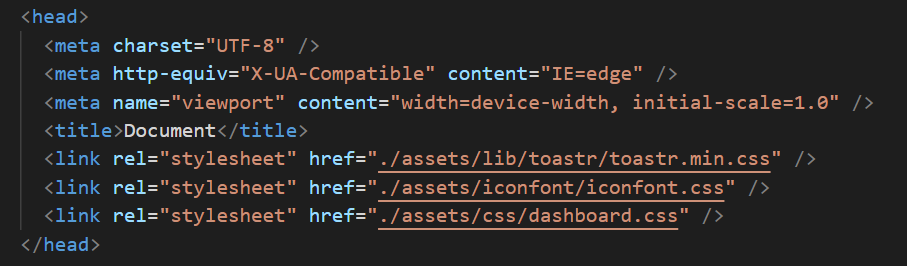
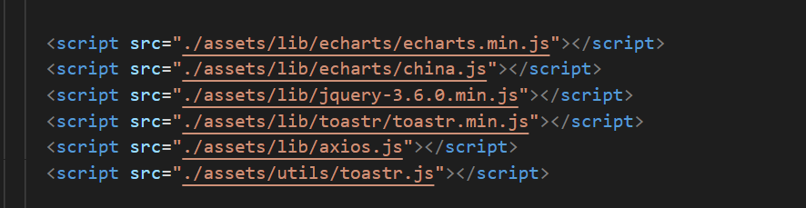
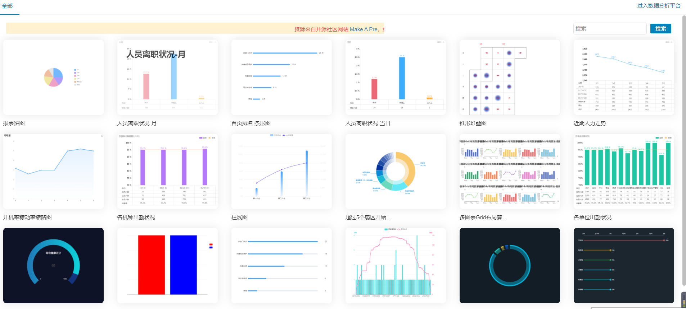
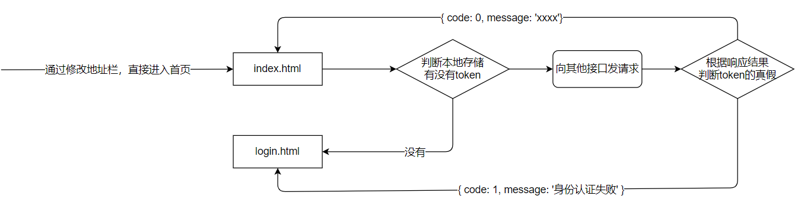

## 项目介绍

- 应对现在数据可视化的趋势，越来越多企业需要在很多场景(营销数据，生产数据，用户数据)下使用，可视化图表来展示体现数据，让数据更加直观，数据特点更加突出。

- 项目以黑马班级管理为背景，功能包括学生信息录入，每次成绩录入；并制作可视化看板。

- 我们以班主任老师的角色注册账号，并登录系统。

- 为了方便开发，登录后点击页面顶部的“点我初始化数据”按钮，即可为该账号随机增加56名同学（8个小组，每组7人），并为每位学生模拟了3次考试成绩。

- 后续，可以在学员管理中，增删改学员信息，也可以录入或修改成绩。

## 重要的三个地址

- **接口文档地址**：https://docs.apipost.cn/preview/ebfa24f6d27e4f89/cf3af015f5ca6674
- **接口根路径**：http://www.itcbc.com:8000
- **线上演示地址**：http://www.itcbc.com:8888/login.html

## 资源说明

- 仓库地址：https://gitee.com/shuiruohanyu/visual-data-145

  > 该仓库中包含可视化项目的讲义，笔记，完整代码，项目模板等
  
  ```bash
  # 克隆资源资料分支
  $ git clone https://gitee.com/shuiruohanyu/visual-data-145.git
  ```

​      注意：如果想要更新讲义，可直接执行

```bash
$ git pull # 更新讲义内容
```

## 课程目标

- 实战Ajax在项目中的应用
- 掌握echarts的基本使用
- 增强对数据的处理能力，增强编程能力
- 增强git的使用能力

## Echarts-介绍

> ECharts，一个使用 JavaScript 实现的开源可视化库，可以流畅的运行在 PC 和移动设备上，兼容当前绝大部分浏览器（IE8/9/10/11，Chrome，Firefox，Safari等），底层依赖矢量图形库 [ZRender](https://github.com/ecomfe/zrender)，提供直观，交互丰富，可高度个性化定制的数据可视化图表。

* 百度-echarts-apache-起步比较早，用的很广泛。
* 阿里-antv-F2（起步比较晚，移动端最好）

大白话：

- 是一个JS插件
- 性能好可流畅运行PC与移动设备
- 兼容主流浏览器
- 提供很多常用图表，且可**定制**。

## Echarts-体验

官方教程：[五分钟上手ECharts](https://echarts.apache.org/handbook/zh/get-started/)

自己步骤：

- 下载echarts  https://echarts.apache.org/zh/download.html
- 引入echarts  `dist/echarts.min.js`
- 准备一个具备大小（宽高）的 DOM

```html
<div id="main" style="width: 600px;height:400px;"></div>
```

- 初始化echart实例

```js
var myChart = echarts.init(document.getElementById('main'));
```

- 指定图表的配置项和数据 (根据文档提供示例找到option)

```js
var option = {
    xAxis: {
        type: 'category',
        data: ['Mon', 'Tue', 'Wed', 'Thu', 'Fri', 'Sat', 'Sun']
    },
    yAxis: {
        type: 'value'
    },
    series: [{
        data: [820, 932, 901, 934, 1290, 1330, 1320],
        type: 'line'
    }]
};
```

- 使用刚指定的配置项和数据显示图表

```js
myChart.setOption(option);
```

## Echarts-基础配置

> 需要了解的主要配置：`series` `xAxis` `yAxis` `grid` `tooltip` `title` `legend` `color` 

- series
  - 系列列表。每个系列通过 `type` 决定自己的图表类型
  - 大白话：图标数据，指定什么类型的图标，可以多个图表重叠。
- xAxis：直角坐标系 grid 中的 x 轴
- yAxis：直角坐标系 grid 中的 y 轴
- grid：直角坐标系内绘图网格
- title：标题组件
- tooltip：提示框组件
- legend：图例组件
- color：调色盘颜色列表

演示代码：

```js
var option = {
    xAxis: {
        type: 'category',
        data: ['Mon', 'Tue', 'Wed', 'Thu', 'Fri', 'Sat', 'Sun']
    },
    yAxis: {
        type: 'value'
    },
    series: [{
        data: [820, 932, 901, 934, 1290, 1330, 1320],
        type: 'line',
        name:'线形图'
    },
    {
        data: [22, 333, 111, 222, 444, 666, 777],
        type: 'bar',
        name:'饼状图'
    }],
    grid: {
        show: true
    },
    title: {
        text: '标题'
    },
    tooltip: {
        padding: 20
    },
    legend: {
        data: ['线形图']
    },
    color: ['red','green']
};
```

## 小作业

* 实例化一个图表- 折线图-可以参考案例
* 标题内容是：黑马前端145期同学薪资，副标题是：薪资表
* x坐标：显示5位同学的名称
* 折线内容内容是：5位同学的实际薪资，需要将折线的线颜色设置成 pink，让折线平滑过渡


## 项目准备

* 接下来，我们需要直接在项目中应用各类的图表

### 步骤分析

1. 拷贝 **项目模板** 文件夹到桌面或其他位置

2. 将其重命名为 **student**

3. 在student下初始化仓库，并将其内容提交到本地仓库

   ```bash
   $ git init # 初始化仓库
   $ git add . # 将内容提交到暂存区
   $ git commit -m "初始化项目" #提交内容到仓库区
   ```

4. 建立远程仓库，将本地仓库内容推送到远程仓库 

   ```bash
   $ git remote add origin "远程仓库地址" # https 或者ssh(需要配置公钥)
   $ git push -u origin master # 向远程仓库origin推送master地址
   ```

5. 使用vscode打开student文件夹，准备开发。

我们发现模板中已经提前准备好了基本的样式，基础的插件引入





* 可视化项目技术栈：**jquery + bootstrap + echarts + js插件**

## Echarts-饼图

### 步骤分析

> 打开dashborard.html页面，参照演示项目的效果，找到饼图的位置。

新建**assets/js/dashboard.js**文件，在该文件中编写相关图表

1. 封装好函数，为后续传入真实数据做准备
2. 初始化echarts
3. 设置配置项，空的 option 即可
4. 创建图表
5. 查找官方示例
6. 按需求，自定义配置图表

### 第一步：echarts基本步骤

```js
function pieChart() {
  let myChart = echarts.init(document.querySelector('.pie'));
	let option = {};
	myChart.setOption(option);
}
```


### 第二步：参照官方示例

（官方示例：https://echarts.apache.org/examples/zh/editor.html?c=pie-roseType-simple）

- 只留下series系列数据配置，其他全部删除。

### 第三步：自定义配置

- 增加标题，标题颜色 #6d767e
- 增加鼠标移入提示。（比如：“各地学员分布  北京市  12人 占比6.8%”）
- 系列数据
  - 修改 name 为 '各地学员分布'
  - 饼图，内圈半径 10%，外圈半径 60%
  - 居中显示
  - 面积模式
  - 扇形轮廓圆角（4px）

完成后的配置项如下：

```js
// 编写相关图表

// 饼图的生成函数
function pieChart() {
  // 实例化图表
  const myChart = echarts.init(document.querySelector(".pie")) // 得到一个实例
  let option = {
    //   标题属性
    title: {
      text: "籍贯", // 标题文本
      textStyle: {
        color: "#6d767e",
      },
    },
    // 提示框
    tooltip: {
      // 湖南省 变成活的
      // 80 也得变成活的
      // 40%也得变成活的
      //   formatter: "各地人员分布<br /> 湖南省 <strong>80</strong>人占比 40%",
      formatter: "{a} <br />{b} <strong>{c}</strong>人  {d}%", 
      //   a 图中的name
      // b指的是每一个数据选项的name
      // 饼图、仪表盘、漏斗图: {a}（系列名称），{b}（数据项名称），{c}（数值）, {d}（百分比）
    },
    series: [
      {
        name: "各地人员分布",
        type: "pie", // 饼图
        radius: ["20%", "80%"],
        center: ["50%", "50%"],
        roseType: "area",
        itemStyle: {
          borderRadius: 4, // 扇形的圆角
        },
        data: [
          { value: 40, name: "河北省" },
          { value: 38, name: "河南省" },
          { value: 32, name: "北京市" },
          { value: 30, name: "天津市" },
          { value: 28, name: "山西省" },
          { value: 26, name: "山东省" },
          { value: 22, name: "辽宁省" },
          { value: 18, name: "吉林省" },
          { value: 1, name: "海南省" },
        ],
      },
    ],
  }
  myChart.setOption(option) // 设置选项
}
```

#### 第四步-提交代码

```bash
$ git add .
$ git commit -m "实例化饼图"
$ git push
```


## Echarts-折线图

### 步骤分析

1. 封装好函数，为后续传入真实数据做准备
2. 初始化echarts
3. 设置配置项，空的option 即可
4. 创建图表
5. 查找官方示例
6. 按需求，自定义配置图表

### 第一步：echarts基本步骤

```js
function lineChart() {
  let myChart = echarts.init(document.querySelector('.line'));
  let option = {};
  myChart.setOption(option);
}
```

### 第二步：参照官方示例

（官方示例：https://echarts.apache.org/examples/zh/editor.html?c=line-smooth）

- tooltip -- 输入移入的提示
- title  --  标题
- xAxis  -- x轴
- yAxis  --  y轴
- dataZoom  --  数据缩放组件
- series  --  系列数据

以上配置项留下，其他删除

### 第三步：自定义配置

- 将官方示例中除了option之外的其他代码删除，并自己添加X轴数据和series中的数据。
- 系列数据
  - 增加一条线
  - 修改 name 为 '期望薪资' 和 '实际薪资'
  - 线的拐点为平滑拐点
  - 线条和X轴对齐位置，无特殊标记 `symbol: 'none'`

- 分析数据缩放组件 `dataZoom`
- 增加标题，标题颜色 #6d767e
- 分析tooltip（官方示例已带）。
- 增加图例，距离顶部20px。
- 分析坐标轴留白策略 `boundaryGap`

完成后的配置项 option 如下：

```js
// 生成折线图表
function lineChart() {
  const myChart = echarts.init(document.querySelector(".line"))
  let option = {
    title: {
      text: "薪资",
    },
    // 表示图例
    legend: {},
    xAxis: {
      type: "category",
      data: ["张三", "李四", "张飞", "赵云", "狗哥", "张三", "李四", "张飞", "赵云", "狗哥", "张三", "李四", "张飞", "赵云", "狗哥", "张三", "李四", "张飞", "赵云", "狗哥"],
    },
    yAxis: {
      type: "value",
    },
    dataZoom: [
      {
        type: "slider",
        end: 20, // 设置百分之50
      },
    ],
    series: [
      {
        name: "期望薪资",
        data: [8300, 9600, 15000, 17000, 12000, 8300, 9600, 15000, 17000, 12000, 8300, 9600, 15000, 17000, 12000, 8300, 9600, 15000, 17000, 12000],
        type: "line",
        smooth: true,
      },
      {
        name: "实际薪资",
        data: [12000, 17000, 15000, 9600, 8300, 12000, 17000, 15000, 9600, 8300, 12000, 17000, 15000, 9600, 8300, 12000, 17000, 15000, 9600, 8300],
        type: "line",
        smooth: true,
      },
    ],
  }
  myChart.setOption(option) // 设置选项
}
```

#### 第四步-提交代码

```bash
$ git add .
$ git commit -m "实例化折线图"
$ git push
```


## Echarts-柱状图

### 步骤分析

1. 封装好函数，为后续传入真实数据做准备
2. 初始化echarts
3. 设置配置项，空的option 即可
4. 创建图表
5. 查找官方示例
6. 按需求，自定义配置图表

### 第一步：echarts基本步骤

```js
function barChart() {
  let myChart = echarts.init(document.querySelector('.barChart'));
  let option = {}
  myChart.setOption(option);
}
```


### 第二步：参照官方示例

（官方示例：https://echarts.apache.org/examples/zh/editor.html?c=mix-line-bar）

- tooltip 提示组件
- legend 图例
- xAxis x轴
- yAxis y轴
- series 系列数据

以上几个配置项留下，其他删除。

### 第三步：自定义配置

- 修改X轴及series中的数据

  ```js
  ['1组', '2组', '3组', '4组', '5组', '6组', '7组']
  [83, 57, 90, 78, 66, 76, 77, 87, 69, 92, 88, 78]
  [2, 1, 3, 4, 2, 5, 2, 2, 4, 1, 6, 2]
  [3, 2, 1, 5, 1, 2, 3, 4, 5, 2, 2, 4]
  [3, 2, 1, 5, 1, 2, 3, 4, 5, 2, 2, 4]
  ```

- 多个Y轴
  - 第一个y轴（**索引0**）表示平均分，范围0~100，根据数字10，将Y轴分为10份
  - 第二个y轴（**索引1**）表示人数，范围0~10（根据班级情况而定），根据数字1，将y轴分为10份。
- 系列数据
  - 增加至 4 组数据，并修改每组 name 
  - 修改每个柱子的宽度为 15px
  - 让平均分使用第一个Y轴（`yAxisIndex: 0`），让人数使用第二个Y轴（`yAxisIndex: 1`）
- 调整网格（图表的宽高）
  - 上下 30px，左右 7%
- 分析tooltip（官方示例已带）

```js
let option = {
  // 网格（整个图表区域设置）
  grid: {
    top: 30,
    bottom: 30,
    left: '7%',
    right: '7%'
  },
  // 鼠标移入的提示
  tooltip: {
    trigger: 'axis', // 触发方式，axis表示轴触发，item表示每一项
    axisPointer: {   // 坐标轴指示器配置项
      // 十字准星指示器，其他选项有 line、shadow、none（这里配合x轴的设置，组成的十字准星）
      type: 'cross', 
      crossStyle: {
        color: '#999'
      }
    }
  },
  // 图例
  legend: {},
  // X轴
  xAxis: [
    {
      type: 'category',
      data: ['1组', '2组', '3组', '4组', '5组', '6组', '7组'],
      axisPointer: { // 坐标轴指示器为阴影，配合tooltip中的设置，组成十字准星
        type: 'shadow'
      }
    }
  ],
  // Y轴
  yAxis: [
    {
      type: 'value',
      min: 0, // y轴数据最小值
      max: 100, // y轴数据最大值
      interval: 10, // step步长，把y轴的数据分成多少份
      axisLabel: { // Y轴文字设置
        formatter: '{value}分', // Y轴文字
      }
    },
    {
      type: 'value',
      min: 0,
      max: 10,
      interval: 1,
      axisLabel: {
        formatter: '{value}人'
      }
    }
  ],
  // 数据部分（4组数据）
  series: [
    {
      name: '平均分',
      type: 'bar',
      data: [83, 57, 90, 78, 66, 76, 77, 87, 69, 92, 88, 78],
      barWidth: '15',
    },
    {
      name: '低于60分人数',
      type: 'bar',
      data: [2, 1, 3, 4, 2, 5, 2, 2, 4, 1, 6, 2],
      barWidth: '15',
      yAxisIndex: 1, // Y轴索引，1表示使用第2个Y轴
    },
    {
      name: '60到80分之间',
      type: 'bar',
      yAxisIndex: 1, // Y轴索引，1表示使用第2个Y轴
      barWidth: '15',
      data: [1, 4, 2, 4, 5, 2, 1, 3, 3, 2, 2, 4]
    }
    ,
    {
      name: '高于80分人数',
      type: 'bar',
      yAxisIndex: 1, // Y轴索引，1表示使用第2个Y轴
      barWidth: '15',
      data: [3, 2, 1, 5, 1, 2, 3, 4, 5, 2, 2, 4]
    }
  ]
};
```

#### 第四步-提交代码

```bash
$ git add .
$ git commit -m "实例化柱状图"
$ git push
```


## Echarts社区

> 社区就是一些，活跃的echart使用者，交流和贡献定制好的图表的地方。

* 百度的官网社区停服

在这里可以找到一些基于echart的高度定制好的图表，相当于基于jquery开发的插件，这里是基于echarts开发的第三方的图表。

社区示例：http://analysis.datains.cn/finance-admin/#/chartLib/all



## Echarts-使用社区的示例

实现步骤：

- 第一需要下载china.js提供中国地图的js文件(模板已引入)
- 导入后，直接使用社区提供的配置即可。
- 自行修改
  - 将背景色改为 白色
  - 将 视觉映射组件（`visualMap`）中的 `show` 改为 `false`
  - 其他自行自愿修改。

必须知道的结论：

- 哪些数据和哪些数据是对应的，必须一致
- 哪些数据能多，能错
- 哪些数据不能多，不能错

注意： 地图代码实现过程比较复杂，可以先拷贝，后分析

### 地图代码

```js
function mapChart() {
  let myChart = echarts.init($(".map")[0])
  var chinaGeoCoordMap = {
    黑龙江: [127.9688, 45.368],
    内蒙古: [110.3467, 41.4899],
    吉林: [125.8154, 44.2584],
    北京市: [116.4551, 40.2539],
    辽宁: [123.1238, 42.1216],
    河北: [114.4995, 38.1006],
    天津: [117.4219, 39.4189],
    山西: [112.3352, 37.9413],
    陕西: [109.1162, 34.2004],
    甘肃: [103.5901, 36.3043],
    宁夏: [106.3586, 38.1775],
    青海: [101.4038, 36.8207],
    新疆: [87.9236, 43.5883],
    西藏: [91.11, 29.97],
    四川: [103.9526, 30.7617],
    重庆: [108.384366, 30.439702],
    山东: [117.1582, 36.8701],
    河南: [113.4668, 34.6234],
    江苏: [118.8062, 31.9208],
    安徽: [117.29, 32.0581],
    湖北: [114.3896, 30.6628],
    浙江: [119.5313, 29.8773],
    福建: [119.4543, 25.9222],
    江西: [116.0046, 28.6633],
    湖南: [113.0823, 28.2568],
    贵州: [106.6992, 26.7682],
    云南: [102.9199, 25.4663],
    广东: [113.12244, 23.009505],
    广西: [108.479, 23.1152],
    海南: [110.3893, 19.8516],
    上海: [121.4648, 31.2891],
  }
  var chinaDatas = [
    [
      {
        name: "黑龙江",
        value: 0,
      },
    ],
    [
      {
        name: "内蒙古",
        value: 0,
      },
    ],
    [
      {
        name: "吉林",
        value: 0,
      },
    ],
    [
      {
        name: "辽宁",
        value: 0,
      },
    ],
    [
      {
        name: "河北",
        value: 0,
      },
    ],
    [
      {
        name: "天津",
        value: 0,
      },
    ],
    [
      {
        name: "山西",
        value: 0,
      },
    ],
    [
      {
        name: "陕西",
        value: 0,
      },
    ],
    [
      {
        name: "甘肃",
        value: 0,
      },
    ],
    [
      {
        name: "宁夏",
        value: 0,
      },
    ],
    [
      {
        name: "青海",
        value: 0,
      },
    ],
    [
      {
        name: "新疆",
        value: 0,
      },
    ],
    [
      {
        name: "西藏",
        value: 0,
      },
    ],
    [
      {
        name: "四川",
        value: 0,
      },
    ],
    [
      {
        name: "重庆",
        value: 0,
      },
    ],
    [
      {
        name: "山东",
        value: 0,
      },
    ],
    [
      {
        name: "河南",
        value: 0,
      },
    ],
    [
      {
        name: "江苏",
        value: 0,
      },
    ],
    [
      {
        name: "安徽",
        value: 0,
      },
    ],
    [
      {
        name: "湖北",
        value: 0,
      },
    ],
    [
      {
        name: "浙江",
        value: 0,
      },
    ],
    [
      {
        name: "福建",
        value: 0,
      },
    ],
    [
      {
        name: "江西",
        value: 0,
      },
    ],
    [
      {
        name: "湖南",
        value: 0,
      },
    ],
    [
      {
        name: "贵州",
        value: 0,
      },
    ],
    [
      {
        name: "广西",
        value: 0,
      },
    ],
    [
      {
        name: "海南",
        value: 0,
      },
    ],
    [
      {
        name: "北京市",
        value: 1,
      },
    ],
  ]

  var convertData = function (data) {
    var res = []
    for (var i = 0; i < data.length; i++) {
      var dataItem = data[i]
      var fromCoord = chinaGeoCoordMap[dataItem[0].name]
      var toCoord = [116.4551, 40.2539]
      if (fromCoord && toCoord) {
        res.push([
          {
            coord: fromCoord,
            value: dataItem[0].value,
          },
          {
            coord: toCoord,
          },
        ])
      }
    }
    return res
  }
  var series = []
  ;[["北京市", chinaDatas]].forEach(function (item, i) {
    // console.log(item)
    series.push(
      {
        type: "lines",
        zlevel: 2,
        effect: {
          show: true,
          period: 4, //箭头指向速度，值越小速度越快
          trailLength: 0, //特效尾迹长度[0,1]值越大，尾迹越长重
          // symbol: 'arrow', // 箭头图标
          // symbol: 'image://http://www.itcbc.com:3006/formdata/laoduan.jpg',
          // symbol: 'image://data:image/jpg;base64,/9j/4AAQSkZJRgABAQEAeAB4AAD//gAUU29mdHdhcmU6IFNuaXBhc3Rl/9sAQwADAgIDAgIDAwMDBAMDBAUIBQUEBAUKBwcGCAwKDAwLCgsLDQ4SEA0OEQ4LCxAWEBETFBUVFQwPFxgWFBgSFBUU/9sAQwEDBAQFBAUJBQUJFA0LDRQUFBQUFBQUFBQUFBQUFBQUFBQUFBQUFBQUFBQUFBQUFBQUFBQUFBQUFBQUFBQUFBQU/8AAEQgAJAAkAwEiAAIRAQMRAf/EAB8AAAEFAQEBAQEBAAAAAAAAAAABAgMEBQYHCAkKC//EALUQAAIBAwMCBAMFBQQEAAABfQECAwAEEQUSITFBBhNRYQcicRQygZGhCCNCscEVUtHwJDNicoIJChYXGBkaJSYnKCkqNDU2Nzg5OkNERUZHSElKU1RVVldYWVpjZGVmZ2hpanN0dXZ3eHl6g4SFhoeIiYqSk5SVlpeYmZqio6Slpqeoqaqys7S1tre4ubrCw8TFxsfIycrS09TV1tfY2drh4uPk5ebn6Onq8fLz9PX29/j5+v/EAB8BAAMBAQEBAQEBAQEAAAAAAAABAgMEBQYHCAkKC//EALURAAIBAgQEAwQHBQQEAAECdwABAgMRBAUhMQYSQVEHYXETIjKBCBRCkaGxwQkjM1LwFWJy0QoWJDThJfEXGBkaJicoKSo1Njc4OTpDREVGR0hJSlNUVVZXWFlaY2RlZmdoaWpzdHV2d3h5eoKDhIWGh4iJipKTlJWWl5iZmqKjpKWmp6ipqrKztLW2t7i5usLDxMXGx8jJytLT1NXW19jZ2uLj5OXm5+jp6vLz9PX29/j5+v/aAAwDAQACEQMRAD8A/THxF4i0/wAK6RcanqVwttawrlmbqT2AHcn0rxC0/ain1FpWttEh8oOQglmIfbnjIHGceleU/GP4iav488SSwXG62062dkt7RWyowcF2PcnH+ea0vhP8NoPFtrezQasILu0jaWa2MJYso/u881+bYvPMVjMV7DL9Er9rv7/wPssPldDD0Pa4vVv10+49Nf8AaQv0GToltj/rs3+Fbvwx/aB0/wAc61NpN/DHpl6WxbHflJvVcno2c8d/rXithotnr+uPpCag8AcMVnMJPAHJIzxXnms2UOmanIdOu3uIYmzHcKCjZHcc5HNefHPMww8o1qkuaF7Naa99tfmdjyvB1ounCPLK2+p+hHFFeafA/wAY3/iXwBa3OtXCPeRyND5h+VnVQMM3vz2or9Ow+Kp4ilGtHaSufD1aEqNSVOW6djzX4yfCFXgm1fQ48AZeW1jH3fVlHp6j/wCvXmfwc8Zy+B/iDp9zK5W2lkFvcKTxtb5ST9M5/Cvq2QOAQZnIPYhf8K+ZvjL8OLjw5qE2sWu+fTriQuz4AMLMfunAAxk8H6D3r8yzHDSw9ZY3DKzTu1+v+Z9xg6yq03hqzumrI6P4n+Ho/hne+Ib+CQBtX2xaeFP3Ym+aQj0wQn/fVeZeB/CeoeMNXitbSMyEnktwij1Y+g//AFZpumxa38RdXtNPe5lvJEU7TK2REnGT9On6V9H+DvD1v4G0tbSxx5hA82YqN0jf4e1edGnDMK/tFFxpLp66v+u1jrlOWEpcjd5v/hjW8PfCvw3o+lx29zp1tqdz96S5uYgzM3tnoPQUVKdcugf9YP8AvkUV9hHFUIRUYw0Xkj550KsnzOX5mxKTVC+tor23lt541mglUo8bjKspGCCKKKqoEDkPDnw50LwfezXem2pS4lXZ5kjlyq5yQuegPH5D0rdlPWiivKUVCNoqyO5tyldsqseaKKKwZof/2Q==',
          symbol:
            "path://M644.427078 956.858834c-1.959631 0-3.929496-0.322341-5.829775-0.981351l-93.384877-32.326243c-9.302877-3.219321-14.233166-13.371542-11.012821-22.674419 3.219321-9.3039 13.372565-14.233166 22.674419-11.012821l69.729108 24.136723 0-27.361161-56.793494-51.671846c-4.507664-4.100388-6.607488-10.218736-5.568832-16.223496 1.481747-8.56405 2.202155-15.871479 2.202155-22.339798 0-0.37146 0.01228-0.74292 0.034792-1.113357l10.960633-175.081551c0.372483-5.954619 3.700275-11.328 8.863878-14.31503 5.166673-2.989077 11.482519-3.192715 16.82827-0.548492l311.807538 154.23271 0-64.716954L589.587076 410.05312c-3.866051-3.385097-6.083555-8.273431-6.083555-13.411451L583.503521 181.125197c0-22.372543-9.601682-51.562353-24.461111-74.362638-15.458063-23.719214-34.08326-37.323047-51.099818-37.323047-17.016559 0-35.642778 13.602809-51.099818 37.322024-14.859429 22.800285-24.460088 51.990095-24.460088 74.362638l0 215.515449c0 5.13802-2.217505 10.027377-6.083555 13.411451L100.941993 694.860724l0 64.501036 306.089303-153.963581c5.323239-2.677992 11.632945-2.517333 16.813944 0.425695 5.180999 2.943029 8.5487 8.280594 8.975419 14.223956l13.57825 189.452863c0.030699 0.423649 0.045025 0.849344 0.045025 1.274016 0 3.140527 0.372483 6.514367 0.76748 10.085706l0.146333 1.332345c0.618077 5.675256-1.51961 11.304464-5.749958 15.138792l-54.42761 49.327452 0 27.220968L443.965487 893.933689c16.090467-6.587022 51.374064-9.872858 73.997318 23.608697 5.511527 8.156774 3.367701 19.237133-4.790096 24.74866-8.156774 5.509481-19.237133 3.367701-24.74866-4.790096-5.106298-7.557116-11.355629-11.511171-19.105127-12.087293-6.149047-0.459464-11.268648 1.313925-12.056594 1.604544-0.410346 0.186242-0.512676 0.209778-0.997724 0.38067l-81.002872 28.452006c-5.453199 1.914606-11.496845 1.067308-16.213263-2.27481-4.715395-3.342118-7.518231-8.762571-7.518231-14.543228l0-60.274782c0-5.031597 2.12643-9.827833 5.854335-13.20679l53.638641-48.613184c-0.12382-1.769296-0.209778-3.598968-0.226151-5.482875l-11.624758-162.198126L91.127464 804.205085c-5.52483 2.7793-12.096503 2.494821-17.362436-0.750083s-8.471952-8.987698-8.471952-15.173584l0-101.504812c0-5.13802 2.217505-10.027377 6.084579-13.411451l325.355089-284.808628L396.732743 181.125197c0-29.250184 11.588943-65.203024 30.242791-93.826945 22.487154-34.504862 51.241035-53.507658 80.967056-53.507658 29.723975 0 58.477856 19.002796 80.966033 53.507658 18.654872 28.624944 30.244838 64.576761 30.244838 93.826945l0 207.430306 325.350996 284.808628c3.866051 3.385097 6.083555 8.273431 6.083555 13.411451l0 101.504812c0 6.163373-3.184529 11.890818-8.420787 15.142885-5.234211 3.252067-11.780301 3.567245-17.306154 0.833995L611.344612 649.180336l-9.253758 147.804301c-0.025583 5.622044-0.436952 11.579733-1.24741 18.022469l55.579853 50.567699c3.712555 3.377934 5.828752 8.16496 5.828752 13.184277l0 60.274782c0 5.76633-2.789533 11.175527-7.485485 14.519692C651.707902 955.73115 648.085398 956.858834 644.427078 956.858834z",
          symbolSize: 10, //图标大小
          color: "#ee6666", // 线上的箭头颜色
        },
        lineStyle: {
          normal: {
            width: 1, //尾迹线条宽度
            opacity: 1, //尾迹线条透明度
            curveness: 0.3, //尾迹线条曲直度
          },
        },
        data: convertData(item[1]),
      },
      {
        type: "effectScatter",
        coordinateSystem: "geo",
        zlevel: 2,
        rippleEffect: {
          //涟漪特效
          period: 4, //动画时间，值越小速度越快
          brushType: "stroke", //波纹绘制方式 stroke, fill
          scale: 4, //波纹圆环最大限制，值越大波纹越大
        },
        label: {
          normal: {
            show: true,
            position: "right", //显示位置
            offset: [5, 0], //偏移设置
            formatter: function (params) {
              //圆环显示文字
              return params.data.name
            },
            fontSize: 13,
          },
          emphasis: {
            show: true,
          },
        },
        symbol: "circle",
        symbolSize: function (val) {
          return 5 + val[2] * 5 //圆环大小
        },
        itemStyle: {
          normal: {
            show: false,
            color: "#f00",
          },
        },
        data: item[1].map(function (dataItem) {
          return {
            name: dataItem[0].name,
            value: chinaGeoCoordMap[dataItem[0].name].concat([dataItem[0].value]),
          }
        }),
      },
      //被攻击点
      {
        type: "scatter",
        coordinateSystem: "geo",
        zlevel: 2,
        rippleEffect: {
          period: 4,
          brushType: "stroke",
          scale: 4,
        },
        label: {
          normal: {
            show: true,
            position: "right",
            //offset:[5, 0],
            color: "#0f0",
            formatter: "{b}",
            textStyle: {
              color: "#0f0",
            },
          },
          emphasis: {
            show: true,
            color: "#f60",
          },
        },
        symbol: "pin",
        symbolSize: 50,
        data: [
          {
            name: item[0],
            value: chinaGeoCoordMap[item[0]].concat([10]),
          },
        ],
      }
    )
  })

  let option = {
    backgroundColor: "#13297B",

    tooltip: {
      trigger: "item",
      backgroundColor: "rgba(166, 200, 76, 0.82)",
      borderColor: "#FFFFCC",
      showDelay: 0,
      hideDelay: 0,
      enterable: true,
      transitionDuration: 0,
      extraCssText: "z-index:100",
      formatter: function (params, ticket, callback) {
        //根据业务自己拓展要显示的内容
        var res = ""
        var name = params.name
        var value = params.value[params.seriesIndex + 1]
        res = "<span style='color:#fff;'>" + name + "</span><br/>数据：" + value
        return res
      },
    },
    backgroundColor: "#fff",
    title: {
      text: "来京路线 From",
      textStyle: {
        color: "#6d767e",
      },
    },
    // 视觉映射组件
    // visualMap: {
    //   // 图例值控制
    //   min: 0,
    //   max: 1,
    //   show: true, // 不让组件显示
    //   calculable: true,
    //   color: ["#f44336", "#fc9700", "#ffde00", "#ffde00", "#00eaff"],
    //   textStyle: {
    //     color: "#fff",
    //   },
    // },
    geo: {
      map: "china",
      zoom: 1.2,
      label: {
        emphasis: {
          show: false,
        },
      },
      roam: true, //是否允许缩放
      itemStyle: {
        normal: {
          color: "#dfe5f2", //地图背景色
          borderColor: "#516a89", // 省市边界线00fcff 516a89
          borderWidth: 1,
        },
        emphasis: {
          color: "rgba(37, 43, 61, .5)", // 悬浮背景
        },
      },
    },
    series: series,
  }

  myChart.setOption(option)
}
```

#### 提交代码

```bash
$ git add .
$ git commit -m "实例化地图"
$ git push
```


## 插件介绍

### 表单验证插件

- 表单验证插件有很多，不同的框架中选择的也不一样。

> vue-react 都差不多，都类似

- 案例中，表单验证使用的是 [bootstrapValidator](https://gitee.com/psccja/bootstrapvalidator) 插件。（链接挂的是码云仓库地址）
- 网上有很多关于它的介绍，比如[这里](https://www.zhuangyan.cn/BootstrapValidator-guide/) 和 [这里](https://www.yisu.com/zixun/153358.html)。
- 经过整理，总结它的使用步骤如下：

使用步骤：

1. 先引入bootstrap.css 、jquery.js 和 bootstrap.js 

2. 引入 bootstrapValidator.css 和 bootstrapValidator.js 

3. 编写验证代码，为了方便，可以封装进一个函数

   定义表单内容-input必须写name属性

   ```html
   　　　<form>
               <div class="form-group">
                   <label>Username</label>
                   <input type="text" class="form-control" name="username" />
               </div>
               <div class="form-group">
                   <label>Email address</label>
                   <input type="text" class="form-control" name="email" />
               </div>
               <div class="form-group">
                   <button type="submit" name="submit" class="btn btn-primary">Submit</button>
               </div>
           </form>
   ```

   编写表单内容

   ```js
   // 比如，验证一个用户名和密码
   function test() {
     return {
       fields: {
         username: { // 这里username是 input 的name属性值，表示对这个输入框进行验证
           validators: {
             notEmpty: {   //不能为空
               message: '用户名不能为空.'
             },
             stringLength: {   //检测长度
               min: 2,
               max: 15,
               message: '用户名需要2~15个字符'
             }
           }
         },
         password: {
           validators: {
             notEmpty: {
               message: '密码不能为空'
             },
             stringLength: {   //检测长度
               min: 6,
               max: 15,
               message: '密码需要6~15个字符'
             }
           }
         }
       }
     }
   }
   ```

4. 使用插件语法，监听表单提交事件，并使用验证

   ```js
   // 语法：
   // $('表单').bootstrapValidator(上面的验证函数()).on('success.form.bv', function (e) {}
   
   // 比如，注册
   $('.register form').bootstrapValidator(test()).on('success.form.bv', function (e) {
       e.preventDefault();
       // 通过验证，这里的代码将会执行。我们将Ajax请求的代码放到这里即可
       // 表单校验通过就可以 ---
   });
   ```
   
   

### 提示框插件

- 提示框插件有很多，不同的框架中选择的也不一样。
- 案例中，提示框使用的是 [toastr](https://codeseven.github.io/toastr/demo.html) 插件。(挂的是GitHub链接，可能打不开)
- 总结它的使用步骤如下：

使用步骤：

1. 加载 toastr.css 和 toastr.js 文件

2. 全局配置。为方便，我们将下面的配置放到 assets/utils/toastr.js 中，使用时，加载这个配置文件即可

   ```js
   toastr.options = {
     // "closeButton": false,
     // "debug": false,
     // "newestOnTop": false,
     // "progressBar": false,
     "positionClass": "toast-top-right", // 提示框位置，这里填类名
     // "preventDuplicates": false,
     // "onclick": null,
     "showDuration": "300",              // 提示框渐显所用时间
     "hideDuration": "300",              // 提示框隐藏渐隐时间
     "timeOut": "2000",                  // 提示框持续时间
     // "extendedTimeOut": "1000",
     // "showEasing": "swing",
     // "hideEasing": "linear",
     // "showMethod": "fadeIn",
     // "hideMethod": "fadeOut"
   }
   ```

3. 调用方法，直接使用

   ```js
   toastr.info('提示信息');                // 普通提示
   toastr.success('提示信息');             // 成功提示
   toastr.warning('提示信息');             // 警告提示
   toastr.error('提示信息');               // 错误提示
   ```

   

## 配置Axios项目根路径

- 目前echarts图表中的数据都是假数据

- 如果获取真数据就需要调用接口

- 这就需要至少要完成注册、登录、初始化数据等接口的调用才行

- 项目中接口根路径是相同的，见前文 [重要的三个地址](##重要的三个地址) 

- 所以，在 `assets/utils` 文件夹，创建axios的配置文件，取名 `request.js` 。代码如下：

  ```js
  axios.defaults.baseURL = 'http://www.itcbc.com:8000';
  ```

  > 这里之所以放到 assets/utils 文件夹中，是因为 utils 在编程中常用来放工具函数。而request是请求的意思。
  
  #### 提交代码

## 处理响应拦截器的响应数据

> 因为axios的默认数据返回了一层包裹的data，所以可以在axios的响应拦截器的位置进行一个解构操作

**assets/utils/request.js**

```js
axios.interceptors.response.use(response => response.data)
```

####  提交代码

## 注册账号

### 切换登录和注册的盒子

登录和注册同在 login.html 中，因为定位的原因重叠在一起了。我们可以通过JS实现切换两个盒子

```js
// 切换两个盒子
$('.box a').on('click', function () {
    $(this).parents('.box').hide().siblings('.box').show();
})
```

#### 提交代码

### 表单验证

- 表单验证，见上文的 [插件介绍](##插件介绍) 中的 [表单验证插件](###表单验证插件) 。（这里的示例可以直接当做注册和登录的验证代码）

```js
// 完成表单的校验
// 生成校验规则
function createRules() {
  return {
    // 校验规则
    fields: {
      // 用户名
      username: {
        validators: {
          notEmpty: {
            message: "用户名不能为空",
          },
          stringLength: {
            //   长度
            min: 2,
            max: 15,
            message: "用户名长度为2-15位之间",
          },
        },
      },
      // 密码
      password: {
        validators: {
          notEmpty: {
            message: "密码不能为空",
          },
          stringLength: {
            //   长度
            min: 6,
            max: 15,
            message: "密码长度为6-15位之间",
          },
        },
      },
    },
  }
}
// form表单自动事件 屏蔽这个事件
$(".register form")
  .bootstrapValidator(createRules())
  .on("success.form.bv", function (event) {
    //   屏蔽form表单的默认事件
    event.preventDetault()
  })

```

### 完成注册

> 注意引入之前创建的request.js文件

当表单验证通过后，根据接口文档，获取输入框的账号和密码，Ajax提交账号和密码

```js
// 登录注册的代码

// 表示监听了两个a标签的事件
$(".box  a").on("click", function () {
  // 指的是a标签的dom对象
  $(this).parents(".box").hide().siblings(".box").show() // 隐藏当前的a标签所在的元素盒子
  // 一个隐藏 另外一个显示
})

// 完成表单的校验
// 生成校验规则
function createRules() {
  return {
    // 校验规则
    fields: {
      // 用户名
      username: {
        validators: {
          notEmpty: {
            message: "用户名不能为空",
          },
          stringLength: {
            //   长度
            min: 2,
            max: 15,
            message: "用户名长度为2-15位之间",
          },
        },
      },
      // 密码
      password: {
        validators: {
          notEmpty: {
            message: "密码不能为空",
          },
          stringLength: {
            //   长度
            min: 6,
            max: 15,
            message: "密码长度为6-15位之间",
          },
        },
      },
    },
  }
}
// form表单自动事件 屏蔽这个事件
$(".register form")
  .bootstrapValidator(createRules())
  .on("success.form.bv", function (event) {
    //   屏蔽form表单的默认事件
    event.preventDefault()
    // 此时需要调用注册接口
    // axios.post()
    axios({
      method: "post",
      url: "/api/register",
      // 请求体参数
      data: $(".register form").serialize(), // $(".register form").serialize()会生成一个字符串
      // data: "username=1&password=2", // 请求体参数 application/json
      // params: {}, // 查询参数
    }).then(({ code, message }) => {
      // result是返回的结果
      if (code === 0) {
        // 说明 注册成功
        toastr.success(message) // 提示成功
        // 清空输入框
        $(".register input").val("") // 清空所有的输入框
        // 将当前的注册的盒子隐藏 把登录的盒子显示
        $(".register").hide().next().show()
      } else {
        // 说明注册失败
        toastr.warning(message)
      }
    })
  })

```

#### 提交代码

## 登录功能

- 因为前文已经完成了注册，所以这里的登录功能极为简单
- 问题是，登录如果成功，该做什么？
  - 将服务器响应的token存储到本地存储（关于token的说明见下文的 [JWT身份认证](##JWT身份认证)）
  - 跳转到 index.html 页面 （页面跳转，只考虑两个html之间的相对关系，不考虑js在哪里）

登录的代码如下：

```js
// 对登录表单进行进行校验
$(".login form")
  .bootstrapValidator(createRules())
  .on("success.form.bv", (event) => {
    event.preventDefault() // 屏蔽事件
    // 调用登录接口
    axios({
      method: "post",
      url: "/api/login",
      // 请求体参数
      data: $(".login form").serialize(), // $(".register form").serialize()会生成一个字符串
      // data: "username=1&password=2", // 请求体参数 application/json
      // params: {}, // 查询参数
    }).then(({ code, message, token }) => {
      // 会拿到结果
      if (code === 0) {
        // 此时认为登录成功的标志
        // token - 前后分离项目的令牌
        // 有token 就表示你当前是登录状态 没有token 表示未登录状态
        localStorage.setItem("token", token) // 将令牌放入前端缓存
        // 跳到主页
        location.href = "./index.html" // 跳转到主页
      } else {
        // 此时认为登录失败
        toastr.warning(message)
      }
    })
  })

```

#### 提交代码

## JWT身份认证

### 什么是jwt身份认证

在前后端分离模式的开发中，服务器如何知道来访者的身份呢？

- 在登录后，服务器会响应给用户一个 令牌 （token）
- 令牌中会包括该用户的id等唯一标识
- 浏览器收到令牌后，自己保存
- 下次请求其他接口时，（在请求头中）携带这个令牌去请求
- 这样服务器就知道来访者的身份了，服务器就会为该用户开发接口的访问权限，并处理该用户的数据


> 这样，就明白为什么登录后，要将token保存到本地存储中了。

Token- 时效性-两个小时的时效性-两个小时之后，过期，重新登录或者换取token

### 全局配置请求头

由于除了登录和注册接口外，其他所有接口都需要身份认证（都需要我们提供令牌），所以我们可以在 `request.js` 中，使用请求拦截器进行注入token

**assets/utils/request.js**

```js
axios.interceptors.request.use(config => {
   config.headers['Authorization'] = localStorage.getItem("token")
   return config
})
```

#### 提交代码

### 利用令牌控制页面的访问权限

浏览器端，可以通过合理使用令牌，控制页面的访问权限。

比如，用户默认只能访问登录页，如果不登录就不能访问首页，怎么做？



**第一个判断**：判断本地存储是否有token

在assets/js中新建一个auth.js文件，内容为

```html
// 表示认证当前的用户
// 认为当前有token
if (!localStorage.getItem("token")) location.href = "./login.html" // 如果不存在直接跳转登录页


```

> 上述判断只能判断token有没有，但不能判断token的真假，所以需要发送Ajax请求，根据服务器响应结果再次判断

**第二个判断**：根据服务器响应结果，判断token是否是假token或者过期的token

- 如果token值是正确的，是没有过期的，则服务器响应 `code===0`
- 如果token是错误的获取过期的，则服务器响应 `code===1 && message==='身份认证失败'`

```js
// request.js 中，使用响应拦截器，拦截响应结果进行判断
// 如果响应结果中 code === 1 && message === '身份认证失败' 则表示浏览器使用了无效的token
// 添加响应拦截器
axios.interceptors.response.use(response => response.data, function (error) {
    // 对响应错误做点什么
    if (error.response) {
        if (error.response.data.message === '身份认证失败') {
            localStorage.removeItem('token');
            location.href = './login.html'
        }
    }
    return Promise.reject(error);
});
```

#### 提交代码

## 统一处理错误提示

在上述响应拦截器的基础之上，顺便添加响应错误提示。

所有接口响应的结果有两种：

- 响应状态码 小于 400，并且 `code===1`，比如登录账号密码错误。这样的响应进入响应拦截器中的第一个函数。
- 响应状态码 大于等于 400，并且 `code === 1` ，比如身份认证失败。这样的响应进入响应拦截器中的第二个函数。

所以分别提示

```js
// request.js 中，使用响应拦截器，拦截响应结果进行判断
// 如果响应结果中 code === 1 && message === '身份认证失败' 则表示浏览器使用了无效的token
// 添加响应拦截器
axios.interceptors.response.use(
  (response) => {
    if (response.data.code === 1) {
      toastr.warning(response.data.message)
    }
    return response.data
  },
  function (error) {
    // 对响应错误做点什么
    if (error.response) {
      if (error.response.data.message === "身份认证失败") {
        localStorage.removeItem("token")
        location.href = "./login.html"
      } else {
        toastr.error(error.response.data.message)
      }
    }
    return Promise.reject(error)
  }
)

```

#### 提交代码

## 退出登录

一般来说，退出需要做的事和登录后做的事刚好相反。

- 登录后，在本地存储了token；退出时，移除这个token
- 登录后，跳转到了 index.html 页面；退出时，跳转到 login.html

```js
// 注册退出按钮事件
$(".logout a").on("click", function () {
  // 删除token 跳转到登录页
  if (confirm("确定要退出吗")) {
    localStorage.removeItem("token")
    location.href = "./login.html"
  }
})

```

#### 提交代码

## 初始化数据

为了减少手动录入数据的时间，特别设计了此接口。调用此接口将为你随机添加56名同学，并分为8个组。并为每位同学随机添加了三次成绩。

```js
// ------------------------ 初始化数据 -------------------
$('.init').on('click', function () {
  axios.get('/init/data').then((res) => {
    if (res.code === 0) {
      toastr.success(res.message);
    }
  })
})
```

#### 提交代码

## 班级概况

- 查阅接口文档，发现服务器已经将数据计算整理完毕，提供了现成的接口。
- 所以我们前端开发者，只需要调用接口，并将数据展示到页面中即可。

```js
// 获取班级概况数据
axios.get('/student/overview').then((res) => {
  // console.log(res);
  let { code, data } = res;
  if (code === 0) {
    $('.overview .total').text(data.total);
    $('.overview .avgAge').text(data.avgAge);
    $('.overview .avgSalary').text(data.avgSalary);
    $('.overview .proportion').text(data.proportion);
  }
})
```

#### 提交代码

## 柱状图使用接口数据

- 这个接口和班级概况一样，服务器已经将数据整理完毕。
- 所以我们前端开发者，只需要调用接口获取数据，并将数据传递给 echarts 即可。
- 不过，接口需要一个 batch 参数（考试的次数），所以需要先将下拉菜单处理一下。

```js
// 注册三个点的电极板事件
$(".bar .btn").on("click", function () {
  // 监听点击事件
  $("#batch").show() // 显示成绩
})

// 注册 每一次成绩的点击事件
$("#batch li").on("click", function () {
  // 需要知道 点击的是第几个
  // jq可以帮助我们获取当前点击的索引
  let batch = $(this).index() + 1 // 获取的是第几次的成绩
  axios({
    url: "/score/batch",
    params: {
      batch,
    },
  }).then((result) => {
    barChart(result.data, batch) // 可以渲染柱状图数据
  })
})

// 默认获取一次的考试成绩-默认触发一下 第一个li的点击事件
$("#batch li").eq(0).trigger("click") // 默认主动触发第一次的点击事件

```

创建柱状图的函数，设置形参接收数据。并把数据应用到X轴及series中。

```js
// 生成柱状图
function barChart(data, batch) {
  const { group, avgScore, lt60, gt60, gt80 } = data
  const myChart = echarts.init(document.querySelector(".barChart"))
  let option = {
    title: {
      text: `第${batch}次的考试成绩`,
    },
    tooltip: {
      trigger: "axis",
      axisPointer: {
        type: "cross",
        crossStyle: {
          color: "#999",
        },
      },
    },
    // 此时会显示图例
    legend: {},
    xAxis: [
      {
        type: "category",
        // data: ["1组", "2组", "3组", "4组", "5组", "6组", "7组", "8组"],
        data: group,
        axisPointer: {
          type: "shadow",
        },
      },
    ],
    // 设置y轴
    yAxis: [
      {
        type: "value",
        min: 0,
        max: 100,
        interval: 10, // 设置步长
        axisLabel: {
          formatter: "{value} 分",
        },
      },
      {
        type: "value",
        min: 0,
        max: 10,
        interval: 1,
        axisLabel: {
          formatter: "{value} 人",
        },
      },
    ],
    series: [
      {
        name: "平均分",
        type: "bar",
        barWidth: 20, // 这是柱子的宽度
        data: avgScore,
        // data: [50, 60, 67, 78, 50, 68, 89, 76, 56, 34], // 平均分 0-100的数据 要使用y轴左侧的标准
      },
      {
        name: "低于60分的人数",
        type: "bar",
        barWidth: 20, // 这是柱子的宽度
        yAxisIndex: 1, // 使用右侧的基准 因为它是人数 0 -10
        data: lt60,
        // data: [2, 3, 4, 7, 5, 6, 8, 6, 6, 4], // 人数 低于60分有多少个人 0 - 10
      },
      {
        name: "60分-80分的人数",
        type: "bar",
        yAxisIndex: 1, // 使用右侧的基准 因为它是人数 0 -10
        barWidth: 20, // 这是柱子的宽度
        data: gt60,
        // data: [2, 3, 4, 7, 5, 6, 8, 6, 6, 4],
      },
      {
        name: "80分以上的人数",
        type: "bar",
        yAxisIndex: 1, // 使用右侧的基准 因为它是人数 0 -10
        barWidth: 20, // 这是柱子的宽度
        data: gt80,
        // data: [2, 3, 4, 7, 5, 6, 8, 6, 6, 4],
      },
    ],
  } // 配置信息
  myChart.setOption(option)
}
```

#### 提交代码

## 折线图使用接口数据

> 为了锻炼数据处理能力。所以并没有提供 “返回折线图数据” 的接口。我们需要调用获取学生接口，然后自己处理数据。

调用“获取学生”接口，然后处理

```js
axios({
  url: "/student/list",
}).then((result) => {
  // 获取的所有的学生的数据
  console.log(result.data)
  // 需要生成三个数据 学生姓名数组 学生期望薪资数组 学生实际薪资数组
  const studentName = []
  const salary = []
  const trueSalary = []
  result.data.forEach((item) => {
    studentName.push(item.name) // 姓名
    salary.push(item.salary) // 期望薪资
    trueSalary.push(item.truesalary) // 期望薪资
  })
  lineChart({ studentName, salary, trueSalary }) // 直接传入一个对象
})
```

折线图函数 lineChart 中，设置形参接收数据并使用。

```js
// 生成折线图表
function lineChart(data) {
  const { studentName, salary, trueSalary } = data
  const myChart = echarts.init(document.querySelector(".line"))
  let option = {
    title: {
      text: "薪资",
    },
    // 表示图例
    legend: {},
    xAxis: {
      type: "category",
      // x轴需要所有学生的姓名
      data: studentName,
      // data: ["张三", "李四", "张飞", "赵云", "狗哥", "张三", "李四", "张飞", "赵云", "狗哥", "张三", "李四", "张飞", "赵云", "狗哥", "张三", "李四", "张飞", "赵云", "狗哥"],
    },
    yAxis: {
      type: "value",
    },
    dataZoom: [
      {
        type: "slider",
        end: 20, // 设置百分之50
      },
    ],
    series: [
      {
        name: "期望薪资",
        // 所有学生的期望薪资
        data: salary,
        // data: [8300, 9600, 15000, 17000, 12000, 8300, 9600, 15000, 17000, 12000, 8300, 9600, 15000, 17000, 12000, 8300, 9600, 15000, 17000, 12000],
        type: "line",
        smooth: true,
      },
      {
        name: "实际薪资",
        // 所有学生的实际薪资
        data: trueSalary,
        // data: [12000, 17000, 15000, 9600, 8300, 12000, 17000, 15000, 9600, 8300, 12000, 17000, 15000, 9600, 8300, 12000, 17000, 15000, 9600, 8300],
        type: "line",
        smooth: true,
      },
    ],
  }
  myChart.setOption(option) // 设置选项
}
```

#### 提交代码

## 饼图使用接口数据

饼图使用的数据格式如下

```js
data: [
  { name: '河北省', value: 12 },
  { name: '广东省', value: 12 },
  { name: '上海市', value: 12 },
  { name: '江西省', value: 12 },
  // ......
]
```

饼图使用的数据，也需要通过 获取学生 接口得到，并需要自行处理。

```js
axios({
  url: "/student/list",
}).then((result) => {
  // 获取的所有的学生的数据
  console.log(result.data)
  // 需要生成三个数据 学生姓名数组 学生期望薪资数组 学生实际薪资数组
  const studentName = []
  const salary = []
  const trueSalary = []
  // result.data已经是所有的的学生数据了
  const pieData = []
  // [{ name: '黑龙江', value: 10  }, { name: '辽宁', value: 2  }]
  result.data.forEach((item) => {
    studentName.push(item.name) // 姓名
    salary.push(item.salary) // 期望薪资
    trueSalary.push(item.truesalary) // 期望薪资

    // 分析出 这学生来自哪 黑龙江 => 黑龙江 + 1
    // 首先得判断 当前循环的这个学生 { 张三, 海南 } 如果有海南 + 1 如果没有 加上海南的数据
    // 从一个数组中-找出是否有属性 name === item.province
    let temp = pieData.find((obj) => obj.name === item.province) // 找这个数据
    if (temp) {
      // 如果有说明 已经在数组里了
      temp.value++ // 将找到的省份的数据+1
    } else {
      // 如果没有 加进入
      pieData.push({ name: item.province, value: 1 })
    }
  })
  // 得到一个饼图数据

  lineChart({ studentName, salary, trueSalary }) // 直接传入一个对象

  pieChart(pieData) // 生成饼图
})
```

饼图函数，接收数据并使用：

```js
// 饼图的生成函数
function pieChart(data) {
  // 实例化图表
  const myChart = echarts.init(document.querySelector(".pie")) // 得到一个实例
  let option = {
    //   标题属性
    title: {
      text: "籍贯", // 标题文本
      textStyle: {
        color: "#6d767e",
      },
    },
    // 提示框
    tooltip: {
      // 湖南省 变成活的
      // 80 也得变成活的
      // 40%也得变成活的
      //   formatter: "各地人员分布<br /> 湖南省 <strong>80</strong>人占比 40%",
      formatter: "{a} <br />{b} <strong>{c}</strong>人  {d}%",
      //   a 图中的name
      // b指的是每一个数据选项的name
      // 饼图、仪表盘、漏斗图: {a}（系列名称），{b}（数据项名称），{c}（数值）, {d}（百分比）
    },
    series: [
      {
        name: "各地人员分布",
        type: "pie", // 饼图
        radius: ["20%", "80%"],
        center: ["50%", "50%"],
        roseType: "area",
        itemStyle: {
          borderRadius: 4, // 扇形的圆角
        },
        data,
        // data: [
        //   { value: 40, name: "河北省" },
        //   { value: 38, name: "河南省" },
        //   { value: 32, name: "北京市" },
        //   { value: 30, name: "天津市" },
        //   { value: 28, name: "山西省" },
        //   { value: 26, name: "山东省" },
        //   { value: 22, name: "辽宁省" },
        //   { value: 18, name: "吉林省" },
        //   { value: 1, name: "海南省" },
        // ],
      },
    ],
  }
  myChart.setOption(option) // 设置选项
}
```

## 成绩管理

> 后续，就是我们在Ajax课程中学习的知识点了。也就是数据的增删改查等等操作。

### 获取成绩并展示

这个功能有对应的接口，而且得到的数据不需要处理，直接可以使用。**认真阅读接口文档**。

```js
// 定义方法

function renderScore() {
  // 请求所有的考试成绩
  axios({
    url: "/score/list",
  }).then((result) => {
    const { data } = result
    // 遍历对象
    let arr = []
    for (let key in data) {
      // key是学生的id
      arr.push(`<tr>
       <td>${key}</td> 
       <td>${data[key].name}</td>
       <td class="score">${data[key].score[0]}</td>
       <td class="score">${data[key].score[1]}</td>
       <td class="score">${data[key].score[2]}</td>
       <td class="score">${data[key].score[3]}</td>
       <td class="score">${data[key].score[4]}</td>
      </tr>`)
    }
    // 将生成的数组渲染到html上
    $("tbody").html(arr) // 直接将数组渲染到页面上
  })
}
renderScore()

```

#### 提交代码

### 可编辑的表格效果

添加和修改成绩，并没有使用弹出层等效果。而是采用可编辑的表格。

可编辑的表格，需要用到的技术就是DOM操作，没有其他。

思路如下：

- 双击单元格 `td.score` ，获取单元格的值。
- 创建input
- 设置input的样式和td的样式一致，或者自行修改样式。
- 将 单元格的值 设置为 input 的 value
- 将 input 放入 td 中，并获取焦点

后续补充，输入框中按回车，表示确定，失去焦点表示取消

- 给input注册 keyup 和 blur 事件。

完整代码：

```js
// 注册事件方法
function registerEvent() {
  $("tbody").on("dblclick", ".score", function () {
    // 注册了所有成绩单元格的双击事件
    const td = $(this) // 获取点击的单元格jquery对象
    let value = td.text() // 原来的值
    // alert(td.text())
    // 需要往里面塞input  这里需要判断一下 是否已经塞过input
    if (td.children().length > 0) return // 如果已经设置了input 直接返回
    td.text("")
    // 如果没有 继续
    let input = $("<input />") // 直接生成一个input对象
    input.val(value) // 写入值
    input.appendTo(td) // 将input添加到td上
    input.focus() // 聚焦
    input.on("blur", function () {
      // 离开焦点之后，input需要恢复原样
      td.html(value) // 直接将原来的td恢复成原来的模样
    })
    // 回车的时候 监听回车事件
    input.on("keyup", function (event) {
      // 监听回车事件
      if (event.keyCode === 13) {
        // 当按下enter键的时候 建码是13
        // 在此时就可以 将修改的数据存入到后端数据
      }
    })
  })
}
registerEvent()
```

#### 提交代码

### 修改或录入成绩

接口分析：

- 需要学员id 参数
- 需要batch次数 参数
- 需要score成绩 参数

所以，在循环遍历数据时，将需要的 **学员id** 和 **batch**次数，用自定义属性 data-xx 存储。

```js
arr.push(`
  <tr>
      <th scope="row">${key}</th>
      <td>${data[key].name}</td>
      <td data-batch="1" data-id="${key}" class="score">${data[key].score[0]}</td>
      <td data-batch="2" data-id="${key}" class="score">${data[key].score[1]}</td>
      <td data-batch="3" data-id="${key}" class="score">${data[key].score[2]}</td>
      <td data-batch="4" data-id="${key}" class="score">${data[key].score[3]}</td>
      <td data-batch="5" data-id="${key}" class="score">${data[key].score[4]}</td>
  </tr>
```

当按下回车键后，获取接口所需参数，调用接口发送请求，进行成绩的修改和录入

```js
function registerEvent() {
  $("tbody").on("dblclick", ".score", function () {
    // 注册了所有成绩单元格的双击事件
    const td = $(this) // 获取点击的单元格jquery对象
    let value = td.text() // 原来的值
    // alert(td.text())
    // 需要往里面塞input  这里需要判断一下 是否已经塞过input
    if (td.children().length > 0) return // 如果已经设置了input 直接返回
    td.text("")
    // 如果没有 继续
    let input = $("<input />") // 直接生成一个input对象
    input.val(value) // 写入值
    input.appendTo(td) // 将input添加到td上
    input.focus() // 聚焦
    input.on("blur", function () {
      // 离开焦点之后，input需要恢复原样
      td.html(value) // 直接将原来的td恢复成原来的模样
    })
    // 回车的时候 监听回车事件
    input.on("keyup", function (event) {
      // 监听回车事件
      if (event.keyCode === 13) {
        // 当按下enter键的时候 建码是13
        // 在此时就可以 将修改的数据存入到后端数据
        // 可以获取当前td的 batch(第几次)   id(学员id)
        const batch = td.data("batch")
        const stu_id = td.data("id")
        // 分数实际上就是 input里面存储的值
        const score = event.target.value
        // 发送请求之前 检查一下要更新的分数
        // 字符串和数字比较的时候 有一儿隐士转化
        if (isNaN(score) || parseInt(score) < 0 || parseInt(score) > 100) {
          // 不满足填写的分数要求
          toastr.warning("分数为0-100之间的数字")
          return
        }
        axios({
          url: "/score/entry",
          method: "post",
          data: {
            // 请求体参数
            batch,
            stu_id,
            score,
          },
        }).then((result) => {
          // 在此位置接收数据
          if (result.code === 0) {
            // 此时认为更新成功
            toastr.success(result.message)
            //如果真的成功了 更新当前的页面效果
            td.html(score) // 更新页面的内容
          } else {
            // 更新失败
            toastr.warning(result.message)
          }
        })
      }
    })
  })
}
```

#### 提交代码

## 学员管理

### 获取数据展示

这也是一个常规操作，按照接口文档获取数据，然后循环遍历到表格中即可。

```js
// 定义一个方法

function renderStudent() {
  axios({
    url: "/student/list",
  }).then((result) => {
    const { data } = result // 除了通过打开控制台 手动选择断点之外，还可以通过debugger
    // debugger // debugger关键字的作用是 当代码运行到该位置的时候，如果是在开发者模式下，直接会在位置断一下
    // 将实际的arr渲染到页面上
    $("tbody").html(
      data.map(
        (item) =>
          `<tr>
       <th scope="row">${item.id}</th>
           <td>${item.name}</td>
           <td>${item.age}</td>
           <td>${item.sex}</td>
           <td>${item.group}</td>
          <td>${item.phone}</td>
           <td>${item.salary}</td>
           <td>${item.truesalary}</td>
          <td>${item.province}${item.city}${item.county}</td>
           <td>
             <button type="button" class="btn btn-primary btn-sm">修改</button>
            <button type="button" class="btn btn-danger btn-sm">删除</button>
           </td>
         </tr> `
      )
    )
  })
}
// debugger
renderStudent()

```

#### 提交代码

### 添加 -- 分析

- 添加使用了 bootstrap4 的[模态框](https://v4.bootcss.com/docs/components/modal/)（弹出框），这个只需按 bootstrap 的语法写即可。
- 表单中有“省市县”联动效果。当然也有对应的接口。
  - 开始时，先获取所有的省，放到第一个下拉框中
  - 当“省”切换的时候，获取对应的市，并放入第二个下拉框中。
  - 当“市”切换的时候，获取对应的县，并放入第三个下拉框中
- 需要有表单验证，这个安装表单验证插件的语法写即可。
- 一切准备就绪，提交表单数据，完成添加即可。

### 添加 -- 省市县联动

```js
// 注册事件 执行逻辑
function registerEvent() {
  // 一开始-获取所有的省份
  axios({
    url: "/geo/province",
  }).then((result) => {
    // 直接把result的内容生成 select标签的option选项
    //    <option selected value="">--省--</option>
    const arr = result.map((item) => `<option   value="${item}">${item}</option>`)
    // 找出所有name属性为province的标签
    $("select[name=province]").html([`<option  selected value="">--省--</option>`, ...arr])
    // 得到所有的省份
  })
  // 监听省的变化 -> 获取市区的列表
  $("select[name=province]").on("change", function (event) {
    // 更新市区列表
    // 拿到当前的值
    // alert(`${event.target.value}-${$(this).val()}`)
    let pname = event.target.value // 获取省的名称
    // 需要获取省下面的市
    axios({
      url: `/geo/city`,
      params: { pname }, // 查询参数
    }).then((result) => {
      //  result 列表渲染大select上
      const arr = result.map((item) => `<option   value="${item}">${item}</option>`)
      $("select[name=city]").html([`<option  selected value="">--市--</option>`, ...arr])
    })
  })

  // 监听市的变化
  $("select[name=city]").on("change", function (event) {
    // 监听到市的变化
    let cname = event.target.value // 获取到最新的市的名字
    // 获取县需要两个参数 省名、 市名 parent()表示父节点 prev表示前一个兄弟节点
    let pname = $(this).parent().prev().find("select").val() // 先取父节点 => 前一个同级节点 => select

    axios({
      url: "/geo/county",
      params: { cname, pname },
    }).then((result) => {
      //  渲染区县内容
      const arr = result.map((item) => `<option   value="${item}">${item}</option>`)
      $("select[name=county]").html([`<option  selected value="">--县--</option>`, ...arr])
    })
  })
}
registerEvent()

```

#### 提交代码

### 添加 -- 表单验证

```js
function student() {
  return {
    fields: {
      name: {
        validators: {
          notEmpty: {
            message: '姓名不能为空',
          },
          stringLength: {
            min: 2,
            max: 10,
            message: '姓名长度2~10位'
          }
        }
      },
      age: {
        validators: {
          notEmpty: {
            message: '年龄不能为空',
          },
          greaterThan: {
            value: 18,
            message: '年龄不能小于18岁'
          },
          lessThan: {
            value: 60,
            message: '年龄不能超过60岁'
          }
        }
      },
      sex: {
        validators: {
          choice: {
            min: 1,
            max: 1,
            message: '请选择性别'
          }
        }
      },
      group: {
        validators: {
          notEmpty: {
            message: '组号不能为空',
          },
          regexp: {
            regexp: /^\d{1,2}$/,
            message: '请选择有效的组号'
          }
        }
      },
      phone: {
        validators: {
          notEmpty: {
            message: '手机号不能为空',
          },
          regexp: {
            regexp: /^1\d{10}$/,
            message: '请填写有效的手机号'
          }
        }
      },
      salary: {
        validators: {
          notEmpty: {
            message: '实际薪资不能为空',
          },
          greaterThan: {
            value: 800,
            message: '期望薪资不能低于800'
          },
          lessThan: {
            value: 100000,
            message: '期望薪资不能高于100000'
          }
        }
      },
      truesalary: {
        validators: {
          notEmpty: {
            message: '实际薪资不能为空',
          },
          greaterThan: {
            value: 800,
            message: '实际薪资不能低于800'
          },
          lessThan: {
            value: 100000,
            message: '实际薪资不能高于100000'
          }
        }
      },
      province: {
        validators: {
          notEmpty: {
            message: '省份必填',
          },
        }
      },
      city: {
        validators: {
          notEmpty: {
            message: '市必填',
          },
        }
      },
      county: {
        validators: {
          notEmpty: {
            message: '县必填',
          },
        }
      },
    }
  }
}
```

#### 提交代码

### 添加 -- 完成添加

```js
// 添加学生
$('.add-form').bootstrapValidator(student()).on('success.form.bv', function (e) {
  e.preventDefault();
  //提交逻辑
  // console.log(222);
  let data = $(this).serialize();
  // console.log(data);
  axios.post('/student/add', data).then((res) => {
    // console.log(res);
    if (res.code === 0) {
      toastr.success(res.message);
      renderStudent();
      $('#addModal').modal('hide') // 这个是关闭模态框（弹出框）的意思
    }
  })
});
```

#### 提交代码

### 修改 -- 分析

- 修改中，也会用到省市县联动。但是不用再写代码了，前面添加的时候已经写过了。
- 修改时，表单（每个输入框）不能为空，必须设置好默认的value值，**这个操作叫做数据回填。所有的修改操作都需要数据回填**
  - 点击 修改 按钮
  - 发送请求，获取该学员的信息。
  - 得到数据后，设置每个输入框的value值。下拉框和单项按钮需设置选中状态。
- 修改接口，需要学员id，所以在修改表单中，加入 `<input type="hidden" name="id" />`
- 最后，按照接口文档，完成修改即可。

#### 提交代码

### 修改 -- 数据回填

遍历数据时，用 data-id 属性，存储该学员的 id

```diff
arr.push(`
      <tr>
          <th scope="row">${item.id}</th>
          <td>${item.name}</td>
          <td>${item.age}</td>
          <td>${item.sex}</td>
          <td>${item.group}</td>
          <td>${item.phone}</td>
          <td>${item.salary}</td>
          <td>${item.truesalary}</td>
          <td>${item.province}${item.city}${item.county}</td>
          <td>
+          <button data-id="${item.id}" type="button" class="btn btn-primary btn-sm update">修改</button>
          <button type="button" class="btn btn-danger btn-sm del">删除</button>
          </td>
      </tr>
      `);
```

JS代码如下：

```js
// 修改学员 --- 数据回填
  $("tbody").on("click", ".update", function () {
    let id = $(this).data("id")
    axios.get("/student/one", { params: { id } }).then((res) => {
      if (res.code === 0) {
        // console.log(res.data);
        let { name, age, sex, group, phone, id, salary, truesalary, province, city, county } = res.data
        $("#updateModal input[name=id]").val(id)
        $("#updateModal input[name=name]").val(name)
        $("#updateModal input[name=age]").val(age)
        $("#updateModal input[name=sex][value=" + sex + "]").prop("checked", true)
        $("#updateModal input[name=phone]").val(phone)
        $("#updateModal input[name=salary]").val(salary)
        $("#updateModal input[name=truesalary]").val(truesalary)
        $("#updateModal select[name=group]")
          .children("[value=" + group + "]")
          .prop("selected", true)
        $("#updateModal select[name=province]")
          .children("[value=" + province + "]")
          .prop("selected", true)
        $("#updateModal select[name=city]").html(`<option value="${city}">${city}</option>`)
        $("#updateModal select[name=county]").html(`<option value="${county}">${county}</option>`)

        $("#updateModal").modal("show") // 这行的意思是让模态框显示
      }
    })
```

#### 提交代码

### 修改 -- 完成修改

```js
// 修改 也得完成表单校验
$(".update-form")
  .bootstrapValidator(student())
  .on("success.form.bv", function (event) {
    event.preventDefault() // 阻止默认事件
    // 调用 修改接口
    axios({
      method: "put",
      url: "/student/update",
      // 请求体参数
      data: $(".update-form").serialize(), // 可以得到一个字符串类型的参数
    }).then((result) => {
      if (result.code === 0) {
        toastr.success(result.message)
        // 关闭弹层
        $("#updateModal").modal("hide") // 隐藏 弹层
        // 更新页面的数据
        renderStudent() // 重新渲染
      } else {
        toastr.warning(result.message)
      }
    })
  })

```

#### 提交代码

### 删除操作

遍历数据时，用 data-id 属性，存储该学员的 id

```diff
arr.push(`
      <tr>
          <th scope="row">${item.id}</th>
          <td>${item.name}</td>
          <td>${item.age}</td>
          <td>${item.sex}</td>
          <td>${item.group}</td>
          <td>${item.phone}</td>
          <td>${item.salary}</td>
          <td>${item.truesalary}</td>
          <td>${item.province}${item.city}${item.county}</td>
          <td>
          <button data-id="${item.id}" type="button" class="btn btn-primary btn-sm update">修改</button>
+          <button data-id="${item.id}" type="button" class="btn btn-danger btn-sm del">删除</button>
          </td>
      </tr>
      `);
```

JS代码如下：

```js
// 删除学员
$('tbody').on('click', '.del', function () {
  if (!confirm('你确定要删除吗？')) return;
  let id = $(this).data('id');
  axios.delete('/student/delete', { params: { id } }).then((res) => {
    if (res.code === 0) toastr.success(res.message); renderStudent();
  })
})
```


