#  学习目标

> 了解`node.js`的基本介绍  + 能够安装`node.js`环境  + 能够掌握`node.js`的基本使用步骤

> 掌握`npm` ( 包管理工具 )   和 `es6`模块化 

> 了解前端构建工具 - `webpack`


# 1. `nodejs`基本介绍

## 1.1 为什么要学习`nodejs`?

① 为什么要学习服务端的开发？

1. 通过学习`Node.js`开发理解**服务器开发**、**Web请求和响应过程**、 **了解服务器端如何与客户端配合**

2. 作为前端开发工程师（FE - front-end engineer）需要具备一定的服务端开发能力

3. 全栈工程师的必经之路 

   

② 服务器端开发语言有很多，为什么要选择`node.js` ?

1. 降低编程语言切换的成本(`node.js`实质上用的还是`javascript`) 
2. `NodeJs`是前端项目的基础设施，不仅仅是做服务端开发， 前端项目中用到的大量工具都是基于Node的, 比如: `webpack` ... 
3. `nodejs`在处理**高并发**上有得天独厚的优势, 大型项目经常会用Node做`web服务器上层的中间件`,  `web服务器上层网关`...
4. **对于前端工程师，面试时可能对于`nodejs`有一定的要求**


## 1.2 浏览器与`javaScript`

> 思考问题：为什么浏览器能够执行`js`代码?

### `js`的组成部分

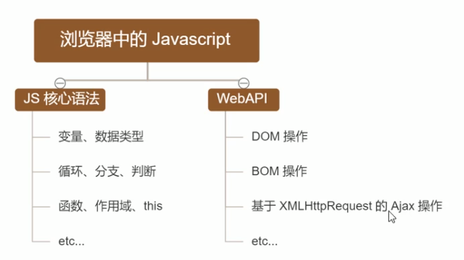

### 浏览器的组成部分


**浏览器引擎**:  

- 负责在用户界面和渲染引擎之间传送指令
- 在客户端本地缓存中读写数据
- 是浏览器中各个部分之间相互通信的核心

**渲染引擎**：负责解析`html`和`css`

**`js`引擎**：负责解析`javascript`代码

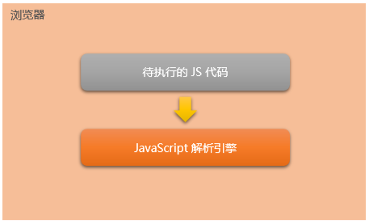

不同的浏览器使用不同的**JavaScript引擎**：

+ Chrome 浏览器 =>  `V8  `
+ Firefox 浏览器 => ` OdinMonkey`（奥丁猴）
+ `Safri `浏览器 =>  `JSCore`
+ IE 浏览器 =>  `Chakra`（查克拉）
+ 其中，Chrome 浏览器的 `V8` 解析引擎性能最好！


不同的浏览器使用不同的**渲染引擎**：

- Chrome 浏览器 =>  `webkit`, blink
- Firefox 浏览器 =>  Gecko
- `Safri `浏览器 => ` webkit `
- IE 浏览器 =>  Trident

> 联想记忆: ` JS`引擎 类比 车的发动机;  渲染引擎  类比  车的车载系统


### 为什么`JS`可以操作"网页内容"和"浏览器功能"?

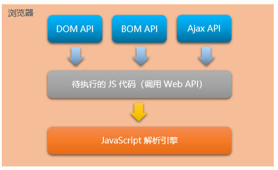

每个浏览器都内置了`DOM`、`BOM `这样的` API `

因此，浏览器中的JavaScript 才可以调用它们。


**浏览器中的JavaScript运行环境**

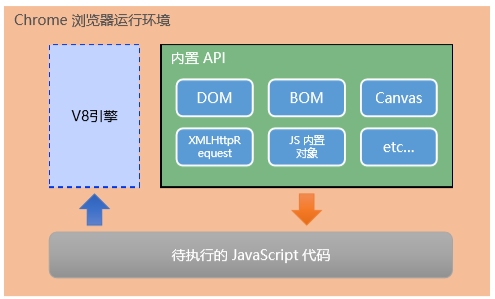

总结：

+ 运行环境指的是代码正常运行所需的必要环境。
+ 浏览器是`javascript`的运行环境。


> 思考:  是不是只要一个软件的运行环境中有`JS`引擎, 就可以执行`JS`代码?  true


## 1.3 `nodejs`简介

### 什么是`nodejs`?

`Node.js`® is a JavaScript runtime built on Chrome's `V8 `JavaScript engine.

`Node.js `是一个基于 Chrome `V8` 引擎的 JavaScript 运行环境。

通俗的理解：`Node.js `为 JavaScript 代码的正常运行，提供的必要的环境。

`Node.js `的官网地址： https://nodejs.org/zh-cn/


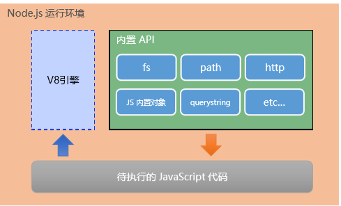

注意：

① 浏览器是 JavaScript 的前端运行环境。

② `Node.js` 是 JavaScript 的后端运行环境。

③ `Node.js` 中无法调用 `DOM `和 `BOM` 等 浏览器内置 `API`。


### `nodejs`与浏览器的区别?

相同点：`nodejs`浏览器都是`javascript`的运行环境，都能够解析`js`程序。

不同点：`nodejs`无法使用`DOM`和`BOM`的操作，浏览器无法执行`nodejs`中的文件操作等功能

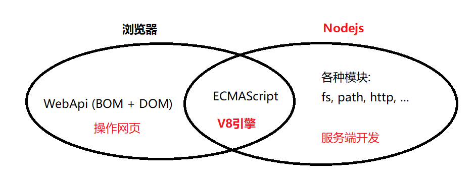

**问题小结：**

1. 在浏览器端，可以使用`javascript`操作文件么？可以

2. 在`nodejs`端，可以使用`BOM`和`DOM`的方法么？不可以

   


### `Node.js`可以做什么?

`Node.js` 作为一个 JavaScript 的运行环境，仅仅提供了基础的功能和`API`。

然而，基于`Node.js `提供的这些基础能，很多强大的工具和框架如雨后春笋，层出不穷。

所以学会了`Node.js` ，可以让前端程序员胜任更多的工作和岗位：

① 基于 `Express/Koa/Egg` 等框架（http://www.expressjs.com.cn/），可以快速构建Web 应用   

② 基于 Electron框架（https://electronjs.org/），可以构建跨平台的桌面应用

③ 基于` restify `框架（http://restify.com/），可以快速构建`API `接口项目

④ 读写和操作数据库、创建实用的命令行工具辅助前端开发、etc…

总之：

`Node.js` 是大前端时代的“**大宝剑**”，有了`Node.js `这个超级 **buff** 的加持，前端程序员的行业竞争力会越来越强！


### `Node.js`怎么学?

浏览器中的 JavaScript 学习路径：
JavaScript 基础语法 + 浏览器内置`API`（`DOM `+ `BOM`） + 第三方库（`Echarts`、`AntD` 等）

`Node.js` 的学习路径：
JavaScript 基础语法 + `**Node.js `内置 `API` 模块（`fs`、`path`、`http`等）**+ 第三方框架（Express、Electron等）


# 2. `nodejs`环境的安装

如果希望通过`Node.js` 来运行 `Javascript `代码，则必须在计算机上安装`Node.js `环境才行。

安装包可以从`Node.js `的官网首页直接下载，进入到`Node.js `的官网首页（https://nodejs.org/zh-cn/），点 击绿色的按钮，下载所需的版本后，双击直接安装即可。

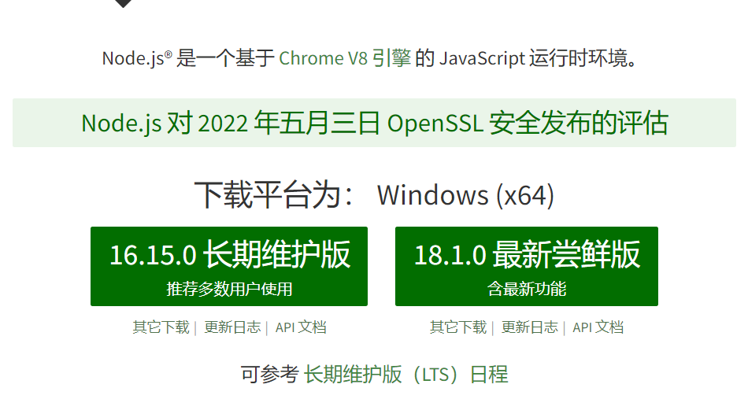

## 2.1 版本说明

+ `LTS` 为长期稳定版，对于追求稳定性的企业级项目来说，推荐安装`LTS` 版本的`Node.js`。
+ Current 为新特性尝鲜版，对于热衷于尝试新特性的用户来说，推荐安装Current 版本的 `Node.js`。但是，Current 版本 中可能存在隐藏的Bug 或安全性漏洞，因此不推荐在企业级项目中使用Current 版本的 `Node.js`。


## 2.2 安装`nodejs`

### windows安装步骤

打开终端测试

使用快捷键（Windows徽标键+ R）打开运行面板，输入`cmd `后直接回车，即可打开终端。


### mac安装步骤

1. 选择安装包

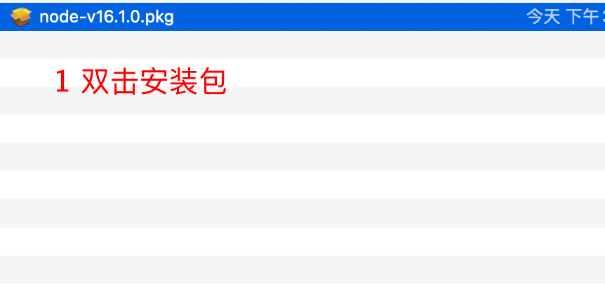

2. 如图

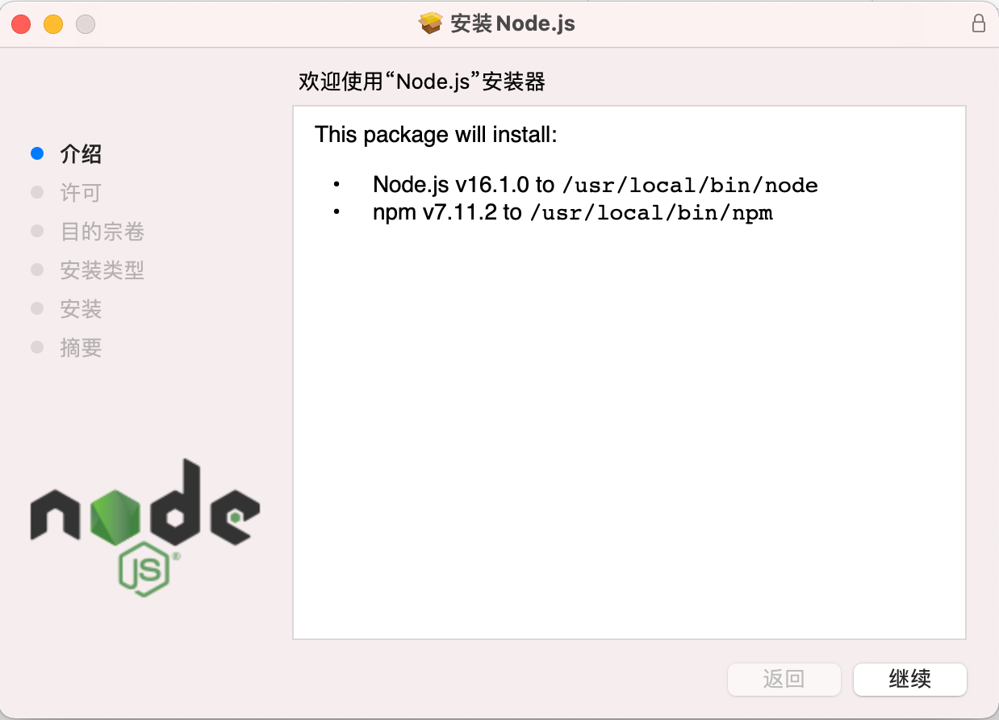

3. 点击继续

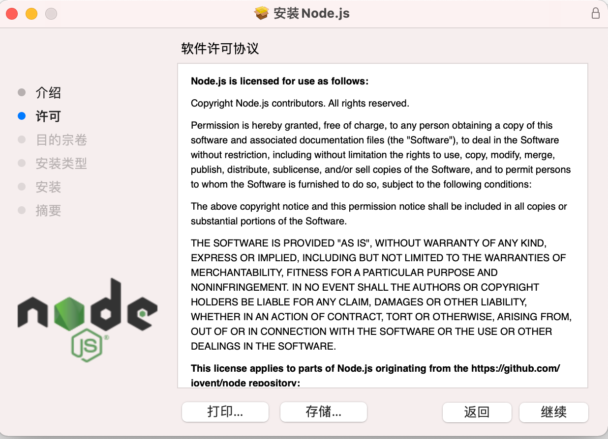

4. 点击继续

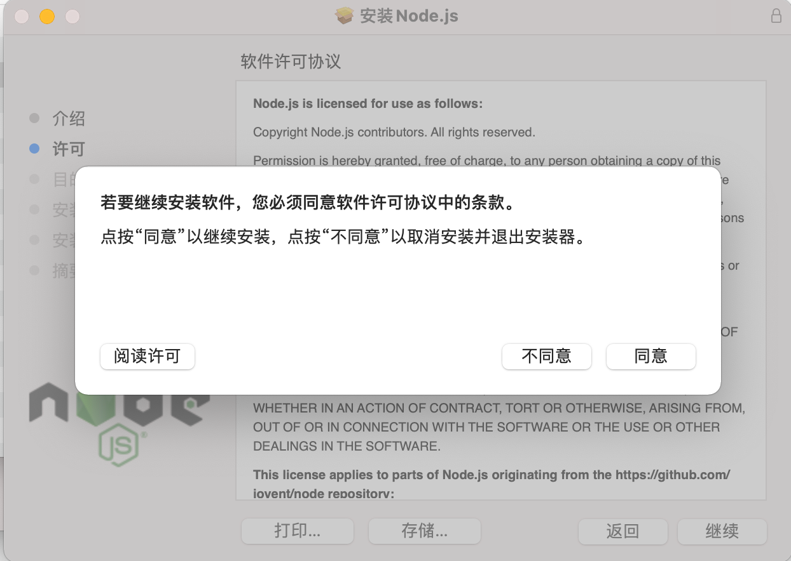

5. 点击同意

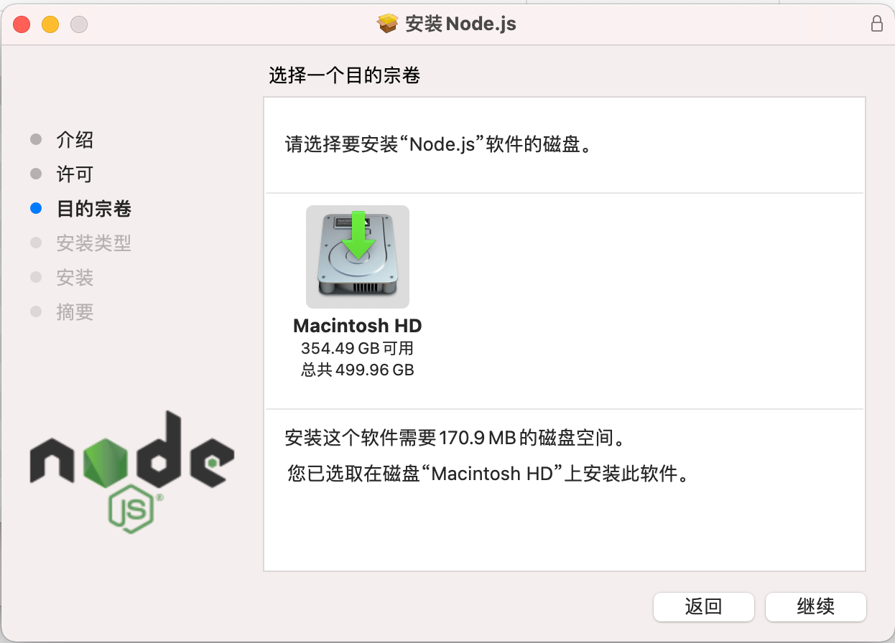

6. 点击继续

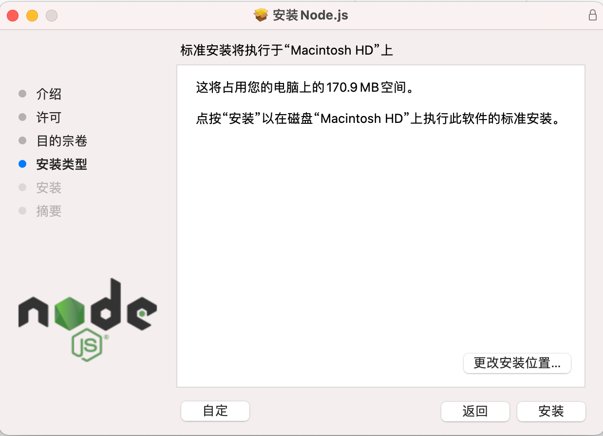

7. 点击安装

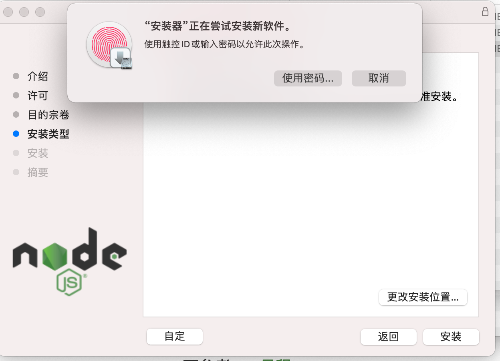

8. 使用指纹或者输入密码进行安装

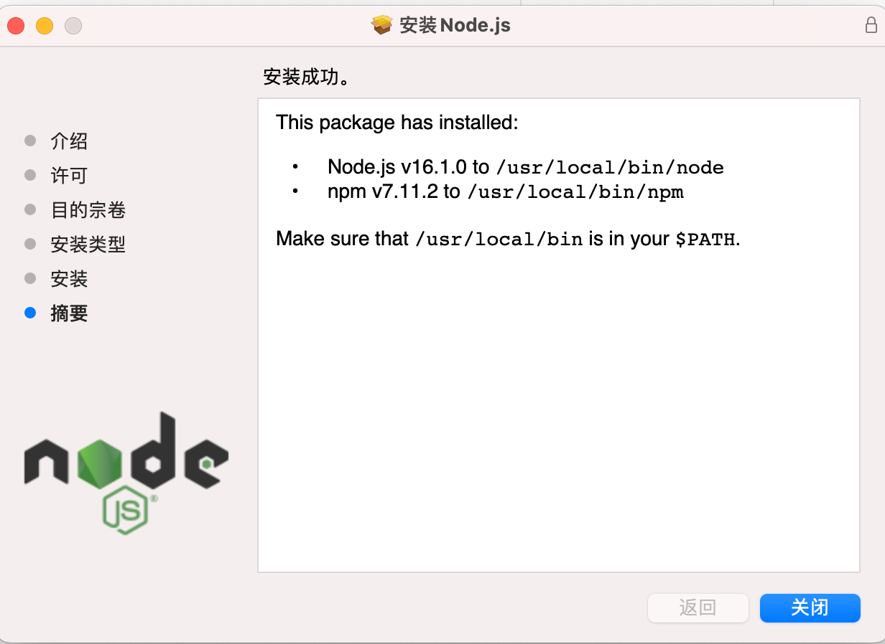

能够看到如图，说明安装成功了。

9. 打开终端测试node是否安装成功


10. 输入`node -v`查看node安装的版本

    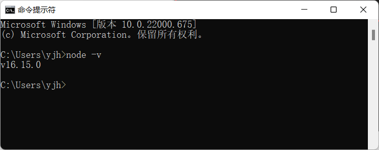


> 测试是否安装成功

打开终端，在终端输入命令node –v 后，按下回车键，即可查看已安装的`Node.js` 的版本号。


## 2.3 终端的使用

终端（英文：Terminal）是专门为开发人员设计的，用 于实现人机交互的一种方式。

`nodejs`和普通的程序运行不一样，需要在终端中使用node命令来使用。

windows终端和mac电脑的终端打开方式稍微有些不同。

### windows打开终端的方式

1. window + R:  `cmd`     `powershell ` 默认在C盘的用户目录打开
2. 在任意的文件夹下，按住shift键，使用鼠标右键  （好处：可以在任意的文件夹下打开命令窗口）

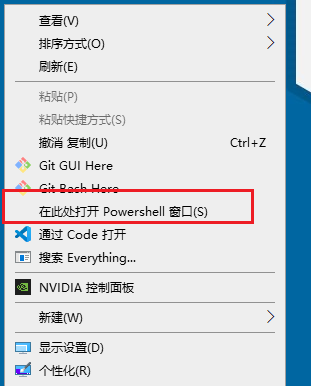

3. 使用`vscode`集成的终端，在js文件或者在文件夹上右键	

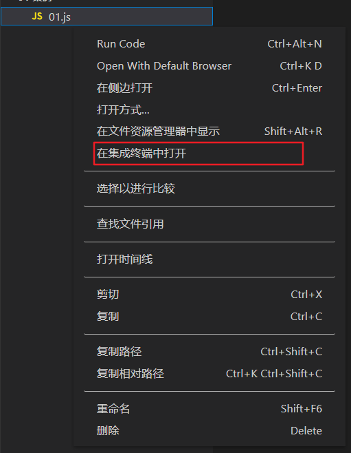

`shift + Escape`

### mac打开终端的方式


2. 在文件夹上右键，可以打开当前文件夹的终端

3. 在`vscode`中使用


## 2.4 终端常见操作

终端命令

+ `ls`        list 查看 ，查看当前文件夹下所有的目录列表
+ `cd `        切换到某个文件夹下，  change directory
+ `cd ../`    退回上级文件夹
+ clear    清屏 ( `cls` )
+ `esc`      清除当前这一行


常用快捷键

在 Windows 的命令行中，我们可以通过如下快捷键，来提高命令行的操作效率：
① 使用 ↑ 键，可以快速定位到上一次执行的命令
② 使用 tab 键，能够快速补全路径
③ 使用 `esc` 键，能够快速清空当前已输入的命令


# 3. `nodejs`基本使用

在 `Node.js` 中需要通过终端才能执行 JavaScript 代码

① 打开终端

② 输入 node 要执行的`js`文件的路径，即可通过`Node.js`，来执行存放于**`.js`** 文件中的代码


- 创建`js`文件 `helloNode.js`

- 写`nodejs`的内容：`console.log('hello nodejs')`

- 打开终端

- 执行命令：`node helloNode.js`

  

>  注意：在`nodejs`中是无法使用`DOM`和`BOM`的内容的，因此`document, window`等内容是无法使用的。


# 二：node核心模块

# 1. global模块

global模块，是node的全局模块，在使用时不需要引入，直接使用。

```js
/**
  * window 浏览器中的全局对象
  * global nodejs中的全局对象
  * 注意 : node里面使用 global里面的变量,不需要引入
  */
  
  //1. console.log()  打印

  //2. setTimeout 和setInterval ，延时器和定时器
  setTimeout(() => {
      console.log('我在node中使用定时器~')
  }, 1000)

//ctrl + c 停止执行！！！

  // 模块作用域下的属性 
  //3. __dirname  当前文件夹的绝对路径
  //4. __filename 当前文件的完整路径, 包含当前文件
  //从当前所在磁盘盘符一直到当前文件夹的路径
   console.log(__dirname)
   console.log(__filename)
//作用：方便后面本地文件的读取。
 

```


# 2. `fs`模块

> `fs`模块是`nodejs`中最常用的一个模块，因此掌握`fs`模块非常的有必要，`fs`模块的方法非常多,用到了哪个查哪个即可。
>
> 文档地址：http://nodejs.cn/api/fs.html

  在`nodejs`中，提供了`fs`模块，这是node的核心模块

  注意：

1. 除了global模块中的内容可以直接使用，其他模块都是需要加载的。
2. `fs`模块不是全局的，不能直接使用。因此需要导入才能使用。

```javascript
//引入fs模块
const fs = require("fs")
```


## 2.1 读取文件

> 语法：**`fs.readFile`(path[, options], callback)**

方式一：不传编码参数

```javascript
//1.引入fs模块
const fs = require('fs')
//2.调用fs模块中的方法 fs.readFile(path[, options], callback)
    //参数1：文件的路径
    //参数2：配置项(可选)
    //参数3：读取文件的回调函数
fs.readFile('静夜思.txt', (err, data) => {
    //第一个err参数：错误对象，如果读取失败，err会包含错误信息，如果读取成功，err是null
    //第二个data参数：读取成功后的数据（是一个Buffer对象）
    //console.log(err) //null
    //console.log(data) 
    if (err) {
        return console.log('读取文件出错', err)
    }
    console.log(data)
    console.log(data.toString())
})
```

方式二：传编码参数

```javascript
//配置以什么编码读取文件中的内容（只适用于读取文件类型的文件）
fs.readFile("data.txt", "utf8",function(err, data){
  if (err) return console.log('读取文件错误', err)
  console.log(data)
})
```

关于Buffer对象

```javascript
1. Buffer对象是Nodejs用于处理二进制数据的。
2. 其实任意的数据在计算机底层都是二进制数据，因为计算机只认识二进制。
3. 所以读取任意的文件，返回的结果都是二进制数据，即Buffer对象
4. Buffer对象可以调用toString()方法转换成字符串。
```


## 2.2 写文件

> 语法：**`fs.writeFile`(file, data[, options], callback)**

```javascript
//参数1：写入的文件名(如果文件不存在，会自动创建)
//参数2：写入的文件内容（注意：写入的内容会覆盖以前的内容）
//参数3：配置项
//参数4：回调函数 只有一个参数err 错误对象
fs.writeFile("2.txt", "hello world, 我是一个中国人", function(err){
  if(err) {
    return console.log("写入文件失败", err)
  }
  console.log("写入文件成功")
})

```

注意：

1. 写文件的时候，会把原来的内容给覆盖掉
2. 不想覆盖 配置 {flag:'a'}


## 2.3 追加文件

> 语法：**`fs.appendFile`(path, data[, options], callback)**

```javascript
//参数1：追加的文件名(如果文件不存在，会自动创建)
//参数2：追加的文件内容（注意：写入的内容会覆盖以前的内容）
//参数3：追加文件后的回调函数
fs.appendFile("2.txt", "我是追加的内容", function(err){
  if(err) {
    return console.log("追加文件内容失败")
  }
  console.log("追加文件内容成功")
})
```

思考：如果没有`appendFile`，通过`readFile`与`writeFile`应该怎么实现？

```js
//追加写入
fs.writeFile('短歌行1.txt', '我是追加的~', { flag: 'a' }, function(err) {
    if (err) return console.log('追加文件失败', err)
    console.log('追加文件成功')
}) 
```

需求：把a 文件夹中的图片，写入到b文件夹中，换个名字

```js
//思路：先读取，后写入
//读
fs.readFile('./a/01.jpg', (err, data) => {
    if (err) return console.log('读取图片失败', err)
        //console.log(data)
        //写
        //异步
    fs.writeFile('./b/b-boy.jpg', data, (err) => {
        if (err) return console.log('写入失败', err)
        console.log('图片写入成功')
    })
})
```


## 2.4 练习-考试成绩整理

目标：

把`成绩.txt`中的数据： `小红=99 小白=100 小黄=70 小黑=66 小绿=88`


整理成为下列各式并保存成`成绩-ok.txt`： 

`小红:99`

`小白:100`

`小黄:70`

`小黑:66`

`小绿:88`


```js
let str = '小红=99 小白=100 小黄=70 小黑=66 小绿=88'
let newStr = str.split(' ').map(item => item.replace('=', ':')).join('\n')
//console.log(newStr)

/*
  常规写法
*/
// 1. 引入fs模块
const fs = require('fs')

// 2. 读取 成绩.txt 中的数据
fs.readFile('成绩.txt', 'utf-8', (err, data)=>{
   if(err){
      return console.log('读取失败', err)
   }
   // 2.1 获取读取的内容并转化
   let newData = data.split(' ').map((item)=>{
       return item.replace('=', ':')
   }).join('\n')

   // 2.2 把新的内容写入 成绩-ok 文件
   fs.writeFile('成绩-OK.txt', newData, (err)=>{
      if (err) {
         return console.log('成绩写入失败', err)
      } 
      console.log('成绩写入成功!')
   })
})
```

```js
/*
  正则写法
*/
// 1. 引入fs模块
const fs = require('fs')

// 2. 读取文件中的内容
fs.readFile('成绩.txt', 'utf-8', (err, data)=>{
   if(err){
      return console.log('读取文件失败', err)
   }
   // 2.1 内容存储格式转化
   let newData = data.replace(/=/g, ':').split(' ').join('\n')

   // 2.2 写入新的文件 成绩-OK-2.txt
   fs.writeFile('成绩-OK-2.txt', newData, (err)=>{
      if (err){
         return console.log('写入成绩失败', err)
      }
      console.log('写入成绩成功')
   })
})
```


## 2.5 `fs` 模块-路径动态拼接的问题

在使用 `fs` 模块操作文件时，如果提供的操作路径是以./ 或 ../ 开头的相对路径时，很容易出现路径动态拼接错误的问题。
原因：代码在运行的时候，会以执行node 命令时所处的目录，动态拼接出被操作文件的完整路径。
解决方案：在使用`fs `模块操作文件时，直接提供绝对路径，不要提供./ 或 ../ 开头的相对路径，从而防止路径动态拼接的问题。

注意：使用`__dirname `获取当前文件所在的绝对路径

```javascript
const fs = require('fs');
// 拼接要读取文件的绝对路径
let filepath = __dirname +'/hello.txt'
fs.readFile(filepath, 'utf-8', (err, data) => {
    if (err) return console.log(err)
    console.log(data);
});
```


# 3. path路径模块

## 3.1 什么是path路径模块? 

path 模块是 `Node.js `官方提供的、用来处理路径的模块。它提供了一系列的方法和属性，用来满足用户对路径的处理 需求。
例如：
⚫ `path.join()` 方法，用来将多个路径片段拼接成一个完整的路径字符串
⚫ `path.basename() `方法，用来从路径字符串中，将文件名解析出来

如果要在 JavaScript 代码中，使用 path 模块来处理路径，则需要使用如下的方式先导入它：

```javascript
const path = require('path')
```


## 3.2 路径拼接

### `path.join()`的语法格式

使用 `path.join() `方法，可以把多个路径片段拼接为完整的路径字符串，语法格式如下：

```javascript
path.join([...paths])
```

参数解读：
⚫ ...paths <string> 路径片段的序列
⚫ 返回值: <string>


### `path.join()`的代码示例

使用` path.join() `方法，可以把多个路径片段拼接为完整的路径字符串：

```javascript
const path = require('path')

console.log( path.join('a', 'b', 'c') ) //      a/b/c
console.log( path.join('a', '/b/', 'c') ) //    a/b/c
console.log( path.join('a', '/b/', 'c', 'index.html') ) //       a/b/c/index.html
console.log( path.join('a', 'b', '../c', 'index.html') ) //      a/c/index.html
console.log(__dirname) // node自带的全局变量，表示当前js文件所在的绝对路径
// 拼接成绩.txt的绝对路径

console.log( path.join(__dirname, '成绩.txt') ) // ------ 最常用的
```


## 3.3 获取路径中的文件名

### `path.basename`()的语法格式

使用 `path.basename()` 方法，可以获取路径中的最后一部分，经常通过这个方法获取路径中的文件名，语法格式如下：

```javascript
path.basename(path[,ext])
```

参数解读：
⚫ path <string> 必选参数，表示一个路径的字符串
⚫ ext <string> 可选参数，表示可选的文件扩展名
⚫ 返回: <string> 表示路径中的最后一部分


### `path.basename()`的代码示例

使用` path.basename() `方法，可以从一个文件路径中，获取到文件的名称部分：

```javascript
// 找文件名 最后一部分
console.log( path.basename('index.html') ) //         index.html
console.log( path.basename('a/b/c/index.html') ) //   index.html
console.log(path.basename('/a.jpg')) //                a.jpg
console.log(path.basename('https"//www.baidu.com.//aa//dd'))  //dd
```


## 3.4 获取路径中的文件扩展名

### `path.extname()`的语法格式

使用` path.extname() `方法，可以获取路径中的扩展名部分，语法格式如下：

```javascript
path.extname(path)
```

参数解读：
⚫ path <string>必选参数，表示一个路径的字符串
⚫ 返回: <string> 返回得到的扩展名字符串


### `path.extname()`的代码示例

使用 `path.extname() `方法，可以获取路径中的扩展名部分

```javascript
// 找字符串中，最后一个点及之后的字符
console.log( path.extname('index.html') ) // .html
console.log( path.extname('a.b.c.d.html') ) // .html
console.log( path.extname('asdfas/asdfa/a.b.c.d.html') ) // .html
console.log( path.extname('adf.adsf') ) // .adsf
console.log( path.extname('adf/adsf/aa') ) //' '空串
```


# 4. `http`模块

前置知识: 当我们在浏览器中输入了www.baidu.com的时候,发生了什么?

- `ip`地址 域名 端口三者之间的关系?
  - `ip`地址: 
- 任何一台设备(计算机, 手机, ...)想要接入到网络中(互联网,局域网)，就会被分配一个唯一的`ip`地址
  
- 通过这个`ip`地址就能找到这台设备 `ipconfig`
  
- 域名:
  
  - 比如 www.jd.com 就是域名 ，方便记忆  ping  www.jd.com
    - 我们购买了云服务器之后, 服务器会有一个`IP`地址,  我们可以通过域名解析让域名指向当前`IP`
    - 域名和`ip`地址绑定后，通过域名就可以找到对应的`ip`地址, 从而访问到该服务器
  
- 端口: 
  
  - 一台计算机能运行很多程序, 一般一个程序会占用一个或者多个端口
  
  - `http`协议的默认端口是80
    - `https`协议的默认端口是443
    - 数据库的默认端口3306
  
- 浏览器与服务器的交互过程
  1. 根据相关域名, 去查询`dns`服务器,得到对应的`ip`地址
  2. 根据`IP`地址, 找到对应的计算机
  3. 根据端口找到对应的服务器程序
  4. 根据`url`请求具体的信息
  5. 服务器根据请求进行处理
  6. 浏览器接收到了服务器的响应, 把结果响应出来

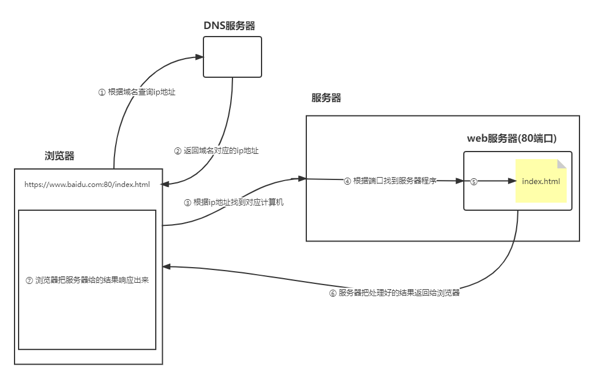


## 4.1 什么是`http`模块

`http` 模块是 `Node.js` 官方提供的、用来创建web 服务器的模块。它提供了一系列的方法和属性，例如：

⚫ `http.createServer()` 方法，用来创建一个web 服务器，从而对外提供web 资源
⚫ `http.request(`) 方法，用来发起` http `网络请求，请求其它web 服务器上的资源

如果要在 JavaScript 代码中使用` http `模块，则需要先导入它：

```javascript
const http = require('http')
```


## 4.2 创建最基本的web服务器

### 创建web服务器的基本步骤

① 导入 `http` 模块
② 创建 web 服务器实例
③ 启动服务器
④ 为服务器实例绑定request 事件，监听客户端的请求


### 创建web实现

```javascript
//1.导入 http 模块
const http = require('http')

//2.创建 web 服务器实例
const server = http.createServer()

//3.启动服务器
//参数1：端口号 1-65535 前100不要用（分配给系统程序）,用3000往后
//参数2：主机地址 本地：127.0.0.1 --> localhost(不写则默认)
//参数3：回调函数
server.listen(3000, () => {
    console.log('3000端口的web服务器已经启动')
})

/* 
   如何访问？
   127.0.0.1：3000
   localhost:3000
*/

// 4.为服务器实例绑定 request 事件，监听客户端的请求 
// 当客户端发送请求到服务器的时候，会触发这个事件
//参数1：req 接收的是一个request对象，它包含了所有请求相关的信息
//参数2：res 接收的是一个response对象，它包含了所有响应相关的信息,可以通过该对象给客户端返回响应
server.on('request', (req, res) => {
    // 这里要处理客户端的请求
    console.log('hello html')
    console.log(req)
    
    //返回一个响应
    //res.end()方法 结束并返回响应结果
    res.end('this is ok')
})

//注意点：
//1.端口被占用
//2.当修改了服务器的东西，要重启服务器
```

### 端口号

计算机中的端口号，就好像是现实生活中的门牌号一样。通过门牌号，外卖小哥可以在整栋大楼众多的房间中，准确把外卖 送到你的手中。
同样的道理，在一台服务器中，可以运行成百上千个web 服务。此时，通过端口号，客户端发送过来的网络请求，可以被准 确地交给端口号对应的web 服务进行处理。

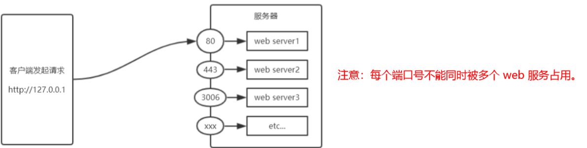


## 4.3 request对象详解

> request对象，包含了所有请求相关的信息。

文档地址：http://nodejs.cn/api/http.html#http_request_method

常见属性：

```javascript
headers: 所有的请求头信息
method： 请求的方式
url： 请求的地址
```

```js
const http = require('http')

const server = http.createServer((req, res) => {
    console.log('请求进来了')
        //请求常用的属性
    console.log('--------------------')
    console.log(req.headers) //获取请求头信息
    console.log(req.method) //获取请求的方法 比如：get/post/put
    console.log(req.url) //获取请求的url
    console.log('--------------------')

    res.end('this is very ok yeyeye~~~')
})

server.listen(3000, (req, res) => {
    console.log('3000端口的web服务器已经启动')
})


3000端口的web服务器已经启动
请求进来了
--------------------
{
  host: 'localhost:3000',
  connection: 'keep-alive',
  'cache-control': 'max-age=0',
  'sec-ch-ua': '";Not A Brand";v="99", "Chromium";v="94"',
  'sec-ch-ua-mobile': '?0',
  'sec-ch-ua-platform': '"Windows"',
  'upgrade-insecure-requests': '1',
  'user-agent': 'Mozilla/5.0 (Windows NT 10.0; WOW64) AppleWebKit/537.36 (KHTML, like Gecko) Chrome/94.0.4606.71 Safari/537.36 Core/1.94.190.400 QQBrowser/11.5.5240.400',
  accept: 'text/html,application/xhtml+xml,application/xml;q=0.9,image/avif,image/webp,image/apng,*/*;q=0.8,application/signed-exchange;v=b3;q=0.9',
  'sec-fetch-site': 'none',
  'sec-fetch-mode': 'navigate',
  'sec-fetch-user': '?1',
  'sec-fetch-dest': 'document',
  'accept-encoding': 'gzip, deflate, br',
  'accept-language': 'zh-CN,zh;q=0.9'
}
GET
/adbc/aa/bb?name=xx&age=19
--------------------

```

注意：在发送请求的时候，可能会出现两次请求的情况，这是因为谷歌浏览器会自动增加一个`favicon.ico`的请求。` /favicon.ico`

小结：request对象中，常用的就是method和`url`两个参数

简化写法：

```js
const http = require('http')

http.createServer((req, res) => {

}).listen(3000, () => {
    console.log('3000端口的web服务器已经启动')
})
```

需求：根据用户的请求,    响应不同的内容

```js
/*
    根据用户的请求,    响应不同的内容
    /index.html       this is index.html
    /login.html       this is login.html
    /register.html    this is register.html
    其他地址           this is 404
*/

const http = require('http')

http.createServer((req, res) => {
    //根据不同请求，响应不同内容
    if (req.url === '/index.html') {
        res.end('this is index.html')
    } else if (req.url === '/login.html') {
        res.end('this is login.html')
    } else if (req.url === 'register.html') {
        res.end('this is register.html')
    } else {
        res.end('this is 404')
    }
}).listen(3000, () => {
    console.log('3000端口的web服务器已经启动')
})
```


## 4.4 response对象详解

> response对象，包含了所有响应相关的信息。

文档地址：http://nodejs.cn/api/http.html#http_class_http_serverresponse

常见的属性和方法：

```javascript
res.write(data): 给浏览器发送响应体，可以调用多次，从而提供连续的请求体
res.end():   通知浏览器，所有响应头和响应主体都已被发送，即服务器将其视为已完成。
res.end(data): 结束请求，并且响应一段内容，相当于res.write(data) + res.end()
res.statusCode: 响应的的状态码 200 404 500
res.statusMessage: 响应的状态信息， OK Not Found ,会根据statusCode自动设置。
res.setHeader(name, value): 设置响应头信息， 比如content-type
res.writeHead(statusCode, statusMessage, options):	 设置响应头，同时可以设置状态码和状态信息。
```

**注意：必须先设置响应头，才能设置响应。** 

```js
//1.引入 http 模块
const http = require('http')

//2.创建web服务器，并运行在3000端口上
http.createServer((req, res) => {

    //2.1 res.write(data) 给浏览器发送响应体，可以调用多次，从而提供连续的请求体
    //res.write('hello')
    //res.end()

    //2.2 res.end(data) 结束请求，并且响应一段内容，相当于res.write(data) + res.end()
    //res.end('hello world')

    //2.3 res.statusCode 响应的的状态码 200 404 500
    //2.31正常情况 默认200
    //res.statusCode = 200
    //res.end('status is ok')
    //2.32资源找不到(路径错误)
    //res.statusCode = 404
    //res.end('this is 404')
    //2.33服务器内部错误
    //res.statusCode = 500
    //res.end('this is 500,server is err')

    //2.4 res.setHeader(name, value): 设置响应头信息， 比如content-type
    //res.setHeader('Content-Type', 'text/html; charset=utf-8')
    //res.end('hello,我是清')

    //2.5 res.writeHead(statusCode, statusMessage, options):	 设置响应头，同时可以设置状态码和状态信息。
    res.writeHead(404, 'Not found~', {
        'Content-Type': 'text/html; charset=utf-8'
    })
    res.end('页面404错误')
}).listen(3000, () => {
    console.log('3000端口的web服务器已经启动')
})
```


### 解决中文乱码问题

当调用` res.end()` 方法，向客户端发送中文内容的时候，会出现乱码问题，此时，需要手动设置内容的编码格式：

```javascript
res.setHeader('Content-Type', 'text/html; charset=utf-8');
```


### 根据不同的`url`响应不同的`html`内容

```javascript
/*
  根据用户的请求, 响应不同的内容
  /index.html    响应:   这是一个首页
  /login.html    响应:   这是一个登录页
  其他           响应:   404你访问的页面不存在
*/

//1.引入 http 模块
const http = require('http')

//2.创建一个web服务器实例
const server = http.createServer()

//3.运行到3000端口
server.listen(3000, () => {
    console.log('3000端口的web服务器已经启动')
})

//4.监听request事件
server.on('request', (req, res) => {
    //4.1 设置响应头
    res.setHeader('Content-Type', 'text/html; charset=utf-8')
        //4.2 根据url地址返回不同的内容
    if (req.url === '/' || req.url === '/index.html') {
        res.end('<h1>这是一个首页</h1>')
    } else if (req.url === '/login.html') {
        res.end('这是一个登录页')
    } else {
        res.end('404你访问的页面不存在')
    }
})
```

## 案例：时钟案例

```js
/* 
  把时钟案例部署在本地服务器上
  通过localhost:3000能够访问
*/

const http = require('http')
const fs = require('fs')
const path = require('path')

const server = http.createServer()

server.listen(3000, () => {
    console.log('3000端口的web服务器已经启动')
})

server.on('request', (req, res) => {
    //console.log(req.url)   /  /index.css  /index.js
    if (req.url === '/') {
        //1.从本地读取index.html文件中的内容
        fs.readFile(path.join(__dirname, 'clock', 'index.html'), (err, data) => {
            if (err) return console.log('读取文件失败', err)
                //2.响应给浏览器端
            res.setHeader('Content-Type', 'text/html; charset=utf-8')
            res.end(data)
        })
    } else if (req.url === '/index.css') {
        fs.readFile(path.join(__dirname, 'clock', 'index.css'), (err, data) => {
            if (err) return console.log('读取文件失败', err)
                //2.响应给浏览器端
            res.setHeader('Content-Type', 'text/css')
            res.end(data)
        })
    } else if (req.url === '/index.js') {
        fs.readFile(path.join(__dirname, 'clock', 'index.js'), (err, data) => {
            if (err) return console.log('读取文件失败', err)
                //2.响应给浏览器端
            res.setHeader('Content-Type', 'application/javascript')
            res.end(data)
        })
    }
})
```


# 5. 实现静态WEB服务器

## 5.1 服务器响应首页

- 注意：浏览器中输入的URL地址，仅仅是一个标识，不与服务器中的目录一致。也就是说：返回什么内容是由服务端的逻辑决定

```js
server.on('request', function(req, res) {
  if(req.url === '/') {
      //从本地读取index.html文件中的内容
    fs.readFile('./index.html', function(err, data) {
      if(err) return res.end('您访问的资源不存在~')
      res.end(data)
    })
  }
})
```


## 5.2 根据根据不同`url`，响应不同文件

### content-type设置-MIME类型 

- MIME(Multipurpose Internet Mail Extensions)多用途Internet邮件扩展类型 是一种表示文档性质和格式的标准化方式
- 浏览器通常使用MIME类型（而不是文件扩展名）来确定如何处理文档；因此服务器将正确的MIME类型附加到响应对象的头部是非常重要的
- [MIME 类型](https://developer.mozilla.org/zh-CN/docs/Web/HTTP/Basics_of_HTTP/MIME_Types)

### 静态资源的通用处理

### MIME类型的通用处理-mime模块

- 作用：获取文件的MIME类型
- 安装：`npm i mime`

```js
//终端：npm init -y   npm i mime

//1.引入三方模块
const mime = require('mime')

// 获取路径对应的MIME类型
mime.getType('txt')                    // ⇨ 'text/plain' 纯文本
console.log(mime.getType('/index.html')) //text/html
console.log(mime.getType('/index.js')) //application/javascript
console.log(mime.getType('/index.css')) //text/css
console.log(mime.getType('/logo.png')) //image/png
console.log(mime.getType('静夜思.txt')) //text/plain

// 根据MIME获取到文件后缀名
mime.getExtension('text/plain')        // ⇨ 'txt'
```


把可视化静态网站 部署到 3000端口的 web服务器上


```js
/* 
  把 可视化静态网站 部署到 3000端口的 web服务器上
*/

const http = require('http')
const fs = require('fs')
const path = require('path')
const mime = require('mime')

const server = http.createServer()

server.listen(3000, () => {
    console.log('3000端口的web服务器已经启动')
})

server.on('request', (req, res) => {
    //index.html
    //1.拼接读取资源的完整路径
    let reqUrl = req.url === '/' ? '/index.html' : req.url   //3000直接是首页
    const fullPath = path.join(__dirname, 'project', reqUrl)
    console.log(fullPath)

    //2.根据路径读取本地文件
    fs.readFile(fullPath, (err, data) => {
        if (err) {
            //如果访问的页面不存在，则返回404页面
            fs.readFile(path.join(__dirname, 'project', '404.html'), (err, data) => {
                if (err) return console.log('读取404页面失败', err)
                res.setHeader('Content-Type', 'text/html; charset=utf-8')
                res.end(data)
            })
            return
        }
        //响应给浏览器
        res.setHeader('Content-Type', mime.getType(req.url))
        res.end(data)
    })
})
```


# 三：npm与模块化


# 1. 模块化

`问题: 当一个文件的js代码越来越多的时候,会出现什么问题?`

## 1.1 什么是模块化	

> 一个模块其实指的就是一个独立的js文件

**模块化**是指解决一个复杂问题时，自顶向下逐层把系统划分成若干模块的过程。 对于整个系统来说，模块是可组合、分解和更换的单元。


### 编程中的模块化

编程领域中的模块化，就是**遵守固定的规则**，把一个大文件拆成独立并互相依赖的多个小模块。

把代码进行模块化拆分的好处: 

- 提高了代码的复用性
- 提高了代码的可维护性
- 可以实现按需加载


## 1.2 模块化规范

**模块化规范**就是对代码进行模块化的拆分与组合时，需要遵守的那些规则。

例如:

- 使用什么样的语法格式来引用模块   比如: `require('fs')`
- 在模块中使用什么样的语法格式向外暴露成员 (目前没有学习，马上学习)

**模块化规范的好处**:

1. 大家都遵守同样的模块化规范写代码，降低了沟通的成本
2. 极大方便了各个模块之间的相互调用， 利人利己

> **我们自己写模块，也要遵守模块化的标准**。


## 1.3 了解CommonJS规范

> 早期, js没有模块化规范, js越来越火, 想要用js开发大型项目, 必须要有模块化的规范。
>
> 民间出现了大量的`js`的模块化规范
>
> --------最终演变成----------
>
> 浏览器端的模块化规范
>
> 服务端的模块化规范


模块化规范的种类：

- `AMD`   浏览器端（国外 - 代表：`requirejs`）
- `CMD ` 浏览器端（国内 - 代表：`seajs`）
- CommonJS  服务器端 (代表: nodejs)
- `ES6 ` 大一统,  将来浏览器和服务器端统一的模块化语法标准

`Node.js` 遵循了` CommonJS `模块化规范，`CommonJS` 规定了模块的特性和各模块之间如何相互依赖。


## 1.4 Node.js 中模块的分类

Node.js 中根据模块来源的不同，将模块分为了 3 大类，分别是:

- 内置模块(内置模块是由 `Node.js` 官方提供的，例如 `fs`、`path`、`http` 等)

- 自定义模块(用户创建的每个 `.js` 文件，都是自定义模块)

- 第三方模块(由第三方开发出来的模块，并非官方提供的内置模块，也不是用户创建的自定义模块，使用前需要先下载)

  

## 1.5 加载模块

```js
// 加载核心(内置)模块
const fs = require('fs')
const http = require('http')

// 加载第三方模块
const express = require('express')
const mime = require('mime')

// 加载自定义模块
//加载自定义模块需要加上 './' ,可以省略后缀
const custom = require('./custom')
```

**注意事项**：

- 无论是什么模块，我们都要使用 `require()` 去加载，然后才能使用。
- 加载自定义的模块，需要加 `./` ，而且可以省略后缀 `.js`


## 1.6 自定义模块的实现（重点）

### `Node.js`中的模块作用域

在 `Node.js` 中，用户创建的每个 `.js` 文件都是自定义模块。 在自定义模块中定义的变量、方法等成员，只能在当前模块内被访问，这种模块级别的访问限制，叫做**模块作用域**。

> 模块作用域的好处是避免了全局变量污染。

由于模块具有一个模块级别的作用域，则另一个JS文件就无法使用当前模块定义的内容，如下图所示。

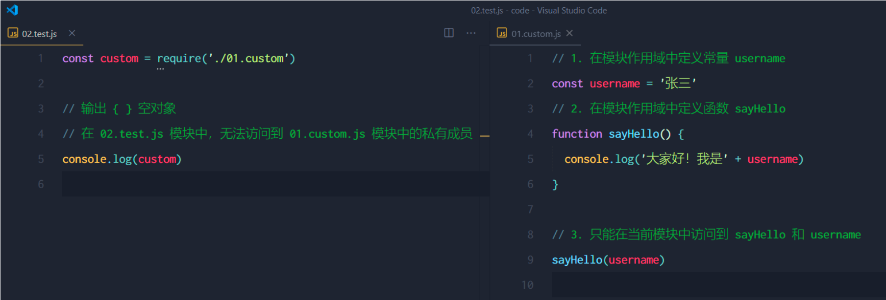

需求：一个模块中如何去使用其他模块中的属性和方法？

CommonJS 规定:

1. 每个模块内部，```module``` 变量代表当前模块。

2. module 变量是一个对象，它的 ```exports``` 属性(即 module.exports)是对外的接口。

3. 加载某个模块，其实是加载该模块的 ```module.exports``` 属性。require() 方法用于加载模块。

   

### 导出导入模块

为了能正常使用加载的模块中的成员，`CommonJS`给出了标准，即

- 一个模块需要使用 `module.exports` 导出需要共享的内容。
- 使用模块的`JS`文件需要使用 `require()` 导入模块。


> 模块导出的是什么，另一个使用模块的JS文件得到的就是什么。


## 1.7 require()加载模块的机制

加载自定义模块和其他模块的机制有相同之处，也有不同之处，所以这里分开来看。

### 加载自定义模块

1. 首次加载成功，会缓存模块
2. 下次从缓存中加载，速度更快
3. 加载自定义模块必须加 `./` ，如果是其他路径，对应变化，否则会把它当做核心模块或者第三方模块
4. 加载自定义模块的时候，如果是 `require('./abc')`
   1. 优先加载相同名字的文件，加载一个叫做 abc 的文件
   2. 自动补 `.js` 后缀，然后加载 `abc.js` 文件
   3. 自动补 `.json` 后缀，然后加载 `abc.json` 文件
   4. 自动补 `.node` 后缀，然后加载 `abc.node` 文件
   5. 以上文件都没有，则报错 `Cannot find module './abc'`
   
   

**`commonJS`的底层实现**


### 加载核心模块和第三方模块

1. 首次加载成功，会缓存模块

2. 下次从缓存中加载，速度更快

3. 加载模块一定`不能`加 `./` ，否则会把它当做自定义模块

4. 加载模块的时候，如果是 `require('haha')`

   1. 优先加载核心模块

   2. 去查找并加载第三方模块，查找第三方模块的路径可以通过 `module.paths` 查看

      [

       'C:\\Users\\yjh\\Desktop\\99-框架前置课\\day2\\04-案例\\01-模块化\\03-自定义模块加载细节\\node_modules',
        'C:\\Users\\yjh\\Desktop\\99-框架前置课\\day2\\04-案例\\01-模块化\\node_modules',
        'C:\\Users\\yjh\\Desktop\\99-框架前置课\\day2\\04-案例\\node_modules',
        'C:\\Users\\yjh\\Desktop\\99-框架前置课\\day2\\node_modules',
        'C:\\Users\\yjh\\Desktop\\99-框架前置课\\node_modules',
        'C:\\Users\\yjh\\Desktop\\node_modules',
        'C:\\Users\\yjh\\node_modules',
        'C:\\Users\\node_modules',
        'C:\\node_modules'

      ]

   3. 加载第三方模块会从当前目录开始寻找node_modules文件夹， 如果找到进入node_modules文件夹寻找对应的模块。如果没找到，进入上一级目录继续寻找node_modules，一直到根目录。如果一直没有找到，提示未找到模块。


# 2. npm初步使用

## 2.1 介绍

npm（node  package  manager）node包管理器。

包是什么？包就是模块。

npm这个工具，在安装node的时候，就已经安装到你的计算机中了。

命令行中执行： `npm -v` ，如果看到版本号，说明安装成功了。

npm中文网: https://www.npmjs.com.cn/


## 2.2 作用

npm的作用是：管理node模块的工具。

- 下载并安装第三方的模块
- 卸载第三方模块
- ....

第三方模块：

- 非内置模块，安装完node，还不能使用的模块，需要从网上下载安装，才能使用的模块
- 第三方模块是个人、公司、组织编写的模块，发布到网上，供我们使用

> npm 就是一个管理（下载安装、卸载...）第三方模块的工具


## 2.3 初始化

使用npm工具之前，必须先初始化。

```bash
npm init -y
# 或
npm init
# 然后一路回车
```

初始化之后，会在项目目录中生成 package.json 的文件。

注意：

1. 上述命令只能在英文的目录下运行成功！所以，项目文件夹的名称一定要使用英文命名，**不要使用中文，不能出现空格。**
2. 运行 npm install 命令安装包的时候，npm包管理工具会把包的名称和版本号，记录到 package.json中。

​      

## 2.4 什么第三方模块

非node自带的模块。

是别人写的模块，然后发布到npm网站，我们可以使用npm工具来下载安装别人写的模块。

第三方模块，都是在node核心模块的基础之上，封装了一下，实现了很多非常方便快速简洁的方法。

目前，npm网站收录了超过 150万个第三方模块。


## 2.5 安装卸载项目模块

下载安装第三方模块

```bash
npm install 模块名
npm i 模块名

npm i 模块名@版本号   安装固定版本 使用 `npm i` 命令安装包的时候，会自动安装最新版本的包，可以手动安装指定版本的包
```

卸载模块

```bash
npm uninstall 模块名
npm un 模块名
```


```
node_modules文件夹用来存放所有已安装到项目中的包。require()导入第三方包时，就是从这个目录中查找并加载包。
package-lock.json配置文件用来记录 node_modules目录下的每一个包的下载信息，例如包的名字，版本号，下载地址等。
注意：程序员不要手动修改 node_modules或package-lock.json文件中的任何代码，npm包管理工具会自动维护它们。
```


## 2.6 关于项目模块的说明

- 下载安装的模块，存放在当前文件夹的 `node_modules` 文件夹中，同时还会生成一个记录下载的文件 `package-lock.json`
- 下载的模块，在哪里可以使用
  - 在当前文件夹
  - 在当前文件夹的子文件夹
  - 在当前文件夹的子文件夹的子文件夹
  - ......
- 怎样使用第三方模块
  - 和使用内置模块一样，需要使用 `require` 加载模块
  - 调用模块提供的方法完成工作（一般好的模块都会用使用文档的）


## 2.7 演示下载安装第三方模块

这里演示一个处理时间日期的模块 -- moment

http://momentjs.cn/

下载安装moment模块

```bash
npm init -y
npm i moment
```

演示使用moment模块处理时间

```js
// 加载模块
const moment = require('moment')

console.log(moment().format('YYYY-MM-DD hh:mm:ss'))
// 官网：http://momentjs.cn
```


## 2.8 dependencies说明

 1、作用：保存依赖包的记录。

 2、以后如果看到我们项目中 没有node_modules目录， 但是有 `package.json`。说明我们项目是完整的。执行 **npm i** 会找 `package.json` 里面的 dependencies， 并且安装里面的所有依赖包

 3、执行 `npm i` 命令 要在 `package.json` 同级目录。


## 2.9 全局模块

- 全局安装的模块，不能通过 `require()` 加载使用。

- 全局安装的模块，一般都是命令或者工具。用管理员身份打开 windows PowerShell

- 安装方法，在安装模块的命令后面，加 `-g`

  ```bash
  npm i 模块名 -g
  # 或
  npm i -g 模块名
  ```

- 查看全局安装的模块 

  ```bash
  npm list -g --depth 0
  ```

- 卸载方法（也是多一个 `-g`）

  ```bash
  npm un 模块名 -g
  ```

- 全局安装的模块，在系统盘（C盘）

  - 通过命令 `npm root -g` 可以查看全局安装路径

> mac安装过程可能出现权限问题，可以使用 sudo npm i xxx -g


## 2.10 全局安装nodemon模块

- 安装命令

  ```bash
  npm i nodemon -g
  ```

- `nodemon`的作用：

- 代替node命令，启动服务的，当更改代码之后，`nodemon`会自动帮我们重启服务。

- 运行nodemon，如果报错如下：


- 解决办法是：
  - `管理员`方式，打开命令行窗口
  - 执行 ` set-ExecutionPolicy RemoteSigned` 
  - 在出现的选项中，输入 `A`，回车。即可


##  2.11 本地安装和全局安装区别

有两种方式用来安装 `npm` 包：本地安装和全局安装。选用哪种方式来安装，取决于你如何使用这个包。 

1. 本地安装

- 说明 : 想把我们用的包,安装到当前本地项目中使用 
- 比如 : `npm i jquery `, `npm i moment`
- 要求 : 执行的安装命令`(npm i moment) `位置,必须在当前项目下执行 
- 包位置 :  本地安装的包 => 当前项目下的 node_modules
- 使用包 :  `const moment = require('moment')  , const $ = require('jquery')`

2. 全局安装

- 说明 : 想把一个包/库,当成一个`工具`来使用, 就采用全局安装 

- 比如 : `npm i  -g live-server `

- 要求 : 可以在任意地方, 都可以执行命令  

- 包位置 : `C:\Users\用户名\AppData\Roaming\npm`

- 使用包 :  在`终端命令行`里使用, 不能在代码里


## 2.12 更改镜像源

镜像源，就是下载安装第三方模块的网站。

我们下载的第三方模块都是从国外的npm主站下载的，速度比较慢。

淘宝在国内对npm上的第三方模块做了一个备份，也就是说，我们可以从国内下载第三方模块。

除了淘宝之外，还有很多其他镜像源。

简单的更改镜像源方法：

- 全局安装 nrm 的模块
  - nrm  用于管理镜像源
- 使用nrm
  - `nrm ls` 通过这个命令，可以查看可用的镜像源
  - `nrm use taobao` ，切换下载模块的网站为淘宝

https://www.jianshu.com/p/90893d947432


### 拓展

#### 1.包的语义化版本

```js
包的版本号是以“点分十进制”形式进行定义的，总共有三位数字，例如 2.24.0
其中每一位数字所代表的含义如下：
第一位数字：大版本
第二位数字：功能版本
第三位数字：Bug修复版本

版本号提升的规则：只要前面的版本号增长了，则后面的版本号归零。
```

#### 2.包管理配置文件

`npm`规定，在项目跟目录中，必须提供一个叫做 `package.json`的包管理配置文件。用来记录与项目相关的一些配置信息。

- 项目的名称，版本号，描述等
- 项目中都用到了那些包
- 那些包只在开发期间会用到
- 那些包在开发和部署时都需要用到

#### 3.多人协作的问题

遇到的问题：第三方包的体积过大，不方便成员之间共享项目源代码。

解决方案：共享时剔除`node_modules`

```
如何记录项目中安装了那些包：
在项目的根目录中，创建一个叫 package.json 的配置文件（git init -y），即可用来记录项目中安装了哪些包。
从而方便剔除 node_modules目录之后，在团队成员之间共享项目的源代码。

注意：今后在项目开发中，一定要把 node_modules文件夹，添加到 .gitignore忽略文件中！！！
```

#### 4. devDependencies

如果某些包 只在项目开发阶段会用到， 在项目上线之后不会用到，则建议把这些包记录到 devDependencies节点中。

与之对应的，如果某些包在开发和项目上线之后都需要用到则建议把这些包记录到 dependencies节点中。

可以使用如下了命令，将包记录到devDependencies节点中：

```js
//安装指定的包，并记录到 devDependencies节点中
npm i 包名 -D

//注意：上述命令是简写形式，等价于下面的完整写法：
npm install 包名 --save-dev
```

#### 4.解决下包慢的问题

在使用npm下包的时候，默认从国外的 https://registry.npmjs.org/服务器进行下载，此时，网络数据的传输需要经过漫长的海底光缆。

更改镜像源

```js
//查看当前的下包镜像源  //检查镜像源是否下载成功
npm config get registry

//将下包的镜像源切换为淘宝镜像源
npm config set registry=https://registry.npm.taobao.org/

```


#### 5.包的分类

1. 项目包 ：那些被安装到项目的 node_modules 目录中的包，都是项目包。

   - 开发依赖包：被记录到 devDependencies 节点中的包，只在开发期间会用到。-D
   - 核心依赖包：被记录到 dependencies 节点中的包，只在开发期间和项目上线之后都会用到。

2. 全局包

   - 在执行 npm install 命令时，如果提供了 -g 参数，则会把包安装为 全局包。
   - 只有工具性质的包，才会全局安装的必要性，因为他们提供了好用的终端命令。
   - 判断某个是否需要全局安装的包，参考官方提供的使用说明即可。

3. i5ting_toc

   - 是一个可以把 md文档转为html页面的小工具，使用步骤为下：

   ```js
   //将 i5ting_toc 安装为全局包
   npm install -g i5ting_toc
   
   //调用 i5ting_toc,轻松实现 md 转 html 的功能
   i5ting_toc -f 要转换的md文件路径 -o
   ```

#### 6.规范的包结构

一个规范的包，它的组成结构，必须符合以下3个要求：

1. 包必须以单独的目录而存在
2. 包的顶级目录下要必须包含 package.json这个包管理配置工具
3. package.json中必须包含 name，version，main这三个属性，分别代表包的名字，版本号，包的入口

https://yarnpkg.com/zh-Hans/docs/package-json


#### 7.开发属于自己的包

1. 需要实现的功能

   ```js
   - //格式化日期
   - //转义 html中的特殊字符
   - //还原html中的特殊字符
   //1.导入自己的包
   const myBao = require('./myBao-tools')
   //-------功能1：格式化日期-----
   const dt = myBao.dateFormat(new Date())
   //输出 2022-02-04  16：41：08
   console.log(dt)
   //-------功能2:转移html中特殊字符
   const htmlStr = '<h1 style="color:red;">你好！ &copy;<span>小黄！</span></h1>'
   const str = myBao.htmlEscape(htmlStr)
   console.log(str)
   //--------功能3：还原html中的特殊字符
   const rawHTML = myBao.htmlUnEscape(str)
   console.log(rawHTML)
   
   ```

2. 初始化包的基本结构

   - 新建 myBao-tools文件夹，作为包的根目录
   - 在myBao-tools文件夹中新建3个文件：
     1. package.json （包管理配置文件）
     2. index.js （包的入口文件）
     3. README.md （包的说明文档）

3. 初始化package.json

   ```js
   {
     "name": "myBao-tools",
     "version": "1.0.0",
     "main": "index.js",
      "description": "提供了格式化时间，HTMLEscape的功能",
     "keywords": ["myBao","dateFormat","escape"],
     "author": "",
     "license": "ISC"
   }
   
   ```

4. 在index.js中定义格式化时间的方法

   ```js
   //dateFormat.js
   //格式化时间的方法
   function dateFormat(dateStr) {
       const dt = new Date(dateStr)
       
       const y = dt.getFullYear()
       const m =  padZero(dt.getMonth() + 1)
       const d =  padZero(dt.getDate())
       const hh =  padZero(getHours())
       const mm =  padZero(getMinutes())
       const ss =  padZero(getSeconds())
       
       return `${y}-${m}=${d} ${hh}:${mm}:${ss}`
   }
   //补零的方法
   function padZero(n) {
       return n>9? n:'0' + n
   }
   
   module.exports = {
       dateFormat
   }
   ```

5. 在index.js中定义转义HTML的方法

   ```js
   // htmlEscape.js --1
   function htmlEscape(htmlStr) {
       return htmlStr.replace(/<|>|"|&/g,(match)=> {
           switch(match) {
               case '<':
                   return '&lt;'
               case '>':
                   return '&gt;'
               case '"':
                   return '&quot;'
               case '&':
                   return '&amp;'
           }
       })
   }
   ```

6. 在 index.js中定义还原HTML的方法

   ```js
    //htmlEscape.js  --2
   function htmlUnEscape(str) {
       return str.replace(/&lt;|&gt;|&quot;|&amp;/g,(match)=> {
           switch(match) {
               case '&lt;':
                   return '<'
               case '&gt;':
                   return '>'
               case '&quot;':
                   return '"'
               case '&amp;':
                   return '&'
           }
       })
   }
   module.exports = {
       htmlEscape,
       htmlUnEscape
   }
   ```

7. 将不同的功能进行模块化的拆分

   1. 将格式化时间的4功能，拆分到 src ---> dateFormat.js中

   2. 将处理 HTML字符串的56功能，拆分到 src ----> htmlEscape.js中

   3. 在index.js中，导入两个模块，得到需要向外共享的方法  

   4. 在 index.js 中，使用 module.exports 把对应的方法共享出去

      ```js
      //index.js 入口文件
      //导入
      const date = require('./src/dateFormat')
      const escape = require('./src/htmlEscape')
      
      //需要向外暴露的成员
      modul.exports = {
          ...date,
          ...escape
      }
      ```

8. 编写包的说明文档

   包根目录中的README.md文件，是包的使用文档。通过它，我们可以事先把包的使用说明，以markdown的格式写出来，方便用户参考。具体些什么内容，没有强制性的要求。md文档中，会包含以下6项内容就可以了：

   安装方式，导入方式，格式化时间，转义html中的特殊字符，还原html中的特殊字符，开源协议

   ~~~js
   ##安装
   ```
   npm install myBao-tools
   ```
   ##导入
   ```js
   const myBao = require('myBao-tools')
   ```
   ##格式化时间
   ```js
   //调用 dateFormat 对时间进行格式化
   const dt = myBao.dateFormat(new Date())
   //输出 2022-02-04  16：41：08
   console.log(dt)
   ```
   ##转义html中的特殊字符
   ```js
   const htmlStr = '<h1 style="color:red;">你好！ &copy;<span>小黄！</span></h1>'
   const str = myBao.htmlEscape(htmlStr)
   console.log(str)
   ```
   ##还原html中的特殊字符
   ```js
   //待还原的字符串
   const rawHTML = myBao.htmlUnEscape(str)
   console.log(rawHTML)
   ```
   ##开源协议
   ISC
   ~~~

#### 8.发布包

1. 注册 npm账号

   1. 访问https://www.npmjs.com/网站，点击 sign up，进入注册用户页面
   2. 填写信息
   3. 注册登录

2. 登录npm账号

   可以在终端中执行 `npm login`命令，依次输入用户名，密码，，邮箱后，即可登录成功。

   注意：要先把下包的服务器地址切换为 npm的官方服务器，否则会导致发布失败！

3. 把包发布到npm上

   将终端切换到包的根目录下运行`npm publish`命令，即可将包发布到npm上(注意：包名不能雷同)

4. 删除已发布的包

   运行 `npm unpublish 包名 --force`命令，即可从npm删除已发布的包。

   注意：

   1. `npm unpublish`命令只能删除72小时以内发布的包
   2. `npm unpublish`删除的包，在24小时内不允许重复发布
   3. 发布包的时候要慎重，尽量不要往npm上发布没有意义的包！

#### 9.模块的加载机制

1. 优先从缓存中加载

   模块在第一次加载后会被缓存。这也意味着多次调用require()不会导致模块的代码被执行多次。

   注意：不论是内置模块，用户自定义模块，还是第三方模块，他们都会优先从缓存中加载，从而提高模块的加载效率。

2. 内置模块的加载机制

   内置模块是由Nodejs官方提供的模块，内置模块的加载优先级最高。

   例如：require('fs')始终返回内置的fs的模块，即使在node_modules目录下有名字相同的包也叫fs。

3. 自定义模块的加载机制

   使用require()加载自定义模块时，必须指定以 ./ 或 ../ 开头的路径标识符。在加载自定义模块时，如果没有指定 ./ 或者 ../ 这样的路径标识符，则node会把它当作内置模块或第三方模块进行加载。

4. 第三方模块的加载机制

   如果传递给require()的模块标识符不是一个内置模块，也没有以 ./ 或 ../ 开头，则nodejs会从当前模块的父目录开始，尝试从 /node_modules文件夹中加载第三方模块。

   如果没有找到第三方模块，则移动到再上一层父目录中，进行加载，直到文件系统的根目录。

5. 目录作为模块的加载机制

   当把目录作为模块标识符，传递给require()进行加载的时候，有三种加载方式：

   - 在被加载的目录下查找一个叫做 package.json的文件，并寻找main属性，作为require()加载的入口
   - 如果目录里没有package.json文件，或者main入口不存在或无法解析，则nodejs将会试图加载目录下的index.js文件
   - 如果以上两部都失败了，则nodejs会在终端打印错误消息，报告模块的缺失：Error:Cannot find module 'xxx'


# 3. 同源&跨域

## 3.1 什么是同源?

同源：指的是两个URL地址具有相同的  协议地址、主机名、端口号。

例如，下表给出了相对于 http://www.test.com/index.html 页面的 5 个同源检测结果：


## 3.2 什么是同源策略?

同源策略（英文全称 Same origin policy）是浏览器提供的一个安全功能。
浏览器的同源策略规定：**不允许非同源的 URL 之间进行资源的交互**。


>请大家思考：如果没有浏览器，还会有同源策略吗？
>A. 有
>B. 没有 1


## 3.3 什么是跨域?

同源指的是两个 URL 的协议、主机名、端口号完全一致，反之，则是跨域。

出现跨域的根本原因：浏览器的同源策略不允许非同源的 URL 之间进行资源的交互。例如：

- 网页：http://www.test.com/index.html
- 接口：http://www.api.com/userlist
- 受到同源策略的限制，上面的网页请求下面的接口会失败！


### 3.3.1 浏览器对跨域请求的拦截过程?

浏览器允许发起跨域请求。但跨域请求回来的数据，会被浏览器拦截，无法被页面获取到！示意图如下：


### 3.3.2 突破浏览器跨域限制的两种方案?

代理服务器 和 CORS 是实现跨域数据请求的两种技术方案。

>  注意：
>
>  1) 代理服务器跨域在后面vue课程中会讲到
>
>  2) CORS 是跨域的主流技术解决方案


#### CORS 的概念

1) CORS 是解决跨域数据请求的终极解决方案，全称是 Cross-origin resource sharing。

2)  CORS 技术需要浏览器和服务器同时支持，二者缺一不可：

- 浏览器要支持 CORS 功能（主流的浏览器全部支持，IE 不能低于 IE10）
- 服务器要开启 CORS 功能（需要后端开发者为接口开启 CORS 功能）

> 请大家思考：实现 CORS 的关键，是在客户端还是在服务器端？
>
> 答案：服务器端。
> 原因：如果服务器端没有开启 CORS 功能，则客户端无法访问那些跨域的接口！


#### CORS 的原理

服务器端通过 Access-Control-Allow-Origin 响应头，来告诉浏览器当前的 API 接口是否允许跨域请求。


#### CORS 的两个主要优势

1) CORS 是真正的 Ajax 请求，支持 GET、POST、DELETE、PUT、PATCH 等这些常见的 Ajax 请求方式
2) 只需要后端开启 CORS 功能即可，前端的代码无须做任何改动

> 注意：
>
> 我们之前做过的案例中，所有调用的接口均已在服务器端开启了 CORS 功能！
> 例如：聊天机器人案例、新闻列表案例、用户登录案例


```js
const http = require('http')
const fs = require('fs')
const path = require('path')

http.createServer((req, res) => {
    if (req.url === '/api/news') {
        //读取本地的json文件
        fs.readFile(path.join(__dirname, 'data', 'list.json'), (err, data) => {
            if (err) return console.log('读取的文件不存在', err)

            //响应回去
            res.setHeader('Content-Type', 'application/json; charset=utf-8')
                //配置响应头
            res.setHeader('Access-Control-Allow-Origin', '*')
            res.end(data)
        })
    }
}).listen(3000, () => {
    console.log('3000端口的web服务器已经启动')
})
```

