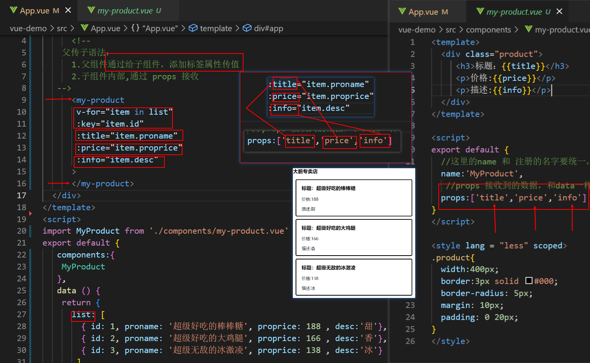
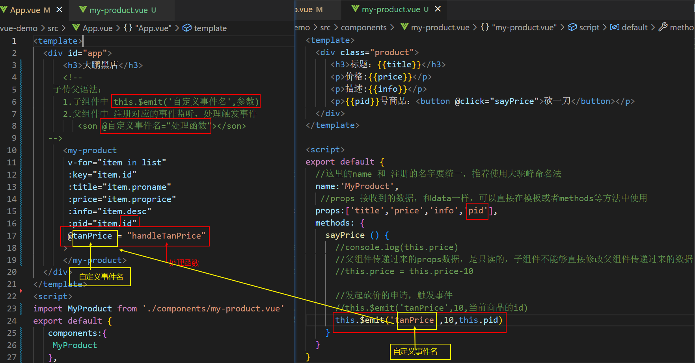
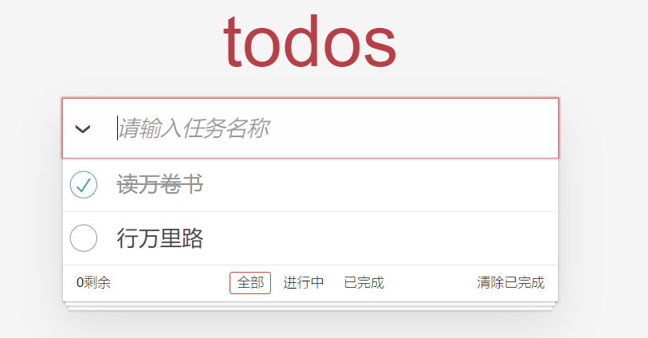
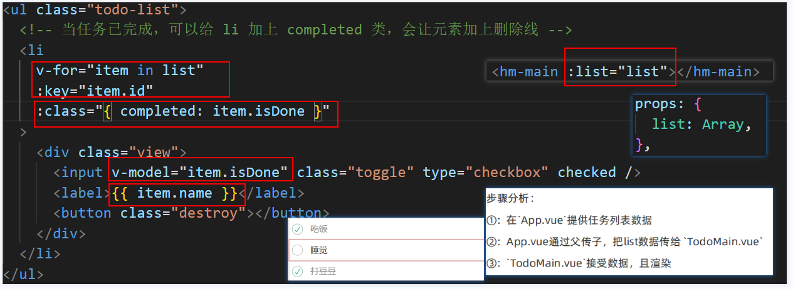
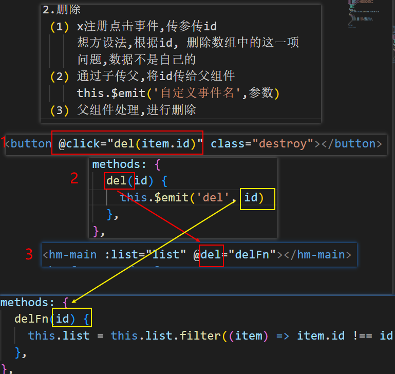
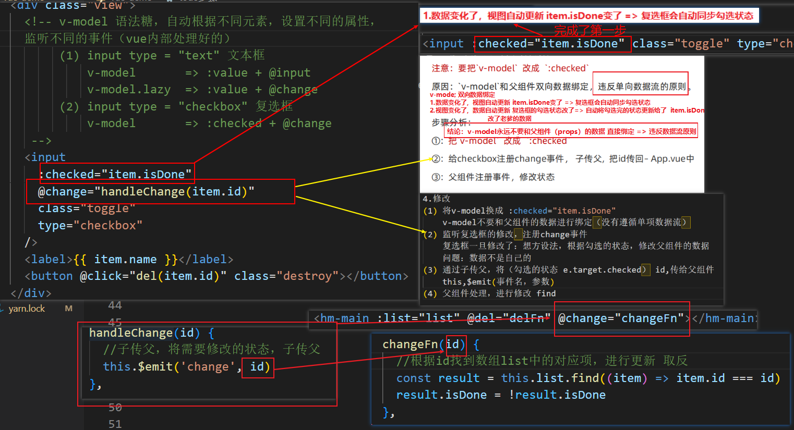
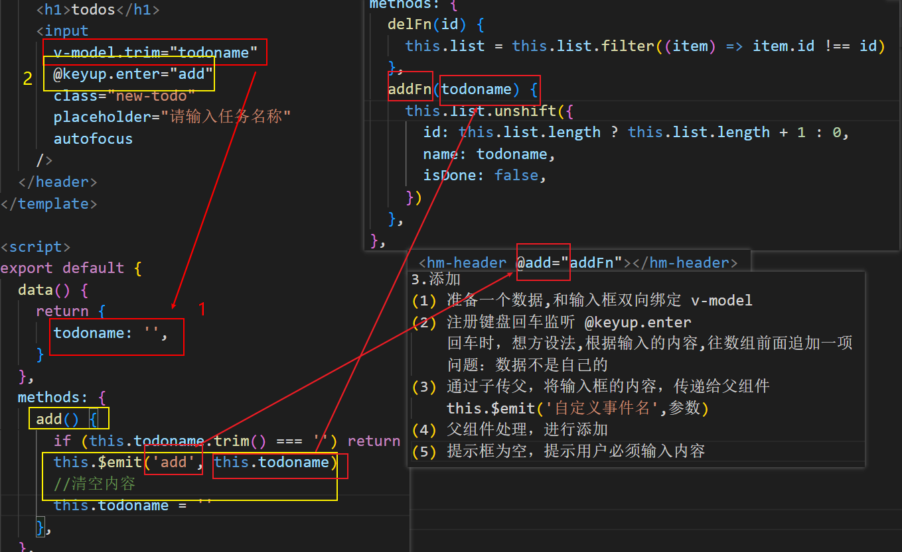
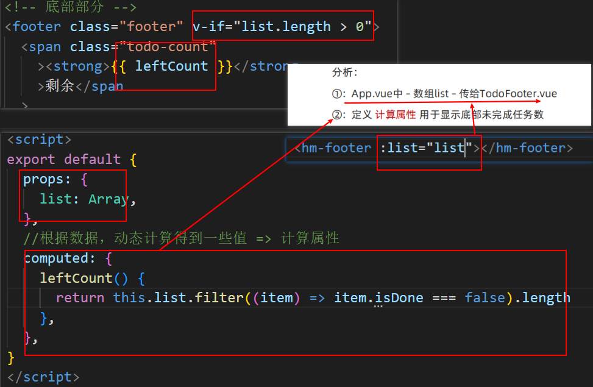
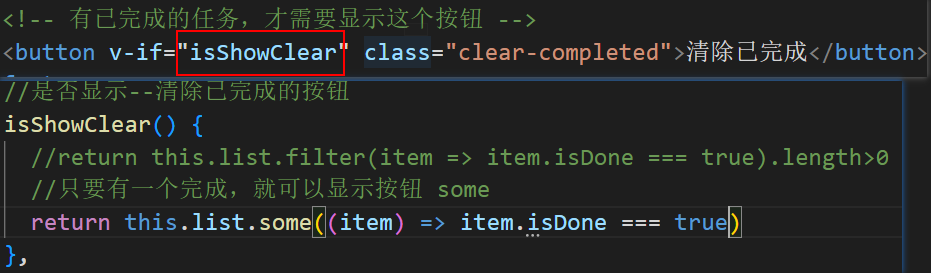

# 组件化开发

> . 遇到重复标签结构想复用?   ==> 封装成组件

> 封装组件的好处? --> 各自独立, 便于复用，可维护性高

## 什么是组件化开发

1. 组件是可复用的 `Vue `实例, 封装标签, 样式和`JS`代码
2. **组件化开发** 指的是：根据封装的思想，把页面上 **`可重用的部分`** 封装为 **`组件`**，从而方便项目的 开发 和 维护。
3. **一个页面， 可以拆分成一个个组件，一个组件就是一个整体**
4. **每个组件可以有自己独立的 结构 样式 和 行为**

例如：http://www.ibootstrap.cn/ 所展示的效果，就契合了组件化开发的思想。

用户可以通过拖拽组件的方式，快速生成一个页面的布局结构。


前端组件化开发的好处主要体现在以下两方面：

- 提高了前端代码的**复用性和灵活性**  

- 提升了开发效率和后期的**可维护性**


`vue 是一个完全支持组件化开发的框架。vue 中规定组件的后缀名是` `.vue`。


## 组件的注册

刚才我们创建使用的是` App.vue` 根组件, 这个比较特殊, 是最大的一个**根组件**

而`App.vue`根组件内, 还可以写入一些小组件, 而这些组件, 要使用, 就需要先注册!

**使用组件的四步**：

1. 创建组件, 封装要复用的标签, 样式, `JS`代码
2. 引入组件
3. 注册组件
   - 全局注册 – `main.js`中
   - 局部注册 – 某`.vue`文件内
4. 使用组件：组件名当成标签使用即可   **<组件名></组件名>**

注意点：组件名不能和内置的`html`名同名

**注册组件有两种注册方式**:  分为“全局注册”和“局部注册”两种

- 被全局注册的组件，可以在任意的组件模板范围中使用 通过`Vue.component()`
- 被局部注册的组件，只能在当前注册的组件模板范围内使用 通过`components`

### 局部注册


+ 把独立的组件封装一个`.vue文件中`，推荐放到**`components`**文件夹

```jsx
components中：文件名要用两个单词
  -- HmHeader.vue
  -- HmContent.vue
  -- HmFooter.vue
```

+ 通过组件的`components`配置 局部注册组件

```jsx
import HmHeader from './components/HmHeader.vue'
import HmContent from './components/HmContent.vue'
import HmFooter from './components/HmFooter.vue'

export default {
  // data methods filters computed watch
  components: {
    // 组件名: 组件
    // 组件名：注意，不能和html内置的标签重名
    // 使用的时候：直接通过组件名去使用
    // HmHeader  HmHeader  hm-header
    HmHeader,
    HmContent,
    HmFooter
  }
}
```

==>注意点：注册的组件的名字不能和HTML内置的标签重名==

+ 可以在模板中使用组件，使用组件和使用`html`的标签是一样的，，，可以多次使用

```jsx
<template>
  <div>
    <!-- 组件注册好了，就跟使用html标签一样了 -->
    <HmHeader></HmHeader>
    <HmContent></HmContent>
    <HmFooter></HmFooter>
  </div>
</template>
```

==局部注册的组件只能在当前组件中使用==


## 全局注册组件


+ 在`components`文件夹中创建一些新的组件

```jsx
components中：
  -- HmButton.vue

```

1. 在`main.js`中通过`Vue.component()`全局注册组件

```jsx
import HmButton from './components/HmButton'
//脚手架环境中，如果文件后缀名是 js 或 vue，可以省略后缀名

// 全局注册
// Vue.component(组件名, 组件对象)
Vue.component('HmButton', HmButton)

```

+ 使用

```jsx
<template>
  <div>
    <!-- 组件注册好了，就跟使用html标签一样了 -->
    <HmButton></HmButton>

  </div>
</template>
```

==注意：全局注册的组件 可以在任意的组件中去使用==


### 组件名的大小写

在进行组件的注册时，定义组件名的方式有两种：

- 注册使用短横线命名法，例如 `hm-header` 和 `hm-main`

  ```js
  Vue.component('hm-button', HmButton)
  ```

  使用时 `<hm-button> </hm-button>`

  

- 注册使用大驼峰命名法，例如 `HmHeader` 和 `HmMain`

  ```jsx
  Vue.component('HmButton', HmButton)
  ```

  **使用时 `<HmButton> </HmButton>` 和 `<hm-button> </hm-button>`  都可以**


**推荐定义组件名时, 用大驼峰命名法, 更加方便**

全局注册

```jsx
Vue.component('HmButton', HmButton)
```

局部注册:

```jsx
components: {
  HmHeader,
  HmMain,
  HmFooter
}
```

推荐使用时, 推荐遵循`html5`规范, 小写横杠隔开

```jsx
<hm-header></hm-header>
<hm-main></hm-main>
<hm-footer></hm-footer>
```


### 通过 name 注册组件 (了解)


> 组件在开发者工具中显示的名字可以通过name进行修改

在注册组件期间，除了可以直接提供组件的注册名称之外，还可以把组件的 name 属性作为注册后组件的名称

组件内容:

```jsx
<template>
  <button>按钮组件</button>
</template>

<script>
export default {
  name: 'HmButton'
}
</script>

<style lang="less">
button {
  width: 80px;
  height: 50px;
  border-radius: 5px;
  background-color: pink;
}
</style>
```

进行注册:

```jsx
import HmButton from './components/hm-button.vue'
Vue.component(HmButton.name, HmButton)  // 等价于 app.component('HmButton', HmButton)
```


## 组件的样式冲突  `scoped`

默认情况下，写在组件中的样式会**`全局生效`**，因此很容易造成多个组件之间的样式冲突问题。

组件样式默认会作用到全局, 就会影响到整个 `index.html` 中的 `dom `元素

- `全局样式`: 默认组件中的样式会作用到全局,容易造成样式冲突

- `局部样式`: 可以给组件加上 scoped 属性, 可以让样式只作用于当前组件（避免了样式冲突）

  **推荐组件都加上 scoped 属性**

```jsx
<style lang="less" scoped>
div {
  background-color: pink;
}
</style>
```

原理:

1. 添加scoped后, 会给当前组件中所有元素, 添加上一个自定义属性

   

2. 添加scoped后,  每个style样式, 也会加上对应的属性选择器

   

最终效果: 必须是当前组件的元素, 才会有这个自定义属性, 才会被这个样式作用到


# 组件通信

每个组件都有自己的数据, 提供在data中, 每个组件的数据是独立的, 组件数据无法互相直接访问 (合理的)

但是如果需要跨组件访问数据, 就需要用到组件通信

组件通信的方式有很多: 现在先关注两种,  父传子  子传父

- 首先明确父和子是谁, **在父引入子 (被引入的是子)**

  - 父: `App.vue`
  - 子: `MyProduct.vue`

  

## 组件通信 - 父传子 props 传值

语法:

1. 父组件通过给子组件加属性传值

```jsx
<Son price="100" title="不错" :info="msg"></Son>
```

2. 子组件中, 通过props属性接收

```js
props: ['price', 'title', 'info']
```

**需求: 封装一个商品组件 my-product**


## v-for 遍历展示组件练习

**需求: 遍历展示商品列表**

假定, 发送请求回来的商品数据, 

```jsx
list: [
  { id: 1, proname: '超级好吃的棒棒糖', proprice: 18.8 },
  { id: 2, proname: '超级好吃的大鸡腿', proprice: 34.2 },
  { id: 3, proname: '超级无敌的冰激凌', proprice: 14.2 }
]
```

v-for 遍历展示

```jsx
<template>
  <div class="container">
    <h3>我是app组件的内容</h3>
    <my-product 
      v-for="item in list" :key="item.id" 
      :price="item.proprice" 
      :title="item.proname" 
      :info="msg">
    </my-product>
  </div>
</template>
```



## 单向数据流

```jsx
/* 
  在vue中需要遵循单向数据流原则（从父到子的单向数据流动，叫单向数据流）
  1. 父组件的数据发生了改变，子组件会自动跟着变
  2. 子组件不能直接修改父组件传递过来的props  props是只读的
*/
```

==如果父组件传给子组件的是一个对象，子组件修改对象的属性，是不会报错的，，，，也应该避免==


## 组件通信 - 子传父

**需求: 砍价**




1. 子组件可以通过 **`this.$emit('事件名', 参数1, 参数2, ...)`** 触发事件的同时传参的

   ```jsx
   this.$emit('sayPrice', 2)
   ```

2. 父组件给子组件注册一个自定义事件

   ```jsx
   <my-product 
     ...
     @sayPrice="sayPrice">
   </my-product>
   ```

   父组件并提供对应的函数接收参数

   ```jsx
   methods: {
     sayPrice (num) {
       console.log(num)
     }
   },
   ```


## props 校验


**props 是父传子, 传递给子组件的数据, 为了提高 子组件被使用时 的稳定性, 可以进行props校验**, **验证传递的数据是否符合要求**

默认的数组形式, 不会进行校验, 如果希望校验, 需要提供对象形式的 props

风格指南：https://cn.vuejs.org/v2/style-guide/#Prop-%E5%AE%9A%E4%B9%89%E5%BF%85%E8%A6%81

```jsx
props: {
	...
}
```

props 提供了多种数据验证方案，例如：

- **基础的类型检查  Number String Boolean Object Array Function ...**

  

- **多个可能的类型 [String, Number]**

  

- **必填项校验   required: true**

- **默认值 default: 100**

  

- **自定义验证函数**

  

官网语法: [地址](https://cn.vuejs.org/v2/guide/components-props.html#Prop-%E9%AA%8C%E8%AF%81)

```js
{
  props: {
    // 基础的类型检查
    propA: Number,
    // 多个可能的类型
    propB: [String, Number],
    // 必填的字符串
    propC: {
      type: String,
      required: true
    },
    // 带有默认值的数字
    propD: {
      type: Number,
      default: 100
    },
    // -------------------------------------------------------------------------
    // 自定义验证函数
    propF: {
      validator: function (value) {
        // 这个值必须匹配下列字符串中的一个
        return ['success', 'warning', 'danger'].indexOf(value) !== -1
      }
    }
  }
}
```


# 任务列表案例




## 封装组件

+ 封装三个组件`TodoHeader.vue,  TodoMain.vue, TodoFooter.vue`

+ 在`App.vue`局部注册三个组件

```jsx
import TodoHeader from './components/TodoHeader'
import TodoMain from './components/TodoMain'
import TodoFooter from './components/TodoFooter'
export default {
  // 局部注册组件
  components: {
    TodoHeader,
    TodoMain,
    TodoFooter
  },
}
```

+ 在`App.vue`渲染3个组件

```jsx
<template>
  <section class="todoapp">
    <todo-header></todo-header>
    <todo-main></todo-main>
    <todo-footer></todo-footer>
  </section>
</template>
```

+ 在`main.js`中导入通用的样式

```jsx
import './styles/base.css'
import './styles/index.css'
```

## 列表的渲染



+ 在`App.vue`提供了任务列表数据

```jsx
data () {
  return {
    list: [
      { id: 1, name: '吃饭', isDone: true },
      { id: 2, name: '睡觉', isDone: false },
      { id: 3, name: '打豆豆', isDone: true }
    ]
  }
}
```

+ App.vue通过父传子，把list数据传给`TodoMain.vue`

```jsx
    <!-- 父传子 -->
    <todo-main :list="list"></todo-main>
```

+ `TodoMain.vue`接受数据，且渲染

```html
props: {
  list: {
    type: Array,
    required: true,
  },
},

<ul class="todo-list">
  <!-- completed: 完成的类名 -->
  <li :class="{completed: item.isDone}" v-for="item in list" :key="item.id">
    <div class="view">
      <input class="toggle" type="checkbox" v-model="item.isDone">
      <label>{{item.name}}</label>
      <button class="destroy"></button>
    </div>
    <input class="edit" value="Create a TodoMVC template">
  </li>
</ul>
```

## 任务删除功能



+ 给删除按钮注册点击事件

```jsx
<button class="destroy" @click="del(item.id)"></button>
```

+ 通过$emit把值传给父组件

```jsx
methods: {
  del (id) {
    // console.log(id)
    this.$emit('del', id)
  }
}
```

+ 父组件给子组件注册事件

```jsx
<todo-main :list="list" @del="delFn"></todo-main>
```

+ 父组件通过回调函数接受参数

```js
methods: {
  delFn (id) {
    // 把id过滤掉
    this.list = this.list.filter(item => item.id !== id)
  }
}
```


## 任务状态修改功能



**结论：v-model永远不要和父组件（props）的数据 直接绑定 => 违反数据流原则**

+ 把`v-model`改成了`:checked`

`v-model`和父组件双向数据绑定，违反单向数据流的原则。

```jsx
<input class="toggle" type="checkbox" :checked="item.isDone" >
```

+ 给checkbox注册change事件

```jsx
<input class="toggle" type="checkbox" :checked="item.isDone" @change="change(item.id)">
```

+ 子传父，让父组件修改

```jsx
change (id) {
  this.$emit('change', id)
}
```

+ 父组件注册事件

```jsx
<todo-main :list="list" @del="delFn" @change="changeFn"></todo-main>
```

+ 父组件修改状态

````jsx
changeFn (id) {
  const result = this.list.find(item => item.id === id)
  result.isDone = !result.isDone
}
````


## 任务的添加功能



+ 在`TodoHeader.vue`组件中通过v-model获取到任务的名字

````jsx
<input class="new-todo" placeholder="What needs to be done?" autofocus v-model.trim="name">
  
data () {
  return {
    name: ''
  }
},
````

+ 回车的时候，需要子传父，把名字传给父组件

```jsx
<input class="new-todo" placeholder="What needs to be done?" autofocus v-model.trim="name" @keyup.enter="add">

methods: {
  add () {
    // 子传父
    this.$emit('add', this.name)
    // 清空内容
    this.name = ''
  }
}
```

+ 父组件接受name，并且添加

```jsx
<todo-header @add="addFn"></todo-header>

addFn (name) {
  this.list.unshift({
    id: Date.now(),
    name,
    isDone: false
  })
}
```

## 剩余任务的统计功能



+ 父传子，把list传给`TodoFooter.vue`组件

```jsx
<todo-footer :list="list"></todo-footer>
```

+ footer组件通过props接收传递过来的数据

```jsx
props: {
  list: {
    type: Array,
    required: true,
  },
},
```

+ footer组件提供了一个计算属性，用于统计未完成的任务

```jsx
computed: {
  leftCount () {
    // 统计的未完成的任务的数量
    return this.list.filter(item => item.isDone === false).length
  }
}
```

+ 显示剩余任务的条数

```js
<footer class="footer" v-if="list.length > 0">
  
  
<span class="todo-count">
  <strong>{{ leftCount }}</strong> item left
</span>
```

## 清空功能


+ 提供计算属性，用于控制清空按钮的显示和隐藏

  

```js
computed: {
  // 获取所有未完成的任务的数量
  leftCount() {
    const arr = this.list.filter((item) => !item.isDone)
    return arr.length
  },
  // 如果list中有一个或者多个完成的任务，就应该显示
  isShowClear() {
    return this.list.some((item) => item.isDone)
  },
},
```

+ 通过v-show控制显示隐藏, 注册了点击事件

```html
<button v-show="isShowClear" class="clear-completed" @click="clear">
  Clear completed
</button>
```

+ 触发clear事件

```js
methods: {
  clear() {
    // 清空已经完成的任务  过滤，保留未完成的任务
    this.$emit('clear')
  },
},
```

+ 父组件清空已经完成的任务

```js
<TodoFooter :list="list" @clear="clearFn"></TodoFooter>

clearFn() {
  // console.log('清空')
  this.list = this.list.filter((item) => item.isDone === false)
},
```

## 底部筛选功能-点击高亮


+ 给3个a注册点击事件

```diff
<li>
  <a
+    @click.prevent="filter('all')"
    href="#/"
    >All</a
  >
</li>
<li>
  <a
+    @click.prevent="filter('active')"
    href="#/active"
    >Active</a
  >
</li>
<li>
  <a
+    @click.prevent="filter('completed')"
    href="#/completed"
    >Completed</a
  >
</li>
```

+ 准备type数据，记录点击的按钮

```js
data() {
  return {
    type: 'all',
  }
},

filter(type) {
  this.type = type
},
```

+ 动态控制 selected类名

```diff
<li>
  <a
    @click.prevent="filter('all')"
+    :class="{ selected: type === 'all' }"
    href="#/"
    >All</a
  >
</li>
<li>
  <a
    @click.prevent="filter('active')"
    href="#/active"
+    :class="{ selected: type === 'active' }"
    >Active</a
  >
</li>
<li>
  <a
    @click.prevent="filter('completed')"
    href="#/completed"
+   :class="{ selected: type === 'completed' }"
    >Completed</a
  >
</li>
```


## 状态提升

考虑到，过滤条件影响到footer，也会影响到main的展示，需要进行状态提升


1. 将type属性 ，**状态提升 **到 父组件

```jsx
data () {
  return {
    list: [
      { id: 1, name: '吃饭', isDone: false },
      { id: 2, name: '睡觉', isDone: true },
      { id: 3, name: '打豆豆', isDone: false }
    ],
    type: 'all'
  }
},
```


2. 父传子将提升后的状态，传给子组件

```jsx
// App.vue绑定：
	<hm-footer :type="type"></hm-footer>

// 子组件接收：
    props: {
      list: Array,
      type: String
    },
```


3. 子组件触发事件，将修改的type类型传递给父组件

```jsx
filter (type) {
  // this.type = type
  this.$emit('changeType', type)
}
```


4. 父组件处理更新

```jsx
<hm-footer @changeType="changeType" :type="type"></hm-footer>
```

```jsx
changeType (type) {
  this.type = type
}
```


## 过滤功能完成


提供计算属性完成切换

```jsx
computed: {
  showList () {
    if (this.type === 'completed') { // 显示已完成
      return this.list.filter(item => item.isDone === true)
    } else if (this.type === 'active') { // 显示未完成
      return this.list.filter(item => item.isDone === false)
    } else {
      return this.list // 全部显示
    }
  }
}
```


## 本地存储

- 监视数组的变化

```jsx
watch: {
  list: {
    deep: true,
    handler(newValue) {
      localStorage.setItem('todoList', JSON.stringify(newValue))
    }
  }
}
```

- data中默认使用本地的数据

```jsx
data(){
    return {
        list: JSON.parse(localStorage.getItem('todoList')) || [],
    }
},
```


## 全选功能


+ `TodoMain.vue`提供一个计算属性，用于控制 全选的状态

```js
isAll() {
  return this.list.every((item) => item.isDone === true)
}
```

+ 给全选按钮v-model双向绑定

```jsx
<input
  id="toggle-all"
  class="toggle-all"
  type="checkbox"
  v-model="isAll"
/>
```

+ 计算属性默认无法修改，不支持双向绑定, 修改时子传父

```js
// 要求：list中isDone全部为true,才能是true  否则是false
isAll: {
  get() {
    return this.list.every((item) => item.isDone === true)
  },
  set(value) {
    // console.log(value)
    this.$emit('checkAll', value)
  },
},
```

+ 父组件接受value值，并且修改

```jsx
<TodoMain
  @checkAll="checkAllFn"
></TodoMain>

checkAllFn(value) {
  this.list.forEach((item) => (item.isDone = value))
},
```


## 思路

```text
1.渲染
 (1) 父组件提供数据
 (2) 通过父传子,将数据传给 todo-main
 (3) 子组件通过 props 接收
 (4) 渲染 v-for {{}} v-model :class

 2.删除
  (1) x注册点击事件,传参传id
      想方设法,根据id, 删除数组中的这一项
      问题,数据不是自己的
  (2) 通过子传父,将id传给父组件
      this.$emit('自定义事件名',参数)
  (3) 父组件处理,进行删除

3.添加
(1) 准备一个数据,和输入框双向绑定 v-model
(2) 注册键盘回车监听 @keyup.enter 
    回车时，想方设法,根据输入的内容,往数组前面追加一项
    问题：数据不是自己的
(3) 通过子传父，将输入框的内容，传递给父组件
    this.$emit('自定义事件名',参数)
(4) 父组件处理，进行添加
(5) 提示框为空，提示用户必须输入内容

4.修改
(1) 将v-model换成 :checked="item.isDone"
    v-model不要和父组件的数据进行绑定（没有遵循单项数据流）
(2) 监听复选框的修改，注册change事件
    复选框一旦修改了：想方设法，根据勾选的状态，修改父组件的数据
    问题：数据不是自己的
(3) 通过子传父，将（勾选的状态 e.target.checked） id,传给父组件
    this,$emit(事件名，参数)
(4) 父组件处理，进行修改 find

5.底部高亮 核心思路：通过数据控制视图
  <a :class="{selected:type === 'all'}"></a>
  <a :class="{selected:type === 'active'}"></a>
  <a :class="{selected:type === 'completed'}"></a>

  data() {
    return {
        type:"all"
    }
  }
点击 a 如果要切换高亮，只需要想方设法更新 type 即可
methods: {
    filter(type) {
        this.type = type  //因为是自己的数据，所以直接改
    }
}

6.考虑到，过滤条件影响到 footer 也会影响到main的展示，需要进行<状态提升>
1.将type 数据进行提升，提升到父组件
App.vue
  data() {
    return {
        type:"all"
    }
  }

2.将提升后的状态通过 props 传递给子组件


```

**调错思路：**
**1.错误复现**
**2.根据错误分析 确定错误范围**
**3.收缩错误范围**


# v-model

## v-model 语法糖

语法糖：v-model本质上是 value属性和input事件的一层包装

  v-model的作用：提供数据的双向绑定

- 数据发生了改变，页面会自动变  **v-bind:value**
- 页面输入改变 ，   数据会自动变化  **v-on:input**

v-model是语法糖， v-model等价于 给一个input框提供了 :value属性以及 @input事件

很显然如果每次使用input框，都需要提供value和input事件，比较麻烦，所以使用v-model

```jsx
<template>
  <div>
    <!-- v-model 是一个语法糖（连招）方便于开发者快速 将数据和表单元素双向绑定
    原理：（针对于不同的表单元素，vue底层会让 v-model 实现不同的绑定和事件监听）
        1.  :value + @input 的组合 （默认情况）
            <input type="text" v-model="msg">
            <input type="text" :value="msg" @input="...">
        
        2.  :value + @change 的组合  
            <input type="text" v-model.lazy="msg">
            <input type="text" :value="msg" @change="...">

        3.  :checked + @change 的组合
            <input type="checkbox" v-model="flag">
            <input type="text" :checked="flag" @change="...">
     -->
       
    <input type="text" :value="msg2" @input="handelInput" />   
    <h3>:value 和 @input组合</h3>
    <input type="text" v-model="msg" />
    <input type="text" :value="msg" @input="msg = $event.target.value" />

    <hr />

    <h3>:value 和 @change组合</h3>
    <!-- <input type="text" v-model.lazy="desc" /> -->
    <input type="text" :value="desc" @change="desc = $event.target.value" />

    <hr />

    <h3>:checked 和 @change组合</h3>
    <!--   <input type="checkbox" v-model="flag" /> -->
    <input
      type="checkbox"
      :checked="flag"
      @change="flag = $event.target.checked"
    />  
      

  </div>
</template>

<script>
export default {
  data() {
    return {
      msg: 'abc',
      msg2: '123',
      desc: '描述',
      flag: true, 
    }
  },
  methods: {
    handelInput(e) {
      //e.target 当前触发事件的事件源
      //console.log(e.target.value) //当前输入框的值,实时触发
      //视图修改了，拿到输入框的值,更新数据
      this.msg2 = e.target.value
    },
  },
}
</script>    
 
```


## v-model给组件使用

我们经常遇到一种场景： 

1. 父组件提供一个数据给子组件使用（父传子）
2. 子组件又需要修改父组件传过来的这个数据，所以需要子传父把值传给父组件。

 这种场景可以使用v-model进行简写。

+ **定义组件的时候，注意接收的值叫value， 子传父触发的事件叫 input**

+ **父传子给子组件传递value属性和input事件**


**注意：v-model使用场景中 => $event 不是事件对象了** 

**`$event`拿的是前面一个事件的形参 ,如果形参是 e ，那就要写 e.target.value.。 如果拿的直接是子传父的值，那么形参$event拿到的直接是值，直接赋值就完了。**


# ref 和 $refs 

> **在vue中如何获取DOM元素呢？在vue中能否获取组件对象呢**？

利用 ref 和 $refs 可以用于获取 dom 元素, 或者组件实例

每个 vue 的组件实例上，都包含一个$refs 对象，里面存储着对应的DOM 元素或组件的引用。

**1 给需要获取的 dom 元素或者组件, 添加 ref 属性**

```jsx
<div>
  <div ref="box">我是div盒子</div>
  <jack ref="jack"></jack>
  <button @click="fn">按钮</button>
</div>
```

**2 通过 `this.$refs.xxx` 获取, 拿到组件可以调用组件的方法**

```jsx
import Jack from './jack.vue'
export default {
  methods: {
    fn () {
      console.log(this.$refs.box)
      console.log(this.$refs.jack)
      this.$refs.jack.sayHi()
    }
  },
  components: {
    Jack
  }
}
```


# $nextTick

```vue
<template>
  <div>
    <p ref="p">数字：{{ count }}</p>
    <button @click="add">+1</button>
  </div>
</template>

<script>
export default {
  data() {
    return {
      count: 100,
    }
  },
  methods: {
    add() {
      //修改数据，数据变化 => 视图会自动更新
      //vue是异步更新dom的 => vue他不会在数据修改之后，立刻更新dom
      //vue会等当前的主线程的代码执行完成（积累了一定的更新），一起更新 => 提升了性能
      this.count++

      //希望拿到更新后的dom结构，打印出来
      //console.log(this.$refs.p.innerHTML) //数字：100

      //只能等 dom更新完了，再获取,setTimeout 宏任务
      //第一个宏任务执行完，会看有没有微任务，有执行微任务，浏览器更新渲染完成，执行下一个宏任务
      /* setTimeout(() => {
        console.log(this.$refs.p.innerHTML) //数字：101
      }, 0) */

      //vue中内置了一个函数  $nextTick(回调) 这个回调函数，会在本次dom更新完成之后，立刻执行
      this.$nextTick(() => {
        //这里的代码，会等dom更新完成后，立刻执行
        console.log(this.$refs.p.innerHTML) //数字：101
      })
    },
  },
}
</script>

<style></style>

```

**需求1: 点击按钮, 切换显示输入框**

**需求2: 显示输入框的同时, 要获取焦点**

当文本框展示出来之后，如果希望它立即获得焦点，则可以为其添加 ref 引用，并调用原生 DOM 对象的.focus() 方法即可。

直接调用会报错, 因为 vue 是 异步dom更新的 (提升渲染效率),  `this.isShowInput = true` 执行完时, 实际的 dom 还没渲染出来

组件的 `$nextTick(callback)` 方法，会把 callback 回调推迟到下一个 DOM 更新周期之后执行。

通俗的理解是：**等组件的DOM 刷新之后，再执行 callback 回调函数**。从而能保证 callback 函数可以操作到最新的 DOM 元素。


```vue
<template>
  <div>
    <!-- 需求: 点击按钮, 切换显示输入框 -->
    <input ref="inp" type="text" v-if="isShowInput">
    <button @click="fn" v-else>点此搜索</button>
  </div>
</template>

<script>
export default {
  data () {
    return {
      isShowInput: false
    }
  },
  methods: {
    fn () {
      this.isShowInput = true
      this.$nextTick(() => {
        this.$refs.inp.focus()
      })
    }
  }
}
</script>
```


# dynamic 动态组件

## 动态组件的基本使用

什么是动态组件:   **让多个组件使用同一个挂载点，并动态切换，这就是动态组件** 

思考：需要两个组件，互斥的显示隐藏切换，应该怎么做？

动态组件 => 解决多组件同一位置 切换显示的需求

- 基本语法

```vue
1. component组件(位置) + is属性(哪个组件)

    <component :is="要显示的组件" />

2.修改 is属性绑定的值 => 切换组件
```

```
1.准备被切换的2个组件，并引入注册
2.准备变量来承载要显示的“组件名”
3.设置挂载点 <component>，is 属性设置要显示的组件 (component + is)
4.点击按钮 - 修改 comName变量里的"组件名" (修改is的值)
```


```vue
<template>
  <div>
    <h3>动态组件的演示</h3>
    <!-- 动态组件 => 多个组件使用同一个挂载点, 并可以动态的切换展示 -->
    <button @click="comName = 'my-swiper'">swiper</button>
    <button @click="comName = 'my-nav'">nav</button>
    
    <!-- 
      <my-nav></my-nav>
      <my-swiper></my-swiper> 
    -->
    <component :is="comName"></component>
  </div>
</template>

<script>
import MyNav from './my-nav.vue'
import MySwiper from './my-swiper.vue'
export default {
  data () {
    return {
      comName: 'my-nav'
    }
  },
  components: {
    MyNav,
    MySwiper
  }
}
</script>
```


# 自定义指令

## 自定义指令说明

https://www.vue3js.cn/docs/zh/guide/custom-directive.html

除了核心功能默认内置的指令 (`v-model` 和 `v-show`)，Vue 也允许注册自定义指令。 `v-xxx`  

注意，代码复用和抽象的主要形式是组件。

然而，有的情况下，你仍然需要对普通 DOM 元素进行底层操作，这时候就会用到自定义指令。

自定义指令：自己定义的指令，封装dom操作，扩展额外功能。

## 自定义指令 - 局部注册

语法：

```jsx
directives:{
    "指令名字":{
        inserted(el) {
            //对el进行操作
        }
    }
}
```

例如需求:  当页面加载时，让元素将获得焦点 , (autofocus 在 safari 浏览器有兼容性)


```less
<template>
  <div>
    <h3>自定义指令</h3>
    <input ref="inp" type="text" v-focus>
  </div>
</template>

<script>
export default {
  directives: {
    // 自定义一个局部指令
    focus: {
      inserted (el) {
        el.focus()
      }
    }
  }
}
</script>
```

## 自定义指令 - 全局注册

语法：

```jsx
Vue.directive('指令名', {
  "inserted" (el) {
    //可以对el标签扩展额外功能
  }
})
```

```jsx
// 注册全局自定义指令
Vue.directive('focus', {
  //指令所在的元素，被插入到页面节点中触发，此时可以操作dom
  inserted (el) {
    el.focus()
  }
})

Vue.directive('border',{
    inserted(el) {
        el.style.border = '1px solid pink'
    }
})
```

## 自定义指令 - 指令的值

**在绑定指令时，可以通过“等号”的形式为指令绑定具体的参数值**

需求: v-color="color" 给对应的颜色, 就能改对应的字体颜色


```jsx
<div v-color="color">我是内容</div>
```

实现:

```jsx
directives: {
  // 自定义一个局部指令
  color: {
    // 指令所在的元素渲染的时候
    inserted (el, {value}) {
      el.style.color = value
    },
    // update指令的值改变时触发, binding.value指令的值修改触发
    update (el, binding) {
      el.style.color = binding.value
    }
  }
}
```


# 插槽

插槽（Slot）是 vue 为组件的封装者提供的能力。

允许开发者在封装组件时，把不确定的、希望由用户指定的部分定义为插槽。

## 默认插槽 slot

**需求: 要在页面中显示一个对话框, 封装成一个组件**


**通过父传子, 固然可以完成一定层面的组件的定制, 但是自定义性较差,** **无法自定义结构**

**如果希望能够自定义组件内部的一些结构 => 就需要用到插槽**


**插槽作用: 用于实现组件的内容分发, 通过 slot 标签, 可以接收到写在组件标签内的内容**

插槽：slot  作用：占位置

**基本语法**

1. **组件内用<slot></slot>占位置**
2. **使用组件时<my-dialog></my-dialog>夹着的地方，传入标签替换slot**


基本示例:

```jsx
<my-dialog>
  <p>请输入正确的手机号码</p>   //2.使用组件时<my-dialog></my-dialog>夹着的地方，传入标签替换slot
</my-dialog>
```

`my-dialog.vue`

```less
<template>
  <div class="my-dialog">
    <div class="header">
      <h3>友情提示</h3>
    </div>
    <div class="content">
      <slot></slot>          //1.组件内用<slot></slot>占位置
    </div>
    <div class="footer">
      <button>关闭</button>
    </div>
  </div>
</template>

<script>
export default {

}
</script>

<style lang="less" scoped>
.my-dialog {
  width: 400px;
  padding: 10px 20px;
  border: 3px solid #000;
  border-radius: 5px;
  margin: 10px;
}
</style>
```


## 后备内容 (默认值)

封装组件时，可以为预留的 `<slot>` 插槽提供后备内容（默认内容）。

如果组件的使用者没有为插槽提供任何内容，则后备内容会生效。

**语法：在<slot>标签内放置内容，作为默认显示内容**

```jsx
<template>
  <div class="my-dialog">
    <div class="header">
      <h3>友情提示</h3>
    </div>
    <div class="content">
      <slot>这是后备内容</slot>    //------> 在<slot>标签内放置内容，作为默认显示内容
    </div>
    <div class="footer">
      <button>关闭</button>
    </div>
  </div>
</template>
```


## 具名插槽

### 插槽的分类:

**1 默认插槽(匿名插槽)**

`<slot></slot>` 只要没有具体分发的内容, 都会给到默认插槽

`<slot name="default"></slot>` 是默认插槽完整的写法 和 `<slot></slot>` 完全等价

**2 具名插槽: 具有名字的插槽 (配置了名字),  可以实现定向分发**

一旦配置了名字, 只会接收对应的内容, 不是分发给他的, 就不要


### 具名插槽的使用步骤


**(1) 给插槽起名字** 

```jsx
<div class="header">
  <slot name="header"></slot>
</div>
<div class="content">
  <slot>这是后备内容</slot>
</div>
<div class="footer">
  <slot name="footer"></slot>
</div>
```

**(2) 需要使用 template 标签, 将内容包裹成一个整体**

**(3) 通过 v-slot:插槽名, 指定具体分发给谁**

```html
<my-dialog>
  <template v-slot:header>
    <h3>这是大标题</h3>
  </template>

  <template v-slot:default>
    <p>这是内容</p>
  </template>

  <template v-slot:footer>
    <button>确认</button>
    <button>取消</button>
  </template>
</my-dialog>
```


### 具名插槽的简写

跟 v-on 和 v-bind 一样，v-slot 也有缩写，即把参数之前的所有内容 (v-slot:) 替换为字符 #。

例如 **v-slot:header 可以被简写为 #header**

```jsx
<my-dialog>
  <template #header>
    <h3>这是大标题</h3>
  </template>

  <template #default>
    <p>这是内容</p>
  </template>

  <template #footer>
    <button>确认</button>
    <button>取消</button>
  </template>
</my-dialog>
```


## 作用域插槽

作用域插槽: **定义 slot 插槽的同时, 是可以传值的**, 将来在分发内容时, 可以使用,只能在当前template内使用。


1. 给 slot 标签, 以 添加属性的方式传值

```jsx
<slot name="bottom" :yes="yes" :no="no" money="100"></slot>
/加 : 表示动态解析，是否动态
```

2. 所有添加的属性, 都会被收集到一个对象中

```js
{ yes: '确认', no: '取消', money: '100' }
```

3. 在template中, 通过  `v-slot:插槽名= "obj"` 接收

```jsx
<template #bottom="obj">
  <!-- {{ obj }} -->
  <button>{{ obj.yes }}</button>
  <button>{{ obj.no }}</button>
  <button>{{ obj.money }}</button>
</template>
```

4. 可以使用解构赋值简化数据的接收

```jsx
<template #bottom="{ yes, no, money }">
  <button>{{ yes }}</button>
  <button>{{ no }}</button>
  <button>{{ money }}</button>
</template>
```


# 案例 - 商品列表

## 案例概览


## 静态结构

效果图：


直接拷贝到App.vue即可

```jsx
<template>
  <div class="table-case">
    <table class="my-table">
      <thead>
        <tr>
          <th>编号</th>
          <th>图片</th>
          <th>名称</th>
          <th width="100px">标签</th>
        </tr>
      </thead>
      <tbody>
        <tr>
          <td>101</td>
          <td></td>
          <td>梨皮朱泥三绝清代小品壶经典款紫砂壶</td>
          <td>
            <div class="my-tag">
              <!-- <input
                class="input"
                type="text"
                placeholder="输入标签"
              /> -->
              <div class="text">茶具</div>
            </div>
          </td>
        </tr>
        <tr>
          <td>101</td>
          <td></td>
          <td>梨皮朱泥三绝清代小品壶经典款紫砂壶</td>
          <td>
            <div class="my-tag">
              <input
                class="input"
                type="text"
                placeholder="输入标签"
              />
              <!-- <div class="text">{{ value }}</div> -->
            </div>
          </td>
        </tr>
      </tbody>
    </table>
  </div>
</template>

<script>
export default {
  name: 'TableCase',
  data () {
    return {
      goods: [
        { id: 101, picture: 'https://yanxuan-item.nosdn.127.net/f8c37ffa41ab1eb84bff499e1f6acfc7.jpg', name: '梨皮朱泥三绝清代小品壶经典款紫砂壶', tag: '茶具' },
        { id: 102, picture: 'https://yanxuan-item.nosdn.127.net/221317c85274a188174352474b859d7b.jpg', name: '全防水HABU旋钮牛皮户外徒步鞋山宁泰抗菌', tag: '男鞋' },
        { id: 103, picture: 'https://yanxuan-item.nosdn.127.net/cd4b840751ef4f7505c85004f0bebcb5.png', name: '毛茸茸小熊出没，儿童羊羔绒背心73-90cm', tag: '儿童服饰' },
        { id: 104, picture: 'https://yanxuan-item.nosdn.127.net/56eb25a38d7a630e76a608a9360eec6b.jpg', name: '基础百搭，儿童套头针织毛衣1-9岁', tag: '儿童服饰' },
      ]
    }
  }
}
</script>

<style lang="less" scoped>
.table-case {
  width: 1000px;
  margin: 50px auto;
  img {
    width: 100px;
    height: 100px;
    object-fit: contain;
    vertical-align: middle;
  }
}

.my-table {
  width: 100%;
  border-spacing: 0;
  img {
    width: 100px;
    height: 100px;
    object-fit: contain;
    vertical-align: middle;
  }
  th {
    background: #f5f5f5;
    border-bottom: 2px solid #069;
  }
  td {
    border-bottom: 1px dashed #ccc;
  }
  td,
  th {
    text-align: center;
    padding: 10px;
    transition: all .5s;
    &.red {
      color: red;
    }
  }
  .none {
    height: 100px;
    line-height: 100px;
    color: #999;
  }
}

.my-tag {
  cursor: pointer;
  .input {
    appearance: none;
    outline: none;
    border: 1px solid #ccc;
    width: 100px;
    height: 40px;
    box-sizing: border-box;
    padding: 10px;
    color: #666;
    &::placeholder {
      color: #666;
    }
  }
}
</style>
```


## 封装 MyTag  组件


核心需求：

1. 双击显示输入框，自动获取焦点
2. 失去焦点，隐藏输入框
3. 显示时要回显
4. 修改标签信息，回车,   显示修改后的标签文本


### 新建 MyTag 组件

新建 `components/MyTag.vue` 文件

```vue
<template>
  <div class="my-tag">
    <!-- <input
      class="input"
      type="text"
      placeholder="输入标签"
    /> -->
    <div class="text">茶具</div>
  </div>
</template>

<script>
export default {

}
</script>

<style lang="less">
.my-tag {
  cursor: pointer;
  .input {
    appearance: none;
    outline: none;
    border: 1px solid #ccc;
    width: 100px;
    height: 40px;
    box-sizing: border-box;
    padding: 10px;
    color: #666;
    &::placeholder {
      color: #666;
    }
  }
}
</style>
```

App页面中注册使用

```vue
<template>
  <div class="table-case">
    <table class="my-table">
      ...
      <tbody>
        <tr>
          <td>101</td>
          <td></td>
          <td>梨皮朱泥三绝清代小品壶经典款紫砂壶</td>
          <td>
            <MyTag></MyTag>
          </td>
        </tr>
      </tbody>
    </table>
  </div>
</template>

<script>
import MyTag from './components/MyTag.vue'

export default {
  name: 'TableCase',
  ...
  components: {
    MyTag
  }
}
</script>
```


### 双击显示

1. my-tag盒子注册双击事件

```jsx
<div class="my-tag" @dblclick="open">
```

2. 提供数据，利用v-if控制显示隐藏

```jsx
<template>
  <div class="my-tag" @dblclick="open">
    <input
      v-if="edit"                            //第二步 v-if
      class="input"
      type="text"
      placeholder="输入标签"
    />
    <div v-else class="text">茶具</div>      //v-else
  </div>
</template>

<script>
export default {
  data () {
    return {
      edit: false                               //第一步
    }
  },
  methods: {
    open () {
      this.edit = true
    }
  }
}
</script>
```


### 显示自动获取焦点

自定义指令 - 自动获取焦点

```vue
<template>
  <div class="my-tag" @dblclick="open">x`
    <input
      v-if="edit"
      v-focus                              //v-focus
      class="input"
      type="text"
      placeholder="输入标签"
    />
    <div v-else class="text">茶具</div>
  </div>
</template>

<script>
export default {
  ...
  directives: {
    focus: {
      inserted (el) {
        el.focus()
      }
    }
  }
}
</script>
```


### 失去焦点自动隐藏

1. 注册blur事件

```jsx
<input
  v-if="edit"
  v-focus
  @blur="close"
  class="input"
  type="text"
  placeholder="输入标签"
/>
```

2. 控制隐藏

```jsx
close () {
  this.edit = false
}
```


### 控制表单文本绑定

两个数据区分：

- 注意1：输入框内显示的，是my-tag子组件内的数据

- 注意2：文本标签显示的，是父组件传递过来的数据

步骤：

1. 父组件App.vue， v-model 绑定数据

```jsx
<MyTag v-model="msg"></MyTag>

data () {
  return {
    ...
    msg: '测试标签'
  }
},
```

2. 子组件MyTag.vue接收渲染

```jsx
<div v-else class="text">{{ value }}</div>

props: {
  value: String
},
```

3. 子组件MyTag.vue提供数据，并绑定

```jsx
data () {
  return {
    edit: false,
    tag: '标签'
  }
},
    
<template>
  <div class="my-tag" @dblclick="open">
    <input
      v-if="edit"
      v-focus
      @blur="close"
      class="input"
      type="text"
      placeholder="输入标签"
       v-model.trim="tag"
    />
    <div v-else class="text">{{ value }}</div>
  </div>
</template>
```

4. 双击显示时回显

```jsx
open () {
  this.edit = true
  this.tag = this.value
},
```

5. 回车时、失去焦点时提交

```jsx
<input
  v-if="edit"
  v-focus
  @blur="close"
  class="input"
  type="text"
  placeholder="输入标签"
     v-model.trim="tag"
    @keyup.enter="close"
/>


close () {
  this.edit = false
  if (this.tag === '') {
    this.tag = '暂无'
  }
  this.$emit('input', this.tag)
}
```


## 封装 MyTable 组件

### 新建MyTable 组件

```jsx
<template>
  <table class="my-table">
    <thead>
      <tr>
        <th>编号</th>
        <th>图片</th>
        <th>名称</th>
        <th width="100px">标签</th>
      </tr>
    </thead>
    <tbody>
      <tr>
        <td>101</td>
        <td></td>
        <td>梨皮朱泥三绝清代小品壶经典款紫砂壶</td>
        <td>
          标签
        </td>
      </tr>
    </tbody>
  </table>
</template>

<script>
export default {

}
</script>

<style lang="less" scoped>
.my-table {
  width: 100%;
  border-spacing: 0;
  img {
    width: 100px;
    height: 100px;
    object-fit: contain;
    vertical-align: middle;
  }
  th {
    background: #f5f5f5;
    border-bottom: 2px solid #069;
  }
  td {
    border-bottom: 1px dashed #ccc;
  }
  td,
  th {
    text-align: center;
    padding: 10px;
    transition: all .5s;
    &.red {
      color: red;
    }
  }
  .none {
    height: 100px;
    line-height: 100px;
    color: #999;
  }
}
</style>
```


### 父传子 - 传入数组 - 循环渲染

父组件

```vue
<MyTable :data="goods"></MyTable>
```

子组件

```jsx
<template>
  <table class="my-table">
    <thead>
      <tr>
        <th>编号</th>
        <th>图片</th>
        <th>名称</th>
        <th width="100px">标签</th>
      </tr>
    </thead>
    <tbody>
      <tr v-for="item in data" :key="item.id">       //
        <td>{{ item.id }}</td>
        <td></td>
        <td>{{ item.name }}</td>
        <td>
          {{ item.tag }}
        </td>
      </tr>
    </tbody>
  </table>
</template>

<script>
export default {
  name: 'MyTable',
  props: {
    data: {
      type: Array,
      default: () => [],
    },
  },
}
</script>
```


### 基本插槽处理

为了提高组件的复用性，最好把表格的  标题区域 预留为  `<slot>`  插槽，

方便使用者自定义表格的标题, 且内容部分要和标题部分对应, 所以也应该定义成插槽


```jsx
<template>
  <table class="my-table">
    <thead>
      <tr>
        <slot name="head"></slot>     //
      </tr>
    </thead>
    <tbody>
      <tr v-for="item in data" :key="item.id">    
        <slot name="row" :row="item"></slot>       //
      </tr>
    </tbody>
  </table>
</template>
```

### 表格封装完成

```vue
<template>
  <div class="table-case">
    <MyTable :data="goods">
      <template #head>
        <th>编号</th>
        <th>图片</th>
        <th>名称</th>
        <th width="100px">标签</th>
      </template>

      <template #row="{ row }">
        <td>{{ row.id }}</td>
        <td></td>
        <td>{{ row.name }}</td>
        <td>
          <MyTag v-model="row.tag"></MyTag>
        </td>
      </template>
    </MyTable>
  </div>
</template>

<script>
import MyTag from './components/MyTag.vue'
import MyTable from './components/MyTable.vue'

export default {
  name: 'TableCase',
  data () {
    return {
      goods: [
        { id: 101, picture: 'https://yanxuan-item.nosdn.127.net/f8c37ffa41ab1eb84bff499e1f6acfc7.jpg', name: '梨皮朱泥三绝清代小品壶经典款紫砂壶', tag: '茶具' },
        { id: 102, picture: 'https://yanxuan-item.nosdn.127.net/221317c85274a188174352474b859d7b.jpg', name: '全防水HABU旋钮牛皮户外徒步鞋山宁泰抗菌', tag: '男鞋' },
        { id: 103, picture: 'https://yanxuan-item.nosdn.127.net/cd4b840751ef4f7505c85004f0bebcb5.png', name: '毛茸茸小熊出没，儿童羊羔绒背心73-90cm', tag: '儿童服饰' },
        { id: 104, picture: 'https://yanxuan-item.nosdn.127.net/56eb25a38d7a630e76a608a9360eec6b.jpg', name: '基础百搭，儿童套头针织毛衣1-9岁', tag: '儿童服饰' },
      ],
    }
  },
  components: {
    MyTag,
    MyTable
  }
}
</script>
```


