**面经PC端-element (上)** 

vant 项目的定位：

- 熟悉vant， 熟悉架子(各个目录)，熟悉模块 api  request storage

element 项目的定位：

- 熟悉element => **表单组件**，表单校验，**表格组件**
- 巩固架子，巩固模块封装

项目演示: 本地源代码《教学资料》

接口文档: https://www.apifox.cn/apidoc/project-934563/api-19465917

**接口根路径**: http://interview-api-t.itheima.net/

本项目的技术栈 本项目技术栈基于 [ES2015+](http://es6.ruanyifeng.com/)、[vue2](https://cn.vuejs.org/index.html)、[vuex3](https://vuex.vuejs.org/zh-cn/)、[vue-router3](https://router.vuejs.org/zh-cn/) 、[vue-cli5](https://github.com/vuejs/vue-cli) 、[axios](https://github.com/axios/axios) 和 [element-ui](https://github.com/ElemeFE/element)


## 页面展示

### 登录页

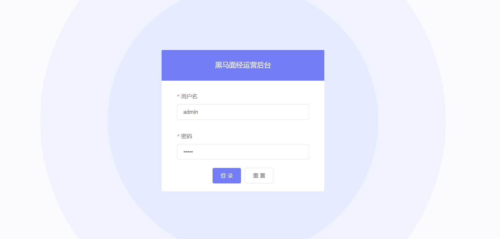

### 首页

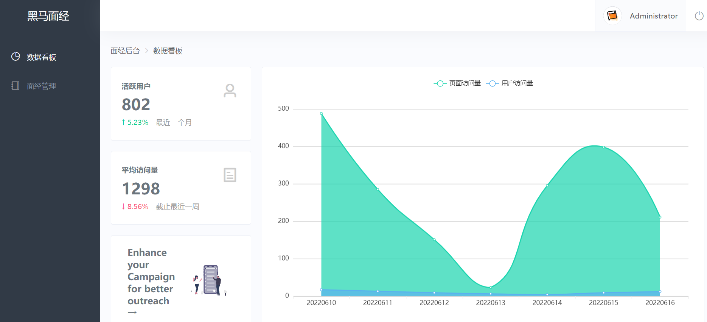

### 面经管理 - 列表展示


### 面经管理 - 预览效果

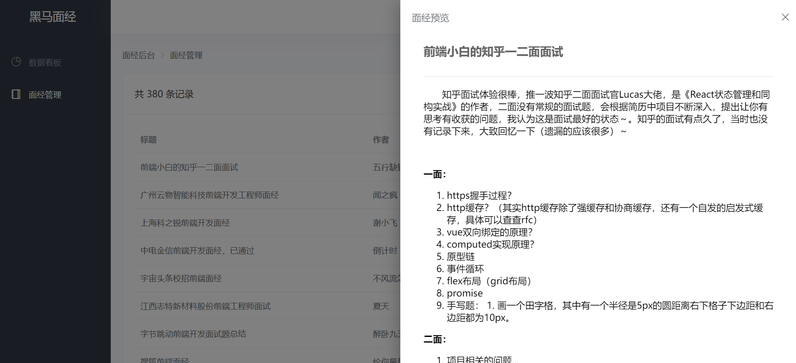

### 面经管理 - 删除功能


### 面经管理 - 添加功能

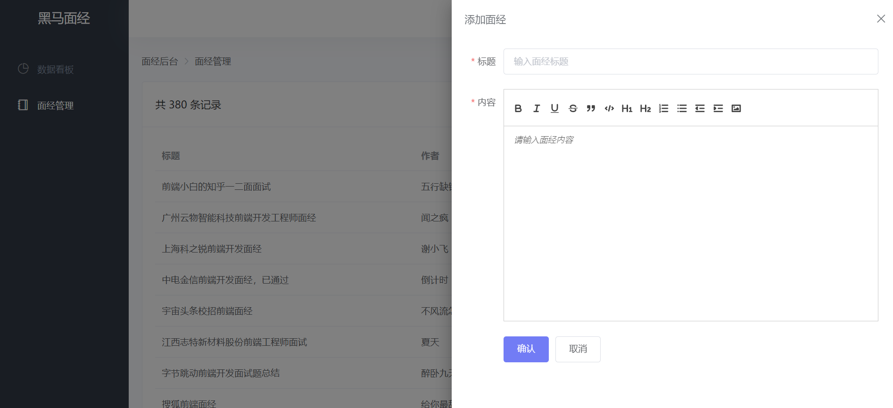


### 面经管理 - 修改功能

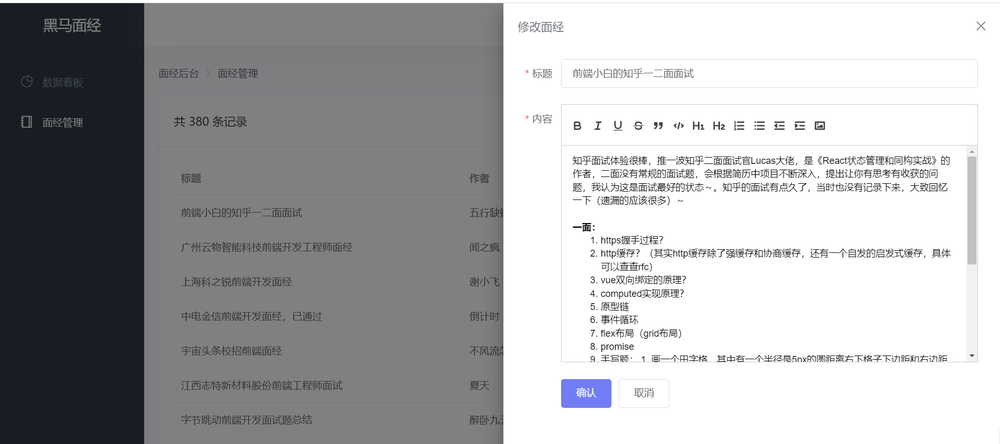


## 创建项目

```jsx
vue create hm-element-pc
```

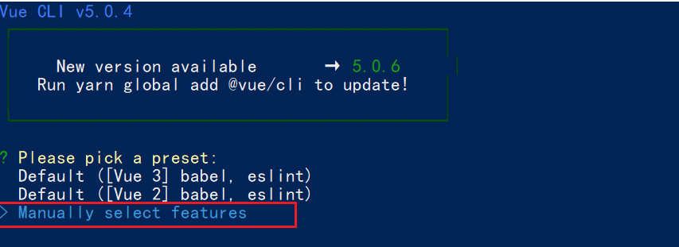


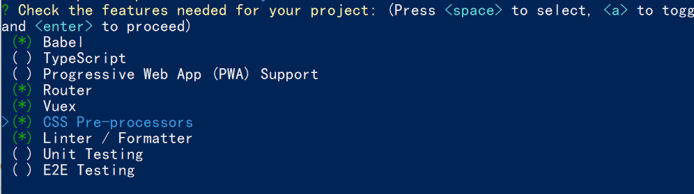


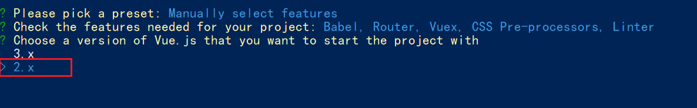


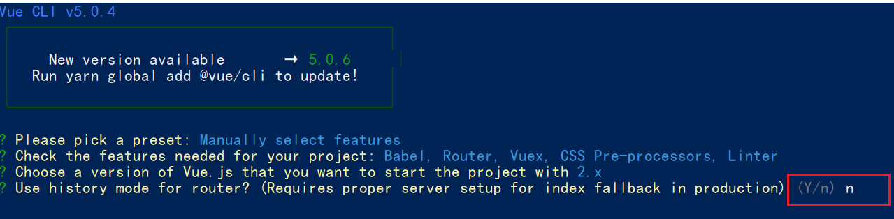


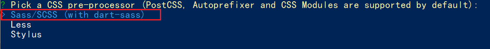


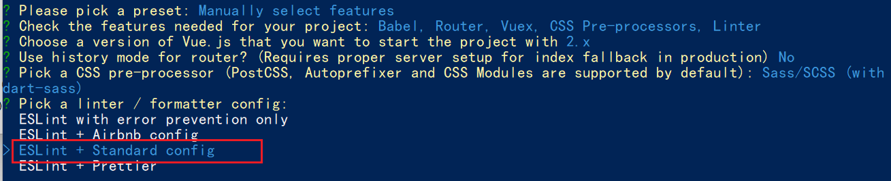


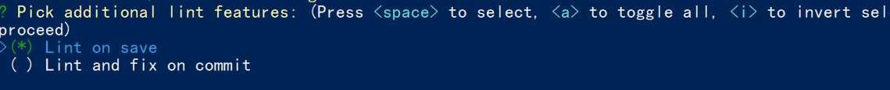


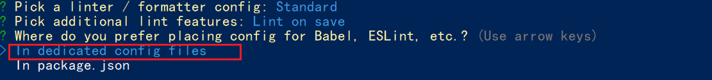


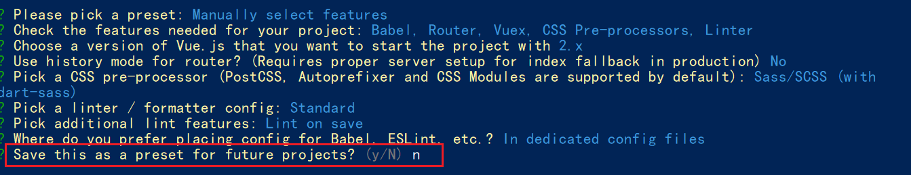


## sass/scss 语法说明

```txt
less sass stylus 都是 css 预处理器，语法上稍有差异，作用一样
都是让 css，增强能力，具备变量，函数.. 的能力

sass的语法两种语法 .sass(旧) .scss(新)
1 .sass 和 .stylus 语法很像 (了解)
  要求省略 {} 和 分号， 缩进表示嵌套
  
2 .scss 和 .less   语法很像， 都支持嵌套, 变量...
  scss 声明变量：$变量名
  less 声明变量: @变量名
```


##调整项目目录

默认生成的目录结构不满足我们的开发需求，所以这里需要做一些自定义改动。主要是两个工作：

- 删除初始化的默认文件
- 修改剩余代码内容
- 新增调整我们需要的目录结构

1. 删除文件

- components/HelloWorld.vue
- views/HomeView.vue
- views/AboutView.vue
- assets/logo.png

2. 修改内容

`src/router/index.js`

```jsx
import Vue from 'vue'
import VueRouter from 'vue-router'

Vue.use(VueRouter)

const router = new VueRouter({
  routes: []
})

export default router
```

`src/App.vue`

```jsx
<template>
  <div id="app">
    <router-view></router-view>
  </div>
</template>

<style lang="scss">

</style>
```

store/index.js  和 main.js 不用动

3. 新增需要目录

在 src 目录下中补充创建以下目录：

- /api ： 存储请求函数模块
- /styles: 样式文件模块
- /utils: 工具函数模块

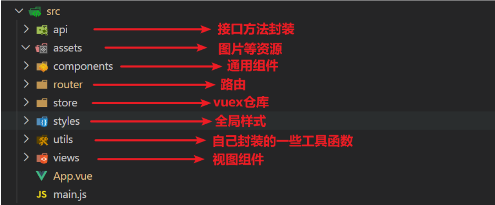

4. 将项目需要的图片资源放置  **assets 文件夹**  中


## 引入 element-ui 组件库

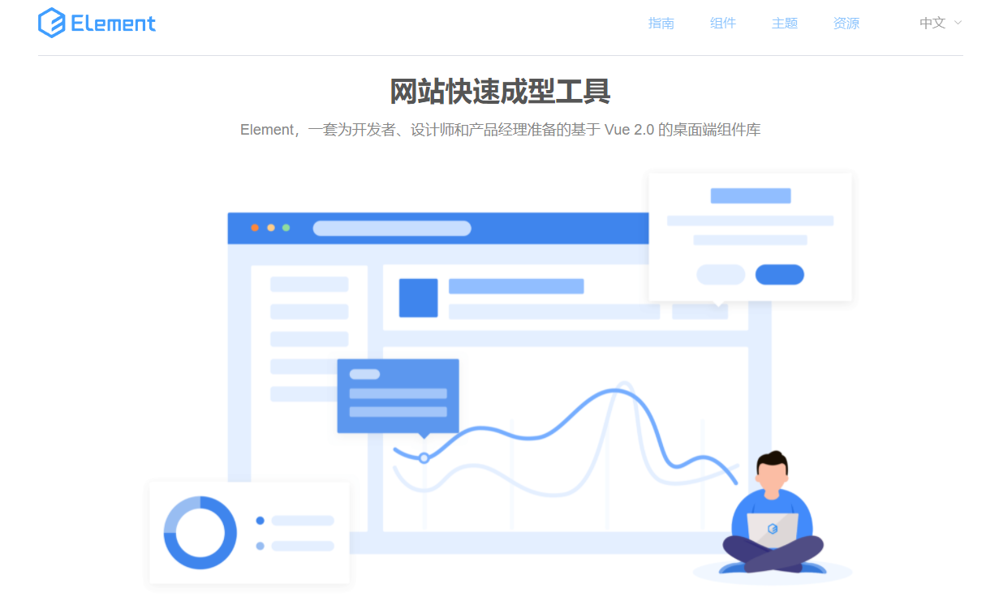

官方文档: https://element.eleme.io/#/zh-CN

### 全部引入

全部引入,  会导入所有的组件， 但是体积会变大

- 安装

```jsx
yarn add element-ui
```

- 在`main.js`中

```jsx
import Vue from 'vue'
import App from './App.vue'
import router from './router'
import store from './store'
// 全部导入 element-ui 所有的组件都能直接用
import ElementUI from 'element-ui'
import 'element-ui/lib/theme-chalk/index.css'
Vue.use(ElementUI)

Vue.config.productionTip = false

new Vue({
  router,
  store,
  render: h => h(App)
}).$mount('#app')

```

- 演示

```jsx
<el-button type="primary">主要按钮</el-button>
```

### 按需导入 (推荐)  

减轻将来打包后的包的体积

+ 安装

```jsx
yarn add element-ui
```

- 安装`babel-plugin-component`

```jsx
yarn add babel-plugin-component -D
```

- 在` babel.config.js `中配置

```jsx
module.exports = {
  presets: [
    '@vue/cli-plugin-babel/preset'
  ],
  // 新增plugins插件节点,修改完配置文件一定重启项目
  "plugins": [
    [
      "component",
      {
        "libraryName": "element-ui",
        "styleLibraryName": "theme-chalk"
      }
    ]
  ]
}
```

- 使用插件`main.js`中

```jsx
import { Button } from 'element-ui'
Vue.use(Button)
```

### 抽离element.js模块

- 由于组件的导入都书写到了`main.js`中,导致`main.js` 代码冗余

  将element-ui组件的导入和注册单独抽离到utils文件夹中

- 新建element.js 

- **项目中 **  完整按需导入如下：

```jsx
import Vue from 'vue';
import {
  Popconfirm,
  Avatar,
  Breadcrumb,
  BreadcrumbItem,
  Pagination,
  Dialog,
  Menu,
  Input,
  Option,
  Button,
  Table,
  TableColumn,
  Form,
  FormItem,
  Icon,
  Row,
  Col,
  Card,
  Container,
  Header,
  Aside,
  Main,
  Footer,
  Link,
  Image,
  Loading,
  MessageBox,
  Message,
  Drawer,
  MenuItem
} from 'element-ui';

Vue.use(Breadcrumb);
Vue.use(BreadcrumbItem);
Vue.use(Drawer);
Vue.use(Popconfirm);
Vue.use(Avatar);
Vue.use(Pagination);
Vue.use(Dialog);
Vue.use(Menu);
Vue.use(MenuItem);
Vue.use(Input);
Vue.use(Option);
Vue.use(Button);
Vue.use(Table);
Vue.use(TableColumn);
Vue.use(Form);
Vue.use(FormItem);
Vue.use(Icon);
Vue.use(Row);
Vue.use(Col);
Vue.use(Card);
Vue.use(Container);
Vue.use(Header);
Vue.use(Aside);
Vue.use(Main);
Vue.use(Footer);
Vue.use(Link);
Vue.use(Image);

Vue.use(Loading.directive);

Vue.prototype.$loading = Loading.service;
Vue.prototype.$msgbox = MessageBox;
Vue.prototype.$alert = MessageBox.alert;
Vue.prototype.$confirm = MessageBox.confirm;
Vue.prototype.$prompt = MessageBox.prompt;
Vue.prototype.$notify = Notification;
Vue.prototype.$message = Message;
```

- 直接导入main.js中

```jsx
// 直接导入element-ui.js
import '@/utils/element.js'
```


### 导入公共样式

新建 styles/index.scss

```jsx
// 修改主题色
$--color-primary: rgba(114,124,245,1);
$--font-path: '~element-ui/lib/theme-chalk/fonts';
@import "~element-ui/packages/theme-chalk/src/index";

body {
  margin: 0;
  padding: 0;
  background: #fafbfe;
}
```

main.js 引入

```js
import '@/styles/index.scss'
```


## request模块 - axios封装

接口文档地址：https://www.apifox.cn/apidoc/project-934563/api-19465917

我们会使用 axios 来请求后端接口, 一般都会对 axios 进行一些配置 (比如: 配置基础地址等)

一般项目开发中, 都会对 axios 进行基本的二次封装, 单独封装到一个模块中, 便于使用

1. 安装 axios

```
npm i axios
```

2. 新建 `utils/request.js` 封装 axios 模块

   利用 axios.create 创建一个自定义的 axios 来使用

   http://www.axios-js.com/zh-cn/docs/#axios-create-config

```js
/* 封装axios用于发送请求 */
import axios from 'axios'

// 创建一个新的axios实例
const request = axios.create({
  baseURL: 'http://interview-api-t.itheima.net/',
  timeout: 5000
})

// 添加请求拦截器
request.interceptors.request.use(function (config) {
  // 在发送请求之前做些什么
  return config
}, function (error) {
  // 对请求错误做些什么
  return Promise.reject(error)
})

// 添加响应拦截器
request.interceptors.response.use(function (response) {
  // 对响应数据做点什么
  return response.data
}, function (error) {
  // 对响应错误做点什么
  return Promise.reject(error)
})

export default request
```


## storage模块 - 本地存储

新建 utils/storage.js

```jsx
// 以前 token 令牌，如果存到了本地，每一次都写这么长，太麻烦
// localStorage.setItem(键， 值)
// localStorage.getItem(键)
// localStorage.removeItem(键)

const KEY = 'my-token-element-pc'

// 直接用按需导出，可以导出多个
// 但是按需导出，导入时必须 import { getToken } from '模块名导入'

// 获取
export const getToken = () => {
  return localStorage.getItem(KEY)
}

// 设置
export const setToken = (newToken) => {
  localStorage.setItem(KEY, newToken)
}

// 删除
export const delToken = () => {
  localStorage.removeItem(KEY)
}
```


## 路由设计配置

但凡是: **单个页面，独立展示的，都是一级路由**  (登录  注册   首页架子   文章详情 ...)

路由设计：

- 登录页 （一级） login
- 首页架子（一级） layout
  - 数据看板（二级）dashboard
  - 文章管理（二级）article

### 新建目录

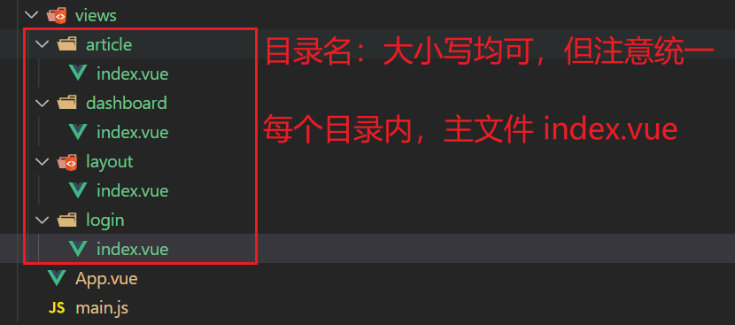

`login/index.vue`

```jsx
<template>
  <div>我是一级登录</div>
</template>

<script>
export default {
  name: 'LoginIndex'
}
</script>

<style>

</style>
```

`layout/index.vue`

```jsx
<template>
  <div>我是一级首页架子</div>
</template>

<script>
export default {
  name: 'LayoutIndex'
}
</script>

<style>

</style>
```

`dashboard/index.vue`

```jsx
<template>
  <div>我是二级数据看板页面</div>
</template>

<script>
export default {
  name: 'DashBoard'
}
</script>

<style>

</style>
```

`article/index.vue`

```jsx
<template>
  <div>我是二级文章管理页</div>
</template>

<script>
export default {
  name: 'ArticleIndex'
}
</script>

<style>

</style>
```


### 配置路由

`router/index.js`

```jsx
import VueRouter from 'vue-router'
import Vue from 'vue'

import Layout from '@/views/layout'
import Login from '@/views/login'
import Dashboard from '@/views/dashboard'
import Article from '@/views/article'

Vue.use(VueRouter)

const router = new VueRouter({
  routes: [
    { path: '/login', component: Login },
    {
      path: '/',
      component: Layout,
      redirect: '/dashboard', //重定向 http://localhost:8080/#/dashboard
      children: [
        { path: 'dashboard', component: Dashboard },
        { path: 'article', component: Article }
      ]
    }
  ]
})

export default router
```

`layout/index` 配置二级路由出口

```jsx
<template>
  <div>
    <div>头部</div>
    <div>侧边</div>
      
       <!-- 二级路由出口 -->
    <router-view></router-view>
  </div>
</template>

<script>
export default {
  name: 'LayoutIndex'
}
</script>

<style>

</style>
```

测试路径1： http://localhost:8080/#/login

测试路径2： http://localhost:8080/#/dashboard

测试路径3： http://localhost:8080/#/article


## 登录模块

### element-ui 基本表单

说明：我们先学习 element-ui 表单组件的基本结构使用

需求：实现如图效果

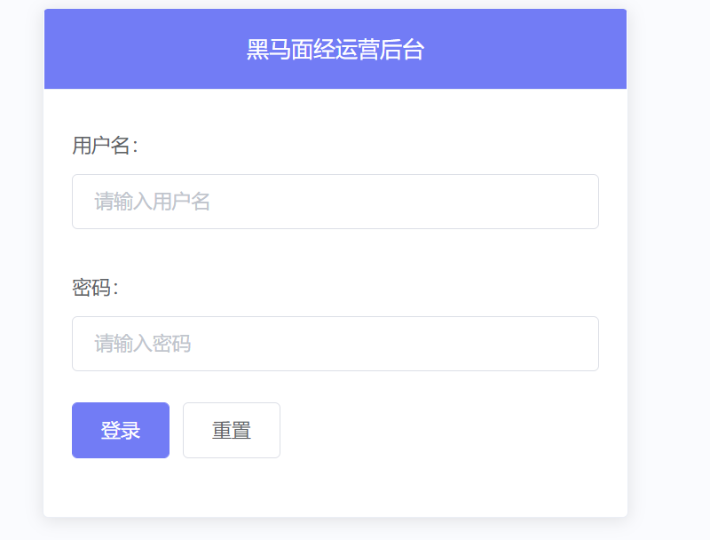

一般情况，这种第三方的组件，为了样式控制方便，会给组件的根元素，起一个和组件名同名的类名

控制组件的样式：

1. **直接通过组件名 同名的 类， 进行控制样式**

2. **自己通过添加 class 类名，进行控制样式**

```js
<style lang="scss">
   //如何给组件标签设置样式
   //1.给组件标签,加类
   //  添加的类，会自动加上渲染出来的组件的根元素上
   /* .mycard {
    width: 420px;
    margin: 0 auto;
   } */

    //2.直接使用组件标签名，作为类名控制样式
    //  组件库定义组件的规范：声明的所有组件的根元素， 有一个和组件名同名的类名(提供给你了)
    .el-card {
      width: 420px;
      margin: 0 auto;
    }
</style>
```


默认，写在scoped中的样式，只会影响到当前组件模板中的元素内容

**深度作用选择器：向下影响到子元素的样式**

 **::v-deep (scss)**

**/deep/  (less)**


```js
<template>
  <div class="login-page">
    <el-card class="el-card">
      //header插槽 
      <template #header>黑马面经运营后台</template>
        
     // 默认插槽 <template>不用写，直接作为主体
     // el-form 整个form组件
     // el-form-item 表单域，一行，可以存放格式类型的表单元素
     // el-input 文本域
      <el-form>
          
        <el-form-item label="用户名：">
          <el-input placeholder="请输入用户名" />
        </el-form-item>
          
        <el-form-item label="密码：">
          <el-input placeholder="请输入密码：" />
        </el-form-item>
          
        <el-form-item>
          <el-button type="primary">登录</el-button>
          <el-button>重置</el-button>
        </el-form-item>
          
      </el-form>
    </el-card>
  </div>
</template>

<script>
export default {
  name: 'login-page'
}
</script>

<style lang="scss" scoped>
   //如何给组件标签设置样式
   //1.给组件标签,加类
   //  添加的类，会自动加上渲染出来的组件的根元素上
   /* .mycard {
    width: 420px;
    margin: 0 auto;
   } */

    //2.直接使用组件标签名，作为类名控制样式
    //  组件库定义组件的规范：声明的所有组件的根元素， 都有一个和组件名同名的类名(提供给你了)

    //加上scoped，可以让样式，只作用于当前组件模板(局部样式)
    //默认scoped样式，不会向下渗透，影响到其他子组件的（除了根元素）
    //如果希望样式，可以向下渗透，影响到下面的子孙后代，就需要用到深度作用选择器(vue提供)

    //深度作用选择器：
    // ::v-deep    acss
    // /deep/      less

    .el-card {
      width: 420px;
      margin: 0 auto;
      //原理：一旦选择器前面有深度作用标识，就会 不会附加属性选择器的限制
      //.el-card__header 渲染出来的类名
      ::v-deep .el-card__header {
        background-color: pink;
        text-align: center;
        color: #fff;
      }

    }
</style>

```

样式美化：

```jsx
<template>
  <div class="login-page">
    <el-card >
      <template #header>黑马面经运营后台</template>
      <el-form autocomplete="off" >
        <el-form-item label="用户名">
          <el-input placeholder="输入用户名"></el-input>
        </el-form-item>

        <el-form-item label="密码">
          <el-input type="password" placeholder="输入用户密码"></el-input>
        </el-form-item>

        <el-form-item class="tc">
          <el-button type="primary">登 录</el-button>
          <el-button >重 置</el-button>
        </el-form-item>
      </el-form>
    </el-card>
  </div>
</template>

<script>
export default {
  name: 'LoginIndex',
  data () {
    return {

    }
  },
  methods: {

  }
}
</script>

<style lang="scss" scoped>
.login-page {
  min-height: 100vh;
  background: url(@/assets/login-bg.svg) no-repeat center / cover;  //背景
  //利用flex 水平垂直居中
  display: flex;
  //垂直居中
  align-items: center;
  //间隙两边排布
  justify-content: space-around;
  .el-card {
    width: 420px;
    ::v-deep .el-card__header{
      height: 80px;
      background: pink;
      text-align: center;
      line-height: 40px;
      color: #fff;
      font-size: 18px;
    }
  }
  .el-form {
    padding: 0 20px;
  }
  .tc {
    text-align: center;
  }
}
</style>

```


### element-ui 基本校验

说明：在向后端发请求，调用接口之前，我们需要对所要传递的参数进行验证，把用户的错误扼杀在摇篮之中。

讲解内容:

- element-ui的校验

  - el-form:  `model`属性, `rules`规则
- el-form-item:  绑定 `prop` 属性
  - el-input:   绑定` v-model`

  ```jsx
       <!--
         实现表单校验：4个关键属性
         el-form 整个form组件
            :model :需要绑定一个对象，对象有着很多属性，每个属性都会和表单元素双向绑定,且能明确要校验的是哪个对象
            :rules :配置校验的规则
         el-form-item 表单域，一行，可以存放格式类型的表单元素
            prop   :配置字段名,决定了校验效果的配置，必须对应
         el-input 文本域
            v-model 和对象中的属性双向绑定，实时收集表单数据
  1 + 4 和 2 + 3 配合使用
         -->
  ```
  
  

Form 组件提供了表单验证的功能

1.  form组件需要 `:model`绑定form对象（必须）， 需要通过 `rules` 属性传入约定的验证规则 

```jsx
<el-form :model="form" :rules="rules">
    
export default {
  data() {
    return {
      form: {
        username: '',
        password: ''
      }
    }
  }
}
```

2. 在 data 中准备 rules 规则

```js
rules: {
  username: [
    { required: true, message: '请输入用户名', trigger: ['blur', 'change'] },
    { min: 5, max: 11, message: '长度在 5 到 11 个字符', trigger: ['blur', 'change'] }
  ]
}
```

3.  将 Form-Item 的 `prop` 属性设置为需校验的字段名 

```html
<el-form-item label="用户名：" prop="username">
  <el-input v-model="form.username" placeholder="请输入手机号" />
</el-form-item>
```


### element-ui 正则校验

下面是常用内置的基本验证规则：其余校验规则参见 [async-validator](https://github.com/yiminghe/async-validator)

| 规则     | 说明                                           |
| -------- | ---------------------------------------------- |
| required | 必须的，例如校验内容是否非空                   |
| pattern  | 正则表达式，例如校验手机号码格式、校验邮箱格式 |

```jsx
rules: {
  username: [
    { required: true, message: '请输入用户名', trigger: ['blur', 'change'] },
    { min: 5, max: 11, message: '长度在 5 到 11 个字符', trigger: ['blur', 'change'] }
  ],
  password: [
    { required: true, message: '请输入密码', trigger: ['blur', 'change'] },
    { pattern: /^\w{5,11}$/, message: '请输入 5 到 10 位的密码', trigger: ['blur', 'change'] }
  ]
}

// \d 数字 0-9
// \w 字母数字下划线
// {m,n} 前面的字符，可以出现 m次 ~ n次
```

不要忘了配置prop

```html
<el-form-item label="密码" prop="password">
    <el-input v-model="form.password" type="password" placeholder="输入用户密码"></el-input>
</el-form-item>
```

上述已经可以完成大部分需求，如果需要更复杂业务校验需求，可以自定义校验~ （项目课程：人力资源系统会进一步讲解）


### 提交表单校验 和 重置

每次点击按钮, 进行ajax登录前, 应该先对整个表单内容校验, 不然还是会发送很多无效的请求!!!

要通过校验了, 才发送请求!!!

**作用: `ref` 属性配合 `$refs` 可以获取 dom 元素 (或者 vue组件实例)**

1. 给组件或者元素, 添加  ref 属性

```html
<el-form ref="myForm" </el-form>
```

2. 通过 this.$refs 可以获取对应的引用, 并且调用方法

```jsx
this.$refs.myForm.validate()
```


**添加登录提交的校验**

```js
<el-form ref="myForm" :model="form" :rules="rules" autocomplete="off">
...
<el-button @click="clickLogin" type="primary">登 录</el-button>

methods: {
  async clickLogin () {
    // console.log(this.$refs.myForm)
    try {
      const res = await this.$refs.myForm.validate()
      //console.log(res)
      //console.log('通过校验，应该发请求！')
    } catch (e) {
      console.log(e)
    }
  }
}
```

**添加重置功能**

```jsx
<el-button @click="reset">重 置</el-button>

methods: {
  reset () {
    // 重置表单，包含 表单内容 + 校验状态的重置 => 调用 form 方法
    this.$refs.myForm.resetFields()
  }
}
```


### 封装登录api登录请求

新建 `api/user.js` 提供api接口函数

```jsx
import request from '@/utils/request'

// 登录 api 的封装
// 从传过来的对象中，解构出 username 和 password
export const login = ({ username, password }) => {
  return request.post('/auth/login', {
    username,
    password
  })
}
```

发送请求获取token

```jsx
methods: {
  async login () {
    try {
      const valid = await this.$refs.form.validate()
      if (valid) {
        const res = await login(this.form)
        console.log(res)
      }
    } catch (e) {
      console.log(e)
    }
  }
}
```

### vuex user 模块 - 存token

新建 `store/modules/user.js`

```jsx
import { getToken, setToken } from '@/utils/storage'

export default {
  namespaced: true,
  state () {
    return {
      // 一进页面，默认从本地读取token数据
      token: getToken() || ''
    }
  },
  mutations: {
    setUserToken (state, payload) {
      state.token = payload
      //本地应该也存一份
      setToken(payload)
    }
  }
}
```

挂载模块

```jsx
import Vue from 'vue'
import Vuex from 'vuex'
import user from './modules/user'

Vue.use(Vuex)

export default new Vuex.Store({
  modules: {
    // 将来这里分模块管理数据
    user
  }
})
```

登录时调用

```jsx
async login () {
  try {
    const valid = await this.$refs.form.validate()
    if (valid) {
      const res = await login(this.form)
      // console.log(res)
        // 公司里的实际规范，将token等个人信息，存入vuex,便于各个页面组件访问 => 存storage (持久化存储)
        // vuex中的数据，类似于data 中的数据，一旦刷新页面，就会重新初始化(vuex刷新会丢失数据)
        // 所有访问token，访问个人信息，一律找vuex。存本地就一个目的：保证刷新之后，vuex的数据还在
        // console.log(res.data.token)
        this.$store.commit('user/setUserToken', res.data.token)
        
        // 注意：一定要等vuex token存好了，在跳首页   
        this.$router.push('/')
    }
  } catch (e) {
    console.log(e)
  }
},
```


### 登录访问拦截

`router/index.js`

没有token 且 访问的不是 登录页，就直接拦截到登录

```jsx
router.beforeEach((to, from, next) => {
  const { token } = store.state.user;
   //如果要去的路径不是首页，并且没有token 需要拦截
  if (to.path !== '/login' && !token ) return next('/login')
  next()
})
---------------------------------------------


// 页面分类： 登录页 和 非登录页
// 逻辑：登录页可以访问的，但是其他所有的页面，都需要token才能访问
// 问题：什么时候需要拦截到登录？其他情况正常放行
// 非登录页 且 无token => 直接拦截到登录

// 全局前置导航守卫 => 实现登录访问拦截
router.beforeEach((to, from, next) => {
  // 通过原生vuex语法，获取到vuex中的token，记住：以vuex为主，storage为辅，统一入口！
  const token = store.state.user.token

  if (to.path !== '/login' && !token) {
    // 需要拦截(去的不是登录，且还没有token) 拦截到登录
    next('/login')
  } else {
    // 要么是去登录，要么是有token，都是直接放行
    next()
  }
})
```


## 首页 layout 模块

### layout 布局

`api/user.js `准备api接口

```jsx
// 获取当前的用户信息
export const getUser = () => {
  return request.get('/auth/currentUser')
}
```

`layout/index.vue`准备结构 （已准备）

```jsx
<template>
  <el-container class="layout-page">
    <el-aside width="200px">
      <div class="logo">黑马面经</div>
      <el-menu
        router
        :default-active="$route.path"
        background-color="#313a46"
        text-color="#8391a2"
        active-text-color="#FFF"
      >
        <el-menu-item index="/dashboard">
          <i class="el-icon-pie-chart"></i>
          <span>数据看板</span>
        </el-menu-item>
        <el-menu-item index="/article">
          <i class="el-icon-notebook-1"></i>
          <span>面经管理</span>
        </el-menu-item>
      </el-menu>
    </el-aside>
    <el-container>
      <el-header>
        <div class="user">
          <el-avatar
            :size="36"
            :src="avatar"
          ></el-avatar>
          <el-link :underline="false">{{name}}</el-link>
        </div>
        <div class="logout">
             <!-- comfirm事件 => 用户点击了确认的时候触发 -->
          <el-popconfirm title="您确认退出黑马面运营后台吗？" @confirm="handleConfirm">
            <i slot="reference" title="logout" class="el-icon-switch-button"></i>
          </el-popconfirm>
        </div>
      </el-header>
      <el-main>
        <router-view></router-view>
      </el-main>
    </el-container>
  </el-container>
</template>

<script>
import { getUser } from '@/api/user'
export default {
  name: 'layout-page',
  data () {
    return {
      avatar: '',
      name: ''
    }
  },
  created () {
    this.initData()
  },
  methods: {
    async initData () {
      const { data } = await getUser()
      this.avatar = data.avatar
      this.name = data.name
    },
    handleConfirm () {
      this.$router.push('/login')
    }
  }
}
</script>

<style lang="scss" scoped>
.layout-page {
  height: 100vh;
  .el-aside {
    background: #313a46;
    .logo {
      color: #fff;
      font-size: 20px;
      height: 60px;
      line-height: 60px;
      text-align: center;
    }
    .el-menu {
      border-right: none;
      margin-top: 20px;
      &-item {
        background-color: transparent !important;
        > span, i {
          padding-left: 5px;
        }
      }
    }
  }
  .el-header {
    box-shadow: 0px 0px 35px 0px rgba(154, 161, 171, 0.15);
    background: #fff;
    display: flex;
    justify-content: flex-end;
    align-items: center;
    z-index: 999;
    .user {
      display: flex;
      align-items: center;
      background: #fafbfd;
      height: 60px;
      border: 1px solid #f1f3fa;
      padding: 0 15px;
      .el-avatar {
        margin-right: 15px;
      }
    }
    .logout {
      font-size: 20px;
      color: #999;
      cursor: pointer;
      padding: 0 15px;
    }
  }
  .el-footer {
    display: flex;
    justify-content: space-between;
    align-items: center;
    color: #aaa;
    border-top: 1px solid rgba(152, 166, 173, 0.2);
    font-size: 14px;
  }
}
</style>
```

遇到 401 错误

1.没有携带 token

2.带了token，但是token过期了

3.带了token，但是token拼错了

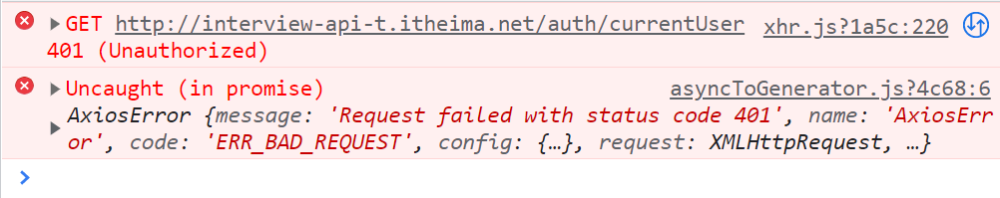


### 请求拦截器携带token

`utils/request.js`

```jsx
import store from '@/store'

// 添加请求拦截器
request.interceptors.request.use(function (config) {
  // 在发送请求之前做些什么
  const { token } = store.state.user
  if (token) {
    config.headers.Authorization = `Bearer ${token}`
  }
    
  return config
}, function (error) {
  // 对请求错误做些什么
  return Promise.reject(error)
})
```


### 退出功能

退出操作 `layout/index.vue`

```jsx
handleConfirm () {
  // this.$router.push('/login')
  this.$store.commit('user/logout')//退出之前操作一下vuex，调用一个user下面的logout方法
  this.$router.push('/login')
}
```

提供mutation `store/user/index.js`

```jsx
import { delToken, getToken, setToken } from '@/utils/storage'

export default {
  namespaced: true,
  state () {
    return {
      token: getToken()
    }
  },
  mutations: {
    ...,
    logout (state) {
      state.token = null  //或者 ''
      // 本地的也同步删除
      delToken()
    }
  }
}
```


### 处理token过期

**响应拦截器，处理token过期** **401**

```jsx
import store from '@/store'
import { Message } from 'element-ui'
import router from '@/router'

// 添加响应拦截器
request.interceptors.response.use(function (response) {
  // 对响应数据做点什么
  return response.data
}, function (error) {
    
    
  // 对响应错误做点什么  普通错误 + 401情况
  // console.dir(error)
  if (error.response) {
    if (error.response.status === 401) {
      // 给提示，清除无效token(vuex+本地)，拦到登录
      Message.error('尊敬的用户，当前登录状态已过期！')

      // 提交清除token的mutation
      store.commit('user/logout')

      // 跳转到登录
      router.push('/login')
    } else {
      // 给提示
      Message.error(error.response.data.message)
    }
  }
    
    
  return Promise.reject(error)
})
```


## 数据看板 (了解)

### 静态结构

`dashboard/index.vue`

```jsx
<template>
  <div class="dashboard-page">
    <el-breadcrumb separator-class="el-icon-arrow-right">
      <el-breadcrumb-item>面经后台</el-breadcrumb-item>
      <el-breadcrumb-item>数据看板</el-breadcrumb-item>
    </el-breadcrumb>
    <el-row :gutter="20">
      <el-col :span="6">
        <el-card style="height: 140px" shadow="never">
          <i class="el-icon-user"></i>
          <h5 class="tit">活跃用户</h5>
          <h2 class="num">802</h2>
          <p class="tag"><i>↑ 5.23%</i> 最近一个月</p>
        </el-card>
        <el-card style="height: 140px" shadow="never">
          <i class="el-icon-tickets"></i>
          <h5 class="tit">平均访问量</h5>
          <h2 class="num">1298</h2>
          <p class="tag"><i class="red">↓ 8.56%</i> 截止最近一周</p>
        </el-card>
        <el-card class="row" style="height: 180px" shadow="never">
          <h4>Enhance your Campaign for better outreach →</h4>
          
        </el-card>
      </el-col>
      <el-col :span="18">
        <el-card style="height: 504px" shadow="never">
          <div class="chart-box" style="height: 500px">
            <!-- 图表区域 -->
          </div>
        </el-card>
      </el-col>
      <el-col :span="8">
        <el-card style="height: 420px" shadow="never">
          <h4>性别分布情况</h4>
          
        </el-card>
      </el-col>
      <el-col :span="8">
        <el-card style="height: 420px" shadow="never">
          <h4>浏览访问情况</h4>
          
        </el-card>
      </el-col>
      <el-col :span="8">
        <el-card style="height: 420px" shadow="never">
          <h4>设备系统访问情况</h4>
          
        </el-card>
      </el-col>
    </el-row>
  </div>
</template>

<script>
export default {
  name: 'dashboard-page',
  data () {
    return {
      loading: true
    }
  },
  created () {},
  methods: {}
}
</script>

<style lang="scss" scoped>
.dashboard-page {
  .el-breadcrumb {
    margin-top: 10px;
    margin-bottom: 25px;
  }
  .el-card {
    margin-bottom: 20px;
    position: relative;
    &.row {
      h4 {
        width: 40%;
        float: left;
        font-size: 18px;
        margin-left: 5%;
      }
      img {
        width: 40%;
        float: left;
        margin-left: 10%;
        margin-top: 30px;
      }
    }
    [class^="el-icon"] {
      font-size: 30px;
      color: #ccc;
      position: absolute;
      right: 25px;
      top: 30px;
      font-weight: bold;
    }
    .tit {
      color: #6c757d;
      font-size: 14px;
      margin: 6px 0;
    }
    .num {
      color: #6c757d;
      font-size: 30px;
      margin: 6px 0;
    }
    .tag {
      color: #999;
      margin: 0;
      font-size: 14px;
      > i {
        font-style: normal;
        margin-right: 10px;
        color: rgb(10, 207, 151);
        &.red {
          color: #fa5c7c;
        }
      }
    }
    img {
      width: 100%;
      height: 100%;
    }
    h4 {
      margin: 0;
      padding-bottom: 20px;
      color: #6c757d;
    }
  }
}
</style>
```


### vue中echarts的使用

装包

```jsx
yarn add echarts
```

导入

```jsx
// 将 echarts 里面的所有的按需，全部导入进来，收集到一个对象中
// 引包
import * as echarts from 'echarts'
```

准备容器 添加ref

```html
<div ref="box" class="chart-box" style="height: 500px"></div>
```

mounted初始化

```jsx
mounted () {
   // 基于准备好的dom，初始化echarts实例
  const myChart = echarts.init(this.$refs.box)
  // 绘制图表
  myChart.setOption({
    title: {
      text: 'ECharts 入门示例'
    },
    tooltip: {},
    xAxis: {
      data: ['衬衫', '羊毛衫', '雪纺衫', '裤子', '高跟鞋', '袜子']
    },
    yAxis: {},
    series: [
      {
        name: '销量',
        type: 'bar',
        data: [5, 20, 36, 10, 10, 20]
      }
    ]
  })
},
```


# 面经PC端 - Element (下)

## 面经管理 - 基本渲染

### 面经管理（准备代码）

`artcile/index.vue`

```jsx
<template>
  <div class="article-page">
    <el-breadcrumb separator-class="el-icon-arrow-right">
      <el-breadcrumb-item>面经后台</el-breadcrumb-item>
      <el-breadcrumb-item>面经管理</el-breadcrumb-item>
    </el-breadcrumb>
    <el-card shadow="never" border="false">
        <!-- 配置头部 -->
      <template #header>
        <div class="header">
          <span>共 300 条记录</span>
          <el-button
            icon="el-icon-plus"
            size="small"
            type="primary"
            round>
            添加面经
          </el-button>
        </div>
      </template>
 
     <!-- 内容部分 -->
        
    </el-card>
  </div>
</template>

<script>
export default {
  name: 'article-page',
  data () {
    return {}
  },
  created () {
  },
  methods: {
  }
}
</script>

<style lang="scss" scoped>
.el-card {
  margin-top: 25px;
  .header {
    display: flex;
    justify-content: space-between;
    align-items: center;
    padding-right: 16px;
  }
  .actions {
    font-size: 18px;
    display: flex;
    justify-content: space-around;
    color: #666;
    > i:hover {
      color: rgba(114, 124, 245, 1);
      cursor: pointer;
    }
  }
}
.el-pagination {
  margin-top: 20px;
  text-align: center;
}
.el-breadcrumb {
  margin-top: 10px;
}
.el-form {
  padding-right: 40px;
}
.quill-editor {
  ::v-deep .ql-editor {
    height: 300px;
  }
}
.el-rate {
  padding: 10px 0;
}
.article-preview {
  padding: 0 40px 40px 40px;
  > h5 {
    font-size: 20px;
    color: #666;
    border-bottom: 1px dashed #ccc;
    padding-bottom: 30px;
    margin: 0 0 20px 0;
  }
}
</style>

```


### 表格基本 **属性解读**


- data 数据源
- prop 设置数据源中对象中的键名，即可填入数据
- label 列名
- width 列宽

```jsx
    <!-- 内容部分
           el-table 表格
           el-table-column 表格的列  lable：列名   prop 配置一列的值
       -->
       <el-table
      :data="tableData"
      style="width: 100%">
      <el-table-column
        prop="date"
        label="日期"
        width="180">
      </el-table-column>
      <el-table-column
        prop="name"
        label="姓名"
        width="180">
      </el-table-column>
      <el-table-column
        prop="gender"
        label="性别">
      </el-table-column>
      <el-table-column
        prop="address"
        label="地址">
      </el-table-column>

    </el-table>

 data () {
    return {
      tableData: [{
        date: '2016-05-02',
        name: '王小虎',
        address: '上海市普陀区金沙江路 1518 弄',
        gender: '男'
      }, {
        date: '2016-05-04',
        name: '王小仙',
        address: '上海市普陀区金沙江路 1517 弄',
        gender: '女'
      }]
    }
  },
```


### 发送请求获取数据

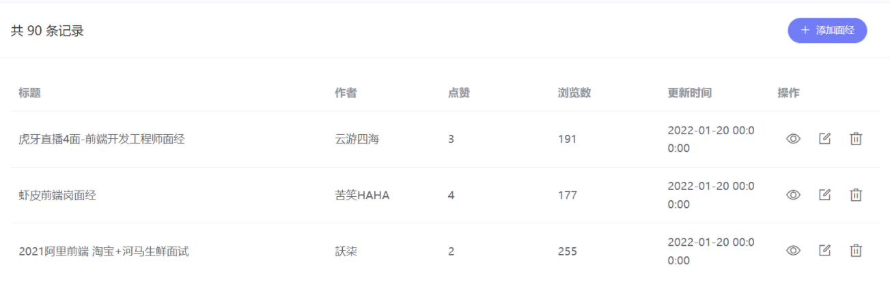

新建 `api/article.js`

```jsx
import request from '@/utils/request'

// 获取文章列表
export const getArticleList = data => {
  return request.get('/admin/interview/query', {
    params: data
  })
}

<!--
// 获取文章列表
export const getArticleList = ({ current, pageSize }) => {
  return request.get('/admin/interview/query', {
    params: {
      current,
      pageSize
    }
  })
}
-->
```

`article/index.vue` created中发送初始化获取数据的请求

```jsx
data () {
  return {
     list: [],
      current: 1, // 当前页
      pageSize: 10, // 每页条数
      total: 0 // 总条数
  }
},
created () {
  // 封装渲染列表函数
  this.initData()
},
methods: {
   // 根据 当前页 和 每页条数，初始化数据
  async initData () {
    const { data } = await getArticleList({
      current: this.current,
      pageSize: this.pageSize
    })
    this.list = data.rows
    this.total = data.total
    console.log(data)
  }
}
```


### 动态渲染表格

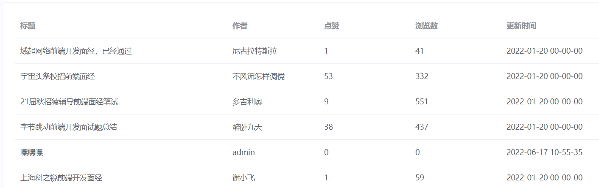

```jsx
<el-table :data="list" style="width: 100%">
  <el-table-column prop="stem" label="标题" width="400"> </el-table-column>
  <el-table-column prop="creator" label="作者"> </el-table-column>
  <el-table-column prop="likeCount" label="点赞"> </el-table-column>
  <el-table-column prop="views" label="浏览数"> </el-table-column>
  <el-table-column prop="createdAt" label="更新时间" width="200"> </el-table-column>
</el-table>
```


### 操作按钮部分

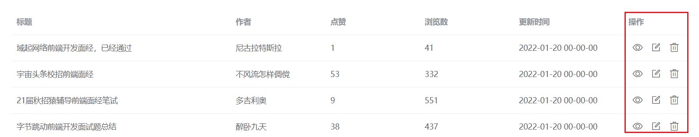

```jsx
<el-table :data="list" style="width: 100%">
  <el-table-column prop="stem" label="标题" width="400"> </el-table-column>
  <el-table-column prop="creator" label="作者"> </el-table-column>
  <el-table-column prop="likeCount" label="点赞"> </el-table-column>
  <el-table-column prop="views" label="浏览数"> </el-table-column>
  <el-table-column prop="createdAt" label="更新时间" width="200"> </el-table-column>
    
    <!-- 底层源码：
           <div v-for="(item,index) in data">
              <slot name="default" :row="item" :$index="index"></slot>
          </div>
       -->
  <el-table-column label="操作" width="120px">
       <!-- obj中有两个常用属性 => $index下标, row一行的数据对象(遍历时的一个item) -->
    <template #default="obj">
        <!-- {{obj.$index}}  {{obj.row.id}}-->
      <div class="actions">
        <i class="el-icon-view"> </i>
        <i class="el-icon-edit-outline"> </i>
        <i class="el-icon-delete" @click="del(obj.row.id)"></i>
      </div>
    </template>
  </el-table-column>
</el-table>


del (id) {
  console.log(id)
}
```


### 分页渲染

```jsx
    <!--
      @size-change            每页条数变化，每页10条 => 每页20条
      @current-change         当前页变化，重新加载数据---
      :current-page="当前页"   绑定当前生效的是第几页,控制高亮---
      :page-sizes="[100, 200, 300, 400]" 可供选择的每页条数
      :page-size="100"        当前生效的每页条数---
      :total="值"             总数量---
      layout                  布局容器，设定有哪些控件展示在页面中
     -->
<el-pagination
  background
  @current-change="handleCurrentChange"
  :current-page="current"
  :page-size="pageSize"
  layout="prev, pager, next"
  :total="total"
>
</el-pagination>


handleCurrentChange (val) {
  // 处理当前页变化
  // console.log(val)
  // 更新当前页
  this.current = val
  // 重新根据当前页，进行初始化数据
  this.initData()
}
```


## 面经管理 - 添加功能

### 打开抽屉 - 注册点击事件

`添加  预览  修改`，都要打开抽屉，可以复用

```jsx
<el-button @click="openDrawer('add')" icon="el-icon-plus" size="small" type="primary" round>
  添加面经
</el-button>

<el-table-column label="操作" width="120px">
  <template #default="obj">
    <div class="actions">
      <i class="el-icon-view" @click="openDrawer('preview', obj.row.id, )"></i>
      <i class="el-icon-edit-outline" @click="openDrawer('edit', obj.row.id)"></i>
      <i class="el-icon-delete" @click="del(row.id)"></i>
    </div>
  </template>
</el-table-column>

openDrawer (type, id) {
  // 点哪个按钮去根据字段判断当前进行的什么操作
  console.log(type)
}
```


### 打开抽屉 - 显示抽屉

```jsx
<!-- drawer 外层放，固定定位
         title 配置标题
         :visible.sync  绑定一个布尔值,控制显示隐藏(.sync修饰符，后面人资讲)
         direction="rtl"   从右侧弹出 从右往左开
         :before-close    处理弹窗关闭事件
    -->
<el-drawer
  :visible.sync="isShowDrawer"
  :before-close="handleClose"
  title="大标题"
  direction="rtl"
  size="50%"
>
  <span>我来啦!</span>
</el-drawer>

data () {
  return {
    current: 1,
    pageSize: 10,
    total: 0,
    list: [],
    isShowDrawer: false  //默认不显示
  }
},


openDrawer (type, id) {
  //console.log(type, id)
  this.isShowDrawer = true  // 显示弹窗
},
handleClose () {
  //console.log('关闭弹窗')
  this.isShowDrawer = false  // 关闭弹窗
}
```


### 计算属性控制标题

记录 drawerType， 提供计算属性

```jsx
data () {
  return {
    current: 1,
    pageSize: 10,
    total: 0,
    list: [],
    isShowDrawer: false,
    drawerType: ''    //弹框操作类型   默认没有打开弹框，初始值为 '' add preview edit
  }
},
methods: {  
    openDrawer (type, id) {
      // console.log(type, id)
        // type 的值 add preview edit => 对应(自动)设置标题 => 计算属性
      this.drawerType = type
      this.isShowDrawer = true
    },
},
    
computed: {
  drawerTitle () {
    let title = '默认大标题'
    if (this.drawerType === 'add') title = '添加面经'
    if (this.drawerType === 'preview') title = '面经预览'
    if (this.drawerType === 'edit') title = '修改面经'
    return title
  }
},
```

结构中渲染

```jsx
<el-drawer
  :visible.sync="isShowDrawer"
  :before-close="handleClose"
  :title="drawerTitle"     //
  direction="rtl"
>
  <span>我来啦!</span>
</el-drawer>
```


### 表单结构

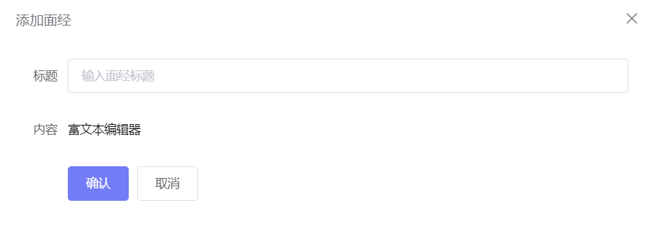

```jsx
<el-form ref="form" label-width="80px">
  <el-form-item label="标题" prop="stem">
    <el-input v-model="form.stem" placeholder="输入面经标题"></el-input>
  </el-form-item>
  <el-form-item label="内容" prop="content">
    富文本编辑器
  </el-form-item>
  <el-form-item>
    <el-button type="primary">确认</el-button>
    <el-button>取消</el-button>
  </el-form-item>
</el-form>

//data
form: {
  stem: '', // 标题
  content: ''  // content
}
```


### 富文本编辑器

https://www.npmjs.com/package/vue-quill-editor

装包

```jsx
npm install vue-quill-editor
```

导入,  局部注册

```jsx
// require styles
import 'quill/dist/quill.core.css'
import 'quill/dist/quill.snow.css'
import 'quill/dist/quill.bubble.css'
 
import { quillEditor } from 'vue-quill-editor'
 
export default {
  components: {
    quillEditor
  }
}
```

使用， v-model 绑定数据

```jsx
<el-form ref="form" label-width="80px">
  <el-form-item label="标题" prop="stem">
    <el-input v-model="form.stem" placeholder="输入面经标题"></el-input>
  </el-form-item>
  <el-form-item label="内容" prop="content">
    <quill-editor v-model="form.content"></quill-editor>  //
  </el-form-item>
  <el-form-item>
    <el-button type="primary">确认</el-button>
    <el-button>取消</el-button>
  </el-form-item>
</el-form>
```


### 添加非空校验

```jsx
<el-form :model="form" :rules="rules" ref="form" label-width="80px">
  <el-form-item label="标题" prop="stem">
    <el-input v-model="form.stem" placeholder="输入面经标题"></el-input>
  </el-form-item>
  <el-form-item label="内容" prop="content">
      <!-- 注意：这个quill-editor不是element的表单元素，不受element的直接控制，blur无效的
                    需要手动注册blur事件，调用form的校验
               -->
    <quill-editor v-model="form.content"></quill-editor>
  </el-form-item>
  <el-form-item>
    <el-button type="primary" @click="submit">确认</el-button>
    <el-button>取消</el-button>
  </el-form-item>
</el-form>

rules: {
  stem: [{ required: true, message: '请输入面经标题', trigger: 'blur' }],
  content: [{ required: true, message: '请输入面经标题', trigger: 'blur' }]
}
```

富文本编辑器，校验单独处理

```jsx
<quill-editor v-model="form.content" @blur="$refs.form.validateField('content')"></quill-editor>
```


### 封装接口 api 添加完成

`api/article.js`

```jsx
// 新增文章
export const createArticle = data => {
  return request.post('/admin/interview/create', data)
}
```

发送请求添加，关闭弹框重新渲染 （关闭弹框要重置表单）

```jsx
handleClose () {
    // 将表单内容重置！！
  this.$refs.form.resetFields()
  this.isShowDrawer = false
},
async submit () {
   try {
        // 1.校验表单
        this.$refs.form.validate()
        // 2.发送请求
        await createArticle(this.form)
        // 3.添加提示
        this.$message.success('添加成功')
        // 4.重新渲染,新增是新增到第一页去的
        this.current = 1
        this.initData()
        // 5.关闭弹框s
        this.handleClose()
  } catch (e) {
    console.log(e)
  }
}
```


## 面经管理 - 删除功能

`api/article.js`

```jsx
export const removeArticle = id => {
  return request.delete('/admin/interview/remove', {
      // 参数传递在请求体
    data: {
      id
    }
  })
}

/*
  对于get和delete，如果要传递参数，必须先传对象，对象里面去配置 params(地址栏) 或 data(请求体)
  axios.get(url,config)
  axios.delete(url,config)

  对于下面三种情况，第二个直接写参数对象即可
  axios.put(url,data,config)
  axios.patch(url,data,config)
  axios.post(url,data,config)
*/

```

页面中，注册点击事件调用

```jsx
<i class="el-icon-delete" @click="del(row.id)"></i>

async del (id) {
  await removeArticle(id)
  this.$message.success('删除成功')
  this.initData()  //重新渲染
},
```


## 面经管理 - 修改功能

### 修改回显

修改比添加多一层回显，显示弹框时，需要发送请求获取数据

`api/article.js`

```jsx
// 获取单个面经详情
export const getArticleDetail = id => {
  return request.get('/admin/interview/show', {
    params: {
      id
    }
  })
}
```

回显展示

```jsx
async openDrawer (type, id) {
  // console.log(type, id)
  this.drawerType = type
  this.isShowDrawer = true

 // 除了添加， 编辑和预览，都是要回显
  if (type !== 'add') {
    const res = await getArticleDetail(id)
    //将res.data的所有数据，展开到form中，用于回显
    this.form = {
      ...res.data         // stem:res.data.stem, content:res.data.content
    }
  }
},
```

### 修改提交

`api/article.js`准备api

```jsx
// 用户修改了内容，一点击提交按钮，进行更新操作
export const updateArticle = data => {
  return request.put('/admin/interview/update', data)
}
```

判断，修改提交

```jsx
async submit () {
  try {
    // 校验表单
    await this.$refs.form.validate()
      
    // 如何区分, 当前是 编辑 还是 添加
    if (this.drawerType === 'add') {
      // 发送请求
      await createArticle(this.form)
      // 添加提示 $message.success
      this.$message.success('添加成功')
    }
      
    if (this.drawerType === 'edit') {
      // 发送的是编辑的请求
      const { id, stem, content } = this.form
      await updateArticle({ id, stem, content })
      this.$message.success('修改成功')
    }
      
    // 无论是修改还是添加, 都会回到第一页, 重置页码
    this.current = 1
    // 重新渲染
    this.initData()
    // 关闭弹框
    this.handleClose()
  } catch (e) {
    console.log(e)
  }
}
```


## 面经管理 - 预览功能

预览不需要展示表单，直接 v-html 渲染即可

```jsx
<div v-if="drawerType === 'preview'" class="article-preview">
  <h5>{{ form.stem }}</h5>
  <div v-html="form.content"></div>
</div>

<el-form v-else :model="form" :rules="rules" ref="form" label-width="80px">
  ...
</el-form>
```

处理关闭逻辑

```jsx
handleClose () {
  // 注意点: 由于公用的抽屉, 当预览时, 是没有表单的! 不能重置表单
  // 但是form的值还在, 会影响添加 => 需要手动重置一下
  // 关闭时将表单内容重置

  // 无论是哪种情况, 一律将form手动数据清零
  this.form = { stem: '', content: '' }

  if (this.drawerType !== 'preview') {
    // add edit 调用 resetFields 在此处的作用: 重置校验状态
    this.$refs.form.resetFields()
  }

  this.isShowDrawer = false // 关闭弹框
},
```


