# 面经 H5 端 - Vant（上）

接口文档地址：https://www.apifox.cn/apidoc/project-934563/api-20384515

## 项目创建目录初始化

### vue-cli 建项目 

安装脚手架 (已安装)

```
npm i @vue/cli -g
```

创建项目

```
vue create hm-vant-h5
```

+ 选项

```js
Vue CLI v5.0.4
? Please pick a preset: (Use arrow keys)
  Default ([Vue 3] babel, eslint)
  Default ([Vue 2] babel, eslint)
> Manually select features      选自定义
```

+ 手动选择功能


+ 选择vue的版本

```jsx
  3.x
> 2.x
```

+ 是否使用history模式

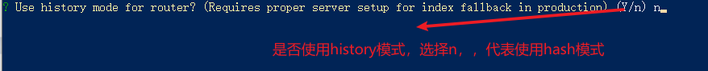

+ 选择css预处理

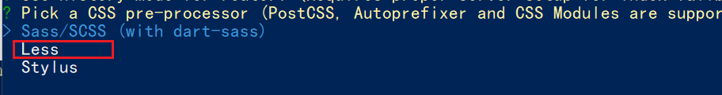

+ 选择eslint的风格 （eslint 代码规范的检验工具，检验代码是否符合规范）
+ 比如：const age = 18;   =>  报错！多加了分号！后面有工具，一保存，全部格式化成最规范的样子

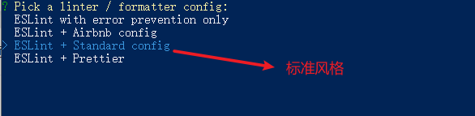

+ 选择校验的时机 （直接回车）

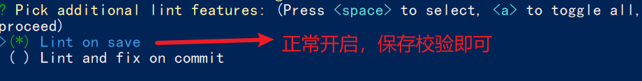

+ 选择配置文件的生成方式 （直接回车）


- 是否保存预设，下次直接使用？  =>   不保存，输入 N

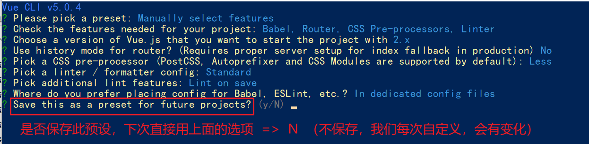

+ 等待安装，项目初始化完成

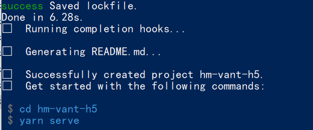

+ 启动项目

```
npm run serve
```


### ESlint代码规范

代码规范：一套写代码的约定规则。例如：赋值符号的左右是否需要空格？一句结束是否是要加;？... 

>  没有规矩不成方圆  

ESLint:是一个代码检查工具，用来检查你的代码是否符合指定的规则(你和你的团队可以自行约定一套规则)。在创建项目时，我们使用的是 [JavaScript Standard Style](https://standardjs.com/readme-zhcn.html) 代码风格的规则。

#### JavaScript Standard Style 规范说明

建议把：https://standardjs.com/rules-zhcn.html 看一遍，然后在写的时候,  遇到错误就查询解决。

下面是这份规则中的一小部分：

- *字符串使用单引号* – 需要转义的地方除外
- *无分号* – [这](http://blog.izs.me/post/2353458699/an-open-letter-to-javascript-leaders-regarding)[没什么不好。](http://inimino.org/~inimino/blog/javascript_semicolons)[不骗你！](https://www.youtube.com/watch?v=gsfbh17Ax9I)
- *关键字后加空格* `if (condition) { ... }`
- *函数名后加空格* `function name (arg) { ... }`
- 坚持使用全等 `===` 摒弃 `==` 一但在需要检查 `null || undefined` 时可以使用 `obj == null`
- ......

#### 代码规范错误

如果你的代码不符合standard的要求，eslint会跳出来刀子嘴，豆腐心地提示你。

下面我们在main.js中随意做一些改动：添加一些空行，空格。

```js
import Vue from 'vue'
import App from './App.vue'

import './styles/index.less'
import router from './router'
Vue.config.productionTip = false

new Vue ( {
  render: h => h(App),
  router
}).$mount('#app')


```

按下保存代码之后：

你将会看在控制台中输出如下错误：

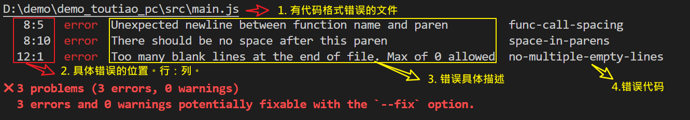

> eslint 是来帮助你的。心态要好，有错，就改。


#### 手动修正

根据错误提示来一项一项手动修正。

如果你不认识命令行中的语法报错是什么意思，你可以根据错误代码（func-call-spacing, space-in-parens,.....）去 ESLint 规则列表中查找其具体含义。

打开 [ESLint 规则表](https://cn.eslint.org/docs/rules/)，使用页面搜索（Ctrl + F）这个代码，查找对该规则的一个释义。

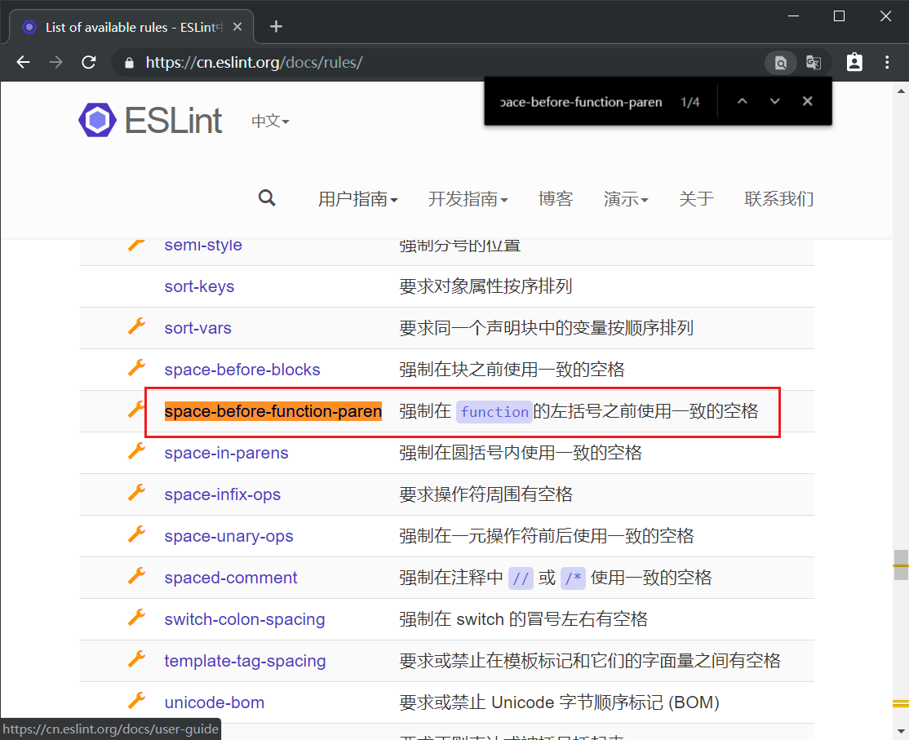


#### 通过vscode中的eslint插件来实现自动修正

> 1. eslint会自动高亮错误显示
> 2. 通过配置，eslint会自动帮助我们修复错误

+ 如何安装

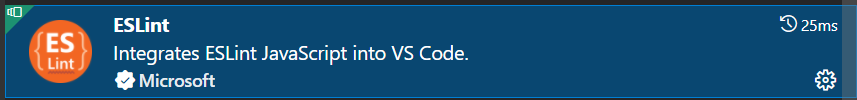

+ 如何配置

```js
// 当保存的时候，eslint自动帮我们修复错误
"editor.codeActionsOnSave": {
    "source.fixAll": true
},
// 保存代码，不自动格式化
"editor.formatOnSave": false
```

+ 注意：eslint的配置文件必须在根目录下，这个插件才能才能生效。打开项目必须以根目录打开，一次打开一个项目
+ 注意：使用了eslint校验之后，把vscode带的那些格式化工具全禁用了 Beatify 

我的完整配置，供参考

```jsx
{
  "editor.tabSize": 2,
  "workbench.iconTheme": "vscode-icons",
  "explorer.compactFolders": false,
  "security.workspace.trust.untrustedFiles": "open",
  "git.enableSmartCommit": true,
  // 不要有分号
  "prettier.semi": false,
  // 使用单引号
  "prettier.singleQuote": true,
  // 默认使用prittier作为格式化工具
  "editor.defaultFormatter": "esbenp.prettier-vscode",
  "emmet.showAbbreviationSuggestions": true,
  "emmet.includeLanguages": {
    "javascript": "javascriptreact"
  },
  "editor.suggest.snippetsPreventQuickSuggestions": false,
  "editor.fontSize": 16,  // 设置文字的大小
  "window.zoomLevel": 1,
  "emmet.triggerExpansionOnTab": true,
  // 保存时自动格式化 - 按照eslint的规则格式化
  "editor.codeActionsOnSave": {
    "source.fixAll": true
  },
  // 保存代码，不自动格式化
  "editor.formatOnSave": false
}

// 或者

{
    "window.zoomLevel": 2,
    "workbench.iconTheme": "vscode-icons",
    "editor.tabSize": 2,
    "emmet.triggerExpansionOnTab": true,
    // 当保存的时候，eslint自动帮我们修复错误
    "editor.codeActionsOnSave": {
        "source.fixAll": true
    },
    // 保存代码，不自动格式化
    "editor.formatOnSave": false
}
```

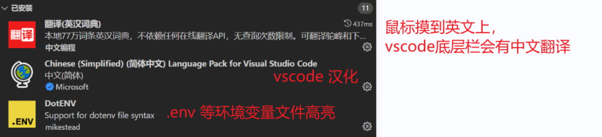

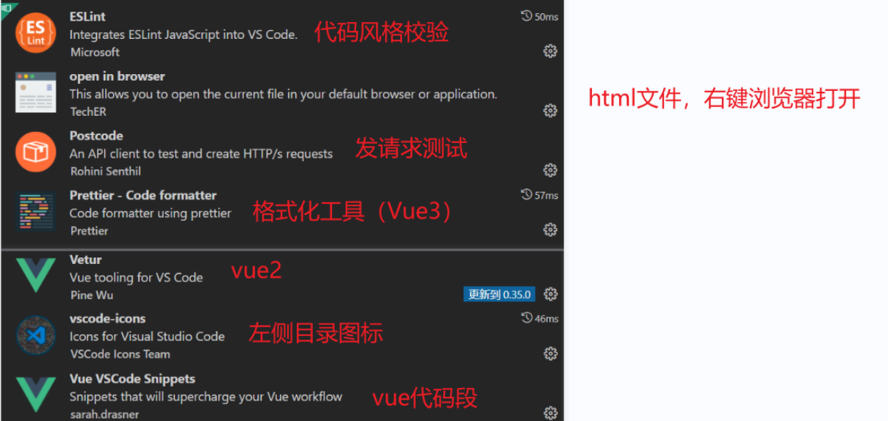

禁用 volar （Vue3）

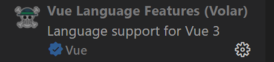


### 调整初始化目录结构

> 强烈建议大家严格按照老师的步骤进行调整，为了符合企业规范

为了更好的实现后面的操作，我们把整体的目录结构做一些调整。

目标:

1. 删除初始化的一些默认文件
2. 修改没删除的文件
3. 新增我们需要的目录结构

#### 修改文件

`public/index.html` 修改视口，开发的是移动端项目

```html
<meta
  name="viewport"
  content="width=device-width,initial-scale=1.0, user-scalable=0"
/>
```

`main.js` 不需要修改

`router/index.js`

删除默认的路由配置

```js
import Vue from 'vue'
import VueRouter from 'vue-router'

Vue.use(VueRouter)

const routes = [
]

const router = new VueRouter({
  routes
})

export default router

```

`App.vue`

```html
<template>
  <div id="app">
    <router-view/>
  </div>
</template>

<style lang="less">
</style>
```

#### 删除文件

- src/views/AboutView.vue

- src/views/HomeView.vue

- src/components/HelloWorld.vue

- src/assets/logo.png

#### 新增目录

- src/api 目录
  - 存储接口模块 (发送ajax请求接口的模块)
- src/utils 目录
  - 存储一些工具模块 (自己封装的方法)

+ src/assets目录
  + 新增项目使用的素材

目录效果如下:

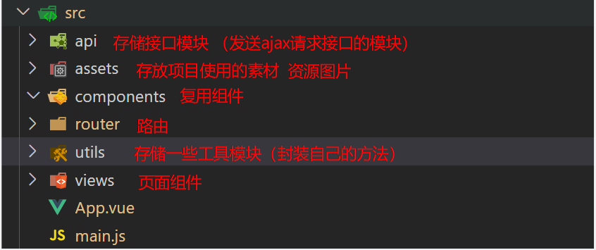


## vant 按需加载

### vant-ui组件库的引入

> 组件库：第三方封装好了很多很多的组件，整合到一起就是一个组件库。
>
> https://vant-contrib.gitee.io/vant/v2/#/zh-CN/

组件库并不是唯一的

pc:  [element-ui](https://element.eleme.cn/#/zh-CN)    [element-plus](https://element-plus.gitee.io/zh-CN/)  [iview](https://iview.github.io/)      **[ant-design](https://antdv.com/components/overview-cn)**

移动：[vant-ui](https://vant-contrib.gitee.io/vant/v2/#/zh-CN/)     [Mint UI](http://mint-ui.github.io/docs/#/zh-cn2) (饿了么)    [Cube UI](https://didi.github.io/cube-ui/#/zh-CN/) (滴滴)


## 全部导入和按需导入的区别

目标：明确 **全部导入** 和 **按需导入** 的区别


区别：

1.全部导入会引起项目打包后的体积变大，进而影响用户访问网站的性能

2.按需导入只会导入你使用的组件，进而节约了资源

### 全部导入

+ 安装vant-ui

```
npm i vant@latest-v2  或  yarn add vant@latest-v2
```

+ 在main.js中

```js
import Vant from 'vant';
import 'vant/lib/index.css';
// 把vant中所有的组件都导入了
Vue.use(Vant)
```

- 即可使用

```jsx
<van-button type="primary">主要按钮</van-button>
<van-button type="info">信息按钮</van-button>
```

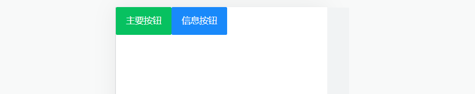

==vant-ui提供了很多的组件，全部导入，会导致项目打包变得很大。==


### 按需加载

+ 安装vant-ui

```
npm i vant@latest-v2  或  yarn add vant@latest-v2
```

+ 安装一个插件

```jsd
npm i babel-plugin-import -D
```

+ 在`babel.config.js`中配置

```js
module.exports = {
  presets: [
    '@vue/cli-plugin-babel/preset'
  ],
    //复制下面的
  plugins: [
    ['import', {
      libraryName: 'vant',
      libraryDirectory: 'es',
      style: true
    }, 'vant']
  ]
}
```

+ 按需加载，在`main.js`

```js
import { Button, Icon } from 'vant'

Vue.use(Button) // use一下Button组件，将van-button注册成全局组件
Vue.use(Icon)
```

+ main.js中引入

```jsx
import '@/utils/vant'
```

+ `app.vue`中进行测试

```js
<van-button type="primary">主要按钮</van-button>
<van-button type="info">信息按钮</van-button>
<van-button type="default">默认按钮</van-button>
<van-button type="warning">警告按钮</van-button>
<van-button type="danger">危险按钮</van-button>
```


## 项目中的vw适配

官方说明：https://vant-contrib.gitee.io/vant/v2/#/zh-CN/advanced-usage

```js
yarn add postcss-px-to-viewport@1.1.1 -D
```

+ 项目**根目录**， **新建postcss的配置文件**`postcss.config.js`

```jsx
// postcss.config.js
module.exports = {
  plugins: {
    'postcss-px-to-viewport': {
        //适配的标准手机屏幕 375 （2倍设计图/2）
      viewportWidth: 375,
    },
  },
};
```

注意：px不会等比例缩放，但是我们只需要写px，当前的webpack会自动将px转换成vw

viewportWidth:设计稿的视口宽度

1. vant-ui中的组件就是按照375的视口宽度设计的
2. 恰好面经项目中的设计稿也是按照375的视口宽度设计的，所以此时 我们只需要配置375就可以了
3. 如果设计稿不是按照375而是按照750的宽度设计，[那此时这个值该怎么填呢？](https://zhuanlan.zhihu.com/p/366664788)

## request模块 - axios封装

接口文档地址：http://interview-api-t.itheima.net/swagger-ui/index.html#/

接口文档地址：https://apifox.com/apidoc/project-934563/api-20384515

基地址：http://interview-api-t.itheima.net/h5/

我们会使用 axios 来请求后端接口, 一般都会对 axios 进行一些配置 (比如: 配置基础地址等)

一般项目开发中, 都会对 axios 进行基本的**二次封装**, 单独封装到一个模块中, 便于使用

1. 安装 axios

```
npm i axios
```

2. 新建 `utils/request.js` 封装 axios 模块

   利用 axios.create 创建一个自定义的 axios 来使用

   http://www.axios-js.com/zh-cn/docs/#axios-create-config

```js
/* 封装axios用于发送请求 */
import axios from 'axios'

// 创建一个新的axios实例
const request = axios.create({
  baseURL: 'http://interview-api-t.itheima.net/h5/',  //请求基地址
  timeout: 5000   //超时时间
})

// 添加请求拦截器
request.interceptors.request.use(function (config) {
  // 在发送请求之前做些什么
  return config
}, function (error) {
  // 对请求错误做些什么
  return Promise.reject(error)
})

// 添加响应拦截器
request.interceptors.response.use(function (response) {
  // 对响应数据做点什么
  return response.data
}, function (error) {
  // 对响应错误做点什么
  return Promise.reject(error)
})

export default request
```

3. 测试 (可以先注册后登录)

```js
<script>
import request from '@/utils/request'
import { setToken } from '@/utils/storage' // 按需
export default {
  async created () {
    // const res = await request.post('/user/register', {
    //   username: 'shuaipeng',
    //   password: '123456'
    // })
    const res = await request.post('/user/login', {
      username: 'shuaipeng',
      password: '123456'
    })
     setToken(res.data.token)
    console.log(res)
  }
}
</script>
```

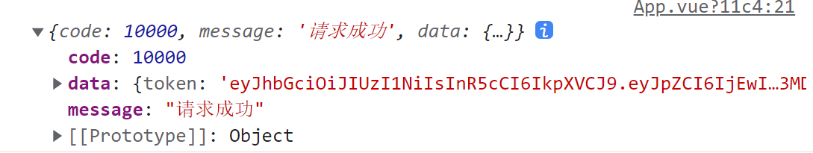


## local模块 - 本地存储

新建 utils/storage.js

```jsx
//此处会将 token 的操作进行封装，避免页面中，因为写错键名，导致项目出错
//以后，遇到重复性的storage键，推荐将重复的key提取成一个常量
const KEY = 'my-token-vant-mobile'

// 直接用按需导出，可以导出多个
// 但是按需导出，导入时必须 import { getToken } from '模块名导入'

// 设置
export const setToken = (newToken) => {
  localStorage.setItem(KEY, newToken)
}

// 获取
export const getToken = () => {
  return localStorage.getItem(KEY)
}

// 删除
export const delToken = () => {
  localStorage.removeItem(KEY)
}


//使用
//import { setToken } from '@/utils/storage'
//setToken(res.data.token)
```

登录完成存储token到本地

```jsx
import { login } from '@/api/user'
import { setToken } from '@/utils/storage'

methods: {
  async onSubmit (values) {
    const { data } = await login(values)
    setToken(data.token)
    this.$toast.success('登录成功')
    this.$router.push('/')
  }
}
```


## 路由设计配置

但凡是单个页面，独立展示的，都是一级路由

路由设计：

- 登录页 （一级） login
- 注册页（一级） register
- 文章详情页（一级） detail
- 首页（一级） layout
  - 面经（二级）article
  - 收藏（二级）collect
  - 喜欢（二级）like
  - 我的（二级）my

### 一级路由

`router/index.js`配置一级路由,  一级views组件于教学资料中直接 CV 即可

```jsx
import Vue from 'vue'
import VueRouter from 'vue-router'
import Login from '@/views/login'
import Register from '@/views/register'
import Detail from '@/views/detail'
import Layout from '@/views/layout'
Vue.use(VueRouter)

const router = new VueRouter({
    // 路由规则表
  routes: [
    { path: '/login', component: Login },
    { path: '/register', component: Register },
    { path: '/detail/:id', component: Detail },
    {
      path: '/',
      component: Layout
    }
  ]
})

export default router
```

清理 `App.vue`

```jsx
<template>
  <div id="app">
    <router-view/>
  </div>
</template>

<script>
export default {
  async created () {

  }
}
</script>
```


### tabbar标签页

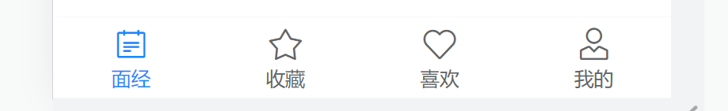

https://vant-contrib.gitee.io/vant/v2/#/zh-CN/tabbar

`main.js` 引入组件

```jsx
import { Button, Icon, Tabbar, TabbarItem } from 'vant'
Vue.use(Tabbar)
Vue.use(TabbarItem)
```

`layout.vue`

```jsx
<template>
  <div class="layout-page">
    首页架子 - 内容区域

    <van-tabbar>
      <van-tabbar-item icon="notes-o">面经</van-tabbar-item>
      <van-tabbar-item icon="star-o">收藏</van-tabbar-item>
      <van-tabbar-item icon="like-o">喜欢</van-tabbar-item>
      <van-tabbar-item icon="user-o">我的</van-tabbar-item>
    </van-tabbar>
  </div>
</template>
```


### 二级路由

`router/index.js`配置二级路由

```jsx
import Vue from 'vue'
import VueRouter from 'vue-router'
import Login from '@/views/login'
import Register from '@/views/register'
import Detail from '@/views/detail'
import Layout from '@/views/layout'

import Like from '@/views/like'
import Article from '@/views/article'
import Collect from '@/views/collect'
import User from '@/views/user'
Vue.use(VueRouter)

const router = new VueRouter({
  routes: [
    { path: '/login', component: Login },
    { path: '/register', component: Register },
    { path: '/article/:id', component: Detail },
    {
      path: '/',
      component: Layout,
      redirect: '/article',
      children: [
        { path: 'article', component: Article },
        { path: 'like', component: Like },
        { path: 'collect', component: Collect },
        { path: 'user', component: User }
      ]
    }
  ]
})

export default router
```

`layout.vue` 配置路由出口,  配置 tabbar

```jsx
<template>
  <div class="layout-page">
      // 路由出口
    <router-view></router-view>
     
     <!-- 配置 route 属性，开启tabbar的路由模式，给item配置to属性，定义跳转的地址 -->
    <van-tabbar route>
      <van-tabbar-item to="/article" icon="notes-o">面经</van-tabbar-item>
      <van-tabbar-item to="/collect" icon="star-o">收藏</van-tabbar-item>
      <van-tabbar-item to="/like" icon="like-o">喜欢</van-tabbar-item>
      <van-tabbar-item to="/user" icon="user-o">我的</van-tabbar-item>
    </van-tabbar>
  </div>
</template>
```

效果图：

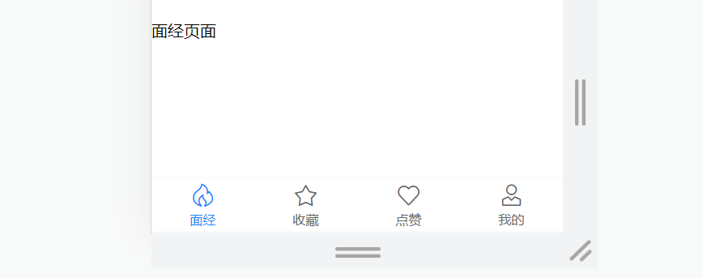


## 主题定制(可选)

整体网站风格，其实都是橙色的，可以通过变量覆盖的方式，制定主题色

https://vant-contrib.gitee.io/vant/v2/#/zh-CN/theme

`babel.config.js` 制定样式路径

```jsx
module.exports = {
  presets: [
    '@vue/cli-plugin-babel/preset'
  ],
  plugins: [
    ['import', {
      libraryName: 'vant',
      libraryDirectory: 'es',
      // 指定样式路径
      style: (name) => `${name}/style/less`
    }, 'vant']
  ]
}
```

`vue.config.js` 覆盖变量

```jsx
const { defineConfig } = require('@vue/cli-service')
module.exports = defineConfig({
  transpileDependencies: true,
  css: {
    loaderOptions: {
      less: {
        lessOptions: {
          modifyVars: {
            // 直接覆盖变量
            'blue': '#FA6D1D',
          },
        },
      },
    },
  },
})
```

重启服务器生效！


## 登录&注册功能

### 登录静态布局

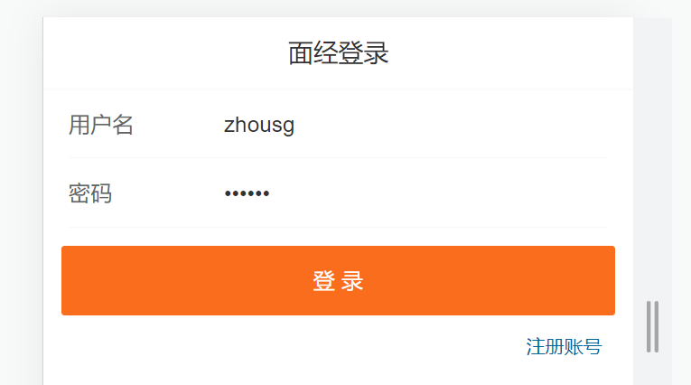

使用组件

- van-nav-bar
- van-form
- van-field
- van-button

`vant-ui.js` 注册

```jsx
import Vue from 'vue'
import {
  NavBar,
  Form,
  Field
} from 'vant'
Vue.use(NavBar)
Vue.use(Form)
Vue.use(Field)
```

`login.vue` 使用

```jsx
<template>
  <div class="login-page">
    <!-- 导航栏部分 -->
    <van-nav-bar title="面经登录" />

    <!-- 一旦form表单提交了，就会触发submit，可以在submit事件中
         根据拿到的表单提交信息，发送axios请求
     -->
    <van-form @submit="onSubmit">
      <!-- 输入框组件 -->
      <!-- \w 字母数字_   \d 数字0-9 -->
      <van-field
        v-model="username" 
        name="username"                         //
        label="用户名"
        placeholder="用户名"
        :rules="[
          { required: true, message: '请填写用户名' },
          { pattern: /^\w{5,}$/, message: '用户名至少包含5个字符' }     //正则
        ]"
      />
      <van-field
        v-model="password"
        type="password"
        name="password"
        label="密码"
        placeholder="密码"
        :rules="[
          { required: true, message: '请填写密码' },
          { pattern: /^\w{6,}$/, message: '密码至少包含6个字符' }     //正则
        ]"
      />
      <div style="margin: 16px">
        <van-button block type="info" native-type="submit">提交</van-button>
      </div>
    </van-form>
  </div>
</template>

<script>
export default {
  name: 'login-page',
  data () {
    return {
      username: 'zhousg',
      password: '123456'
    }
  },
  methods: {
    onSubmit (values) {
      console.log('submit', values)
    }
  }
}
</script>
```

`login.vue`添加 router-link 标签（跳转到注册）

```vue
<template>
  <div class="login-page">
    <van-nav-bar title="面经登录" />

    <van-form @submit="onSubmit">
      ...
    </van-form>
    
    <router-link class="link" to="/register">注册账号</router-link>     //
  </div>
</template>
```

`login.vue`调整样式

```jsx
<style lang="less" scoped>
.link {
  color: #069;
  font-size: 12px;
  padding-right: 20px;
  float: right;
}
</style>
```

## 登录表单中的细节分析

1. @submit事件:当点击提交按钮时会自动触发submit事件
2. v-model双向绑定：会自动把v-model后面的值和文本框中的值进行双向绑定
3. name属性:收集的key的值，要和接口文档对应起来
4. label:输入的文本框的title
5. :rules: 表单的校验规则
6. placeholder: 文本框的提示语

### 注册静态布局

`register.vue`

```jsx
<template>
  <div class="login-page">
    <van-nav-bar title="面经注册" />

    <van-form @submit="onSubmit">
      <van-field
        v-model="username"
        name="username"
        label="用户名"
        placeholder="用户名"
        :rules="[
          { required: true, message: '请填写用户名' },
          { pattern: /^\w{5,}$/, message: '用户名至少包含5个字符' }     //正则
        ]"
      />
      <van-field
        v-model="password"
        type="password"
        name="password"
        label="密码"
        placeholder="密码"
       :rules="[
          { required: true, message: '请填写密码' },
          { pattern: /^\w{6,}$/, message: '密码至少包含6个字符' }     //正则
        ]"
      />
      <div style="margin: 16px">
        <van-button block type="primary" native-type="submit"
          >注册</van-button
        >
      </div>
    </van-form>
    <router-link class="link" to="/login">有账号，去登录</router-link>
  </div>
</template>

<script>
export default {
  name: 'register-page',
  data () {
    return {
      username: '',
      password: ''
    }
  },
  methods: {
    onSubmit (values) {
      console.log('submit', values)
    }
  }
}
</script>

<style lang="less" scoped>
.link {
  color: #069;
  font-size: 12px;
  padding-right: 20px;
  float: right;
}
</style>
```


### toast 轻提示

将来无论注册成功，还是失败，都是需要给用户提示的

https://vant-contrib.gitee.io/vant/v2/#/zh-CN/toast

```jsx
import { Toast } from 'vant';
Vue.use(Toast)
```

两种使用方式

1. 导入，调用

```jsx
import { Toast } from 'vant';
Toast('提示内容');
// Toast('提示内容')
/*  Toast.loading({
        message: '加载中...',
        forbidClick: true,
        duration: 0
      })
      setTimeout(() => {
        console.log('3秒后请求回来了')
        // Toast.clear()
        Toast.success('注册成功')
      }, 3000) */

// 发送注册的请求
// this.$toast.fail('注册失败')
```

2. **组件内 **通过this直接调用

```jsx
this.$toast('提示内容')   //必须在组件的实例范围内，this指向某个组件实例，才能这么用
```


### 请求模块封装思想


### 封装api接口 - 注册功能


新建 `api/user.js` 提供注册 Api 函数

```jsx
import request from '@/utils/request'

// 注册接口
export const register = (data) => {
  return request.post('/user/register', data)
}

//注册请求函数
//export const register = (obj) => request.post('/user/register', obj)
```

`register.vue`页面中调用测试

```jsx
import { register } from '@/api/user'
methods: {
  async onSubmit (values) {
    // 往后台发送注册请求了
    await register(values)
    this.$toast.success('注册成功')  //提示
    this.$router.push('/login')   //跳转到login
  }
}
```

`request.js`响应拦截器，统一处理错误提示


```jsx
import { Toast } from 'vant'

...

// 添加响应拦截器
request.interceptors.response.use(function (response) {
  // 对响应数据做点什么
  return response.data
}, function (error) {
  if (error.response) {
    // 有错误响应, 提示错误提示
    Toast(error.response.data.message)
  }
  // 对响应错误做点什么
  return Promise.reject(error)
})
```


### 封装api接口 - 登录功能

`api/user.js` 提供登录 Api 函数

```jsx
// 登录接口
export const login = (data) => {
  return request.post('/user/login', data)
}

// 登录请求函数
//export const login = (obj) => request.post('/user/login', obj)

```

`login.vue` 登录功能


```jsx
import { login } from '@/api/user'
import { setToken } from '@/utils/storage'

methods: {
  async onSubmit (values) {
    const { data } = await login(values)
    setToken(data.token)
    this.$toast.success('登录成功')
    this.$router.push('/')
  }
}
```


## 页面访问拦截

这个 面经移动端 项目，只对 登录用户 开放，如果未登录，一律拦截到登录

1. 如果访问的是 **首页**，     无token， 拦走

2. 如果访问的是 **列表页**，无token， 拦走

3. 如果访问的是 **详情页**，无token， 拦走

   ....

分析：哪些页面，是不需要登录，就可以访问的！  =>  **注册**   和   **登录**  （白名单 - 游客可以随意访问的）

核心逻辑：

1. 判断用户有没有token， 有token， 直接放行  （有身份的人，想去哪就去哪~）
2. 没有token（游客），如果是白名单中的页面，直接放行
3. 否则，无token（游客），且在访问需要权限访问的页面，直接拦截到登录


vue路由内置了一个语法

**全局前置守卫：**

[]: https://v3.router.vuejs.org/zh/guide/advanced/navigation-guards.html#%E5%85%A8%E5%B1%80%E5%89%8D%E7%BD%AE%E5%AE%88%E5%8D%AB

1. 所有的路由一旦被匹配到，在真正渲染解析之前，都会先经过全局前置守卫

2. 只有全局前置守卫放行，才能看到真正的页面

```jsx
index.js
// 全局前置守卫：
// 1. 所有的路由一旦被匹配到，在真正渲染解析之前，都会先经过全局前置守卫
// 2. 只有全局前置守卫放行，才能看到真正的页面

// 任何路由，被解析访问前，都会先执行这个回调
// 1. from 你从哪里来， 从哪来的路由信息对象
// 2. to   你往哪里去， 到哪去的路由信息对象
// 3. next() 是否放行，如果next()调用，就是放行 => 放你去想去的页面
//    next(路径) 拦截到某个路径页面

// 导航守卫存在的意义：可以加拦截判断
// 1.判断用户有没有token，如果有，直接放行
// 2.没有token，是不是要去白名单的页面（登录，注册），这些可以访问
// 3. 没有token，要去的还是首页等需要授权的页面，拦截到登录

import { getToken } from '@/utils/storage'

const whiteList = ['/login', '/register'] // 白名单列表，记录无需权限访问的所有页面

router.beforeEach((to, from, next) => {
  const token = getToken()
  // 如果有token，直接放行
  if (token) {
    next()
  } else {
    // 没有token的人, 看看你要去哪
    // (1) 访问的是无需授权的页面（白名单），也是放行
    //     就是判断，访问的地址，是否在白名单数组中存在 
    //     includes 是es6新增的语法 =>包含 
    //     Array.includes(str) 如果字符串str在数组中存在，则返回true  
    if (whiteList.includes(to.path)) {
      next()
    } else {
      // (2) 否则拦截到登录
      next('/login')
    }
  }
})
```


# 面经 H5 端 - Vant（下）

**核心定位：**

1. **熟悉 项目架子**：  api模块 （封装请求函数）     request请求封装（axios）   storage封装    路由练习
2. **熟悉 组件库 使用**： 复制文档内容，粘贴到合适位置，看文档改改

## 面经列表

### 静态结构

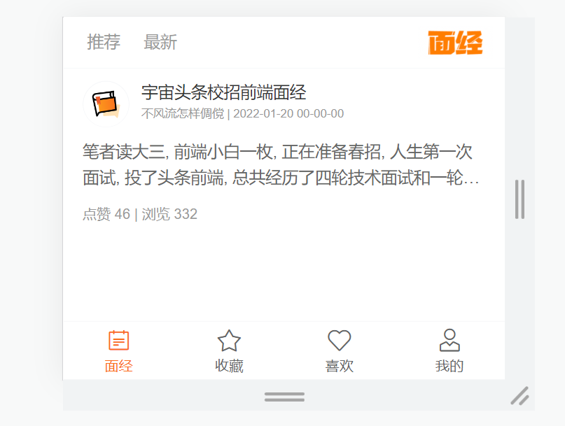

注册组件：

- van-cell
- van-list

```jsx
import Vue from 'vue'
import {
  Cell,
  List
} from 'vant'
Vue.use(Cell)
Vue.use(List)
```

静态结构 `article.vue`：

```jsx
<template>
  <div class="article-page">
          <!-- 导航部分 -->
    <nav class="my-nav van-hairline--bottom">
      <a
        href="javascript:;"
        >推荐</a
      >
      <a
        href="javascript:;"
        >最新</a
      >
      <div class="logo"></div>
    </nav>
 
     <!-- 文章区域 -->
    <van-cell class="article-item" >
      <template #title>
        <div class="head">
          
          <div class="con">
            <p class="title van-ellipsis">宇宙头条校招前端面经</p>
            <p class="other">不风流怎样倜傥 | 2022-01-20 00-00-00</p>
          </div>
        </div>
      </template>
      <template #label>
        <div class="body van-multi-ellipsis--l2">
          笔者读大三, 前端小白一枚, 正在准备春招, 人生第一次面试, 投了头条前端, 总共经历了四轮技术面试和一轮hr面, 不多说, 直接上题&nbsp;一面
        </div>
        <div class="foot">点赞 46 | 浏览 332</div>
      </template>
    </van-cell>
  </div>
</template>

<script>
export default {
  name: 'article-page',
  data () {
    return {

    }
  },
  methods: {

  }
}
</script>

<style lang="less" scoped>
.article-page {
  margin-bottom: 50px;
  margin-top: 44px;
  .my-nav {
    height: 44px;
    position: fixed;
    left: 0;
    top: 0;
    width: 100%;
    z-index: 999;
    background: #fff;
    display: flex;
    align-items: center;
    > a {
      color: #999;
      font-size: 14px;
      line-height: 44px;
      margin-left: 20px;
      position: relative;
      transition: all 0.3s;
      &::after {
        content: '';
        position: absolute;
        left: 50%;
        transform: translateX(-50%);
        bottom: 0;
        width: 0;
        height: 2px;
        background: #222;
        transition: all 0.3s;
      }
      &.active {
        color: #222;
        &::after {
          width: 14px;
        }
      }
    }
    .logo {
      flex: 1;
      display: flex;
      justify-content: flex-end;
      > img {
        width: 64px;
        height: 28px;
        display: block;
        margin-right: 10px;
      }
    }
  }
}
.article-item {
  .head {
    display: flex;
    img {
      width: 40px;
      height: 40px;
      border-radius: 50%;
      overflow: hidden;
    }
    .con {
      flex: 1;
      overflow: hidden;
      padding-left: 10px;
      p {
        margin: 0;
        line-height: 1.5;
        &.title {
          width: 280px;
        }
        &.other {
          font-size: 10px;
          color: #999;
        }
      }
    }
  }
  .body {
    font-size: 14px;
    color: #666;
    line-height: 1.6;
    margin-top: 10px;
  }
  .foot {
    font-size: 12px;
    color: #999;
    margin-top: 10px;
  }
}
</style>
```


### 封装 ArticleItem 组件

新建 `components/article-item.vue` 组件

```jsx
<template>
  <van-cell class="article-item">
    <template #title>
      <div class="head">
        
        <div class="con">
          <p class="title van-ellipsis">宇宙头条校招前端面经</p>
          <p class="other">不风流怎样倜傥 | 2022-01-20 00-00-00</p>
        </div>
      </div>
    </template>
    <template #label>
      <div class="body van-multi-ellipsis--l2">
        笔者读大三, 前端小白一枚, 正在准备春招, 人生第一次面试, 投了头条前端,
        总共经历了四轮技术面试和一轮hr面, 不多说, 直接上题&nbsp;一面
      </div>
      <div class="foot">点赞 46 | 浏览 332</div>
    </template>
  </van-cell>
</template>

<script>
export default {
  name: 'ArticleItem'
}
</script>

<style lang="less" scoped>
.article-item {
  .head {
    display: flex;
    img {
      width: 40px;
      height: 40px;
      border-radius: 50%;
      overflow: hidden;
    }
    .con {
      flex: 1;
      overflow: hidden;
      padding-left: 10px;
      p {
        margin: 0;
        line-height: 1.5;
        &.title {
          width: 280px;
        }
        &.other {
          font-size: 10px;
          color: #999;
        }
      }
    }
  }
  .body {
    font-size: 14px;
    color: #666;
    line-height: 1.6;
    margin-top: 10px;
  }
  .foot {
    font-size: 12px;
    color: #999;
    margin-top: 10px;
  }
}
</style>

```

注册成全局组件使用 `main.js`

```jsx
// 全局注册的组件，可以在任意的实例范围内使用，一次注册全局使用

import ArticleItem from '@/components/article-item.vue'
Vue.component('ArticleItem', ArticleItem)
```

`Article.vue`页面中

```vue
<template>
  <div class="article-page">
    ...

    <article-item></article-item>
  </div>
</template>
```


### 封装 api 接口

接口：https://www.apifox.cn/apidoc/project-934563/api-20384521

新建 `api/article.js` 提供接口函数

```jsx
import request from '@/utils/request'
//封装接口，获取文章列表
export const getArticles = (obj) => {
  return request.get('/interview/query', {
    params: {
      current: obj.current,   //当前页
      sorter: obj.sorter,     //排序字段 => 推荐传"weight_desc"获取推荐， "不传"获取最新
      pageSize: 10  //每页条数
    }
  })
}
```

页面中调用测试

```jsx
import { getArticles } from '@/api/article'
export default {
  name: 'article-page',
  data () {
    return {

    }
  },
  async created () {
    const res = await getArticles({
      current: 1,
      sorter: 'weight_desc'
    })
    console.log(res)
  },
  methods: {

  }
}
```


**发现 401 错误,  通过 headers 携带 token**


注意：这个token，需要拼上前缀 `Bearer ` token标识前缀

```jsx
// 封装接口，获取文章列表
export const getArticles = (obj) => {
  const token = getToken()

  return request.get('/interview/query', {
    params: {
      current: obj.current, // 当前页
      pageSize: 10, // 每页条数
      sorter: obj.sorter // 排序字段 =>  传"weight_desc" 获取 推荐， "不传" 获取 最新
    },
    headers: {
      // 注意 Bearer 和 后面的空格不能删除，为后台的token辨识
      Authorization: `Bearer ${token}`
    }
  })
}

//下面请求拦截器统一携带token
```


**导入导出的语法复习**

```jsx
<!--
   -------------------------------------------------------------
    按需导出 (适合导出多个值)
      export const login = ()=> {...}
      export const fn1 = () => {...}
      export const fn2 = () => {...}
      export const num = 20
      sxport const obj = {...}
 
    按需导入
      import { fn1, fn2 } from './xxx'

   --------------------------------------------------------------
    默认导出 (适合导出一个值)
      export default  值
  
    默认导入
      import result from './xxx'

    -------------------------------------------------------------

结论：默认导出默认导入，按需导出按需导入
技巧：如果一个模块，只导出一个值，大概率是默认导出
     如果一个模块，导出多个值，一定是按需导出
-->
```


### 请求拦截器-携带 token

`utils/request.js`

每次自己携带token太麻烦，通过请求拦截器统一携带token更方便


```jsx
import { getToken } from './storage'

// 添加请求拦截器
request.interceptors.request.use(function (config) {
  // 在发送请求之前做些什么
  const token = getToken()
  if (token) {
    config.headers.Authorization = `Bearer ${token}`
  }
  return config
}, function (error) {
  // 对请求错误做些什么
  return Promise.reject(error)
})
```


### 响应拦截器-处理token过期


`utils/request.js`

```jsx
// 添加响应拦截器
request.interceptors.response.use(function (response) {
  // 对响应数据做点什么
  return response.data
}, function (error) {
  if (error.response) {
    // 有错误响应, 提示错误提示
    if (error.response.status === 401) {
      delToken()
      router.push('/login')
    } else {
      Toast(error.response.data.message)
    }
  }
  // 对响应错误做点什么
  return Promise.reject(error)
})
```


### 动态渲染列表


`article.vue`

存储数据

```jsx
data () {
  return {
    list: [],
    current: 1,
    sorter: 'weight_desc'
  }
},
async created () {
  const { data } = await getArticles({
    current: this.current,
    sorter: this.sorter
  })
  this.list = data.rows
},
```

v-for循环展示

```jsx
<template>
  <div class="article-page">
    ...

    <article-item v-for="(item,i) in list" :key="i" :item="item"></article-item>
  </div>
</template>
```

子组件接收渲染

```jsx
<template>
  <van-cell class="article-item" @click="$router.push(`/detail/${item.id}`)">
    <template #title>
      <div class="head">
        
        <div class="con">
          <p class="title van-ellipsis">{{ item.stem }}</p>
          <p class="other">{{ item.creator }} | {{ item.createdAt }}</p>
        </div>
      </div>
    </template>
    <template #label>
      <div class="body van-multi-ellipsis--l2">{{ clearHtmlTag(item.content) }}</div>
      <div class="foot">点赞 {{ item.likeCount }} | 浏览 {{ item.views }}</div>
    </template>
  </van-cell>
</template>

<script>
export default {
  name: 'article-item',
  props: {
    item: {
      type: Object,
      default: () => ({})
    }
  },
  methods: {
    clearHtmlTag (str) {
      return str.replace(/<[^>]+>/g, '')
    }
  }
}
</script>

<style lang="less" scoped>
.article-item {
  .head {
    display: flex;
    img {
      width: 40px;
      height: 40px;
      border-radius: 50%;
      overflow: hidden;
    }
    .con {
      flex: 1;
      overflow: hidden;
      padding-left: 10px;
      p {
        margin: 0;
        line-height: 1.5;
        &.title {
          width: 280px;
        }
        &.other {
          font-size: 10px;
          color: #999;
        }
      }
    }
  }
  .body {
    font-size: 14px;
    color: #666;
    line-height: 1.6;
    margin-top: 10px;
  }
  .foot {
    font-size: 12px;
    color: #999;
    margin-top: 10px;
  }
}
</style>
```


### 分页加载更多

https://vant-contrib.gitee.io/vant/v2/#/zh-CN/list

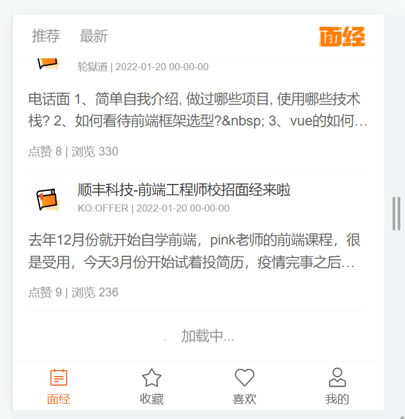


```jsx
<!--需求：分页加载，触底时再加载更多
       -loading: 是否在加载中，
                 true在加载中，此时不会重复触发加载，false不在加载中，可以加载更多数据
       -finished:是否加载已完成
                 true数据已经加载完成，此时不会再次触发加载
                 false数据还没加载完成，此时表示还有数据可以加载

    1. List 组件通过 loading 和 finished 两个变量控制加载状态，
    2.当组件滚动到底部时 或 进入页面数据没有撑满整个屏幕，会触发 load 事件并将 loading 设置成 true。
      此时可以发起异步操作并更新数据，数据更新完毕后，将 loading 设置成 false 即可。
    3.若数据已全部加载完毕，则直接将 finished 设置成 true 即可。
 -->

<van-list
  v-model="loading"
  :finished="finished"
  finished-text="没有更多了"
  @load="onLoad"
>
  <article-item v-for="(item,i) in list" :key="i" :item="item"></article-item>
</van-list>

data () {
  return {
    list: [],
    current: 1,
    sorter: 'weight_desc',  // 推荐=> weight_desc   最新=> null
    loading: false,
    finished: false
  }
},
    
methods: {
  async onLoad () {
    const { data } = await getArticles({
      current: this.current,
      sorter: this.sorter
    })
    this.list = data.rows
  }
}
```

加载完成，重置 loading,  累加数据，处理 finished

```jsx
async onLoad () {
  const { data } = await getArticles({
    current: this.current,
    sorter: this.sorter
  })
 
      // 需要累加数据
      this.list.push(...data.rows)

      // 注意：加载完成数据后，需要将loading状态改成false，表示加载已完成
      this.loading = false
      // 让当前页 + 1 ， 下一次加载下一页的数据
      this.current++

   // 如果下一页的页码，已经大于最大页码数，说明数据已经加载完成了
  if (this.current > data.pageTotal) {
    this.finished = true
  }
}
```


### 修改筛选条件

`article.vue`

```jsx
<a
  @click="changeSorter('weight_desc')"
  :class="{ active: sorter === 'weight_desc' }"       //控制高亮
  href="javascript:;"
  >推荐</a
>

<!-- 对于axios， 传递的属性值是null 或者 undefined， 此参数将被忽略 -->
<a
  @click="changeSorter(null)"
  :class="{ active: sorter === null }"
  href="javascript:;"
  >最新</a
>
```

提供methods

```jsx
changeSorter (value) {
  this.sorter = value

  // 重置所有条件
  this.current = 1 // 排序条件变化，重新从第一页开始加载
  this.list = []
  this.finished = false // finished重置，重新有数据可以加载了
  // this.loading = false

  // 手动加载更多
  // 手动调用了加载更多，也需要手动将loading改成true，表示正在加载中（避免重复触发）
  this.loading = true
  this.onLoad()
}
```


## 我的收藏

出于项目的完整性，这里会快速实现收藏，喜欢，详情~

提供api方法

- page： 表示当前页
- optType：2 表示获取我的收藏数据

`api/article.js`

```jsx
// 获取我的收藏
export const getArticlesCollect = (obj) => {
  return request.get('/interview/opt/list', {
    params: {
      page: obj.page, // 当前页
      pageSize: 10, // 可选
      optType: 2 // 表示收藏
    }
  })
}
```

`collect.vue`准备结构

```jsx
<template>
  <div class="collect-page">
    <van-nav-bar fixed title="我的收藏" />
    <van-list
      v-model="loading"
      :finished="finished"
      finished-text="没有更多了"
      @load="onLoad"
    >
      <article-item v-for="(item, i) in list" :key="i" :item="item" />
    </van-list>
  </div>
</template>

<script>
import { getArticlesCollect } from '@/api/article'
export default {
  name: 'collect-page',
  data () {
    return {
      list: [],
      loading: false,
      finished: false,
      page: 1
    }
  },
  methods: {
    async onLoad () {
      // 异步更新数据
      const { data } = await getArticlesCollect({ page: this.page })
      this.list.push(...data.rows)
      this.loading = false
      if (this.page === data.pageTotal || !data.rows.length) {
        this.finished = true
      } else {
        this.page++
      }
    }
  }
}
</script>

<style lang="less" scoped>
.collect-page {
  margin-bottom: 50px;
  margin-top: 44px;
}
</style>
```


## 我的喜欢

准备api函数

- page： 表示当前页
- optType：1 表示获取我的喜欢数据

`api/article.js`

```jsx
// 获取我的喜欢
export const getArticlesLike = (obj) => {
  return request.get('/interview/opt/list', {
    params: {
      page: obj.page, // 当前页
      pageSize: 10, // 可选
      optType: 1 // 表示喜欢
    }
  })
}
```

`like.vue`请求渲染

```jsx
<template>
  <div class="like-page">
    <van-nav-bar fixed title="我的点赞" />
    <van-list
      v-model="loading"
      :finished="finished"
      finished-text="没有更多了"
      @load="onLoad"
    >
      <article-item v-for="(item,i) in list" :key="i" :item="item" />
    </van-list>
  </div>
</template>

<script>
import { getArticlesLike } from '@/api/article'
export default {
  name: 'like-page',
  data () {
    return {
      list: [],
      loading: false,
      finished: false,
      page: 1
    }
  },
  methods: {
    async onLoad () {
      // 异步更新数据
      // setTimeout 仅做示例，真实场景中一般为 ajax 请求
      const { data } = await getArticlesLike({ page: this.page })
      this.list.push(...data.rows)
      this.loading = false
      if (this.page === data.pageTotal || !data.rows.length) {
        this.finished = true
      } else {
        this.page++
      }
    }
  }
}
</script>

<style lang="less" scoped>
.like-page {
  margin-bottom: 50px;
  margin-top: 44px;
}
</style>
```


## 面经详情

**核心知识点：跳转路由传参**

准备动态路由

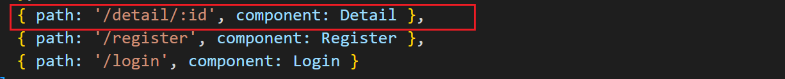

页面中获取参数

```jsx
this.$route.params.id
```

点击跳转 `article.vue`

```jsx
<template>
  <!-- 文章区域 -->
  <van-cell class="article-item" @click="$router.push(`/detail/${item.id}`)">
    <template #title>
      ...
    </template>
    <template #label>
      ...
    </template>
  </van-cell>
</template>
```

其他准备代码：

`api/article.js`

```jsx
// 获取文章详情
export const getArticleDetail = (id) => {
  return request.get('interview/show', {
    params: {
      id
    }
  })
}

// 对某个文章喜欢
export const updateLike = (id) => {
  return request.post('interview/opt', {
    id,
    optType: 1 // 喜欢
  })
}

// 对某个文章收藏
export const updateCollect = (id) => {
  return request.post('interview/opt', {
    id,
    optType: 2 // 收藏
  })
}
```

`detail.vue`

```jsx
<template>
  <div class="detail-page">
    <van-nav-bar
      left-text="返回"
      @click-left="$router.back()"
      fixed
      title="面经详细"
    />
    <header class="header">
      <h1>{{ article.stem }}</h1>
      <p>
        {{ article.createdAt }} | {{ article.views }} 浏览量 |
        {{ article.likeCount }} 点赞数
      </p>
      <p>
        
        <span>{{ article.creator }}</span>
      </p>
    </header>
    <main class="body" v-html="article.content"></main>
    <div class="opt">
      <van-icon @click="toggleLike" :class="{active:article.likeFlag}" name="like-o"/>
      <van-icon @click="toggleCollect" :class="{active:article.collectFlag}" name="star-o"/>
    </div>
  </div>
</template>

<script>
import { getArticleDetail, updateCollect, updateLike } from '@/api/article';

export default {
  name: 'detail-page',
  data() {
    return {
      article: {}
    };
  },
  async created() {
    this.article = {}
    const { data } = await getArticleDetail(this.$route.params.id)
    this.article = data;
  },
  methods: {
    async toggleLike () {
      await updateLike(this.article.id)
      this.article.likeFlag = !this.article.likeFlag
      if ( this.article.likeFlag ) {
        this.article.likeCount ++
        this.$toast.success('点赞成功')
      } else {
        this.article.likeCount --
        this.$toast.success('取消点赞')
      }
    },
    async toggleCollect () {
      await updateCollect(this.article.id)
      this.article.collectFlag = !this.article.collectFlag
      if ( this.article.collectFlag ) {
        this.$toast.success('收藏成功')
      } else {
        this.$toast.success('取消收藏')
      }
    }
  }
};
</script>

<style lang="less" scoped>
.detail-page {
  margin-top: 44px;
  overflow: hidden;
  padding: 0 15px;
  .header {
    h1 {
      font-size: 24px;
    }
    p {
      color: #999;
      font-size: 12px;
      display: flex;
      align-items: center;
    }
    img {
      width: 40px;
      height: 40px;
      border-radius: 50%;
      overflow: hidden;
    }
  }
  .opt {
    position: fixed;
    bottom: 100px;
    right: 0;
    > .van-icon {
      margin-right: 20px;
      background: #fff;
      width: 40px;
      height: 40px;
      line-height: 40px;
      text-align: center;
      border-radius: 50%;
      box-shadow: 2px 2px 10px #ccc;
      font-size: 18px;
      &.active {
        background: #FEC635;
        color: #fff;
      }
    }
  }
}
</style>
```


## 我的（个人中心）

**准备代码：**

1 注册组件

```jsx
import {
  Grid,
  GridItem,
  CellGroup
} from 'vant'

Vue.use(Grid)
Vue.use(GridItem)
Vue.use(CellGroup)
```

2 准备api

`api/user.js`

```jsx
// 获取用户信息
export const getUserInfo = () => {
  return request('/user/currentUser')
}
```

3 页面调用渲染

```jsx
<template>
  <div class="user-page">
    <div class="user">
      
      <h3>{{ username }}</h3>
    </div>
    <van-grid clickable :column-num="3" :border="false">
      <van-grid-item icon="clock-o" text="历史记录" to="/" />
      <van-grid-item icon="bookmark-o" text="我的收藏" to="/collect" />
      <van-grid-item icon="thumb-circle-o" text="我的点赞" to="/like" />
    </van-grid>

    <van-cell-group class="mt20">
      <van-cell title="推荐分享" is-link />
      <van-cell title="意见反馈" is-link />
      <van-cell title="关于我们" is-link />
      <van-cell @click="logout" title="退出登录" is-link />
    </van-cell-group>
  </div>
</template>

<script>
import { getUserInfo } from '@/api/user'
import { delToken } from '@/utils/storage'
export default {
  name: 'user-page',
  data () {
    return {
      username: '',
      avatar: ''
    }
  },
  async created () {
    const { data } = await getUserInfo()
    this.username = data.username
    this.avatar = data.avatar
  },
  methods: {
    logout () {                        //退出登录
      delToken()
      this.$router.push('/login')
      this.$toast.success('退出成功！')
    }
  }
}
</script>

<style lang="less" scoped>
.user-page {
  padding: 0 10px;
  background: #f5f5f5;
  height: 100vh;
  .mt20 {
    margin-top: 20px;
  }
  .user {
    display: flex;
    padding: 20px 0;
    align-items: center;
    img {
      width: 80px;
      height: 80px;
      border-radius: 50%;
      overflow: hidden;
    }
    h3 {
      margin: 0;
      padding-left: 20px;
      font-size: 18px;
    }
  }
}
</style>
```


# 打包发布

vue脚手架只是开发过程中，协助开发的工具，当真正开发完了 => 脚手架不参与上线

参与上线的是 => 打包后的源代码

打包：

- 将多个文件压缩合并成一个文件
- 语法降级
- less sass ts 语法解析, 解析成css
- ....

打包后，可以生成，浏览器能够直接运行的网页 => 就是需要上线的源码！

## 打包命令

vue脚手架工具已经提供了打包命令，直接使用即可。

```bash
yarn build
```

在项目的根目录会自动创建一个文件夹`dist`,dist中的文件就是打包后的文件，只需要放到服务器中即可。

默认直接打包的项目代码，必须直接丢在 服务器根目录 运行

所有资源（js css img）的访问都是基于根路径，以绝对路径访问   publicPath:'/'

如果想要在 任意目录 都能直接运行，甚至希望能直接双击运行

需要将 publicPath 配置成相对路径,重新打包


## 配置publicPath

`vue.config.js`

```js
module.exports = {
  // 设置获取.js,.css文件时，是以相对地址为基准的。
  // https://cli.vuejs.org/zh/config/#publicpath
  publicPath: './'
}
```


需不需要一次性，再进页面的时候，就把整个项目用到的所有组件都加载

合适方案：无论组件多少，按需加载，用到哪个组件加载哪个组件


## 路由懒加载 & 异步组件

路由懒加载 & 异步组件  =>  不会一上来就将所有的组件都加载，而是访问到对应的路由了，才加载解析这个路由对应的所有组件

官网链接：https://router.vuejs.org/zh/guide/advanced/lazy-loading.html#%E4%BD%BF%E7%94%A8-webpack

> 当打包构建应用时，JavaScript 包会变得非常大，影响页面加载。如果我们能把不同路由对应的组件分割成不同的代码块，然后当路由被访问的时候才加载对应组件，这样就更加高效了。

```js
// 异步组件的写法，配合路由使用，该组件不会直接加载，会在路由解析时才加载
const Detail = () => import('@/views/detail')
const Register = () => import('@/views/register')
const Login = () => import('@/views/login')
const Article = () => import('@/views/article')
const Collect = () => import('@/views/collect')
const Like = () => import('@/views/like')
const User = () => import('@/views/user')
```


PS： 如果想要手机上看到效果，可以将打包后的代码，上传到 gitee，利用 git pages 进行展示

