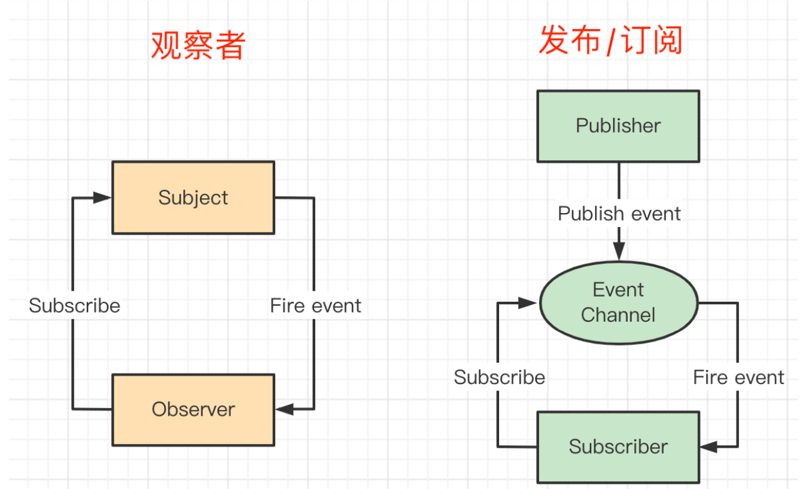
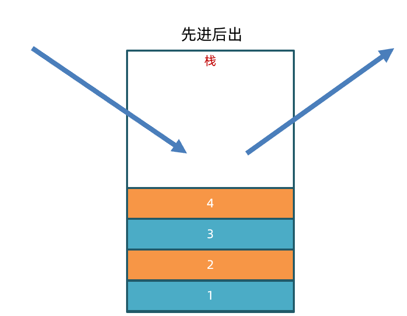
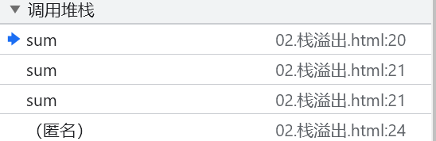

# JS原理课

### 知识点自测

> 今天课程中涉及到的已学习知识点

1. 函数的`call`方法-[文档链接](https://developer.mozilla.org/zh-CN/docs/Web/JavaScript/Reference/Global_Objects/Function/call)

```javascript
// 以指定的this调用函数，并通过 从第二个参数开始依次传递参数
function func(food,drink){
  console.log(this)
  console.log(food)
  console.log(drink)
}
const obj = {
  name:'小黑'
}
func.call(obj,'西蓝花','咖啡')
```

2. 函数的`apply`方法-[文档链接](https://developer.mozilla.org/zh-CN/docs/Web/JavaScript/Reference/Global_Objects/Function/apply)

```javascript
// 以指定的this调用函数，并通过 数组的形式 传递参数
function func(food,drink){
  console.log(this)
  console.log(food)
  console.log(drink)
}
const obj = {
  name:'小黑'
}
func.apply(obj,['西蓝花','咖啡'])
```

3. 函数的`bind`方法-[文档链接](https://developer.mozilla.org/zh-CN/docs/Web/JavaScript/Reference/Global_Objects/Function/bind)

```javascript
function func(food, drink) {
  console.log(this)
  console.log(food)
  console.log(drink)
}
const obj = {
  name: '小黑'
}
const bindFunc = func.bind(obj, '花菜')
bindFunc('可乐')
```

4. 剩余参数-[文档链接](https://developer.mozilla.org/zh-CN/docs/Web/JavaScript/Guide/Functions#%E5%89%A9%E4%BD%99%E5%8F%82%E6%95%B0)

```javascript
function func(...args){
  console.log(args)// 以数组的形式获取传入的所有参数
}
func('西蓝花','西葫芦','西洋参','西芹')
```

5. Promise核心用法-[文档链接](https://developer.mozilla.org/zh-CN/docs/Web/JavaScript/Guide/Using_promises)

```javascript
const p = new Promise((resolve, reject) => {
  setTimeout(() => {
    const num = parseInt(Math.random() * 10)
    if (num > 5) {
      resolve(`成功啦--${num}`)
    } else {
      reject(`失败啦--${num}`)
    }
  }, 1000)
})
p.then(res => {
  console.log(res)
}, err => {
  console.log(err)
})
```

6. URLSearchParams核心用法-[文档链接](https://developer.mozilla.org/zh-CN/docs/Web/API/URLSearchParams)

```javascript
// 实例化时支持传入JS对象
const params = new URLSearchParams({ name: 'jack', age: 18 })
// toString方法 返回搜索参数组成的字符串，可直接使用在 URL 上。
console.log(params.toString())
```

7. Object.create核心用法-[文档链接](https://developer.mozilla.org/zh-CN/docs/Web/JavaScript/Reference/Global_Objects/Object/create)

```javascript
  const person = {
    name: 'itheima',
    foods: ['西蓝花', '西红柿', '西葫芦']
  }
  // 将传入的对象作为原型，创建一个新对象（浅拷贝）
  const clone = Object.create(person)
  clone.name = 'itheima'
  clone.foods.push('西北风')
  console.log(clone.foods === person.foods)// true
```

7. Object.assign核心用法-[文档链接](https://developer.mozilla.org/zh-CN/docs/Web/JavaScript/Reference/Global_Objects/Object/assign)

```javascript
  const person = {
    name: 'itheima',
    foods: ['西蓝花', '西红柿', '西葫芦']
  }
  const son = {
    name: 'rose',
  }
  // 参数1 目标对象
  // 参数2 源对象
  // 将源对象的自身属性复制到目标对象，并返回目标对象
  const returnTarget = Object.assign(son, person)

  console.log(returnTarget === son)// true
  console.log(son.name)// itheima
  console.log(son.foods === person.foods)// true
```


## JS中的this

> 这一节咱们来学习JS中this相关的知识点
>
> [传送门：MDN-this](https://developer.mozilla.org/zh-CN/docs/Web/JavaScript/Reference/Operators/this)
>
> [传送门：MDN-call](https://developer.mozilla.org/zh-CN/docs/Web/JavaScript/Reference/Global_Objects/Function/call)
>
> [传送门：MDN-apply](https://developer.mozilla.org/zh-CN/docs/Web/JavaScript/Reference/Global_Objects/Function/apply)
>
> [传送门：MDN-bind](https://developer.mozilla.org/zh-CN/docs/Web/JavaScript/Reference/Global_Objects/Function/bind)
>
> [传送门：MDN-箭头函数](https://developer.mozilla.org/zh-CN/docs/Web/JavaScript/Reference/Functions/Arrow_functions)
>
> [传送门：MDN-剩余参数](https://developer.mozilla.org/zh-CN/docs/Web/JavaScript/Reference/Functions/rest_parameters)
>
> [传送门：MDN-Symbol](https://developer.mozilla.org/zh-CN/docs/Web/JavaScript/Reference/Global_Objects/Symbol)

这一节咱们会学习的有：

1. 如何确认`this`指向
2. 如何改变`this`指向
3. 手写`call`，`apply`，`bind`


### 如何确认this指向：

在绝大多数情况下，函数的调用方式决定了 `this` 的值（运行时绑定）

**谁调用就是谁，直接调用就是window**

```javascript
// 案例1
function func() {
  console.log(this) // ?
}
func()

// 案例2
const person = {
  name: 'jack',
  sayHi: function () {
    console.log(this)// ?
    function inner() {
      console.log(this)// ?
    }
    inner()
  },
  sayHello(){
    console.log(this)// ?
    setTimeout(function(){
        console.log(this)// ?
    })
  }
}
person.sayHi()
person.sayHello()
```

#### 小结：

如何确认this指向

1. 在绝大多数情况下，`this`的指向由什么决定?


### 如何改变this指向

主要有2类改变函数内部`this`指向的方法：

1. 调用函数并传入具体的`this`:
   1. `call`:
      1. 参数1:`this`
      2. 参数2-n:传递给函数的参数

   2. `apply`-数组作为参数
      1. 参数1:`this`
      2. 参数2:以数组的形式,传递给函数的参数

2. 创建绑定`this`的函数:
   1. bind:返回一个绑定了`this`的新函数
   2. 箭头函数:最近的this是谁,就是谁


**调用函数并传入具体的this：**

```javascript
function funcA(p1, p2) {
  console.log('funcA-调用')
  console.log(this)
  console.log('p1:', p1)
  console.log('p2:', p2)
}
const obj = {
  name: 'jack'
}
// call参数
// 参数1 this值
// 参数2-参数n 挨个传入函数的参数
funcA.call(obj, 1, 2)
// apply参数
// 参数1 this值
// 参数2 以数组的形式传入函数的参数
funcA.apply(obj, [3, 4])
```


**创建绑定this的函数：**

```javascript
function funcB(p1, p2) {
  console.log('funcB-调用')
  console.log(this)
  console.log('p1:', p1)
  console.log('p2:', p2)
}
const person = {
  name: 'itheima'
}
// bind参数
// 参数1 this值
// 参数2-参数n 绑定的参数
const bindFuncB = funcB.bind(person, 123)
bindFuncB(666)

const student = {
  name: 'lilei',
  sayHi: function () {
    console.log(this)
    // 箭头会从自己作用域链的上一层继承this
    const inner = () => {
      console.log('inner-调用了')
      console.log(this)
    }
    inner()
  }
}
student.sayHi()
```


#### 小结:

如何改变this指向

1. 如何在调用函数并传入具体的`this`？
   1. call:
   2. apply:数组作为参数

2. 如何创建绑定`this`的函数?
   1. bind
   2. 箭头函数


### 手写call方法

这一节咱们来实现`myCall`方法，实际用法和`call`方法一致，核心步骤有4步

```javascript
//  实现myCall 可以实现如下的调用效果
const obj2 = {
  name: '我是小小黑'
}
function func2(drink, food) {
  console.log(`我叫${this.name},我喜欢喝${drink},我爱吃${food}`)
}
// 参数1：this
// 参数2-参数n：参数列表
func2.myCall(obj2, '咖啡', '西兰花炒蛋')

```

1. 如何定义`myCall`?
2. 如何让函数内部的`this`为某个对象？
3. 如何让`myCall`接收参数2-参数n?
4. 使用[Symbol](https://developer.mozilla.org/zh-CN/docs/Web/JavaScript/Reference/Global_Objects/Symbol)调优`myCall`？

```javascript
// 1. 如何定义`myCall`
Function.prototype.myCall = function () {
  // 逻辑略
}

// 2 如何让函数内部的`this`为某个对象
Function.prototype.myCall = function (thisArg) {
  // this 是调用myCall的 函数
  // thisArg 指定的this
  // 为他添加一个自定义属性，让函数成为他的该属性
  thisArg['fn'] = this
  // 调用并获取结果
  const res = thisArg['fn']()
  // 移除添加的自定义属性
  delete thisArg['fn']
  // 返回调用结果
  return res
}


// 3 如何让`myCall`接收参数2-参数n
Function.prototype.myCall = function (thisArg, ...args) {
  thisArg['fn'] = this
  // 调用并获取结果
  const res = thisArg['fn'](...args)
  // 移除添加的自定义属性
  delete thisArg['fn']
  // 返回调用结果
  return res
}

// 4 使用`Symbol`调优`myCall`
Function.prototype.myCall = function (thisArg, ...args) {
  // 使用Symbol生成唯一标记，避免和原属性冲突
  const fn = Symbol()
  thisArg[fn] = this
  const res = thisArg[fn](...args)
  // 移除添加的自定义属性
  delete thisArg[fn]
  // 返回调用结果
  return res
}


// 测试代码
const obj2 = {
  name: '我是小小黑'
}
function func2(drink, food) {
  console.log(`我叫${this.name},我喜欢喝${drink},我爱吃${food}`)
}
func2.myCall(obj2, '咖啡', '西兰花炒蛋')
```


#### 小结：

手写call方法

1. 如何定义`myCall`?
2. 如何让函数内部的`this`为某个对象？
3. 如何让`myCall`接收参数2-参数n?
4. 使用`Symbol`调优`myCall`？

```javascript
Function.prototype.myCall = function (thisArg, ...args) {
  const fn = Symbol()
  thisArg[fn] = this
  const res = thisArg[fn](...args)
  delete thisArg[fn]
  return res
}
```


### 手写apply方法

这一节咱们来实现`myApply`方法，实际用法和`apply`方法一致，核心步骤依旧`4`步

```javascript
//  实现myApply 可以实现如下的调用效果
const obj2 = {
  name: '我是小小黑'
}
function func2(drink, food) {
  console.log(`我叫${this.name},我喜欢喝${drink},我爱吃${food}`)
}
// 参数1：this
// 参数2：数组形式传入的参数列表
func2.myApply(obj2, ['咖啡', '西兰花炒蛋'])

```

1. 如何定义`myApply`? 函数Function的原型上
2. 如何让函数内部的`this`为某个对象？给对象动态增加方法,方法为原函数,通过对象调用即可
3. 如何让`myApply`接收数组形式的参数列表?定义参数2,接收数组即可
4. 使用[Symbol](https://developer.mozilla.org/zh-CN/docs/Web/JavaScript/Reference/Global_Objects/Symbol)调优`myApply`？和原对象的属性重名

```javascript
// 1. 如何定义`myApply`
Function.prototype.myApply = function () {
  // 逻辑略
}

// 2 如何让函数内部的`this`为某个对象
Function.prototype.myApply = function (thisArg) {
  // 为他添加一个自定义属性，让函数成为他的该属性
  thisArg['fn'] = this
  // 调用并获取结果
  const res = thisArg['fn']()
  // 移除添加的自定义属性
  delete thisArg['fn']
  // 返回调用结果
  return res
}


// 3 如何让`myApply`接收参数2-参数n
Function.prototype.myApply = function (thisArg, args) {
  thisArg['fn'] = this
  // 调用并获取结果
  // 用... 将args展开传入
  const res = thisArg['fn'](...args)
  // 移除添加的自定义属性
  delete thisArg['fn']
  // 返回调用结果
  return res
}

// 4 使用`Symbol`调优`myApply`
Function.prototype.myApply = function (thisArg, args) {
  // 使用Symbol生成唯一标记，避免和原属性冲突
  const fn = Symbol()
  thisArg[fn] = this
  const res = thisArg[fn](...args)
  // 移除添加的自定义属性
  delete thisArg[fn]
  // 返回调用结果
  return res
}


// 测试代码
const obj2 = {
  name: '我是小小黑'
}
function func2(drink, food) {
  console.log(`我叫${this.name},我喜欢喝${drink},我爱吃${food}`)
}
func2.myApply(obj2, ['咖啡', '西兰花炒蛋'])
```

#### 小结:

手写apply方法

1. 如何定义`myApply`? 函数的原型上
2. 如何让函数内部的`this`为某个对象？ 动态给对象添加方法,通过对象的方式调用方法
3. 如何让`myApply`接收数组形式的参数列表? 形参: args,调用时,...args
4. 使用[Symbol](https://developer.mozilla.org/zh-CN/docs/Web/JavaScript/Reference/Global_Objects/Symbol)调优`myApply`？避免和默认属性重名

```javascript
Function.prototype.myApply = function (thisArg, args) {
  const fn = Symbol()
  thisArg[fn] = this
  const res = thisArg[fn](...args)
  delete thisArg[fn]
  return res
}
```


### 手写bind方法

这一节咱们来实现`myBind`方法，实际用法和`bind`方法一致，核心步骤为2步

```javascript
const obj = {
  name: '我是小小黑'
}
function func(drink, food) {
  console.log(`我叫${this.name},我喜欢喝${drink},我爱吃${food}`)
}
// 调用bind获取绑定this的新函数，参数1为可乐
const bindFunc = func.bind(obj, '可乐')
// 调用函数，只需要传递参数2即可
bindFunc('西蓝花炒蛋')
```

1. 如何返回一个绑定了`this`的函数？
2. 如何实现绑定的参数，及传入的参数合并?

```javascript
// 1 如何返回一个绑定了`this`的函数
Function.prototype.myBind = function (thisArg) {
  // myBind函数调用时，this就是函数本身 
  return () => {
    // 通过call方法将传入的 thisArg 作为this进行调用
    this.call(thisArg)
  }
}

// 2 如何实现绑定的参数，及传入的参数合并
// ...args 接收绑定参数
Function.prototype.myBind = function (thisArg, ...args) {
  // ...args2 接收调用时的参数
  return (...args2) => {
    // thisArg 需要指定的this
    // args 调用myBind时传入的参数
    // args2 调用新函数时传入的参数
    this.call(thisArg, ...args, ...args2)
  }
}

const obj = {
  name: '我是小小黑'
}
function func(drink, food) {
  console.log(`我叫${this.name},我喜欢喝${drink},我爱吃${food}`)
}
// 调用bind获取绑定this的新函数，参数1为可乐
const bindFunc = func.bind(obj, '可乐')
// 调用函数，只需要传递参数2即可
bindFunc('西蓝花炒蛋')
```

#### 小结

手写bind方法

1. 如何返回一个绑定了`this`的函数？
2. 如何实现绑定的参数，及传入的参数合并?

```javascript
Function.prototype.myBind = function (thisArg, ...args) {
  return (...args2) => {
    this.call(thisArg, ...args, ...args2)
  }
}
```

## JS继承-ES5

> 这一节咱们来学习如何在JS中实现**继承**，首先看看在ES6之前可以如何实现继承
>
> [传送门:继承与原型链](https://developer.mozilla.org/zh-CN/docs/Web/JavaScript/Inheritance_and_the_prototype_chain)
>
> [传送门:继承（计算机科学）](https://zh.wikipedia.org/wiki/%E7%BB%A7%E6%89%BF_(%E8%AE%A1%E7%AE%97%E6%9C%BA%E7%A7%91%E5%AD%A6))
>
> [传送门:JavaScript高级程序设计](https://www.ituring.com.cn/book/2472)
>
> [传送门:MDN-Object.create](https://developer.mozilla.org/zh-CN/docs/Web/JavaScript/Reference/Global_Objects/Object/create)
>
> [传送门:MDN-Object.assign](https://developer.mozilla.org/zh-CN/docs/Web/JavaScript/Reference/Global_Objects/Object/assign)

**继承：**继承可以使子类具有父类的各种属性和方法，而不需要再次编写相同的代码

这一节咱们会学习ES5中常见的继承写法(命令来源于 **《JavaScript高级程序设计》**)

1. 原型链实现继承
2. 构造函数继承
3. 组合继承
4. 原型式继承
5. 寄生式继承
6. 寄生组合式继承

```javascript
// 父类
function Parent(){
  this.name = name
  this.foods = ['西蓝花', '西红柿']
  this.sayFoods = function () {
    console.log(this.foods)
  }
}
```


### ES5-原型链实现继承

**核心步骤：**希望继承谁，就将谁作为原型

**缺点：**父类中的引用数据类型，会被所有子类共享

```javascript
// 父类
function Parent(name) {
  this.name = name
  this.foods = ['西蓝花', '西红柿']
  this.sayFoods = function () {
    console.log(this.foods)
  }
}
// 子类
function Son() {
}
// 将父类的实例 作为子类的原型
Son.prototype = new Parent('jack')
const s1 = new Son()
s1.sayFoods()// ['西蓝花', '西红柿']

const s2 = new Son()
s2.sayFoods() // ['西蓝花', '西红柿']

s2.foods.push('西葫芦')

s2.sayFoods()// ['西蓝花', '西红柿', '西葫芦']
s1.sayFoods()// ['西蓝花', '西红柿', '西葫芦']
```

#### 小结：

ES5-原型链实现继承

1. 原型链实现继承的核心步骤？
2. 这种继承方法的缺点是？


### ES5-构造函数继承

**核心步骤：**在子类的构造函数中通过`call`或`apply`父类的构造函数

**缺点：**子类没法使用父类原型上的属性/方法

```javascript
// 父类
function Parent(name) {
  this.name = name
}
Parent.prototype.sayHi = function () {
  console.log('你好,我叫:', this.name)
}

// 子类
function Son(name) {
  Parent.call(this, name)
}

const s1 = new Son('lucy')
const s2 = new Son('rose')
s1.sayHi() // 报错
```

#### 小结：

ES5-构造函数继承

1. 构造函数继承的核心步骤是？
2. 这种继承方法的缺点是？


### ES5-组合继承

通过组合继承,结合上面2种方法的优点

**核心步骤：**

1. 通过原型链继承公共的属性和方法
2. 通过构造函数继承实例独有的属性和方法

**特点：**调用了2次构造函数

```javascript
// 父类
function Person(name) {
  this.name = name
}
// 公共的属性和方法加父类原型上
Person.prototype.sayHi = function () {
  console.log(`你好，我叫${this.name}`)
}
// 子类构造函数
function Student(name, age) {
  // 调用父类构造函数传入this
  Person.call(this, name)
  // 子类独有的属性和方法单独设置
  this.age = age
}
// 设置子类的原型为 父类实例
Student.prototype = new Person()
// 调用子类的构造函数
const s = new Student('李雷', 18)
// 可以使用原型链上的 属性和方法 也可以使用 通过构造函数获取的父类的属性和方法
```

#### 小结：

ES5-组合继承

1. 组合继承的核心步骤：
2. 组合继承的特点：


### ES5-原型式继承

直接基于对象实现继承

**核心步骤:**对某个对象进行浅拷贝(工厂函数或[Object.create](https://developer.mozilla.org/zh-CN/docs/Web/JavaScript/Reference/Global_Objects/Object/create)),实现继承

**缺点:**父类中的引用数据类型，会被所有子类共享

```javascript
// 可以用 Object.create替代
function objectFactory(obj) {
  function Fun() { }
  Fun.prototype = obj
  return new Fun()
}
const parent = {
  name: 'parent',
  age: 25,
  friend: ['rose', 'ice', 'robot'],
  sayHi() {
    console.log(this.name, this.age)
  }
}
const son1 = objectFactory(parent)
const son2 = objectFactory(parent)
son1.friend.push('lucy')
console.log(son2.friend)
```

#### 小结:

ES5-原型式继承

1. 原型式继承的核心步骤是?
2. 原型式继承的缺点是?


### ES5-寄生式继承

**核心步骤:**

定义工厂函数,并在内部:

1. 对传入的对象进行浅拷贝(公共属性/方法)
2. 为浅拷贝对象增加属性/方法(独有属性/方法)

```javascript
function createAnother(origin) {
  // Object.create基于原型创建新对象，对属性进行浅拷贝
  const clone = Object.create(origin)
  // 为对象增加属性/方法
  clone.sayHi = function () {
    console.log('你好')
  }
  return clone
}
const parent = {
  name: 'parent',
  foods: ['西蓝花', '炒蛋', '花菜']
}
const son1 = createAnother(parent)
const son2 = createAnother(parent)
```

#### 小结:

寄生式继承

1. 寄生式继承的核心步骤是?
   1. 基于对象,创建新对象

   2. 增加新的**属性和方法**

2. 寄生式继承和上一节学习的原型式继承的区别是?
   1. 创建出来的新对象,会额外的增加新的**属性/方法**


### ES5-寄生组合式继承

**核心步骤:**

1. 通过构造函数来继承属性
2. 通过原型链来继承方法

```javascript
// 继承原型函数
function inheritPrototype(son, parent){
    const prototype = object.create(parent.prototype)
    prototype.constructor = son
    son.prototype = prototype
}

// 父类
function Parent(name) {
  this.name = name
  this.foods = ['西蓝花', '西葫芦', '西红柿']
}

Parent.prototype.sayHi = function () {
  console.log(this.name, `我喜欢吃,${this.foods}`)
}

// 子类借用父类的构造函数
function Son(name, age) {
  Parent.call(this, name)
  this.age = age
}
// 完成原型继承
inheritPrototype(Son,Parent)
// 可以继续在原型上添加属性/方法
Son.prototype.sayAge = function () {
  console.log('我的年龄是', this.age)
}

const son1 = new Son('jack', 18)
const son2 = new Son('rose', 16)
```

#### 小结:

ES5-寄生组合式继承

1. 寄生组合式继承的核心步骤是:
   1. 通过构造函数继承:
   2. 通过原型链来继承:
2. 寄生组合式继承和组合式继承的区别是:


## JS继承-ES6

> 这一节咱们来学习在ES6中class关键字的使用,并且使用它来实现继承
>
> [传送门:mdn类](https://developer.mozilla.org/zh-CN/docs/Web/JavaScript/Reference/Statements/class)
>
> [传送门:阮一峰ES6-class](https://wangdoc.com/es6/class)
>
> [传送门:mdn-super](https://developer.mozilla.org/zh-CN/docs/Web/JavaScript/Reference/Operators/super)

ES6中推出了`class`类,是用来创建对象的模板.`class`可以看作是一个语法糖,它的绝大部分功能，ES5 都可以做到，新的`class`写法只是让对象原型的写法更加清晰、更像面向对象编程的语法而已。

这一节咱们会学习:

1. class核心语法
2. class实现继承
3. class语法补充

### class核心语法

**核心语法:**

1. 如何定义及使用[类](https://developer.mozilla.org/zh-CN/docs/Web/JavaScript/Reference/Classes#%E7%B1%BB%E5%A3%B0%E6%98%8E):
2. 如何定义实例属性/方法:

```javascript
// 定义类
class Person {
  // 实例属性，方便一眼确认有哪些
  name
  food
  // 构造方法，类似于构造函数，new的时候会调用，内部的this就是实例化的对象
  constructor(name, food) {
    this.name = name
    this.food = food
  }

  // 实例方法
  sayHi() {
    console.log(`你好，我叫${this.name},我喜欢吃${this.food}`)
  }
}
const p = new Person('小黑', '西蓝花')
p.sayHi()
```

#### 小结:

class核心语法:

1. 针对如下代码,实例属性,构造函数,实例方法,分别是?

```javascript
class Person{
    name
    food='西兰花炒蛋'
    constructor(name){
        this.name=name
    }
	sayHi(){
        console.log('你好,我叫:',this.name)
    }
}

```


### class实现继承

**关键语法:**

1. **子类**通过[extends](https://developer.mozilla.org/zh-CN/docs/Web/JavaScript/Reference/Classes/extends)继承**父类**
2. 子类构造函数中通过[super](https://developer.mozilla.org/zh-CN/docs/Web/JavaScript/Reference/Operators/super)调用父类构造函数

```javascript
// 在上一份代码的基础上继续编写下面代码
class Student extends Person {
  song
  constructor(name, food, song) {
    // 子类构造函数使用this以前必须调用super
    super(name, food)
    this.song = song
  }
  // 添加方法
  sing() {
    console.log(`我叫${this.name},我喜欢唱${this.song}`)
  }
}
const s = new Student('李雷', '花菜', '孤勇者')
s.sayHi()
s.sing()
```

#### 小结:

class实现继承

1. 子类继承父类的使用的关键字是?
2. 子类构造函数中必须先调用什么方法?


### class私有,静态属性和方法

**补充语法:**

1. [私有](https://developer.mozilla.org/zh-CN/docs/Web/JavaScript/Reference/Classes/Private_class_fields)属性/方法的定义及使用(内部调用)
2. [静态](https://developer.mozilla.org/zh-CN/docs/Web/JavaScript/Reference/Classes/static)属性/方法的定义及使用(类直接访问)

```javascript
class Person {
  constructor(name) {
    this.name = name
  }
  // 通过#作为前缀添加的属性会变为私有
  // 私有属性
  #secret = '我有一个小秘密，就不告诉你'
  // 私有方法
  #say() {
    // 私有属性可以在
    console.log('私有的say方法')
  }
  info() {
    // 在类的内部可以访问私有属性调用私有方法
    console.log(this.#secret)
    this.#say()
  }

  // 通过 static定义静态属性/方法
  static staticMethod() {
    console.log('这是一个静态方法')
    console.log(this)
  }
  static info = '直立行走，双手双脚'
}

const p = new Person('jack')
console.log(p)
// 外部无法访问 点语法访问直接报错，通过[]无法动态获取
console.log(p['#secret'])
p.info()
// 通过类访问静态属性/方法
Person.staticMethod()
console.log(Person.info)
```

#### 小结:

class语法补充

1. class中私有属性/方法**定义和使用时**使用的关键字是?
2. class中静态属性/方法定义和使用是使用的关键字是?

## fetch

> 这一节咱们来学习内置函数`fetch`
>
> [传送门-fetch](https://developer.mozilla.org/zh-CN/docs/Web/API/fetch)
>
> [传送门-Response](https://developer.mozilla.org/zh-CN/docs/Web/API/Response)
>
> [传送门-Headers](https://developer.mozilla.org/zh-CN/docs/Web/API/Headers)

全局的`fetch`函数用来发起获取资源请求.他返回一个`promise`,这个`promise`会在请求响应后被`resolve`,并传回Response对象

这一节咱们会学习的有:

1. `fetch`核心语法

2. `fetch`结合`URLSearchParams`发送get请求:

   1. ```javascript
      const obj = {
          name:'jack',
          age:18
      }
      name=jack&age=17
      ```

3. `fetch`发送post请求,提交`JSON`数据

4. `fetch`发送post请求,提交`FormData`数据

### fetch核心语法

**核心语法:**

1. 如何[发请求](https://developer.mozilla.org/zh-CN/docs/Web/API/fetch):
2. 如何处理[响应](https://developer.mozilla.org/zh-CN/docs/Web/API/Response):
3. 注:[测试用接口](https://apifox.com/apidoc/project-1937884/api-49760223)

```javascript
fetch(资源地址,{...配置项对象})
.then(response=>{
    // 接收请求
})
```


#### 小结:

fetch核心语法

1. `fetch`函数的参数:
   1. 参数1:
   2. 参数2:
2. `fetch`获取到响应结果,需要如何解析:

```javascript
fetch(参数1,参数2)
.then(response=>{
    // 接收请求
})
```


### fetch结合URLSearchParams发送get请求:

**需求:**

1. 使用`fetch`结合`URLSearchParams`调用地区查询[接口](https://apifox.com/apidoc/project-1937884/api-49760217)

```javascript
;(async function () {
  const params = new URLSearchParams({
    pname: '广东省',
    cname: '广州市'
  })
  const url = `http://hmajax.itheima.net/api/area?${params.toString()}`
  // fetch函数返回的是 Promise对象，通过await等待获取response对象
  const res = await fetch(url)
  // .json方法返回的是Promise对象 继续通过await等待
  const data = await res.json()
})()
```

#### 小结:

fetch结合URLSearchParams发送get请求:

1. `fetch`发送get请求时,是否需要设置请求方法?
2. `URLSearchParams`的作用是?


### post请求-提交JSON

**需求:**

1. `fetch`发送post请求,提交`JSON`数据
2. [测试接口-用户注册](https://apifox.com/apidoc/project-1937884/api-49760218)

**核心步骤:**

1. 根据文档设置请求头
2. 通过配置项设置,请求方法,请求头,请求体

```javascript
    ; (async function () {
      // 通过headers设置请求头
      const headers = new Headers()
      // 通过 content-type指定请求体数据格式
      headers.append('content-type', 'application/json')
      // 参数1 url
      // 参数2 请求配置
      const res = await fetch('http://hmajax.itheima.net/api/register', {
        method: 'post',// 请求方法
        headers, // 请求头
        // 请求体
        body: JSON.stringify({ username: 'itheima9876', password: '123456' })
      })
      const json = await res.json()
      console.log(json)
    })()
```

#### 小结:

post请求-提交JSON

1. `fetch`函数的第二个参数可以设置请求头,请求方法,请求体

### post请求-提交FormData

**需求:**

1. `fetch`发送post请求,提交`FormData`数据(上传+回显)
2. [测试接口-上传图片](https://apifox.com/apidoc/project-1937884/api-49760221)

**核心步骤:**

1. 通过`FormData`添加文件
2. 通过配置项设置,请求方法,请求体(`FormData`不需要设置请求头)

```javascript
  <input type="file" class="file" accept="image/*">
  <script>
    document.querySelector('.file').addEventListener('change', async function (e) {
      // 生成FormData对象并添加数据
      const data = new FormData()
      data.append('img', this.files[0])
      const res = await fetch('http://hmajax.itheima.net/api/uploadimg', {
        method: 'post',
        body: data
      })
      const json = await res.json()
      console.log(json)
    })
  </script>
```

#### 小结:

post请求-提交FormData

1. `fetch`提交`FormData`时是否需要额外设置请求头?
2. `FormData`添加键值对使用哪个方法?


## Generator

> 这一节咱们来学习`generator`
>
> [传送门-Generator](https://developer.mozilla.org/zh-CN/docs/Web/JavaScript/Reference/Global_Objects/Generator)

`Generator`对象由[生成器函数](https://developer.mozilla.org/zh-CN/docs/Web/JavaScript/Reference/Statements/function*)返回并且它符合[可迭代协议](https://developer.mozilla.org/zh-CN/docs/Web/JavaScript/Reference/Iteration_protocols#可迭代协议)和[迭代器协议](https://developer.mozilla.org/zh-CN/docs/Web/JavaScript/Reference/Iteration_protocols#迭代器协议).他可以用来控制流程,语法行为和之前学习的函数不一样

### Generator-核心语法

**核心语法:**

1. 如何定义生成器函数:
2. 如何获取`generator`对象
3. `yield`表达式的使用
4. 通过`for of`获取每一个`yield`的值

```javascript
// 1. 通过function* 创建生成器函数 
function* foo() {
  // 遇到yield表达式时会暂停后续的操作
  yield 'a'
  yield 'b'
  yield 'c'
  return 'd'
}
// 2. 调用函数获取生成器
const f = foo()
// 3. 通过next方法获取yield 之后的表达式结果，会被包装到一个对象中
// 执行一次next 即可获取一次 yield之后的表达式结果
const res1 = f.next()
console.log(res1)// {value: 'a', done: false}
const res2 = f.next()
console.log(res2)// {value: 'b', done: false}
const res3 = f.next()
console.log(res3)// {value: 'c', done: false}
// 最后一次可以拿到return的结果
const res4 = f.next()
console.log(res4)// {value: 'd', done: true} 
// done 为true之后，获取到的value为undefined
const res5 = f.next()
console.log(res5)// {value: undefined, done: true} 


// 4. 通过for of 获取每一个yield之后的值，
const f2 = foo()
for (const iterator of f2) {
  console.log(iterator)
}
```

#### 小结:

Generator-核心语法

1. 如何生成`Generator`对象?
2. 如何获取`yield`表达式之后的结果?

### Generator-id生成器

**需求:**使用`Generator`实现一个id生成器id

```javascript
function* idGenerator() {
    // 逻辑略
}
const idMaker = idGenerator()

// 调用next方法,获取id(每次累加1)
const { value: id1 } = idMaker.next()
console.log(id1)
const { value: id2 } = idMaker.next()
console.log(id2)
```

**核心步骤:**

1. 定义生成器函数
2. 内部使用循环,通过`yield`返回`id`并累加

```javascript
// 1. 通过function* 创建生成器函数 
function* generator() {
  let id = 0
  // 无限循环
  while (true) {
    // id累加并返回
    yield id++
  }
}
// 2. 调用函数获取生成器
const idMaker = generator()
// 3. 需要id的时候 通过next获取即可
const { value: id1 } = idMaker.next()
console.log(id1)
const { value: id2 } = idMaker.next()
console.log(id2)
```

#### 小结:

1. 生成器函数内部的代码什么时候执行?

   

### Generator-流程控制

遇到`yield`表达式时会**暂停**后续的操作

**需求:**使用`Generator`实现流程控制

```javascript
function* weatherGenerator() {
	// 逻辑略
    yield axios()
}
// 获取Generator实例
const weather = weatherGenerator()
// 依次获取 北上广深的天气 (axios)
weather.next()
```

**核心步骤:**

1. `yield`后面跟上天气查询逻辑
2. [接口文档-天气预报](https://apifox.com/apidoc/project-1937884/api-49760220)
3. 参考`code`:北京 110100  上海 310100  广州 440100 深圳 440300

```html
  <button class="getWeather">天气查询</button>
  <script src="https://cdn.bootcdn.net/ajax/libs/axios/1.3.6/axios.js"></script>
  <script>
    /**
     * 需求：流程控制，依次查询，北上广深的天气预报
     * 参考code: 北京 110100  上海 310100  广州 440100 深圳 440300
     * 接口文档: https://apifox.com/apidoc/project-1937884/api-49760220
     * */
    function* weatherGenerator() {
      // 北京
      yield axios('http://hmajax.itheima.net/api/weather?city=110100')
      // 上海
      yield axios('http://hmajax.itheima.net/api/weather?city=310100')
      // 广州
      yield axios('http://hmajax.itheima.net/api/weather?city=440100')
      // 深圳
      yield axios('http://hmajax.itheima.net/api/weather?city=440300')
    }

    const cityWeather = weatherGenerator()
    document.querySelector('.getWeather').addEventListener('click', async () => {
      const res = await genCity.next()
      console.log(res)
    })
  </script>
```

#### 小结:

1. 使用`Generator`控制流程的本质是利用哪个**关键字**来分隔逻辑?

## 函数柯里化

> 这一节咱们来学习函数柯里化,在计算机科学中，柯里化（英语：Currying），又译为卡瑞化或加里化，是把接受多个参数的函数变换成接受一个单一参数（最初函数的第一个参数）的函数，并且返回接受余下的参数而且返回结果的新函数的技术。

这一节咱们会学习的有:

1. 什么是函数柯里化
2. 经典面试题
3. 柯里化实际应用

 柯里化 作为一种高阶技术, 可以提升函数的复用性和灵活性。

### 什么是函数柯里化

函数柯里化 (Currying) 是一种**将多个参数的函数转换为单个参数函数**的技术

转换完毕之后的函数:**只传递函数的一部分参数来调用，让他返回一个新的函数去处理剩下的参数。**

**例子:**

```javascript
// 调整函数 sum
function sum(num1, num2) {
  return num1 + num2
}

// 改写为 可以实现如下效果
console.log(sum(1)(2))// 
```

**核心步骤:**

1. `sum`改为接收一个参数，返回一个新函数
2. 新函数内部将**参数1**，**参数2**累加并返回

```javascript
function sum(num1) {
  return function (num2) {
    return num1 + num2
  }
}
```

### 柯里化面试题-全局变量

柯里化在面试的时候一般以笔试题出现,比如

**需求:**

```javascript
function sum(a, b, c, d, e) {
  return a + b + c + d + e
}
// 改写函数sum实现:参数传递到5个即可实现累加
// sum(1)(2)(3)(4)(5)
// sum(1)(2,3)(4)(5)
// sum(1)(2,3,4)(5)
// sum(1)(2,3)(4,5)
```

**核心步骤:**

1. 接收不定长参数
2. 存储已传递的参数
3. 判断长度
   1. 满足5:累加
   2. 不满足:继续返回**函数本身**

```javascript
let nums = []
function currySum(...args) {
  nums.push(...args)
  if (nums.length >= 5) {
    return nums.reduce((prev, curv) => prev + curv, 0)
  } else {
    return currySum
  }
}
```

### 柯里化面试题-使用闭包

**需求:**

1. 使用**闭包**将上一节代码中的全局变量,保护起来
2. 支持自定义累加的参数个数

```javascript
function sumMaker(length){
    // 逻辑略
}
// 支持5个累加
const sum5 = sumMaker(5)
// 支持7个累加
const sum7 = sumMaker(7)
sum7(1,2,3)(4,5,6,7)
```


**核心步骤:**

1. 定义外层函数:
   1. 定义参数`length`
   2. 将全局变量迁移到函数内
2. 定义内层函数:
   1. 参数长度判断,使用传入的参数`length`
   2. 直接复用上一节的逻辑,并返回

```javascript
function sumMaker(length) {
  let nums = []
  function inner(...args) {
    nums.push(...args)
    if (nums.length >= length) {
      return nums.reduce((prev, curv) => prev + curv, 0)
    } else {
      return inner
    }
  }
  return inner
}
```

### 柯里化实际应用-类型判断

通过**参数复用**,实现一个**类型判断生成器函数**

**需求:**

1. 将下列4个类型判断函数,改写为通过函数`typeOfTest`动态生成

```javascript
// 有如下4个函数
function isUndefined(thing) {
  return typeof thing === 'undefined'
}
function isNumber(thing) {
  return typeof thing === 'number'
}
function isString(thing) {
  return typeof thing === 'string'
}
function isFunction(thing) {
  return typeof thing === 'function'
}

// 改为通过 typeOfTest 生成:
const typeOfTest =function(){
   // 参数 和 逻辑略

}
const isUndefined = typeOfTest('undefined')
const isNumber = typeOfTest('number')
const isString = typeOfTest('string')
const isFunction = typeOfTest('function')

// 可以通过 isUndefined,isNumber,isString,isFunction 来判断类型:

isUndefined(undefined) // true
isNumber('123') // false
isString('memeda') // true
isFunction(() => { }) // true
```

**核心步骤:**

1. `typeOfTest`接收参数`type`用来接收判断的类型
2. 内部返回新函数,接收需要判断的值,并基于`type`进行判断
3. 使用箭头函数改写为最简形式~~[传送门](https://github.com/axios/axios/blob/v1.x/lib/utils.js#L20)

```javascript
const typeOfTest = (type) => {
  return (thing) => {
    return typeof thing === type
  }
}
```

### 柯里化实际应用-固定参数

依旧是一个**参数复用**的实际应用

**需求:**

1. 将如下3个请求的函数(都是**post**请求),变为通过`axiosPost`函数动态生成
2. 实现函数`axiosPost`

```javascript
// 将如下3个请求,改写为调用 axiosPost函数即可实现
axios({
  url: 'url1',
  method: 'post',
  data: {}
})
axios({
  url: 'url2',
  method: 'post',
  data: {}
})
axios({
  url: 'url3',
  method: 'post',
  data: {}
})

const axiosPost = () => {
    // 参数,逻辑略
}

axiosPost('url1', data1)
axiosPost('url2', data2)
axiosPost('url3', data3)
```

**核心步骤:**

1. 函数内部固定请求方法,post
2. 函数内部调用`axios`发请求即可
3. `axios`内部就是这样实现的[传送门:](https://github.com/axios/axios/blob/v1.x/dist/axios.js#L2667)

```javascript
const axiosPost = (url, data) => {
  return axios({
    url, data,
    method: 'post'
  })
}
```

#### 小结:

1. 函数柯里化是一种函数式编程思想:**将多个参数的函数转换为单个参数函数,调用时返回新的函数接收剩余参数**

2. 常见面试题

   ```javascript
   function sum(a, b, c, d, e) {
     return a + b + c + d + e
   }
   // 改写函数sum实现:参数传递到5个即可实现累加
   // sum(1)(2)(3)(4)(5)
   // sum(1)(2,3)(4)(5)
   // sum(1)(2,3,4)(5)
   // sum(1)(2,3)(4,5)
   ```

3. 常见应用:固定参数,比如`axios`中的:

   1. [类型判断函数](https://github.com/axios/axios/blob/v1.x/lib/utils.js#L20)
   2. [get,post,put等别名方法](https://github.com/axios/axios/blob/v1.x/dist/axios.js#L2667)


## 手写Promise

> 这一节咱们一起来手写Promise

这一节咱们会学习的有:

1. 实现Promise的核心用法
2. Promise的静态方法
3. 实现Promise的静态方法

首先明确Promise的核心用法

```javascript
const p = new Promise((resolve, reject) => {
    resolve('success')
    // 或者
    // reject('error')
})

// then方法的参数1: 状态为成功的回调函数
// then方法的参数2: 状态为失败的回调函数
p.then(res => {
  console.log(res)
}, err => {
  console.log(err)
})
```


### 手写Promise-构造函数

**需求:**

1. 实现MyPromise类，可以用如下的方式实例化
2. 实例化时传入回调函数
   1. 回调函数立刻执行
   2. 回调函数接收函数`resolve`和`reject`

```javascript
const p = new MyPromise((resolve, reject) => {
  // resolve() 
  // reject() 
})
```

**核心步骤:**

1. 定义类`MyPromise`
2. 实现构造函数，接收`executor`--传入的回调函数
3. 构造函数中定义`resolve`和`reject`并传入`executor`

```javascript
// 1. 定义类
class MyPromise {
  // 2. 构造函数 
  // executor 执行器，实例化时立刻调用
  constructor(executor) {
    // 3. 定义 resolve reject 传入executor
    const resolve = () => {
      console.log('resolve-call')
    }
    const reject = () => {
      console.log('reject-call')
    }
    executor(resolve, reject)
  }
}
```


### 手写Promise-状态、成功or失败原因

**需求:**

1. `MyPromise`增加`state`属性，只能是如下3个值
   1. `pending`:待定，默认状态
   2. `fulfilled`:已兑现，操作成功
   3. `rejected`:已拒绝，操作失败
2. `MyPromise`增加`result`属性，记录成功/失败原因
3. 调用`resolve`或`reject`,修改状态,并记录成功/失败原因

```javascript
const p = new MyPromise((resolve, reject) => {
  // resolve('成功结果')
  reject('失败原因')
})
console.log(p)
```

**核心步骤:**

1. 定义常量保存状态，避免**硬编码**
2. `MyPromise`中定义
   1. 属性:`state`保存状态，`result`成功/失败原因
   2. 修改`state`的私有方法，修改状态并记录`result`
   3. 注意:`state`只有在`pending`时，才可以修改，且不可逆

```javascript
// 1. 定义常量保存状态
const PENDING = 'pending'
const FULFILLED = 'fulfilled'
const REJECTED = 'rejected'
class MyPromise {
  // 2. 定义属性 state（状态） reason（成功/失败原因）
  state = PENDING
  result = undefined

  constructor(executor) {
    // 3. 实现 resolve和reject内部逻辑
    const resolve = (result) => {
      this.#changeState(FULFILLED, result)
    }
    const reject = (result) => {
      this.#changeState(REJECTED, result)
    }
    executor(resolve, reject)
  }

  // 4. 提取resolve和reject内部公共逻辑
  #changeState(state, result) {
    if (this.state !== PENDING) {
      return
    }
    this.state = state
    this.result = result
  }
}
```

### 手写Promise-then方法的核心功能

**需求:**

1. then方法的回调函数1: 状态变为`fulfilled`时触发，并获取成功结果
2. then方法的回调函数2: 状态变为`rejected`时触发，并获取失败原因
3. then方法的回调函数1或2没有传递的特殊情况处理，[参考:then方法的参数](https://developer.mozilla.org/zh-CN/docs/Web/JavaScript/Reference/Global_Objects/Promise/then#%E5%8F%82%E6%95%B0)

```javascript
const p = new MyPromise((resolve, reject) => {
  // resolve('成功结果')
  reject('失败原因')
})

p.then(res => {
  console.log('success:', res)
}, err => {
  console.log('error:', err)
})

```

**核心步骤:**

1. 增加`then`方法，根据不同的状态执行对应的回调函数，并传入`result`
   1. 参数1:成功的回调函数
   2. 参数2:失败的回调函数
2. 没有传递`onFulfilled`,`onRejected`时，设置默认值(参考文档)

```javascript
const PENDING = 'pending'
const FULFILLED = 'fulfilled'
const REJECTED = 'rejected'
class MyPromise {
  state = PENDING
  result = undefined

  constructor(executor) {
    const resolve = (result) => {
      this.#changeState(FULFILLED, result)
    }
    const reject = (result) => {
      this.#changeState(REJECTED, result)
    }
    executor(resolve, reject)
  }

  #changeState(state, result) {
    if (this.state !== PENDING) {
      return
    }
    this.state = state
    this.result = result
  }
  // 1. 增加then方法
  then(onFulfilled, onRejected) {
    // 2. 处理未传入回调函数的特殊情况
    onFulfilled = typeof onFulfilled === 'function' ? onFulfilled : value => value
    onRejected = typeof onRejected === 'function' ? onRejected : reason => {
      throw reason
    }
    if (this.state === FULFILLED) {
      onFulfilled(this.result)
    } else if (this.state === REJECTED) {
      onRejected(this.result)
    }
  }
}
```

### 手写Promise-then方法支持异步和多次调用（非链式）

**需求:**

1. 实例化传入的回调函数,内部支持异步操作
2. then方法支持多次调用

```javascript
const p = new MyPromise((resolve, reject) => {
  setTimeout(() => {
    // resolve('成功结果')
    reject('失败原因')
  }, 2000)
})

p.then(res => {
  console.log('success1:', res)
}, err => {
  console.log('error1:', err)
})
p.then(res => {
  console.log('success2:', res)
}, err => {
  console.log('error2:', err)
})
p.then(res => {
  console.log('success3:', res)
}, err => {
  console.log('error3:', err)
})
```

**核心步骤:**

1. 定义属性,保存传入的回调函数:[]
2. 调用`then`方法并且状态为`pending`时保存传入的成功/失败回调函数
3. 调用`resolve`和`reject`时执行上一步保存的回调函数

```javascript
const PENDING = 'pending'
const FULFILLED = 'fulfilled'
const REJECTED = 'rejected'
class MyPromise {
  state = PENDING
  result = undefined
  // 1. 添加handlers属性保存then方法添加的回调函数
  handlers = []

  constructor(executor) {
    const resolve = (result) => {
      this.#changeState(FULFILLED, result)
      // 4. 调用runHandlers 执行回调函数
      this.#runHandlers()
    }
    const reject = (result) => {
      this.#changeState(REJECTED, result)
      // 4. 调用runHandlers 执行回调函数
      this.#runHandlers()
    }
    executor(resolve, reject)
  }

  // 3. 抽取方法 执行 fulfilled/rejected状态时的回调函数
  #runHandlers() {
    while (this.handlers.length > 0) {
      const { onFulfilled, onRejected } = this.handlers.shift()
      if (this.state === FULFILLED) {
         onFulfilled(this.result)
      } else {
         onRejected(this.result)
      }
    }
  }


  #changeState(state, result) {
    if (this.state !== PENDING) {
      return
    }
    this.state = state
    this.result = result
  }
  then(onFulfilled, onRejected) {
    onFulfilled = typeof onFulfilled === 'function' ? onFulfilled : value => value
    onRejected = typeof onRejected === 'function' ? onRejected : reason => {throw reason}
    if (this.state === FULFILLED) {
      onFulfilled(this.result)
    } else if (this.state === REJECTED) {
      onRejected(this.result)
    } else {
      // 2. 状态为 pending 时,将回调函数添加到数组中
      this.handlers.push({
        onFulfilled, onRejected
      })
    }
  }
}
```

### 手写Promise-链式编程-成功状态+普通返回值

**需求:**

1. `then`的链式编程
2. 目前只考虑`resolve`内部返回普通值的情况

```javascript
const p = new MyPromise((resolve, reject) => {
  resolve(1)
})
p.then(res => {
  console.log(res)
  return 2
}).then(res => {
  console.log(res)
  return 3
}).then(res => {
  console.log(res)
  return 4
})
```

**核心步骤:**

1. 调整`then`方法，返回一个新的`MyPromise`对象
2. 内部获取`onFulfilled`的执行结果,传入`resolve`方法继续执行

```javascript
const PENDING = 'pending'
const FULFILLED = 'fulfilled'
const REJECTED = 'rejected'
class MyPromise {
  state = PENDING
  result = undefined
  handlers = []

  constructor(executor) {
    const resolve = (result) => {
      this.#changeState(FULFILLED, result)
      this.#runHandlers()
    }
    const reject = (result) => {
      this.#changeState(REJECTED, result)
      this.#runHandlers()
    }
    executor(resolve, reject)
  }

  #runHandlers() {
    while (this.handlers.length > 0) {
      const { onFulfilled, onRejected } = this.handlers.shift()
      if (this.state === FULFILLED) {
         onFulfilled(this.result)
      } else {
         onRejected(this.result)
      }
    }
  }


  #changeState(state, result) {
    if (this.state !== PENDING) {
      return
    }
    this.state = state
    this.result = result
  }
  then(onFulfilled, onRejected) {
    onFulfilled = typeof onFulfilled === 'function' ? onFulfilled : value => value
    onRejected = typeof onRejected === 'function' ? onRejected : reason => {throw reason}
    // 1. 创建并返回新的Promise对象
    const p2 = new MyPromise((resolve, reject) => {
      if (this.state === FULFILLED) {
        const res = onFulfilled(this.result)
        // 2. 继续调用resolve方法
        resolve(res)
      } else if (this.state === REJECTED) {
        onRejected(this.result)
      } else {
        this.handlers.push({
          onFulfilled, onRejected
        })
      }
    })
    return p2
  }
}
```

### 手写Promise-链式编程-成功状态+返回Promise

**需求:**

1. `then`的链式编程
2. 目前考虑`resolve`内部返回`MyPromise`的情况

```javascript
const p = new MyPromise((resolve, reject) => {
  resolve(1)
})
p.then(res => {
  console.log(res)
  return new MyPromise((resolve, reject) => {
    resolve(2)
  })
}).then(res => {
  console.log(res)
  return new MyPromise((resolve, reject) => {
    resolve(3)
  })
}).then(res => {
  console.log(res)
})
```

**核心步骤:**

1. 内部获取`onFulfilled`的执行结果:
2. 如果是`MyPromise`实例，继续`then`下去并传入`resolve`和`reject`

```javascript
const PENDING = 'pending'
const FULFILLED = 'fulfilled'
const REJECTED = 'rejected'
class MyPromise {
  state = PENDING
  result = undefined
  handlers = []

  constructor(executor) {
    const resolve = (result) => {
      this.#changeState(FULFILLED, result)
      this.#runHandlers()
    }
    const reject = (result) => {
      this.#changeState(REJECTED, result)
      this.#runHandlers()
    }
    executor(resolve, reject)
  }

  #runHandlers() {
    while (this.handlers.length > 0) {
      const { onFulfilled, onRejected } = this.handlers.shift()
      if (this.state === FULFILLED) {
         onFulfilled(this.result)
      } else {
         onRejected(this.result)
      }
    }
  }


  #changeState(state, result) {
    if (this.state !== PENDING) {
      return
    }
    this.state = state
    this.result = result
  }
  then(onFulfilled, onRejected) {
    onFulfilled = typeof onFulfilled === 'function' ? onFulfilled : value => value
    onRejected = typeof onRejected === 'function' ? onRejected : reason => {throw reason}
    const p2 = new MyPromise((resolve, reject) => {
      if (this.state === FULFILLED) {
        const res = onFulfilled(this.result)
        // 1. 判断是否为MyPromise的实例
        if (res instanceof MyPromise) {
          // 2. 继续调用then方法 传入 resolve 和 reject
          res.then(resolve, reject)
        } else {
          resolve(res)
        }
      } else if (this.state === REJECTED) {
        onRejected(this.result)
      } else {
        this.handlers.push({
          onFulfilled, onRejected
        })
      }
    })
    return p2
  }
}
```

### 手写Promise-链式编程-失败状态

**需求:**

1. `then`的第二个回调函数，执行`reject`时的链式编程

```javascript
const p = new MyPromise((resolve, reject) => {
  resolve(1)
})

p.then(res => {
  console.log(res)
  return new MyPromise((resolve, reject) => {
    reject(2)
  })
}).then(undefined, err => {
  console.log('err:', err)
})
```

**核心步骤:**

1. 参考`resolve`的逻辑
2. 先实现功能,再抽取为函数直接调用

```javascript
const PENDING = 'pending'
const FULFILLED = 'fulfilled'
const REJECTED = 'rejected'
class MyPromise {
  state = PENDING
  result = undefined
  handlers = []

  constructor(executor) {
    const resolve = (result) => {
      this.#changeState(FULFILLED, result)
      this.#runHandlers()
    }
    const reject = (result) => {
      this.#changeState(REJECTED, result)
      this.#runHandlers()
    }
    executor(resolve, reject)
  }

  #runHandlers() {
    while (this.handlers.length > 0) {
      const { onFulfilled, onRejected } = this.handlers.shift()
      if (this.state === FULFILLED) {
         onFulfilled(this.result)
      } else {
         onRejected(this.result)
      }
    }
  }


  #changeState(state, result) {
    if (this.state !== PENDING) {
      return
    }
    this.state = state
    this.result = result
  }
  then(onFulfilled, onRejected) {
    onFulfilled = typeof onFulfilled === 'function' ? onFulfilled : value => value
    onRejected = typeof onRejected === 'function' ? onRejected : reason => {
      throw reason;
    };
    const p2 = new MyPromise((resolve, reject) => {
      if (this.state === FULFILLED) {
        // const res = onFulfilled(this.result)
        // if (res instanceof MyPromise) {
        //   res.then(resolve, reject)
        // } else {
        //   resolve(res)
        // }
        this.#runPromise(onFulfilled, resolve, reject)
      } else if (this.state === REJECTED) {
        // 1. 参考成功状态的逻辑实现 失败状态
        // const res = onRejected(this.result)
        // if (res instanceof MyPromise) {
        //   res.then(resolve, reject)
        // } else {
        //   reject(res)
        // }
        this.#runPromise(onRejected, resolve, reject)
      } else {
        this.handlers.push({
          onFulfilled, onRejected
        })
      }
    })
    return p2
  }
  // 2. 抽取 then中的逻辑，并替换掉原本代码
  #runPromise(callback, resolve, reject) {
    const res = callback(this.result)
    if (res instanceof MyPromise) {
      res.then(resolve, reject)
    } else {
      this.state === FULFILLED ? resolve(res) : reject(res)
    }
  }
}
```

### 手写Promise-链式编程-支持异步

**需求:**

1. 执行异步操作时，支持链式编程

```javascript
const p = new MyPromise((resolve, reject) => {
  setTimeout(() => {
    resolve(1)
  }, 2000)
})

p.then(res => {
  console.log(res)
  return new MyPromise((resolve, reject) => {
    setTimeout(() => {
      reject(2)
    }, 2000)
  })
})
    
    .then(undefined, err => {
  console.log('err:', err)
})
```

**核心步骤:**

1. then的内部将`resolve`,`reject`也推送到数组中
2. 调整`runHandlers`函数，内部直接调用`runPromise`函数即可

```javascript
const PENDING = 'pending'
const FULFILLED = 'fulfilled'
const REJECTED = 'rejected'
class MyPromise {
  state = PENDING
  result = undefined
  handlers = []

  constructor(executor) {
    const resolve = (result) => {
      this.#changeState(FULFILLED, result)
      this.#runHandlers()
    }
    const reject = (result) => {
      this.#changeState(REJECTED, result)
      this.#runHandlers()
    }
    executor(resolve, reject)
  }

  #runHandlers() {
    while (this.handlers.length > 0) {
      // 2. 解构出resolve,reject执行和上一步一样的逻辑
      const { onFulfilled, onRejected, resolve, reject } = this.handlers.shift()
      if (this.state === FULFILLED) {
        this.#runPromise(onFulfilled, resolve, reject)
      } else {
        this.#runPromise(onRejected, resolve, reject)
      }
    }
  }


  #changeState(state, result) {
    if (this.state !== PENDING) {
      return
    }
    this.state = state
    this.result = result
  }
  then(onFulfilled, onRejected) {
    onFulfilled = typeof onFulfilled === 'function' ? onFulfilled : value => value
    onRejected = typeof onRejected === 'function' ? onRejected : reason => {
      throw reason;
    };
    const p2 = new MyPromise((resolve, reject) => {
      if (this.state === FULFILLED) {
        this.#runPromise(onFulfilled, resolve, reject)
      } else if (this.state === REJECTED) {
        this.#runPromise(onRejected, resolve, reject)
      } else {
        // 1. 将 resolve和reject也推送到数组中
        this.handlers.push({
          onFulfilled, onRejected, resolve, reject
        })
      }
    })
    return p2
  }
  #runPromise(callback, resolve, reject) {
    const res = callback(this.result)
    if (res instanceof MyPromise) {
      res.then(resolve, reject)
    } else {
      this.state === FULFILLED ? resolve(res) : reject(res)
    }
  }
}
```

### 手写Promise-使用微任务

**需求:**

1. 如下代码打印结果为`1,2,4,3`

```javascript
console.log(1)
const p = new MyPromise((resolve, reject) => {
  console.log(2)
  resolve(3)
})
p.then(res => {
  console.log(res)
})
console.log(4)
```

**核心步骤:**

1. 使用`queueMicrotask`包裹`runPromise`的内部逻辑即可
2. [传送门:MDN-queueMicrotask](https://developer.mozilla.org/zh-CN/docs/Web/API/queueMicrotask)
3. [传送门:MDN-queueMicrotask使用指南](https://developer.mozilla.org/zh-CN/docs/Web/API/HTML_DOM_API/Microtask_guide)

```javascript
  #runPromise(callback, resolve, reject) {
    // 1. 使用queueMicrotask 包裹内部逻辑即可
    queueMicrotask(() => {
      const res = callback(this.result)
      if (res instanceof MyPromise) {
        res.then(resolve, reject)
      } else {
        this.state === FULFILLED ? resolve(res) : reject(res)
      }
    })
  }
```

### 小结:

手写`Promise`的核心代码:

```javascript
// 保存状态的常量
    const PENDING = 'pending'
    const FULFILLED = 'fulfilled'
    const REJECTED = 'rejected'
    class MyPromise {
      // 状态
      state = PENDING
      // 成功、失败原因
      result = undefined
      // 待执行的回调函数
      handlers = []

      // 构造函数
      constructor(executor) {
        // 定义 resolve和reject
        const resolve = (result) => {
          this.#changeState(FULFILLED, result)
          this.#runHandlers()
        }
        const reject = (result) => {
          this.#changeState(REJECTED, result)
          this.#runHandlers()
        }
        // 接收传入的执行器，接收定义的resolve和reject
        executor(resolve, reject)
      }
      // 根据状态执行回调函数的 私有方法
      #runHandlers() {
        while (this.handlers.length > 0) {
          // 2. 解构出resolve,reject执行和上一步一样的逻辑
          const { onFulfilled, onRejected, resolve, reject } = this.handlers.shift()
          if (this.state === FULFILLED) {
            this.#runPromise(onFulfilled, resolve, reject)
          } else {
            this.#runPromise(onRejected, resolve, reject)
          }
        }
      }
      // 修改状态的 私有方法
      #changeState(state, result) {
        if (this.state !== PENDING) {
          return
        }
        this.state = state
        this.result = result
      }
      // then方法，接收成功和失败的回调函数
      then(onFulfilled, onRejected) {
        // onFulfilled 和 onRejected 的非空判断
        onFulfilled = typeof onFulfilled === 'function' ? onFulfilled : value => value
        onRejected = typeof onRejected === 'function' ? onRejected : reason => {
          throw reason;
        };
        // 保证链式编程，返回Promise
        const p2 = new MyPromise((resolve, reject) => {
          if (this.state === FULFILLED) {
            this.#runPromise(onFulfilled, resolve, reject)
          } else if (this.state === REJECTED) {
            this.#runPromise(onRejected, resolve, reject)
          } else {
            this.handlers.push({
              onFulfilled, onRejected, resolve, reject
            })
          }
        })
        return p2
      }
      // 满足执行条件，执行回调函数的 私有方法
      #runPromise(callback, resolve, reject) {
        // 使用微任务队列
        queueMicrotask(() => {
          const res = callback(this.result)
          if (res instanceof MyPromise) {
            res.then(resolve, reject)
          } else {
            this.state === FULFILLED ? resolve(res) : reject(res)
          }
        })
      }
    }
```

### 手写Promise-实例方法catch

**需求:**

1. 实现实例方法`catch`,可以实现如下调用

```javascript
const p = new MyPromise((resolve, reject) => {
  reject(1)
})
p.then(res => {
  console.log(res)
}).catch(err => {
  console.log('err:', err)
})
```

**核心步骤:**

1. 参考[文档](https://developer.mozilla.org/zh-CN/docs/Web/JavaScript/Reference/Global_Objects/Promise/catch),catch等同于:`then(undefined,onRjected)`
2. 直接添加`catch`方法，内部调用`then`
3. 使用`try-catch`包裹`runPromise`,出错时,调用`reject`

```javascript
// 添加catch方法，内部参考文档的方式调用then即可  
catch(onRjected) {
  return this.then(undefined, onRjected)
}

  // 处理回调函数执行结果
  #runPromise(callBack, resolve, reject) {
    queueMicrotask(() => {
      try {
        // 调用回调函数 获取执行的结果
        const res = callBack(this.result)
        if (res instanceof MyPromise) {
          // res是Promise对象 then方法
          res.then(resolve, reject)
        } else {
          // 如果是普通的值,直接resolve
          if (this.state === FULFILLED) {
            resolve(res)
          } else if (this.state === REJECTED) {
            reject(res)
          }
        }
      } catch (error) {
        return reject(error)
      }
    })
```

### 手写Promise-实例方法finally

**需求:**

1. 无论成功失败都会执行`finally`的回调函数
2. 回调函数不接受任何参数

```javascript
const p = new Promise((resolve, reject) => {
  reject('error')
})

p.then(res => {
  console.log(res)
}).catch(err => {
  console.log(err)
}).finally(() => {
  console.log('finally执行啦')
})
```

**核心步骤:**

1. 参考[文档](https://developer.mozilla.org/zh-CN/docs/Web/JavaScript/Reference/Global_Objects/Promise/finally):finally方法类似于调用`then(onFinally,onFinally)`,且不接受任何回调函数

```javascript
finally(onFinally) {
    return this.then(onFinally,onFinally)
}
```

### 手写Promise-静态方法resolve

**需求:**

1. 返回一个带有成功原因的`Promise`对象

```javascript
// 返回一个值为2的Promise对象
MyPromise.resolve(2).then(res => {
  console.log(res)
})
const p = new MyPromise((resolve, reject) => {
  setTimeout(() => {
    resolve('success')
  }, 1000)
})
// 直接返回传入的p
MyPromise.resolve(p).then(res => {
  console.log(res)
})
```

**核心步骤:**

1. 增加静态方法`resolve`，根据传入的值返回不同的结果即可

```javascript
  static resolve(value) {
    // 如果是Promise 返回Promise
    if (value instanceof MyPromise) {
      return value
    }
    // 如果都不是的话，直接返回一个新的Promise对象 将value传递给resolve
    return new MyPromise((resolve, reject) => {
      resolve(value)
    })
  }
```


### 手写Promise-静态方法reject

**需求:**

1. 返回一个带有拒绝原因的`Promise`对象

```javascript
MyPromise.reject('error').catch(err => {
  console.log(err)
})
```

**核心步骤:**

1. 添加静态方法内部返回有拒绝原因的`Promise`对象即可

```javascript
  static reject(err) {
    return new MyPromise((resolve, reject) => {
      reject(err)
    })
  }
```

### 手写Promise-静态方法race

**需求:**

1. 接收Promise数组
   1. 第一个Promise成功或失败时，返回一个该Promise对象及原因

```javascript
const promise1 = new MyPromise((resolve, reject) => {
  setTimeout(() => {
    resolve('one')
  }, 500)
})

const promise2 = new MyPromise((resolve, reject) => {
  setTimeout(() => {
    reject('two')
  }, 100)
})

MyPromise.race([promise1, promise2]).then((value) => {
  console.log('value:',value)
}, err => {
  console.log('err:', err)
})
```


**核心步骤:**

1. 内部返回新的Promise对象:
   1. 参数判断:
      1. 不是数组:报错
      2. 是数组:挨个解析
         1. 任意一个Promise对象成功或失败，直接resolve或reject即可

```javascript
  static race(promises) {
    return new MyPromise((resolve, reject) => {
      // 参数校验
      if (Array.isArray(promises)) {
        // 如果传入的promises是空数组，则返回的promise就将永远等待
        promises.forEach(item => {
          // 通过 Promise.resolve进行处理，只要有任何一个为 成功/拒绝 即可响应结果
          MyPromise.resolve(item).then(resolve, reject)
        })
      } else {
        // 参数错误
        return reject(new TypeError('Argument is not iterable'))
      }
    })
  }
```

### 手写Promise-静态方法all

**需求:**

1. 接收Promise数组，
   1. 所有Promise都成功时，返回一个成功的Promise对象及成功数组
   2. 任何一个Promise失败，返回一个失败的Promise对象及第一个失败原因

```javascript
const promise1 = MyPromise.resolve(3);
const promise2 = 42;
const promise3 = new MyPromise((resolve, reject) => {
  setTimeout(() => {
    reject('success')
  }, 1000);
});

MyPromise.all([promise1, promise2, promise3]).then((values) => {
  console.log(values);
});
```

**核心步骤:**

1. 包裹一个新的Promise并返回，内部进行参数校验

   1. 非数组:报错

   2. 数组:循环挨个解析

      1. 长度为0:直接返回成功状态的Promise

      2. 长度不为0:挨个解析:forEach

         1. 不是Promise对象:直接记录结果并判断是否解析完毕

         2. 是Promise对象:调用then

            1. 成功:记录结果并判断是否解析完毕
            2. 失败:直接reject

            

```javascript
 static all(promises) {
    return new MyPromise((resolve, reject) => {
      // 参数校验
      if (Array.isArray(promises)) {
        // 是数组再继续执行
        // 存储结果
        const result = []
        let count = 0
        // 如果长度为0 直接返回 fulfilled状态的Promise即可
        if (promises.length === 0) {
          return resolve(promises)
        }
        // 挨个处理
        promises.forEach((item, index) => {
          if (item instanceof MyPromise) {
            // 如果是Promise
            item.then(res => {
              count++
              // 这么做的目的是保证 结果的顺序 和 promise每一项的一致
              result[index] = res
              count === promises.length && resolve(result)
            }, err => {
              // 任何一个失败 无视其他的promise直接 reject即可
              reject(err)
            })
          } else {
            // 如果不是Promise 原样添加在数组中
            count++
            result[index] = item
            // 全部处理完毕时，响应结果
            count === promises.length && resolve(result)
          }
        })
      } else {
        // 
        // 错误提示
        return reject(new TypeError('Argument is not iterable'))
      }
    })
  }
```


### 手写Promise-静态方法allSettled

**需求:**

1. 传入Promise数组，当所有对象都已敲定时
2. 返回一个新的Promise对象及以数组形式保存的结果

```javascript
const promise1 = Promise.resolve('1');
const promise2 = new Promise((resolve, reject) => setTimeout(() => {
  reject('two')
}, 1000));
const promises = [promise1, promise2];

Promise.allSettled(promises).
  then((results) => { console.log(results) })
```


**核心步骤:**

1. 增加静态方法`allSettled`
2. 内部逻辑和`all`类似，需要特别注意的地方:
   1. 成功和失败的原因都会通过对象记录起来
   2. 返回一个记录了成功`{state:FULFILLED,value:'xxx'}`失败`{state:REJECTED,reason:'xxx'}`的结果数组

```javascript
   static allSettled(promises) {
        return new MyPromise((resolve, reject) => {
          // 参数校验
          if (Array.isArray(promises)) {
            let result = []// 结果数组
            let count = 0 // 计数器
            // 空数组直接返回
            if (promises.length === 0) return resolve(promises)

            // 挨个处理内部的Promise对象
            promises.forEach((item, index) => {
              // 使用resolve转为promise统一处理
              MyPromise.resolve(item).then(value => {
                // 成功状态
                count++
                result[index] = {
                  state: FULFILLED,
                  value
                }
                // 处理完毕之后 resolve
                count === promises.length && resolve(result)
              }, reason => {
                // 失败状态
                count++
                // 失败状态 值为 reason
                result[index] = {
                  state: REJECTED,
                  reason
                }
                // 成功和失败最终都对应到 resolve
                count === promises.length && resolve(result)
              })
            })
          } else {
            return reject(new TypeError('Argument is not iterable'))
          }
        })
      }
```

### 手写Promise-静态方法any

**需求:**-[传送门](https://developer.mozilla.org/zh-CN/docs/Web/JavaScript/Reference/Global_Objects/Promise/any)

1. 传入`Promise`数组，
   1. 任何一个`Promise`对象敲定时，返回一个新的`Promise`对象，及对应的结果
   2. 所有Promise都被拒绝时，返回一个包含所有拒绝原因的`AggregateError`错误数组

```javascript
    const promise1 = new MyPromise((resolve, reject) => {
      setTimeout(() => {
        reject('error1')
      }, 2000);
    });
    const promise2 = new MyPromise((resolve, reject) => {
      setTimeout(() => {
        reject('error2')
      }, 3000);
    });
    const promise3 = new MyPromise((resolve, reject) => {
      setTimeout(() => {
        // resolve('success1')
        reject('error3')
      }, 1000);
    });

    MyPromise.any([promise1, promise2, promise3]).then((values) => {
      console.log(values);
    }, err => {
      console.log('err:', err)
    })
```


**核心步骤:**

1. 类似于`all`核心区别
   1. 数组长度为0，直接返回错误数组
   2. 任何一个成功，直接成功
   3. 通过数组记录失败原因，都失败时响应错误

```javascript
  static any(promises) {
    return new MyPromise((resolve, reject) => {
      // 参数校验
      if (Array.isArray(promises)) {
        let errors = []
        let count = 0
        // AggregateError包含多个错误对象的 单个错误对象（错误对象容器）
        if (promises.length === 0) return reject(new AggregateError('All promises were rejected'))

        // 挨个处理
        promises.forEach(item => {
          item.then(value => {
            // 只要一个成功 就成功
            resolve(value)
          }, reason => {
            count++
            errors.push(reason)
            // 如果没有一个promise成功 就把所有的错误原因合并到一起 一起抛出
            count++ === promises.length && reject(new AggregateError(errors))

          })
        })
      } else {
        // 参数格式有误
        return reject(new TypeError('Argument is not iterable'))
      }
    })
  }
```

## JS设计模式

> 这一节咱们来学习JS中的设计模式
>
> [传送门:wiki-设计模式](https://zh.wikipedia.org/wiki/%E8%AE%BE%E8%AE%A1%E6%A8%A1%E5%BC%8F%EF%BC%9A%E5%8F%AF%E5%A4%8D%E7%94%A8%E9%9D%A2%E5%90%91%E5%AF%B9%E8%B1%A1%E8%BD%AF%E4%BB%B6%E7%9A%84%E5%9F%BA%E7%A1%80)
>
> [传送门:JavaScript设计模式与开发实践](https://www.ituring.com.cn/book/1632)

设计模式的指的是：在**面向对象软件**设计过程中针对特定问题的简洁而优雅的解决方案。通俗一点说，设计模式就是给面向对象软件开发中的一些好的设计取个名字。

目前说到设计模式，一般指的是《设计模式：可复用面向对象软件的基础》一书中提到的**23种**常见的软件开发设计模式。

JavaScript中不需要生搬硬套这些模式，咱们结合实际前端开发中的具体应用场景，来看看有哪些常用的设计模式

这一节咱们会学习:

1. JS中的常用设计模式
2. 设计模式在开发/框架中的应用场景

### 工厂模式

在JavaScript中，工厂模式的表现形式就是一个直接调用即可返回新对象的函数

```javascript
// 定义构造函数并实例化
function Dog(name){
    this.name=name
}
const dog = new Dog('柯基')

// 工厂模式
function ToyFactory(name,price){
    return {
        name,
        price
    }
}
const toy1 = ToyFactory('布娃娃',10)
const toy2 = ToyFactory('玩具车',15)
```

**应用场景**

1. Vue2->Vue3: 

   1. 启用了`new Vue`,改成了工厂函数`createApp`-[传送门](https://v3-migration.vuejs.org/zh/breaking-changes/global-api.html)
   2. *任何全局改变 Vue 行为的 API(vue2) 现在都会移动到应用实例上(vue3)*
   3. 就不会出现,Vue2中多个Vue实例共享,相同的全局设置,可以**实现隔离**

   ```html
   <!DOCTYPE html>
   <html lang="zh-CN">
   
   <head>
     <meta charset="UTF-8">
     <meta name="viewport" content="width=device-width, initial-scale=1.0">
     <title>Document</title>
     <style>
       #app1,
       #app2 {
         border: 1px solid #000;
       }
     </style>
   </head>
   
   <body>
     <h2>vue2-全局注册组件</h2>
     <div id="app1">
       实例1
       <my-title></my-title>
     </div>
     <div id="app2">
       实例2
       <my-title></my-title>
     </div>
     <script src="https://cdn.bootcdn.net/ajax/libs/vue/2.7.9/vue.js"></script>
     <script>
       Vue.component('my-title', {
         template: '<h2 style="color:orange">标题组件</h2>'
       })
       const app1 = new Vue({
         el: "#app1"
       })
   
       const app2 = new Vue({
         el: "#app2"
       })
   
     </script>
   </body>
   
   </html>
   ```

2. axios.create:

   1. 基于传入的配置创建一个新的`axios`实例,[传送门](https://www.axios-http.cn/docs/instance)
   2. 项目中有2个请求基地址如何设置?

```javascript
// 1. 基于不同基地址创建多个 请求对象
const request1 = axios.create({
  baseURL: "基地址1"
})
const request2 = axios.create({
  baseURL: "基地址2"
})
const request3 = axios.create({
  baseURL: "基地址3"
})

// 2. 通过对应的请求对象,调用接口即可
request1({
  url: '基地址1的接口'
})
request2({
  url: '基地址2的接口'
})
request3({
  url: '基地址3的接口'
})
```

小结:

1. 工厂模式:JS中的表现形式,返回新对象的函数(方法)

   1. ```javascript
      function sayHi(){} // 函数
      const obj ={
          name:'jack',
          sayHello(){} // 方法
      }
      ```

2. 日常开发中,有2个很经典的场景

   1. `vue3`中创建实例的api改为`createApp`,`vue2`中是`new Vue`
      1. Vue3中,没有影响所有Vue实例的api了,全都变成了影响某个app对象的api,比如`Vue.component-->app.component`
   2. `axios.create`基于传入的配置,创建一个新的请求对象,可以用来设置多个基地址


### 单例模式

单例模式指的是，在使用这个模式时，单例对象整个系统需要保证**只有一个**存在。

**需求:**

1. 通过静态方法`getInstance`获取**唯一实例**

```javascript
const s1 = SingleTon.getInstance()
const s2 = SingleTon.getInstance()
console.log(s1===s2)//true
```

**核心步骤:**

1. 定义类
2. 私有静态属性:`#instance`
3. 提供静态方法`getInstance`:
   1. 调用时判断`#instance`是否存在:
   2. 存在:直接返回
   3. 不存在:实例化,保存,并返回

```javascript
class SingleTon {
   constructor() { }
   // 私有属性，保存唯一实例
   static #instance

  // 获取单例的方法
  static getInstance() {
    if (SingleTon.#instance === undefined) {
      // 内部可以调用构造函数
      SingleTon.#instance = new SingleTon()
    }
    return SingleTon.#instance
  }
}
```

**实际应用:**

1. vant组件库中的弹框组件,保证弹框是单例
   1. toast组件:[传送门](https://gitee.com/vant-contrib/vant/blob/main/packages/vant/src/toast/index.ts)
   2. notify组件:[传送门](https://gitee.com/vant-contrib/vant/blob/main/packages/vant/src/notify/index.ts)
   3. 如果弹框对象
      1. 不存在,-->创建一个新的
      2. 存在,直接用
2. vue中注册插件,用到了单例的思想(只能注册一次)
   1. vue2:[传送门](https://gitee.com/vuejs/vue/blob/main/src/core/global-api/use.ts)
   2. vue3:[传送门](https://gitee.com/vuejs/core/blob/main/packages/runtime-core/src/apiCreateApp.ts#L256)

**小结:**

1. 单例模式:
   1. 保证,应用程序中,某个对象,只能有一个
2. 自己实现:
   1. getInstance方法,
      1. 实例存在->返回
      2. 实力不存在->创建,保存->返回
3. 应用场景:
   1. 我在看源码的时候,发现,vant的toast和notify组件都用到了单例
      1. 多次弹框,不会创建多个弹框,复用唯一的弹框对象
   2. vue中注册插件,vue3和vue3都会判断插件是否已经注册,已注册,直接提示用户

### 观察者模式

在对象之间定义一个**一对多**的依赖，当一个对象状态改变的时候，所有依赖的对象都会自动收到通知。

**举个例子:**

1. `dom`事件绑定，比如

```javascript
window.addEventListener('load', () => {
  console.log('load触发1')
})
window.addEventListener('load', () => {
  console.log('load触发2')
})
window.addEventListener('load', () => {
  console.log('load触发3')
})
```

2. Vue的生命周期钩子:
   1. vue框架,提供给开发者,在Vue实例特定时期,添加自定义逻辑的,一种机制
3. Vue的响应式原理:
   1. [传送门](https://v2.cn.vuejs.org/v2/guide/reactivity.html)


### 发布订阅模式01-应用场景

发布订阅模式可以实现的效果类似观察者模式,但是两者略有差异,一句话描述:一个有中间商(**发布订阅模式**)一个没中间商(**观察者模式**)



**应用场景:**

1. `vue2`中的`EventBus`:[传送门](https://v2.cn.vuejs.org/v2/api/#%E5%AE%9E%E4%BE%8B%E6%96%B9%E6%B3%95-%E4%BA%8B%E4%BB%B6)
2. `vue3`中因为移除了实例上对应方法，可以使用替代方案:[传送门](https://v3-migration.vuejs.org/zh/breaking-changes/events-api.html)
   1. 官方推荐,用插件
   2. 微微一笑:直接写


### 发布订阅模式02-自己写一个事件总线

**需求:**

```javascript
const bus = new HMEmitter()
// 注册事件
bus.$on('事件名1',回调函数)
bus.$on('事件名1',回调函数)

// 触发事件
bus.$emit('事件名',参数1,...,参数n)

// 移除事件
bus.$off('事件名')

// 一次性事件
bus.$once('事件名',回调函数)
```

**核心步骤:**

1. 定义类
2. 私有属性:`#handlers={事件1:[f1,f2],事件2:[f3,f4]}`
3. 实例方法:
   1. $on(事件名,回调函数):注册事件
   2. $emit(事件名,参数列表):触发事件
   3. $off(事件名):移除事件
   4. $once(事件名,回调函数):注册一次性事件

**基础模板:**

```html
<!DOCTYPE html>
<html lang="zh-CN">

<head>
  <meta charset="UTF-8">
  <meta name="viewport" content="width=device-width, initial-scale=1.0">
  <title>Document</title>
</head>

<body>
  <h2>自己实现事件总线</h2>
  <button class="on">注册事件</button>
  <button class="emit">触发事件</button>
  <button class="off">移除事件</button>
  <button class="once-on">一次性事件注册</button>
  <button class="once-emit">一次性事件触发</button>
  <script>
    class HMEmmiter {
    	// 逻辑略
    }

    // 简化 querySelector调用
    function qs(selector) {
      return document.querySelector(selector)
    }
    // 注册事件
    qs('.on').addEventListener('click', () => {
    
    })
    // 触发事件
    qs('.emit').addEventListener('click', () => {
   
    })
    // 移除事件
    qs('.off').addEventListener('click', () => {
      
    })
    // 一次性事件注册
    qs('.once-on').addEventListener('click', () => {
     
    })
    // 一次性事件触发
    qs('.once-emit').addEventListener('click', () => {
     
    })
  </script>
</body>

</html>
```


```javascript
class HMEmmiter {
  #handlers = {}
  // 注册事件
  $on(event, callback) {
    if (!this.#handlers[event]) {
      this.#handlers[event] = []
    }
    this.#handlers[event].push(callback)
  }
  // 触发事件
  $emit(event, ...args) {
    const funcs = this.#handlers[event] || []
    funcs.forEach(func => {
      func(...args)
    })
  }
  // 移除事件
  $off(event) {
    this.#handlers[event] = undefined
  }
  // 一次性事件
  $once(event, callback) {
    this.$on(event, (...args) => {
      callback(...args)
      this.$off(event)
    })
  }
}
```

### 原型模式

在原型模式下，当我们想要创建一个对象时，会先找到一个对象作为原型，然后通过**克隆原型**的方式来创建出一个与原型一样（共享一套数据/方法）的对象。在`JavaScript`中,`Object.create`就是实现原型模式的内置`api`

**应用场景:**

`vue2`中重写数组方法:

1. 调用方法时(`push`,`pop`,`shift`,`unshift`,`splice`,`sort`,`reverse`)可以触发视图更新:[传送门](https://v2.cn.vuejs.org/v2/guide/list.html#%E5%8F%98%E6%9B%B4%E6%96%B9%E6%B3%95)
2. 源代码:[传送门](https://gitee.com/vuejs/vue/blob/main/src/core/observer/array.ts)`
3. 测试一下:

```html
<!DOCTYPE html>
<html lang="zh-CN">

<head>
  <meta charset="UTF-8">
  <meta name="viewport" content="width=device-width, initial-scale=1.0">
  <title>Document</title>
</head>

<body>
  <h2>原型模式</h2>
  <div id="app"></div>
  <script src="https://cdn.bootcdn.net/ajax/libs/vue/2.7.9/vue.js"></script>
  <script>
    const app = new Vue({
      el: "#app", data: {
        foods: ['西瓜', '西葫芦', '西红柿']
      }
    })
    console.log(app.foods.push === Array.prototype.push)
  </script>

</body>

</html>
```


**自己描述:**

1. vue2中数组重写了7个方法,内部基于数组的原型`Array.prototype`创建了一个新对象
2. `Object.create`浅拷贝
3. 内部
   1. 调用数组的原方法,获取结果并返回---方法的功能和之前一致
   2. 通知了所有的观察者去更新视图

```javascript
const app = new Vue({
    el:"#app",
    data:{
        arr:[1,2,3]
    }
})
app.arr.push === Array.prototype.push //false
```

4. 原型模式,基于某个对象,创建一个新的对象,JS中,通过Object.create即可实现,Vue中重写数组方法就是这么做的 ↑


### 代理模式

代理模式指的是**拦截和控制**与目标对象的交互,在`JavaScript`中通过`Proxy`,即可实现对象的代理,[传送门](https://developer.mozilla.org/zh-CN/docs/Web/JavaScript/Reference/Global_Objects/Proxy)


**核心语法:**

1. 初始对象可以直接修改任意属性
2. 通过`Proxy`生成代理对象，限制访问

```javascript
// 目前obj对象的name和age属性可以被随意修改
const obj = {
  name: 'jack',
}
// 通过Proxy创建代理对象 
const objProxy = new Proxy(obj, {
  // []语法进行对象的取值和赋值
  get(target, key) {
    console.log('get触发')
    // return target[key]
  },
  // 结合Reflect的静态方法替换[]语法
  set(target, key, value) {
     console.log('set触发')
   	// target[key]=value
  }
})
// 代理对象属性赋值，触发set
objProxy.name = 'rose'
// 代理对象属性取值，触发get
console.log(objProxy.name)
```

**需求:**

基于上一份代码实现:

1. 属性取值和赋值时,如果属性不存在,报错
2. 修改name时,只能设置字符串,否则报错

**关键步骤:**

1. 在`get`中添加取值判断逻辑
2. 在`set`中添加赋值判断逻辑

```javascript
// 目前obj对象的name和age属性可以被随意修改
const obj = {
  name: 'jack',
  age: 18
}
// 通过Proxy创建代理对象 
const objProxy = new Proxy(obj, {
  // []语法进行对象的取值和赋值
  get(target, key) {
    if (!target[key]) {
      throw new Error('属性不存在')
    }
    return target[key]
  },
  set(target, key, value) {
    if (!target[key]){
      throw new Error('属性不存在')
    }
    if (key === 'name') {
      // 判断类型
      if (typeof value === 'string') {
        target[key]=value
      } else {
        throw new Error('name属性只能设置字符串')
      }
    }
  }
  // 
})
// 代理对象属性赋值，触发set
objProxy.name = 'rose'
// 不存在friend 报错
objProxy.friend = 'rose'
```

**实际应用:**

`Vue3`的响应式原理-[传送门](https://cn.vuejs.org/guide/extras/reactivity-in-depth.html#how-reactivity-works-in-vue)

1. 通过`Proxy`创建响应式对象
2. `getter/setter`用于`ref`
3. Vue2考虑兼容,用的是兼容性好的`Object.defineProperty`,但是无法跟踪动态增加的属性
4. `Vue3`中用了`Proxy`,他对于动态增加的属性,也可以检测到,但是Vue3中也用了`Object.defineProperty`
   1. `reactive`用的是`Proxy`
      1. 注意点:解构之后会丢失响应性,需要用`toRefs`

   2. `ref`用的是`Object.defineProperty`

5. 观察者模式-->虚拟dom->diff算法


### 迭代器模式

迭代器模式提供一种方法顺序访问一个聚合对象中的各个元素，而又不暴露该对象的内部表示.简而言之就是:**遍历**

遍历作为日常开发中的**高频**操作,JavaScript中有大量的默认实现:**比如**

1. `Array.prototype.forEach`:遍历数组
2. `NodeList.prototype.forEach`:遍历`dom`,`document.querySelectorAll`
3. `for in`
4. `for of`


**面试题**:

1. `for in` 和`for of` 的区别?
   1. **`for...in`** **语句**以任意顺序迭代一个对象的除[Symbol](https://developer.mozilla.org/zh-CN/docs/Web/JavaScript/Reference/Global_Objects/Symbol)以外的[可枚举](https://developer.mozilla.org/zh-CN/docs/Web/JavaScript/Enumerability_and_ownership_of_properties)属性，包括继承的可枚举属性。
      1. 对象默认的属性以及动态增加的属性都是**可枚举**属性
      2. 遍历出来的是**属性名**
      3. 继承而来的属性也会遍历
   2. **`for...of`语句**在[可迭代对象](https://developer.mozilla.org/zh-CN/docs/Web/JavaScript/Reference/Iteration_protocols)（包括 [`Array`](https://developer.mozilla.org/zh-CN/docs/Web/JavaScript/Reference/Global_Objects/Array)，[`Map`](https://developer.mozilla.org/zh-CN/docs/Web/JavaScript/Reference/Global_Objects/Map)，[`Set`](https://developer.mozilla.org/zh-CN/docs/Web/JavaScript/Reference/Global_Objects/Set)，[`String`](https://developer.mozilla.org/zh-CN/docs/Web/JavaScript/Reference/Global_Objects/String)，[`TypedArray`](https://developer.mozilla.org/zh-CN/docs/Web/JavaScript/Reference/Global_Objects/TypedArray)，[arguments](https://developer.mozilla.org/zh-CN/docs/Web/JavaScript/Reference/Functions/arguments) 对象等等）上创建一个迭代循环
      1. for of不会遍历**继承**而来的属性
      2. 遍历出来的是**属性值**

```javascript
Object.prototype.objFunc = function () { }
Array.prototype.arrFunc = 'arrFunc'

const foods = ['西瓜', '西葫芦', '西兰花']
for (const key in foods) {
  console.log('for-in:key', key)
}
for (const iterator of foods) {
  console.log('for-of:iterator', iterator)
}
```


**可迭代协议和迭代器协议:**

1. 可迭代协议:[传送门](https://developer.mozilla.org/zh-CN/docs/Web/JavaScript/Reference/Iteration_protocols#%E5%8F%AF%E8%BF%AD%E4%BB%A3%E5%8D%8F%E8%AE%AE)
   1. 给对象增加属方法` [Symbol.iterator](){}`
   2. 返回一个符合迭代器协议的对象

2. 迭代器协议:[传送门](https://developer.mozilla.org/zh-CN/docs/Web/JavaScript/Reference/Iteration_protocols#%E8%BF%AD%E4%BB%A3%E5%99%A8%E5%8D%8F%E8%AE%AE)
   1. next方法,返回对象:
      1. `{done:true}`,迭代结束
      2. `{done:false,value:'xx'}`,获取解析并接续迭代


3. 面试问及:
   1. for of可以遍历一部分的类型,比如数组,map
   2. 对象无法遍历,因为对象没有实现 可迭代协议,迭代器协议
   3. 可迭代协议,迭代器协议,约定了:
      1. 可迭代协议:对象上要有一个指定属性的函数,返回 满足迭代器要求的对象
      2. 迭代器协议: `next`方法,返回`{done:true},{done:false,value:'x'}`
      3. 我自己尝试写过一下,但是仅针对语法
      4. 可以和面试官讨论一下,可以用在哪?

4. 直接打印对象,看到**Symbol(Symbol.iterator)**,说明可以使用`for of`


## JS调用栈

> 这一节开始学习JS调用栈

这一节咱们会学习:

1. 执行上下文和调用栈
2. 栈溢出


### 执行上下文和调用栈

[执行上下文](https://262.ecma-international.org/6.0/):是指在代码执行时，JavaScript引擎创建的一种数据结构，它包含了函数执行时的状态信息，例如变量、函数参数、函数返回值等。

在以下三种情况下会创建执行上下文

1. JavaScript执行全局代码时，创建**全局执行上下文**

2. 调用函数时，创建**函数执行上下文**

3. 使用 eval 函数时，创建**执行上下文**
   1. 给他一个字符串,解析为js并执行

我们通过调试工具确认一下

```javascript
const num = 0
function funA(a, b) {
  return a + b
}
function funcB(c) {
  const res = funA(1, 2)
  return res + c
}
num = funcB(3)
```

**调用栈:**

1. 执行上下文会存在JS调用栈中,栈的结构特点是:先进后出





### 栈溢出

栈的容量是有限的,如果内部的内容一直得不到释放,就会出现栈溢出,比如

```javascript
function sum() {
  let i = 0;
  i++
  sum()
}

sum()
```




## 总结:


## 参考资料

1. [阮一峰-《ECMAScript 6 教程》](https://wangdoc.com/es6/)
2. [图灵社区-JavaScript高级程序设计](https://www.ituring.com.cn/book/2472)
