## 一、内容介绍 

### 1、课程概述

本阶段围绕 vue2（版本号2.6.X）vue3 vuex vue-router 进行源码分析

vue 的底层原理在项目开发中可以帮助我们更好的理解 vue 的运行机制，从而优化开发，提升项目运行效率，在面试中也是冲击高薪的重点考察知识点，通过 vue 底层原理的学习我们可以了解 vue 的初始化流程，响应式原理，虚拟dom的编译过程，异步更新机制，学习面向对象，工厂模式，代理模式，观察者模式等设计模式，提升开发品味。

学习完本阶段内容，人人都是尤大～

### 2、学习路线

- 响应式系统
  - 学习`Vue`中如何实现数据的响应式系统，从而达到数据驱动视图。
- vue中选项方法
  - 学习watch选项 $watch方法 computed选项 $set方法 $nextTick $mount方法的封装
- template 编译过程
  - 学习`Vue`内部是怎么把`template`模板编译成虚拟`DOM`,从而渲染出真实`DOM`
- 虚拟 dom 生成与更新
  - 学习什么是虚拟 DOM，以及`Vue`中的`DOM-Diff`原理


## 二、Vue2 学习路线图

下面这张流程图中表示了vue的关键部分的执行过程，和核心函数。我们可以根据这样一个过程来自己实现一个vue框架。

###### 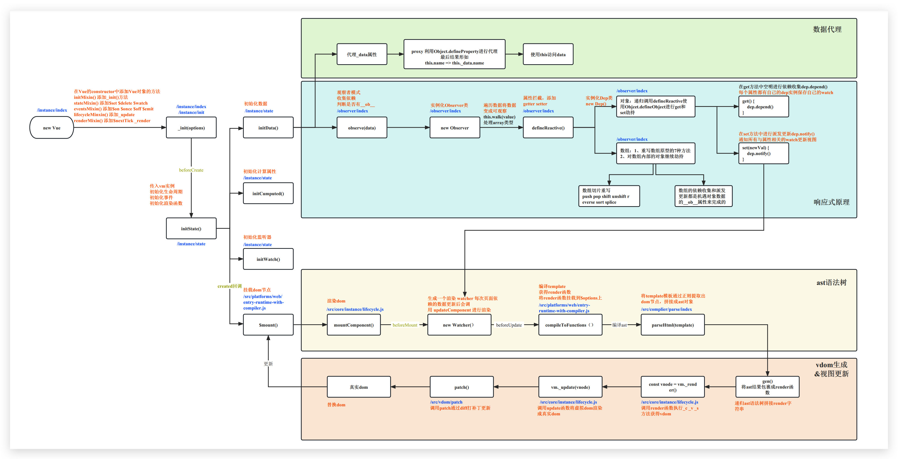

通过梳理Vue初始化的过程，我们发现实现一个类似于Vue的框架主要需要实现这几部分 响应式系统框架、虚拟dom编译渲染机制 MVVM更新机制，接下来我们先从最基本的响应式系统开始，自己动手写一个Vue的简单框架

【思考】Vue在初始化的过程中主要经历的哪些步骤

【回答】

1、初始化Vue构造函数，挂载属性 方法

2、模板编译成render函数

3、通过Watcher收集依赖

4、diff更新dom

5、渲染dom


【补充】vue是一个标准的MVVM框架么？

Vue 并不完全是一个MVVM框架MVVM只能数据驱动视图，视图更改数据，而不能通过其他方式操作数据。在vue中我们也可以自己手动修改数据，所以vue并不是一个完全意义上的MVVM框架。


## 三、Vue2 响应式原理

从这一小节开始我们带着大家实现一个Vue框架

我们先来看看面试宝典中的关于Vue响应式的八股文 （P143-4）

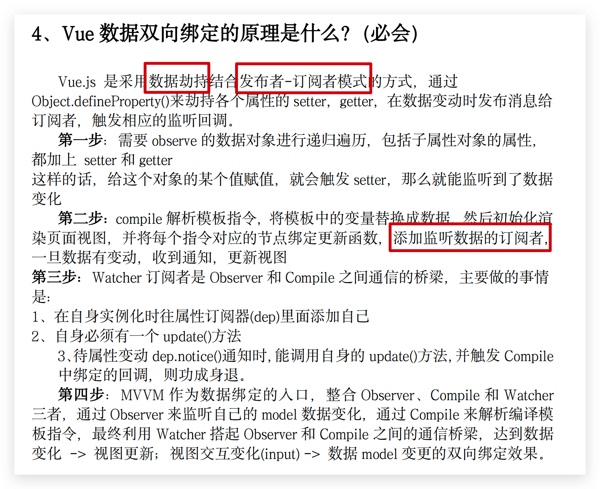

相信绝大多数的同学看到这个八股文都会感觉头大。学完今天的内容，我们都会对怎么回答vue的响应式原理有了自己的理解。

下面我们一起来揭秘vue的响应式原理到底是怎么实现的！

### 1、章节概述

我们首先实现学习路线中第一条分支，从状态初始化到数据响应式的过程

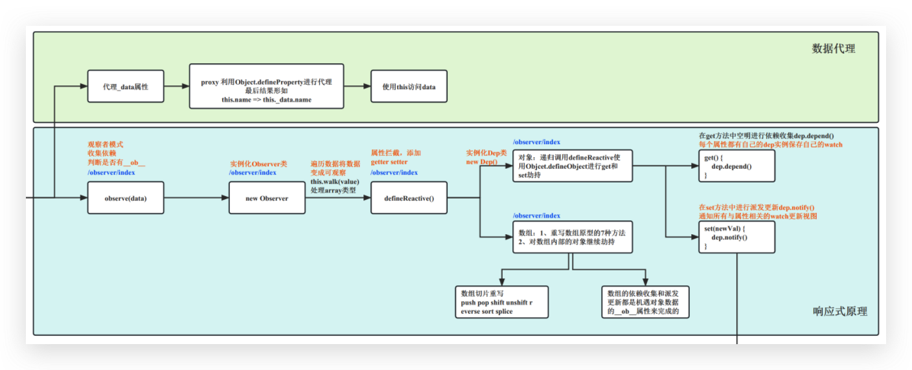

所谓数据响应式就是**能够使数据变化可以被检测并对这种变化做出响应的机制**。MVVM框架中要解决的一个核心问题是连接数据层和视图层，通过**数据驱动**应用，数据变化，视图更新，要做到这点的就需要对数据做响应式处理，这样一旦数据发生变化就可以立即做出更新处理。


Vue 的响应式原理依赖于[Object.defineProperty](https://developer.mozilla.org/en-US/docs/Web/JavaScript/Reference/Global_Objects/Object/defineProperty)，Vue通过设定对象属性的 setter/getter 方法来监听数据的变化，通过getter进行依赖收集，而每个setter方法就是一个观察者，在数据变更的时候通知订阅者更新视图。

所以在vue中的数据响应式原理主要是给data绑定一个观察着 observe 让数据变成可观察的，我们首先来看源码然后自己尝试手写一个observe

### 2、环境准备

在这一小节中我们开始自己实现一个Vue框架，通过Vue源码我们了解到Vue使用的rollup构建工具进行打包

**/package.json**

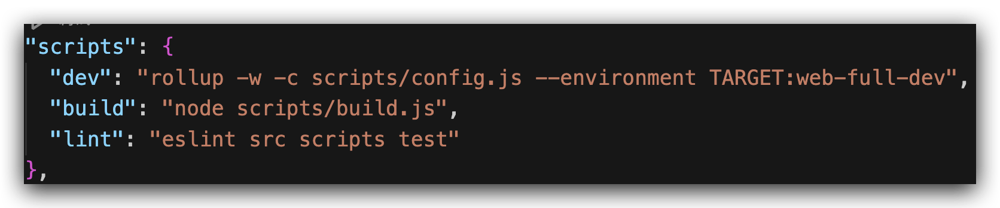

这里我们也使用Rollup实现项目打包，我们之前有学习过脚手架工具webpack，Rollup和webpack的区别在于项目类代码中有大量的代码拆分，构建项目类型的应用显然webpack更为合适，如果想要构建js类库将多个模块打包成一个大的文件rollpu更加合适，同时rollup中提供的tree-shake可以帮助我们自动删除冗余代码

| **Webpack**                              | **Rollup**                                                   |
| ---------------------------------------- | ------------------------------------------------------------ |
| vue-cli, create-react-app 各类应用脚手架 | react，vue，three.js，[D3](https://so.csdn.net/so/search?q=D3&spm=1001.2101.3001.7020)，moment |

#### 1、源码工程的初始化

##### 1、新建项目文件夹，在文件夹下初始化工程

~~~~shell
npm init -y
~~~~


获得package.json

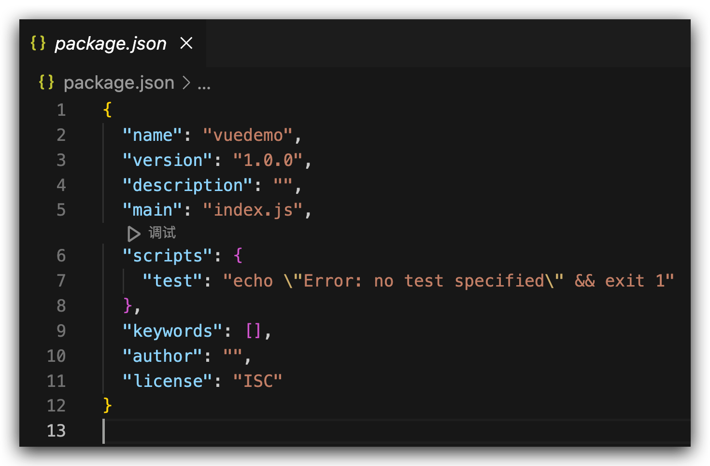

##### 2、安装Rollup打包依赖

~~~~shell
// 1，安装 rollup：用于 Vue 源码的打包构建
npm install rollup

// 2，使用 babel：需要安装核心模块 @babel/core；
npm install @babel/core

// 3，rollup 与 babel 关联
npm install rollup-plugin-babel

// 4，浏览器兼容：将 ES6 语法转译为 ES5
npm install @babel/preset-env


// ==> 合并写法：一次性安装开发环境所需的全部依赖
npm install rollup @babel/core rollup-plugin-babel @babel/preset-env -D
~~~~

##### 3、创建Vue.js文件

创建打包入口：src/index.js

~~~~js
// src/index.js Vue 构造函数
function Vue(){}

// 导出 Vue 函数，提供外部使用
export default Vue;
~~~~

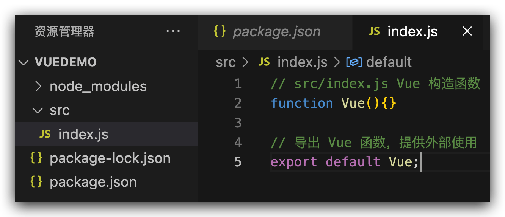

##### 4、创建 Rollup 配置文件

rollup 默认配置文件：项目根目录下`rollup.config.js`文件

创建 rollup.config.js，完成 rollup、[babel](https://so.csdn.net/so/search?q=babel&spm=1001.2101.3001.7020) 相关配置：

```js
// src/rollup.config.js
import babel from 'rollup-plugin-babel'

// 导出 rollup 配置对象
export default {
  // 打包入口
  input: './src/index.js',   
  // 打包出口：可定义为数组，输出多种构件
  output: {                
    // 打包输出文件
    file: 'dist/vue.js',   
    // 打包格式（可选项）：iife（立即执行函数）、esm（ES6 模块）、cjs（Node 规范）、umd（支持 		amd + cjs）
    format: 'umd',         
    // 使用 umd 打包需要指定导出的模块名，Vue 模块将会绑定到 window 上；
    name: 'Vue',          
    // 开启 sourcemap 源码映射，打包时会生成 .map 文件；作用：浏览器调试ES5代码时，可定位到			ES6源代码所在行；
    sourcemap: true,      
  },
  // 使用 Rollup 插件转译代码
  plugins: [
    babel({
      // 忽略 node_modules 目录下所有文件（**：所有文件夹下的所有文件）
      exclude: 'node_modules/**'
    })
  ]
}
```

##### 5、创建 rollup 构建脚本

执行 Rollup 打包构建 Vue，创建 rollup-script 构建脚本：

~~~~json
// package.json
{
.........
  // ollup 命令：默认会去找 node_module/bin/rollup；
	// - -c：config 选项，使用配置文件，默认找 rollup.config.js；
	// - -w：watch 选项，监听文件变化；当文件发生变化时重新打包；
  "scripts": {
    "dev": "rollup -c -w"
  },
.........
}
~~~~

dev 脚本解释：

- rollup 命令：默认会去找 node_module/bin/rollup；
- -c：config 选项，使用配置文件，默认找 rollup.config.js；
- -w：watch 选项，监听文件变化；当文件发生变化时重新打包；

##### 6、打包构建 Vue

执行构建脚本 npm run dev

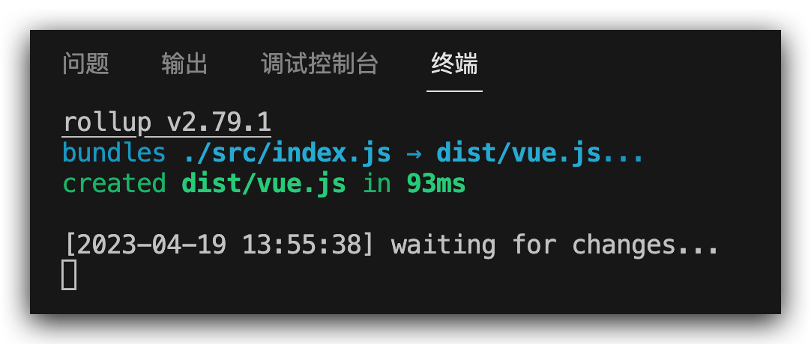

将 `src/index.js` 输出至 `dist/vue.js` 其中，`vue.js.map` 为 sourcemap 源码映射文件

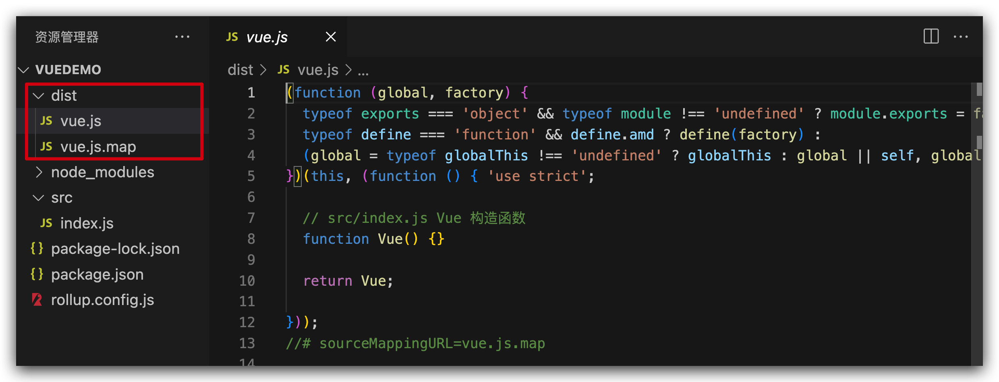

##### 7、创建 Html 引入 Vue

创建 `dist/index.html` 引入 `dist/vue.js`，打印输出 Vue：

~~~~html	
<!DOCTYPE html>
<html lang="en">
<head>
  <meta charset="UTF-8">
  <meta http-equiv="X-UA-Compatible" content="IE=edge">
  <meta name="viewport" content="width=device-width, initial-scale=1.0">
  <title>Document</title>
</head>
<body>
  <!-- 引入 vue.js，将会绑定到 window-->
  <script src="./vue.js"></script>
  <script>
    console.log(Vue) 
  </script>
</body>
</html>
~~~~

在浏览器中打开`index.html`，查看控制台输出，此时一个`Vue`的构建环境就搭建完成了

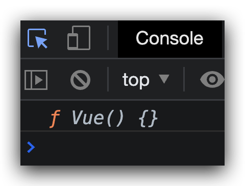


### 3、Vue函数的封装

【目标】封装一个 Vue 函数并且在 index.html 中引入

【前置知识】

在js中函数和class都可以new，如下：有啥区别呢 ？

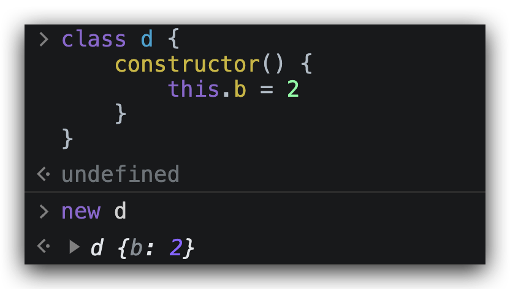

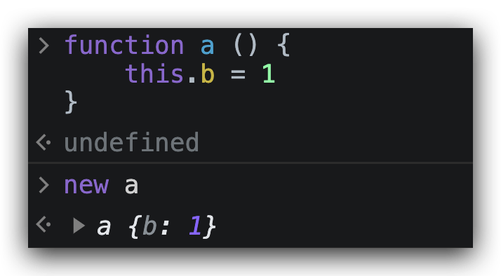

class **类是用于创建对象的模板。**

我们使用 class 关键字来创建一个类，类体在一对大括号 **{}** 中，我们可以在大括号 **{}** 中定义类成员的位置，如方法或构造函数。

每个类中包含了一个特殊的方法 **constructor()**，它是类的构造函数，这种方法用于创建和初始化一个由 **class** 创建的对象。

创建一个类的语法格式如下：

~~~~js
class ClassName {  constructor() { ... } }
~~~~

在js中除了class函数也可以new，函数本身就是对象，在js中每定义一个函数都会同时生成一个以这个函数体为构造函数的对象，不信你试试

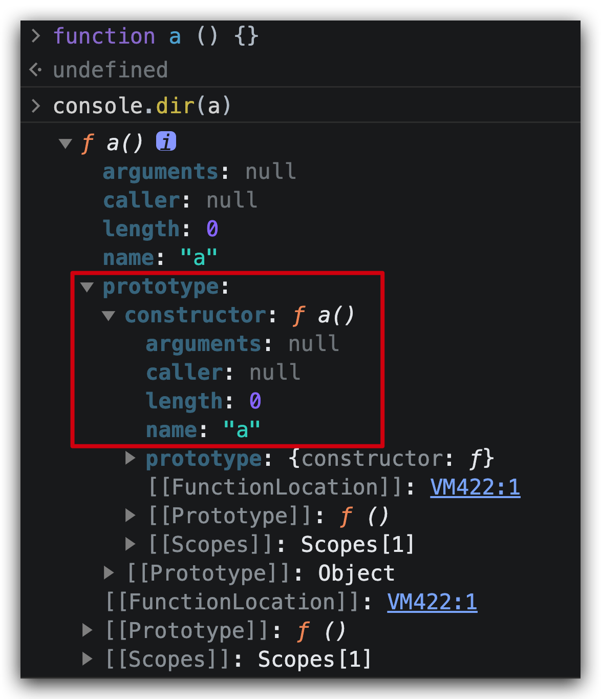

可以通过对象来new出一个新的对象。定义 function Vue(options){} 时， 实际上生成了一个Function类型（预定义类型）的对象，对象名叫Vue，对象的构造函数就是这个函数的体。如下

我们在初始化`Vue`项目的时候使用到`new`关键字，这里的vue是使用函数定义的。目的是提升vue的灵活性。

~~~~js
function Vue (options) {
  this.name = options.name;
  this.data = options.data;
}
~~~~


【思考】为什么vue使用函数定义而其他的watcher observer使用class定义？

【回答】核心目的：提升Vue的灵活性：

1、class的所有方法都是不可枚举的，而function声明的函数是可以枚举的。用户可以根据需要定制重写（重载）vue提供的成员方法

2、function 既能当常规函数来用，又能当做函数的属性来用，又能当类来用。相对class更加灵活。

3、对于内部定义的不希望修改的方法，通过class来定义，另外class声明的函数会有变量提升。

下面我们实例化一个Vue

~~~~js
let vm = new Vue({
  name: 'vue',
  data: {}
});
~~~~

此时在 vm 实例上就具有了 name 和 data 属性

接下来我们在`src/index.js`中定义这个类并导出。在构造函数中获取传入的`options`并挂载到`vue`实例上。

~~~~js
// src/index.js

function Vue (options) {
  console.log('Vue构造器执行')
  const vm = this;
  vm.$options = options        
}
~~~~

并且在 **dist/index.html**中实例化一个Vue对象。

~~~~html
<!-- 引入 vue.js，将会绑定到 window-->
<script src="./vue.js"></script>
<script>
	var vm = new Vue({
    data: {
      a: {
        b: {
          c: 1
        }
      },
      arr: [1, 2, 3, 4],
      message: "hello world!"
    }
  });
</script>
~~~~

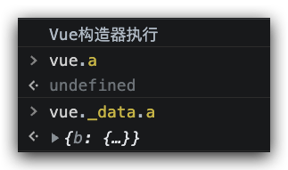

此时我们访问`Vue`对象中data里面定义的数据不能直接访问，必须通过`vue.data.xxx`访问，实际在`Vue`项目中`data`里面定义的数据是可以直击访问的，所以我们需要给`data`中的数据添加一个代理实现数据的直接访问。


### 4、核心函数 Object.defineProperty 的介绍和简单响应式的实现

【目标】能够了解Object.defineProperty的用法，并且实现一个简单的响应式

为了实现vue中的数据代理，我们需要首先了解一下vue中的响应式核心方法Object.defineProperty

Object.defineProperty 在 vue2 中起到了非常重要的作用，通过Object.defineProperty实现了数据的代理，数据响应式原理，以及vue中的一些重要成员方法。下面我们学习Object.defineProperty的基本概念和用法。

语法：**[Object.defineProperty(obj, prop, descriptor)](https://developer.mozilla.org/zh-CN/docs/Web/JavaScript/Reference/Global_Objects/Object/defineProperty)**
其中：**obj**要在其上定义属性的对象。**prop**要定义或修改的属性的名称。**descriptor**将被定义或修改的属性描述符。

参数：    1、obj : 第一个参数就是要在哪个对象身上添加或者修改属性

​				2、prop : 第二个参数就是添加或修改的属性名

​				3、desc ： 配置项，一般是一个对象 

~~~~js
desc 的详细配置
writable：	是否可重写
value：  	当前值 
enumerable： 	是否可以遍历
configurable： 	是否可再次修改配置项
get：    	 读取时内部调用的函数
set：        写入时内部调用的函数

当数据调用的时候触发get 方法，当数据修改的时候触发set方法
~~~~


【思考】什么是响应式？

【回答】对外界的变化做出反应

【思考】数据响应式的核心思想是什么？

【回答】将数据变成可观察的


下面我们来实现一个简单的数据响应式过程，在 dist 下新建一个 **defineproperty.html **

~~~~html
<!DOCTYPE html>
<html lang="en">
<body>
  <input type="text">
</body>
<script>
    
    // 1. 定义数据
    // 2. 实现数据的渲染
    // 3. 当视图改变数据改变
    // 4. 当数据改变驱动视图更新
    

  let data = {
    value: 'hello world'
  }

  document.querySelector('input').addEventListener('input', (e) => {
    console.dir(e.target.value)
    data.value =  e.target.value
  })
  
  document.querySelector('input').value = data.value
  // 这里的val的作用是行程闭包，拓展函数体内部变量的作用域
  function defineReactive (obj, key, val, cb) {
    Object.defineProperty(obj, key, {
      get() {
        console.log('数据被获取了');
        return val
      },
      set(value) {
        val = value
        // document.querySelector('input').value = value
        console.log(value,'输入框输入的值');
        cb(value)
      }
    })
  };
  function callBack (val) {
    document.querySelector('input').value = val
  }
  
  defineReactive(data, 'value', data['value'], callBack)
    
     // data.value = '123'
    // 数据发生了修改！ 123
    // '123'
    // 视图发生了改变 123
</script>
</html>


~~~~


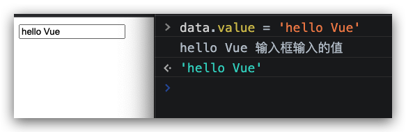

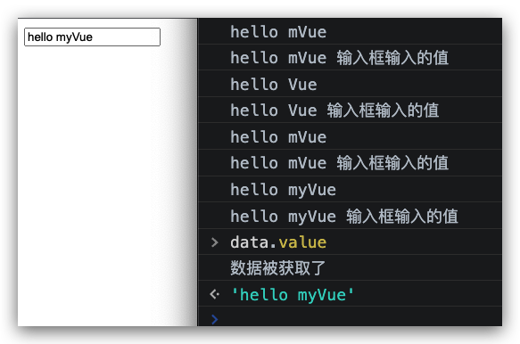

【思考】数据获取的时候触发的哪个方法，数据修改的时候触发的哪个方法？

【回答】获取触发get 修改触发set


【思考】上面这段代码实现了什么呢？

【回答】实现了数据的双向绑定，数据改变视图改变，视图改变数据也改变


【思考】定义defineReactive函数的时候，里面第三个参数val的作用？

【回答】在函数体内部形成闭包结构，用开来拓展函数内部变量的作用域


### 5、通过data代理，实现数据的访问

【目标】实现data的代理可以直接通过vm实例获取data中定义的数据

【思考】在 vue 中的数据是存放在 data 中为什么可以通过 vm.XXX 直接访问数据呢？

【回答】通过数据代理实现数据的访问

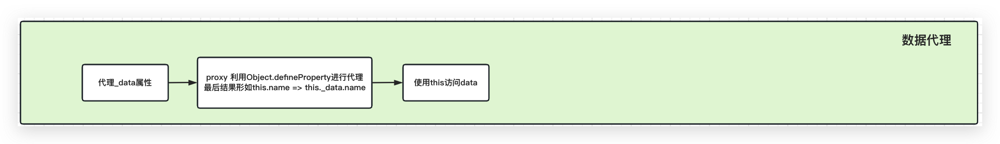

此时我们想获取数据 a 需要通过 Vue.$options.data.a ，但是在 vue 中只需要 this.a 就可以获取到 a 的值，这是怎么实现的呢？

在 Vue 中，可以在外部直接通过vm实例进行数据访问和操作：

~~~~js
let vm = new Vue({
  data() {
    return { 
    	a: {
        b: {
          c: 1
        }
      },
      arr: [1, 2, 3, 4],
      message: "hello world!"
    }
  }
});
console.log(vm.message)
console.log(vm.arr.push(4))
~~~~

当前代码中，外部通过vue实例只能拿到 `vue.$options`，想要拿到`data`需要 `vue.$options.data`，要想实现`vue.message`和`vue.$options.data.message`等效，就需要想办法将`vue`实例操作“代理”到`$options.data`上；这样，就实现了 Vue 的数据代理我们来观察一下vue的实例，在实例上有一个_data属性 还有我们定义的变量。


首先，先做一次代理，将`data`挂载到 vue._data下（因为Object.defineProperty的第一个参数必须为一的对象，我们，第一层代理更加方便我们在实现属性的追加），这样 vue 实例就能够在外部通过`vue._data.message`获取到`data.message`；

之后，再做一次代理，将 vue 实例操作 vue.message 代理到 vue._data 上，这样，外部就可以直接通过vue.message 获取到 data.message；_

Vue 状态初始化阶段，通过 observe() 实现数据响应式之后，通过 Object.defineProperty 对 _data 中的数据操作进行劫持；将 vue.xxx 在 vue 实例上的取值操作，代理到 vue._data.xxx 上，这样可以简化书写。

下面我们开始实现数据的代理

`data`挂载到 vue._data下

~~~~js
function Vue (options) {

  console.log('Vue构造函数执行')
  const vm = this
  vm.$options = options
  vm._data = typeof(options.data) === 'function' ? options.data() : options.data
}	
~~~~

将vue实例操作vue.message代理到vue._data上

~~~~js
// 数据代理 实现非侵入的数据修改
_proxy(data) {
    const that = this
    Object.keys(data).forEach(key => {
      Object.defineProperty(this, key, {
        get () {
          return this._data[key]
        },
        set (val) {
          this._data[key] = val
        }
      })
    })
  }
~~~~

然后在Vue的构造器中使用proxy方法代理数据

~~~~js
function Vue (options) {
    console.log('Vue构造函数执行')
    const vm = this
    vm.$options = options
    vm._data = typeof(options.data) === 'function' ? options.data() : options.data
    this._proxy(vm._data)
}
~~~~

此时我们再访问vue对象中的数据，就不需要.data了，观察打印结果：当从vue实例取值时，就会被代理到vm._data取值；

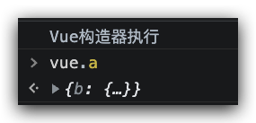

【总结】vue中实现数据直接访问的实现步骤

1、将 data 暴露在 vue._ _data 实例属性上
2、利用 Object.defineProperty 将 vue.xxx 操作代理到 vue._ _data 上


### 6、单层对象的响应式

【目标】实现vue的单层对象的响应式

vue 内部实现双向绑定过程：**简单来说就是初始化 data 的时候会调用 observe 方法给 data 里的属性重写 get 方法和 set 方法，到渲染真实 dom 的时候，渲染 watcher 会去【 访问 】页面上使用的属性变量，给属性的 Dep 都加上渲染函数，每次修改数据时通知渲染 watcher 更新视图**下面我们来实现一个最简单的响应式机制

我们先写在 index.js 中然后再做模块拆分

**src/index.js**

~~~~js
// 遍历数据将data中每一个对象变成可观察的observe
function observe(value, cb) {
  Object.keys(value).forEach((key) => defineReactive(value, key, value[key] , cb))
}

/**
* obj： 要监听的对象
* key： 要监听对象中的属性
* val： 在函数体内部形成闭包，作为中间变量实现数据的返回
* cb： 回调函数
**/
function defineReactive (obj, key, val, cb) {
  Object.defineProperty(obj, key, {
      get: ()=>{
          /*....依赖收集等....*/
          console.log('获取数据')
          return val
      },
      set:newVal=> {
          val = newVal;
          console.log('修改数据')
          cb ? cb() : null;/*订阅者收到消息的回调*/
      }
  })
}
~~~~

~~~~js
function Vue (options) {
  console.log('Vue构造器执行')
  this._data = options.data;
  const vm = this;
  vm.$options = options
  // 调用observe传入data
  observe(this._data)
  _proxy.call(this, options.data)
}
~~~~

此时我们查看控制台输出，发现每一个数据都变成可观察的了

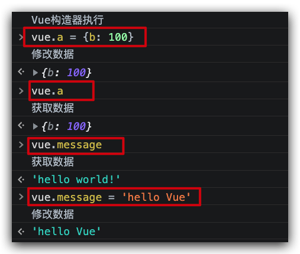

但是当我们修改a.b的值的时候发现数据的修改并没有被观察到

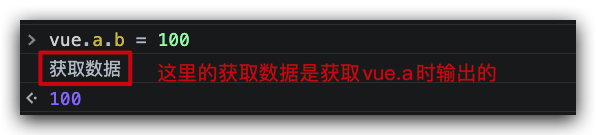

【优化】我们可以将proxy方法和observe方法单独抽离出来封装成一个函数 initData，这样可以提升代码的品味。

~~~~js
function initData() {
  const vm = this
  observe(this._data)
  _proxy.call(vm, vm._data)
}
~~~~

最后在Vue中调用

~~~~js
function Vue(options) {
  const vm = this
  this.$options = options
  // options.data 可能是对象也可能是函数
  vm._data = typeof (options.data) === 'function' ? options.data() : options.data
  initData.call(vm)
}
~~~~


如果我们想对对象中每个属性都添加getter和setter，因为对象的嵌套层级不确定，因此就需要想到递归。这一部分我们会在最后一节中来学习


【思考】为什么在数据代理我们操作的是原数据，但是在响应式使用的是闭包变量val呢？

【回答】因为代理本质上是通过更简单的方式操作原始数据，使用原始数据相当于直接操作的原数据，但是响应式并不是要操作原始数据，而是将数据变成可观察的即可。


### 7、Observer类的定义

数据响应式是Vue中比较核心的功能，很多模块都是依赖数据响应式实现的，所以并不希望用户修改，此时我们可以将数据响应式定义为一个类

【目标】定义Observer类并在data数据中添加响应式标识

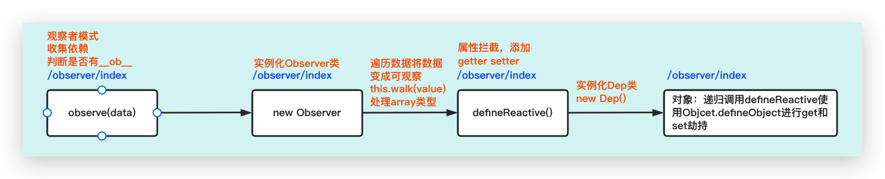

新建一个 observer/index.js 文件此时我们可以封装一个 Observer 类，将上面的方法复制到构造函数中，然后将 observe 方法导出，并在src/index.js 中导入

~~~~js
// 遍历数据将data中每一个对象变成可观察的observe
export function observe(value, cb) {
  Object.keys(value).forEach((key) => defineReactive(value, key, value[key] , cb))
}

/**
* obj： 要监听的对象
* key： 要监听对象中的属性
* val： 在函数体内部形成闭包，作为中间变量实现数据的返回
* cb： 回调函数
**/
function defineReactive (obj, key, val, cb) {
  Object.defineProperty(obj, key, {
      get: ()=>{
          /*....依赖收集等....*/
          console.log('获取数据')
          return val
      },
      set:newVal=> {
          val = newVal;
          console.log('修改数据')
          cb ? cb() : null;/*订阅者收到消息的回调*/
      }
  })
}
~~~~

~~~~js
import {observe} from './observer/index.js'
~~~~

重写 observe 方法，在 observe 方法中我们调用定义的 Observer 类，然后再 Observer 类中实现数据的响应式

~~~~js
// observer/index.js
export function observe(value, cb) {
  let ob = new Observer(value)
  return ob
}
~~~~

定义 observer 类，在 walk 中调用 defineReactive。

~~~~js
// src/observer/index.js
export class Observer {
  // 这里的value刚开始时，实际上就是data
  constructor (value) {
    this.walk(value)
  }
  // walk走你，这个方法用来遍历value给每个key下面都加上一个getter setter属性变成可观察的
  walk (value) {
    Object.keys(value).forEach(
      (key)=> defineReactive(value, key, value[key])
    )
  }
}
~~~~

此时我们有了两个方法一个类：

defineReactive 方法实现数据的响应式

observe方法 实例化一个 observer类，并且将实例化之后的对象返回

Observer类  调用walk方法，walk方法中循环遍历属性的key作为参数传入到defineReactive，再通过define Reactive方法给对象中的属性绑定get和set方法

他们的调用关系如下

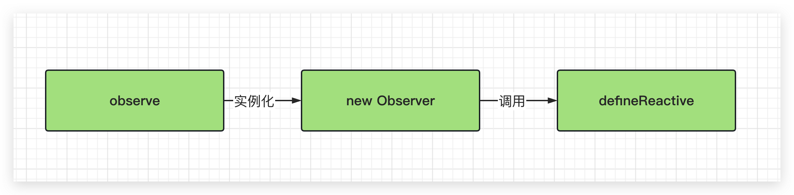

此时修改a的值，试一试！

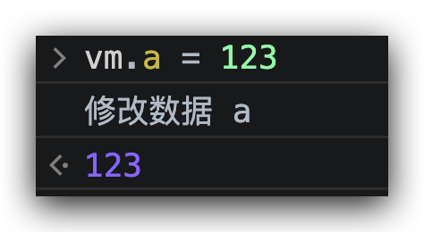

触发defineReactive中的set，数据变成了响应式的。


### 8、watcher的实现 & dep类依赖收集

【目标】这一小节我们会手动实现一个watcher！

先来看看Vue中watche选项和$watch方法在vue中的使用方式

~~~~js
// 选项式调用
watch: {
  a() {
    console.log('watch a1')
  }
}
~~~~

~~~~js
// 方法式调用
vm.$watch('message', () => {
  console.log('watch message')
})
~~~~

实现效果

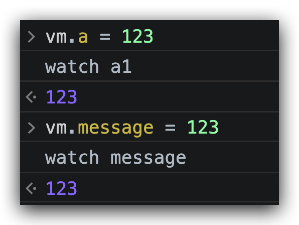

【思考】Vue中的watch监听器是怎么实现的呢？

【回答】当用户修改数据的时候，需要知道数据改变，并且通知依赖这个数据的视图重新渲染或者计算，最典型的场景就是dom的更新和watcher监听器。所以我们需要对数据的调用关系进行收集，等数据变更的时候去找到他的调用关系，触发更新。

【结论】

- 在getter中收集依赖（因为在getter中可以知道哪些地方使用到这个数据）

- 在setter中触发依赖（因为在setter中可以知道数据修改）

  

【思考】什么是依赖？

【回答】需要使用数据的地方（不仅仅局限在Dom）


【思考】watcher中应该接收几个参数？

【回答】目前watcher中应该接受三个参数，第一个是vue实例，第二个是监听的属性，第三个是属性更新之后的回调。

【思考】如果想要实现一个$watch方法和watch选项需要几步操作？

1、结合watch和$watch的使用方式，将watch选项和$watch方法在Vue实例上定义

2、在添加响应式过程中，即Observer中的get方法实现依赖收集

3、定义Watcher类作为收集的依赖

3、将watcher依赖添加到一个容器中，定义一个Dep类存储watcher

4、数据更新在set中触发，在Observer中的set方法中进行依赖的触发


我们首先在vue实例上添加 $watch 方法和 watch 选项

~~~~js
// /src/index.js
function Vue(options) {
  
  ...
  // watch 选项的实现
  const watch = this.$options.watch
  if (watch) {
    let keys = Object.keys(watch)
    for(let i = 0; i < keys.length; i++) {
      // 实现watch 并执行回调
    }
  }
}
~~~~

~~~~js
// $watch方法的实现
Vue.prototype.$watch = function () {
  // 实现watch 并执行回调
}
~~~~

当watch方法调用的时候，实际上相当于将数据添加观察者，观察者观察到数据改变之后触发传入的回调函数。那么观察者是如何添加的呢？

给数据添加 getter 和 setter 都是在 observer 类中完成的，所以依赖的收集也需要在 observer 中进行，因此在Observer类的构造器中向数据里面通过dep类实例化dep对象，添加到数据中。这里的`__ob__`可以暂时将它理解为一个盒子。后面会详细讲到

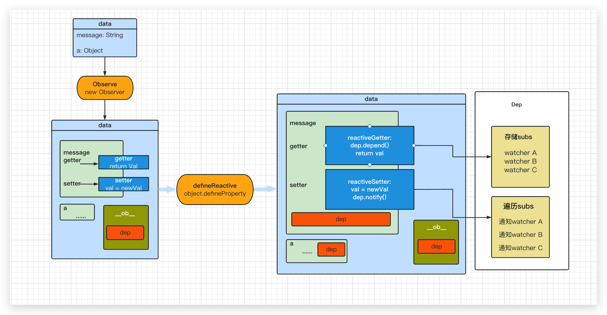

在defineReactive函数中也使用了dep类，赋值给局部变量dep，在get方法中使用闭包结构保存属性相关信息，用于依赖的收集depend，在set中触发依赖notify，在Dep类，实现订阅(addSub)和通知(notify)。首先我们新建一个dep.js，然后再类中添加这三个方法。

~~~~js
// src/observer/dep.js
export default class Dep {
  constructor() {
    this.subs = [];
    console.log('dep类的构造器')
  }
  addSub() {
    console.log('添加依赖')
  }
  depend() {
    console.log('收集依赖')
  }
  notify() {
    this.subs.forEach(item => item)
    console.log('通知依赖')
  }
}
~~~~

然后我们分别在 observer 类中和 defineReactive 中实例化

src/observer/index.js

~~~~js
import Dep from "./dep.js";

export class Observer {
  constructor (value) {
    this.dep = new Dep(); // <=========
		//...省略
  }
}
~~~~

~~~~js
/**
 * 给对象Obj，定义属性key，值为value
 *  使用Object.defineProperty重新定义data对象中的属性
 *  由于Object.defineProperty性能低，所以vue2的性能瓶颈也在这里
 * @param {*} obj 需要定义属性的对象
 * @param {*} key 给对象定义的属性名
 * @param {*} value 给对象定义的属性值
 */
function defineReactive(obj, key, value) {
  // childOb 是数据组进行观测后返回的结果，内部 new Observe 只处理数组或对象类型
  const dep = new Dep() // <====
  Object.defineProperty(obj, key, {
    // get方法构成闭包：取obj属性时需返回原值value，
    // value会查找上层作用域的value，所以defineReactive函数不能被释放销毁
    get() {
      console.log('访问', key, '属性');
      // 在get方法中收集依赖
      dep.depend(); // <======
      return value;
    },
    // 确保新对象为响应式数据：如果新设置的值为对象，需要再次进行劫持
    set(newValue) {
      console.log("修改了被观测属性 key = " + key + ", newValue = " + JSON.stringify(newValue))
      if (newValue === value) return
      value = newValue;
      // 在set方法中通知依赖更新，并且传入新值
      dep.notify(newValue);
    }
  })
}
~~~~

此时当我们访问数据的时候，会在控制台中打印依赖收集


当我们修改数据的时候会在控制台中打印通知依赖

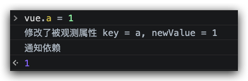

另外dep类中的subs存储的是watcher，所以这部分我们将watcher类定义一下

首先watcher（这里叫做依赖）它可以将目标对象，目标对象中的属性和用于渲染的回调函数三者关联起来，所以Watcher类的结构如下

~~~~js
// src/observer/watcher.js
class Watcher{ 
  // vm，因为实现了数据代理，所以相当于data；expr，即访问路径，如'count.total';cb: 依赖回调
  constructor(vm, exp, cb){ 
    this.vm = vm;
    this.exp = exp;
    this.cb = cb;
  }
  update(){
    //todo: 调用依赖回调cb 
  }
}
~~~~

那么watcher怎么和dep关联起来呢？

这里用一个旋转餐厅的例子来解释：用户点了餐相当于调用了数据，此时餐品被放在传送带target上，用户会一致关注传送带上是否有餐，如果有则将菜品拿下来放在桌子（subs）上，此时就完成了依赖的收集。

`Watcher` 把自己设置到全局的一个指定位置(target)，然后读取数据。因为读取了数据，所以会触发这个数据的`getter` 。在`getter` 中就能得到当前正在读取数据的`Watcher`，并把这个存储了`Watcher`的`target`收集到`Dep` 中。然后将`target`清空用于下一次存储。

下面我们来解决读取数据问题，这里我们只需要定义一个get方法即可，调用成员方法get来访问所依赖的属性，从而引发该属性的getter执行。

~~~~js
import Dep from "./dep.js";

export default class Watcher {
  constructor(vm, exp, cb) {
    this.exp = exp;
    this.cb = cb;
    this.vm = vm;
    this.value = this.get();
  }
  get () {
    Dep.target = this;
    const obj = this.vm._data
    var value;
    value = obj[this.exp]
    Dep.target = null;
    return value;
  }
  update () {
    // 这个位置可以实现新老数据的回传和判断数据是否发生修改
    this.cb && this.cb();
  }
}
~~~~

然后定义dep中的depend方法，这个方法是用来收集依赖的，当前数据的依赖被封存放在一个全局的 target 中，当获取到依赖之后给 target 赋值，当依赖存入完成之后 target 设置为 null，可以将 target 理解成一个搬运工。

src/observer/dep.js

~~~~js
let uid = 0

export default class Dep {
  constructor () {
    console.log('dep类的构造器')
    this.id = uid++
    this.subs = []
  }

  addSub (sub) {
    this.subs.push(sub)
    console.log('subs', this.subs)
  }

  depend () {
    console.log(Dep.target)
    if (Dep.target) {
      console.log('添加订阅者')
      this.addSub(Dep.target)
    }
  }

  notify(newValue) {
    console.log('dep通知更新', this.subs)
    for (let i = 0, l = this.subs.length; i < l; i++) {
      console.log('通知更新的watcher', this.subs)
      this.subs[i].update(newValue)
    }
  }
}
~~~~

此时已经可以实现notify调用每一个watcher中的update触发更新了

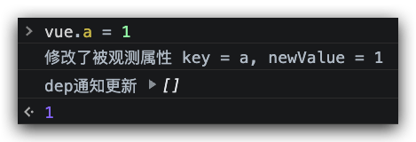

最后我们把watch选项和$watch方法完善一下，并且添加上监听，快来试试！

~~~~js
// /src/index.vue
import { observe } from './observer/index.js'
import  Watcher  from './observer/watcher.js';

function Vue (options) {
  console.log('Vue构造器执行')
  this._data = options.data;
  const vm = this;
  vm.$options = options
  // 响应式处理部分代码
  observe(this._data)
  _proxy.call(this, options.data)
  // watch 选项的实现
  const watch = this.$options.watch
  if (watch) {
    let keys = Object.keys(watch)
    for(let i = 0; i < keys.length; i++) {
      // 实现watch 并执行回调
      new Watcher(vm, keys[i], watch[keys[i]])
    }
  }
}
// $watch方法的实现
Vue.prototype.$watch = function (key, cb) {
  // 实现watch 并执行回调
  const vm = this
  new Watcher(vm, key, cb)
}
~~~~

~~~~js
// 在index.html中调用
watch: {
  a() {
    console.log('watch a1')
  }
}

vm.$watch('message', () => {
  console.log('watch message')
})
~~~~


此时subs中就出现了我们想要调用的watcher了


【优化】我们可以将watch选项和$watch方法单独抽离出来封装成一个函数 initWatch，这样可以提升代码的品味。

~~~~js
function initWatch() {
  const vm = this
  const watch = this.$options.watch
  if (watch) {
    let keys = Object.keys(watch)
    for (let i = 0; i < keys.length; i++) {
      // 实现watch 并执行回调
      new Watcher(vm, keys[i], watch[keys[i]])
    }
  }

  Vue.prototype.$watch = function (key, cb) {
    // 实现watch 并执行回调
    new Watcher(vm, key, cb)
  }
}
~~~~

在Vue中调用

~~~~js
function Vue(options) {
  const vm = this
  this.$options = options
  // options.data 可能是对象也可能是函数
  vm._data = typeof (options.data) === 'function' ? options.data() : options.data
  initData.call(vm)
  initWatch.call(vm)
}
~~~~

【总结】

代码在访问依赖属性之前先把Dep.target设置成当前的watcher实例本身，所以defineReactive的getter中就会认为当前正处于依赖收集阶段，所以就会继续调用dep.depend方法，从而将该watcher实例加入到该属性的dep实例所维护的subs数组中。

完了后上面的代码会继续走，在watcher中的get方法调用末尾将Dep.target设置成null，从而结束依赖收集阶段。

也就是说，只有Watcher中的get方法会触发getter中的dep.depend，即只有在`new Watcher(vm, key,...) `会引发依赖收集。

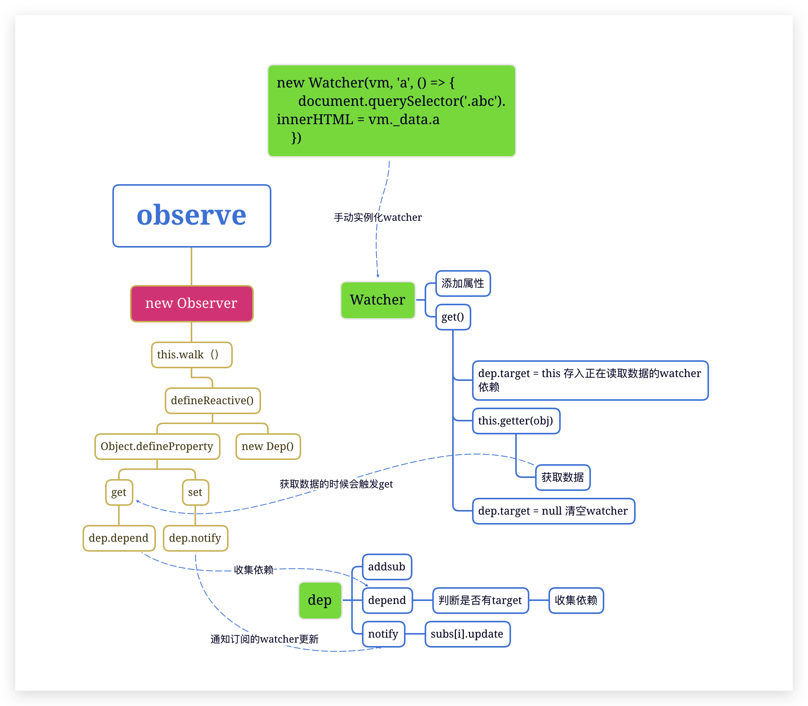


### 9、计算属性 computed 的实现

Vue中一个比较常用的属性就是计算属性，我们来回顾一下计算属性的写法

~~~~js
cumputed: {
	sum() {
		return this.num1 + this.num2
	}
}
~~~~

计算属性的特点：

1、他的值是一个函数运行的返回值

2、函数中所有用到的属性发生改变都会引起计算属性的改变


通过第二点特点，计算属性本质上还是一个watcher，但是又有一些区别，目前我们定义的watcher只能监听一个属性的变化，但是computed 中可以对多个属性进行监听，所以我们需要对现有的watcher进行改造！

我们可以让 watcher 的第二个参数接收一个函数，然后运行这个函数获取返回值，运行过程中所有的数据获取都会触发该数据的getter，此时target中的watcher是计算属性的watcher，这样我们就在 computed 中所有依赖数据的dep里，收集到这个conputed的watcher

计算属性是独立于data的，但是计算属性中的属性又可以作为数据去调用，所以需要单独的初始化

简写的计算属性只能取值，不能赋值，在Vue源码中试一试！

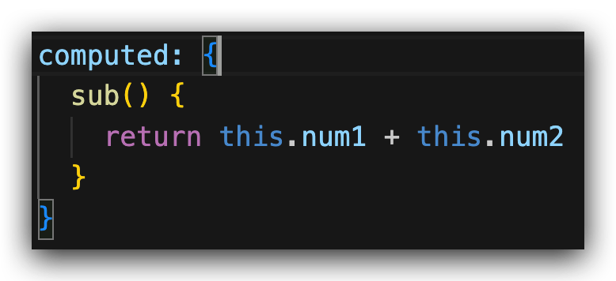  

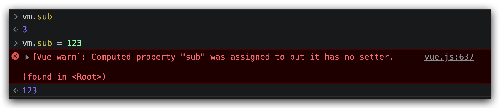

下面我们来实现computed

1、将watcher的第二个参数进行拓展，支持传入函数

2、将传入函数的计算结果挂载到watcher上

3、定义计算属性方法initComputed，并将计算属性添加到Vue实例上

4、在获取计算属性值的时候通过调用watcher中的get拿到算好的新值。

 让watcher的第二个参数变成函数

~~~~js
export class Watcher {
  constructor(vm, exp, cb) {
    this.exp = exp;
    this.cb = cb;
    this.vm = vm;
    this.value = this.get();
  }
  get() {
    Dep.target = this;
    console.log(Dep.target, 'Dep.target')
    // 判断第二个参数是不是函数
    if (typeof this.exp === 'function') {
      // 这里需要使用数据运算所以传入改变this指针到vm实例
      this.value = this.exp.call(this.vm)
    }
    else {
      this.value = this.vm[this.exp]
    }
    Dep.target = null;
  }
  update(newValue) {
    // 这个位置可以实现新老数据的回传和判断数据是否发生修改
    this.cb && this.cb(newValue);
  }
}
~~~~

定义计算属性

~~~~js
function initComputed(vm) {
  let computed = vm.$options.computed
  if (computed) {
    let keys = Object.keys(computed)
    for (let i = 0; i < keys.length; i++) {
      const watcher = new Watcher(vm, computed[keys[i]], () => {
      })
      Object.defineProperty(vm, keys[i], {
        enumerable: true,
        configurable: true,
        get() {
          watcher.get()
          return watcher.value
        },
        set() {
          console.log('computed不能赋值')
        }
      })
    }
  }
}
~~~~

在Vue中调用

~~~~js
function Vue(options) {
  const vm = this
  this.$options = options
  // options.data 可能是对象也可能是函数
  vm._data = typeof (options.data) === 'function' ? options.data() : options.data
  initData.call(vm)

  initComputed(vm)

  initWatch.call(vm)
}
~~~~

我们来试一试！

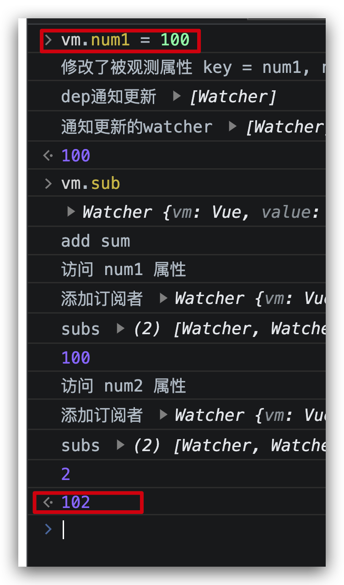

我们将num1的值改成100，此时计算出来的结果为102

除此之外计算属性有两个特性：

1、如果计算属性没有被使用，即使依赖的数据发生改变也不会重新计算

2、计算属性计算完成之后如果依赖没有发生变化，会缓存上一次的结果不会重复计算


我们可以给watcher上添加一个lazy属性，当lazy属性为true时，它是一个特殊的watcher，此时watcher更新的时候不直接update，而是给watcher加上一个状态 dirty：true，此时watcher是一个肮脏的状态

下一次我们去调用这个watcher去执行的时候，检查watcher是不是一个肮脏的状态，如果是一个脏的状态，在进行get求值，并且将计算结果存储在watcher.value中，如果dirty === false 是干净的，说明没有变更，直接返回watcher.value即可

~~~~js
function initComputed(vm) {
  let computed = vm.$options.computed
  if (computed) {
    let keys = Object.keys(computed)
    for (let i = 0; i < keys.length; i++) {
      // 实例化watcher的时候传入lazy 当前是一个惰性watcher
      const watcher = new Watcher(vm, computed[keys[i]], () => {
      }, {
        lazy: true
      })
      Object.defineProperty(vm, keys[i], {
        enumerable: true,
        configurable: true,
        get() {
          // 在computed获取数据的时候我们判断watcher是不是脏的
          // 1、如果是脏的说明需要更新，重新调用get方法
          // 然后将watcher.dirty改为false 恢复watcher的干净状态
          if (watcher.dirty) {
            watcher.get()
            watcher.dirty = false
          }
          // 2、如果不是脏的，直接返回上一次的计算结果
          return watcher.value
        },
        set() {
          console.warn('computed不能赋值')
        }
      })
    }
  }
}
~~~~

~~~~js
// /src/observe/watcher.js
export class Watcher {
  // 接收第四个参数
  constructor(vm, exp, cb, options = {}) {
    this.exp = exp;
    this.cb = cb;
    this.vm = vm;
    // 如果不传默认为false
    this.dirty = this.lazy = !!options.lazy
    // 如果lazy为false，则立即执行get
    // 如果lazy为true，则暂时不执行get
    if (!this.lazy) {
      this.value = this.get();
    }
  }
  get() {
    Dep.target = this;
    console.log(Dep.target, 'Dep.target')
    // 判断第二个参数是不是函数
    if (typeof this.exp === 'function') {
      this.value = this.exp.call(this.vm)
    }
    else {
      this.value = this.vm[this.exp]
    }
    Dep.target = null;
  }
  update(newValue) {
    // 在dep的notify方法中会调用watcher中的update
    // 此时如果是惰性watcher则不执行回调
    // 但是此时有依赖变更，所以我们将watcher上的dirty属性变为true
    if (this.lazy) {
      this.dirty = true
    }
    // 如果是正常watcher直接执行回调
    else {
      // 这个位置可以实现新老数据的回传和判断数据是否发生修改
      this.cb && this.cb(newValue);
    }
  }
}
~~~~


### 10、深层对象的响应式 

【目标】这一小节我们完善一下vue中的深层嵌套对象的监听！

此时我们的src/index.js observe可以修改一下，单独封装在observe.js文件中，并且新增类型判断 

需要添加的响应式属性是对象的时候，再进行递归，保证接下来的递归的安全性

~~~~js
// observer/index.js
export function observe(value, cb) {
  if (typeof value != 'object') return 
  let ob = new Observer(value)
  return ob
}
~~~~

此处的调用顺序应该是这样

~~~~java
let obj = {
  a: 1,
  b: {
    c: 2
  }
}
执行observe(obj)
├── new Observer(obj),并执行this.walk()遍历obj的属性，执行defineReactive()
    ├── defineReactive(obj, a)
        ├── 执行observe(obj.a) 发现obj.a不是对象，直接返回
        ├── 执行defineReactive(obj, a) 的剩余代码
    ├── defineReactive(obj, b) 
	    	├── 执行observe(obj.b) 发现obj.b是对象
	        	├── 执行 new Observer(obj.b)，遍历obj.b的属性，执行defineReactive()
          			├── 执行defineReactive(obj.b, c)
          					├── 执行observe(obj.b.c) 发现obj.b.c不是对象，直接返回
          					├── 执行defineReactive(obj.b, c)的剩余代码
  							├── 执行defineReactive(obj, b)的剩余代码
代码执行结束
~~~~

所以递归的调用顺序为

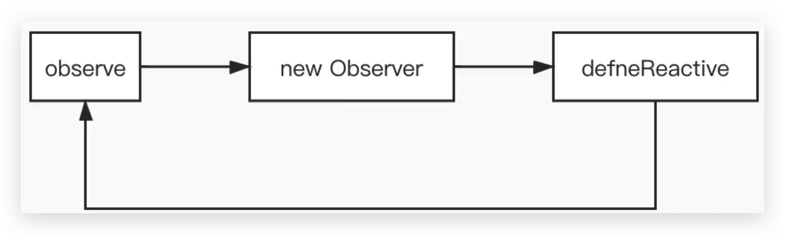

完善Observer/index.js的 defineReactive方法 实现递归，同时对修改的数据也是一个对象的情况进行处理

这里实际上需要对两部分进行响应式处理

1、现有对象下的对象属性需要通过递归实现响应式

2、在现有对象下修改的对象属性，如果是一个对象需要进行响应式

~~~~js
/**
 * 给对象Obj，定义属性key，值为value
 *  使用Object.defineProperty重新定义data对象中的属性
 *  由于Object.defineProperty性能低，所以vue2的性能瓶颈也在这里
 * @param {*} obj 需要定义属性的对象
 * @param {*} key 给对象定义的属性名
 * @param {*} value 给对象定义的属性值
 */
function defineReactive(obj, key, value) {
  // childOb 是数据组进行观测后返回的结果，内部 new Observe 只处理数组或对象类型
  // 递归实现深层观测
  const dep = new Dep() 
  // 1、现有对象下的对象属性需要通过递归实现响应式
  observe(value); // <====
  Object.defineProperty(obj, key, {
    // 可以被枚举
    enumerable: true,
    // 可以被配置
    configurable: true,
    // get方法构成闭包：取obj属性时需返回原值value，
    // value会查找上层作用域的value，所以defineReactive函数不能被释放销毁
    get() {
      console.log('访问', key, '属性');
      dep.depend();
      return value;
    },
    // 确保新对象为响应式数据：如果新设置的值为对象，需要再次进行劫持
    set(newValue) {
      console.log("修改了被观测属性 key = " + key + ", newValue = " + JSON.stringify(newValue))
      if (newValue === value) return
			// 2、在现有对象下新增的对象属性需要进行响应式
      observe(newValue); // <==========
      value = newValue;
      dep.notify(newValue);
    }
  })
}
~~~~

然后我们在控制台输出一个 vm.a ，试一试！

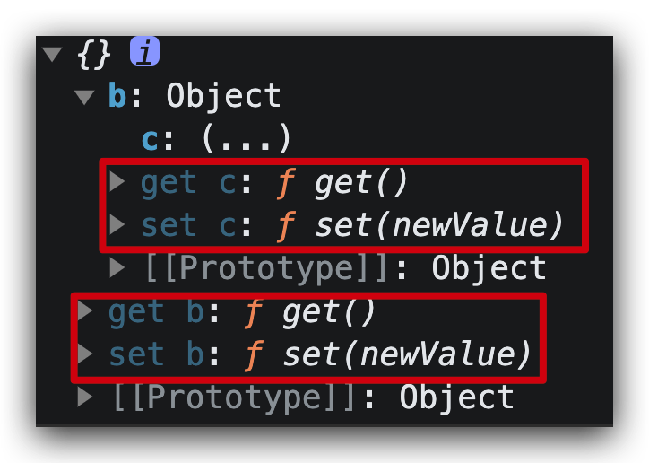


此时a属性下的b，c下都有get和set方法了，说明当前这个对象下的子对象也都变成响应式的了。

【优化】判断当前变量是否是一个对象是一个通用的工具方法，封装他！

~~~~js
// src/utils.js
/**
 * 判断是否是对象：类型是object，且不能为 null
 * @param {*} val 
 * @returns 
 */
export function isObject(val) {
  return typeof val == 'object' && val !== null
}

~~~~

在observe中使用他！

~~~~js
// src/observer/index.js
export function observe(value, cb) {
  if (!isObject(value)) return
  let ob = new Observer(value)
  return ob
}
~~~~

在浏览器中修改a.b的值，试一试！

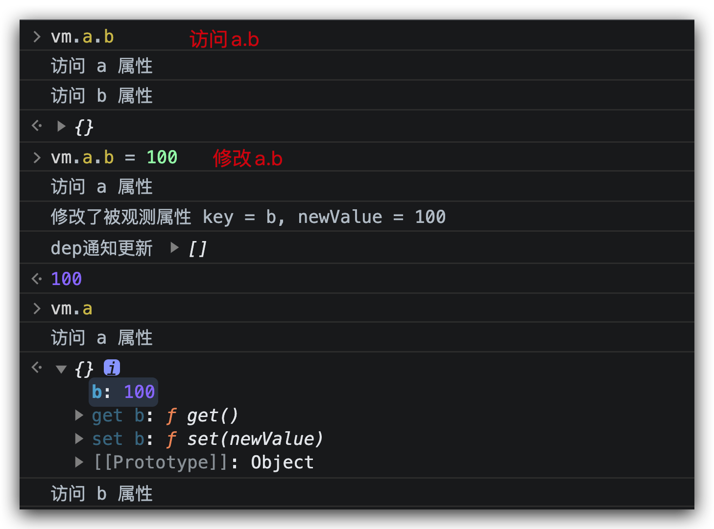

【总结】observer的流程

1、通过 data = observe(data)处理后的 data 就实现了数据的响应式（目前只有劫持）

2、observe 方法最终返回一个 Observer 类

3、Observer 类初始化时，通过 walk 遍历属性

4、对每一个属性进行 defineReactive（Object.defineProperty）就实现对象属性的单层数据劫持

5、在 defineReactive 中，如果属性值为对象类型就继续调用 observe 对当前的对象属性进行观测（即递归步骤 3~5），这样就实现了对象属性的深层数据劫持

6、当现有数据被修改成一个对象，还需要对修改的数据进行监听，所以在set方法中对newVal进行observe


### 11、$set的实现原理介绍

vue 中提供一个 $set 方法，通过$set向响应式对象中添加一个属性，并确保这个新属性同样是响应式的，且触发视图更新。它必须用于向响应式对象上添加新属性。

例如通过$set给a对象添加一个 f 属性值为 456，并且对 a 属性进行监听，在源码中试一试！

~~~~js
vm.$set(vm.a, 'f', '456')
~~~~

此时在控制台可以看到a属性发生改变，这里触发的是watcher的回调方法


如果直接在 a 上添加属性，添加的属性是非响应式的，是不会触发监听的。

下面我们来将 Vue 源码中的 vm.a 打印出来看看 a 中有哪些属性，对比一下我们实现的vue有什么区别？

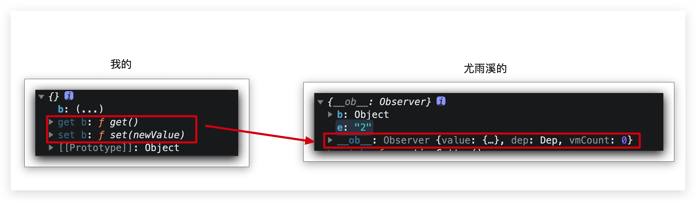

可以很清楚的发现在官方的数据中将observer类作为一个【不可遍历的】属性添加到了对象之中！

那么这个属性中有哪些内容呢？我们展开～

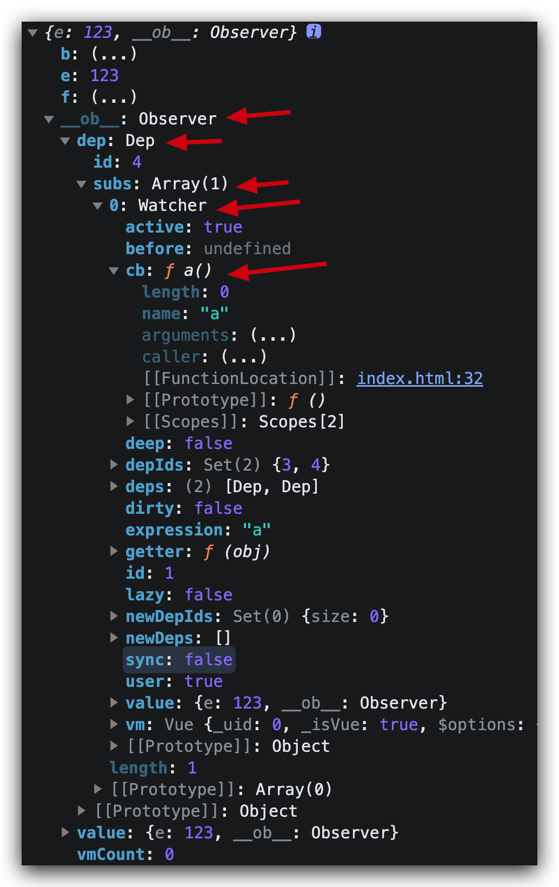

看到这里我们可以发现：这里触发的就是a对象下`__ob__`属性中watcher的回调！

【思考】 $set方法是怎么实现的呢？

1、在数据上添加一个不可枚举__ __ob__ __属性，用这个属性来存放一个observer的对象

2、在vue实例上定义成员方法$set

3、因为新增数据是非响应式的，所以在$set中将新增的属性变成响应式的

4、因为改变了原有对象，需要手动触发对象中的Dep.notify


【思考】 `__ob__`的作用是什么？

【回答】

此时需要判断当前数据是否是响应式的，并且需要调用【这个数据中的observer中的dep下的watch里面的回调】

所以需要将【这个数据中的observer中的dep下的watch里面的回调】在数据中以一个不可枚举的属性来存储

这个属性起一个比较奇怪的名字叫 `__ob__`


【思考】为什么`__ob__`是不可枚举属性呢？直接通过.运算符添加不行么？

【回答】因为`__ob__`属性本身是一个Observer对象，我们上一小节处理了对象的深层响应式

这里会对对象进行递归，如果`__ob__`是可枚举的，就会参与递归运算，造成递归的死循环，所以他是不可枚举的！


下面我们来添加`__ob__`

1、因为`__ob__`是一个不可枚举的属性，并且存入的是observer实例，所以在Onserver类中通过Object.defineProperty将`__ob__`属性添加到数据上，值为当前的实例，this

2、在定义observe方法的时候查看是否有`__ob__`属性，如果有就不需要重复new Observer


在Observer/index.js构造器中添加`__ob__`

~~~~js
class Observer {
  constructor(value) {
    // value：为数组或对象添加自定义属性__ob__ = this，
    // this：为当前 Observer 类的实例，实例上就有dep实例和里面的方法
    // value.__ob__ = this;	// 可被遍历枚举，会造成死循环
    // 定义__ob__ 属性为不可被枚举，防止对象在进入walk都继续defineProperty，造成死循环
    Object.defineProperty(value, '__ob__', {
      value: this,
      enumerable: false  // 不可被枚举
    });
    
    // 如果value是对象，就循环对象，将对象中的属性使用Object.defineProperty重新定义一遍
    this.walk(value); // 上来就走一步，这个方法的核心就是在循环对象
  }

  /**
   * 遍历对象
   *  循环data对象（不需要循环data原型上的方法），使用 Object.keys()
   * @param {*} data 
   */
  walk(data) {
    Object.keys(data).forEach(key => {
      // 使用Object.defineProperty重新定义data对象中的属性
      defineReactive(data, key, data[key]);
    });
  }
}
~~~~

然后我们在控制台输出一个 app.a 此时数据中，可以发现一个 ______ob__ ，用来判断当前变量是否是可观察的

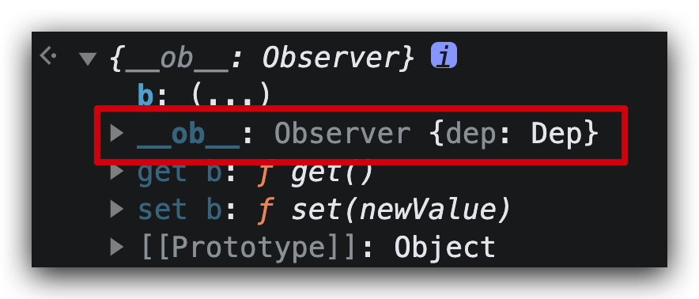

在observer/index.js的observe 方法中判断对象上是否存在 __ __ob__ __，如果有就不添加新的，如果没有实例化一个observer 添加到 value 对象上。

~~~~js
// src/observer/index.js
// 遍历数据将data中每一个对象变成可观察的observe
export function observe(value, cb) {
  // 类型判断，如果value不是对象就什么都不做
  if (!isObject(value)) return 
  let ob
  if (typeof value.__ob__ !== 'undefined') {
    ob = value.__ob__
  }
  else {
    ob = new Observer(value)
  }
  return ob
}
~~~~

此时我们通过observer类为vue中的简单数据添加了一个`__ob__`属性。


接下来我们完成后面的步骤：在vue原型上定义一个$set方法吧～

~~~~js
Vue.prototype.$set = function (obj, key, value) {
  console.log(obj, key, value, '$set执行')
  // 让新增数据也变成响应式的
  defineReactive(obj, key, value)
  // a对象追加属性手动触发a下的面的watcher中的回调
  obj.__ob__.dep.notify()
}
~~~~

试一试！

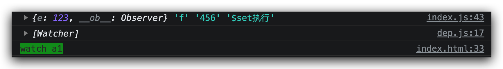


### 12、数组的监听

【目标】这一小节我们来实现数组的响应式！

在vue中的响应式系统，对于数组做了额外的处理，目的是为了提升性能。单纯通过数组索引来对数组进行响应式也会出现各种问题。所以在vue中通过对数组的7个方法进行重写（拓展）实现了数组固定方法的响应式机制。

【思考】数组改变本质上就是数组下标的改变，那么object.defineProperty方法可以监听数据下标的改变么？

【回答】可以实现，但是由于数组长度的不确定性，vue 并没有对数组下标进行object.defineProperty数据劫持

我们一起来看下面的这段代码

~~~~js
let arr = [1, 2, 3, 4, 5]
  arr.forEach((item, index) => {
    Object.defineProperty(arr, index, {
      get() {
        console.log(item, 'get')
      },
      set(val) {
        console.log(item, 'set')
      }
    })
  })
~~~~

再控制台查看输出：

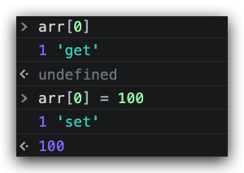

【注意】通过这样一个简单的例子我们需要明确一个概念，object.defineProperty实际上是可以对数组下标的修改就行劫持的，但是Vue处于性能考虑，并没有使用这一特性。

接下来我们在data中定义一个数组 然后向数组中push一个数据，然后我们看控制台的输出

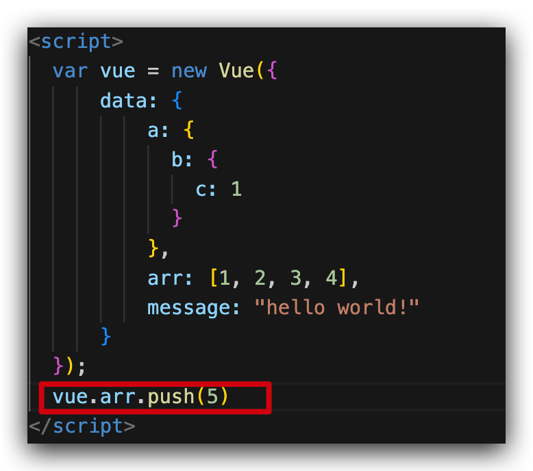

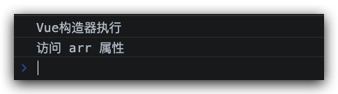

此时虽然操作了数组 arr 但是并没有监听到数组的改变，只劫持到数组的调用。对于数组这种比较特殊的数据类型的响应式设计，vue对于常见的数组方法push, pop, unshift, shift, splice, reverse, sort，进行了重新封装。

那么怎么对数组的方法进行重新封装呢？我们试一试下面的代码。

~~~~js
let arr = [1,2,3]
arr.push(4)
Array.prototype.myPush = function(val){
  console.log('调用拓展的Array方法myPush，劫持到arr被修改了')
  this.push(val)
}

arr.myPush(4)
~~~~


在上面这个例子中，我们针对数组的原生`push`方法定义个一个新的`myPush`方法，这个`myPush`方法内部调用了原生`push`方法，这样就保证了新的``myPush``方法跟原生`push`方法具有相同的功能，并且我们还可以在新的``myPush``方法内部干一些别的事情，比如通知变化。Vue内部就是这么实现的。

【前置知识】
1、Object.setPrototypeOf() 修改对象原型
Object.setPrototypeOf() 方法设置一个指定的对象的原型 ( 即, 内部[[Prototype]]属性）到另一个对象或null

~~~~js
Object.setPrototypeOf(obj, prototype)
~~~~

obj 要设置其原型的对象
prototype 该对象的新原型(一个对象 或 null)

2、Object.create() 创建一个新对象
Object.create()方法创建一个新对象，使用现有的对象来提供新创建的对象的__proto__

~~~~js
Object.create(proto，[propertiesObject])
~~~~

proto 新创建对象的原型对象。
propertiesObject 可选。需要传入一个对象，该对象的属性类型参照Object.defineProperties()的第二个参数。如果该参数被指定且不为 undefined，该传入对象的自有可枚举属性(即其自身定义的属性，而不是其原型链上的枚举属性)将为新创建的对象添加指定的属性值和对应的属性描述符。

返回一个新对象，带着指定的原型对象和属性。


有了以上的前置知识，下面我们对observer 类进行拓展，判断value是否是一个数组，判断数组的方法可以封装在src/utils.js中

~~~~js
// src/utils.js
/**
 * 判断是否是数组
 * @param {*} val 
 * @returns 
 */
export function isArray(val) {
  return Array.isArray(val)
}
~~~~

然后我们对数据类型进行判断，如果数组中的元素是对象需要对对象进行递归响应式的绑定

~~~~js
// observer/index.js
class Observer {
  constructor(value) {
    console.log('observer构造器执行', value);
    // value：为数组或对象添加自定义属性__ob__ = this，
    // this：为当前 Observer 类的实例，实例上就有 observeArray 方法；
    // value.__ob__ = this;	// 可被遍历枚举，会造成死循环
    // 定义__ob__ 属性为不可被枚举，防止对象在进入walk都继续defineProperty，造成死循环
    Object.defineProperty(value, '__ob__', {
      value: this,
      enumerable: false  // 不可被枚举
    });
    

    this.value = value
    if (isArray(value)) {
      // 代理原型...
      // 对数组中元素为对象的情况进行响应式
      this.observeArray(value)
    } else {
      // 如果value是对象，就循环对象，将对象中的属性使用Object.defineProperty重新定义一遍
      this.walk(value); // 上来就走一步，这个方法的核心就是在循环对象
    }
  }

  /**
   * 遍历对象
   *  循环data对象（不需要循环data原型上的方法），使用 Object.keys()
   * @param {*} data 
   */
  walk(data) {
    Object.keys(data).forEach(key => {
      // 使用Object.defineProperty重新定义data对象中的属性
      defineReactive(data, key, data[key]);
    });
  }
  /**
   * 遍历数组，对数组中的对象进行递归观测
   *  1）[[]] 数组套数组
   *  2）[{}] 数组套对象
   * @param {*} data 
   */
  observeArray(data) {
    // observe方法内，如果是对象类型，继续 new Observer 进行递归处理
    data.forEach(item => observe(item))
  }
}
~~~~

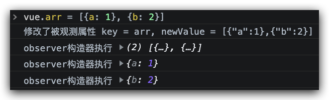

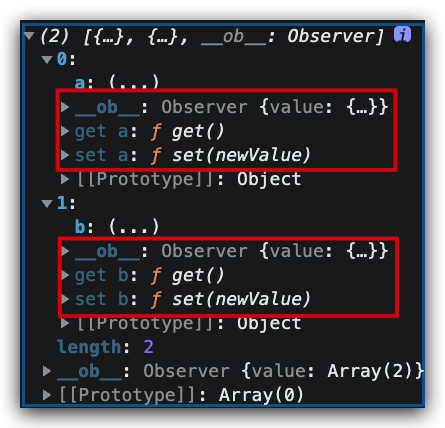

此时数组中的对象元素已经具有响应式，那么我们怎么重写Array对象中的方法呢？

这里使用了一种看起来很厉害的设计模式AOP


【拓展】什么是AOP切片编程

通过预编译或者动态代理实现在不修改源代码的情况下给程序动态统一添加某种特定功能的一种技术


采用原型代理，当我们调用`arr.push()`时，实际上是调用了`Array.prototype.push`，我们想对`push`方法进行特殊处理，除了重写该方法，还有一种手段，就是设置一个代理原型。

我们在数组实例和`Array.prototype`之间增加了一层代理来实现派发更新(依赖收集部分后面单独讲)，数组调用代理原型的方法来派发更新，代理原型再调用真实原型的方法实现原有的功能。

定义*/Observer/array.js* 

~~~~js
const arrayPrototype = Array.prototype // 缓存真实原型

// 需要处理的方法
const reactiveMethods = [
  'push',
  'pop',
  'unshift',
  'shift',
  'splice',
  'reverse',
  'sort'
]

// 增加代理原型 arrayMethods.__proto__ === arrayProrotype
// 然后将arrayMethods继承自数组原型
// 这里是面向切片编程思想（AOP）--不破坏封装的前提下，动态的扩展功能
export const arrayMethods = Object.create(arrayPrototype)

// 定义响应式方法
reactiveMethods.forEach((method) => {
  const originalMethod = arrayPrototype[method]
  // 在代理原型上定义重写后的响应式方法
  Object.defineProperty(arrayMethods, method, {
    value: function reactiveMethod(...args) {
      const result = originalMethod.apply(this, args) // 执行默认原型的方法
      // ...派发更新...
      console.log('监听数组方法')
      
      return result
    },
    enumerable: false,
    writable: true,
    configurable: true
  })
})
~~~~

在上面的代码中，首先创建了继承自`Array`原型的空对象arrayMethods，接着在`arrayMethods`上使用`object.defineProperty`方法将那些可以改变数组自身的7个方法遍历逐个进行封装。最后，当我们使用`push`方法的时候，其实用的是`arrayMethods`，而`arrayMethods.push`就是封装的新函数`reactiveMethod`，也就后说，实标上执行的是函数`reactiveMethod`，而`reactiveMethod`函数内部执行了`originalMethod`函数，这个`originalMethod`函数就是`Array.prototype`上对应的原生方法。 那么，接下来我们就可以在`reactiveMethod`函数中做一些其他的事，比如说监听数组方法派发更新。

在observer中使用

~~~~js
import { arrayMethods } from "./array.js";

// 对 value 是数组和对象的情况分开处理
if (isArray(value)) {
  // 将新定义的数组方法 替换到data上的__proto__上
  value.__proto__ = arrayMethods;
  console.log(value)
  this.observeArray(value);	// 数组的深层观测处理
} else {
  // 如果value是对象，就循环对象，将对象中的属性使用Object.defineProperty重新定义一遍
  this.walk(value); // 上来就走一步，这个方法的核心就是在循环对象
}
~~~~

这样，对象`obj: { arr: [...] }`就会变为`obj: { arr: [..., __ob__: {} ], __ob__: {} }`

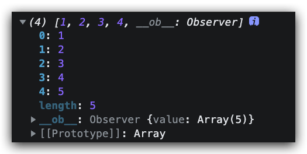

并且此时在代码中执行arr.push() 由于 触发了push方法此时 监听数组方法会输出

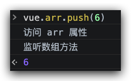

此时数组新增的元素是在绑定ob之后发生的 新增的内容并没有被监听到

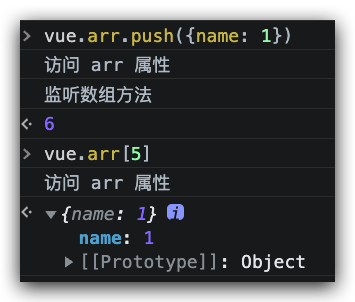

所以需要重新调用__ __ob__ __下的observe对数组新增元素进行监听

1、需要知道数组新增了哪些元素

2、将这些新增的元素变成响应式

3、添加依赖收集

~~~~js
// 定义响应式方法
reactiveMethods.forEach((method) => {
  const originalMethod = arrayPrototype[method]
  // 在代理原型上定义重写后的响应式方法
  Object.defineProperty(arrayMethods, method, {
    value: function reactiveMethod(...args) {
      const result = originalMethod.apply(this, args) // 执行默认原型的方法
      // ...派发更新...
      console.log('监听数组方法')
       // this代表的就是数据本身 比如数据是{a:[1,2,3]} 那么我们使用a.push(4)  this就是a  ob就是a.__ob__ 这个属性就是上段代码增加的 代表的是该数据已经被响应式观察过了指向Observer实例
      const ob = this.__ob__; // <========

      // 这里的标志就是代表数组有新增操作
      let inserted;
      switch (method) {
        case "push":
        case "unshift":
          inserted = args;
          break;
        case "splice":
          inserted = args.slice(2);
        default:
          break;
      }
      // 如果有新增的元素 inserted是一个数组 调用Observer实例的observeArray对数组每一项进行观测
      if (inserted) ob.observeArray(inserted); // <========
      // 在这里检测到数组改变了之后从而触发视图更新的操作 
      ob.dep.notify()
      return result
    },
    enumerable: false,
    writable: true,
    configurable: true  
  })
})

~~~~

此时新增的对象也变成了响应式的

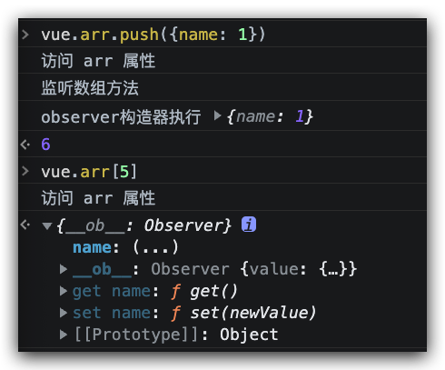

至此我们通过实现重写数组原有的7个方法实现数组方法的监听

那么 如果对象中有数组我们又该如何处理呢？

我们需要对外层对象和内层数组分别进行依赖收集（略）

~~~~js
function defineReactive(obj, key, value) {
  // childOb 是数据组进行观测后返回的结果，内部 new Observe 只处理数组或对象类型
  let childOb = observe(value);// 递归实现深层观测
  let dep = new Dep();  // 为每个属性添加一个 dep
  Object.defineProperty(obj, key, {
    // get方法构成闭包：取obj属性时需返回原值value，
    // value会查找上层作用域的value，所以defineReactive函数不能被释放销毁
    get() {
      // 对象属性的依赖收集
      dep.depend();
      // 数组或对象本身的依赖收集
      if(childOb){  // 如果 childOb 有值，说明数据是数组或对象类型
        // observe 方法中，会通过 new Observe 为数组或对象本身添加 dep 属性
        childOb.dep.depend();    // 让数组和对象本身的 dep 记住当前 watcher
        if(Array.isArray(value)){// 如果当前数据是数组类型
          // 可能数组中继续嵌套数组，需递归处理
          dependArray(value)
        }  
      }
      return value;
    },
    set(newValue) { // 确保新对象为响应式数据：如果新设置的值为对象，需要再次进行劫持
      console.log("修改了被观测属性 key = " + key + ", newValue = " + JSON.stringify(newValue))
      if (newValue === value) return
      observe(newValue);  // observe方法：如果是对象，会 new Observer 深层观测
      value = newValue;
      dep.notify(); // 通知当前 dep 中收集的所有 watcher 依次执行视图更新
    }
  })
}

/**
 * 使数组中的引用类型都进行依赖收集
 * @param {*} value 需要做递归依赖收集的数组
 */
function dependArray(value) {
  // 数组中如果有对象:[{}]或[[]]，也要做依赖收集（后续会为对象新增属性）
  for(let i = 0; i < value.length; i++){
    let current = value[i];
    // current 上如果有__ob__，说明是对象，就让 dep 收集依赖（只有对象上才有 __ob__）
    current.__ob__ && current.__ob__.dep.depend();
    // 如果内部还是数组，继续递归处理
    if(Array.isArray(current)){
      dependArray(current)
    }
  }
}
~~~~


【总结】

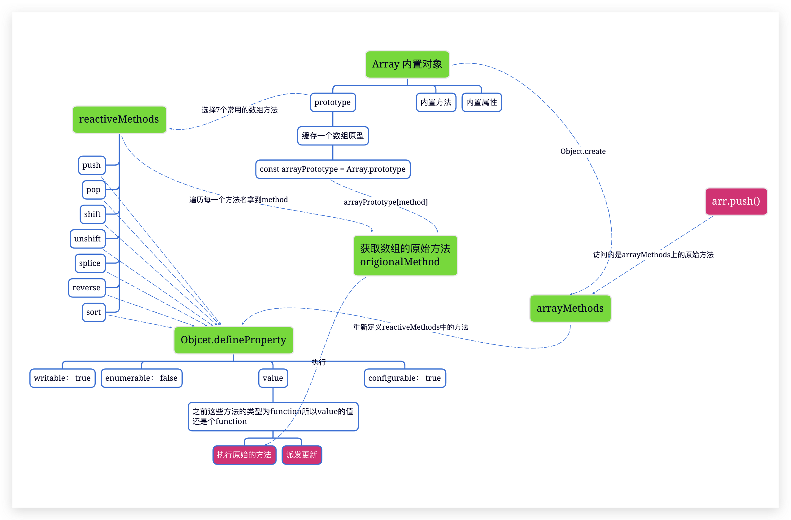

 chr


## 一、章节概述

今天的主题是通过 Template 获取 ast 语法树，这一天主要是实现vue的dom不同数据结构之间的转换。

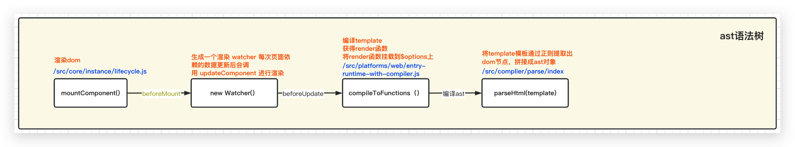

## 二、Vue虚拟dom更新机制(源码解析)

### 1、如何将数据渲染到页面上

【目标】了解vue中dom渲染的大致流程

在Vue初始化的时候主要完成了两件事，一个是数据状态响应式的初始化，另一个是dom渲染并且将数据渲染到页面上，我们已经实现了数据的处理，接下来我们继续完成dom的处理

这一部分中我们会了解到

- vue的差值表达式的渲染和指令的使用
- vue的新旧节点的比对
- vue的就地复用实现和dom节点更新

为了实现这些特性，Vue中创造了模板template（类似于react的Jsx），vue中支持template和jsx，在vue2中使用jsx性能会更高，但是在vue3中由于对模板编译做了一些优化使用jsx反而性能会低一点

那么Vue是怎么将template转化成html的呢？首先Vue对template进行模板解析，将template转换为js代码

在转化过程中使用ast语法树对html结构进行描述，通过ast树形结构将代码重构成js语法也就是虚拟dom后面对于dom的操作只操作js即可，vue模板编译环节首先将template编译成render函数，通过render函数返回旧的dom，更新时再次通过render函数生成新的dom，使用diff进行对比，根据对比的结果更新真实dom

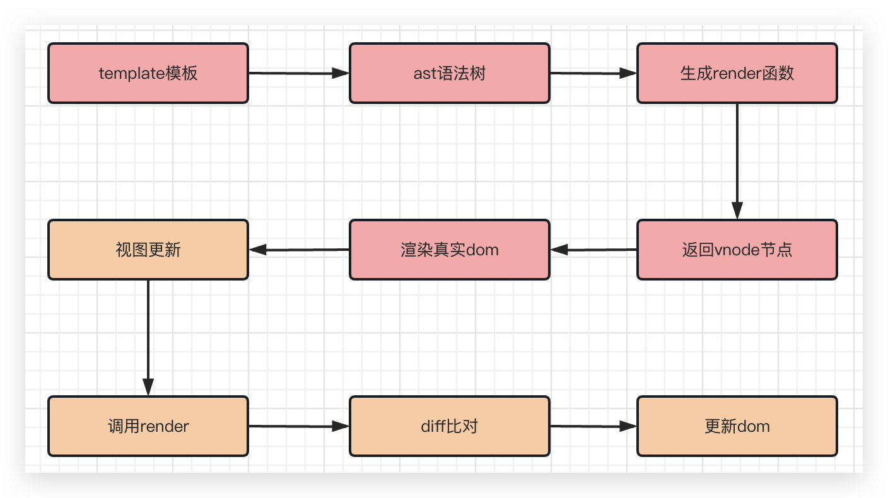

【思考】为什么Vue中要提供如此复杂的dom系统处理dom更新？

【回答】

ast 语法树 是模板通过正则规则匹配截取时候的产物，更具有普适性 比如多平台开发跨端开发中ast结构可以根据不同平台生成不同平台的dom结构

render 函数 是将ast语法树的结构通过栈进行解析后拼接出的产物，他是整个dom系统中最为特殊的部分，因为它是一个函数其他的内容都是结构化的数据。render函数的作用是【调用】， 将节点与数据、属性、方法、样式、指令、事件、双向绑定等关联起来，通过with（this）进行了取值，每一次数据更新的时候驱动视图的修改都会重新调用render获取新的虚拟dom

vnode 节点是render函数调用之后的产物，他是最接近真实节点的dom结构，但是在vue中做了简化为后面的大布丁提供了良好的数据基础，这里需要额外注意的是vnode中的数据已经通过render转换成真实的值了。

diff 对比是将新旧dom进行比较更新的方法，里面定义多种不同的对比方式，根据更新类型的不同可以实现高效的对比更新。

在vue中各个部分各司其职，缺一不可，目前来看复杂的转换逻辑的背后是对可拓展性和性能的妥协。


## 三、模板解析的处理

【目标】回顾模板渲染的流程图，这一步我们生成ast语法树结构


### 1、$mount 的声明获取模板内容

【目标】这一小节我们需要定义$mount方法作为整个dom系统的入口

在`$mount`中，需要拿到`el`挂载点所指向的真实`dom`元素，并使用新内容将它替换掉：

~~~~js
// src/index.js
function Vue(options) {
  console.log('Vue构造器执行')
  this._data = options.data;
  const vm = this;
  vm.$options = options
  console.log('observe方法执行')
  observe(this._data, options.render)
  _proxy.call(this, options.data)
  if (options.el) {
    // 将数据挂在到页面上（此时,数据已经被劫持）
    this.$mount(options.el)
  }
}
// 支持 new Vue({el}) 和 new Vue().$mount 两种情况
Vue.prototype.$mount = function (el) {
  const vm = this;
  el = document.querySelector(el); // 获取真实的元素
  vm.$el = el; // vm.$el：当前页面上的真实元素
}
~~~~

那么，如何拿到`el`挂载点指向的真实`dom`元素？
在`dom`操作中，获取内容有两个方法：`outerHTML`、`innerHTML`由于希望能够使用新内容替换掉老内容，所以，需要使用`outerHTML`来拿到全部内容；下面结合Vue中不同模板的优先级特性，大致逻辑如下：

~~~~js
// 支持 new Vue({el}) 和 new Vue().$mount 两种情况
Vue.prototype.$mount = function (el) {
    console.log("#### 进入 $mount，el = " + el + "####")
    const vm = this;
    const opts = vm.$options;
    el = document.querySelector(el); // 获取真实的元素
    vm.$el = el; // vm.$el 表示当前页面上的真实元素
    console.log("获取真实的元素，el = " + el)
  
  	let template = opts.template;
    if (!template) {
			template = el.outerHTML;
    }    	
}
~~~~

现在我们已经能够获取到页面中的模板字符串 并且挂载到vue实例上，接下来需要进行模板解析

### 2、 模板编译入口方法compileToFunction的定义

【目标】定义`compileToFunction` 入口，以及`compileToFunction`方法中的两个核心方法 parser 和 generate


在前面分析`vue`数据渲染流程中提到：`template` 模板 -> `ast` 语法树 -> `render` 函数，模板编译的最终结果就是 `render` 函数；所以我们需要定义一个方法生成`render`函数，这个方法就是`compileToFunction`方法，他需要以下两步核心操作：

1、通过`parser`：将模板`（template或html）`内容编译为ast语法树；
2、通过`generate`：根据ast语法树生成为render函数；


今天主要实现templae 转换成ast语法树，即将

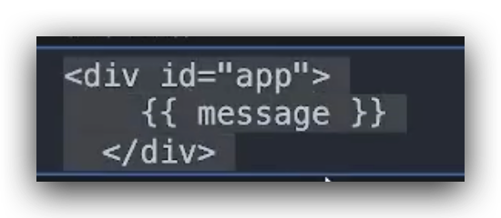

转换成

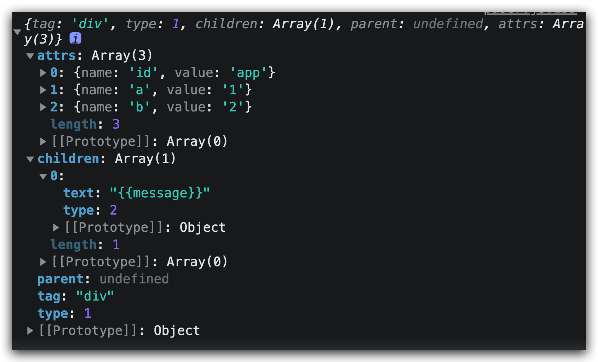

的结构


首先我们新建`src/compiler/index.js `定义一个`compileToFunction`方法，并导入

~~~~js
//  src/compiler/index.js

export function compileToFunction(template) {
  // 1，将模板变成 AST 语法树
  let ast = parser(template);
  // 2，使用 AST 生成 render 函数
  let code = generate(ast);
}

function parser(template) {
  console.log("parser-template : " + template)
}

function generate(ast) {
  console.log("parserHTML-ast : " + ast)
}
~~~~

~~~~js
// /src/index.js
import  {compileToFunction} from './compiler/index.js'

Vue.prototype.$mount = function (el) {
  console.log('#######进入dom挂载########')
  const vm = this
  const opts = vm.$options
  el = document.querySelector(el)
  vm.$el = el
  console.log('获取的真实元素', el)
  // 判断是否有render，如果有就使用render函数
  // 判断是否有template 如果有就使用template
  // 使用outerHtml获取html内容
  if (!opts.render) {
    console.log('options上没有render')
    let template = opts.template
    if (!template) {
      console.log("options 中没有 template, 取 el.outerHTML = " + el.outerHTML)
      template = el.outerHTML
    } else {
      console.log('options上有template')
    }
    let render = compileToFunction(template);
    opts.render = render; // <==== 将render保存在opt上
    console.log('######compileToFunction执行######')
  } else {
    console.log('options上有render')
  }
}
~~~~

在 Vue2 中，compileToFunction 方法是整个Vue编译的入口，完成以上两步操作之后，template 模板最终将会被编译成为render函数。

而将 html 模板编译为 ast 语法树，就需要对 html 模板进行解析，解析方式就是使用正则不断匹配和处理


### 2、模板的处理原理

【目标】了解模板字符串的分割方法和原理，作为下一步定义parser方法的依据

我们先用一个动图来初探模板解析过程

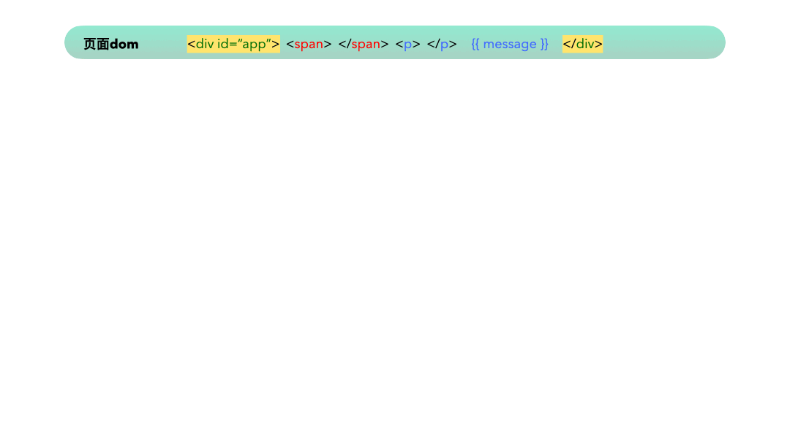


通过上面的图，我们发现模板解析的过程就是使用正则对`html`模板进行顺序解析和处理，每处理完一段，就将这部分截取掉，就这样不停的进行解析和截取，直至将整个模板全部解析完毕；用文字表示如下：

~~~~html
<!-- start：从头开始，使用正则不断进行匹配和截取 -->

<!-- 1，解析开始标签，并截取删除 -->
<div><span></span>{{ message }}</div>		开始标签：<div>
<!-- 2，解析开始标签，并截取删除 -->
     <span></span>{{ message }}</div>   开始标签：<span>
<!-- 3，解析结束标签，并截取删除 -->
           </span>{{ message }}</div>		结束标签：</span>
<!-- 4，解析文本内容，并截取删除 -->
                  {{ message }}</div>		文本内容：{{ message }}
<!-- 5，解析结束标签，并截取删除 -->
                               </div>		结束标签：</div> 
<!-- end：全部匹配完成 -->
~~~~

根据示例的逻辑，在`parser`方法中，可以使用`while`循环对模板不停执行截取操作，直至全部解析完毕后，即可构建出`ast`语法树：

~~~~js
function parser(html) {
  while(html){
    // todo: 解析 html 并构建 ast 语法树
    break
  }
}
~~~~

下面我们来看一下用来识别节点的正则规则

### 3、正则表达式说明

【目标】了解vue中模板截取的字符串匹配规则

在`Vue2`源码中，使用正则对`html`标签和内容进行匹配并解析出结果，涉及相关正则如下：

~~~~js
// 匹配标签名 my-button
// 第一个\：用来转译第二个\，所以第一组\\相当于\；
// 第三个\：用来转译第四个\，所以第二组\\也相当于\；
// 字符串\\-转译后，成为正则中的\-，正则中表示-；
// 字符串\\.转译后，成为正则中的\.，正则中表示.；
const ncname = `[a-zA-Z_][\\-\\.0-9_a-zA-Z]*`;  
// 命名空间标签 aa:aa-xxx
// ?:: 表示匹配，但不捕获；
// ${ncname}: 标签名，参考ncname正则；
// \\:: 正则中的\:，表示后面有一个冒号；
// ?: 最后的问号，表示前面的内容可有可无；比如：aa:可以没有
// ${ncname} 标签名，参考ncname正则；
// 用于匹配aa:aa-xxx，这种标签叫做“命名空间标签”，很少会使用到；
const qnameCapture = `((?:${ncname}\\:)?${ncname})`;
// 开始标签-捕获标签名
// ^<：表示以<开头；
const startTagOpen = new RegExp(`^<${qnameCapture}`); 
// 结束标签-匹配标签结尾的 </div>
// ^<\\/：<符号开头，后面跟一个/，即以</开头；
// ${qnameCapture}：参考命名空间标签；
// [^>]*：中间可以是任意数量不为>的字符；
// >：最后一位必须是>；
const endTag = new RegExp(`^<\\/${qnameCapture}[^>]*>`);
// 匹配属性这个相对比较复杂
// ^\s*： 开头为 n 个空格（0个或n个空格）
// [^\s"'<>\/=]+: 匹配属性名； 不是空格、引号、尖脚号、等号的n个字符；
// ?:\s*(=)\s*： 空格和空格之间可以夹着一个等号=；
// ?:“([“]*)”+|'([‘]*)’+|([^\s”'=<>`]+) ：匹配属性值
// "([^"]*)": 可能是双引号；
// '([^']*)': 可能是单引号；
// [^\s"'=<>`]+: 不是空格、引号、尖脚号、等号的 n 个字符；
// 属性的三种可能写法
// 情况 1：双引号的情况，如：aaa="xxx";
// 情况 2：单引号的情况，如：aaa='xxx';
// 情况 3：没引号的情况，如：aaa=xxx;
const attribute = /^\s*([^\s"'<>\/=]+)(?:\s*(=)\s*(?:"([^"]*)"+|'([^']*)'+|([^\s"'=<>`]+)))?/; 
// 匹配标签结束的 >
// ^\s*: 空格 n 个
// (\/?)>: 尖角号有以下两种情况
// -/>: 自闭合
// ->: 没有/的闭合
const startTagClose = /^\s*(\/?)>/;
// 匹配 {{}}表达式
const defaultTagRE = /\{\{((?:.|\r?\n)+?)\}\}/g;
~~~~

为了更好的理解正则可以将正则的语法在正则可视化工具中查看https://jex.im/regulex大家结合注释来分析每个正则的作用 


### 4、ast语法树的生成

模板解析的思路：对模板不停截取，直至全部解析完毕；

模板解析代码实现：在`while`循环，使用正则不断的对`html`模板中的有效信息进行匹配和截取；看内容的开头第一个字符是否为`<`尖角号：如果是尖角号，说明是标签；如果不是尖角号，说明是文本；

#### 1、节点类型判断

【目标】能够区分模板中的标签节点和文本节点

方法：判断内容开头的第一个字符是否为尖角号`<` ：

- 如果是尖角号，说明是标签
- 如果不是尖角号，说明是文本

~~~~js
// src/compiler/index.js#parserHTML

function parser(html) {
  while(html){
    // 解析标签or文本，判断html的第一个字符，是否为 < 尖角号
    let index = html.indexOf('<');
    if(index == 0){
      console.log("是标签")
    } else{
      console.log("是文本")
    }
  }
}
~~~~

#### 2、解析开始标签parseStartTag方法

【目标】能够使用match方法匹配开始标签，并输出开始标签。

包含尖括号 < 的情况：可能是开始标签 <div>，也可能是结束标签</div>;

所以，当解析到标签时，应先使用正则匹配开始标签；如果没有匹配成功，再使用结束标签进行匹配

parseStartTag方法：匹配开始标签，返回匹配结果，即标签名；

【注意】匹配结果的索引 1 ，为标签名

~~~~js
// src/compiler/index.js#parserHTML

function parser(html) {
  /**
  * 匹配开始标签，返回匹配结果(开始标签名)
  */
  function parseStartTag() {
    // 匹配开始标签
    const start = html.match(startTagOpen);
    // 构造匹配结果对象：包含标签名和属性
    if (start) {
      const match = {
        tagName: start[1], // 数组索引 1 为标签名
        attrs: []
      }
      console.log("match结果：" + JSON.stringify(match))
      // todo 删除字符串中匹配完成的部分
      
      return match;
    }
  }

  // 对模板不停做匹配和截取操作，直至全部解析完毕
  while (html) {
    // 解析标签和文本(看开头是否为 <)
    let index = html.indexOf('<');
    if (index == 0) {
      console.log("解析 html：" + html + ",结果：是标签")
      // 如果是标签，继续解析开始标签和属性
      const startTagMatch = parseStartTag();// 匹配开始标签，返回匹配结果
      // 1，匹配到开始标签：无需执行后续逻辑，直接进入下一次 while，继续解析后续内容
      if (startTagMatch) {
        console.log('匹配到了开始标签' + JSON.stringify(startTagMatch))
        // continue;
      }
    } else {
      console.log("解析 html：" + html + ",结果：是文本")
    }
    // 当html的元素被截取完成之后循环退出
    // 这里暂时强制退出循环防止死循环 之后会删除掉
    break
  }
}
~~~~

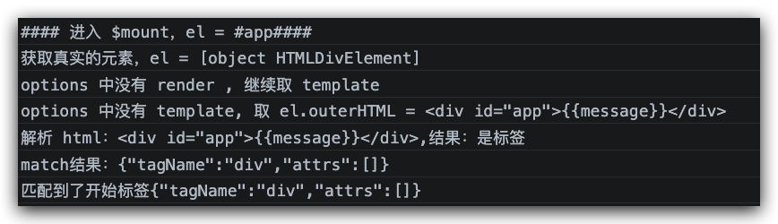

#### 3、截取匹配完成的部分 advance 方法

【目标】通过定义的advance方法实现标签的截取，并返回截取后的剩余标签部分

开始标签解析完成后，需要将匹配完成的部分截掉，达到如下效果：

~~~~html
<!-- 解析前 -->
<div id=app>{{message}}</div>
<!-- 解析后：开始标签<div被截掉 -->
     id=app>{{message}}</div>
~~~~

为达到以上效果，创建`advance`(前进)方法：截取`html`内容至当前已解析的位置，即删除已处理完成的部分；

~~~~js
// src/compiler/index.js#parserHTML

function parserHTML(html) {
  /**
   * 截取字符串
   * @param {*} len 截取长度
   */
  function advance(len){
    html = html.substring(len);
  }

  /**
  * 匹配开始标签，返回匹配结果(开始标签名)
  */
  function parseStartTag() {
    // 匹配开始标签
    const start = html.match(startTagOpen);
    // 构造匹配结果对象：包含标签名和属性
    if (start) {
      const match = {
        tagName: start[1], // 数组索引 1 为标签名
        attrs: []
      }
      console.log("match结果：" + JSON.stringify(match))
      // todo 删除字符串中匹配完成的部分
      advance(start[0].length)
      console.log("截取后的 html：" + html)
      return match;
    }
  }
  ......
}
~~~~

调试并查看截取后的`html`片段：

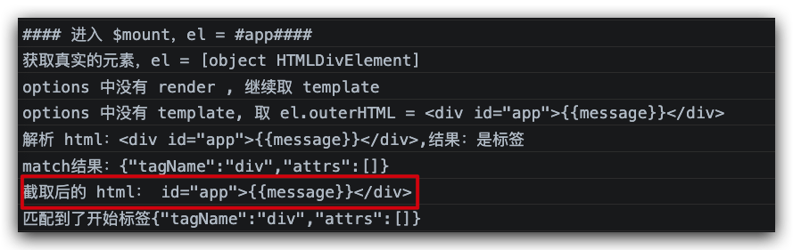

#### 4，解析开始标签中的属性-while循环

【目标】通过while循环将字符串从头截取到尾部直至参数html变成空字符串停止循环

```html
id="app">{{message}}</div>
```

在开始标签中，由于可能存在多个属性，因此这部分需要进行多次处理；

```js
// src/compiler/index.js#parserHTML#parseStartTag

/**
  * 匹配开始标签，返回匹配结果(开始标签名)
  */
  function parseStartTag() {
    // 匹配开始标签
    const start = html.match(startTagOpen);
    // 构造匹配结果对象：包含标签名和属性
    if (start) {
      const match = {
        tagName: start[1], // 数组索引 1 为标签名
        attrs: []
      }
      console.log("match结果：" + JSON.stringify(match))
      // todo 删除字符串中匹配完成的部分
      advance(start[0].length)

      // ******* 开始解析标签的属性 id="app" a=1 b=2>*******//
      let end;  // 是否匹配到开始标签的结束符号 > 或 /> 
      let attr; // 存储属性匹配的结果
      // 匹配并获取属性，放入 match.attrs 数组
      // 例如 <div>标签：当匹配到字符 >，表示标签结束，不再继续匹配标签内的属性
      //    attr = html.match(attribute)  匹配属性并赋值当前属性的匹配结果
      //    !(end = html.match(startTagClose))   没有匹配到开始标签的结束符号 > 或 />
      while (!(end = html.match(startTagClose)) && (attr = html.match(attribute))) {
        // 将匹配到的属性记录到数组 match.attrs(属性对象包含属性名和属性值)
        // 因为没在vue环境中所以只有attr[3]一种情况
        match.attrs.push({ name: attr[1], value: attr[3] || attr[4] || attr[5] })
        // 截取掉已匹配完成的属性，如：xxx=xxx
        advance(attr[0].length)
      }

      // 当匹配到开始标签的关闭符号 > 时，当前标签处理完成，while 结束
      // 此时，<div id="app" 处理完成，需要连同关闭符号 > 一起截取掉
      if (end) {
        advance(end[0].length)
      }

      console.log("截取后的 html：" + html)
      
      // 开始标签处理完成后，返回匹配结果：tagName 标签名 + attrs 属性对象
      return match;
    }
  }
```

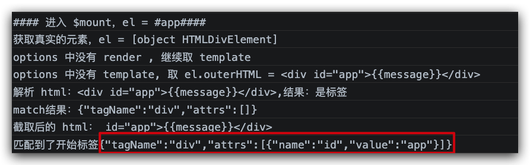

【备注】前面提到过，属性的值可能是`"xxx"`、`'xxx'`、`xxx`三种之一，所以属性取值为`attr[3] || attr[4] || attr[5]`，即取匹配结果中有值的一个即可；

【总结】**开始标签处理过程的详细说明**

~~~~html
<div id="app" a='1' b=2>
~~~~

对开始标签处理过程的每一步进行说明：

1、以 < 开头，说明是标签；此时，可能是开始标签，也可能是结束标签
2、匹配 正则startTagOpen，获取属性名和属性
3、匹配 <div 剩 id="app" a='1' b=2>
4、匹配 id="app" 剩 a='1' b=2>
5、匹配 a='1' 剩 b=2>
6、匹配 b=2 剩 >
7、匹配到 > 时，匹配结束 while 循环终止
8、至此，开始标签就解析完成了

注意：对于`match`的匹配结果，`match[0]`表示到的匹配内容，`match[1]`表示捕获到的内容

#### 5、处理剩下的结束标签及文本

~~~~js
// src/compiler/index.js

/**
  * 匹配开始标签，返回匹配结果(开始标签名)
  */
  function parseStartTag() {...}

  // 对模板不停做匹配和截取操作，直至全部解析完毕
  while (html) {
    // 解析标签和文本(看开头是否为 <)
    let index = html.indexOf('<');
    if (index == 0) {
      console.log("解析 html：" + html + ",结果：是标签")
      // 如果是标签，继续解析开始标签和属性
      const startTagMatch = parseStartTag();// 匹配开始标签，返回匹配结果
      // 1，匹配到开始标签：无需执行后续逻辑，直接进入下一次 while，继续解析后续内容
      if (startTagMatch) {
        console.log('匹配到了开始标签' + JSON.stringify(startTagMatch))
        continue; // <==== 放开
      }
      // 2，未匹配到开始标签：此时有可能为结束标签</div>
      // 如果匹配到结束标签，无需执行后续逻辑，直接进入下一次 while，继续解析后续内容

      // 如果开始标签没有匹配到，有可能是结束标签 </div>
      let endTagMatch;
      // 匹配到了，说明是结束标签
      if (endTagMatch = html.match(endTag)) {
        // 删除已匹配完成的部分
        advance(endTagMatch[0].length)
        continue; // <==== 放开
      }

    } else {
      
      console.log("解析 html：" + html + ",结果：是文本")
      // 此时的 html 片段为：hello</div>
      // 获取文本部分
      let chars = html.substring(0, index)
      // 删除已匹配完成的部分
      advance(chars.length)
    }
    // 当html的元素被截取完成之后循环退出
    // 这里暂时强制退出循环防止死循环 之后会删除掉
    // break
  }
}
~~~~


##  四、树形结构生成

### 1、构造ast的树形结构

【目标】了解如何将拆分的字符串拼接成ast语法树形结构

下面是一段常见的dom结构，我们逐层拆分一下

~~~~html
<div><sapn></span><p></p></div>
{
	tag: 'div',
	children: [
		{
			tag: 'span',
			children: []
  	},
		{
			tag: 'p',
			children: []
  	}
  ]
}
~~~~

`html`标签特点：成对出现（开始标签 + 结束标签），如：`<span>` 和 `</span>`；基于模板解析从左到右的顺序和以上`html`标签特点，就可以借助栈型的数据结构来辅助构建元素的父子关系；

~~~~shell
将解析到的标签名按顺序放入栈中：

[div]

[div,span]        span 是 div 的儿子

[div,] span,span  span 标签闭合，span 出栈，将 span 作为 div 的儿子

[div,p]           p 是 div 的儿子

[div,] p,p        p 标签闭合，p 出栈，将 p 作为 div 的儿子(即 p 和 span 是同层级的兄弟)

[] div,div        div 标签闭合 div出栈
~~~~

在栈中如果出现了一个开始标签，后面出现了一对标签说明该标签是这个开始标签节点下的子集，根据这样的对应关系，通过以上逻辑，借助栈的数据结构，就能够模拟出了`html`元素的父子关系了，为了构造这样一个栈的结构，我们需要定义三个方法start用于向栈内发射标签，text方法，用于在栈内的父节点上绑定文本属性，end方法用于在栈内做标签成对匹配的校验。

我们用下面一张图来初探ast语法树构建的过程。


### 2、抛出开始标签、结束标签及文本

【目标】定义start方法 end方法 text方法并在适当的位置调用，为下一步入栈做准备

将开始标签的状态（开始标签、结束标签、文本标签）发射出去，编写三个发射状态的方法，分别用于向栈内发射开始标签、结束标签、文本标签

~~~~js
// src/compiler/index.js

// 开始标签
function start(tagName, attrs) {
  console.log("start", tagName, attrs)
}

// 结束标签
function end(tagName) {
  console.log("end", tagName)
}

// 文本标签
function text(chars) {
  console.log("text", chars)
}
~~~~

当匹配到开始标签、结束标签、文本时，将数据发送出去

~~~~js
// src/compiler/index.js

/**
  * 匹配开始标签，返回匹配结果(开始标签名)
  */
  function parseStartTag() {
    // 匹配开始标签
    const start = html.match(startTagOpen);
    // 构造匹配结果对象：包含标签名和属性
    if (start) {
      const match = {
        tagName: start[1], // 数组索引 1 为标签名
        attrs: []
      }
      console.log("match结果：" + JSON.stringify(match))
      // todo 删除字符串中匹配完成的部分
      advance(start[0].length)

      // ******* 开始解析标签的属性 id="app" a=1 b=2>*******//
      let end;  // 是否匹配到开始标签的结束符号 > 或 /> 
      let attr; // 存储属性匹配的结果
      // 匹配并获取属性，放入 match.attrs 数组
      // 例如 <div>标签：当匹配到字符 >，表示标签结束，不再继续匹配标签内的属性
      //    attr = html.match(attribute)  匹配属性并赋值当前属性的匹配结果
      //    !(end = html.match(startTagClose))   没有匹配到开始标签的结束符号 > 或 />
      while (!(end = html.match(startTagClose)) && (attr = html.match(attribute))) {
        // 将匹配到的属性记录到数组 match.attrs(属性对象包含属性名和属性值)
        match.attrs.push({ name: attr[1], value: attr[3] || attr[4] || attr[5] })
        // 截取掉已匹配完成的属性，如：xxx=xxx
        advance(attr[0].length)
      }

      // 当匹配到开始标签的关闭符号 > 时，当前标签处理完成，while 结束
      // 此时，<div id="app" 处理完成，需要连同关闭符号 > 一起截取掉
      if (end) {
        advance(end[0].length)
      }

      console.log("截取后的 html：" + html)

      // 开始标签处理完成后，返回匹配结果：tagName 标签名 + attrs 属性对象
      return match;
    }
  }

  // 开始标签
  function start(tagName, attrs) {
    console.log("start", tagName, attrs)
  }

  // 结束标签
  function end(tagName) {
    console.log("end", tagName)
  }

  // 文本标签
  function text(charts) {
    console.log("text", chars)
  }

  // 对模板不停做匹配和截取操作，直至全部解析完毕
  while (html) {
    // 解析标签和文本(看开头是否为 <)
    let index = html.indexOf('<');
    if (index == 0) {
      console.log("解析 html：" + html + ",结果：是标签")
      // 如果是标签，继续解析开始标签和属性
      const startTagMatch = parseStartTag();// 匹配开始标签，返回匹配结果
      // 1，匹配到开始标签：无需执行后续逻辑，直接进入下一次 while，继续解析后续内容
      if (startTagMatch) {
        // 匹配到开始标签，调用start方法，传递标签名和属性
        start(startTagMatch.tagName, startTagMatch.attrs)
        console.log('匹配到了开始标签' + JSON.stringify(startTagMatch))
        continue; // <==== 放开
      }
      // 2，未匹配到开始标签：此时有可能为结束标签</div>
      // 如果匹配到结束标签，无需执行后续逻辑，直接进入下一次 while，继续解析后续内容

      // 如果开始标签没有匹配到，有可能是结束标签 </div>
      let endTagMatch;
      if (endTagMatch = html.match(endTag)) {// 匹配到了，说明是结束标签
        // 匹配到开始标签，调用 start 方法，向外传递标签名和属性
        end(endTagMatch[1])
        // 删除已匹配完成的部分
        advance(endTagMatch[0].length)
        continue; // <==== 放开
      }

    } else {
      console.log("解析 html：" + html + ",结果：是文本")
      // 此时的 html 片段为：hello</div>
      let chars = html.substring(0, index)
      // 向外传递文本
      text(chars);
      // 删除已匹配完成的部分
      advance(chars.length)
    }
    // 当html的元素被截取完成之后循环退出
    // 这里暂时强制退出循环防止死循环 之后会删除掉
    // break
  }
}
~~~~

至此，通过对`html`模板的解析，已经获取到了模板中的标签名、属性等关键信息，后续再通过这些信息构建出`AST`语法树；

使用正则对 html 模板进行解析和处理，匹配到模板中的标签和属性

- 解析开始标签-parseStartTag方法
- 截取匹配完成的部分-advance方法
- 解析开始标签中的属性-while循环
- 开始标签处理过程的详细说明
- 对开始标签、结束标签及文本的发射处理

【尝试】在控制台输出一下内容查看解析语法树之后的输出

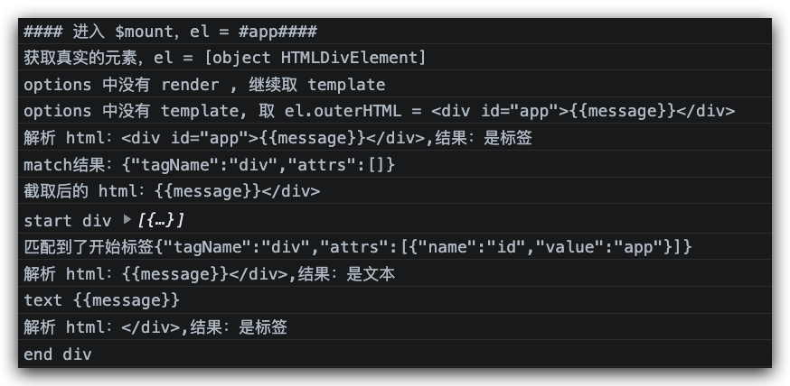

### 3、ast 节点元素的数据结构

【目标】通过vue源码的查询定义一份返回ast节点的基本结构的工厂函数。

在构建父子关系（标签）的对象中，我们还需要记录需要记录以下信息：

~~~~js
// 工厂函数构建 AST 元素节点
function createASTElement(tag, attrs, parent) {
  return {
    tag,          // 标签名
    type:1,       // 元素
    children:[],  // 儿子
    parent,       // 父亲
    attrs         // 属性
  }
}
~~~~

### 4、处理开始标签

【目标】判断根节点、父节点，将开始标签的内容在ast树上进行定义和关联

处理开始标签的逻辑，如果当前标签是第一个节点，则自动成为整棵树的根节点 root，如果已存在根节点 ，则取栈中最后一个标签作为父节点，创建ast节点元素并入栈

代码实现

~~~~js
// 处理开始标签,如：[div,p]
let stack = [];
let root = null;

function start(tag, attrs) {
  console.log("发射匹配到的开始标签-start,tag = " + tag + ",attrs = " + JSON.stringify(attrs))
  // 取栈中最后一个标签，作为父节点
  let parent = stack[stack.length-1];
  // 创建当前 ast 节点
  let element = createASTElement(tag, attrs, parent);
  // 如果是第一个标签，则作为根节点
  if(root == null) root = element;
  // 如果存在父亲，就父子相认（为当前节点设置父亲，同时为父亲设置儿子）
  if(parent){
    element.parent = parent;
    parent.children.push(element)
  }
  // 当前 ast 元素节点构建完成后，加入到栈中
  stack.push(element)
  console.log('栈内元素', stack)
}
~~~~


### 5、处理结束标签

【目标】完成节点出栈和节点闭合的校验

处理结束标签的逻辑：抛出栈中最后一个标签，即与当前结束标签成对的开始标签；
验证栈中抛出的标签是否与当前结束标签成对
代码实现

~~~~js
// 处理结束标签
function end(tagName) {
  console.log("发射匹配到的结束标签-end,tagName = " + tagName)
  // 从栈中抛出结束标签
  let endTag = stack.pop();
  // check:抛出的结束标签名与当前结束标签名是否一致
  // 开始/结束标签的特点是成对的，当抛出的元素名与当前元素名不一致时报错
  if(endTag.tag != tagName)console.log("标签出错")
}
~~~~

### 6、处理文本

【目标】能够将文本作为子节点添加到父节点下的children中

处理文本的逻辑：删除文本中可能存在的空白字符；若文本不为空，则取当前栈中最后一个标签作为父节点；
注意：文本不需要入栈，直接绑定为父节点的儿子即可；

代码实现

~~~~js
// 处理文本（文本中可能包含空白字符）
function text(chars) {
  console.log("发射匹配到的文本-text,chars = " + chars)
  // 找到文本的父亲，即当前栈中的最后一个元素
  let parent = stack[stack.length-1];
  // 删除文本中可能存在的空白字符：将空格替换为空
  chars = chars.replace(/\s/g, ""); 
  if(chars){
    // 绑定父子关系
    parent.children.push({
      type:2,     // type=2 表示文本类型
      text:chars,
    })
  }
}
~~~~

备注：使用type=2 表示文本类型，与 astexplorer.net 一致;

最后别忘了将root返回

~~~~js 
export function parserHTML(html) {
  
  ......
  
	return root;
}

~~~~

【恭喜🎉】至此我们已经生成了ast语法树的结构，通过这个结构可以对多平台进行各种适配化的解析

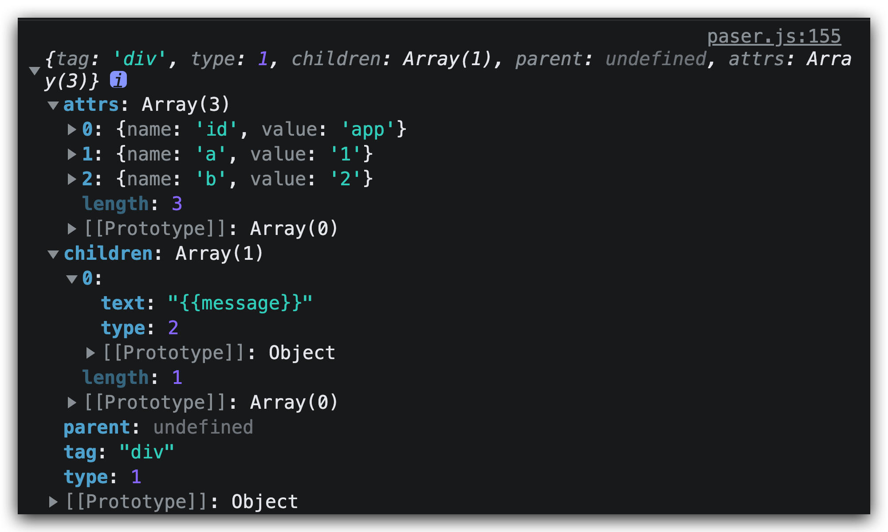

## 五、代码梳理

### 1、封装 parser.js 文件

新建parser文件将dom转换相关代码cv到文件中

~~~~js
// src/compile/parser.js

// 匹配标签名：aa-xxx
const ncname = `[a-zA-Z_][\\-\\.0-9_a-zA-Z]*`;
// 命名空间标签：aa:aa-xxx
const qnameCapture = `((?:${ncname}\\:)?${ncname})`;
// 匹配标签名(索引1)：<aa:aa-xxx
const startTagOpen = new RegExp(`^<${qnameCapture}`);
// 匹配标签名(索引1)：</aa:aa-xxxdsadsa> 
const endTag = new RegExp(`^<\\/${qnameCapture}[^>]*>`);
// 匹配属性（索引 1 为属性 key、索引 3、4、5 其中一直为属性值）：aaa="xxx"、aaa='xxx'、aaa=xxx
const attribute = /^\s*([^\s"'<>\/=]+)(?:\s*(=)\s*(?:"([^"]*)"+|'([^']*)'+|([^\s"'=<>`]+)))?/;
// 匹配结束标签：> 或 />
const startTagClose = /^\s*(\/?)>/;
// 匹配 {{   xxx    }} ，匹配到 xxx
const defaultTagRE = /\{\{((?:.|\r?\n)+?)\}\}/g

export function parserHTML(html) {
  console.log("***** 进入 parserHTML：将模板编译成 AST 语法树 *****")
  let stack = [];
  let root = null;
  // 构建父子关系
  function createASTElement(tag, attrs, parent) {
    return {
      tag,  // 标签名
      type:1, // 元素类型为 1
      children:[],  // 儿子
      parent, // 父亲
      attrs // 属性
    }
  }
  // 开始标签,如:[div,p]
  function start(tag, attrs) {
    console.log("发射匹配到的开始标签-start,tag = " + tag + ",attrs = " + JSON.stringify(attrs))
    // 遇到开始标签，就取栈中最后一个，作为父节点
    let parent = stack[stack.length-1];
    let element = createASTElement(tag, attrs, parent);
    // 还没有根节点时，作为根节点
    if(root == null) root = element;
    if(parent){ // 父节点存在
      element.parent = parent;  // 为当前节点设置父节点
      parent.children.push(element) // 同时，当前节点也称为父节点的子节点
    }
    stack.push(element)
  }
  // 结束标签
  function end(tagName) {
    console.log("发射匹配到的结束标签-end,tagName = " + tagName)
    // 如果是结束标签，就从栈中抛出
    let endTag = stack.pop();
    // check:抛出的结束标签名与当前结束标签名是否一直
    if(endTag.tag != tagName)console.log("标签出错")
  }
  // 文本
  function text(chars) {
    console.log("发射匹配到的文本-text,chars = " + chars)
    // 文本直接放到前一个中 注意：文本可能有空白字符
    let parent = stack[stack.length-1];
    chars = chars.replace(/\s/g, ""); // 将空格替换为空，即删除空格
    if(chars){
      parent.children.push({
        type:2, // 文本类型为 2
        text:chars,
      })
    }
  }
  /**
   * 截取字符串
   * @param {*} len 截取长度
   */
  function advance(len) {
    html = html.substring(len);
    console.log("截取匹配内容后的 html:" + html)
    console.log("===============================")
  }

  /**
   * 匹配开始标签,返回匹配结果
   */
  function parseStartTag() {
    console.log("***** 进入 parseStartTag，尝试解析开始标签，当前 html： " + html + "*****")
    // 匹配开始标签，开始标签名为索引 1
    const start = html.match(startTagOpen);
    if(start){// 匹配到开始标签再处理
      // 构造匹配结果，包含：标签名 + 属性
      const match = {
        tagName: start[1],
        attrs: []
      }
      console.log("html.match(startTagOpen) 结果:" + JSON.stringify(match))
      // 截取匹配到的结果
      advance(start[0].length)
      let end;  // 是否匹配到开始标签的结束符号>或/>
      let attr; // 存储属性匹配的结果
      // 匹配属性且不能为开始的结束标签，例如：<div>，到>就已经结束了，不再继续匹配该标签内的属性
      //    attr = html.match(attribute)  匹配属性并赋值当前属性的匹配结果
      //    !(end = html.match(startTagClose))   没有匹配到开始标签的关闭符号>或/>
      while (!(end = html.match(startTagClose)) && (attr = html.match(attribute))) {
        // 将匹配到的属性,push到attrs数组中，匹配到关闭符号>,while 就结束
        console.log("匹配到属性 attr = " + JSON.stringify(attr))
        // console.log("匹配到属性 name = " + attr[1] + "value = " + attr[3] || attr[4] || attr[5])
        match.attrs.push({ name: attr[1], value: attr[3] || attr[4] || attr[5] })
        advance(attr[0].length)// 截取匹配到的属性 xxx=xxx
      }
      // 匹配到关闭符号>,当前标签处理完成 while 结束,
      // 此时，<div id="app" 处理完成，需连同关闭符号>一起被截取掉
      if (end) {
        console.log("匹配关闭符号结果 html.match(startTagClose):" + JSON.stringify(end))
        advance(end[0].length)
      }

      // 开始标签处理完成后，返回匹配结果：tagName标签名 + attrs属性
      console.log(">>>>> 开始标签的匹配结果 startTagMatch = " + JSON.stringify(match))
      return match;
    }
    console.log("未匹配到开始标签，返回 false")
    console.log("===============================")
    return false;
  }

  // 对模板不停截取，直至全部解析完毕
  while (html) {
    // 解析标签和文本(看开头是否为<)
    let index = html.indexOf('<');
    if (index == 0) {// 标签
      console.log("解析 html：" + html + ",结果：是标签")
      // 如果是标签，继续解析开始标签和属性
      const startTagMatch = parseStartTag();// 匹配开始标签，返回匹配结果
      if (startTagMatch) {  // 匹配到了，说明是开始标签
        // 匹配到开始标签，调用start方法，传递标签名和属性
        start(startTagMatch.tagName, startTagMatch.attrs)
        continue; // 如果是开始标签，就不需要继续向下走了，继续 while 解析后面的部分
      }
      // 如果开始标签没有匹配到，有可能是结束标签 </div>
      let endTagMatch;
      if (endTagMatch = html.match(endTag)) {// 匹配到了，说明是结束标签
        // 匹配到开始标签，调用start方法，传递标签名和属性
        end(endTagMatch[1])
        advance(endTagMatch[0].length)
        continue; // 如果是结束标签，也不需要继续向下走了，继续 while 解析后面的部分
      }
    } else {// 文本
      console.log("解析 html：" + html + ",结果：是文本")
    }

    // 文本：index > 0 
    if(index > 0){
      // 将文本取出来并发射出去,再从 html 中拿掉
      let chars = html.substring(0,index) // hello</div>
      text(chars);
      advance(chars.length)
    }
  }
  console.log("当前 template 模板，已全部解析完成")
  console.log(root)
  return root;
}
~~~~

生成的ast树形结构

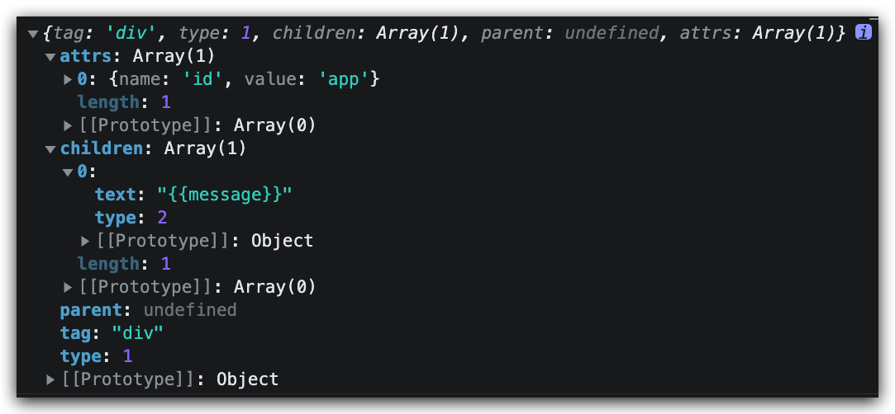

### 2、导入模块

在src/compile/index.js中，导入src/compile/parser.js#parserHTML：

~~~~js
// src/compile/index.js

import {parserHTML} from './parser.js'

export function compileToFunction(template) {
  console.log("***** 进入 compileToFunction：将 template 编译为 render 函数 *****")
  // 1，将模板变成 AST 语法树
  let ast = parserHTML(template);
  console.log("解析 HTML 返回 ast 语法树====>")
  // 2，使用 AST 生成 render 函数
  let code = generate(ast);
}

function generate(ast) {
  console.log("parserHTML-ast : " + ast)
}
~~~~

### 3、测试 ast 构建逻辑

~~~~html
<div><p>{{message}}<sapn>HelloVue</span></p></div>
~~~~


控制台输出：对应元素结构如下：

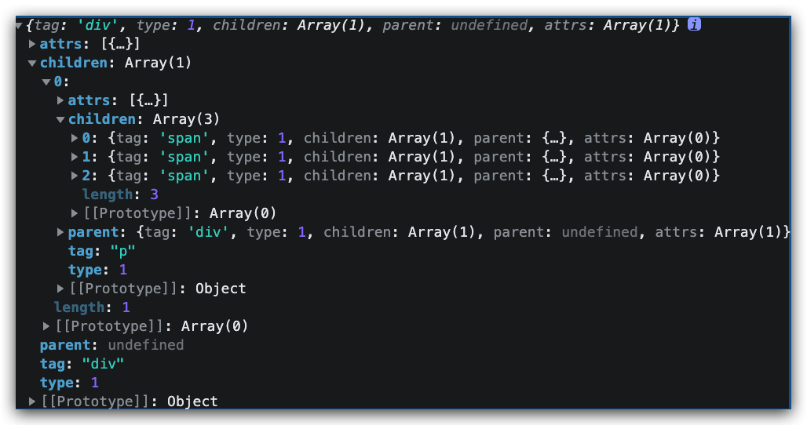

## 六、render函数的组装

【目标】能够通过生成的ast结构转换成render函数并且生成vdom，实现vdom的挂载和更新

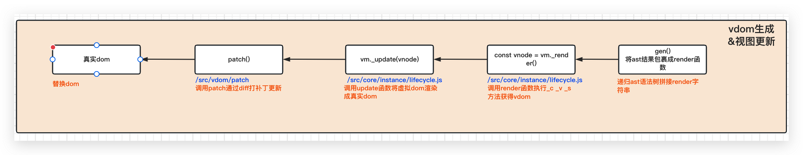

当外部调用generate方法时，传入ast语法树，返回render函数，根据“模板编译示例”中render函数的结构，通过字符串拼接的方式生成render函数代码；

[Vue在线转换成render的网站](https://vue-template-explorer.netlify.app/#%3Cdiv%20id%3D%22app%22%3E%7B%7B%20msg%20%7D%7D%3C%2Fdiv%3E)： 根据 render 函数特征，使用_c包裹节点， _v包裹文本，使用 _s 包裹变量

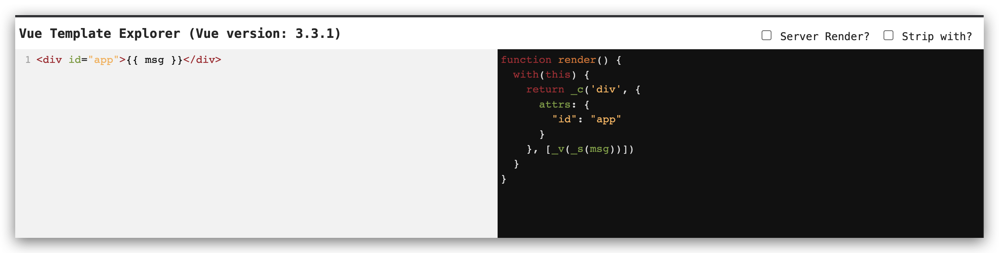

下面仿照模板编译示例中render函数的语法和结构，根据ast语法树中的元素节点信息，采用字符串拼接的方式构建出render函数：

### 1、封装generate函数，生成基本结构

~~~~js
// src/compiler/index.js

function generate(ast) {
 // 字符串拼接 render 函数
 let code = `_c(
 '${ast.tag}',
    ${
      // 暂不处理属性，后面单独处理
      ast.attrs.length? JSON.stringify({}):'undefined'	
    }
    ${
      ast.children?`,[]`:''  // 暂不处理儿子，后面单独处理
 		}
 	)`

 return code;
}

// 输出结果：_c('div',{},[]}
~~~~

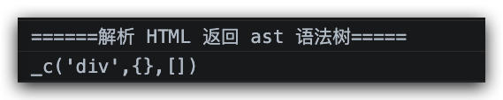

以上操作拼接出了`render`函数的大致结构，接下来继续处理属性和儿子；

### 2、处理属性：genProps(ast.attrs)

创建用于处理属性的`genProps`方法：将数组格式化为字符串，根据格式进行拼接

~~~~js
// src/compiler/index.js

// 将 attrs 数组格式化为：{key=val,key=val}
function genProps(attrs) {
  let str = '';
  for(let i = 0; i< attrs.length; i++){
    let attr = attrs[i];
    // 使用 JSON.stringify 将 value 转为 string 类型
    // 注意：每个属性值的最后都会添加一个逗号
    str += `${attr.name}:${JSON.stringify(attr.value)},`
  }
  return `{${str.slice(0, -1)}}`;// 去掉最后一位多余的逗号，在外层以{}包裹
 }

// 在 generate 中调用 genProps 处理属性
function generate(ast) {
 let code = `_c('${ast.tag}',${
  ast.attrs.length? genProps(ast.attrs):'undefined'
 }${
  ast.children?`,[]`:''
 })`
 return code;
}

export function compileToFunction(template) {
  let ast = parserHTML(template);
  let code = generate(ast);
  console.log(code)
}

// _c('div',{id:"app"},[])
~~~~

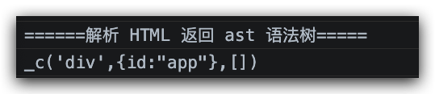


### 3、处理儿子(递归)：genChildren(el)

处理好属性之后，继续处理儿子，示例如下：

~~~~html
<div id="app" a='1' b=2 style="color: red;background: blue;">
  <p>{{message}} 
    <span>Hello Vue1</span>
    <span>Hello Vue2</span>
    <span>Hello Vue3</span>
  </p>
</div>
~~~~

- 儿子可能是标签，也可能是文本；
- 当儿子为标签时，标签中可能还存在多个儿子，需要对当前标签做递归处理；

~~~~js
// src/compiler/index.js

// 输出结果：_c(div,{},c1,c2,c3...)
function generate(ast) {
  // 处理儿子
  let children = genChildren(ast);
  
  let code = `_c('${ast.tag}',${
    ast.attrs.length? genProps(ast.attrs):'undefined'
  }${
    children?`,${children}`:''
  })`
  
  return code;
}

function genChildren(el) {
  console.log("===== genChildren =====")
  let children = el.children;
  if(children){
    console.log("存在 children, 开始遍历处理子节点．．．", children)
    let result = children.map(item => gen(item)).join(',');
    console.log("子节点处理完成，result = " + JSON.stringify(result))
    return result
  }
  console.log("不存在 children, 直接返回 false")
  return false;
}

function gen(el) {
  console.log("===== gen ===== el = ",el)
  if(el.type == 1){ 
    console.log("元素标签 tag = "+el.tag+"，generate继续递归处理")
    // 标签类型：标签中可能还存在多个儿子，需要继续递归处理当前元素（标签）
    return generate(el);
  }else{
    console.log("文本类型,text = " + el.text)
    // 文本类型：直接返回
    return el.text ;    
  }
}
~~~~

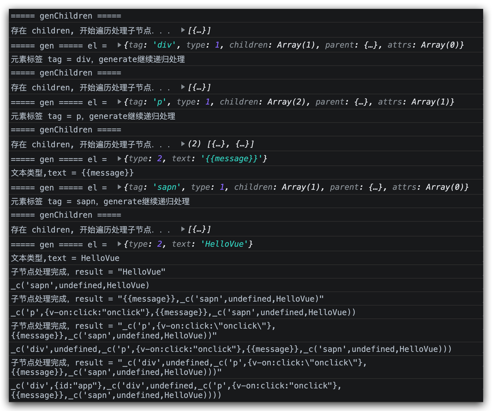

### 4、使用_v包裹文本

~~~~js
function gen(el) {
  console.log("===== gen ===== el = ",el)
  if(el.type == 1){// 
    console.log("元素标签 tag = "+el.tag+"，generate继续递归处理")
    return generate(el);// 如果是元素就递归的生成
  } else {// 文本类型
    let text = el.text
    console.log("文本类型,text = " + text)
    return `_v('${text}')`  // 包装 _v
  }
}
~~~~

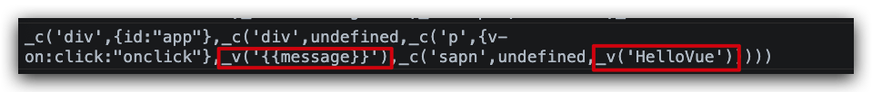

在`type == 2`的文本类型中，还有可能存在插值表达式的情况，如：`{{ msg }}`

而插值表达式属于变量，需要包裹`_s`，需通过正则匹配的方式将其过滤掉；

### 5、使用 _s 包裹变量

实现思路：

1、模板中的插值表达式`{{ msg }}`：`msg`可能是一个对象，因此需要使用`_s`(同`JSON.stringify`)转换成为字符串；

2、通过正则 defaultTagRE 检查 text 文本中是否包含 {{}} ：

3、若不包含，说明是文本，直接返回 _ v('${text}')；

4、若包含，说明是表达式，需要对表达式 和 普通值执行拼接操作：将表达式和普通值按顺序放入tokens数组中，执行拼接操作后再返回，即：_ v(${tokens.join('+')})；

5、【拓展】差值表达式中不支持if 和for是因为在这一步并没有对这两个情况做处理


匹配 {{}} 表达式的正则： const defaultTagRE = /\{\{((?:.|\r?\n)+?)\}\}/g

完整代码

~~~~js
// src/compiler/parser.js
// 匹配 {{}} 表达式
const defaultTagRE = /\{\{((?:.|\r?\n)+?)\}\}/g

function gen(el) {
  console.log("===== gen ===== el = ", el)
  if (el.type == 1) {// 
    console.log("元素标签 tag = " + el.tag + "，generate继续递归处理")
    return generate(el);// 如果是元素就递归的生成
  } else {// 文本类型
    let text = el.text
    console.log("文本类型,text = " + text)
    if (!defaultTagRE.test(text)) {
      return `_v('${text}')`  // 普通文本，包装_v
    } else {
      // 存在{{}}表达式，需进行表达式 和 普通值的拼接 
      // 目标：['aaa',_s(name),'bbb'].join('+') ==> _v('aaa' + s_(name) + 'bbb')
      // 当正则表达式后面有 /g 的时候每一次匹配都会导致正则中的不可枚举属性lastIndex 改变到匹配位置的下标
      // 如果匹配不到就会变为 0
      // 所以刚开始我们将它指定为0
      let lastIndex = defaultTagRE.lastIndex = 0;
      let tokens = []; // <div>aaa {{name}} bbb</div>
      let match
      
      // exec方法和match方法用法基本一致，多了一个捕获组，可以实现更复杂的逻辑
      while (match = defaultTagRE.exec(text)) {
        console.log("匹配内容" + text)
        let index = match.index;// match.index：指当前捕获到的位置
        console.log("当前的 lastIndex = " + lastIndex)
        console.log("匹配的 match.index = " + index)
        if (index > lastIndex) {  // 将前一段 ’<div>aaa '中的 aaa 放入 tokens 中
          let preText = text.slice(lastIndex, index)
          console.log("匹配到表达式-找到表达式开始前的部分：" + preText)
          tokens.push(JSON.stringify(preText))// 利用 JSON.stringify 加双引号
        }

        console.log("匹配到表达式：" + match[1].trim())
        // 放入 match 到的表达式，如{{ name  }}（match[1]是花括号中间的部分，并处理可能存在的换行或回车）
        tokens.push(`_s(${match[1].trim()})`)
        // 更新 lastIndex 长度到'<div>aaa {{name}}'
        lastIndex = index + match[0].length;  // 更新 lastIndex 长度到'<div>aaa {{name}}'
      }

      // while 循环后可能还剩余一段，如：’ bbb</div>’，需要将 bbb 放到 tokens 中
      if (lastIndex < text.length) {
        let lastText = text.slice(lastIndex);
        console.log("表达式处理完成后，还有内容需要继续处理：" + lastText)
        tokens.push(JSON.stringify(lastText))// 从lastIndex到最后
      }

      return `_v(${tokens.join('+')})`
    }
  }
}
~~~~

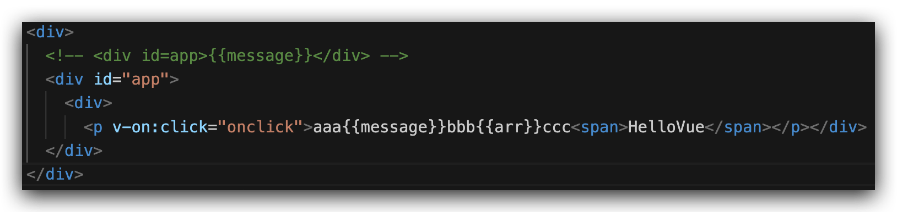

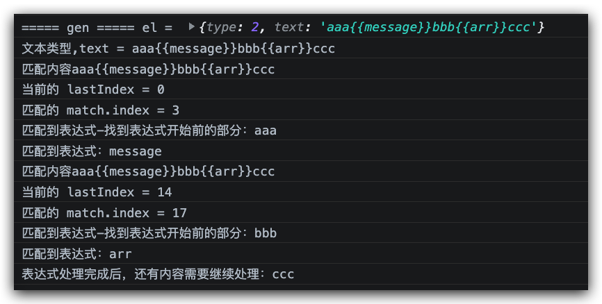

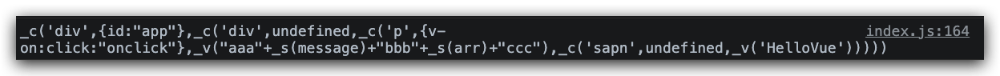

### 6、render函数with和function的组装

目前render函数的返回值已经基本搞到，剩下需要在外面包裹一层with代码块，外面再包裹一层function即可实现完整的render函数

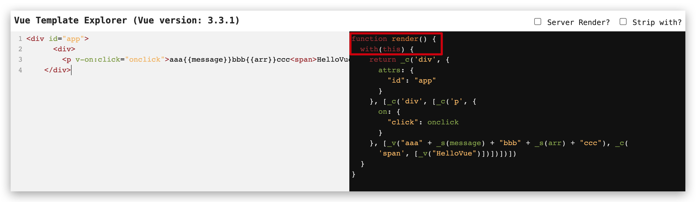

将render函数外层包裹上with并不是一件复杂的事情，但是这个with函数在开发中很少见到，那么这个with的作用是什么呢？

【拓展】with函数

目前现在有一个这样的对象

~~~~js
var obj = {
	a: 1,
	b: 2,
	c: 3
};
~~~~

如果想要改变 obj 中每一项的值，一般写法可能会是这样

~~~~js
// 重复写了3次的“obj”
obj.a = 2;
obj.b = 3;
obj.c = 4;
~~~~

而用了 with 的写法，会有一个简单的快捷方式

~~~~js
with (obj) {
	a = 3;
	b = 4;
	c = 5;
}
~~~~

在这段代码中，使用了 with 语句关联了 obj 对象，这就意味着在 with 代码块内部，每个变量首先被认为是一个局部变量，如果局部变量与 obj 对象的某个属性同名，则这个局部变量会指向 obj 对象属性。翻译一下就是就是引用obj对象，然后对该对象上的属性进行操作，其作用是可以省略重复书写该对象名称，起到简化书写的作用。

在 with 语句中，**访问变量会先去看这个变量是不是在给定的对象中作为属性存在**，如果存在，则取对象中属性的值，否则继续往上层找。

一般情况下我们不推荐使用with，因为他会造成作用域污染

来到render函数中为什么我们要使用with呢，主要为了简化代码，我们先来看render的执行render.call(vm)，当调用render函数的时候会向函数里面传入vue实例，同时render中也有很多的方法 指令 属性 变量使用到vue实例上的数据和方法，所以使用with可以简化书写。因此前端模板引擎的实现原理，大多都是依靠 `new Function` + `with` 来实现的，比如：`ejs`、`jade`、`handlerbar`；

~~~~js
import { parserHTML } from "./parser.js";

export function compileToFunction(template) {
  console.log("#### 进入 compileToFunction：将 template 编译为 render 函数 ####")
  // 1，将模板变成 AST 语法树
  let ast = parserHTML(template);
  console.log("解析 HTML 返回 ast 语法树====>")
  console.log('ast 语法树', ast)
  // 2，使用 AST 生成 render 函数
  let code = generate(ast); // 生成 code
  let render = new Function(`with(this){return ${code}}`);  // 包装 with + new Function
  console.log("包装 with 生成 render 函数：" + render.toString())

  return render;
}
~~~~

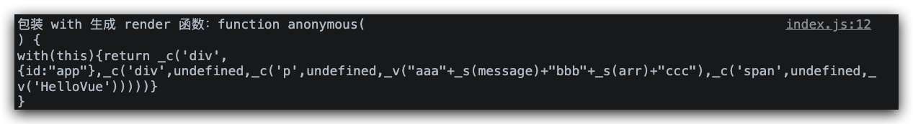

将生成的`render`函数保存到`options`选项上

~~~~js
Vue.prototype.$mount = function (el) {
    ......
    
    if (!opts.render) {
        console.log("options 中没有 render , 继续取 template")
        // 如果没有 template, 采用元素内容
        let template = opts.template;
        if (!template) {
            console.log("options 中没有 template, 取 el.outerHTML = " + el.outerHTML)
            // 拿到整个元素标签,将模板编译为 render 函数
            template = el.outerHTML;
        } else {
            console.log("options 中有 template = " + template)
        }
        let render = compileToFunction(template);
        opts.render = render; // <=================== 将render保存在opt上
        console.log("打印 compileToFunction 返回的 render = " + render.toString())
    }
  
.......
}
~~~~

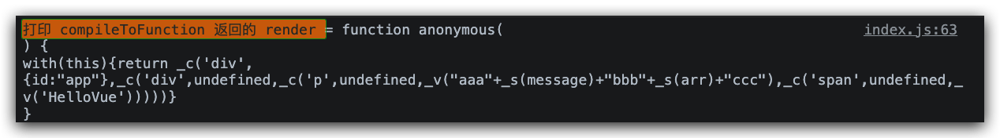


## 一、虚拟dom的创建

`html`模板最终会被编译为`render`函数，为了避免重复编译，会将生成好的`render`函数保存到 `opts.render`上，现在我们的options上已经有了 render 函数，下面我们需要做两件事情

1、使用 render 函数是生成虚拟dom

2、根据虚拟节点和数据生成真实节点，中间混入方法指令等，这里执行的函数就是 vm._update(vm._render())，

这一小节我们来学习 vm._render() 的执行过程。 首先我们将`_render`方法挂载Vue原型上，并调用render

~~~~js
// src/index.js
Vue.prototype._render = function () {
    const vm = this;  // vm 中有所有数据  vm.xxx => vm._data.xxx
    let { render } = vm.$options;
    let vnode = render.call(vm);  // 此时内部会调用_c,_v,_s，执行完成后返回虚拟节点
    return vnode
}
~~~~

当render执行的时候需要 _c _v _s 方法，我们将这些方法挂载到Vue原型上


~~~~js
// src/index.js
// createElement 创建元素型的节点
Vue.prototype._c = function () {  
    const vm = this;
	  // 传入 vm 及之前的所有参数
    return createElement(vm, ...arguments); 
}
// 创建文本的虚拟节点
Vue.prototype._v = function (text) {  
    const vm = this;
    return createText(vm, text);
}
// JSON.stringify
Vue.prototype._s = function (val) {  
	  // 是对象就转成字符串
    if (typeof val == 'object' && val !== null) {  
        return JSON.stringify(val)
    } else {  
	      // 不是对象就直接返回
        return val
    }
}

~~~~

这里的 createElement 返回虚拟 dom 节点，createText 返回虚拟文本节点，这一类处理虚拟 dom 的方法我们统一封封装在 vdom 文件夹下，创建目录 src/vdom/index.js

~~~~js
// src/vdom/index.js

export function createElement() { 
  // 返回元素虚拟节点
}
export function createText() {  
  // 返回文本虚拟节点
}
~~~~

~~~~js
// src/vdom/index.js

// 通过函数返回 vnode 对象
// key 标识作用：后边元素根据 key 标识做 diff 算法，取值 data.key；
function vnode(vm, tag, data, children, key, text) {
  return {
    vm,       // 所属实例
    tag,      // 标签
    data,     // 数据
    children, // 孩子
    key,      // 标识
    text      // 文本
  }
}
// 参数：_c('标签', {属性}, ...孩子)
export function createElement(vm, tag, data={}, ...children) {
  // 返回元素的虚拟节点（元素是没有文本的）
  return vnode(vm, tag, data, children, data.key, undefined);
}
export function createText(vm, text) {
  // 返回文本的虚拟节点（文本没有标签、数据、孩子、key）
  return vnode(vm, undefined, undefined, undefined, undefined, text);
}
~~~~

最终输出的vnode对象

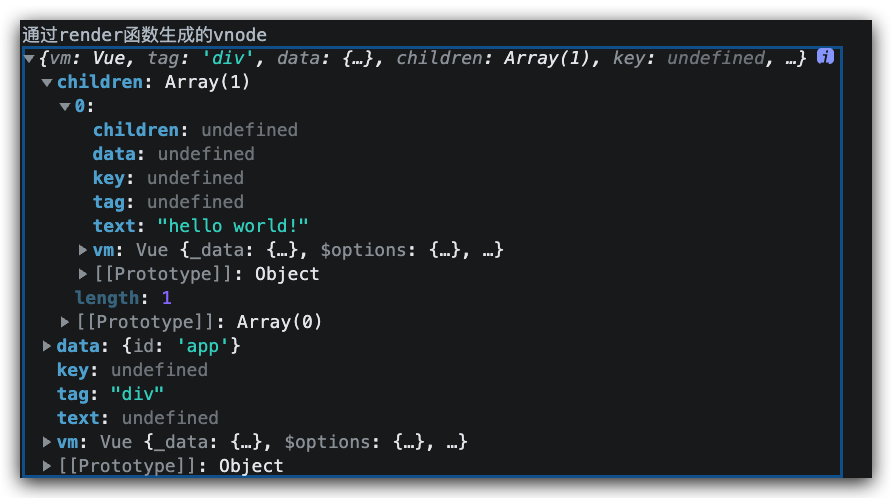

有了虚节点，下面我们就可以来生成真实dom了 ，至此render生成vnode部分就已经完成了！


## 二、真实Dom的创建

这里的 vnode 我们已经拿到了，因为vue中的dom更新实际是一个打补丁的过程，接下来需要一个补丁（patch）方法实现虚拟dom的更新，我们在Vue的原型上挂载一个 _update 方法，接受传入的vnode，然后就可以在 $mount 中调用 update 函数了

~~~~js
// src/index.js
// 支持 new Vue({el}) 和 new Vue().$mount 两种情况
Vue.prototype.$mount = function (el) {
    ......
    // 获取虚拟dom进行对比更新
    vm._update(vm._render());
    console.log('通过render函数生成的vnode', vm._render())
    ......
}


Vue.prototype._update = function (vnode) {
    console.log("_update-vnode", vnode)
    const vm = this;
}
~~~~

接下来我们行需要创建真实节点

【思考】对于vnode树形数据的遍历使用什么方式？

【回答】递归遍历

递归处理`vnode`对象，生成真实节点；遍历更新节点我们使用patch方法，将虚拟节点转化为真实节点，并插入到元素中

创建`src/vdom/patch.js`

~~~~js
// src/vdom/patch.js

/**
 * 将虚拟节点转为真实节点后插入到元素中
 * @param {*} el    当前真实元素 id#app
 * @param {*} vnode 虚拟节点
 * @returns         新的真实元素
 */
export function patch(el, vnode) {
  console.log(el, vnode)
  // 根据虚拟节点创造真实节点，替换为真实元素并返回
}
~~~~

在`vm._update`中，调用`patch`方法，返回新的真实元素：

这里我们对dom渲染做一下区分，如果是第一次渲染，不需要进行dom diff直接渲染即可，如果已经有了dom则进行dom的更新需要进行diff，区分的步骤如下：

- 第一次渲染时，在`vm.preVnode`上保存当前`Vnode`;
- 第二次渲染时，先取`vm.preVnode`，若有值，即为更新渲染；
- 初渲染，执行`patch(vm.$el, vnode)`；
- 更新渲染，执行`patch(preVnode, vnode)`；

~~~~js
// src/index.js

Vue.prototype._update = function (vnode) {
    console.log("_update-vnode", vnode)
    const vm = this;
    // 取上一次的 preVnode
    let preVnode = vm.preVnode;
    // 渲染前，先保存当前 vnode
    vm.preVnode = vnode;
    // preVnode 有值，说明已经有节点了，本次是更新渲染；没值就是初渲染
  	// 初渲染
    if (!preVnode) {
        // 传入当前真实元素vm.$el，虚拟节点vnode，返回新的真实元素
        vm.$el = patch(vm.$el, vnode);
    } else {// 更新渲染:新老虚拟节点做 diff 比对
        vm.$el = patch(preVnode, vnode);
    }
}
~~~~


在 vue 的生命周期中也提示了这一步，创建一个新的 $el 节点替换之前的 el 节点这里的老的 el 节点就是 id 为 app 的 div，而新的 $el 节点是根据 vnode 生成的真实 dom，所以我们需要两步骤：

1、生成真实dom节点

2、将真实dom节点挂载到el上

### 1、createElm方法

我们在patch中定义一个creatElm方法用来递归虚拟dom生成真实节点

~~~~js
// src/vdom/patch.js

/**
 * 将虚拟节点转为真实节点后插入到元素中
 * @param {*} el    当前真实元素 id#app
 * @param {*} vnode 虚拟节点
 * @returns         新的真实元素
 */
export function patch(el, vnode) {

  // 1,根据虚拟节点创建真实节点
  const elm = createElm(vnode);
  
  // 2,使用真实节点替换老节点
  
  return elm;
}
~~~~

通过createElm方法，完成了根据虚拟节点生成真实节点，详细步骤如下：

通过vnode中的tag，判断节点是元素还是文本：文本的tag为undefined；
若当前节点是文本，创建文本真实节点：document.createTextNode(text)；
若当前节点是元素，创建元素真实节点：document.createElement(tag)；
当前节点是元素且存在儿子，需要递归处理创建出儿子的真实节点，并添加到对应的父亲中：children.forEach(child => {el.appendChild(createElm(child))});；
返回生成的真实节点；

~~~~js
// src/vdom/patch.js

function createElm(vnode) {
  let{tag, children, text} = vnode;
  // 通过 tag 判断当前节点是元素 or 文本，判断逻辑：文本 tag 是 undefined
  if(typeof tag === 'string'){
    // 创建元素的真实节点
    vnode.el = document.createElement(tag)    
    // 继续处理元素的儿子：递归创建真实节点并添加到对应的父亲上
    children.forEach(child => {
      // 若不存在儿子，children为空数组，递归终止
      vnode.el.appendChild(createElm(child))
    });
  } else {
    // 创建文本的真实节点
		vnode.el = document.createTextNode(text)  
  }
  console.log(vnode.el)
  return vnode.el;
}
~~~~

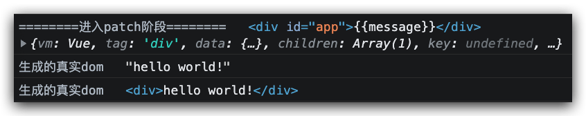

在生成元素时，如果有`data`属性，需要将`data`设置到元素上，否则就会丢失`id#app`；

~~~~js
// src/vdom/patch.js

function createElm(vnode) {
  let {tag, children, text, data, vm} = vnode;
  if(typeof tag === 'string'){
    vnode.el = document.createElement(tag)
    // 处理 data 属性
    updateProperties(vnode.el, data)
    children.forEach(child => {
      vnode.el.appendChild(createElm(child))
    });
  } else {
    vnode.el = document.createTextNode(text)
  }
  console.log('生成的真实dom', vnode.el)
  return vnode.el;
}

// 循环 data 添加到 el 的属性上
function updateProperties(el, props = {} ) {
  // todo 当前实现没有考虑样式属性
  for(let key in props){
    el.setAttribute(key, props[key])
  }
}
~~~~

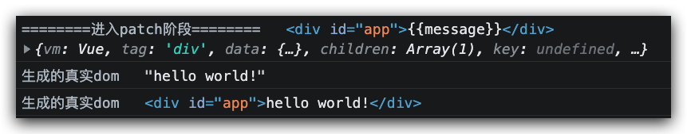

目前我们已经完成了对虚拟dom的递归处理，并且通过dom操作生成了真实节点，下面只需要将新节点替换之前的老节点即可。

### 2、节点替换

节点的替换分为三个步骤

1. 找到老节点；
2. 将新节点插入到老节点之后，使新老节点成为兄弟节点；
3. 删除老节点；

这样能够保证在新老节点完成更新后，文档的顺序不变，下面将真实节点绑定到`vnode`的扩展属性`el`上，这样当后续虚拟节点更新时，便于跟踪并找到与`vnode`对应的真实节点`el`，快速完成真实节点的更新操作；

下面我们实现dom的更新

~~~~js
/**
 * 将虚拟节点转为真实节点后插入到元素中
 * @param {*} el    当前真实元素 id#app
 * @param {*} vnode 虚拟节点
 * @returns         新的真实元素
 */
export function patch(el, vnode) {
  console.log(el, vnode)
  
  // 1，根据虚拟节点创建真实节点
  const elm = createElm(vnode);
  console.log("createElm", elm);

  // 2，使用真实节点替换掉老节点
  // 1）找到元素的父亲节点
  const parentNode = el.parentNode;
  // 2）找到老节点的下一个兄弟节点（nextSibling 若不存在将返回 null）
  const nextSibling = el.nextSibling;
  // 3）将新节点 elm 插入到老节点 el 的下一个兄弟节点nextSibling的前面
  // 备注：若 nextSibling 为 null，则 insertBefore 等价于 appendChild
  parentNode.insertBefore(elm, nextSibling); 
  // 4）删除老节点 el
  parentNode.removeChild(el);

  return elm;
}
~~~~

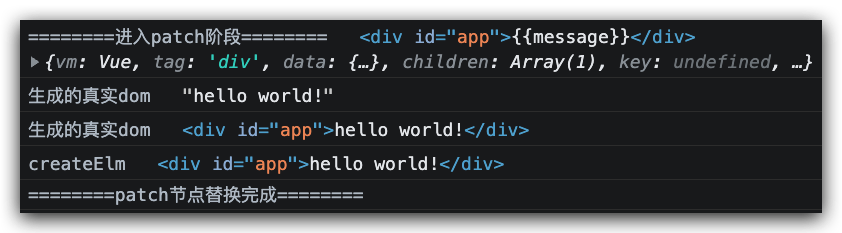

看看页面上是不是渲染出来了内容


至此dom的初步渲染就已经完成了，下面我们来看看dom的更新过程，这里的更新正好可以使用我们之前定义的watcher和dep首先在视图渲染的过程中，将被使用到的数据记录下来，后续仅针对这些收集到的数据变化才触发视图更新操作。


## 三、视图更新

### 1、异步更新 $nextTick的实现

在vue中视图更新是异步的，视图的更新是基于nextTick实现的，同时vue上也有一个$nextTick方法，他们是同一个，这一小节我们手动实现一个$nextTick

【目标】实现$nexTick方法

【思考】$nextTick的作用

【回答】因为Vue中的dom渲染是异步的，想要获取到渲染之后的dom结果需要等待dom更新完成之后再获取。$nextTick的功能，就是等待之前的异步执行之后再执行$nextTcik方法中的回调

【思考】如何定一个$nextTick?

【回答】

1、在Vue上挂载成员方法$nextTick

2、在utils中定义NextTick并导出

​		将传入的参数放入任务队列中

​		判断执行状态用于防抖

​		将控制防抖的状态改为true

​		任务队列中的任务依次调用

3、在$nextTick中调用nextTick方法

~~~~js
// src/utils
let callbacks = []; // 缓存异步更新的 nextTick
let pending = false;
function flushsCallbacks() {
  callbacks.forEach(fn => fn()) // 依次执行 nextTick
  callbacks = [];   // reset
  pending = false;  // reset
}

/**
 * 将方法异步化
 * @param {*} fn 需要异步化的方法
 * @returns 
 */
export function nextTick(fn) {
  // return Promise.resolve().then(fn);
  callbacks.push(fn); // 先缓存异步更新的nextTick,后续统一处理
  if(!pending){
    pending = true; // 首次进入被置为 true,控制逻辑只走一次
    Promise.resolve().then(flushsCallbacks);   
  }
} 
~~~~

~~~~js
// /src/index.js
import {nextTick} from './utils.js'

Vue.prototype.$nextTick = function (fn) {
  nextTick(fn)
}
~~~~

现在在vue的实例上就有一个nextTIck方法，接下来我们来试一试

~~~~js
let dom = document.querySelector('.dom')
// 模拟更新dom vue内部的更新使用的也是nextTick
vm.$nextTick(() => {
  dom.innerHTML = 3
})
// 数据发生改变之后直接获取dom，发现获取的还是之前的
console.log(dom.innerHTML, '更新之前的dom')
// 在nextTick中获取dom，此时获取的dom是更新之后的
vm.$nextTick(() => {
  console.log(dom.innerHTML, '更新之后的dom')
})
~~~~

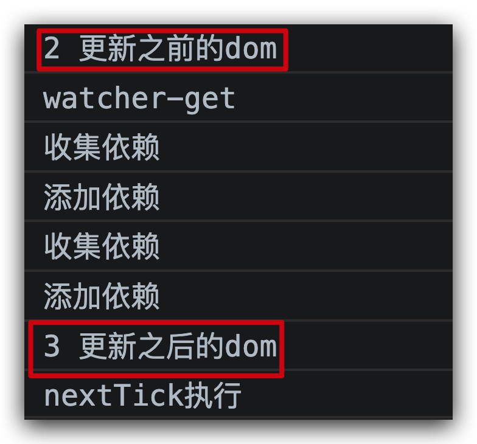


### 2、watcher的引入

当数据发生改变之后我们需要通过依赖收集来触发更新，所以在dom渲染的时候也需要实例化watcher

【目标】将dom渲染和watcher关联起来

~~~~js
// src/index.js
// 支持 new Vue({el}) 和 new Vue().$mount 两种情况
Vue.prototype.$mount = function (el) {
    // ......省略.......
    let updateComponent = () => {
        vm._update(vm._render());
    }

    // 渲染 watcher ：每个组件都有一个 watcher
    new Watcher(vm, updateComponent, () => {
        console.log('Watcher-update')
        // 视图更新后，调用钩子: updated
    })
}
~~~~

此时我们在控制台中修改数据


此时数据已经触发了Watcher-Update 进行更新回调

在视图渲染阶段会进行依赖收集，数据改变将通知所有被收集的渲染 `watcher`更新视图，如果频繁切换数据视图也会频繁的渲染，在vue中做了异步更新的功能 vue.nextTick，他会将更新 watcher 的方法缓存起来然后一起处理，获取处理之后的结果。

- 同步更新，每次数据更新都会同步调用`update`方法；
- 异步更新，先将更新逻辑`Watcher`缓存起来，合并后一起处理；

将`watcher`集中缓存到一个队列中，在缓存过程中进行合并，最后一次性执行，由于此时为异步代码，当逻辑全部执行完成后，才会将队列中的`watcher`都`run`执行。

新建一个调度任务 `src/observe/schedule.js`，在文件中定义queueWatcher 监听队列方法，实现两个功能watcher的去重和watcher的缓存。

~~~~js
// src/observe/schedule.js

import { nextTick } from "../utils.js";

let queue = []; // 用于缓存渲染 watcher
let has = {};   // 存放 watcher 唯一 id，用于 watcher 的查重
let waiting = false;// 控制 setTimeout 只走一次

/**
 * 刷新队列：执行所有 watcher.run 并将队列清空；
 */
function flushschedulerQueue() {
  // 更新前,执行生命周期：beforeUpdate
  queue.forEach(watcher => watcher.run()) // 依次触发视图更新
  queue = [];       // reset
  has = {};         // reset
  waiting = false;  // reset
  // 更新完成,执行生命周期：updated
}

/**
 * 将 watcher 进行查重并缓存，最后统一执行更新
 * @param {*} watcher 需更新的 watcher
 */
export function queueWatcher(watcher) {
  let id = watcher.id;
  if (has[id] == null) {
    has[id] = true;
    queue.push(watcher);  // 缓存住watcher,后续统一处理
    if (!waiting) {       // 等效于防抖
      waiting = true;     // 首次进入被置为 true，使微任务执行完成后宏任务才执行
      nextTick(flushschedulerQueue);
    }
  }
}
~~~~

【思考】为什么watcher中有一个控制执行的 waiting，nextTick中有一个控制执行的 pending？

【回答】因为watcher本身可以有多个，比如多个渲染watcher此时waterqueue本身是个队列，需要等待这个队列中每一个watcher下的function回调队列都执行完成再执行下一个watcherQueue

而nextTick中的pending是用来控制方法队列完全执行后再执行下一个方法队列


### 3、在watcher中实现异步更新

~~~~js
import Dep from "./dep.js";
import {queueWatcher} from './scheduler.js'

export default class Watcher {
  // constructor(vm, exp, cb) {
  constructor(vm, exp, cb, options = {}) {
    this.vm = vm
    this.exp = exp
    this.cb = cb
    // 默认watcher是立即执行的
    // !!将undefined 转换成false
    this.lazy = this.dirty = !!options.lazy
    // 如果lazy是true 则不上来就执行get

    if (!this.lazy) {
      this.value = this.get()
    }
  }
  get () {
    // 获取数据
    Dep.target = this
    // 在当前的watcher中 获取数据
    // 当前的watcher 和 数据 关联在了一起
    // 获取数据会触发 get
    if (typeof this.exp === 'function') {
      // 此时第二个参数是一个函数
      // sum = this.n1 + this.n2
      this.value = this.exp.call(this.vm)
    }
    else {
      this.value = this.vm[this.exp]
    }
    Dep.target = null
  }
  update (newVal) {
    if (this.lazy) {
      this.dirty = true
    } else {
      var newVal = newVal ? newVal : this.get();
      console.log('开始更新')
      if(this.value != newVal){
          console.log('执行回调')
          this.cb && this.cb(newVal,this.value);
          this.value = newVal;
      }
      console.log("watcher-update", "查重并缓存需要更新的watcher")
      queueWatcher(this);  // <======
    }
  }
  // 补充run方法，用于处理异步更新的回调
  run(){
    console.log("watcher-run", "真正执行视图更新")
    this.get();
  }
}
~~~~

~~~~js
// 略
// /src/utils.js
// 将parseExpression 封装到utils文件中
/**
 * 获取对象的最后一个属性值
 * @param {*} str
 * @returns 
 */
function parseExpression(str) {
  var seg = str.split('.')
  return (obj) => {
    for(let i = 0; i < seg.length; i++) {
      if (!obj) return
      obj = obj[seg[i]]
    }
    return obj
  }
}
~~~~

由于在 watcher 的回调中执行了updateComponent 又重新渲染了dom，这样重新渲染也可以实现效果，但是性能开销比较大，所以在 Vue 中实现了diff算法进行 dom 的更新这样可以充分利用虚拟 dom 的优势进行页面渲染也可以提升渲染效率。

### 4、vue 源码 patch.js 引入并实现完整的 dom 更新

【目标】将vue源码中的patch.js直接覆盖到**/src/vdom/patch.js**中实现dom的diff更新

~~~~js
export function isSameVnode(newVnode, oldVnode) {
  return (newVnode.tag === oldVnode.tag) && (newVnode.key === oldVnode.key);
}

/**
 * 将虚拟节点转为真实节点后插入到元素中
 * @param {*} oldVnode  老的虚拟节点
 * @param {*} vnode     新的虚拟节点
 * @returns             新的真实元素
 */
export function patch(oldVnode, vnode) {
  // console.log("patch-oldVnode", oldVnode);
  // console.log("patch-newVnode", vnode);
  const isRealElement = oldVnode.nodeType;  // 元素的节点类型是1，虚拟节点无此属性
  if (isRealElement) {// 元素代表是真实节点
    // 1，根据虚拟节点创建真实节点
    const elm = createElm(vnode);
    // 2，使用真实节点替换掉老节点
    // 找到元素的父亲节点
    const parentNode = oldVnode.parentNode;
    // 找到老节点的下一个兄弟节点（nextSibling 若不存在将返回 null）
    const nextSibling = oldVnode.nextSibling;
    // 将新节点 elm 插入到老节点el的下一个兄弟节点 nextSibling 的前面
    // 备注：若 nextSibling 为 null，insertBefore 等价于 appendChild
    parentNode.insertBefore(elm, nextSibling);
    // 删除老节点 el
    parentNode.removeChild(oldVnode);
    return elm;
  } else {
    console.log("patch-oldVnode", oldVnode);
    console.log("patch-newVnode", vnode);
    // diff：新老虚拟节点比对
    if (!isSameVnode(oldVnode, vnode)) {// 同级比较，不是相同节点时，不考虑复用（放弃跨层复用），直接用新的替换旧的
      return oldVnode.el.parentNode.replaceChild(createElm(vnode), oldVnode.el);
    }

    // 相同节点，就复用节点（复用老的），再更新不一样的地方（属性），注意文本要做特殊处理，文本是没有标签名的

    // 文本的处理：文本直接更新就可以，因为文本没有儿子  组件中 Vue.component（‘xxx’）这就是组件的 tag
    let el = vnode.el = oldVnode.el;  // 节点复用：将老节点el，赋值给新节点el
    if (!oldVnode.tag) {  // 文本：没有标签名
      if (oldVnode.text !== vnode.text) {// 文本内容变化了，更新文本内容：用新的内容更新老的内容
        return el.textContent = vnode.text;
      } else {
        // 文本没变化也结束：否则会继续进入 updateProperties处理元素，再进入情况3的updateChildren
        // 但整体影响不大，会因条件不符不执行,但做好的做法还是直接 return 掉吧
        return;
      }
    }

    // 元素的处理：相同节点，且新老节点不都是文本时
    updateProperties(vnode, oldVnode.data);

    // 比较儿子节点
    let oldChildren = oldVnode.children || {};
    let newChildren = vnode.children || {};
    // 情况 1：老的有儿子，新的没有儿子；直接把老的 dom 元素干掉即
    if (oldChildren.length > 0 && newChildren.length == 0) {
      el.innerHTML = '';//暴力写法直接清空；更好的处理是封装removeChildNodes方法：将子节点全部删掉，因为子节点可能包含组件
      // 情况 2：老的没有儿子，新的有儿子；直接将新的插入即可
    } else if (oldChildren.length == 0 && newChildren.length > 0) {
      newChildren.forEach((child) => {// 注意：这里的child是虚拟节点，需要变为真实节点
        let childElm = createElm(child); // 根据新的虚拟节点，创建一个真实节点
        el.appendChild(childElm);// 将生成的真实节点，放入 dom
      })
      // 情况 3：新老都有儿子
    } else {  // 递归: updateChildren 内部调用 patch, patch, 内部还会调用 updateChildren (patch 方法是入口)
      updateChildren(el, oldChildren, newChildren)
    }

    return el;// 返回新节点
  }
}


/**
 * 新老都有儿子时做比对，即 diff 算法核心逻辑
 * 备注：采用头尾双指针的方式；优化头头、尾尾、头尾、尾头的特殊情况；
 * @param {*} el 
 * @param {*} oldChildren  老的儿子节点
 * @param {*} newChildren  新的儿子节点
 */
function updateChildren(el, oldChildren, newChildren) {
  // vue2中的diff算法内部做了优化，尽量提升性能，实在不行再暴力比对
  // 常见情况：在列表中，新增或删除某一项（用户很少在列表的中间添加一项）

  // 声明头尾指针
  let oldStartIndex = 0;
  let oldStartVnode = oldChildren[0];
  let oldEndIndex = oldChildren.length - 1;
  let oldEndVnode = oldChildren[oldEndIndex];

  let newStartIndex = 0;
  let newStartVnode = newChildren[0];
  let newEndIndex = newChildren.length - 1;
  let newEndVnode = newChildren[newEndIndex];

  /**
   * 根据children创建映射
   */
  function makeKeyByIndex(children) {
    let map = {}
    children.forEach((item, index) => {
      map[item.key] = index;
    })
    return map
  }

  let mapping = makeKeyByIndex(oldChildren);

  // while 循环处理，所以 diff 算法的复杂度为O(n)，只循环一遍
  // 循环结束条件：有一方遍历完了就结束；即"老的头指针和尾指针重合"或"新的头指针和尾指针重合"
  // 备注: 此while循环中主要对4种特殊情况进行优化处理,包括：头头、尾尾、头尾、尾头
  while (oldStartIndex <= oldEndIndex && newStartIndex <= newEndIndex) {
    // 当前循环开始时，先处理当前的oldStartVnode和oldEndVnode为空的情况； 原因：节点之前被移走时置空，直接跳过
    if (!oldStartVnode) {
      oldStartVnode = oldChildren[++oldStartIndex];
    } else if (!oldEndVnode) {
      oldEndVnode = oldChildren[--oldEndIndex];
      // 头头比较：比较新老开始节点
    } else if (isSameVnode(oldStartVnode, newStartVnode)) {
      // isSameVnode只能判断标签和key是否一样，但还有可能属性不一样
      // 所以还需要使用patch方法比对新老虚拟节点的属性，
      // 而patch方法是递归比对的，同时还会递归比较子节点
      patch(oldStartVnode, newStartVnode);
      // 更新新老头指针和新老头节点
      oldStartVnode = oldChildren[++oldStartIndex];
      newStartVnode = newChildren[++newStartIndex];
      // 尾尾比较：比较新老末尾节点
    } else if (isSameVnode(oldEndVnode, newEndVnode)) {
      patch(oldEndVnode, newEndVnode);
      oldEndVnode = oldChildren[--oldEndIndex];
      newEndVnode = newChildren[--newEndIndex];
      // 头尾比较：老的头节点和新的尾节点做对比
    } else if (isSameVnode(oldStartVnode, newEndVnode)) {
      // patch方法只会duff比较并更新属性，但元素的位置不会变化
      patch(oldStartVnode, newEndVnode);// diff:包括递归比儿子
      // 移动节点：将当前的节点插入到最后一个节点的下一个节点的前面去
      el.insertBefore(oldStartVnode.el, oldEndVnode.el.nextSibling);
      // 移动指针
      oldStartVnode = oldChildren[++oldStartIndex];
      newEndVnode = newChildren[--newEndIndex];
      // 尾头比较
    } else if (isSameVnode(oldEndVnode, newStartVnode)) {
      patch(oldEndVnode, newStartVnode);  // patch方法只会更新属性，元素的位置不会变化
      // 移动节点:将老的尾节点移动到老的头节点前面去
      el.insertBefore(oldEndVnode.el, oldStartVnode.el);// 将尾部插入到头部
      // 移动指针
      oldEndVnode = oldChildren[--oldEndIndex];
      newStartVnode = newChildren[++newStartIndex];
    } else {
      // 前面4种逻辑（头头、尾尾、头尾、尾头）,主要是考虑到用户使用时的一些特殊场景，但也有非特殊情况，如：乱序排序
      // 筛查当前新的头指针对应的节点在mapping中是否存在
      let moveIndex = mapping[newStartVnode.key]
      if (moveIndex == undefined) {// 没有，将当前比对的新节点插入到老的头指针对用的节点前面
        // 将当前新的虚拟节点创建为真实节点，插入到老的开始节点前面
        el.insertBefore(createElm(newStartVnode), oldStartVnode.el);
      } else {  // 有,需要复用
        // 将当前比对的老节点移动到老的头指针前面
        let moveVnode = oldChildren[moveIndex];// 从老的队列中找到可以被复用的这个节点
        // 复用：更新复用节点的属性，插入对应位置
        patch(moveVnode, newStartVnode)
        el.insertBefore(moveVnode.el, oldStartVnode.el);
        // 由于复用的节点在oldChildren中被移走了,之前的位置要标记为空(指针移动时，跳过会使用)
        oldChildren[moveIndex] = undefined;
      }
      // 每次处理完成后，新节点的头指针都需要向后移动
      // 备注：
      // 		无论节点是否可复用，新指针都会向后移动，所以最后统一处理；
      //    节点可复用时，老节点的指针移动会在4种特殊情况中被处理完成；
      newStartVnode = newChildren[++newStartIndex];
    }
  }

  // 至此，完成了相同节点的比较，下面开始处理不同的节点

  // 1，新的多（以新指针为参照）插入新增的
  if (newStartIndex <= newEndIndex) {
    // 新的开始指针和新的结束指针之间的节点
    for (let i = newStartIndex; i <= newEndIndex; i++) {
      // 判断当前尾节点的下一个元素是否存在：
      //  1，如果存在：则插入到下一个元素的前面
      //  2，如果不存在（下一个是 null） ：就是 appendChild
      // 取参考节点anchor:决定新节点放到前边还是后边
      //  逻辑：取去newChildren的尾部+1,判断是否为 null
      //  解释：如果有值说明是向前移动的，取出此虚拟元素的真实节点el，将新节点添加到此真实节点前即可
      let anchor = newChildren[newEndIndex + 1] == null ? null : newChildren[newEndIndex + 1].el
      // // 获取对应的虚拟节点，并生成真实节点，添加到 dom 中
      // el.appendChild(createElm(newChildren[i]))
      // 逻辑合并:将 appendChild 改为 insertBefore
      //  效果：既有appendChild又有insertBefore的功能，直接将参考节点放进来即可;
      //  解释：对于insertBefore方法,如果anchor为null，等同于appendChild;如果有值，则是insertBefore;
      el.insertBefore(createElm(newChildren[i]), anchor)
    }
  }
  // 2，旧的多，（以旧指针为参照）删除多余的真实节点
  if (oldStartIndex <= oldEndIndex) {
    for (let i = oldStartIndex; i <= oldEndIndex; i++) {
      let child = oldChildren[i];
      // child有值时才删除；原因：节点有可能在移走时被置为undefined
      child && el.removeChild(child.el);
    }
  }
}

// 面试：虚拟节点的实现？如何将虚拟节点渲染成真实节点
export function createElm(vnode) {
  // 虚拟节点必备的三个：标签，数据，孩子
  let { tag, data, children, text, vm } = vnode;

  // vnode.el:绑定真实节点与虚拟节点的映射关系，便于后续的节点更新操作
  if (typeof tag === 'string') { // 元素
    // 处理当前元素节点
    vnode.el = document.createElement(tag) // 创建元素的真实节点
    updateProperties(vnode, data)  // 处理元素的 data 属性
    // 处理当前元素节点的儿子：递归创建儿子的真实节点，并添加到对应的父亲中
    children.forEach(child => { // 若不存在儿子，children为空数组
      vnode.el.appendChild(createElm(child))
    });
  } else { // 文本：文本中 tag 是 undefined
    vnode.el = document.createTextNode(text)  // 创建文本的真实节点
  }
  return vnode.el;
}

// 循环 data 添加到 el 的属性上
// 后续 diff 算法时进行完善，没有考虑样式等
function updateProperties(vnode, oldProps = {}) {
  // 1,初次渲染，用oldProps给vnode的 el 赋值即可
  // 2,更新逻辑，拿到老的props和vnode中的 data 进行比对
  let el = vnode.el; // dom上的真实节点（上边复用老节点时已经赋值了）
  let newProps = vnode.data || {};  // 拿到新的数据

  let newStyle = newProps.style || {};
  let oldStyle = oldProps.style || {};

  //如果老的样式有，新的没有，就删掉
  for (let key in oldStyle) { // 老的样式有，新的没有，就把页面上的样式删除掉
    if (!newStyle[key]) {
      el.style[key] = '';
    }
  }

  // 新旧比对：两个对象比对差异
  for (let key in newProps) { // 直接用新的盖掉老的就可以了  还要注意：老的里面有，可能新的里面没有了
    // 前后两次一样，浏览器会检测，就不会更新了，不会有性能问题
    // console.log(newProps)
    if (key == 'style') { // 新的里面有样式，直接覆盖即可
      for (let key in newStyle) { // 老的样式有，新的没有，就把页面上的样式删除掉
        console.log("更新style", el.style[key], newStyle[key])
        el.style[key] = newStyle[key]
      }
    } else {
      el.setAttribute(key, newProps[key])
    }
  }
  // 处理老的里面有，可能新的里面没有的情况，需要再删掉
  for (let key in oldProps) {
    if (!newProps[key]) {
      el.removeAttribute(key)
    }
  }
}
~~~~

然后在控制台直接操作数据修改


数据修改之后页面中的内容已经完成了更新并且在控制台中可以查看输出的内容结合给大家准备的流程图查看dom更新过程。

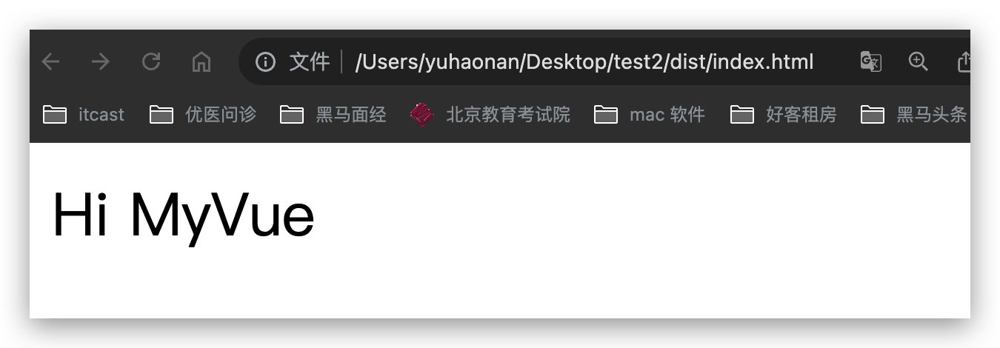


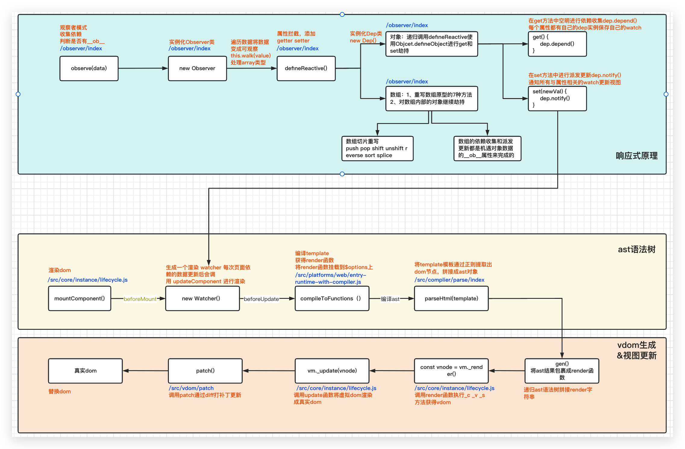


## 四、diff算法

update 方法会使用新的虚拟节点重新生成真实 dom，并替换掉原来的 dom，在 Vue 的实现中，会做一次 diff 算法优化实现就地复用，提升渲染效率。

### 1、patch的改造

所以，下面我们需要用很大的篇幅来实现Vue中的diff算法，对patch方法进行优化，当前的 patch 方法，仅考虑了初始化的情况，只实现了dom的渲染，并没有做dom的渲染更新，下面要处理更新操作。
patch 方法需要对新老虚拟节点进行一次比对，尽可能复用原有节点，以提升渲染性能；
首次渲染，根据虚拟节点生成真实节点，替换掉原来的节点；
更新渲染，生成新的虚拟节点，并与老的虚拟节点进行对比，对比后再渲染；

1、将`patch`方法的入参，改造为新老虚拟节点：`oldVnode` 和 `vnode`；

2、通过判断`oldVnode.nodeType`节点类型，是否为真实节点，确定是初次渲染还是更新渲染；

- `oldVnode`为真实节点（即为真实`dom`），执行初渲染逻辑；
- `oldVnode`非真实节点，执行更新渲染逻辑，需要进行新老虚拟节点比对；

~~~~js
// src/vdom/patch.js
/**
 * 将虚拟节点转为真实节点后插入到元素中
 * @param {*} el    当前真实元素 id#app
 * @param {*} vnode 虚拟节点
 * @returns         新的真实元素
 */
export function patch(oldVnode, vnode) {
  console.log("========进入patch阶段========", oldVnode, vnode)
  const isRealElement = oldVnode.nodeType;
  if (isRealElement) {
  	// 根据虚拟节点创造真实节点，替换为真实元素并返回
    // 1，根据虚拟节点创建真实节点
    const elm = createElm(vnode);
    console.log("createElm", elm);
    // 2，使用真实节点替换掉老节点
    // 1）找到元素的父亲节点
    const parentNode = oldVnode.parentNode;
    // 2）找到老节点的下一个兄弟节点（nextSibling 若不存在将返回 null）
    // 3）将新节点 elm 插入到老节点 el 的下一个兄弟节点nextSibling的前面
    // 备注：若 nextSibling 为 null，则 insertBefore 等价于 appendChild
    parentNode.insertBefore(elm, oldVnode.nextSibling); 
    // 4）删除老节点 el
    parentNode.removeChild(oldVnode);
    console.log("========patch节点替换完成========")

    return elm;
  } else {
    // 虚拟节点：做 diff 算法，新老节点比对
    console.log(oldVnode, vnode)
  }
}

~~~~


后续，开始针对更新渲染的情况，进行新老虚拟节点的比对，即`diff`算法逻辑；

首先我们对比儿子节点，比对儿子节点，需要将“新的儿子节点”和“老的儿子节点”都拿出来，依次进行比对：

因为我们要判断节点是不是相同，所以先在utils中封装一个判断节点相同的方法

~~~~js
// /src/utils.js
/**
 * 判断两个虚拟节点是否是同一个虚拟节点
 *  逻辑：标签名 和 key 都相同
 * @param {*} newVnode 新虚拟节点
 * @param {*} oldVnode 老虚拟节点
 * @returns 
 */
export function isSameVnode(newVnode, oldVnode){
  return (newVnode.tag === oldVnode.tag) && (newVnode.key === oldVnode.key); 
}
~~~~

~~~~js
//src/vdom/patch.js

/**
 * 将虚拟节点转为真实节点后插入到元素中
 * @param {*} el    当前真实元素 id#app
 * @param {*} vnode 虚拟节点
 * @returns         新的真实元素
 */
export function patch(oldVnode, vnode) {

  ......
  // diff：新老虚拟节点比对
  } else {
    // 虚拟节点：做 diff 算法，新老节点比对
    // 节点不能复用的情况
    if (!isSameVnode(oldVnode, vnode)) {
      return oldVnode.el.parentNode.replaceChild(createElm(vnode), oldVnode.el);
    }

    // 处理文本
    let el = vnode.el = oldVnode.el;
    if (!oldVnode.tag) {
      if (oldVnode.text !== vnode.text) {
        return el.textContent = vnode.text;
      } else {
        return;
      }
    }

    // 处理元素属性
    updateProperties(vnode, oldVnode.data);

    // TODO：比较儿子节点...
    let oldChildren = oldVnode.children || {};
    let newChildren = vnode.children || {};
  }
}

export function createElm(vnode) {
  // 虚拟节点必备的三个：标签，数据，孩子
  let { tag, data, children, text, vm } = vnode;

  // vnode.el:绑定真实节点与虚拟节点的映射关系，便于后续的节点更新操作
  if (typeof tag === 'string') { // 元素
    // 处理当前元素节点
    vnode.el = document.createElement(tag) // 创建元素的真实节点
    // updateProperties(vnode.el, data) // <======= 这里就不需要传入vnode.el了
    updateProperties(vnode, data)  // 处理元素的 data 属性
    // 处理当前元素节点的儿子：递归创建儿子的真实节点，并添加到对应的父亲中
    children.forEach(child => { // 若不存在儿子，children为空数组
      vnode.el.appendChild(createElm(child))
    });
  } else { // 文本：文本中 tag 是 undefined
    vnode.el = document.createTextNode(text)  // 创建文本的真实节点
  }
  return vnode.el;
}

// 循环 data 添加到 el 的属性上
// 后续 diff 算法时进行完善，没有考虑样式等
function updateProperties(vnode, oldProps = {}) {
  // 1,初次渲染，用oldProps给vnode的 el 赋值即可
  // 2,更新逻辑，拿到老的props和vnode中的 data 进行比对
  let el = vnode.el; // dom上的真实节点（上边复用老节点时已经赋值了）
  let newProps = vnode.data || {};  // 拿到新的数据

  // 新旧比对：两个对象比对差异
  for (let key in newProps) { 
    // 直接用新的盖掉老的就可以了  还要注意：老的里面有，可能新的里面没有了
    // 前后两次一样，浏览器会检测，就不会更新了，不会有性能问题
    // console.log(newProps)    
    el.setAttribute(key, newProps[key])
  }
  // 处理老的里面有，可能新的里面没有的情况，需要再删掉
  for (let key in oldProps) {
    if (!newProps[key]) {
      el.removeAttribute(key)
    }
  }
}
~~~~

### 2、新老儿子节点的几种情况

#### 情况 1：老的有儿子，新的没有儿子

- ~~~~js
  // src/vdom/patch.js#patch
  
  ...
  // 比较儿子节点
  let oldChildren = oldVnode.children || {};
  let newChildren = vnode.children || {};
      
  // 情况 1：老的有儿子，新的没有儿子；直接将多余的老 dom 元素删除即可；
  if(oldChildren.length > 0 && newChildren.length == 0){
    // 更好的处理：由于子节点中可能包含组件，需要封装 removeChildNodes 方法，将子节点全部删掉
    el.innerHTML = '';// 暴力写法，直接清空；
  }
  ~~~~

#### 情况 2：老的没有儿子，新的有儿子

- ~~~~js
  //src/vdom/patch.js#patch
  
  ...
  // 比较儿子节点
  let oldChildren = oldVnode.children || {};
  let newChildren = vnode.children || {};
  
  // 情况 1：老的有儿子，新的没有儿子；直接将多余的老 dom 元素删除即可；
  if (oldChildren.length > 0 && newChildren.length == 0){
    el.innerHTML = '';
    
  // 情况 2：老的没有儿子，新的有儿子；直接将新的儿子节点放入对应的老节点中即可
  } else if (oldChildren.length == 0 && newChildren.length > 0){
    newChildren.forEach((child)=>{// 注意：这里的 child 是虚拟节点，需要变为真实节点
      let childElm = createElm(child); // 根据新的虚拟节点，创建一个真实节点
      el.appendChild(childElm);// 将生成的真实节点，放入 dom
    })
  }
  ~~~~

#### 情况 3：新老都有儿子

- ~~~~js
  // src/vdom/patch.js#patch
  
  ...
  // 比较儿子节点
  let oldChildren = oldVnode.children || {};
  let newChildren = vnode.children || {};
  
  // 情况 1：老的有儿子，新的没有儿子；直接将对于的老 dom 元素干掉即可;
  if(oldChildren.length > 0 && newChildren.length == 0){
    el.innerHTML = '';
    
  // 情况 2：老的没有儿子，新的有儿子；直接将新的儿子节点放入对应的老节点中即可
  }else if(oldChildren.length == 0 && newChildren.length > 0){
    newChildren.forEach((child)=>{
      let childElm = createElm(child);
      el.appendChild(childElm);
    })
    
  // 情况 3：新老都有儿子
  }else{
    // diff 比对的核心逻辑 当以上两种情况均不满足，即【情况 3】新老节点都有儿子时，就必须进行diff比对了,所以，updateChildren方法才是diff算法的核心;
    updateChildren(el, oldChildren, newChildren); 
  }
  ~~~~

### 3、新老儿子对比方法 updateChildren

下面我们定义updateChildren方法，进行新老儿子的对比，当新老节点都有儿子时，就需要对新老儿子节点进行比对了；新老节点的比对方案是：采用“头尾双指针”的方式，对新老虚拟节点依次进行比对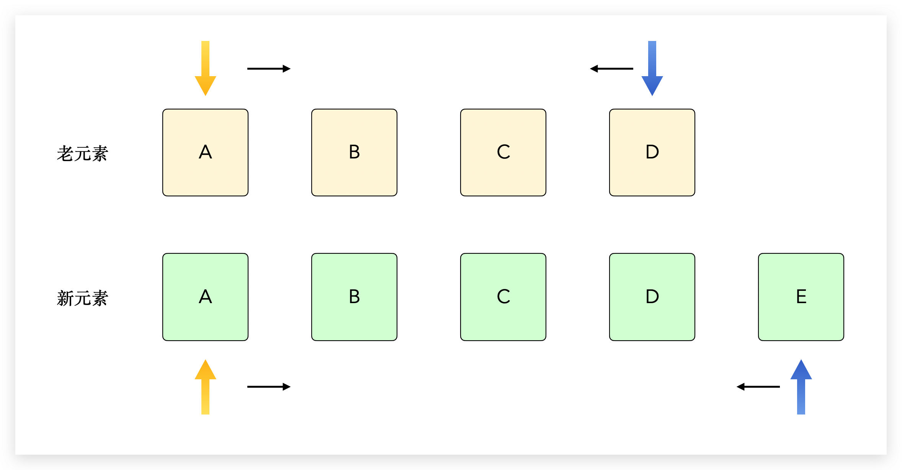

直至一方遍历完成，比对才结束；即：“老的头指针和尾指针重合"或"新的头指针和尾指针重合”；此时需要再次移动一下指针退出循环

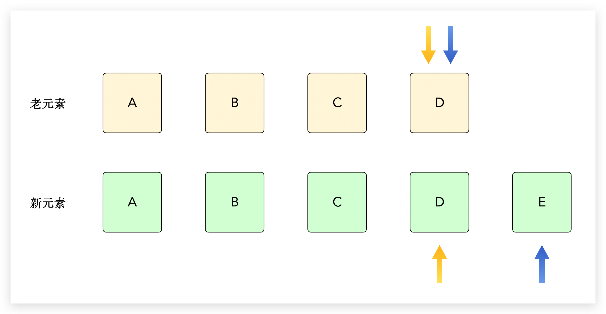

这里，为了能够提升diff算法的性能，并不会直接全部采用最消耗性能的“乱序比对”；

而是结合了实际应用场景，优先对 4 种特殊情况进行了特殊的处理：头头、尾尾、头尾、尾头：

头和头比较，将头指针向后移动，依次对比节点进行dom更新直至指针重合；
尾和尾比较，将尾指针向前移动，依次对比节点进行dom更新直至指针重合；
头和尾比较，将头指针向后移动，尾指针向前移动，依次对比节点进行dom更新直至指针重合；
尾和头比较，将尾指针向前移动，头指针向后移动，依次对比节点进行dom更新直至指针重合；

每次比对时，优先进行头头、尾尾、头尾、尾头的比对尝试，若均未能命中，才会执行最暴力的乱序比对；乱序对比是可以解决所有的更新对比问题，但是时间复杂度最高，因此在diff算法的选择中一般放在最后
将上述逻辑框架转化为代码实现，如下：

~~~~js
// src/vdom/patch.js

/**
 * 新老都有儿子时，执行乱序比对，即 diff 算法的核心逻辑
 * 备注：采用头尾双指针的方式；对头头、尾尾、头尾、尾头 4 种特殊情况做优化；
 *
 * @param {*} el 
 * @param {*} oldChildren  老子节点
 * @param {*} newChildren  新子节点
 */
function updateChildren(el, oldChildren, newChildren) {
    
    // 声明老节点头尾指针
    let oldStartIndex = 0;
    let oldStartVnode = oldChildren[0];
    let oldEndIndex = oldChildren.length - 1;
    let oldEndVnode = oldChildren[oldEndIndex];
    
    // 声明新节点头尾指针
    let newStartIndex = 0;
    let newStartVnode = newChildren[0];
    let newEndIndex = newChildren.length - 1;
    let newEndVnode = newChildren[newEndIndex];

    // while 循环的中止条件：新老其中一方遍历完成即为结束；
    // 即"老的头指针和尾指针重合"或"新的头指针和尾指针重合" 
    while(oldStartIndex <= oldEndIndex && newStartIndex <= newEndIndex){
        // 1，优先做4种特殊情况比对：头头、尾尾、头尾、尾头
        // 2，若未能命中，则采用 diff 乱序比对
        // 3，比对完成后移动指针，继续下一轮比对，直至比对完成
    }

    // 比对完成后，继续处理剩余节点...
}
~~~~

【注意】由于`diff`算法采用了`while`循环进行处理，所以复杂度为`O(n)`;

定义好了updateChildren方法接下来我们就可以来研究一下diff算法了。


## 五、diff算法实现分析

#### 情况 1：新儿子比老儿子多

###### 从头部开始移动指针

从头部开始移动指针头头比对：第一次匹配，匹配后移动新老头指针：

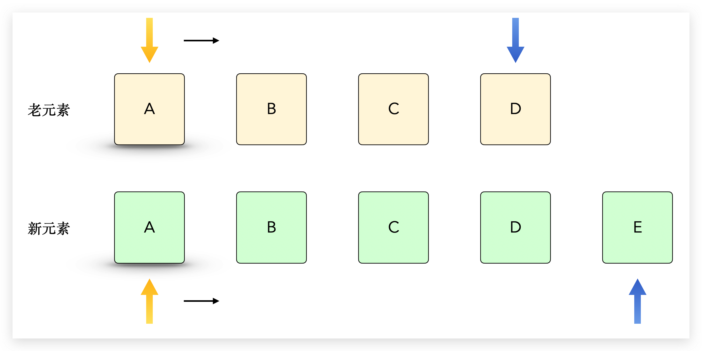

第二次匹配，匹配后移动新老头指针：

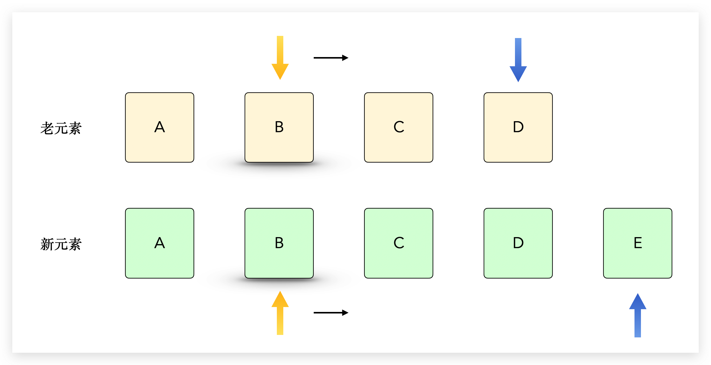

通过多次比对后，直至老节点的头尾指针发生重合，此时，`D`节点就是`while`循环的最后一次比对：

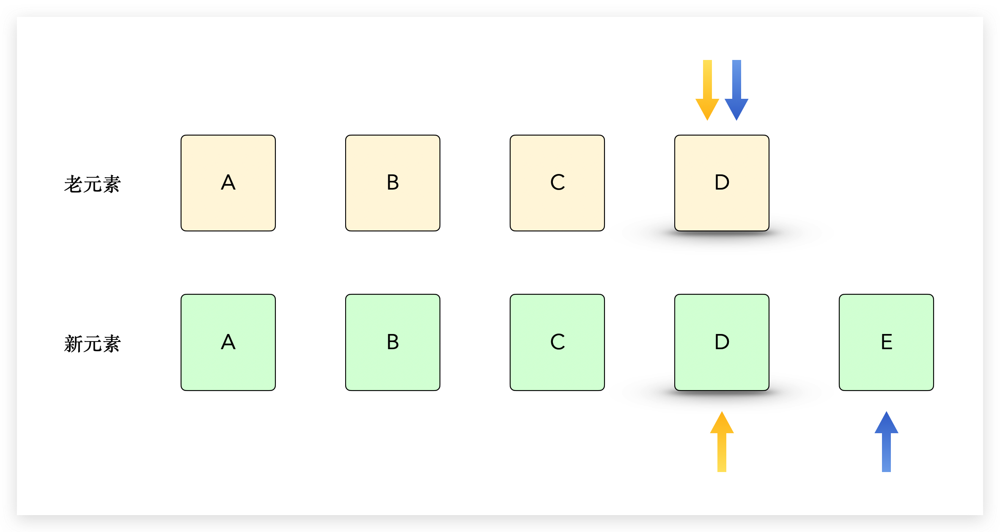

本次比对完成之后，指针会继续向后移动一次，将导致老节点的头指针越过尾指针，此时`while`循环结束；

`while`循环结束时的指针状态如下：

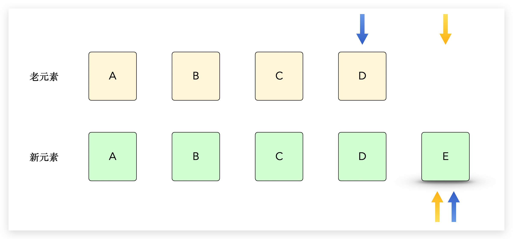

此时，新节点的头指针指向的节点`E`为新增节点，后面可能还存在`F、G、H`等其它新增节点，需要将它们（即从`newStartIndex`到`newEndIndex`之间的所有节点），全部添加到老节点的儿子集合中；

代码实现：

~~~~js
while(oldStartIndex <= oldEndIndex && newStartIndex <= newEndIndex){ 
    
    // 头头比对：
    if(isSameVnode(oldStartVnode, newStartVnode)){ 
    
        // ******* 1，比对新老虚拟节点 *******
        // isSameVnode 只能判断标签和 key 一样，但属性可能还有不同；
        // 因此，继续调用 patch 方法，对新老虚拟节点中的属性做递归更新操作；
        patch(oldStartVnode, newStartVnode); 
        
        // ******* 2，比对完成后，更新指针和节点位置 *******
        oldStartVnode = oldStartVnode[++oldStartIndex]; // 更新老的头指针和头节点
        newStartVnode = newStartVnode[++newStartIndex]; // 更新新的头指针和头节点
    } 
}

// 新的节点有多的子节点时，全部追加到 dom 中
if(newStartIndex <= newEndIndex){ 
    // 遍历多余节点：新的开始指针和新的结束指针之间的节点
    for(let i = newStartIndex; i <= newEndIndex; i++){ 
       // 获取虚拟节点并生成真实节点，添加到 dom 中 
       el.appendChild(createElm(newChildren[i])) 
    } 
}
~~~~

`isSameVnode`方法，只能判断标签和 key 是否完全一样，无法判断属性变化；因此，需要继续通过 patch 方法，对新老虚拟节点中的属性进行递归更新操作

#### 从尾部部开始移动指针

如果新增的节点在头部位置，就不能用`appendChild`了，看下面的尾尾比对分析；

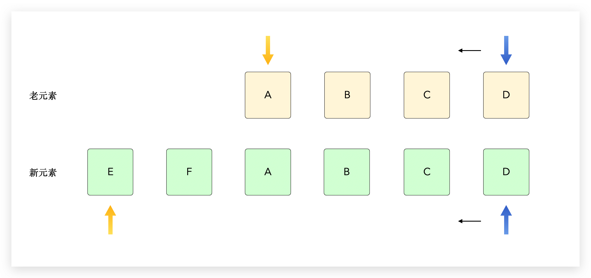

尾指针向前移动，当老节点的头尾指针重合，即`while`循环的最后一次比对：

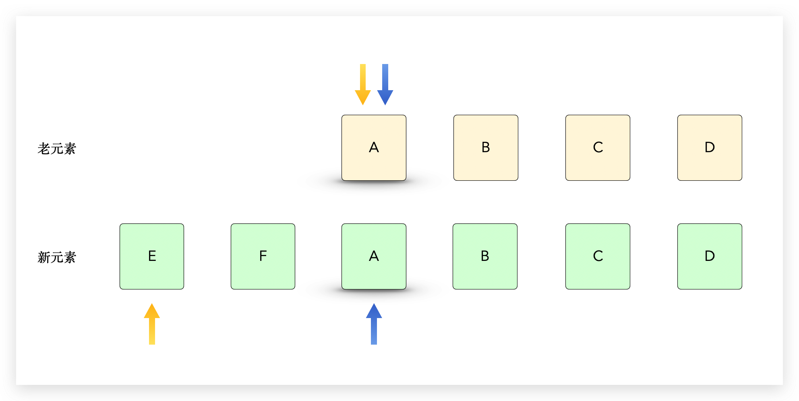

比对完成指针向前移动后，循环结束时的指针状态如下：

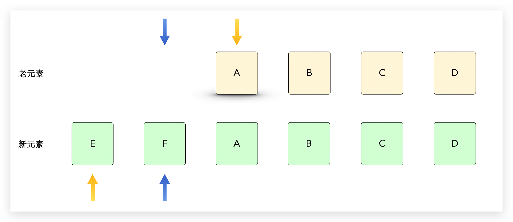

`while`比对完成后，需要将剩余新节点（`E`、`F`）添加到老儿子中的**对应位置**（当前应添加到老儿子集合的头部）


如何将新增节点`E`、`F`放置到`A`前面？

首先，想要添加到A节点的前面，就不能再使用appendChild做向后追加操作了；
前面的代码是指“从新的头指针到新的尾指针”这一区间的节点，即for (let i = newStartIndex; i <= newEndIndex; i++) 所以，从处理顺序上，是先处理E节点，再处理F节点

先处理`E`节点：将`E`节点放置到`A`节点前的位置：

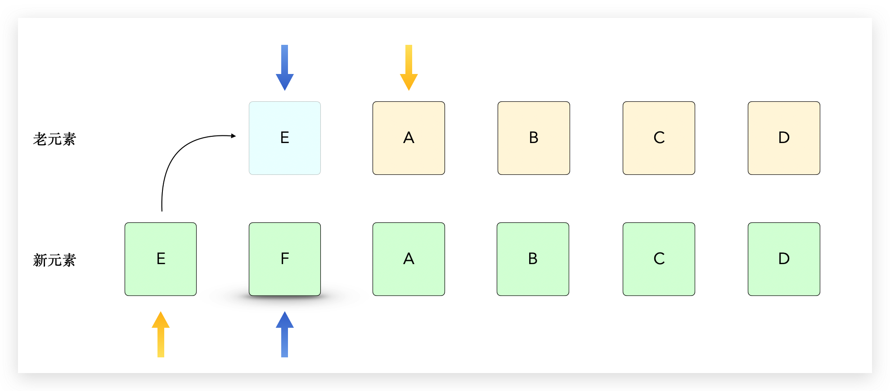

再处理`F`节点：将`F`节点插入到`A`节点与`E`节点之间的位置：

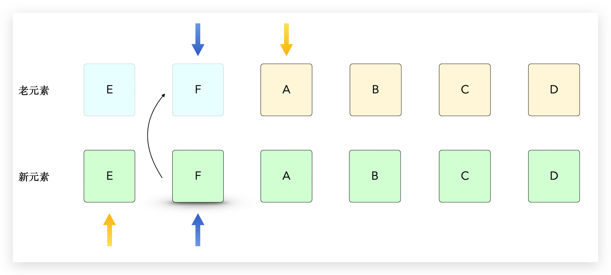

这样，当新增区域的头尾指针重合，即为最后一次比对；

方案设计：两种比对方式的合并处理
新增的节点的两种情况：有可能被追加到后面，也有可能被插入到前面：

头头比较时，将新增节点追加到老儿子集合的尾部；
尾尾比较时，将新增加点添加到老儿子集合的头部；
综合以上两种情况，如何确定向前 or 向后添加节点呢？
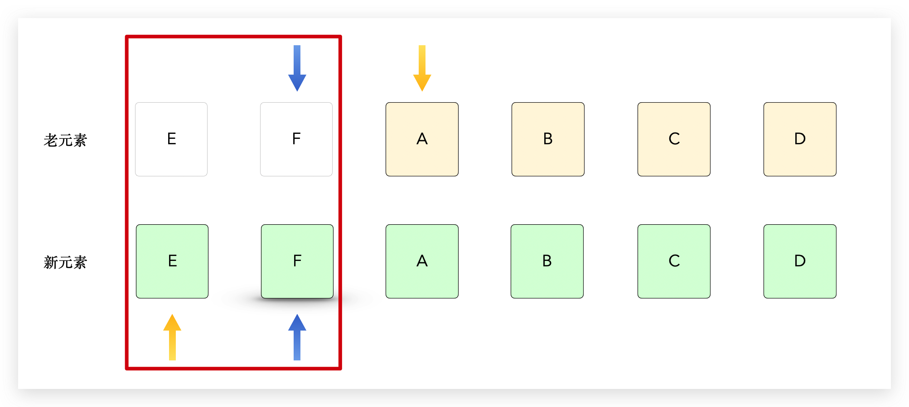

这取决于while循环结束时，新儿子集合的尾指针newChildren[newEndIndex + 1]上是否存在节点：

如果无节点：说明是从头向尾进行比对的，新增节点需要被追加到老儿子集合后面，使用appendChild直接追加即可；
如果有节点：说明是从尾向头进行比对的，新增节点需要被添加到老儿子集合前面，使用insertBefore插入指定到位置；
以上分析对应的代码实现，如下：

~~~~js
while(oldStartIndex <= oldEndIndex && newStartIndex <= newEndIndex){ 
		//     ......
  
    // 头头比对：
    else if (isSameVnode(oldEndVnode, newEndVnode)) {
      patch(oldEndVnode, newEndVnode);
      oldEndVnode = oldChildren[--oldEndIndex];
      newEndVnode = newChildren[--newEndIndex];
      // 头尾比较：老的头节点和新的尾节点做对比
    }
  
  	// ......
}

// ############# 改造之前的元素插入方式 ##############
// 1，新的多（以新指针为参照），插入新增节点
if (newStartIndex <= newEndIndex) {

  // ****** 先获取参照物 ******
  // 判断当前尾节点的下一个元素是否存在：
  //  1，如果存在：说明是尾尾比对，插入到当前尾节点下一个元素前面；
  //  2，如果不存在（下一个是 null）：说明是头头比对，追加即可
    
  // 取参考节点 anchor：决定新节点放置到前边还是后边
  //  逻辑：取 newChildren 的尾部 +1，判断是否为 null
  //  解释：若有值则说明是向前移动，取出当前虚拟元素的真实节点 el，并将新节点添加到此真实节点之前
  // （由于是向前移动比对，故此虚拟元素在前一次比对中，已经复用了老节点 el，所以直接取新的虚拟节点上的 el 即可）
  let anchor = newChildren[newEndIndex + 1] == null ? null : newChildren[newEndIndex + 1].el
  
  // ****** 再根据参照物进行处理 ******
  // 遍历多出的节点：新的开始指针和新的结束指针之间的节点
  for (let i = newStartIndex; i <= newEndIndex; i++) {
      
    // 获取对应的虚拟节点，并生成真实节点，添加到 dom 中
    // el.appendChild(createElm(newChildren[i]))
    
    // 逻辑合并：将 appendChild 更换为 insertBefore 处理
    //  效果：既有 appendChild 又有 insertBefore 功能，直接放入参考节点即可;
    //  解释：对于 insertBefore 方法，如果 anchor=null，就等同于appendChild；如果有值，则是 insertBefore；
    el.insertBefore(createElm(newChildren[i]), anchor)
  }
}
~~~~

这里非常重要的一个思想，就是找到参考节点`anchor`；之后，再将新的真实节点放置于参考节点之前即可；

注意此处`insertBefore`方法的妙用：

- 当第二个参数为`null`时，效果等同于`appendChild`追加；
- 当第二个参数不为`null`时，效果是`insertBefore`插入；

所以，同时具备了`appendChild`追加和`insertBefore`插入的效果；

以上，对新节点比老节点多的两种情况，分别进行了处理；

除此之外，还可能存在老节点比新节点多的情况，那么，该如何处理呢？

#### 情况 2：老儿子比新儿子多，删除多余

~~~~js
let render1 = compileToFunction(`<div>
    <li key="A">A</li>
    <li key="B">B</li>
    <li key="C">C</li>
    <li key="D">D</li>
</div>`);

let render2 = compileToFunction(`<div>
    <li key="A">A</li>
    <li key="B">B</li>
    <li key="C">C</li>
</div>`);
~~~~

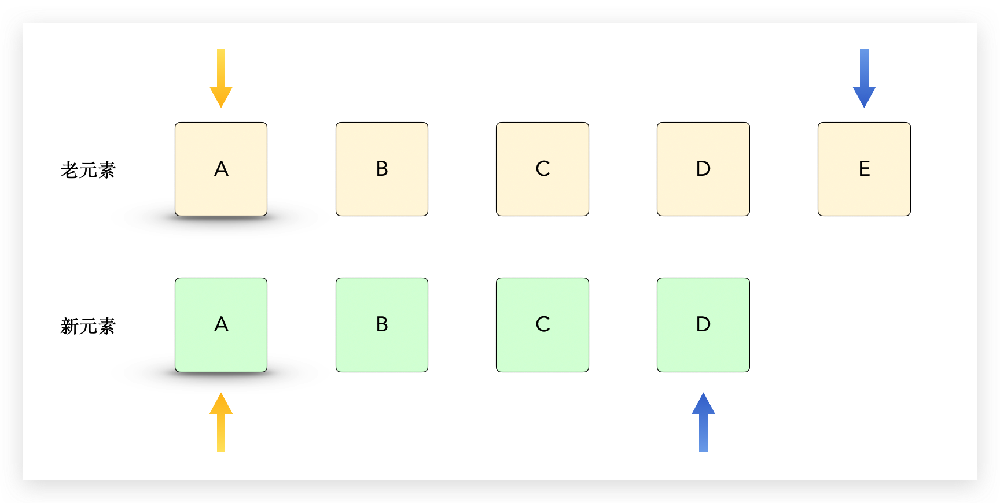

老的比新的多，在移动过程中就会出现：新的已经到头了，但老的还有；

所以，当移动结束时：老的头指针会和尾指针重合，新的头指针会越过新的尾指针；

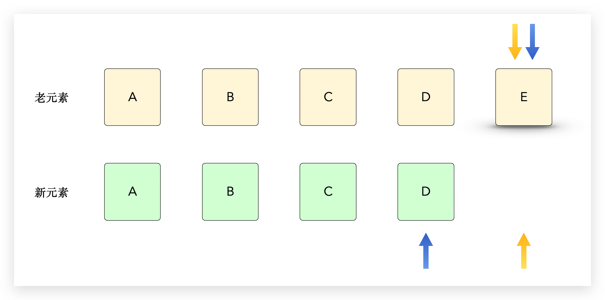

代码实现：

将老儿子集合“从头指针到尾指针”区域中，多余的真实节点删除：

```js
// 2，老儿子比新儿子多，（以旧指针为参照）删除多余的真实节点
if(oldStartIndex <= oldEndIndex){
  for(let i = oldStartIndex; i <= oldEndIndex; i++){
    let child = oldChildren[i];
    el.removeChild(child.el);
  }
}
```

#### 情况 3：反序情况（头尾、尾头）

反序情况：如图，新老儿子集合中的节点顺序是完全相反的；

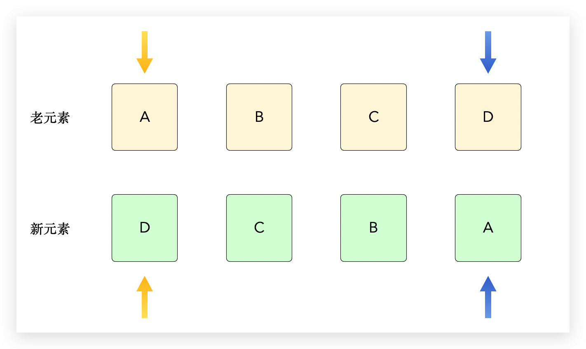

这种情况下，可以使用“老的头指针”和“新的尾指针”进行比较，即“头尾比对”

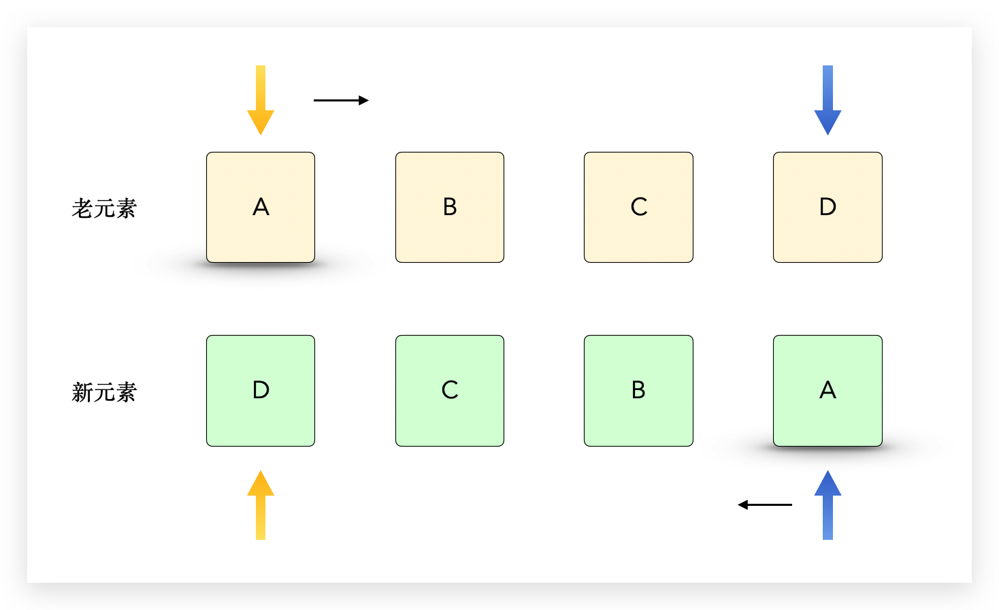

每次比较完成后，“老的头指针”向后移动，“新的尾指针”向前移动；并在比对完成后，直接将老节点`A`放置到老节点集合的最后：

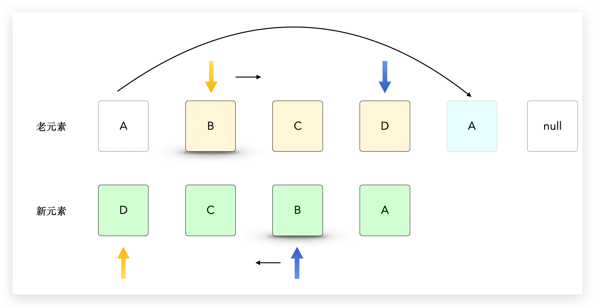

更确切的说，应该是插入到尾指针的下一个节点（`null`）之前；

（在移动前，想象尾指针指向的`D`节点后面，还存在着下一个节点为`null`）

`js`本身是无法做到“向一个元素之后添加一个元素”的；比如：`appendChild` 是向最后进行追加；

因此，在逻辑上，只能是先找到目标元素的下一个元素，再向下一个元素之前添加一个新的元素；

继续比对`B`，比对完成后继续移动指针，并移动`B`，插入到尾指针的下一个节点之前（这时尾指针`D`的下一个节点，边是上一次移动过来的`A`，所以`B`就插入到了`D`和`A`之间）

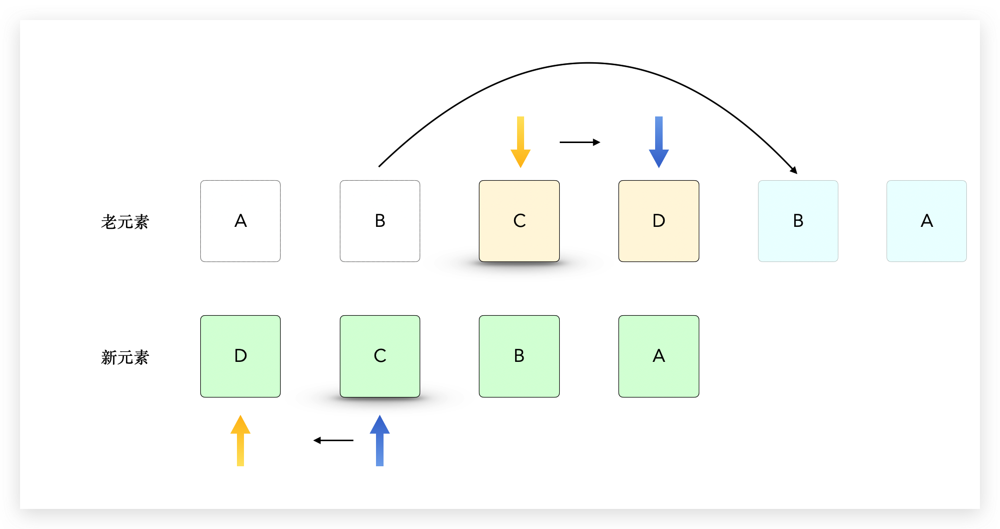

继续`C`和`C`比，比对完成后继续移动指针，并移动`C`，插入到尾指针的下一个节点之前（这时，尾指针`D`的下一个是上一次移动过来的`B`）

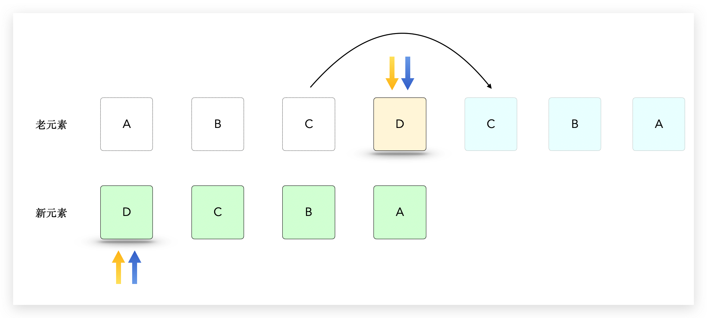

接下来继续比对D，此时，就会发现“旧的头指针”和“新的头指针”都指向了D;

这时，就比对完成了，D无需再移动，结果就是D C B A；

（整个反序过程，共移动了3 次，只对节点进行了移动操作，并没有创建新节点）

结论：对于反序操作来说，需要去比对头尾指针（老的头和新的尾），每次比对完成之后，头指针向右移动，尾指针向左移动；

代码实现，添加“头尾比较”逻辑：

~~~~js
while (oldStartIndex <= oldEndIndex && newStartIndex <= newEndIndex) {

  // if (isSameVnode(oldStartVnode, newStartVnode)) {
    // patch(oldStartVnode, newStartVnode);
    // oldStartVnode = oldChildren[++oldStartIndex];
    // newStartVnode = newChildren[++newStartIndex];
  // }else if(isSameVnode(oldEndVnode, newEndVnode)){
    // patch(oldEndVnode, newEndVnode);
    // oldEndVnode = oldChildren[--oldEndIndex];
    // newEndVnode = newChildren[--newEndIndex];
  // } 
  // 头尾比较：老的头节点和新的尾节点做对比
  else if(isSameVnode(oldStartVnode, newEndVnode)){
    // patch 方法只会 diff 比较并更新属性，但元素的位置不会变化
    patch(oldStartVnode, newEndVnode); // diff：会递归比对儿子
    
    // 移动节点：将当前的节点插入到最后一个节点的下一个节点的前面去
    el.insertBefore(oldStartVnode.el, oldEndVnode.el.nextSibling);
    
    // 指针置位--下一次循环继续处理
    oldStartVnode = oldChildren[++oldStartIndex];
    newEndVnode = newChildren[--newEndIndex];
  }
  // 尾头比较：老得尾节点和新的头节点比较
  else if (isSameVnode(oldEndVnode, newStartVnode)) {
    patch(oldEndVnode, newStartVnode);  // patch方法只会更新属性，元素的位置不会变化
    // 移动节点:将老的尾节点移动到老的头节点前面去
    el.insertBefore(oldEndVnode.el, oldStartVnode.el);// 将尾部插入到头部
    // 移动指针
    oldEndVnode = oldChildren[--oldEndIndex];
    newStartVnode = newChildren[++newStartIndex];
  } 
}
~~~~

#### 情况4：前面四种对比方式节点都不相同，此时采用乱序对比

- 一方有儿子，一方没有儿子；
  - 老的有儿子，新的没有儿子：直接将多余的老 dom 元素删除即可；
  - 老的没有儿子，新的有儿子：直接将新的儿子节点放入对应的老节点中即可；
- 新老节点都有儿子时，进行头头、尾尾、头尾、尾头对比；
- 头头、尾尾、头尾、尾头均没有命中时，进行乱序比对；

##### 1、乱序比对方案

下面这种情况，头头、尾尾、头尾、尾头都不相同：

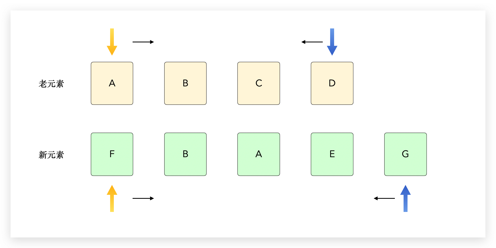

在理想情况下，`A`、`B` 节点是可以被复用的：


以新节点为主，以老节点做参照，先到老儿子集合中去找能复用的节点，再将不能复用老节点删掉；

根据老儿子集合，创建一个节点`key`和索引`index`的映射关系`mapping`，用于判定节点是否可被复用

取新节点，依次到老的索引列表`mapping`中查找是否存在，如果存在就复用，不存在则重新创建

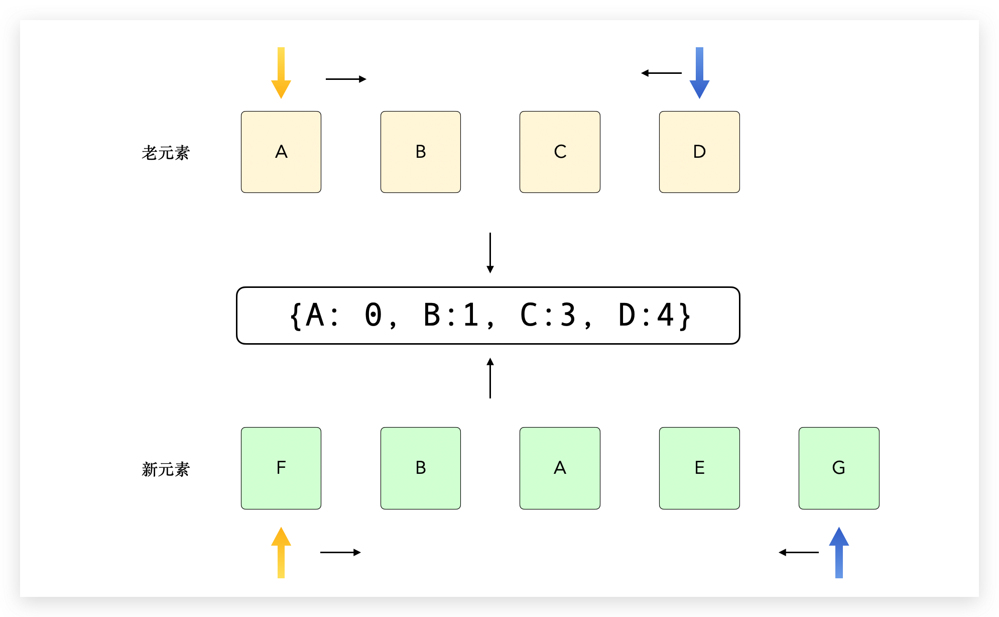


##### 2、乱序比对过程分析

1，先比对一下头头、尾尾、头尾、尾头，都没有命中：

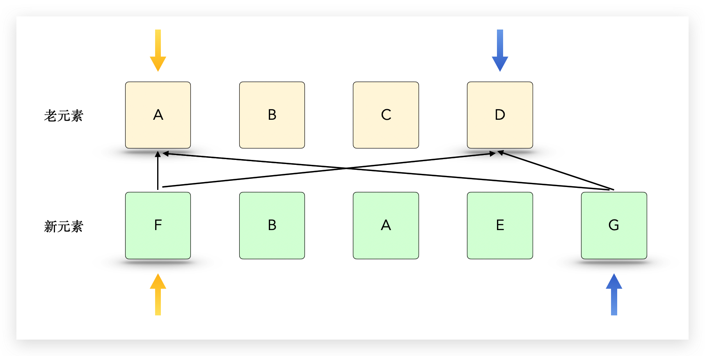

查找`F`是否在映射关系中，不在，直接做插入操作：插入到老的头指针前面的位置

即：将`F`节点插入到`A`节点的前面，并将新的头指针向后移动：

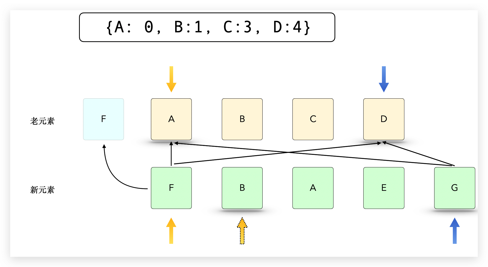

2，再对比一下头头、尾尾、头尾、尾头，还是没有命中：

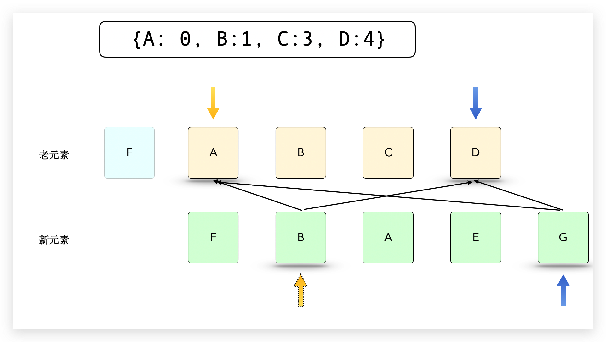

继续查找`B`是否在映射关系中，`B`在映射关系中，复用`B`节点并做移动操作：将复用节点移动到头指针指向节点的前面；

即：将老的`B`节点移动到`A`节点的前面，并将新的头指针向后移动：

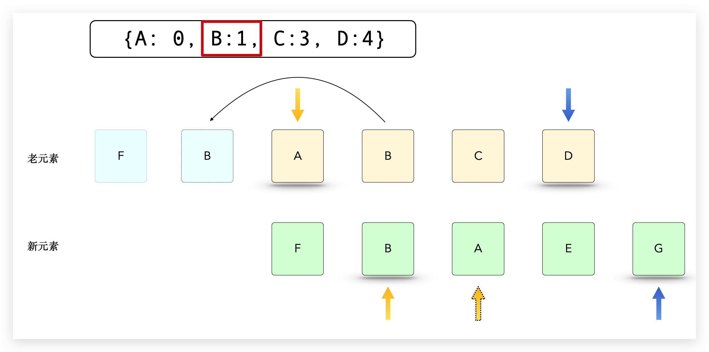

3，继续比对一次头头、尾尾、头尾、尾头，命中了头头比对：

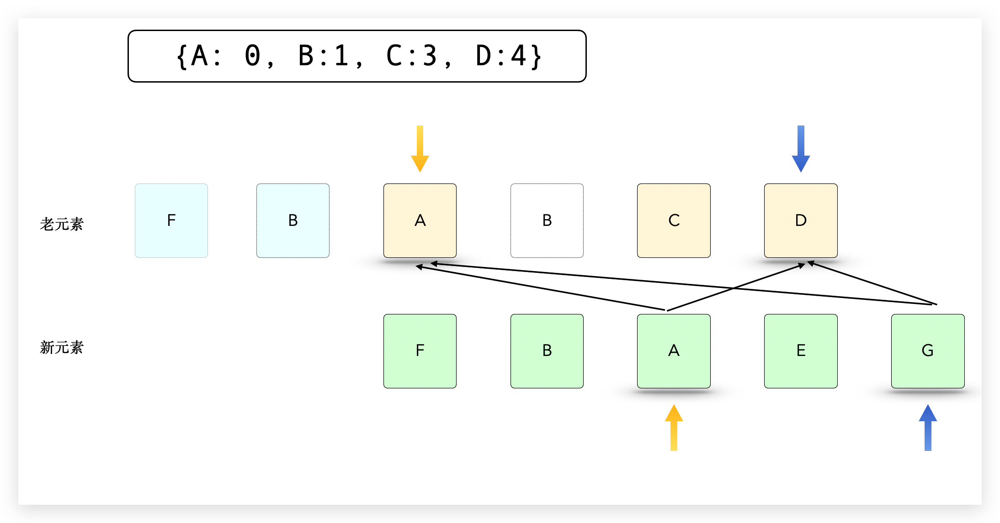

这时，按照头头比对的逻辑：老的头指针向后移动，新的头指针也向后移动；（同理，如果命中尾尾比对，将新老尾指针都向前进行移动）

由于之前`B`节点已经移动到`A`节点前面了，所以老的头指针需要跳过原始`B`节点的位置，直接移动到`C`节点所在的位置：

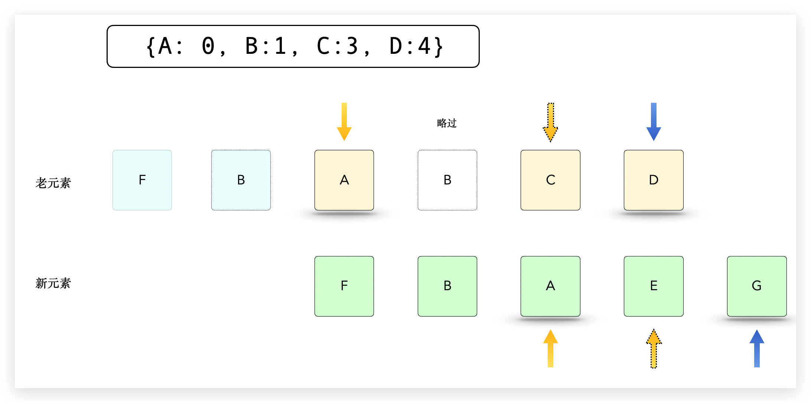

这里使用到了之前`B`节点移动走之后所做的空位置标记；

4，继续比对一次头头、尾尾、头尾、尾头，没有命中：

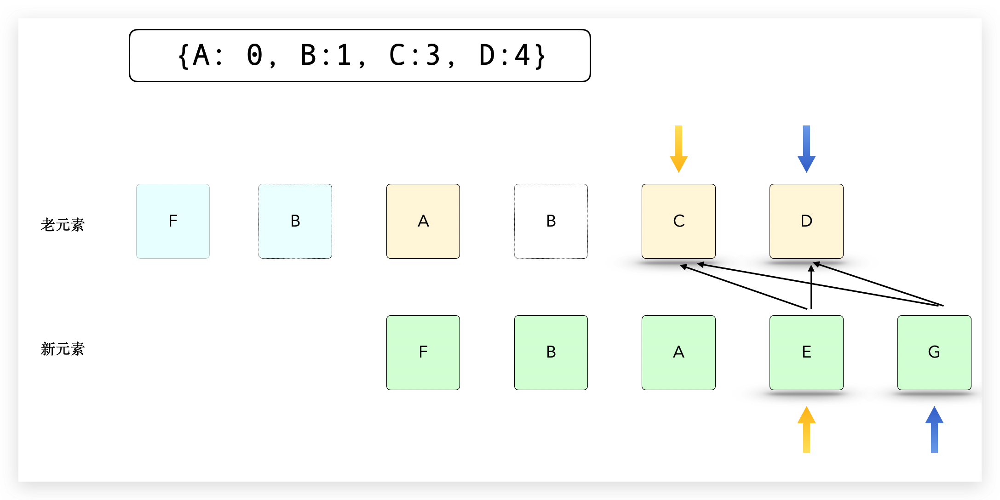

查找`E`是否在映射关系中，不在，直接做插入操作：插入到老的头指针前面的位置

即：将`E`节点插入到`C`节点的前面，并将新的头指针向后移动：

永远是插入到老的头指针前面的位置；

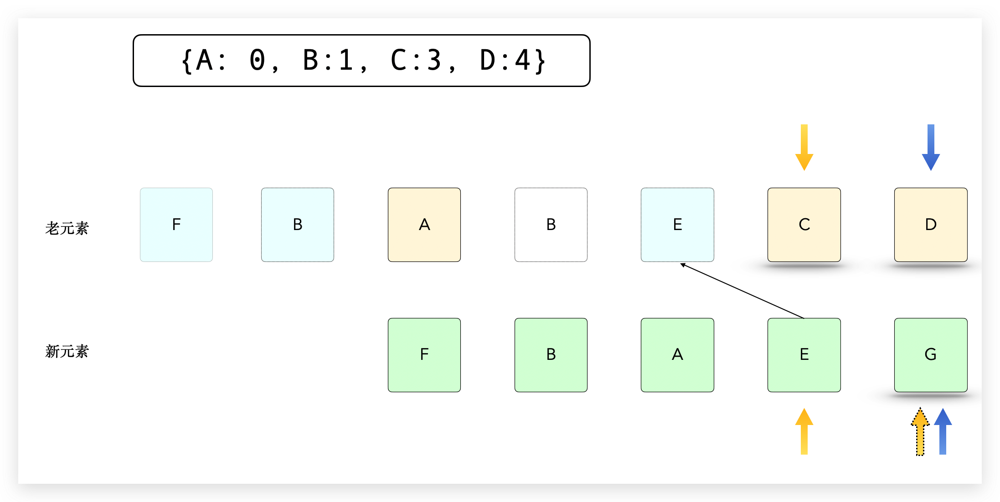

5，继续比对一次头头、尾尾、头尾、尾头，没有命中：

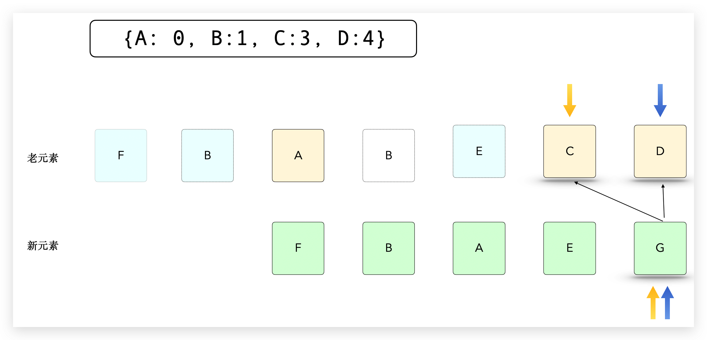

查找`G`是否在映射关系中，不在，直接做插入操作：插入到老的头指针前面的位置;

即：将`G`节点插入到`C`节点的前面，并将新的头指针向后移动：


6，由于新儿子数组已全部比对完成，剩余的老节点直接删除即可

依次删除“从老的头节点到老的尾节点”区域的全部节点：

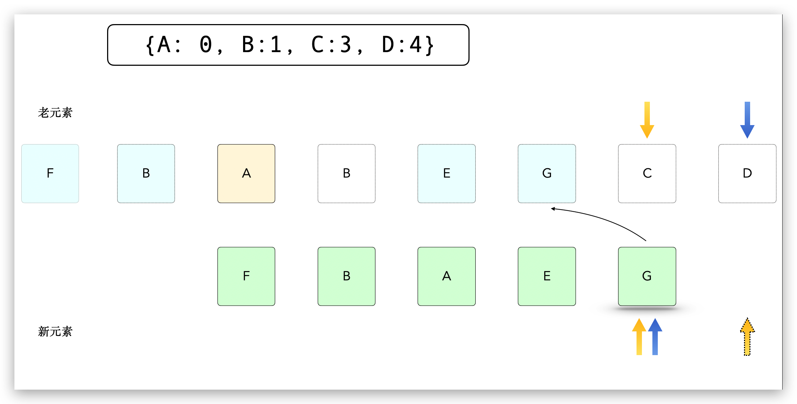

所以，最终结果为`F B A E G`；其中，对`A、B`节点实现了节点复用；


根据老儿子集合创建一个节点key和索引index的映射关系 mapping；用新儿子节点依次到mapping中查找是否存在可复用的节点；

存在复用节点，更新可复用节点属性并移动到对应位置；（移动走的老位置要做空标记）
不存在复用节点，创建节点并添加到对应位置；
最后，再将不可复用的老节点删除；

##### 3、乱序对比的代码实现

~~~~js
function updateChildren(el, oldChildren, newChildren) {
  /**
   * 根据children创建映射
   * 根据老儿子集合创建节点key与索引index的映射关系mapping：
   */
  function makeKeyByIndex(children) {
    let map = {}
    children.forEach((item, index) => {
      map[item.key] = index;
    })
    return map
  }

  let mapping = makeKeyByIndex(oldChildren);

  // while 循环处理，所以 diff 算法的复杂度为O(n)，只循环一遍
  // 循环结束条件：有一方遍历完了就结束；即"老的头指针和尾指针重合"或"新的头指针和尾指针重合"
  // 备注: 此while循环中主要对4种特殊情况进行优化处理,包括：头头、尾尾、头尾、尾头
  while (oldStartIndex <= oldEndIndex && newStartIndex <= newEndIndex) {
    
    // 定义空节点跳过指针的逻辑
    if (!oldStartVnode) {
      oldStartVnode = oldChildren[++oldStartIndex];
    } else if (!oldEndVnode) {
      oldEndVnode = oldChildren[--oldEndIndex];
    }
    ...
    ...
    ...
    
    else {
      // 前面4种逻辑（头头、尾尾、头尾、尾头）,主要是考虑到用户使用时的一些特殊场景，但也有非特殊情况，如：乱序排序
      // 筛查当前新的头指针对应的节点在mapping中是否存在
      let moveIndex = mapping[newStartVnode.key]
      // 没有，将当前比对的新节点插入到老的头指针对用的节点前面
      if (moveIndex == undefined) {
        // 将当前新的虚拟节点创建为真实节点，插入到老的开始节点前面
        el.insertBefore(createElm(newStartVnode), oldStartVnode.el);
        // 有,需要复用
      } else {  
        // 将当前比对的老节点移动到老的头指针前面
        // 从老的队列中找到可以被复用的这个节点
        let moveVnode = oldChildren[moveIndex];
        // 复用：更新复用节点的属性，插入对应位置
        patch(moveVnode, newStartVnode)
        el.insertBefore(moveVnode.el, oldStartVnode.el);
        // 由于复用的节点在oldChildren中被移走了,之前的位置要标记为空(指针移动时，跳过会使用)
        oldChildren[moveIndex] = undefined;
      }
      // 每次处理完成后，新节点的头指针都需要向后移动
      // 备注：
      // 		无论节点是否可复用，新指针都会向后移动，所以最后统一处理；
      //    节点可复用时，老节点的指针移动会在4种特殊情况中被处理完成；
      newStartVnode = newChildren[++newStartIndex];
    }
  }

  .....
  .....
}
~~~~

至此所有的diff对比就给大家介绍完了，下面我们看看patch的完整实现：

~~~~js
// src/vdom/patch.js

/**
 * 将虚拟节点转为真实节点后插入到元素中
 * @param {*} oldVnode  老的虚拟节点
 * @param {*} vnode     新的虚拟节点
 * @returns             新的真实元素
 */
export function patch(oldVnode, vnode) {

  // 是否真实节点：虚拟节点无此属性
  const isRealElement = oldVnode.nodeType;  
  
  if (isRealElement) {// 真实节点
  
    // 1，根据虚拟节点创建真实节点
    const elm = createElm(vnode);
    
    // 2，使用真实节点替换掉老节点
    // 找到元素的父亲节点
    const parentNode = oldVnode.parentNode;
    // 找到老节点的下一个兄弟节点（nextSibling 若不存在将返回 null）
    const nextSibling = oldVnode.nextSibling;
    
    // 将新节点 elm 插入到老节点 el 的下一个兄弟节点 nextSibling 的前面
    // 备注：若 nextSibling 为 null，insertBefore 等价于 appendChild
    parentNode.insertBefore(elm, nextSibling);
    
    // 删除老节点 el
    parentNode.removeChild(oldVnode);
    
    return elm;
  } else { // diff：新老虚拟节点比对
    
    // 1，同级比对，不是相同节点时，不考虑复用（放弃跨层复用），直接用新的替换旧的
    if (!isSameVnode(oldVnode, vnode)) {
      return oldVnode.el.parentNode.replaceChild(createElm(vnode), oldVnode.el);
    }

    // 2，相同节点时，复用老节点，更新差异点（比如：属性）
    // 文本没有标签名，需要进行单独处理：由于文本不存在儿子，直接更新即可（组件Vue.component（‘xxx’）即为组件 tag）
    let el = vnode.el = oldVnode.el;  // 节点复用：将老节点el，赋值给新节点el
    
    
    if (!oldVnode.tag) {  // 文本：没有标签名
      // 文本内容发生变化时，用新内容覆盖老内容
      if (oldVnode.text !== vnode.text) {
        return el.textContent = vnode.text;
      }
    }

    // 元素的处理：相同节点，且新老节点不都是文本时
    updateProperties(vnode, oldVnode.data);

    // 比较儿子节点
    let oldChildren = oldVnode.children || {};
    let newChildren = vnode.children || {};
    
    // 情况 1：老的有儿子，新的没有儿子；直接把老的 dom 元素干掉即
    if (oldChildren.length > 0 && newChildren.length == 0) {
      el.innerHTML = '';//暴力写法直接清空；更好的处理是封装removeChildNodes方法：将子节点全部删掉，因为子节点可能包含组件
      
    // 情况 2：老的没有儿子，新的有儿子；直接将新的插入即可
    } else if (oldChildren.length == 0 && newChildren.length > 0) {
      newChildren.forEach((child) => {// 注意：这里的child是虚拟节点，需要变为真实节点
        let childElm = createElm(child); // 根据新的虚拟节点，创建一个真实节点
        el.appendChild(childElm);// 将生成的真实节点，放入 dom
      })
      
    // 情况 3：新老都有儿子
    } else {  
      // 递归: updateChildren 内部会调用 patch方法，
      // patch 方法内部还会继续调用 updateChildren； (patch 方法是更新的入口)
      updateChildren(el, oldChildren, newChildren)
    }
    
    return el;// 返回新节点
  }
}

/**
 * 新老都有儿子时做比对，即 diff 算法核心逻辑
 * 备注：采用头尾双指针的方式；优化头头、尾尾、头尾、尾头的特殊情况；
 * @param {*} el 
 * @param {*} oldChildren  老的儿子节点
 * @param {*} newChildren  新的儿子节点
 */
function updateChildren(el, oldChildren, newChildren) {
  // vue2中的diff算法内部做了优化，尽量提升性能，实在不行再暴力比对
  // 常见情况：在列表中，新增或删除某一项（用户很少在列表的中间添加一项）

  // 声明头尾指针
  let oldStartIndex = 0;
  let oldStartVnode = oldChildren[0];
  let oldEndIndex = oldChildren.length - 1;
  let oldEndVnode = oldChildren[oldEndIndex];

  let newStartIndex = 0;
  let newStartVnode = newChildren[0];
  let newEndIndex = newChildren.length - 1;
  let newEndVnode = newChildren[newEndIndex];

  /**
   * 根据children创建映射
   * 根据老儿子集合创建节点key与索引index的映射关系mapping：
   */
  function makeKeyByIndex(children) {
    let map = {}
    children.forEach((item, index) => {
      map[item.key] = index;
    })
    return map
  }

  let mapping = makeKeyByIndex(oldChildren);

  // while 循环处理，所以 diff 算法的复杂度为O(n)，只循环一遍
  // 循环结束条件：有一方遍历完了就结束；即"老的头指针和尾指针重合"或"新的头指针和尾指针重合"
  // 备注: 此while循环中主要对4种特殊情况进行优化处理,包括：头头、尾尾、头尾、尾头
  while (oldStartIndex <= oldEndIndex && newStartIndex <= newEndIndex) {
    // 当前循环开始时，先处理当前的oldStartVnode和oldEndVnode为空的情况； 原因：节点之前被移走时置空，直接跳过
    if (!oldStartVnode) {
      oldStartVnode = oldChildren[++oldStartIndex];
    } else if (!oldEndVnode) {
      oldEndVnode = oldChildren[--oldEndIndex];
      // 头头比较：比较新老开始节点
    } else if (isSameVnode(oldStartVnode, newStartVnode)) {
      // isSameVnode只能判断标签和key是否一样，但还有可能属性不一样
      // 所以还需要使用patch方法比对新老虚拟节点的属性，
      // 而patch方法是递归比对的，同时还会递归比较子节点
      patch(oldStartVnode, newStartVnode);
      // 更新新老头指针和新老头节点
      oldStartVnode = oldChildren[++oldStartIndex];
      newStartVnode = newChildren[++newStartIndex];
      // 尾尾比较：比较新老末尾节点
    } else if (isSameVnode(oldEndVnode, newEndVnode)) {
      patch(oldEndVnode, newEndVnode);
      oldEndVnode = oldChildren[--oldEndIndex];
      newEndVnode = newChildren[--newEndIndex];
      // 头尾比较：老的头节点和新的尾节点做对比
    } else if (isSameVnode(oldStartVnode, newEndVnode)) {
      // patch方法只会duff比较并更新属性，但元素的位置不会变化
      // diff:包括递归比儿子
      patch(oldStartVnode, newEndVnode);
      // 移动节点：将当前的节点插入到最后一个节点的下一个节点的前面去
      el.insertBefore(oldStartVnode.el, oldEndVnode.el.nextSibling);
      // 移动指针
      oldStartVnode = oldChildren[++oldStartIndex];
      newEndVnode = newChildren[--newEndIndex];
      // 尾头比较
    } else if (isSameVnode(oldEndVnode, newStartVnode)) {
      // patch方法只会更新属性，元素的位置不会变化
      patch(oldEndVnode, newStartVnode);  
      // 移动节点:将老的尾节点移动到老的头节点前面去
      // 将尾部插入到头部
      el.insertBefore(oldEndVnode.el, oldStartVnode.el);
      // 移动指针
      oldEndVnode = oldChildren[--oldEndIndex];
      newStartVnode = newChildren[++newStartIndex];
    } else {
      // 前面4种逻辑（头头、尾尾、头尾、尾头）,主要是考虑到用户使用时的一些特殊场景，但也有非特殊情况，如：乱序排序
      // 筛查当前新的头指针对应的节点在mapping中是否存在
      let moveIndex = mapping[newStartVnode.key]
      // 没有，将当前比对的新节点插入到老的头指针对用的节点前面
      if (moveIndex == undefined) {
        // 将当前新的虚拟节点创建为真实节点，插入到老的开始节点前面
        el.insertBefore(createElm(newStartVnode), oldStartVnode.el);
        // 有,需要复用
      } else {  
        // 将当前比对的老节点移动到老的头指针前面
        // 从老的队列中找到可以被复用的这个节点
        let moveVnode = oldChildren[moveIndex];
        // 复用：更新复用节点的属性，插入对应位置
        patch(moveVnode, newStartVnode)
        el.insertBefore(moveVnode.el, oldStartVnode.el);
        // 由于复用的节点在oldChildren中被移走了,之前的位置要标记为空(指针移动时，跳过会使用)
        oldChildren[moveIndex] = undefined;
      }
      // 每次处理完成后，新节点的头指针都需要向后移动
      // 备注：
      // 		无论节点是否可复用，新指针都会向后移动，所以最后统一处理；
      //    节点可复用时，老节点的指针移动会在4种特殊情况中被处理完成；
      newStartVnode = newChildren[++newStartIndex];
    }
  }

  // 至此，完成了相同节点的比较，下面开始处理不同的节点

  // 1，新的多（以新指针为参照）插入新增的
  if (newStartIndex <= newEndIndex) {
    // 新的开始指针和新的结束指针之间的节点
    for (let i = newStartIndex; i <= newEndIndex; i++) {
      // 判断当前尾节点的下一个元素是否存在：
      //  1，如果存在：则插入到下一个元素的前面
      //  2，如果不存在（下一个是 null） ：就是 appendChild
      // 取参考节点anchor:决定新节点放到前边还是后边
      //  逻辑：取去newChildren的尾部+1,判断是否为 null
      //  解释：如果有值说明是向前移动的，取出此虚拟元素的真实节点el，将新节点添加到此真实节点前即可
      let anchor = newChildren[newEndIndex + 1] == null ? null : newChildren[newEndIndex + 1].el
      // // 获取对应的虚拟节点，并生成真实节点，添加到 dom 中
      // el.appendChild(createElm(newChildren[i]))
      // 逻辑合并:将 appendChild 改为 insertBefore
      //  效果：既有appendChild又有insertBefore的功能，直接将参考节点放进来即可;
      //  解释：对于insertBefore方法,如果anchor为null，等同于appendChild;如果有值，则是insertBefore;
      el.insertBefore(createElm(newChildren[i]), anchor)
    }
  }
  // 2，旧的多，（以旧指针为参照）删除多余的真实节点
  if (oldStartIndex <= oldEndIndex) {
    for (let i = oldStartIndex; i <= oldEndIndex; i++) {
      let child = oldChildren[i];
      // child有值时才删除；原因：节点有可能在移走时被置为undefined
      child && el.removeChild(child.el);
    }
  }
}
~~~~

这里有一个在线对比网站https://wanglin2.github.io/VNode_visualization_demo/ 可以帮助大家更好的理解对比过程


至此我们的vue框架就实现完了，这个框架中比较完整的实现了数据响应式，订阅发布模式，dom更新机制，除此之外还有的生命周期，指令系统，组件系统，以及插件系统，因为实现相对比较简单，我们没有继续深入实现。


## 重要总结

1、知道并了解数据代理的实现原理

2、能够使用Object.defineProperty实现数据的响应式

3、知道并了解 Observer Dep Watcher的关系

4、能够说出watch选项和$watch方法的实现

5、能够说出computed的实现原理

6、能够说出$set的实现原理

7、知道并了解数组的响应式实现

8、能够回答双向绑定原理和数据响应式原理的面试题

9、能够了解$mount的作用

10、知道并了解vue中的dom渲染流程

11、能够说出$nextTick的实现过程

12、能够解释为什么dom的渲染是异步的

13、知道并了解diff算法的实现