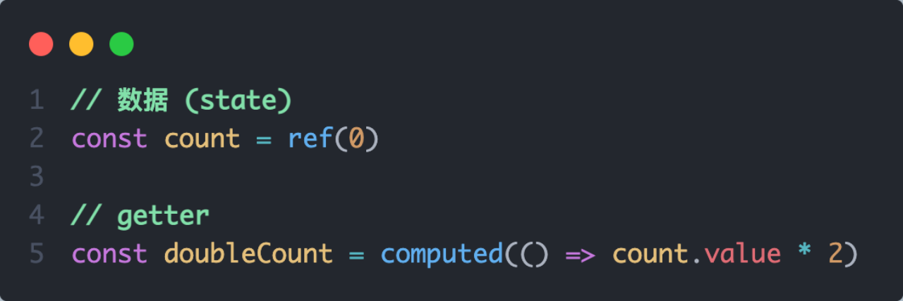
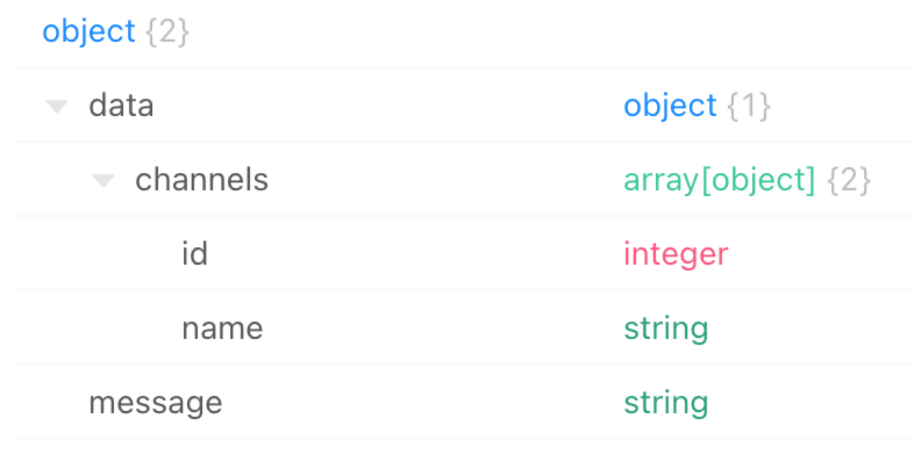
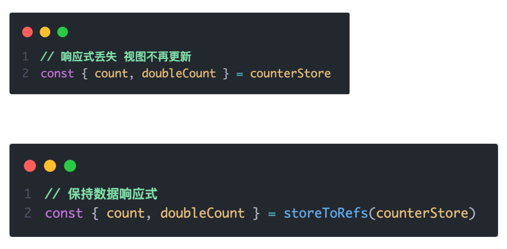
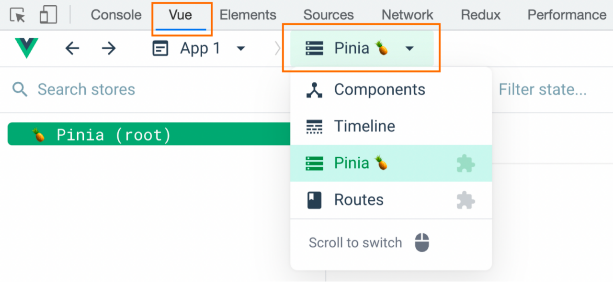

# 1. 什么是Pinia
Pinia 是 Vue 的专属的最新状态管理库 ，是 Vuex 状态管理工具的替代品


# 2. 手动添加Pinia到Vue项目
后面在实际开发Vue医疗项目的时候，Pinia可以在项目创建时自动添加，现在我们初次学习，从零开始：

1.  使用 Vite 创建一个空的TS + Vue3项目
```bash
npm create vite@latest  vue-pinia-ts -- --template vue-ts  
```

2.  按照官方文档安装 pinia 到项目中 

# 3. Pinia基础使用

1. 定义store
2. 组件使用store


# 4. getters实现
Pinia中的 getters 直接使用 computed函数 进行模拟, 组件中需要使用需要把 getters return出去



# 5. action异步实现
方式：异步action函数的写法和组件中获取异步数据的写法完全一致


需求：在Pinia中获取频道列表数据并把数据渲染App组件的模板中


# 6. storeToRefs工具函数
使用storeToRefs函数可以辅助保持数据（state + getter）的响应式解构


# 7. Pinia的调试
Vue官方的 dev-tools 调试工具 对 Pinia直接支持，可以直接进行调试

