## 什么是Vue

概念：Vue  是一套 **构建用户界面 ** 的 **渐进式** **框架**

Vue2官网：<https://v2.cn.vuejs.org/>

**1.什么是构建用户界面**

**基于数据**渲染出用户可以看到的**界面**

**基于数据动态渲染页面**


**2.什么是渐进式**

所谓渐进式就是**循序渐进**，不一定非得把Vue中的所有API都学完才能开发Vue，可以学一点开发一点


**Vue的两种开发方式：**

1. Vue核心包开发

   场景：**局部**模块改造

2. Vue核心包 & Vue插件 & 工程化

   场景：**整站**开发


**3.什么是框架**

所谓框架：就是一套完整的解决方案

- 库，类似工具箱，是一堆方法的集合，比如 axios、lodash、echarts等
- 框架，是一套完整的解决方案，实现了大部分功能，我们只需要按照一定的规则去编码即可。

框架的特点：有一套必须让开发者遵守的**规则**或者**约束**

咱们学框架就是学习的这些规则 [官网](https://v2.cn.vuejs.org/)


## 创建Vue实例

我们已经知道了Vue框架可以 **基于数据帮助我们渲染出用户界面**，那应该怎么做呢？


**核心步骤（4步）：**

1. **准备容器（vue所管理的范围）**
2. **引包（官网） — 开发版本**
3. **创建Vue实例  new Vue()**
4. **指定配置项，渲染数据**
   1. el : 指定挂载点 (后面跟上选择器)
   2. data ：提供数据

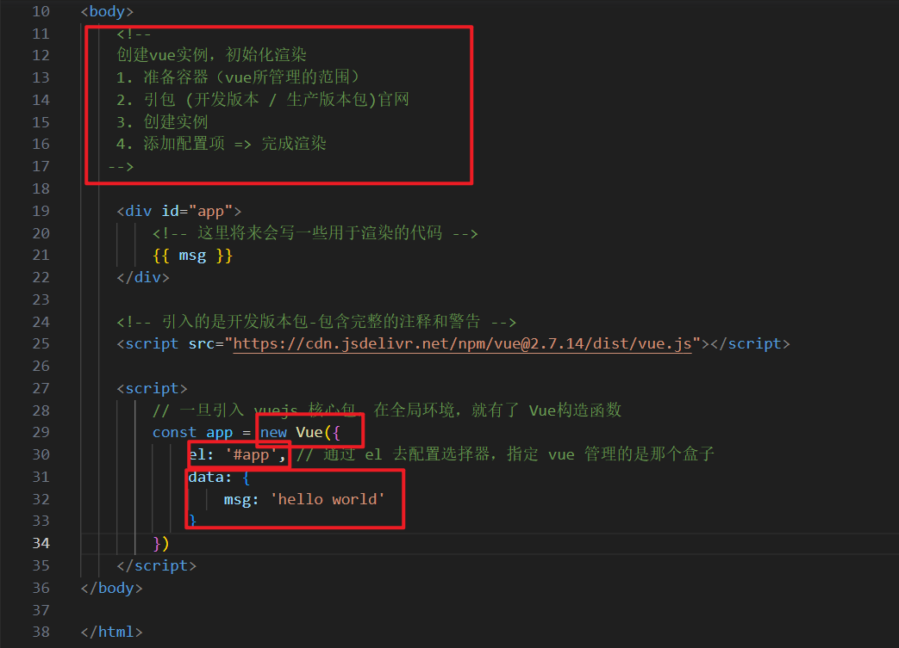


## 插值表达式 {{}}

插值表达式是一种Vue的模板语法

我们可以用插值表达式渲染出Vue提供的数据

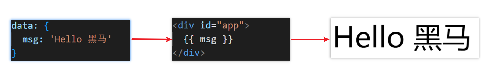

**1.作用：利用表达式进行插值，渲染到页面中**

表达式：是可以被求值的代码，JS引擎会讲其计算出一个结果


**2.语法**

插值表达式语法：**{{ 表达式 }}**

```js
<h3>{{title}}<h3>

<p>{{nickName.toUpperCase()}}</p>

<p>{{age >= 18 ? '成年':'未成年'}}</p>

<p>{{obj.name}}</p>

<p>{{fn()}}</p>

// 注意点：
// 1. 使用的数据要存在
// 2. 支持的是表达式，不是语句 if for
// 3. 不能在标签属性中使用 {{}}
```


**3.错误用法**

```js
//1.在插值表达式中使用的数据 必须在data中进行了提供
<p>{{hobby}}</p>  //如果在data中不存在 则会报错

//2.支持的是表达式，而非语句，比如：if   for ...
<p>{{if}}</p>

//3.不能在标签属性中使用 {{  }} 插值 (插值表达式只能标签中间使用)
<p title="{{username}}">我是P标签</p>  
```


## 响应式特性

**1.什么是响应式？**

​    简单理解就是数据变，视图对应变。 响应式数据：数据变化了，视图自动更新

​	聚焦于数据 --> **数据驱动视图**


**2.如何访问 和 修改 data中的数据**

data中的数据, 最终会被添加到实例上

① 访问数据： "**实例.属性名**"

② 修改数据： **"实例.属性名"= "值"**

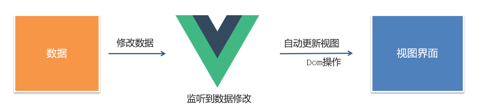


## Vue开发者工具安装

1. 通过谷歌应用商店安装（国外网站）
2. 极简插件下载（推荐） <https://chrome.zzzmh.cn/index>

安装步骤：

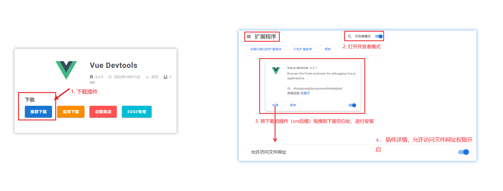


安装之后可以F12后看到多一个Vue的调试面板


## Vue中的常用指令

**概念：**指令（Directives）是 Vue 提供的带有 **v- 前缀** 的 特殊 标签**属性**。

vue 中的指令按照不同的用途可以分为如下 6 大类：

-  内容渲染指令（v-html、v-text）
-  条件渲染指令（v-show、v-if、v-else、v-else-if）
-  事件绑定指令（v-on）
-  属性绑定指令 （v-bind）
-  双向绑定指令（v-model）
-  列表渲染指令（v-for）

指令是 vue 开发中最基础、最常用、最简单的知识点。


## 内容渲染指令

内容渲染指令用来辅助开发者渲染 DOM 元素的文本内容。常用的内容渲染指令有如下2 个：

- **v-text**（类似innerText）


- - 使用语法：`<p v-text="uname">hello</p>`，意思是将 uame 值渲染到 p 标签中
  - 类似 innerText，使用该语法，会覆盖 p 标签原有内容


- **v-html**（类似 innerHTML）


- - 使用语法：`<p v-html="intro">hello</p>`，意思是将 intro 值渲染到 p 标签中
  - 类似 innerHTML，使用该语法，会覆盖 p 标签原有内容
  - 类似 innerHTML，使用该语法，能够将HTML标签的样式呈现出来。

代码演示：

```js
 
  <div id="app">
    <h2>个人信息</h2>
	// 既然指令是vue提供的特殊的html属性，所以咱们写的时候就当成属性来用即可
    // 会覆盖p 标签原有的内容
    <p v-text="uname">姓名：</p> 
    <p v-html="intro">简介：</p>   
  </div> 

<script>
        const app = new Vue({
            el:'#app',
            data:{
                uname:'张三',
                intro:'<h2>这是一个<strong>非常优秀</strong>的boy<h2>'
            }
        })
</script>
```


## 条件渲染指令

条件判断指令，用来辅助开发者按需控制 DOM 的显示与隐藏。条件渲染指令有如下两个，分别是：

1. **v-show**

   1. 作用：  控制元素显示隐藏
   2. 语法：  v-show = "表达式"   表达式值为 true 显示， false 隐藏
   3. 原理：  **切换 display:none 控制显示隐藏**
   4. 场景：频繁切换显示隐藏的场景

   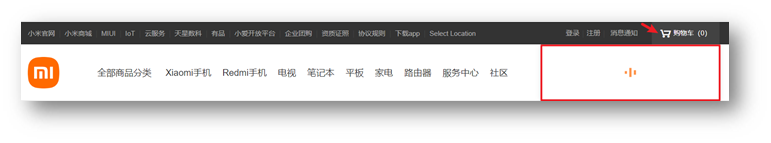

2. **v-if**

   1. 作用：  控制元素显示隐藏（条件渲染）
   2. 语法：  v-if= "表达式"          表达式值 true显示， false 隐藏
   3. 原理：  **基于条件判断，是否创建 或 移除元素节点**
   4. 场景：  要么显示，要么隐藏，不频繁切换的场景

   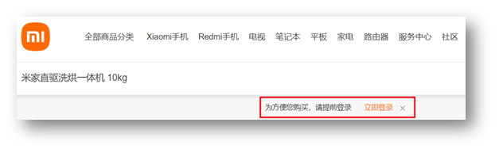

   示例代码：

   ```html
     <div id="app">
       <div v-show="flag" class="box">我是v-show控制的盒子</div>
       <div v-if="flag" class="box">我是v-if控制的盒子</div>
     </div>
   
     <script src="https://cdn.jsdelivr.net/npm/vue@2/dist/vue.js"></script>
   
     <script>
       const app = new Vue({
         el: '#app',
         data: {
           flag: false
         }
       })
     </script>
   ```

3. **v-else 和 v-else-if**

   1. 作用：辅助v-if进行判断渲染
   2. 语法：v-else  v-else-if="表达式"
   3. 需要紧接着v-if使用

示例代码：

```html
  <div id="app">
    <p v-if="gender === 1">性别：♂ 男</p>
    <p v-else>性别：♀ 女</p>
    <hr>
    <p v-if="score >= 90">成绩评定A：奖励电脑一台</p>
    <p v-else-if="score >= 70">成绩评定B：奖励周末郊游</p>
    <p v-else-if="score >= 60">成绩评定C：奖励零食礼包</p>
    <p v-else>成绩评定D：惩罚一周不能玩手机</p>
  </div>
  
  <script src="https://cdn.jsdelivr.net/npm/vue@2/dist/vue.js"></script>

  <script>
    const app = new Vue({
      el: '#app',
      data: {
        gender: 2,
        score: 95
      }
    })
  </script>
```


## 事件绑定指令

使用Vue时，如需为DOM注册事件，及其的简单，语法如下：

- <button v-on:事件名="内联语句">按钮</button>
- <button v-on:事件名="处理函数">按钮</button>
- <button v-on:事件名="处理函数(实参)">按钮</button>
- `v-on:` 简写为 **@**

1. **内联语句**

   ```js
   <div id="app">
       <button @click="count--">-</button>
       <span>{{ count }}</span>
       <button v-on:click="count++">+</button>
     </div>
   
     <script src="https://cdn.jsdelivr.net/npm/vue@2/dist/vue.js"></script>
   
     <script>
       const app = new Vue({
         el: '#app',
         data: {
           count: 100
         }
       })
     </script>
   ```

2. **事件处理函数**

   注意：

   - 事件处理函数应该写到一个跟data同级的配置项（**methods**）中
   - **methods中的函数内部的this都指向Vue实例**

```js
<div id="app">
    <button @click="fn">切换显示隐藏</button>
    <h1 v-show="isShow">黑马程序员</h1>
  </div>

  <script src="https://cdn.jsdelivr.net/npm/vue@2/dist/vue.js"></script>

  <script>
    const app = new Vue({
      el: '#app',
      data: {
          // 提供数据
        isShow: false
      },
      methods: {
          // 提供处理逻辑函数
          fn() {
              // this 指向 vue 实例
              this.isShow = !this.isShow
          }
      } 
    })
  </script>
```


  **3.给事件处理函数传参**

- **如果不传递任何参数，则方法无需加小括号；methods方法中可以直接使用 e 当做事件对象**


- **如果传递了参数，则实参 `$event` 表示事件对象，固定用法。**

```js
 <div id="app">
    <div class="box">
      <h3>小黑自动售货机</h3>
      <button @click="buy(5)">可乐5元</button>
      <button @click="buy(10)">咖啡10元</button>
      <button @click="buy(8)">牛奶8元</button>
    </div>
    <p>银行卡余额：{{ money }}元</p>
  </div>

  <script src="https://cdn.jsdelivr.net/npm/vue@2/dist/vue.js"></script>

  <script>
    const app = new Vue({
      el: '#app',
      data: {
        money: 100
      },
      methods: {
          buy(price) {
              this.money -= price
          }
      }
    })
  </script>
```


## 属性绑定指令

1. **作用：**动态设置html的标签属性 比如：src、url、title
2. **语法**：**v-bind:**属性名=“表达式”
3. **v-bind:**可以简写成 =>   **:**

比如，有一个图片，它的 `src` 属性值，是一个图片地址。这个地址在数据 data 中存储。

则可以这样设置属性值：

- ``
- ``   （v-bind可以省略）

```js
  <div id="app">
    
    
  </div>

  <script src="https://cdn.jsdelivr.net/npm/vue@2/dist/vue.js"></script>

  <script>
    const app = new Vue({
      el: '#app',
      data: {
        imgUrl: './imgs/10-02.png',
        msg: 'hello 波仔'
      }
    })
  </script>
```


## 列表渲染指令

Vue 提供了 v-for 列表渲染指令，用来辅助开发者基于一个数组来循环渲染一个列表结构。

v-for 指令需要使用 `(item, index) in arr` 形式的特殊语法，其中：

- item 是数组中的每一项
- index 是每一项的索引，不需要可以省略
- arr 是被遍历的数组

此语法也可以遍历**对象和数字**

```js
//遍历对象
<div v-for="(value, key, index) in object">{{value}}</div>
value:对象中的值
key:对象中的键
index:遍历索引从0开始

//遍历数字
<p v-for="item in 10">{{item}}</p>
item从1 开始
```


## 小案例-小黑的书架

需求：

1.根据左侧数据渲染出右侧列表（v-for）

2.点击删除按钮时，应该把当前行从列表中删除（获取当前行的id，利用filter进行过滤）

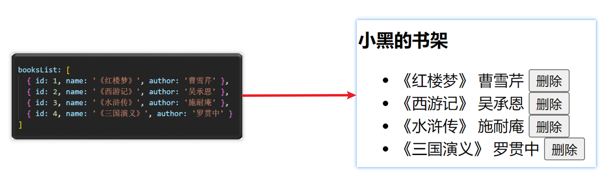

准备代码：

```js
<div id="app">
    <h3>小黑的书架</h3>
    <ul>
      <li v-for="(item,index) in bookList" :key="item.id">
        <span>{{item.name}}</span>
        <span>{{item.author}}</span>
        <button @click=fn(item.id)>删除</button>
      </li>
    </ul>
  </div>
  <script src="https://cdn.jsdelivr.net/npm/vue@2/dist/vue.js"></script>
  <script>
    const app = new Vue({
      el: '#app',
      data: {
        booksList: [
          { id: 1, name: '《红楼梦》', author: '曹雪芹' },
          { id: 2, name: '《西游记》', author: '吴承恩' },
          { id: 3, name: '《水浒传》', author: '施耐庵' },
          { id: 4, name: '《三国演义》', author: '罗贯中' }
        ]
      },
     methods: {
         fn(id) {
             // 通过 id 进行删除数组中的 对应项 filter
             // filter: 根据条件，保留满足条件的对应项,得到一个新数组
            this.booksList = this.booksList.filter(item => item.id !== id)
         }
     }
    })
  </script>
```


## v-for中的key

**语法：** key="唯一值"

**作用：**给列表项添加的**唯一标识**。便于Vue进行列表项的**正确排序复用**。

**为什么加key：**Vue 的默认行为会尝试原地修改元素（**就地复用**）

实例代码：

```js
<ul>
  <li v-for="(item, index) in booksList" :key="item.id">
    <span>{{ item.name }}</span>
    <span>{{ item.author }}</span>
    <button @click="del(item.id)">删除</button>
  </li>
</ul>
```

注意：

1.  **key 的值只能是字符串 或 数字类型**
2. **key 的值必须具有唯一性**
3. 推荐使用  id 作为 key（唯一），不推荐使用 index 作为 key（会变化，不对应）


## 双向绑定指令

所谓双向绑定就是：

1. 数据改变后，呈现的页面结果会更新
2. 页面结果更新后，数据也会随之而变

**作用：** 给**表单元素**（input、radio、select）使用**，双向绑定数据**，可以快速 **获取** 或 **设置** 表单元素内容

**语法：**v-model="变量"

**需求：**使用双向绑定实现以下需求

1. 点击登录按钮获取表单中的内容
2. 点击重置按钮清空表单中的内容

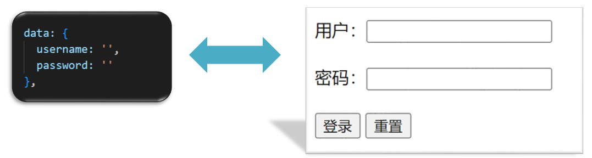


```js
<div id="app">
    账户：<input v-model="username" type="text"> <br><br>
    密码：<input v-model="username" type="password"> <br><br>
    <button @click="login">登录</button>
    <button @click="reset">重置</button>
  </div>

  <script src="https://cdn.jsdelivr.net/npm/vue@2/dist/vue.js"></script>

  <script>
    const app = new Vue({
      el: '#app',
      data: {
        username: '',
        password: ''
      },
      methods: {
          login() {
              console.log(this.username,this.password)
          },
          reset() {
               username: '',
               password: ''
          }
      }
    })
  </script>
```


## 综合案例-小黑记事本

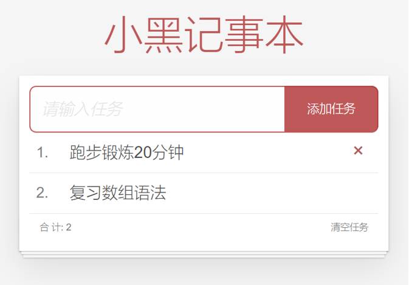

**功能需求：**

1. 列表渲染

2. 删除功能

3. 添加功能

4. 底部统计 和 清空

   

```html
<!DOCTYPE html>
<html lang="en">

<head>
    <meta charset="UTF-8" />
    <meta http-equiv="X-UA-Compatible" content="IE=edge" />
    <meta name="viewport" content="width=device-width, initial-scale=1.0" />
    <link rel="stylesheet" href="./css/index.css" />
    <title>记事本</title>
</head>

<body>

    <!-- 主体区域 -->
    <section id="app">

        <!-- 输入框 -->
        <header class="header">
            <h1>小黑记事本</h1>
            <input v-model="todoName" placeholder="请输入任务" class="new-todo" />
            <button @click="add" class="add">添加任务</button>
        </header>

        <!-- 列表区域 -->
        <section class="main">
            <ul class="todo-list">
                <li class="todo" v-for="(item,index) in list" :key="item.id">
                    <div class="view">
                        <span class="index">{{index + 1}}.</span> <label>{{item.name}}</label>
                        <button @click="del(item.id)" class="destroy"></button>
                    </div>
                </li>
            </ul>
        </section>

        <!-- 统计和清空 -->
        <footer v-show="list.length>0" class="footer">
            <!-- 统计 -->
            <span class="todo-count">合 计:<strong> {{list.length}} </strong></span>
            <!-- 清空 -->
            <button @click="clear" class="clear-completed">清空任务</button>
        </footer>

    </section>

    <!-- 底部 -->
    <script src="https://cdn.jsdelivr.net/npm/vue/dist/vue.js"></script>

    <script>
        const app = new Vue({
            el: '#app',
            data: {
                todoName: '',
                list: [{
                    id: 1,
                    name: '跑步一公里'
                }, {
                    id: 2,
                    name: '游泳100米'
                }]
            },
            methods: {
                // 删除功能
                del(id) {
                    this.list = this.list.filter(item => item.id !== id)
                },
                // 添加功能
                add() {
                    if (this.todoName.trim() === '') {
                        alert('请输入任务名称')
                        return
                    }
                    this.list.unshift({
                        id: +new Date(),
                        name: this.todoName
                    })
                    this.todoName = ''
                },
                // 清空
                clear() {
                    this.list = []
                }
            }
        })
    </script>
</body>

</html>
```


## 指令修饰符

**1.什么是指令修饰符？**

​	所谓指令修饰符就是通过“.”指明一些指令**后缀** 不同的**后缀**封装了不同的处理操作  —> 简化代码

**2.按键修饰符**

- **@keyup.enter**  —>当点击enter键的时候才触发

代码演示：

```js
  <div id="app">
    <h3>监听键盘回车事件</h3>
    <input @keyup.enter="fn" v-model="username" type="text">
  </div>

  <script src="https://cdn.jsdelivr.net/npm/vue@2/dist/vue.js"></script>

  <script>
    const app = new Vue({
      el: '#app',
      data: {
        username: ''
      },
      methods: {
        fn(){
            // if(e.key === 'ENTER')
            console.log('键盘回车的时候触发, this.username')
        }
      }
    })
  </script>
```

**3.v-model修饰符**

- **v-model.trim**  —>**去除首尾空格**
- **v-model.number** —>**转数字**

**4.事件修饰符**

- **@事件名.stop —> 阻止冒泡**
- **@事件名.prevent  —>阻止默认行为**
- **@事件名.stop.prevent —>可以连用 即阻止事件冒泡也阻止默认行为**

```html
 <div id="app">
    <h3>v-model修饰符 .trim .number</h3>
    姓名：<input v-model.trim="username" type="text"><br>   // 去除首位空格
    年纪：<input v-model.number="age" type="text"><br>      // 转数字

    
    <h3>@事件名.stop     →  阻止冒泡</h3>
    <div @click="fatherFn" class="father">
    <div @click.stop="sonFn" class="son">儿子</div>
    </div>

    <h3>@事件名.prevent  →  阻止默认行为</h3>
    <a @click.prevent href="http://www.baidu.com">阻止默认行为</a>
  </div>

  <script src="https://cdn.jsdelivr.net/npm/vue@2/dist/vue.js"></script>
  <script>
    const app = new Vue({
      el: '#app',
      data: {
        username: '',
        age: '',
      },
      methods: {
        fatherFn () {
          alert('老父亲被点击了')
        },
        sonFn (e) {
          // e.stopPropagation()
          alert('儿子被点击了')
        }
      }
    })
  </script>
```


## v-bind对样式控制的增强-操作class

为了方便开发者进行样式控制，` Vue` 扩展了 v-bind 的语法，可以针对 **class 类名** 和 **style 行内样式** 进行控制 。

**1.语法：**

```html
<div> :class = "对象/数组">这是一个div</div>
```


**2.对象语法**

当class动态绑定的是**对象**时，**键就是类名，值就是布尔值**，如果值是**true**，就有这个类，否则没有这个类

```html
<div class="box" :class="{ 类名1: 布尔值, 类名2: 布尔值 }"></div>
```

​    适用场景：一个类名，来回切换


**3.数组语法**

当class动态绑定的是**数组**时 → 数组中所有的类，都会添加到盒子上，本质就是一个 class 列表

```html
<div class="box" :class="[ 类名1, 类名2, 类名3 ]"></div>
```

   使用场景:批量添加或删除类


**4.代码练习**

```html
 <style>
    .box {
      width: 200px;
      height: 200px;
      border: 3px solid #000;
      font-size: 30px;
      margin-top: 10px;
    }
    .pink {
      background-color: pink;
    }
    .big {
      width: 300px;
      height: 300px;
    }
  </style>


<div id="app">
    <!--绑定对象-->
    <div class="box" :class="{ pink:true , big: true }">黑马程序员</div>
    <!--绑定数组-->
    <div class="box" :class="[ pink , big ]">黑马程序员</div>
  </div>

  <script src="https://cdn.jsdelivr.net/npm/vue@2/dist/vue.js"></script>

  <script>
    const app = new Vue({
      el: '#app',
      data: {

      }
    })
  </script>
```


## 京东秒杀-tab栏切换导航高亮

**1.需求：**

​	当我们点击哪个tab页签时，哪个tab页签就高亮

**2.准备代码:**

```html
 <style>
    * {
      margin: 0;
      padding: 0;
    }
    ul {
      display: flex;
      border-bottom: 2px solid #e01222;
      padding: 0 10px;
    }
    li {
      width: 100px;
      height: 50px;
      line-height: 50px;
      list-style: none;
      text-align: center;
    }
    li a {
      display: block;
      text-decoration: none;
      font-weight: bold;
      color: #333333;
    }
    li a.active {
      background-color: #e01222;
      color: #fff;
    }

  </style>

<div id="app">
    <ul>
      <li v-for="(item,index) in list" :key="item.id" @click="activeIndex = index">
          <a :class="{ active : index === activeIndex }" href="#">{{item.name}}</a>
      </li>
    </ul>
  </div>
  <script src="https://cdn.jsdelivr.net/npm/vue@2/dist/vue.js"></script>
  <script>
    const app = new Vue({
      el: '#app',
      data: {
        activeIndex: 0,  // 记录高亮的下标
        list: [
          { id: 1, name: '京东秒杀' },
          { id: 2, name: '每日特价' },
          { id: 3, name: '品类秒杀' }
        ]
      }
    })
  </script>
```

**3.思路：**

1.基于数据，动态渲染tab（v-for）

2.准备一个下标 记录高亮的是哪一个 tab

3.基于下标动态切换class的类名


## v-bind对有样式控制的增强-操作style

**1.语法**

```html
<div class="box" :style="{ CSS属性名1: CSS属性值, CSS属性名2: CSS属性值 }"></div>
```

**2.代码练习**

```html
<style>
    .box {
      width: 200px;
      height: 200px;
      background-color: rgb(187, 150, 156);
    }
 </style>
 <div id="app">
    <div class="box" :style="{ width: '400px' , height: '400px' , backgroundColor: 'green' }"></div>
  </div>

  <script src="https://cdn.jsdelivr.net/npm/vue@2/dist/vue.js"></script>

  <script>
    const app = new Vue({
      el: '#app',
      data: {

      }
    })
  </script>
```

**3.进度条案例**

```html
 <style>
    .progress {
      height: 25px;
      width: 400px;
      border-radius: 15px;
      background-color: #272425;
      border: 3px solid #272425;
      box-sizing: border-box;
      margin-bottom: 30px;
    }
    .inner {
      width: 50%;
      height: 20px;
      border-radius: 10px;
      text-align: right;
      position: relative;
      background-color: #409eff;
      background-size: 20px 20px;
      box-sizing: border-box;
      transition: all 1s;
    }
    .inner span {
      position: absolute;
      right: -20px;
      bottom: -25px;
    }
  </style>

<div id="app">
    <!-- 大盒子里套小盒子 ， 改小盒子宽就是进度 -->
    <div class="progress">
      <div class="inner" :style="{ width: percent + '%' }">
        <span>{{percent}}%</span>
      </div>
    </div>
    <button @click="percent = 25">设置25%</button>
    <button @click="percent = 50">设置50%</button>
    <button @click="percent = 75">设置75%</button>
    <button @click="percent = 100">设置100%</button>
  </div>

  <script src="https://cdn.jsdelivr.net/npm/vue@2/dist/vue.js"></script>
  <script>
    const app = new Vue({
      el: '#app',
      data: {
         percent: 0  // 控制进度条
      }
    })
  </script>
```


## v-model在其他表单元素的使用

**1.讲解内容：**

常见的表单元素都可以用 v-model 绑定关联  →  快速 **获取** 或 **设置** 表单元素的值

它会根据  **控件类型** 自动选取  **正确的方法** 来更新元素

```js
输入框  input:text   ——> value
文本域  textarea	 ——> value
复选框  input:checkbox  ——> checked
单选框  input:radio   ——> checked
下拉菜单 select    ——> value
...
```

**2.代码准备**

```html
 <style>
    textarea {
      display: block;
      width: 240px;
      height: 100px;
      margin: 10px 0;
    }
  </style>

 <div id="app">
    <h3>小黑学习网</h3>
    姓名：
      <input type="text" v-model="username"> 
      <br><br>
    是否单身：
      <input type="checkbox" v-model="isSingle"> 
      <br><br>
    <!-- 
      前置理解：
        1. name:  给单选框加上 name 属性 可以分组 → 同一组互相会互斥
        2. value: 给单选框加上 value 属性，用于提交给后台的数据
      结合 Vue 使用 → v-model
    -->
    性别: 
      <input type="radio" name="gender" value="1" v-model="gender">男
      <input type="radio" name="gender" value="0" v-model="gender">女
      <br><br>
    <!-- 
      前置理解：
        1. option 需要设置 value 值，提交给后台
        2. select 的 value 值，关联了选中的 option 的 value 值
      结合 Vue 使用 → v-model
    -->
    所在城市:
      <select v-model="cityId">
        <option value="101">北京</option>
        <option value="102">上海</option>
        <option value="103">成都</option>
        <option value="104">南京</option>
      </select>
      <br><br>
    自我描述：
      <textarea v-model="desc"></textarea> 
    <button>立即注册</button>
  </div>

  <script src="https://cdn.jsdelivr.net/npm/vue@2/dist/vue.js"></script>
  <script>
    const app = new Vue({
      el: '#app',
      data: {
          username:'',
          isSingle: true, // 选中
          gender: "1",  // 1表示男，0表示女
          cityId: '101',
          desc: '自我描述'
      }
    })
  </script>
```


## computed计算属性

**1.概念**

基于**现有的数据**，计算出来的**新属性**。 **依赖**的数据变化，**自动**重新计算。

**2.语法**

1. 声明在 **computed 配置项**中，一个计算属性对应一个函数
2. 使用起来和普通属性一样使用  {{ 计算属性名}}  

**3.注意**

1. computed配置项和data配置项是**同级**的
2. computed中的计算属性**虽然是函数的写法**，但他**依然是个属性**
3. computed中的计算属性**不能**和data中的属性**同名**
4. 使用computed中的计算属性和使用data中的属性是一样的用法
5. computed中计算属性内部的**this**依然**指向的是Vue实例**

**4.案例**

比如我们可以使用计算属性实现下面这个业务场景

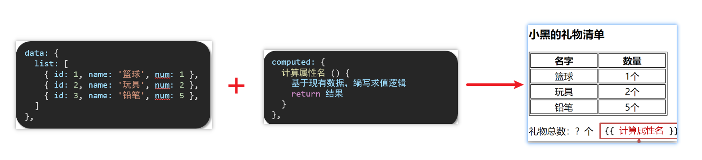

**5.代码准备**

```html
<style>
    table {
      border: 1px solid #000;
      text-align: center;
      width: 240px;
    }
    th,td {
      border: 1px solid #000;
    }
    h3 {
      position: relative;
    }
  </style>

<div id="app">
    <h3>小黑的礼物清单</h3>
    <table>
      <tr>
        <th>名字</th>
        <th>数量</th>
      </tr>
      <tr v-for="(item, index) in list" :key="item.id">
        <td>{{ item.name }}</td>
        <td>{{ item.num }}个</td>
      </tr>
    </table>

    <!-- 目标：统计求和，求得礼物总数 -->
    <p>礼物总数：{{totalCount}} 个</p>
  </div>

  <script src="https://cdn.jsdelivr.net/npm/vue@2/dist/vue.js"></script>

  <script>
    const app = new Vue({
      el: '#app',
      data: {
        // 现有的数据
        list: [
          { id: 1, name: '篮球', num: 1 },
          { id: 2, name: '玩具', num: 2 },
          { id: 3, name: '铅笔', num: 5 },
        ]
      },
        // 计算属性
        computed: {
            totalCount () {
                // 基于现有的数据，编写求值逻辑
                // 计算属性函数内部， 可以直接通过 this 访问到 app 实例
                let total = this.list.reduce((sum , item) => sum + item.num  , 0)
                return total
            }
        }
    })
  </script>
```


## computed计算属性 VS methods方法

**1.`computed`计算属性**

作用：封装了一段对于**数据**的处理，求得一个**结果**

语法：

1. 写在computed配置项中
2. 作为属性，直接使用
   - `js`中使用计算属性： this.计算属性
   - 模板中使用计算属性：{{ 计算属性 }}


**2.`methods`计算属性**

作用：给`Vue`实例提供一个**方法**，调用以**处理业务逻辑**。

语法：

1. 写在methods配置项中
2. 作为方法调用
   - `js`中调用：this.方法名()
   - 模板中调用 {{ 方法名() }}  或者 @事件名=“方法名”


**3.计算属性的优势**

1. **缓存特性**（提升性能）

   计算属性会对计算出来的结果缓存，再次使用直接读取缓存，

   依赖项变化了，会自动重新计算 → 并再次缓存

2. methods没有缓存特性

3. 通过代码比较

```html
<style>
    table {
      border: 1px solid #000;
      text-align: center;
      width: 300px;
    }
    th,td {
      border: 1px solid #000;
    }
    h3 {
      position: relative;
    }
    span {
      position: absolute;
      left: 145px;
      top: -4px;
      width: 16px;
      height: 16px;
      color: white;
      font-size: 12px;
      text-align: center;
      border-radius: 50%;
      background-color: #e63f32;
    }
  </style>

<div id="app">
    <h3>小黑的礼物清单🛒<span>{{ totalCount }}</span></h3>
    <table>
      <tr>
        <th>名字</th>
        <th>数量</th>
      </tr>
      <tr v-for="(item, index) in list" :key="item.id">
        <td>{{ item.name }}</td>
        <td>{{ item.num }}个</td>
      </tr>
    </table>

    <p>礼物总数：{{ totalCount }} 个</p>
  </div>
  <script src="https://cdn.jsdelivr.net/npm/vue@2/dist/vue.js"></script>
  <script>
    const app = new Vue({
      el: '#app',
      data: {
        // 现有的数据
        list: [
          { id: 1, name: '篮球', num: 3 },
          { id: 2, name: '玩具', num: 2 },
          { id: 3, name: '铅笔', num: 5 },
        ]
      },
      computed: {
          // 计算属性：有缓存的，一旦计算出来，就会立刻缓存
          // 下一次读取 -> 直接读取缓存就行 -> 性能特别高
        totalCount () {
          console.log('计算属性执行了')
          let total = this.list.reduce((sum, item) => sum + item.num, 0)
          return total
        }
      }
    })
  </script>
```

**4.总结**

1.`computed`**有缓存特性**，methods**没有缓存**

2.当一个结果依赖其他多个值时，推荐使用计算属性

3.当处理业务逻辑时，推荐使用methods方法，比如事件的处理函数


## 计算属性的完整写法

**既然计算属性也是属性，能访问，应该也能修改了？**

1. 计算属性默认的简写，只能读取访问，不能 "修改"
2. 如果要 "修改"  → 需要写计算属性的完整写法

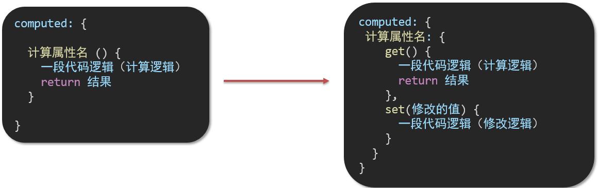

完整写法代码演示

```html
 <div id="app">
    姓：<input type="text" v-model="firstName"> +
    名：<input type="text" v-model="lastName"> =
    <span>{{ fullName }}</span><br><br> 
    <button @click="changeName">改名卡</button>
  </div>
  <script src="https://cdn.jsdelivr.net/npm/vue@2/dist/vue.js"></script>
  <script>
    const app = new Vue({
      el: '#app',
      data: {
 		firstName: '刘',
        lastName: '备'
      },
      computed: {
        // 简写 -> 获取，没有配置设置的逻辑
        //  fullName () {
        //      return this.firstName + this.lastName
        //  }
          // 完整写法
        fullName: {
            // 当 fullName 计算属性，被获取求值时，执行get(),有缓存优先执行缓存
            // 会将返回值作为，求值的结果
            get () {
                return this.firstName + this.lastName
            },
            // 当 fullName 计算属性，被修改赋值时，执行 set()
            // 修改的值，传递给 set 方法的形参
            set (value) {
                this.firstName = value.slice(0,1)
                this.lastName = value.slice(1)
            }
        }
      },
      methods: {
        changeName() {
            this.fullName = '吕小布'
        }
      }
    })
  </script>
```


## 综合案例-成绩案例

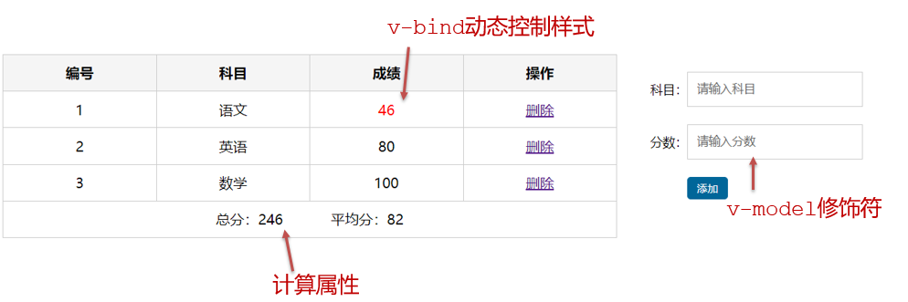

功能描述：

1.渲染功能

2.删除功能

3.添加功能

4.统计总分，求平均分


思路分析：

1.渲染功能  v-for  :key  v-bind:动态绑定class的样式

2.删除功能 v-on绑定事件， 阻止a标签的默认行为

3.v-model的修饰符 .trim、 .number、  判断数据是否为空后 再添加、添加后清空文本框的数据

4.使用计算属性computed 计算总分和平均分的值

```html
<!DOCTYPE html>
<html lang="en">

<head>
    <meta charset="UTF-8" />
    <meta http-equiv="X-UA-Compatible" content="IE=edge" />
    <meta name="viewport" content="width=device-width, initial-scale=1.0" />
    <link rel="stylesheet" href="./styles/index.css" />
    <title>Document</title>
</head>

<body>
    <div id="app" class="score-case">
        <div class="table">
            <table>
                <thead>
                    <tr>
                        <th>编号</th>
                        <th>科目</th>
                        <th>成绩</th>
                        <th>操作</th>
                    </tr>
                </thead>
                <tbody v-if="list.length > 0">
                    <tr v-for="(item,index) in list" :key="item.id">
                        <td>{{ index + 1 }}</td>
                        <td>{{ item.subject }}</td>
                        <td :class="{red: item.score < 60 }">{{ item.score }}</td>
                        <td @click.prevent="del(item.id)"><a href="#">删除</a></td>
                    </tr>
                </tbody>
                <tbody v-else>
                    <tr>
                        <td colspan="5">
                            <span class="none">暂无数据</span>
                        </td>
                    </tr>
                </tbody>

                <tfoot>
                    <tr>
                        <td colspan="5">
                            <span>总分：{{totalScore}}</span>
                            <span style="margin-left: 50px">平均分：{{averageScore}}</span>
                        </td>
                    </tr>
                </tfoot>
            </table>
        </div>
        <div class="form">
            <div class="form-item">
                <div class="label">科目：</div>
                <div class="input">
                    <input v-model.trim="subject" type="text" placeholder="请输入科目" />
                </div>
            </div>
            <div class="form-item">
                <div class="label">分数：</div>
                <div class="input">
                    <input v-model.number="score" type="text" placeholder="请输入分数" />
                </div>
            </div>
            <div class="form-item">
                <div class="label"></div>
                <div class="input">
                    <button class="submit" @click="add">添加</button>
                </div>
            </div>
        </div>
    </div>
    <script src="https://cdn.jsdelivr.net/npm/vue@2/dist/vue.js"></script>

    <script>
        const app = new Vue({
            el: '#app',
            data: {
                list: [{
                    id: 1,
                    subject: '语文',
                    score: 20
                }, {
                    id: 7,
                    subject: '数学',
                    score: 99
                }, {
                    id: 12,
                    subject: '英语',
                    score: 70
                }, ],
                subject: '',
                score: ''
            },
            methods: {
                del(id) {
                    this.list = this.list.filter(item => item.id !== id)
                },
                add() {
                    if (!this.subject) {
                        alert('请输入科目')
                        return
                    }
                    if (typeof this.score !== 'number') {
                        alert('请输入正确的成绩')
                        return
                    }
                    this.list.unshift({
                            id: +new Date(),
                            subject: this.subject,
                            score: this.score
                        })
                        // 清空表单
                    this.subject = ''
                    this.score = ''
                }
            },
            computed: {
                totalScore() {
                    return this.list.reduce((sum, item) => sum + item.score, 0)
                },
                averageScore() {
                    if (this.list.length === 0) {
                        return 0
                    }
                    return (this.totalScore / this.list.length).toFixed(2)
                }
            }
        })
    </script>
</body>

</html>
```


## watch侦听器（监视器）

**1.作用：**

​	**监视数据变化**，执行一些业务逻辑或异步操作

**2.语法：**

1. watch同样声明在跟data同级的配置项中

2. 简单写法： 简单类型数据直接监视

3. 完整写法：添加额外配置项

   ```js
   data: { 
     words: '苹果',
     obj: {
       words: '苹果'
     }
   },
   
   watch: {
     // 该方法会在数据变化时，触发执行
     数据属性名 (newValue, oldValue) {
       // 一些业务逻辑 或 异步操作。 
     },
     '对象.属性名' (newValue, oldValue) {
       // 一些业务逻辑 或 异步操作。 
     }
   }
   ```

**3.侦听器代码准备**

```html
 <style>
      * {
        margin: 0;
        padding: 0;
        box-sizing: border-box;
        font-size: 18px;
      }
      #app {
        padding: 10px 20px;
      }
      .query {
        margin: 10px 0;
      }
      .box {
        display: flex;
      }
      textarea {
        width: 300px;
        height: 160px;
        font-size: 18px;
        border: 1px solid #dedede;
        outline: none;
        resize: none;
        padding: 10px;
      }
      textarea:hover {
        border: 1px solid #1589f5;
      }
      .transbox {
        width: 300px;
        height: 160px;
        background-color: #f0f0f0;
        padding: 10px;
        border: none;
      }
      .tip-box {
        width: 300px;
        height: 25px;
        line-height: 25px;
        display: flex;
      }
      .tip-box span {
        flex: 1;
        text-align: center;
      }
      .query span {
        font-size: 18px;
      }

      .input-wrap {
        position: relative;
      }
      .input-wrap span {
        position: absolute;
        right: 15px;
        bottom: 15px;
        font-size: 12px;
      }
      .input-wrap i {
        font-size: 20px;
        font-style: normal;
      }
    </style>

 <div id="app">
      <!-- 条件选择框 -->
      <div class="query">
        <span>翻译成的语言：</span>
        <select>
          <option value="italy">意大利</option>
          <option value="english">英语</option>
          <option value="german">德语</option>
        </select>
      </div>

      <!-- 翻译框 -->
      <div class="box">
        <div class="input-wrap">
          <textarea v-model="words"></textarea>
          <span><i>⌨️</i>文档翻译</span>
        </div>
        <div class="output-wrap">
          <div class="transbox">mela</div>
        </div>
      </div>
    </div>
    <script src="https://cdn.jsdelivr.net/npm/vue@2/dist/vue.js"></script>
    <script src="https://cdn.jsdelivr.net/npm/axios/dist/axios.min.js"></script>
    <script>
      // 接口地址：https://applet-base-api-t.itheima.net/api/translate
      // 请求方式：get
      // 请求参数：
      // （1）words：需要被翻译的文本（必传）
      // （2）lang： 需要被翻译成的语言（可选）默认值-意大利
      // -----------------------------------------------
      
      const app = new Vue({
        el: '#app',
        data: {
          // words: ''
            obj: {
                words: ''
            }
        },
        // 具体讲解：(1) watch语法 (2) 具体业务实现
         watch: {
             // 该方法会在数据变化时调用执行
             'obj.words' (newValue, oldValue) {
                 console.log('变化了',newValue,oldValue)
             }
         }
      })
    </script>
```


## 翻译案例-代码实现

```js
  <script>
      // 接口地址：https://applet-base-api-t.itheima.net/api/translate
      // 请求方式：get
      // 请求参数：
      // （1）words：需要被翻译的文本（必传）
      // （2）lang： 需要被翻译成的语言（可选）默认值-意大利
      // -----------------------------------------------
      
      const app = new Vue({
        el: '#app',
        data: {
           //words: ''
           obj: {
            words: ''
          },
          result: '', // 翻译结果
          // timer: null // 延时器id
        },
        // 具体讲解：(1) watch语法 (2) 具体业务实现
        watch: {
          // 该方法会在数据变化时调用执行
          // newValue新值, oldValue老值（一般不用）
          // words (newValue) {
          //   console.log('变化了', newValue)
          // }

          'obj.words' (newValue) {
            // console.log('变化了', newValue)
            // 防抖: 延迟执行 → 干啥事先等一等，延迟一会，一段时间内没有再次触发，才执行
            clearTimeout(this.timer)
            this.timer = setTimeout(async () => {  // timer直接挂载到this上
                // 调用接口
              const res = await axios({
                url: 'https://applet-base-api-t.itheima.net/api/translate',
                params: {
                  words: newValue
                }
              })
              this.result = res.data.data
             // console.log(res.data.data)
            }, 300)
          }
        }
      })
    </script>
```


## watch侦听器

**1.语法**

完整写法 —>**添加额外的配置项**

1. **deep:true 对复杂类型进行深度监听**
2. **immdiate:true 初始化 立刻执行一次**

```js
data: {
  obj: {
    words: '苹果',
    lang: 'italy'
  },
},

watch: {// watch 完整写法
  对象: {
    deep: true, // 深度监视
    immdiate:true,//立即执行handler函数
    handler (newValue) {
      console.log(newValue)
    }
  }
}

```

**2.需求**

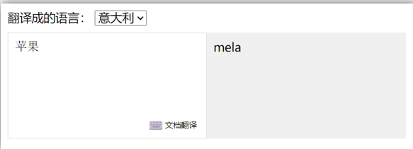


- 当文本框输入的时候 右侧翻译内容要时时变化
- 当下拉框中的语言发生变化的时候 右侧翻译的内容依然要时时变化
- 如果文本框中有默认值的话要立即翻译

**3.代码实现**

```js
 <script> 
      const app = new Vue({
        el: '#app',
        data: {
          obj: {
            words: '小黑',
            lang: 'italy'
          },
          result: '', // 翻译结果
        },
        watch: {
          obj: {
            deep: true, // 深度监视
            immediate: true, // 立刻执行，一进入页面handler就立刻执行一次
            handler (newValue) {
              clearTimeout(this.timer)
              this.timer = setTimeout(async () => {
                const res = await axios({
                  url: 'https://applet-base-api-t.itheima.net/api/translate',
                  params: newValue
                })
                this.result = res.data.data
                console.log(res.data.data)
              }, 300)
            }
          } 
        }
      })
    </script>
```

**4.总结**

watch侦听器的写法有几种？

1.简单写法

```js
watch: {
  数据属性名 (newValue, oldValue) {
    //一些业务逻辑 或 异步操作。 
  },
  '对象.属性名' (newValue, oldValue) {
    //一些业务逻辑 或 异步操作。 
  }
}
```

2.完整写法

```js
watch: {// watch 完整写法
  数据属性名: {
    deep: true, // 深度监视(针对复杂类型)
    immediate: true, // 是否立刻执行一次handler
    handler (newValue) {
      console.log(newValue)
    }
  }
}
```


## 综合案例

购物车案例

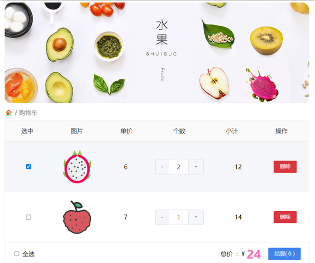


需求说明：

1. 渲染功能
2. 删除功能
3. 修改个数
4. 全选反选
5. 统计 选中的 总价 和 总数量 
6. 持久化到本地


实现思路：

1.基本渲染：  v-for遍历、:class动态绑定样式 、 v-if 条件判断

2.删除功能 ： 点击传参  、 filter覆盖原数组

3.修改个数 ： 点击传参 、 find 找对象

4.全选反选  => 计算属性完整写法

1. 必须所有的小选框都选中，全选按钮才选中 → every
2. 如果全选按钮选中，则所有小选框都选中
3. 如果全选取消，则所有小选框都取消选中

声明计算属性，判断数组中的每一个checked属性的值，看是否需要全部选

5.统计 选中的 总价 和 总数量 ：通过计算属性来计算**选中的**总价和总数量 computed 、 reduce

6.持久化到本地： 在数据变化时都要更新下本地存储 watch

```html
<!DOCTYPE html>
<html lang="en">

<head>
    <meta charset="UTF-8" />
    <meta http-equiv="X-UA-Compatible" content="IE=edge" />
    <meta name="viewport" content="width=device-width, initial-scale=1.0" />
    <link rel="stylesheet" href="./css/inputnumber.css" />
    <link rel="stylesheet" href="./css/index.css" />
    <title>购物车</title>
</head>

<body>
    <div class="app-container" id="app">
        <!-- 顶部banner -->
        <div class="banner-box"></div>
        <!-- 面包屑 -->
        <div class="breadcrumb">
            <span>🏠</span> /
            <span>购物车</span>
        </div>
        <!-- 购物车主体 -->
        <div class="main" v-if="fruitList.length > 0">
            <div class="table">
                <!-- 头部 -->
                <div class="thead">
                    <div class="tr">
                        <div class="th">选中</div>
                        <div class="th th-pic">图片</div>
                        <div class="th">单价</div>
                        <div class="th num-th">个数</div>
                        <div class="th">小计</div>
                        <div class="th">操作</div>
                    </div>
                </div>
                <!-- 身体 -->
                <div class="tbody">
                    <div class="tr" :class="{ active: item.isChecked }" v-for="(item,index) in fruitList" :key="item.id">
                        <div class="td"><input type="checkbox" v-model="item.isChecked" /></div>
                        <div class="td"></div>
                        <div class="td">{{ item.price }}</div>
                        <div class="td">
                            <div class="my-input-number">
                                <button :disabled="item.num <= 1" class="decrease" @click="sub(item.id)"> - </button>
                                <span class="my-input__inner">{{ item.num }}</span>
                                <button class="increase" @click="add(item.id)"> + </button>
                            </div>
                        </div>
                        <div class="td">{{ item.num * item.price }}</div>
                        <div class="td"><button @click="del(item.id)">删除</button></div>
                    </div>
                </div>
            </div>
            <!-- 底部 -->
            <div class="bottom">
                <!-- 全选 -->
                <label class="check-all">
                <input type="checkbox" v-model="isAll"/>全选</label>
                <div class="right-box">
                    <!-- 所有商品总价 -->
                    <span class="price-box">总价&nbsp;&nbsp;:&nbsp;&nbsp;¥&nbsp;<span class="price">{{totalPrice}}</span></span>
                    <!-- 结算按钮 -->
                    <button class="pay">结算( {{totalCount}} )</button>
                </div>
            </div>
        </div>
        <!-- 空车 -->
        <div class="empty" v-else>🛒空空如也</div>
    </div>
    <script src="https://cdn.jsdelivr.net/npm/vue@2/dist/vue.js"></script>
    <script>
        const app = new Vue({
            el: '#app',
            data: {
                // 水果列表
                fruitList: JSON.parse(localStorage.getItem('list')) || [{
                    id: 1,
                    icon: 'http://autumnfish.cn/static/火龙果.png',
                    isChecked: true,
                    num: 2,
                    price: 6,
                }, {
                    id: 2,
                    icon: 'http://autumnfish.cn/static/荔枝.png',
                    isChecked: false,
                    num: 7,
                    price: 20,
                }, {
                    id: 3,
                    icon: 'http://autumnfish.cn/static/榴莲.png',
                    isChecked: false,
                    num: 3,
                    price: 40,
                }, {
                    id: 4,
                    icon: 'http://autumnfish.cn/static/鸭梨.png',
                    isChecked: true,
                    num: 10,
                    price: 3,
                }, {
                    id: 5,
                    icon: 'http://autumnfish.cn/static/樱桃.png',
                    isChecked: false,
                    num: 20,
                    price: 34,
                }, ],
            },
            methods: {
                // 删除功能
                del(id) {
                    this.fruitList = this.fruitList.filter(item => item.id !== id)
                },
                // 加num
                add(id) {
                    // 1. 根据id 找到数组中的对应项 find
                    const fruit = this.fruitList.find(item => item.id === id)
                        // 2. 操作 num 数量
                    fruit.num++
                },
                sub(id) {
                    const fruit = this.fruitList.find(item => item.id === id)
                    fruit.num--
                }
            },
            // 计算属性
            computed: {
                isAll: {
                    get() {
                        // 必须所有的小选框都选中，全选按钮才选中 every
                        return this.fruitList.every(item => item.isChecked === true)
                    },
                    set(value) {
                        // 基于拿到的布尔值，要让所有的小选框 同步状态
                        this.fruitList.forEach(item => item.isChecked = value)
                    }
                },
                // 统计选中的总数
                totalCount() {
                    return this.fruitList.reduce((sum, item) => {
                        if (item.isChecked) {
                            // 说明是选中的   累加
                            return sum + item.num
                        } else {
                            // 没选中  不需要累加
                            return sum
                        }
                    }, 0)
                },
                // 统计选中的总价
                totalPrice() {
                    return this.fruitList.reduce((sum, item) => {
                        if (item.isChecked) {
                            // 选中的商品 累加
                            return sum + item.price * item.num
                        } else {
                            return sum
                        }
                    }, 0)
                }
            },
            // 监视器  一旦修改了，就持久化存储到本地
            watch: {
                fruitList: {
                    deep: true,
                    handler(newValue) {
                        // 需要将变化后的 newValue 存入本地 （转JSON）
                        localStorage.setItem('list', JSON.stringify(newValue))
                    }
                }
            }
        })
    </script>
</body>

</html>
```


## `Vue`生命周期

思考：什么时候可以发送初始化渲染请求？（越早越好）什么时候可以开始操作`dom`？（至少`dom`得渲染出来）

`Vue`生命周期：就是一个`Vue`实例从创建 到 销毁 的整个过程。

生命周期四个阶段：① 创建 ② 挂载 ③ 更新 ④ 销毁

**1.创建阶段：创建响应式数据**

**2.挂载阶段：渲染模板**

**3.更新阶段：修改数据，更新视图**

**4.销毁阶段：销毁`Vue`实例**


## `Vue`生命周期钩子

`Vue`生命周期过程中，会**自动运行一些函数**，被称为【**生命周期钩子**】→  让开发者可以在【**特定阶段**】运行**自己的代码**

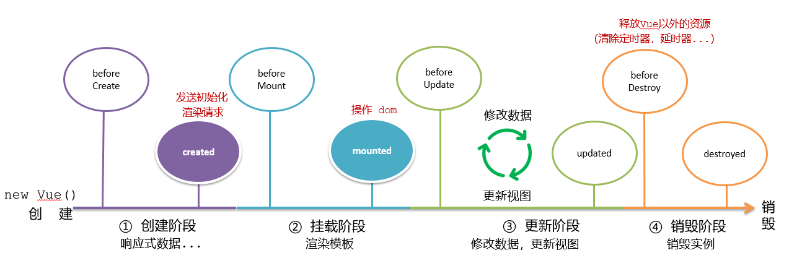

```html
<div id="app">
    <h3>{{ title }}</h3>
    <div>
      <button @click="count--">-</button>
      <span>{{ count }}</span>
      <button @click="count++">+</button>
    </div>
  </div>
  <script src="https://cdn.jsdelivr.net/npm/vue@2/dist/vue.js"></script>
  <script>
    const app = new Vue({
      el: '#app',
      data: {
        count: 100,
        title: '计数器'
      },
        
      // 1. 创建阶段（准备数据）
     beforeCreate () {
         console.log('beforeCreate 响应式的数据准备好之前')  // 访问不到数据
     },
     created () {
         console.log('created 响应式的数据准备好之后')  // 可以访问到数据
         // this.数据名 = 请求回来的数据
         // 可以开始发送初始化渲染的请求了！！！
     },

      // 2. 挂载阶段（渲染模板）
      beforeMount () {
        console.log('beforeMount 模板渲染之前')  // 获取不到页面元素
    },
      mounted () {
          console.log('mounted 模板渲染之后')
          // 可以开始操作 dom 了
      },

      // 3. 更新阶段(修改数据 → 更新视图)
      beforeUpdate () {
          console.log('beforeUpdate 更新之前的 dom 结构 ，数据修改了，视图还没更新  100')
      },
      Updated () {
          console.log('Updated 数据修改了，视图已经更新  101')     // 区别在于视图  数据是立刻修改的，更新视图是有前后的 
      },

      // 4. 卸载阶段
      beforeDestroy () {
          console.log('beforeDestroy 卸载前')
          // 通常清除掉一些 vue 以外的资源的占用 、定时器、延时器 ...
      },
      Destroyed () {
          console.log('Destroyed 卸载后')
      }
     
    })
  </script>
```


## 生命周期钩子小案例

**1.在created中发送数据**

```html
 <div id="app">
    <ul>
      <li class="news" v-for="(item,index) in list" :key="item.id">
        <div class="left">
          <div class="title">{{item.title}}</div>
          <div class="info">
            <span>{{ item.source }}</span>
            <span>{{ item.time }}</span>
          </div>
        </div>
        <div class="right">
          
        </div>
      </li>
    </ul>
  </div>

  <script src="https://cdn.jsdelivr.net/npm/vue@2/dist/vue.js"></script>
  <script src="https://cdn.jsdelivr.net/npm/axios/dist/axios.min.js"></script>

  <script>
    // 接口地址：http://hmajax.itheima.net/api/news
    // 请求方式：get
    const app = new Vue({
      el: '#app',
      data: {
        list: [] // 承载接口返回的数据
      },
       // created 
        async created () {
            // 1. 发送请求，拿到数据
            const res = await axios.get('http://hmajax.itheima.net/api/news')  // 一进页面立即发送请求拿数据
            // console.log(res)
            // 2. 将数据更新给 list
            this.list = res.data.data
        }
    })
  </script>
```


**2.在mounted中获取焦点**

```html
<div class="container" id="app">
  <div class="search-container">
    
    <div class="search-box">
      <input type="text" v-model="words" id="inp">
      <button>搜索一下</button>
    </div>
  </div>
</div>

<script src="https://cdn.jsdelivr.net/npm/vue@2/dist/vue.js"></script>
<script>
   //  需求：一进页面立即获取焦点 操作dom mounted  
  const app = new Vue({
    el: '#app',
    data: {
      words: ''
    },
    
      // 核心思路：
      // 1. 等输入框渲染出来
      // 2. 让输入框获取焦点
      mounted () {
          document.querySelector('#inp').foucs()
      }
  })
</script>
```


## 案例-小黑记账清单

**1.需求图示：**

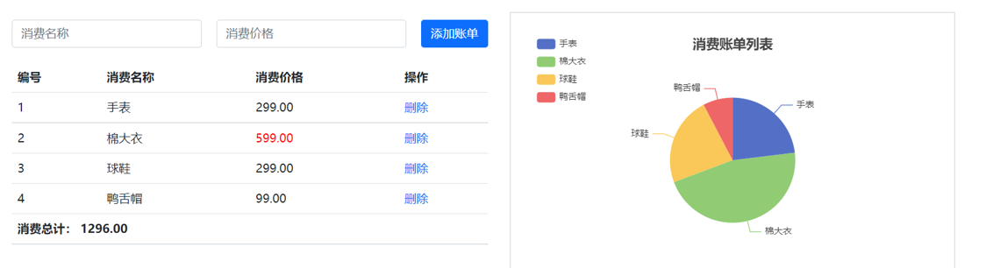

**2.需求分析**

1.基本渲染

2.添加功能

3.删除功能

4.饼图渲染

**3.思路分析**

1.基本渲染  

- 立刻发送请求获取数据 created
- 拿到数据，存到data的响应式数据中
- 结合数据，进行渲染 v-for
- 消费统计  —> 计算属性

2.添加功能

- 收集表单数据 v-model，使用指令修饰符处理数据
- 给添加按钮注册点击事件，对输入的内容做非空判断，发送请求
- 请求成功后，对文本框内容进行清空
- 重新渲染列表

3.删除功能

- 注册点击事件，获取当前行的id
- 根据id发送删除请求
- 需要重新渲染

4.饼图渲染

- 初始化一个饼图 `echarts.init(dom)`    mounted钩子中渲染
- 根据数据试试更新饼图 `echarts.setOptions({...})`

**4.代码准备**

```html
<!DOCTYPE html>
<html lang="en">

<head>
    <meta charset="UTF-8" />
    <meta name="viewport" content="width=device-width, initial-scale=1.0" />
    <title>Document</title>
    <!-- CSS only -->
    <link rel="stylesheet" href="https://cdn.jsdelivr.net/npm/bootstrap@5.1.3/dist/css/bootstrap.min.css" />
    <style>
        .red {
            color: red!important;
        }
        
        .search {
            width: 300px;
            margin: 20px 0;
        }
        
        .my-form {
            display: flex;
            margin: 20px 0;
        }
        
        .my-form input {
            flex: 1;
            margin-right: 20px;
        }
        
        .table> :not(:first-child) {
            border-top: none;
        }
        
        .contain {
            display: flex;
            padding: 10px;
        }
        
        .list-box {
            flex: 1;
            padding: 0 30px;
        }
        
        .list-box a {
            text-decoration: none;
        }
        
        .echarts-box {
            width: 600px;
            height: 400px;
            padding: 30px;
            margin: 0 auto;
            border: 1px solid #ccc;
        }
        
        tfoot {
            font-weight: bold;
        }
        
        @media screen and (max-width: 1000px) {
            .contain {
                flex-wrap: wrap;
            }
            .list-box {
                width: 100%;
            }
            .echarts-box {
                margin-top: 30px;
            }
        }
    </style>
</head>

<body>
    <div id="app">
        <div class="contain">
            <!-- 左侧列表 -->
            <div class="list-box">

                <!-- 添加资产 -->
                <form class="my-form">
                    <input v-model.trim="name" type="text" class="form-control" placeholder="消费名称" />
                    <input v-model.number="price" type="text" class="form-control" placeholder="消费价格" />
                    <button @click="add" type="button" class="btn btn-primary">添加账单</button>
                </form>

                <table class="table table-hover">
                    <thead>
                        <tr>
                            <th>编号</th>
                            <th>消费名称</th>
                            <th>消费价格</th>
                            <th>操作</th>
                        </tr>
                    </thead>
                    <tbody>
                        <tr v-for="(item,index) in list" :key="item.id">
                            <td>{{ index + 1 }}</td>
                            <td>{{item.name}}</td>
                            <td :class="{ red : item.price >= 500  }">{{item.price.toFixed(2)}}</td>
                            <td><a @click="del(item.id)" href="javascript:;">删除</a></td>
                        </tr>
                    </tbody>
                    <tfoot>
                        <tr>
                            <td colspan="4">消费总计： {{totalPrice}}</td>
                        </tr>
                    </tfoot>
                </table>
            </div>

            <!-- 右侧图表 -->
            <div class="echarts-box" id="main"></div>
        </div>
    </div>
    <script src="https://cdn.jsdelivr.net/npm/echarts@5.4.0/dist/echarts.min.js"></script>
    <script src="https://cdn.jsdelivr.net/npm/vue@2/dist/vue.js"></script>
    <script src="https://cdn.jsdelivr.net/npm/axios/dist/axios.min.js"></script>
    <script>
        /**
         * 接口文档地址：
         * https://www.apifox.cn/apidoc/shared-24459455-ebb1-4fdc-8df8-0aff8dc317a8/api-53371058
         * 
         * 功能需求：
         * 1. 基本渲染
         *      (1) 立刻发送请求获取数据 created
         *      (2) 拿到数据，存到 data 的响应式数据中接收
         *      (3) 结合数据，进行渲染 v-for
         *      (4) 统计消费 => 计算属性
         * 2. 添加功能
         *      (1) 收集表单数据 v-model 
         *      (2) 给添加按钮 注册点击事件，发起添加请求
         *      (3) 需不需要重新渲染？需要重新渲染 拉取最新数据
         *      (4) 请求成功后，对文本框内容进行清空
         * 3. 删除功能
         *      (1) 注册点击事件 ， 获取当前行的id， 传参传 id
         *      (2) 根据id发送删除请求
         *      (3) 重新渲染数据
         * 4. 饼图渲染
         *      (1) 初始化一个饼图 echarts  mounted钩子函数中实现
         *      (2) 根据数据实时更新饼图
         */
        const app = new Vue({
            el: '#app',
            data: {
                list: [], // 承载数据
                name: '',
                price: ''
            },
            // 计算属性
            computed: {
                totalPrice() {
                    return this.list.reduce((sum, item) => item.price + sum, 0).toFixed(2)
                }
            },

            created() {
                this.getList() // 一进页面调用渲染页面数据函数
            },
            // 操作 dom
            mounted() {
                this.myChart = echarts.init(document.querySelector('#main'))
                    // 配置
                const option = {
                    title: {
                        text: '消费账单列表',
                        left: 'center'
                    },
                    // 提示框
                    tooltip: {
                        trigger: 'item'
                    },
                    // 图例
                    legend: {
                        orient: 'vertical', // 垂直对齐
                        left: 'left'
                    },
                    // 数据项
                    series: [{
                        name: '消费账单',
                        type: 'pie',
                        radius: '50%', // 半径
                        data: [
                            // { value: 1048, name: '球鞋' },
                            // { value: 735, name: '防晒霜' }
                        ],
                        emphasis: {
                            itemStyle: {
                                shadowBlur: 10,
                                shadowOffsetX: 0,
                                shadowColor: 'rgba(0, 0, 0, 0.5)'
                            }
                        }
                    }]
                };
                this.myChart.setOption(option)
            },
            methods: {
                async getList() {
                    const res = await axios.get('https://applet-base-api-t.itheima.net/bill', {
                            params: {
                                creator: '小清'
                            }
                        })
                        // console.log(res)
                    this.list = res.data.data

                    // 更新图表 覆盖掉
                    this.myChart.setOption({
                        // 配置项
                        series: [{

                            data: this.list.map(item => {
                                return {
                                    value: item.price,
                                    name: item.name
                                }
                            }),

                        }]
                    })
                },
                // 添加功能
                async add() {
                    if (!this.name) {
                        alert('请输入消费名称')
                        return
                    }
                    if (typeof this.price !== 'number') {
                        alert('格式错误')
                        return
                    }
                    // 发送添加请求
                    const res = await axios.post('https://applet-base-api-t.itheima.net/bill', {
                            creator: '小清',
                            name: this.name,
                            price: this.price
                        })
                        // console.log(res);
                        // 重新渲染一次
                    this.getList()
                        // 清空表单
                    this.name = ''
                    this.price = ''
                },

                // 删除功能
                async del(id) {
                    // 根据id发送删除请求
                    await axios.delete(`https://applet-base-api-t.itheima.net/bill/${id}`)
                        // 重新渲染
                    this.getList()
                }

            }
        })
    </script>
</body>

</html>
```


## 工程化开发和脚手架

**1.开发`Vue`的两种方式**

- 核心包传统开发模式：基于`html / css / js `文件，直接引入核心包，开发 `Vue`。
- **工程化开发模式：基于构建工具（例如：`webpack`）的环境中开发`Vue`。**

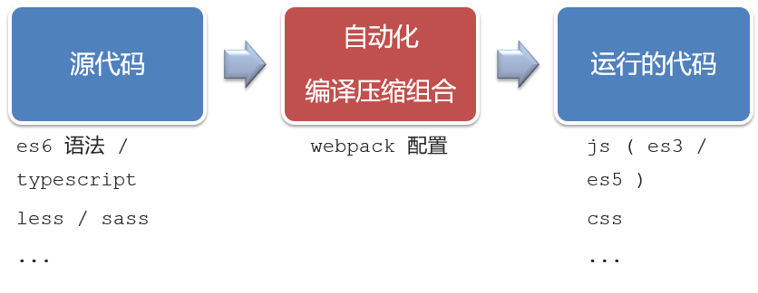

工程化开发模式优点：

   提高编码效率，比如使用`JS`新语法、Less/Sass、Typescript等通过`webpack`都可以编译成浏览器识别的`ES3/ES5/CSS`等

工程化开发模式问题：

- `webpack`配置**不简单**
- **雷同**的基础配置
- 缺乏**统一的标准**

为了解决以上问题，所以我们需要一个工具，生成标准化的配置


**2.脚手架`Vue CLI`**

**基本介绍：**

   `Vue CLI` 是`Vue`官方提供的一个**全局命令工具**

   可以帮助我们**快速创建**一个开发`Vue`项目的**标准化基础架子**。集成了`webpack`配置

**好处：**

1. 开箱即用，零配置
2. 内置babel等工具
3. 标准化的`webpack`配置

**使用步骤：**

1. 全局安装（只需安装一次即可） **yarn global add @vue/cli** 或者 npm i @vue/cli -g
2. 查看`vue/cli`版本： vue --version
3. 创建项目架子：**vue create project-name**(项目名不能使用中文)
4. 启动项目：**yarn serve** 或者 **npm run serve**(命令不固定，找`package.json`)!!


## 项目目录介绍和运行流程

**1.项目目录介绍**

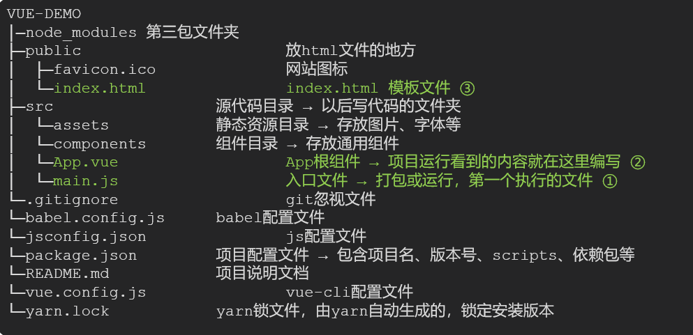

虽然脚手架中的文件有很多，目前咱们只需认识三个文件即可

1. main.js  入口文件
2. App.vue  App根组件 
3. index.html 模板文件

**2.运行流程**

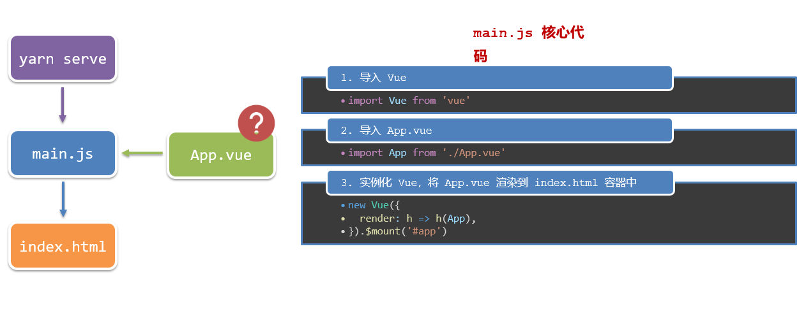

```js
// 文件核心作用：导入 App.vue . 基于 App.vue 创建结构渲染 index.html

// 1. 导入 Vue 核心包
import Vue from 'vue'

// 2. 导入 App.vue 组件 
import App from './App.vue'

// 提示：当前处于什么环境 （生产环境 - 开发环境）
Vue.config.productionTip = false

// 3. Vue实例化。提供 render 方法 => 基于 App.vue 创建结构渲染 index.html
new Vue({
    // el: '#app',  作用：和 $mount('#app') 作用一致，用于指定 Vue 所管理的容器
    // render: h => h(App),
    render: (createElement) => {
        // 基于 App 创建元素结构
        return createElement(App)
    }
}).$mount('#app')
```


## 组件化开发

​     组件化：一个页面可以拆分成一个个组件，每个组件有着自己独立的结构、样式、行为。

​     好处：便于维护，利于复用 → 提升开发效率。

​     组件分类：普通组件、根组件。

​      比如：下面这个页面，可以把所有的代码都写在一个页面中，但是这样显得代码比较混乱，难易维护。咱们可以按模块进行组件划分

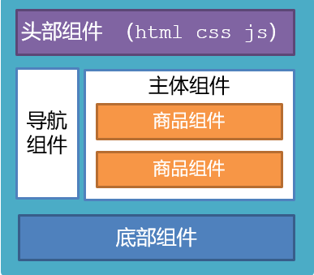


## 根组件 `App.vue`

**1.根组件介绍**

整个应用最上层的组件，包裹所有普通小组件


**2.组件是由三部分构成**

- 语法高亮插件


- 三部分构成

  - template：结构 （有且只能一个根元素）
  - script:   js逻辑 
  - style： 样式 (可支持less，需要装包)

- 让组件支持less

  （1） style标签，**lang="less"** 开启less功能 

  （2） 装包: **yarn add less less-loader -D** 或者npm i less less-loader -D


## 局部注册组件

**1.特点：**

**只能在注册的组件内使用**

**2.步骤：**

1. 创建`.vue`文件（三个组成部分）
2. 在使用的组件内先导入再注册，最后使用

**3.使用方式：**

**当成html标签使用即可**  <组件名></组件名>

**4.注意：**

组件名规范 —> **大驼峰命名法**， 如 HmHeader

**5.语法：**

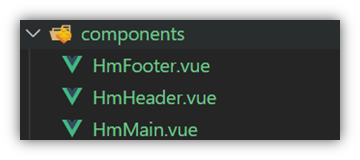

```js
// 导入需要注册的组件
import 组件对象 from '.vue文件路径'
import HmHeader from './components/HmHeader'

export default { 
    // 局部注册
  components: {
  // '组件名': 组件对象,
    HmHeader:HmHeaer,
    HmHeader
  }
}
```


## 全局注册组件

**1.特点：**

全局注册的组件，在项目的**任何组件**中都能使用

**2.步骤**

1. 创建`.vue`组件（三个组成部分）
2. **main.js**中进行全局注册

**3.使用方式**

当成HTML标签直接使用

> <组件名></组件名>

**4.注意**

组件名规范 —> **大驼峰命名法**

**5.语法**

**Vue.component('组件名', 组件对象)**

例：

```js
// 导入需要全局注册的组件
import HmButton from './components/HmButton'

// 进行全局注册 => 在所有的组件范围内都能直接使用
Vue.component('HmButton', HmButton)
```


## 综合案例

**1.小兔仙首页启动项目演示**

**2.小兔仙组件拆分示意图**

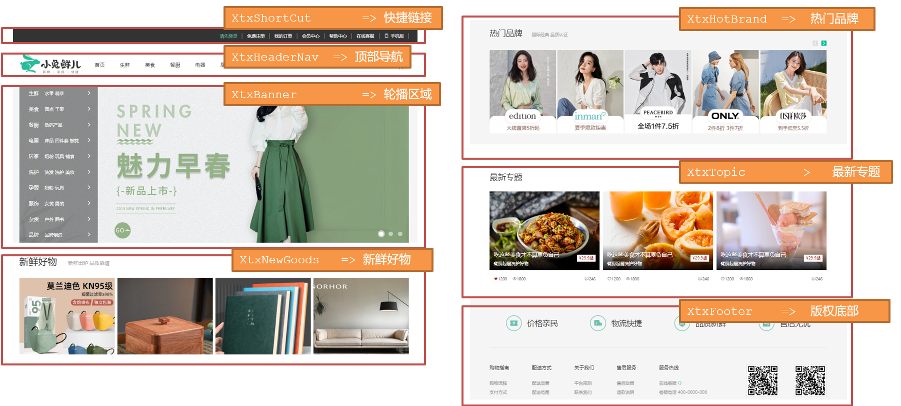


**3.开发思路**

1. 分析页面，按模块拆分组件，搭架子  (局部或全局注册)

2. 根据设计图，编写组件 html 结构 css 样式 (已准备好)

3. 拆分封装通用小组件  (局部或全局注册)

   将来 → 通过 js 动态渲染，实现功能


## scoped解决样式冲突

**1.默认情况：**

写在组件中的样式会 **全局生效** →  因此很容易造成多个组件之间的样式冲突问题。

1. **全局样式**: 默认组件中的样式会作用到全局，任何一个组件中都会受到此样式的影响


2. **局部样式**: 可以给组件加上**scoped** 属性,可以**让样式只作用于当前组件**

**2.代码演示**

BaseOne.vue

```vue
<template>
  <div class="base-one">
    BaseOne
  </div>
</template>

<script>
export default {

}
</script>
<style scoped>
    /**
     1. 默认的 style 样式，会作用于全局 -> 全局样式
     2. 加上 scoped 属性的style样式，只会作用于当前组件 -> 局部样式
    
    组件应该有着自己独立的样式，推荐加上 scoped
    */
</style>
```

**3.scoped原理**

1. 当前组件内标签都被添加**data-v-hash值** 的属性 !
2. css选择器都被添加 [**data-v-hash值**] 的属性选择器

最终效果: **必须是当前组件的元素**, 才会有这个自定义属性, 才会被这个样式作用到 


 

## data必须是一个函数

**1、data为什么要写成函数**

一个组件的 **data** 选项必须**是一个函数**。目的是为了：**保证每个组件实例**，维护**独立**的一份**数据**对象。

每次创建新的组件实例，都会新**执行一次data 函数**，得到一个新对象。


## 组件通信

**1.什么是组件通信？**

组件通信，就是指**组件与组件**之间的**数据传递**

- 组件的数据是独立的，无法直接访问其他组件的数据。
- 想使用其他组件的数据，就需要组件通信

**2.组件之间如何通信**


**3.组件关系分类**

1. 父子关系
2. 非父子关系


**4.通信解决方案**


**5.父子通信流程**

1. 父组件通过 **props** 将数据传递给子组件
2. 子组件利用 **$emit** 通知父组件修改更新


1.父向子通信

父组件通过**props**将数据传递给子组件


父向子传值步骤

1. **给子组件以添加属性的方式传值**
2. **子组件内部通过props接收**
3. **模板中直接使用 props接收的值**


**7.子向父通信**

子组件利用 **$emit** 通知父组件，进行修改更新


子向父传值步骤

1. **$emit触发事件，给父组件发送消息通知**
2. **父组件监听$emit触发的事件**
3. **提供处理函数，在函数的性参中获取传过来的参数**


## 什么是props

**1.Props 定义**

组件上 注册的一些  自定义属性

**2.Props 作用**

向子组件传递数据

**3.特点**

1. 可以 传递 **任意数量** 的prop
2. 可以 传递 **任意类型** 的prop


## props校验

**1.思考**

组件的props可以乱传吗

**2.作用**

为组件的 prop 指定**验证要求**，不符合要求，控制台就会有**错误提示**  → 帮助开发者，快速发现错误

**3.语法**

- **类型校验**
- 非空校验
- 默认值
- 自定义校验


## props校验完整写法

**1.语法**

```js
props: {
  校验的属性名: {
    type: 类型,              // Number String Boolean ...
    required: true,         // 是否必填
    default: 默认值,         // 默认值
    validator (value) {
      // 自定义校验逻辑
      return 是否通过校验
    }
  }
},
```

**2.代码实例**

```vue
<script>
export default {
  // 完整写法（类型、默认值、非空、自定义校验）
  props: {
    count: {
      type: Number,
   // required: true,
      default: 0,                          
      validator(val) {
        // console.log(val)
        if (val >= 100 || val <= 0) {
          console.error('传入的范围必须是0-100之间')
          return false
        } else {
          return true
        }
      },
    },
  },
}
</script>
```

**3.注意**

1.`default`和`required`一般不同时写（因为当是必填项时，肯定是有值的）

2.`default`后面如果是简单类型的值，可以直接写默认。如果是复杂类型的值，则需要以函数的形式return一个默认值


## props&data、单向数据流

**1.共同点**

都可以给组件提供数据

**2.区别**

- data 的数据是**自己**的  →   随便改  
- prop 的数据是**外部**的  →   不能直接改，要遵循 **单向数据流**

**3.单向数据流：**

**父级props 的数据更新，会向下流动，影响子组件。这个数据流动是单向的**


**4.口诀**

**谁的数据谁负责**


## 非父子通信-event bus 事件总线

**1.作用**

非父子组件之间，进行简易消息传递。(复杂场景→ Vuex)

**2.步骤**

1. 创建一个都能访问的事件总线 （空Vue实例）

   ```js
   // utils/EventBus.js
   
   // 1. 创建一个都能访问到的事件总线 （空的 Vue 实例）
   import Vue from 'vue'
   
   const Bus = new Vue()
   
   export default Bus
   ```

2. A组件（接受方），监听Bus的 $on事件

   ```js
   import Bus from '../utils/EventBus'
   
   // 2. 在接收方（A组件），进行监听 Bus 的事件（比如订阅消息）
   created () {
     Bus.$on('sendMsg', (msg) => {
       this.msg = msg
     })
   }
   ```

3. B组件（发送方），触发Bus的$emit事件

   ```js
   import Bus from '../utils/EventBus'
   
   // b组件 点击传递消息 
   // 3. B组件（发送方）触发事件的方式传递参数 （分布消息）
    Bus.$emit('sendMsg', '这是一个消息')
   ```


   

## 非父子通信-provide&inject

**1.作用**

**跨层级共享数据**

**2.场景**


**3.语法**

1. 父组件 provide提供数据

```js
export default {
  provide () {
    return {
       // 普通类型【非响应式】
       color: this.color, 
       // 复杂类型【响应式】
       userInfo: this.userInfo, 
    }
  }
}
```

2.子/孙组件 inject获取数据

```js
export default {
  inject: ['color','userInfo'],
  created () {
    console.log(this.color, this.userInfo)
  }
}
```

**4.注意**

- **provide提供的简单类型的数据不是响应式的，复杂类型数据是响应式。（推荐提供复杂类型数据）**
- **子/孙组件通过inject获取的数据，不能在自身组件内修改**


## v-model原理

**1.原理：**

v-model本质上是一个**语法糖**。例如应用在输入框上，就是value属性 和 input事件 的合写

```vue
<template>
  <div id="app" >
    <input v-model="msg" type="text">

    <input :value="msg" @input="msg = $event.target.value" type="text">
  </div>
</template>

```

**2.作用：**

提供数据的双向绑定

- 数据变，视图跟着变 **:value**
- 视图变，数据跟着变 **@input**

**3.注意**

**$event** 用于在模板中，获取事件的形参。

**4.代码示例**

```vue
<template>
  <div class="app">
    <input v-model="msg1" type="text"  />
    <br /> 
    <input :value="msg2" @input="msg2 = $event.target.value" type="text" />
  </div>
</template>

<script>
export default {
  data() {
    return {
      msg1: '',
      msg2: '',
    }
  },
}
</script> 
<style>
</style>
```

**5.v-model使用在其他表单元素上的原理**

不同的表单元素， v-model在底层的处理机制是不一样的。比如给checkbox使用v-model

底层处理的是 checked属性和change事件。

**不过咱们只需要掌握应用在文本框上的原理即可**


## 表单类组件封装

**1.需求目标**

实现子组件和父组件数据的双向绑定 （实现App.vue中的selectId和子组件选中的数据进行双向绑定）

（1）父传子：数据 应该是父组件 **props** 传递过来的，v-model **拆解** 绑定数据。

（2）子传父：监听输入，子传父传值给父组件修改。

```js
// 子组件

<select :value='cityId' @change="handleChange">...</select>

props: {
    cityId: String
},

methods: {
    handleChange(e) {
        this.$emit('事件名',e.target.value)
    }
}    
```

```js
// 父组件

<BaseSelect :cityId="selectId" @事件名="selectedId = $event">
```


**2.代码演示**

App.vue

```vue
<template>
  <div class="app">
    <BaseSelect :cityId="selectId" @changeId="selectedId = $event"></BaseSelect>
  </div>
</template>

<script>
import BaseSelect from './components/BaseSelect.vue'
export default {
  data() {
    return {
      selectId: '102',
    }
  },
  components: {
    BaseSelect,
  },
}
</script>

<style>
</style>
```

BaseSelect.vue

```vue
<template>
  <div>
    <select :value='cityId' @change="handleChange">
      <option value="101">北京</option>
      <option value="102">上海</option>
      <option value="103">武汉</option>
      <option value="104">广州</option>
      <option value="105">深圳</option>
    </select>
  </div>
</template>

<script>
export default {
    
props: {
    cityId: String
},

methods: {
    handleChange(e) {
        this.$emit('changeId',e.target.value)
    }
}    
}
</script>

<style>
</style>
```


## v-model简化代码

**1.目标：**

父组件通过v-model **简化代码**，实现子组件和父组件数据 **双向绑定**

**2.如何简化：**

v-model其实就是 :value和@input事件的简写

- 子组件：props通过value接收数据，事件触发 input
- 父组件：v-model直接绑定数据

**3.代码示例**

子组件

```vue
<select :value="value" @change="handleChange">...</select>
props: {
  value: String
},
methods: {
  handleChange (e) {
    this.$emit('input', e.target.value)
  }
}
```

父组件

```vue
<BaseSelect v-model="selectId"></BaseSelect>

```


## .sync修饰符

**1.作用**

可以实现 **子组件** 与 **父组件数据** 的 **双向绑定**，简化代码

简单理解：**子组件可以修改父组件传过来的props值**

**2.场景**

封装弹框类的基础组件， **visible属性 true显示 false隐藏**

**3.本质**

.sync修饰符 就是 **:属性名** 和 **@update:属性名** 合写

**4.语法**

父组件

```vue
//.sync写法
<BaseDialog :visible.sync="isShow" />
--------------------------------------
//完整写法
<BaseDialog 
  :visible="isShow" 
  @update:visible="isShow = $event" 
/>
```

子组件

```vue
props: {
  visible: Boolean
},

this.$emit('update:visible', false)
```

**5.代码示例**

App.vue

```vue
<template>
  <div class="app">
    <button @click="isShow = true">退出按钮</button>
    <BaseDialog :visible.sync="isShow"></BaseDialog>     // :visible.sync => :visible + @update:visible
  </div>
</template>

<script>
import BaseDialog from './components/BaseDialog.vue'
export default {
  data() {
    return {
      isShow: false,
    }
  },
  components: {
    BaseDialog,
  },
}
</script>

<style>
</style>
```

BaseDialog.vue

```vue
<template>
  <div class="base-dialog-wrap" v-show="visible">
    <div class="base-dialog">
      <div class="title">
        <h3>温馨提示：</h3>
        <button @click="close" class="close">x</button>
      </div>
      <div class="content">
        <p>你确认要退出本系统么？</p>
      </div>
      <div class="footer">
        <button>确认</button>
        <button>取消</button>
      </div>
    </div>
  </div>
</template>

<script>
export default {
  props: {
    visible: Boolean,
  },
    methods: {
        close() {
            this.$emit('update:visible',false)
        }
    }
}
</script>

```


##  ref和$refs

**1.作用**

利用ref 和 $refs 可以用于 **获取 dom 元素** 或 **组件实例**

**2.特点：**

查找范围 →  **当前组件内(更精确稳定)**

**3.语法**

1.给要获取的盒子添加ref属性

```html
<div ref="chartRef">我是渲染图表的容器</div>
```

2.获取时通过 $refs获取  this.\$refs.chartRef 获取

```html
mounted () {
  console.log(this.$refs.chartRef)
}
```

**注意**：document.querySelect 查找的是整个页面！

BaseChart.vue

```vue
<template>
  <div class="base-chart-box" ref="baseChartBox">子组件</div>
</template>

<script>
// yarn add echarts 或者 npm i echarts
import * as echarts from 'echarts'

export default {
  mounted() {
    // 基于准备好的dom，初始化echarts实例
    var myChart = echarts.init(this.$refs.baseChartBox)
    // 绘制图表
    myChart.setOption({  })
  },
}
</script>

```

**获取组件：**

1. 目标组件  - 添加 ref 属性

   ```vue
   <BaseForm ref="baseForm"></BaseForm>
   ```

2.  恰当时机，通过 this.$refs.xxx, 获取目标组件，就可以 **调用组件对象里面的方法**

   ```js
   this.$refs.baseForm.组件方法()
   ```

   


## 异步更新 & $nextTick

**1.需求**

编辑标题,  编辑框自动聚焦

1. 点击编辑，显示编辑框
2. 让编辑框，立刻获取焦点


**2.代码实现**

```vue
<template>
  <div class="app">
    <div v-if="isShowEdit">
      <input type="text" v-model="editValue" ref="inp" />
      <button>确认</button>
    </div>
    <div v-else>
      <span>{{ title }}</span>
      <button @click="editFn">编辑</button>
    </div>
  </div>
</template>

<script>
export default {
  data() {
    return {
      title: '大标题',
      isShowEdit: false,
      editValue: '',
    }
  },
  methods: {
    editFn() {
        // 显示输入框(异步 dom 更新)
        this.isShowEdit = true  
        // 获取焦点
        //this.$refs.inp.focus()   Cannot read properties of undefined (reading 'focus')
        // 等 DOM更新后,才会触发执行此方法里的函数体
        this.$nextTick(()=> {
            this.$refs.inp.foucs()
        })
    }  },
}
</script> 
```


**3.问题**

"**显示之后"，立刻获取焦点是不能成功的！**

**原因：Vue 是异步更新DOM  (提升性能)**


**4.解决方案**

**$nextTick**：**等 DOM更新后**,**才会触发执行此方法里的函数体**

**语法:** **this.$nextTick(函数体)**

```js
this.$nextTick(() => {
  this.$refs.inp.focus()
})
```

**注意：$nextTick 内的函数体 一定是箭头函数**，**这样才能让函数内部的this指向Vue实例**


## 自定义指令

**1.指令介绍**

- 内置指令：**v-html、v-if、v-bind、v-on**... 这都是Vue给咱们内置的一些指令，可以直接使用

- 自定义指令：同时Vue也支持让开发者，自己注册一些指令。这些指令被称为**自定义指令**

  每个指令都有自己各自独立的功能

**2.自定义指令**

概念：自己定义的指令，可以**封装一些DOM操作**，扩展额外的功能

**3.自定义指令语法**

- 全局注册

  ```js
  //在main.js中
  Vue.directive('指令名', {
    "inserted" (el) {
      // 可以对 el 标签，扩展额外功能
      el.focus()
    }
  })
  ```

- 局部注册

  ```js
  //在Vue组件的配置项中
  directives: {
    "指令名": {
      inserted () {
        // 可以对 el 标签，扩展额外功能
        el.focus()
      }
    }
  }
  ```

- **使用指令**

  注意：在使用指令的时候，一定要**先注册**，**再使用**，否则会报错
  使用指令语法： v-指令名。如：<input type="text"  v-focus/>  

  **注册**指令时**不用**加**v-前缀**，但**使用时**一定要**加v-前缀**

**4.指令中的配置项介绍**

**inserted**:被绑定元素插入父节点时调用的钩子函数

**el**：使用指令的那个DOM元素


**5.代码示例**

需求：当页面加载时，让元素获取焦点（**autofocus在safari浏览器有兼容性**）

App.vue

```js
  <div>
    <h1>使用自定义指令</h1>
    <input v-focus ref="inp" type="text">
  </div>

// 局部注册指令
directives: {
    // 指令名：指令的配置项
    focus : {
        inserted (el) {
            el.focus()
        }
    }
}
```

```js
// 全局注册指令
Vue.directive('focus', {
    // inserted 会在 指令所在的元素，被插入到页面中时触发
    inserted (el) {
        // el 就是指令所绑定的元素
        // console.log(el) //  <input type="text">
        el.focus()
    }
})
```


## 自定义指令-指令的值

**1.需求**

实现一个 color 指令 - 传入不同的颜色, 给标签设置文字颜色

**2.语法**

1.在绑定指令时，可以**通过“等号”的形式为指令 绑定 具体的参数值**

```html
<div v-color="color">我是内容</div>
```

2.通过 binding.value 可以拿到指令值，**指令值修改会 触发 update 函数**

```js
directives: {
  color: {
    inserted (el, binding) {
      el.style.color = binding.value
    },
    update (el, binding) {
      el.style.color = binding.value
    }
  }
}
```

**3.代码示例**

App.vue

```vue
<template>
  <div>
     <!--显示红色--> 
    <h2 v-color="color1">指令的值1测试</h2>
     <!--显示蓝色--> 
    <h2 v-color="color2">指令的值2测试</h2>
     <button>
        改变第一个h1的颜色
    </button>
  </div>
</template>

<script>
export default {
  data () {
    return {
      color1: 'red',
      color2: 'blue'
    }
  },
  // 自定义指令
    directives: {
        color: {
            // 1. inserted 提供的元素被添加到页面中时的逻辑
            inserted(el , binding) {
                // console.log(el,binding.value)
                // binding.value 就是指令的值
                el.style.color = binding.value
            },
            // 2. update 指令的值修改的时候触发，提供值变化后，dom更新的逻辑
            update (el , binding) {
                // console.log('指令的值修改了')
                el.style.color = binding.value
            }
        }
    }
}
</script>

<style>

</style>
```


## 自定义指令-v-loading指令的封装

**1.场景**

实际开发过程中，发送请求需要时间，在请求的数据未回来时，页面会处于**空白状态**  =>  用户体验不好

**2.需求**

封装一个 v-loading 指令，实现加载中的效果

**3.分析**

1.本质 loading效果就是一个蒙层，盖在了盒子上

2.数据请求中，开启loading状态，添加蒙层

3.数据请求完毕，关闭loading状态，移除蒙层

**4.实现**

1.准备一个 loading类，通过伪元素定位，设置宽高，实现蒙层

2.开启关闭 loading状态（添加移除蒙层），本质只需要添加移除类即可

3.结合自定义指令的语法进行封装复用

```css
.loading:before {
  content: "";
  position: absolute;
  left: 0;
  top: 0;
  width: 100%;
  height: 100%;
  background: #fff url("./loading.gif") no-repeat center;
}
```

**5.准备代码**

```html
<template>
  <div class="main">
    <div class="box" v-loading="isLoading">
      <ul>
        <li v-for="item in list" :key="item.id" class="news">
          <div class="left">
            <div class="title">{{ item.title }}</div>
            <div class="info">
              <span>{{ item.source }}</span>
              <span>{{ item.time }}</span>
            </div>
          </div>
          <div class="right">
            
          </div>
        </li>
      </ul>
    </div> 
  </div>
</template>

<script>
// 安装axios =>  yarn add axios || npm i axios
import axios from 'axios'

// 接口地址：http://hmajax.itheima.net/api/news
// 请求方式：get
export default {
  data () {
    return {
      list: [],
      isLoading: false
    }
  },
  async created () {
    this.isLoading = true
    // 1. 发送请求获取数据
    const res = await axios.get('http://hmajax.itheima.net/api/news')
    
    setTimeout(() => {
      // 2. 更新到 list 中，用于页面渲染 v-for
      this.list = res.data.data
      this.isLoading = false
    }, 2000)
      
  }，
    // 自定义 v-loading 指令
    directives: {
    loading: {
        inserted (el,binding) {
           binding.value ? el.classList.add('loading') : el.classList.remove('loading')
        },
        update (el,binding) {
           binding.value ?  el.classList.add('loading') : el.classList.remove('loading')
        }
   } 
 }
}
</script>

<style>
.loading:before {
  content: '';
  position: absolute;
  left: 0;
  top: 0;
  width: 100%;
  height: 100%;
  background: #fff url('./loading.gif') no-repeat center;
}

.box2 {
  width: 400px;
  height: 400px;
  border: 2px solid #000;
  position: relative;
}


.box {
  width: 800px;
  min-height: 500px;
  border: 3px solid orange;
  border-radius: 5px;
  position: relative;
}
.news {
  display: flex;
  height: 120px;
  width: 600px;
  margin: 0 auto;
  padding: 20px 0;
  cursor: pointer;
}
.news .left {
  flex: 1;
  display: flex;
  flex-direction: column;
  justify-content: space-between;
  padding-right: 10px;
}
.news .left .title {
  font-size: 20px;
}
.news .left .info {
  color: #999999;
}
.news .left .info span {
  margin-right: 20px;
}
.news .right {
  width: 160px;
  height: 120px;
}
.news .right img {
  width: 100%;
  height: 100%;
  object-fit: cover;
}
</style>
```


## 插槽-默认插槽

**1.作用**

让组件内部的一些 **结构** 支持 **自定义**


**2.需求**

将需要多次显示的对话框,封装成一个组件

**3.问题**

组件的内容部分，**不希望写死**，希望能使用的时候**自定义**。怎么办

**4.插槽的基本语法**

1. **组件内需要定制的结构部分，改用<slot></slot>占位**
2. **使用组件时, <MyDialog></MyDialog>标签内部, 传入结构替换slot**
3. 给插槽传入内容时，可以传入**纯文本、html标签、组件**


## 插槽-后备内容（默认值）

**1.问题**

通过插槽完成了内容的定制，传什么显示什么, 但是如果不传，则是空白


能否给插槽设置 默认显示内容 呢？

**2.插槽的后备内容**

封装组件时，可以为预留的 `<slot>` 插槽提供后备内容（默认内容）。

**3.语法**

**在 <slot> 标签内，放置内容, 作为默认显示内容**


**4.效果**

- 外部使用组件时，不传东西，则slot会显示后备内容 

  

- 外部使用组件时，传东西了，则slot整体会被换掉

  


## 插槽-具名插槽

**1.需求**

一个组件内有多处结构，需要外部传入标签，进行定制 

上面的弹框中有**三处不同**，但是**默认插槽**只能**定制一个位置**，这时候怎么办呢?

**2.具名插槽语法**

- 多个slot使用name属性区分名字 

  

- **template**配合**v-slot:插槽名**来分发对应标签

  

**3.v-slot的简写**

v-slot写起来太长，vue给我们提供一个简单写法 **v-slot: —> #**


## 作用域插槽

**1.插槽分类**

- 默认插槽

- 具名插槽

  插槽只有两种，作用域插槽不属于插槽的一种分类

**2.作用**

定义slot 插槽的同时, 是可以**传值**的。给 **插槽** 上可以 **绑定数据**，将来 **使用组件时可以用**

**3.场景**

封装表格组件


**4.使用步骤**

1. 给 slot 标签, 以 添加属性的方式传值

   ```vue
   <slot :id="item.id" msg="测试文本"></slot>
   ```

2. 所有添加的属性, 都会被收集到一个对象中

   ```vue
   { id: 3, msg: '测试文本' }
   ```

3. 在template中, 通过  ` #插槽名= "obj"` 接收，默认插槽名为 default

   ```vue
   <MyTable :list="list">
     <template #default="obj">
       <button @click="del(obj.id)">删除</button>
     </template>
   </MyTable>
   ```

**5.代码示例**

MyTable.vue

```vue
<template>
  <table class="my-table">
    <thead>
      <tr>
        <th>序号</th><th>姓名</th><th>年纪</th><th>操作</th>
      </tr>
    </thead>
    <tbody>
      <tr v-for="(item,index) in data" :key="item.id">
        <td>{{index + 1}}</td>
        <td>{{item.name}}</td>
        <td>{{item.age}}</td>
        <td>
            <slot :id="item.id"></slot>          <!-- 给 slot 标签, 以 添加属性的方式传值 -->
        </td>
      </tr>
    </tbody>
  </table>
</template>

<script>
export default {
  props: {
    data: Array
  }
}
</script>


```

App.vue

```vue
<template>
  <div>
      
    <MyTable :data="list">
        <template #default="obj">                      <!-- 通过 template  #插槽名="变量名"  接收 -->
             <button @click="del(obj.id)">删除</button>
        </template>
    </MyTable>

    <MyTable :data="list2">
       <template #default="obj">                      <!-- 通过 template  #插槽名="变量名"  接收 -->
             <button @click="show(obj.id)">查看</button>
        </template>
    </MyTable>
  </div>
</template>

<script>
  import MyTable from './components/MyTable.vue'
  export default {
    data () {
      return {
     	list: [
            { id: 1, name: '张小花', age: 18 },
            { id: 2, name: '孙大明', age: 19 },
            { id: 3, name: '刘德忠', age: 17 },
          ],
          list2: [
            { id: 1, name: '赵小云', age: 18 },
            { id: 2, name: '刘蓓蓓', age: 19 },
            { id: 3, name: '姜肖泰', age: 17 },
          ]
      }
    },
    components: {
      MyTable
    },
    methods: {
        del(id) {
            this.list = this.list.filter(item => item.id !== id)
        }
    }
  }
</script>
```


## 综合案例


```js
// my-tag 标签组件的封装
// 1. 创建组件 - 初始化
// 2. 实现功能
//   （1）双击显示，并且自动聚焦
//        v-if v-else @dbclick 操作 isEdit
//        自动聚焦：
//        1. $nextTick  => $refs 获取到 dom ， 进行 focus 获取焦点
//        2. 封装 v-focus 指令
//   （2）失去焦点，隐藏输入框
//       @blur 操作 isEdit 即可
//   （3）回显标签信息
//        回显的标签信息一定是父组件传递过来的
//        v-model实现功能 （简化代码） v-model => :value + @input
//        组件内部通过 props 接收，:value设置给输入框回显
//   （4）内容修改了，回车 => 修改标签信息
//        @keyup.enter 触发事件 $emit('input',e.target.value)
//
//  my-table 表格组件封装
//   1. 数据不能写死，动态传递表格数据渲染  props
//   2. 结构不能写死   具名插槽
//     （1）表头支持自定义  
//     （2）主体支持自定义

```


## 单页应用程序介绍

**1.概念**

单页应用程序：SPA【Single Page Application】是指所有的功能都在**一个html页面**上实现

**2.具体示例**

单页应用网站： 网易云音乐  <https://music.163.com/>

多页应用网站：京东  https://jd.com/

**3.单页应用 VS 多页面应用**


单页应用类网站：系统类网站 / 内部网站 / 文档类网站 / 移动端站点

多页应用类网站：公司官网 / 电商类网站 


# 路由介绍

**1.思考**

单页面应用程序，之所以开发效率高，性能好，用户体验好

最大的原因就是：**页面按需更新**


比如当点击发现音乐和关注时，**只是更新下面部分内容**，对于头部是不更新的

要按需更新，首先就需要明确：**访问路径**和 **组件**的对应关系！

访问路径 和 组件的对应关系如何确定呢？ **路由**


**2.路由的介绍**

生活中的路由：设备和ip的映射关系


Vue中的路由：**路径和组件**的**映射**关系


## 路由的基本使用

**1.目标**

认识插件 VueRouter，掌握 VueRouter 的基本使用步骤

**2.作用**

**修改**地址栏路径时，**切换显示**匹配的**组件**

**3.说明**

Vue 官方的一个路由插件，是一个第三方包

**4.官网**

<https://v3.router.vuejs.org/zh/>

**5.VueRouter的使用（5+2）**

固定5个固定的步骤

1. 下载 VueRouter 模块到当前工程，版本3.6.5（vue2的版本）

   ```bash
   yarn add vue-router@3.6.5
   ```

2. main.js中引入VueRouter

   ```vue
   import VueRouter from 'vue-router'
   ```

3. 安装注册

   ```vue
   Vue.use(VueRouter)
   ```

4. 创建路由对象

   ```vue
   const router = new VueRouter()
   ```

5. 注入，将路由对象注入到new Vue实例中，建立关联

   ```vue
   new Vue({
     render: h => h(App),
     router:router
   }).$mount('#app')
   
   ```


当我们配置完以上5步之后 就可以看到浏览器地址栏中的路由 变成了 /**#/**的形式。表示项目的路由已经被Vue-Router管理了


**6.两个核心步骤**

1. **创建需要的组件 (views目录)，配置路由规则**

   

2. **配置导航，配置路由出口(路径匹配的组件显示的位置**)

   App.vue

   ```vue
   <div class="footer_wrap">  // 配置的要和路由规则对应 +#
     <a href="#/find">发现音乐</a>
     <a href="#/my">我的音乐</a>
     <a href="#/friend">朋友</a>
   </div>
   <div class="top">
     <router-view></router-view>  // 路由出口 匹配的组件所展示的位置
   </div>
   ```


## 组件的存放目录问题

注意： **.vue文件** 本质无区别

**1.组件分类**

 .vue文件分为2类，都是 **.vue文件（本质无区别）**

- 页面组件 （配置路由规则时使用的组件）**views**
- 复用组件（多个组件中都使用到的组件）**components**


**2.存放目录**

分类开来的目的就是为了 **更易维护**

1. **src/views**文件夹

   页面组件 - 页面展示 - 配合路由用

2. **src/components**文件夹

   复用组件 - 展示数据 - 常用于复用


## 路由的封装抽离

问题：所有的路由配置都在main.js中合适吗？

目标：将路由模块抽离出来。  好处：**拆分模块，利于维护**


export default router

路径简写：

**脚手架环境下** **@** 指代src目录，可以用于快速引入组件!!!


## router-link

**1.需求**

实现导航高亮效果


如果使用a标签进行跳转的话，需要给当前跳转的导航加样式，同时要移除上一个a标签的样式，太麻烦！！！

**2.解决方案**

vue-router 提供了一个全局组件 **router-link** (取代 a 标签)

- **能跳转**，配置 to 属性指定路径(**必须**) 。本质还是 a 标签 ，**to 无需 #**
- **能高亮**，默认就会提供**高亮类名**，可以直接设置高亮样式

语法： <router-link to="path的值">发现音乐</router-link>

```vue
  <div>
    <div class="footer_wrap">
      <router-link to="/find">发现音乐</router-link>
      <router-link to="/my">我的音乐</router-link>
      <router-link to="/friend">朋友</router-link>
    </div>
    <div class="top">
      <!-- 路由出口 → 匹配的组件所展示的位置 -->
      <router-view></router-view>
    </div>
  </div>
```

**3.通过router-link自带的两个样式进行高亮**

使用router-link跳转后，我们发现。当前点击的链接默认加了两个class的值 `router-link-exact-active`和`router-link-active`

我们可以给任意一个class属性添加高亮样式即可实现功能


## 声明式导航-两个类名

当我们使用<router-link></router-link>跳转时，自动给当前导航加了**两个类名**


**1.router-link-active**

**模糊匹配（用的多）**

to="/my"  可以匹配 /my    /my/a    /my/b    ....  

只要是以/my开头的路径 都可以和 to="/my"匹配到


**2.router-link-exact-active**

**精确匹配**

to="/my" 仅可以匹配  /my


**3.在地址栏中输入二级路由查看类名的添加**


## 声明式导航-自定义类名（了解）

**1.问题**

router-link的**两个高亮类名 太长了**，我们希望能定制怎么办


**2.解决方案**

我们可以在创建路由对象时，额外配置两个配置项即可。 `linkActiveClass`和`linkExactActiveClass`

```js
const router = new VueRouter({
  routes: [...],
  linkActiveClass: "类名1",
  linkExactActiveClass: "类名2"
})
```


**3.代码演示**

```js
// 创建了一个路由对象
const router = new VueRouter({
  routes: [
    ...
  ], 
  linkActiveClass: 'active', // 配置模糊匹配的类名
  linkExactActiveClass: 'exact-active' // 配置精确匹配的类名
})
```


## 声明式导航-查询参数传参$route.query.

**1.目标**

在跳转路由时，进行传参


比如：现在我们在搜索页点击了热门搜索链接，跳转到详情页，**需要把点击的内容带到详情页**，改怎么办呢？

**2.跳转传参**

我们可以通过两种方式，在跳转的时候把所需要的参数传到其他页面中

- 查询参数传参
- 动态路由传参


**3.查询参数传参**

- 如何传参？

  **<router-link to="/path?参数名=值"></router-link>**

- 如何接受参数

  固定用法：**$route.query.参数名**


**4.代码演示**

```vue
    <router-link to="/search?word=黑马程序员">黑马程序员</router-link>          // 传参
    <router-link to="/search?word=前端培训">前端培训</router-link>
    <router-link to="/search?word=如何成为前端大牛">如何成为前端大牛</router-link>
```

```vue
<template>
  <div class="search">
    <p>搜索关键字: {{ $route.query.word }}</p>    // 从地址栏拿到参数
  </div>
</template>
<script>
export default {
  created () {
    // 在created中，获取路由参数
      this.$route.query.参数名                // 获取参数 + this
  }
}
</script>
```


## 声明式导航-动态路由传参$route.**params**.

**1.动态路由传参方式**

- 配置动态路由

  > 动态路由后面的参数可以随便起名，但要有语义

  ```js
  const router = new VueRouter({
    routes: [
      ...,
      { 
        path: '/search/:words',          // ：不能删   ：动态   search/aa  search/bb都可以被匹配
        component: Search 
      }
    ]
  })
  ```

- 配置导航链接

  ```vue
        <router-link to="/search/黑马程序员">黑马程序员</router-link>          // 动态传参
        <router-link to="/search/前端培训">前端培训</router-link>
        <router-link to="/search/如何成为前端大牛">如何成为前端大牛</router-link>
  ```

- 对应页面组件**接受参数**

  ```vue
  <template>
    <div class="search">
      <p>搜索关键字: {{ $route.params.words }}</p>    // 从地址栏拿到参数
    </div>
  </template>
  <script>
  export default {
    created () {
      // 在created中，获取路由参数
        this.$route.params.words                // 获取参数 + this
    }
  }
  </script>
  ```

  


**2.查询参数传参 VS 动态路由传参**

1. 查询参数传参  (比较适合传**多个参数**) 

   1. 跳转：to="/path ? 参数名=值 & 参数名2=值"
   2. 获取：`$route.query.参数名`

2. 动态路由传参 (**优雅简洁**，传单个参数比较方便)

   1. 配置动态路由：path: "/path/ : 参数名" 
   2. 跳转：to="/path/参数值"
   3. 获取：`route.params.参数名 `

   注意：动态路由也可以传多个参数，但一般只传一个

 

## 动态路由参数的可选符(了解)

**1.问题**

配了路由 **path:"/search/:words"**  为什么按下面步骤操作，会未匹配到组件，显示空白？


**2.原因**

/search/:words  表示，**必须要传参数**。**如果不传参数，也希望匹配，可以加个可选符"？"**

```js
const router = new VueRouter({
  routes: [
 	...
    { path: '/search/:words?', component: Search }
  ]
})
```


## Vue路由-重定向

**1.问题**

网页打开时， url 默认是 / 路径，未匹配到组件时，会出现空白


**2.解决方案**

**重定向** → 匹配 / 后, 强制跳转 /home 路径


**3.语法**

```js
{ path: 匹配路径, redirect: 重定向到的路径 },
比如：
{ path:'/' ,redirect:'/home' }
```


**4.代码演示**

```js
const router = new VueRouter({
  routes: [
    { path: '/', redirect: '/home'},
    { path: '/home' , compontent: Home},
 	 ...
  ]
})
```


## Vue路由-404

**1.作用**

当路径找不到匹配时，给个提示页面

**2.位置**

404的路由，虽然配置在任何一个位置都可以，但一般都**配置在其他路由规则的最后面**

**3.语法**

path: "*"   (任意路径) – 前面不匹配就命中最后这个

```js
import NotFind from '@/views/NotFind'

const router = new VueRouter({
  routes: [
    ...
    { path: '*', component: NotFind } //最后一个
  ]
})

export default router
```


## Vue路由-模式设置

**1.问题**

路由的路径看起来不自然, 有#，能否切成真正路径形式?

- hash路由(默认)        例如:  http://localhost:8080/#/home
- history路由(常用)     例如: http://localhost:8080/home   (**以后上线需要服务器端支持**，开发环境webpack给规避掉了history模式的问题)

**2.语法**

```js
const router = new VueRouter({
    mode:'histroy', //默认是hash  一旦采用了 history 模式。地址栏就没有 # ，需要后台配置访问规则
    routes:[]
})
```


## 编程式导航-两种路由跳转方式

**1.问题**

点击按钮跳转如何实现？


**2.方案**

编程式导航：**用`JS`代码来进行跳转**

**3.语法**

两种语法：

- path 路径跳转 （简易方便）
- name 命名路由跳转 (适合 path 路径长的场景)

**4.path路径跳转语法**

特点：简易方便

```js
//简单写法
this.$router.push('路由路径')

//完整写法
this.$router.push({
  path: '/search'
})
```

**5.name命名路由跳转**

特点：适合 path 路径长的场景

语法：

- 路由规则，必须配置name配置项

  ```js
  { name: '路由名', path: '/xxxx/xxx', component: XXX },
  ```

- 通过name来进行跳转

  ```js
  this.$router.push({
    name: '路由名'
  })
  ```


## 编程式导航-path路径跳转传参

**1.问题**

点击搜索按钮，跳转需要把文本框中输入的内容传到下一个页面如何实现？


**2.两种传参方式**

1.查询参数 

2.动态路由传参


**3.传参**

两种跳转方式，对于两种传参方式都支持：

① path 路径跳转传参

② name 命名路由跳转传参


**4.path路径跳转传参（query传参）**

```js
//简单写法
this.$router.push('/路径?参数名1=参数值1&参数2=参数值2')

//完整写法
this.$router.push({
  path: '/路径',
  query: {
    参数名1: '参数值1',
    参数名2: '参数值2'
  }
})
```

接受参数的方式依然是：`$route.query.参数名`

**5.path路径跳转传参（动态路由传参）**

```js
//简单写法
this.$router.push('/路径/参数值')

//完整写法
this.$router.push({
  path: '/路径/参数值'            
})
```

接受参数的方式依然是：`$route.params.参数值`

**注意：path不能配合params使用!!!**


## 编程式导航-name命名路由传参

**1.name 命名路由跳转传参 (query传参)**

```js
this.$router.push({
  name: '路由名字',
  query: {
    参数名1: '参数值1',
    参数名2: '参数值2'
  }
})
```

**2.name 命名路由跳转传参 (动态路由传参)**

```js
this.$router.push({
  name: '路由名字',
  params: {
    参数名: '参数值',
  }
})
```

### **总结 : 编程式导航，如何跳转传参？**

1.path路径跳转

- query传参

  ```js
  this.$router.push('/路径?参数名1=参数值1&参数2=参数值2')
  
  this.$router.push({
    path: '/路径',
    query: {
      参数名1: '参数值1',
      参数名2: '参数值2'
    }
  })
  ```

- 动态路由传参

  ```js
  this.$router.push('/路径/参数值')
  
  this.$router.push({
    path: '/路径/参数值'
  })
  ```

2.name命名路由跳转

- query传参

  ```js
  this.$router.push({
    name: '路由名字',
    query: {
      参数名1: '参数值1',
      参数名2: '参数值2'
    }
  })
  ```

- 动态路由传参 (需要配动态路由)

  ```js
  this.$router.push({
    name: '路由名字',
    params: {
      参数名: '参数值',
    }
  })
  ```

  


## 二级路由配置

二级路由也叫嵌套路由，当然也可以嵌套三级、四级...

**1.使用场景**

当在页面中点击链接跳转，只是部分内容切换时，我们可以使用嵌套路由

**2.语法**

- **在一级路由下，配置`children`属性即可**
- **配置二级路由的出口**


 1.在一级路由下，配置children属性

 **注意**:一级的路由path 需要加 `/`   二级路由的path不需要加 `/`

```js
const router = new VueRouter({
  routes: [
    {
      path: '/home',
      component: Layout,
      children:[
        //children中的配置项 跟一级路由中的配置项一模一样 
        {  path:'xxxx', component: xxxx.vue  },       // path 不需要加 /
        {  path:'xxxx', component: xxxx.vue  },
      ]
    }
  ]
})
```

技巧：二级路由应该配置到哪个一级路由下呢？

**这些二级路由对应的组件渲染到哪个一级路由下，children就配置到哪个路由下边**


2.配置二级路由的出口 <router-view></router-view>

**注意：** 配置了嵌套路由，一定配置对应的路由出口，否则不会渲染出对应的组件

```vue
<template>
  <div class="h5-wrapper">
    <div class="content">
      <!-- 内容部分 -->
      <router-view></router-view>     // 二级路由出口
    </div>
    <nav class="tabbar">
      <a href="#/home/article">面经</a>
      <a href="#/home/collect">收藏</a>
      <a href="#/home/like">喜欢</a>
      <a href="#/home/user">我的</a>
    </nav>
  </div>
</template>
```


## 二级导航高亮

**1.实现思路**

- 将a标签替换成 <router-link></router-link>组件，配置to属性，不用加 #
- 结合高亮类名实现高亮效果 (推荐模糊匹配：router-link-active)

**2.代码实现**

```vue
....
    <nav class="tabbar">
      <router-link to="/home/article">面经</router-link>
      <router-link to="/home/collect">收藏</router-link>
      <router-link to="/home/like">喜欢</router-link>
      <router-link to="/home/user">我的</router-link>
    </nav>

<style>
   a.router-link-active {
      color: orange;
    }
</style>
```


**查询参数传参实现**

```js
 @click="$router.push(`/detail?id=${item.id}`)">   //  this.$route.query.id 接收         适合多个参数传参
```

**动态路由传参**

```js
@click="$router.push(`/detail/${item.id}`)">      // this.$route.params.id 接收       优雅 （改造路由配置 /：id）
```

**额外优化一个功能-点击回退跳转到上一页**

```js
@click="$router.back()"
```


## 缓存组件 keep-alive

**1.问题**

从面经列表 点到 详情页，又点返回，数据重新加载了 →  **希望回到原来的位置**


**2.原因**

当路由被**跳转**后，原来所看到的组件就**被销毁**了（会执行组件内的`beforeDestroy`和`destroyed`生命周期钩子），**重新返回**后组件又被**重新创建**了（会执行组件内的`beforeCreate`,`created`,`beforeMount`,`Mounted`生命周期钩子），**所以数据被加载了**


**3.解决方案**

利用`keep-alive`把原来的组件给缓存下来


**4.什么是keep-alive**

keep-alive 是 Vue 的内置组件，当它包裹动态组件时，**会缓存不活动的组件实例，而不是销毁**它们。

keep-alive 是一个抽象组件：它自身不会渲染成一个 DOM 元素，也不会出现在父组件中。

**优点：**

在组件切换过程中把切换出去的组件保留在内存中，防止重复渲染DOM，

减少加载时间及性能消耗，提高用户体验性。

App.vue

```vue
<template>
  <div class="h5-wrapper">
    <keep-alive>
      <router-view></router-view>  // 包裹了 keep-alive 一级路由的组件都会被缓存 
    </keep-alive>
  </div>
</template>
```


**问题：**

缓存了所有被切换的组件，然而有些组件是不需要缓存的


**5.keep-alive的三个属性**

① include  ： 组件名数组，只有匹配的组件**会被缓存**

② exclude ： 组件名数组，任何匹配的组件都**不会被缓存**

③ max       ： 最多可以**缓存多少**组件实例


App.vue

```vue
<template>
  <div class="h5-wrapper">
    <keep-alive :include="['LayoutPage']">
      <router-view></router-view>
    </keep-alive>
  </div>
</template>
```


**6.额外的两个生命周期钩子**

**keep-alive的使用会触发两个生命周期函数**

**activated** 当组件被激活（使用）的时候触发 →  进入这个页面的时候触发

**deactivated** 当组件不被使用的时候触发      →  离开这个页面的时候触发

组件**缓存后**就**不会执行**组件的**created, mounted, destroyed** 等钩子了

所以其提供了**activated 和deactivated**钩子，帮我们实现业务需求。


# [ Vuex](https://vuex.vuejs.org/zh/) 概述 

目标：明确[Vuex](https://vuex.vuejs.org/zh/)是什么，应用场景以及优势

**1.是什么**

Vuex 是一个 Vue 的 状态管理工具，状态就是数据。

大白话：Vuex 是一个插件，可以帮我们管理 Vue 通用的数据 (多组件共享的数据)。


**2.使用场景**

- 某个状态 在 很多个组件 来使用 (个人信息)


- 多个组件 共同维护 一份数据 (购物车)


**3.优势**

- 共同维护一份数据，**数据集中化管理**
- **响应式变化**
- 操作简洁 (vuex提供了一些辅助函数)


**4.注意：**

官方原文：

- 不是所有的场景都适用于vuex，只有在必要的时候才使用vuex
- 使用了vuex之后，会附加更多的框架中的概念进来，增加了项目的复杂度  （数据的操作更便捷，数据的流动更清晰）

 

## 多组件共享数据

目标：基于脚手架创建项目，构建 vuex 多组件数据共享环境


效果是三个组件共享一份数据:

- 任意一个组件都可以修改数据
- 三个组件的数据是同步的


## vuex 的使用 - 创建仓库


**1.安装 vuex**

安装vuex与vue-router类似，vuex是一个独立存在的插件，如果脚手架初始化没有选 vuex，就需要额外安装。

```bash
yarn add vuex@3 或者 npm i vuex@3
```

**2.新建 `store/index.js` 专门存放 vuex**

​	为了维护项目目录的整洁，在src目录下新建一个store目录其下放置一个index.js文件。 

​	

**3.创建仓库 `store/index.js`** 

```jsx
// 导入 vue
import Vue from 'vue'

// 导入 vuex
import Vuex from 'vuex'

// vuex也是vue的插件, 需要use一下, 进行插件的安装初始化
Vue.use(Vuex)

// 创建仓库 store
const store = new Vuex.Store()

// 导出仓库
export default store
```

**4.在 main.js 中导入挂载到 Vue 实例上**

```js
import Vue from 'vue'
import App from './App.vue'
import store from './store'

Vue.config.productionTip = false

new Vue({
  render: h => h(App),
  store
}).$mount('#app')
```


**5.测试打印Vuex**

App.vue

```js
created(){
  console.log(this.$store)
}
```


## state 状态

**1.目标**

明确如何给仓库 提供 数据，如何 使用 仓库的数据

**2.提供数据**

**State提供唯一的公共数据源，所有共享的数据都要统一放到Store中的State中存储。**

打开项目中的store.js文件，在state对象中可以添加我们要共享的数据。

```jsx
// 创建仓库 store
const store = new Vuex.Store({
  // state 状态, 即数据, 类似于vue组件中的data,
  // 区别：
  // 1.data 是组件自己的数据, 
  // 2.state 中的数据整个vue项目的组件都能访问到
  state: {
    count: 101
  }
})
```

**3.访问Vuex中的数据**

问题: 如何在组件中获取count?

1. **通过$store直接访问**  —>  {{  $store.state.count  }}
2. 通过辅助函数mapState 映射计算属性  —>  {{ count  }}


**4.通过$store访问的语法**

```js
获取 store：
 1.Vue模板中获取 this.$store
 2.js文件中获取 import 导入 store


模板中：     {{ $store.state.xxx }}
组件逻辑中：  this.$store.state.xxx
JS模块中：   store.state.xxx
```


**5.1模板中使用**

组件中可以使用  **$store** 获取到vuex中的store对象实例，可通过**state**属性属性获取**count**， 如下

```vue
<h1>state的数据 - {{ $store.state.count }}</h1>
```

**5.2组件逻辑中使用**

将state属性定义在计算属性中 https://vuex.vuejs.org/zh/guide/state.html

```js
<h1>state的数据 - {{ count }}</h1>

// 把state中数据，定义在组件内的计算属性中
  computed: {
    count () {
      return this.$store.state.count
    }
  }
```

**5.3 js文件中使用**

```js
//main.js

import store from "@/store"

console.log(store.state.count)
```

每次都像这样一个个的提供计算属性, 太麻烦了,我们有没有简单的语法帮我们获取state中的值呢？


## mapState

> 通过辅助函数  - mapState获取 state中的数据

>mapState是辅助函数，帮助我们把store中的数据映射到 组件的计算属性中, 它属于一种方便的用法

用法 ：

 

**1.第一步：导入mapState (mapState是vuex中的一个函数)**

```js
import { mapState } from 'vuex'
```

**2.第二步：采用数组形式引入state属性**

```js
mapState(['count']) 
```

> 上面代码的最终得到的是 **类似于**

```js
count () {
    return this.$store.state.count
}
```

**3.第三步：利用展开运算符将导出的状态映射给计算属性**

```js
  computed: {
    ...mapState(['count'])
  }
```

```vue
 <div> state的数据：{{ count }}</div>
```


## 开启严格模式及Vuex的单项数据流

**1.目标**

明确 vuex 同样遵循单向数据流，组件中不能直接修改仓库的数据

```js
methods:{
	 handleAdd (n) {
      // 错误代码(vue默认不会监测，监测需要成本)
       this.$store.state.count++
    },
}
```

**2.开启严格模式**

通过 `strict: true` 可以开启严格模式,开启严格模式后，直接修改state中的值会报错

> **state数据的修改只能通过mutations，并且mutations必须是同步的**


## mutations

**1.定义mutations**

```js
const store  = new Vuex.Store({
  state: {
    count: 0
  },
  // 定义mutations
  mutations: {
     
  }
})
```

**2.格式说明**

**mutations是一个对象，对象中存放修改state的方法**

```js
mutations: {
    // 方法里参数 第一个参数是当前store的state属性
    // payload 载荷 运输参数 调用mutaiions的时候 可以传递参数 传递载荷
    addCount (state) {
      state.count += 1
    }
  },
```

**3.组件中提交 mutations**

```jsx
changeCount() {
    // 通过 mutation 核心概念，进行修改数据
    // 需要提交调用 mutation
    this.$store.commit('addCount')
}
```


## mutations 带参

**1 提供mutation函数（带参数）**

```js
mutations: {
  ...
  addCount (state, count) {
    state.count = count
  }
},
```

**2 提交mutation**

```jsx
handle ( ) {
  this.$store.commit('addCount', 10)
}
```

**小tips: 提交的参数只能是一个, 如果有多个参数要传, 可以传递一个对象**

```jsx
this.$store.commit('addCount', {
  count: 10
})
```


## mapMutations

> mapMutations和mapState很像，它把位于mutations中的方法提取了出来，我们可以将它导入

```js
import  { mapMutations } from 'vuex'

methods: {
    ...mapMutations(['addCount'])
}
```

> 上面代码的含义是将mutations的方法导入了methods中，等价于

```js
methods: {
      // commit(方法名, 载荷参数)
      addCount () {
          this.$store.commit('addCount')
      }
 }
```

此时，就可以直接通过this.addCount调用了

```jsx
<button @click="addCount">值+1</button>
```

但是请注意： Vuex中mutations中要求不能写异步代码，如果有异步的ajax请求，应该放置在actions中


## actions

> state是存放数据的，mutations是同步更新数据 (便于监测数据的变化, 更新视图等, 方便于调试工具查看变化)，
>
> **actions则负责进行异步操作**

**说明：mutations必须是同步的**

**需求: 一秒钟之后, 要给一个数 去修改state**


**1.定义actions**

```js
mutations: {
  changeCount (state, newCount) {
    state.count = newCount
  }
},
    // actions 处理异步
    // 注意：不能直接操作 state， 需要 commit mutation
actions: {
    // context 上下文（此处未分模块，可以当作store仓库）
    // context.commit('mutation名字', 额外参数)
  setAsyncCount (context, num) {
    // 这里是setTimeout模拟异步，以后大部分场景是发送请求！
    setTimeout(() => {
      context.commit('changeCount', num)
    }, 1000)
  }
},
```

**2.组件中通过dispatch调用** 

```js
setAsyncCount () {
    // 调用 action
  this.$store.dispatch('setAsyncCount', 666)
}
```


## mapActions

1.目标：掌握辅助函数 mapActions，映射方法

> mapActions 是把位于 actions中的方法提取了出来，映射到组件methods中

Son2.vue

```js
import { mapActions } from 'vuex'
methods: {
   ...mapActions(['changeCountAction'])
}

//mapActions映射的代码 本质上是以下代码的写法
//methods: {
//  changeCountAction (n) {
//    this.$store.dispatch('changeCountAction', n)
//  },
//}
```

直接通过 this.方法 就可以调用

```vue
<button @click="changeCountAction(200)">+异步</button>
```


## getters

> 除了state之外，有时我们还需要从state中**筛选出符合条件的一些数据**，这些数据是依赖state的，此时会用到getters

例如，state中定义了list，为1-10的数组，

```js
state: {
    list: [1, 2, 3, 4, 5, 6, 7, 8, 9, 10]
}
```

组件中，需要显示所有大于5的数据，正常的方式，是需要list在组件中进行再一步的处理，但是getters可以帮助我们实现它

**1.定义getters**

```js
  getters: {
    // getters函数的第一个参数是 state
    // 必须要有返回值
     filterList:  state =>  state.list.filter(item => item > 5)
  }
```

**2.使用getters**

**2.1原始方式-$store**

```vue
<div>{{ $store.getters.filterList }}</div>
```

**2.2辅助函数 - mapGetters**

```js
computed: {
    ...mapGetters(['filterList'])
}
```

```vue
 <div>{{ filterList }}</div>
```

## 使用小结


## module

**1.目标**

掌握核心概念 module 模块的创建

**2.问题**

由于使用**单一状态树**，应用的所有状态**会集中到一个比较大的对象**。当应用变得非常复杂时，store 对象就有可能变得相当臃肿。

这句话的意思是，如果把所有的状态都放在state中，当项目变得越来越大的时候，Vuex会变得越来越难以维护

由此，又有了**Vuex的模块化**


**3.模块定义** 

  `modules/user.js`

```jsx
// user中管理用户的信息状态

const state = {
  userInfo: {
    name: 'zs',
    age: 18
  }
}

const mutations = {}

const actions = {}

const getters = {}

export default {
  state,
  mutations,
  actions,
  getters
}

```

`modules/setting.js`

```jsx
// setting中管理项目应用的

const state = {
  theme: 'dark'
  desc: '描述真呀真不错'
}

const mutations = {}

const actions = {}

const getters = {}

export default {
  state,
  mutations,
  actions,
  getters
}
```

在`store/index.js`文件中的modules配置项中，注册这两个模块

```js
import user from './modules/user'
import setting from './modules/setting'

const store = new Vuex.Store({
    modules:{
        user,
        setting
    }
})
```


## 获取模块内的state数据

**1.目标：**

掌握模块中 state 的访问语法

**尽管已经分模块了，但其实子模块的状态，还是会挂到根级别的 state 中，属性名就是模块名**


**2.使用模块中的数据**

1.  直接通过模块名访问 **$store.state.模块名.xxx**
2.  通过 mapState 映射：
    1.  默认根级别的映射  mapState([ 'xxx' ])     
    2.  子模块的映射 ：**mapState('模块名', ['xxx'])**  -  需要开启命名空间 **namespaced:true**

`modules/user.js`

```jsx
const state = {
  userInfo: {
    name: 'zs',
    age: 18
  },
  myMsg: '我的数据'
}

const mutations = {
  updateMsg (state, msg) {
    state.myMsg = msg
  }
}

const actions = {}

const getters = {}

export default {
  namespaced: true,
  state,
  mutations,
  actions,
  getters
}
```

**3.访问**

```js
// $store直接访问
{{$store.state.user.userInfo.name}}

```

```js
// mapState辅助函数访问
{{ userInfo }}

...mapState('user', ['userInfo']),
...mapState('setting', ['theme', 'desc']),
```


## 获取模块内的getters数据

**1.目标：**

掌握模块中 getters 的访问语

**2.语法：**

使用模块中 getters 中的数据： 

1. 直接通过模块名访问**` $store.getters['模块名/xxx ']`**
2. 通过 mapGetters 映射      
   1. 默认根级别的映射  `mapGetters([ 'xxx' ]) `
   2. 子模块的映射  **`mapGetters('模块名', ['xxx'])`** -  需要开启命名空间

**3.代码演示**

`modules/user.js`

```js
const getters = {
  // 分模块后，state指代子模块的state
  UpperCaseName (state) {
    return state.userInfo.name.toUpperCase()
  }
}
```

直接访问getters

```html
<!-- 测试访问模块中的getters - 原生 -->
<div>{{ $store.getters['user/UpperCaseName'] }}</div>
```

 通过命名空间访问

```js
computed:{
  ...mapGetters('user', ['UpperCaseName'])
}
```


## 获取模块内的mutations方法

**1.目标：**

掌握模块中 mutation 的调用语法

**2.注意：**

默认模块中的 mutation 和 actions 会被挂载到全局，**需要开启命名空间**，才会挂载到子模块。

**3.调用方式：**

1. 直接通过 store 调用   **$store.commit('模块名/xxx ',  额外参数)**
2. 通过 mapMutations 映射    
   1. 默认根级别的映射  mapMutations([ 'xxx' ])     
   2. 子模块的映射 **mapMutations('模块名', ['xxx'])**  -  需要开启命名空间

**4.代码实现**

`modules/user.js`

```js
const mutations = {
  setUser (state, newUserInfo) {
    state.userInfo = newUserInfo
  }
}
```

`modules/setting.js`

```js
const mutations = {
  setTheme (state, newTheme) {
    state.theme = newTheme
  }
}
```

```js
<button @click="updateUser">更新个人信息</button> 
<button @click="updateTheme">更新主题色</button>


export default {
  methods: {
    updateUser () {
      // $store.commit('模块名/mutation名', 额外传参)
      this.$store.commit('user/setUser', {
        name: 'xiaowang',
        age: 25
      })
    }, 
    updateTheme () {
      this.$store.commit('setting/setTheme', 'pink')
    }
  }
}
```


```js
<button @click="setUser({ name: 'xiaoli', age: 80 })">更新个人信息</button>
<button @click="setTheme('skyblue')">更新主题</button>

methods:{
// 分模块的映射
...mapMutations('setting', ['setTheme']),
...mapMutations('user', ['setUser']),
}
```


## 获取模块内的actions方法

**1.目标：**

掌握模块中 action 的调用语法 (同理 - 直接类比 mutation 即可)

**2.注意：**

默认模块中的 mutation 和 actions 会被挂载到全局，**需要开启命名空间**，才会挂载到子模块。

**3.调用语法：**

1. 直接通过 store 调用   **$store.dispatch('模块名/xxx ',  额外参数)**
2. 通过 mapActions 映射     
   1.  默认根级别的映射  mapActions([ 'xxx' ])     
   2.  子模块的映射 **mapActions('模块名', ['xxx'])**  -  需要开启命名空间

**4.代码实现**

需求：


`modules/user.js`

```js
const actions = {
  setUserSecond (context, newUserInfo) {
    // 将异步在action中进行封装
    setTimeout(() => {
      // 调用mutation   context上下文，默认提交的就是自己模块的action和mutation
      context.commit('setUser', newUserInfo)
    }, 1000)
  }
}
```

直接通过store调用

```js
<button @click="updateUser2">一秒后更新信息</button>

methods:{
    updateUser2 () {
      // 调用action dispatch
      this.$store.dispatch('user/setUserSecond', {
        name: 'xiaohong',
        age: 28
      })
    },
}
```

mapActions映射

```js
<button @click="setUserSecond({ name: 'xiaoli', age: 80 })">一秒后更新信息</button>

methods:{
  ...mapActions('user', ['setUserSecond'])
}
```


## Vuex模块化的使用小结

**1.直接使用**

1. state --> $store.state.**模块名**.数据项名
2. getters --> $store.getters['**模块名**/属性名']
3. mutations --> $store.commit('**模块名**/方法名', 其他参数)
4. actions --> $store.dispatch('**模块名**/方法名', 其他参数)

**2.借助辅助方法使用**

```
1.import {     } from 'vuex'

​     ...mapState、...mapGetters放computed中

​    ...mapMutations、...mapActions放methods中

​    ...mapXxxx('模块名', ['数据项|方法']),

​    ...mapXxxx('模块名', { 新的名字: 原来的名字 }),

}

2.组件中直接使用 属性 `{{ age }}` 或 方法 `@click="updateAge(2)"`
```


## 

脚手架新建项目 (注意：**勾选vuex**)      

版本说明：

vue2   vue-router3   vuex3               

vue3  vue-router4  vuex4/pinia


## 模拟接口 json-server

> 基于json-server 工具，准备后端接口服务环境。

1. 安装全局工具 json-server （全局工具仅需要安装一次）

```
yarn global add json-server 或 npm i json-server  -g
```

2. 代码根目录新建一个 db 目录

3. 写 index.json  接口数据

   ```js
   {
     "list": [
       {
         "id": 100001,
         "name": "低帮城市休闲户外鞋天然牛皮COOLMAX纤维",
         "price": 128,
         "count": 1,
         "thumb": "https://yanxuan-item.nosdn.127.net/3a56a913e687dc2279473e325ea770a9.jpg"
       },
       {
         "id": 100002,
         "name": "网易味央黑猪猪肘330g*1袋",
         "price": 39,
         "count": 10,
         "thumb": "https://yanxuan-item.nosdn.127.net/d0a56474a8443cf6abd5afc539aa2476.jpg"
       },
       {
         "id": 100004,
         "name": "云音乐定制IN系列intar民谣木吉他",
         "price": 589,
         "count": 1,
         "thumb": "https://yanxuan-item.nosdn.127.net/4d825431a3587edb63cb165166f8fc76.jpg"
       }
     ]
   }
   ```

   

4. 进入 db 目录，执行命令，启动后端接口服务 (使用--watch 参数 可以实时监听 json 文件的修改)

```
json-server --watch index.json
```


# H5-vant

## 项目创建目录初始化

**vue-cli 建项目** 

1.安装脚手架 (已安装)

```
npm i @vue/cli -g
```

2.创建项目

```
vue create hm-vant-h5
```

+ 选项

```js
Vue CLI v5.0.8
? Please pick a preset:
  Default ([Vue 3] babel, eslint)
  Default ([Vue 2] babel, eslint)
> Manually select features     选自定义
```

+ 手动选择功能


+ 选择vue的版本

```jsx
  3.x
> 2.x
```

+ 是否使用history模式


+ 选择css预处理


+ 选择eslint的风格 （eslint 代码规范的检验工具，检验代码是否符合规范）
+ 比如：const age = 18;   =>  报错！多加了分号！后面有工具，一保存，全部格式化成最规范的样子


+ 选择校验的时机 （直接回车）


+ 选择配置文件的生成方式 （直接回车）


- 是否保存预设，下次直接使用？  =>   不保存，输入 N


+ 等待安装，项目初始化完成


+ 启动项目

```
npm run serve
```


## 通过eslint插件来实现自动修正

> 1. eslint会自动高亮错误显示
> 2. 通过配置，eslint会自动帮助我们修复错误

+ 如何安装


+ 如何配置

```js
// 当保存的时候，eslint自动帮我们修复错误
"editor.codeActionsOnSave": {
    "source.fixAll": true
},
// 保存代码，不自动格式化
"editor.formatOnSave": false
```

+ 注意：eslint的配置文件必须在根目录下，这个插件才能才能生效。打开项目必须以根目录打开，一次打开一个项目
+ 注意：使用了eslint校验之后，把vscode带的那些格式化工具全禁用了 Beatify

settings.json 参考

```jsx
{
    "window.zoomLevel": 2,
    "workbench.iconTheme": "vscode-icons",
    "editor.tabSize": 2,
    "emmet.triggerExpansionOnTab": true,
    // 当保存的时候，eslint自动帮我们修复错误
    "editor.codeActionsOnSave": {
        "source.fixAll": true
    },
    // 保存代码，不自动格式化
    "editor.formatOnSave": false
}
```


## 调整初始化目录结构

> 强烈建议大家严格按照老师的步骤进行调整，为了符合企业规范

为了更好的实现后面的操作，我们把整体的目录结构做一些调整。

目标:

1. 删除初始化的一些默认文件
2. 修改没删除的文件
3. 新增我们需要的目录结构

**1.删除文件**

- src/assets/logo.png
- src/components/HelloWorld.vue
- src/views/AboutView.vue
- src/views/HomeView.vue

**2.修改文件**

`main.js` 不需要修改

`router/index.js`

删除默认的路由配置

```js
import Vue from 'vue'
import VueRouter from 'vue-router'

Vue.use(VueRouter)

const routes = [
]

const router = new VueRouter({
  routes
})

export default router

```

`App.vue`

```html
<template>
  <div id="app">
    <router-view/>
  </div>
</template>
```

**3.新增目录**

- src/api 目录
  - 存储接口模块 (发送ajax请求接口的模块)
- src/utils 目录
  - 存储一些工具模块 (自己封装的方法)

目录效果如下:


## 按需导入

> 按需导入只会导入你使用的组件，进而节约了资源

+ 安装vant-ui

```
npm i vant@latest-v2  或  yarn add vant@latest-v2
```

+ 安装一个插件

```jsd
npm i babel-plugin-import -D    yarn add babel-plugin-import -D
```

+ 在`babel.config.js`中配置

```js
module.exports = {
  presets: [
    '@vue/cli-plugin-babel/preset'
  ],
  plugins: [
    ['import', {
      libraryName: 'vant',
      libraryDirectory: 'es',
      style: true
    }, 'vant']
  ]
}
```

+ 把引入组件的步骤抽离到单独的js文件中比如 `utils/vant-ui.js`

```js
import { Button, Icon } from 'vant'

Vue.use(Button)
Vue.use(Icon)
```

`main.js`中进行导入

```js
// 导入按需导入的配置文件
import '@/utils/vant-ui'
```


## 项目中的vw适配

官方说明：https://vant-contrib.gitee.io/vant/v2/#/zh-CN/advanced-usage

```js
yarn add postcss-px-to-viewport@1.1.1 -D
```

+ 项目根目录， 新建postcss的配置文件`postcss.config.js`

```jsx
// postcss.config.js
module.exports = {
  plugins: {
    'postcss-px-to-viewport': {
        // 标准屏的宽度， 设计图 750 2背图  ， 标准屏 375
      viewportWidth: 375,
    },
  },
};
```

`viewportWidth`:设计稿的视口宽度

1. `vant-ui`中的组件就是按照375的视口宽度设计的
2. 恰好面经项目中的设计稿也是按照375的视口宽度设计的，所以此时 我们只需要配置375就可以了
3. 如果设计稿不是按照375而是按照750的宽度设计，[那此时这个值该怎么填呢？](https://zhuanlan.zhihu.com/p/366664788)

## 路由配置

但凡是单个页面，独立展示的，都是一级路由


**一级路由**

`router/index.js`配置一级路由

```jsx
import Vue from 'vue'
import VueRouter from 'vue-router'
import Login from '@/views/Login'
import Register from '@/views/Register'
import Detail from '@/views/Detail'
import Layout from '@/views/Layout'
Vue.use(VueRouter)

const router = new VueRouter({
  routes: [
    { path: '/login', component: Login },
    { path: '/register', component: Register },
    { path: '/article/:id', component: Detail },
    {
      path: '/',
      component: Layout
    }
  ]
})
export default router
```

清理 `App.vue`

```jsx
<template>
  <div id="app">
    <router-view/>
  </div>
</template>

<script>
export default {
  created () {

  }
}
</script>
```


## tabbar标签页


https://vant-contrib.gitee.io/vant/v2/#/zh-CN/tabbar

`vant-ui.js` 引入组件

```jsx
import { Button, Icon, Tabbar, TabbarItem } from 'vant'
Vue.use(Tabbar)
Vue.use(TabbarItem)
```

`layout.vue`

1. 复制官方代码
2. 修改显示文本及显示的图标

```jsx
<template>
  <div class="layout-page">
    首页架子 - 内容区域 
    <van-tabbar>
      <van-tabbar-item icon="notes-o">面经</van-tabbar-item>
      <van-tabbar-item icon="star-o">收藏</van-tabbar-item>
      <van-tabbar-item icon="like-o">喜欢</van-tabbar-item>
      <van-tabbar-item icon="user-o">我的</van-tabbar-item>
    </van-tabbar>
  </div>
</template>
```


## 配置主题色

整体网站风格，其实都是橙色的，可以通过变量覆盖的方式，制定主题色

https://vant-contrib.gitee.io/vant/v2/#/zh-CN/theme

`babel.config.js` 制定样式路径

```jsx
module.exports = {
  presets: [
    '@vue/cli-plugin-babel/preset'
  ],
  plugins: [
    ['import', {
      libraryName: 'vant',
      libraryDirectory: 'es',
      // 指定样式路径
      style: (name) => `${name}/style/less`
    }, 'vant']
  ]
}
```

`vue.config.js` 覆盖变量

```jsx
const { defineConfig } = require('@vue/cli-service')
module.exports = defineConfig({
  transpileDependencies: true,
  css: {
    loaderOptions: {
      less: {
        lessOptions: {
          modifyVars: { 
            // 直接覆盖变量   把blue覆盖掉
            'blue': '#FA6D1D',
          },
        },
      },
    },
  },
})
```

重启服务器生效！


## 二级路由


1.`router/index.js`配置二级路由

```jsx
import Vue from 'vue'
import VueRouter from 'vue-router'
import Login from '@/views/Login'
import Register from '@/views/Register'
import Detail from '@/views/Detail'
import Layout from '@/views/Layout'

import Like from '@/views/Like'
import Article from '@/views/Article'
import Collect from '@/views/Collect'
import User from '@/views/User'
Vue.use(VueRouter)

const router = new VueRouter({
  routes: [
    { path: '/login', component: Login },
    { path: '/register', component: Register },
    { path: '/article/:id', component: Detail },
    { 
      path: '/',
      component: Layout,
      redirect: '/article',  // 重定向
      children: [
        { path: 'article', component: Article },
        { path: 'like', component: Like },
        { path: 'collect', component: Collect },
        { path: 'user', component: User }
      ]
    }
  ]
})

export default router
```

2.`layout.vue` 配置路由出口,  配置 tabbar

```jsx
<template>
  <div class="layout-page">
    //路由出口
    <router-view></router-view> 
    <van-tabbar route>  // route 开启路由模式
      <van-tabbar-item to="/article" icon="notes-o">面经</van-tabbar-item>
      <van-tabbar-item to="/collect" icon="star-o">收藏</van-tabbar-item>
      <van-tabbar-item to="/like" icon="like-o">喜欢</van-tabbar-item>
      <van-tabbar-item to="/user" icon="user-o">我的</van-tabbar-item>
    </van-tabbar>
  </div>
</template>
```


## 登录页

`Login.vue` 使用

```jsx
<template>
  <div class="login-page">
    <!-- 导航栏部分 -->
    <van-nav-bar title="面经登录" />

    <!-- 一旦form表单提交了，就会触发submit，可以在submit事件中
         根据拿到的表单提交信息，发送axios请求
     -->
    <van-form @submit="onSubmit">
      <!-- 输入框组件 -->
      <!-- \w 字母数字_   \d 数字0-9 -->
      <van-field
        v-model="username"
        name="username"
        label="用户名"
        placeholder="用户名"
        :rules="[
          { required: true, message: '请填写用户名' },
          { pattern: /^\w{5,}$/, message: '用户名至少包含5个字符' }
        ]"
      />
      <van-field
        v-model="password"
        type="password"
        name="password"
        label="密码"
        placeholder="密码"
        :rules="[
          { required: true, message: '请填写密码' },
          { pattern: /^\w{6,}$/, message: '密码至少包含6个字符' }
        ]"
      />
      <div style="margin: 16px">
        <van-button block type="info" native-type="submit">提交</van-button>
      </div>
    </van-form>
          <router-link class="link" to="/register">注册账号</router-link>
  </div>
</template>

<script>
export default {
  name: 'LoginPage',
  data () {
    return {
      username: 'zhousg',
      password: '123456'
    }
  },
  methods: {
    onSubmit (values) {
      console.log('submit', values)
    }
  }
}
</script>

<style lang="less" scoped>
.link {
  color: #069;
  font-size: 12px;
  padding-right: 20px;
  float: right;
}
</style>

## 登录表单中的细节分析

//1. @submit事件:当点击提交按钮时会自动触发submit事件
//2. v-model双向绑定：会自动把v-model后面的值和文本框中的值进行双向绑定
//3. name属性:收集的key的值，要和接口文档对应起来
//4. label:输入的文本框的title
//5. :rules: 表单的校验规则
//6. placeholder: 文本框的提示语
```


## 注册页

`Register.vue`

```jsx
<template>
  <div class="login-page">
    <van-nav-bar title="面经注册" />

    <van-form @submit="onSubmit">
      <van-field
        v-model="username"
        name="username"
        label="用户名"
        placeholder="用户名"
         :rules="[
          { required: true, message: '请填写用户名' },
          { pattern: /^\w{5,}$/, message: '用户名至少包含5个字符' }
        ]"
      />
      <van-field
        v-model="password"
        type="password"
        name="password"
        label="密码"
        placeholder="密码"
        :rules="[
          { required: true, message: '请填写密码' },
          { pattern: /^\w{6,}$/, message: '密码至少包含6个字符' }
        ]"
      />
      <div style="margin: 16px">
        <van-button block type="primary" native-type="submit"
          >注册</van-button
        >
      </div>
    </van-form>
    <router-link class="link" to="/login">有账号，去登录</router-link>
  </div>
</template>

<script>
export default {
  name: 'Register-Page',
  data () {
    return {
      username: '',
      password: ''
    }
  },
  methods: {
    onSubmit (values) {
      console.log('submit', values)
    }
  }
}
</script>

<style lang="less" scoped>
.link {
  color: #069;
  font-size: 12px;
  padding-right: 20px;
  float: right;
}
</style>
```


## request模块 - `axios`封装


**目标：将 `axios `请求方法，封装到 request 模块**

我们会使用 `axios `来请求**后端接口**, 一般都会对 `axios `进行**一些配置** (比如: 配置基础地址,请求响应拦截器等等)

一般项目开发中, 都会对 `axios` 进行基本的**二次封装**, 单独封装到一个模块中, 便于使用

1. 安装 `axios`

```
npm i axios
```

2. 新建 `utils/request.js` 封装 `axios` 模块

   利用 `axios.create` 创建一个自定义的 `axios `来使用

   http://www.axios-js.com/zh-cn/docs/#axios-create-config

```js
/* 封装axios用于发送请求 */
import axios from 'axios'

// 创建一个新的axios实例
const request = axios.create({
  baseURL: 'http://interview-api-t.itheima.net/h5/',
  timeout: 5000
})

// 添加请求拦截器
request.interceptors.request.use(function (config) {
  // 在发送请求之前做些什么
  return config
}, function (error) {
  // 对请求错误做些什么
  return Promise.reject(error)
})

// 添加响应拦截器
request.interceptors.response.use(function (response) {
  // 对响应数据做点什么
  return response.data
}, function (error) {
  // 对响应错误做点什么
  return Promise.reject(error)
})

export default request
```


## 封装api接口 

**目标：将请求封装成方法，统一存放到 api 模块，与页面分离,可维护性高**

新建 `api/user.js` 提供注册 Api 函数

```jsx
import request from '@/utils/request'

// 注册接口
export const register = (data) => {
  return request.post('/user/register', data)
}
```


## toast 轻提示

https://vant-contrib.gitee.io/vant/v2/#/zh-CN/toast

两种使用方式

1. **组件内**或**`js`文件内** 导入，调用

```jsx
import { Toast } from 'vant';
Toast('提示内容');
```

2. **组件内 **通过this直接调用

`main.js`

```js
import { Toast } from 'vant';
Vue.use(Toast)
```

```jsx
this.$toast('提示内容')
```

```js
this.$toast.loading({
    message:'拼命加载中...',
    forbidClick:true      // 禁用加载过程中的点击
})
try{
    await register(values)
    this.$toast.success('注册成功')
    this.$router.push('/login')
}catch(e){
    this.$toast.fail('注册失败')
}
```


## 响应拦截器统一处理错误提示

响应拦截器是咱们拿到数据的**第一个**“数据流转站”

**问题：每次请求，都会有可能会错误，就都需要错误提示，每次 try catch 很麻烦，能不能统一处理呢？**


```jsx
import { Toast } from 'vant'

...

// 添加响应拦截器
request.interceptors.response.use(function (response) {
  // 对响应数据做点什么
  return response.data
}, function (error) {       
  // console.log(error)
  if (error.response) {     // 判断有没有错误响应
    // 有错误响应, 提示错误提示
    Toast(error.response.data.message)       // this.$toast 不在组件范围内，this 不能访问到原型上的方法
  }
  // 对响应错误做点什么
  return Promise.reject(error)
})
```


**封装api接口 - 登录功能**

`api/user.js` 提供登录 Api 函数

```jsx
// 登录接口
export const login = (data) => {
  return request.post('/user/login', data)
}
```

`login.vue` 登录功能

```jsx
import { login } from '@/api/user'

methods: {
  async onSubmit (values) {
    const { data } = await login(values)
    this.$toast.success('登录成功')
    localStorage.setItem('vant-mobile-exp-token', data.token)
    this.$router.push('/')
  }
}
```


## local模块 - 本地存储

新建` utils/storage.js`

```jsx
const KEY = 'vant-mobile-exp-token'

// 直接用按需导出，可以导出多个
// 获取
export const getToken = () => {
  return localStorage.getItem(KEY)
}

// 设置
export const setToken = (newToken) => {
  localStorage.setItem(KEY, newToken)
}

// 删除
export const delToken = () => {
  localStorage.removeItem(KEY)
}

```

登录完成存储token到本地

```jsx
import { login } from '@/api/user'
import { setToken } from '@/utils/storage'

methods: {
  async onSubmit (values) {
    const { data } = await login(values)
    setToken(data.token)
    this.$toast.success('登录成功')
    this.$router.push('/')
  }
}
```


## 全局前置守卫

项目只对 登录用户 开放，如果未登录，一律拦截到登录

1. 如果访问的是 **首页**，     无token， 拦走

2. 如果访问的是 **列表页**，无token， 拦走

3. 如果访问的是 **详情页**，无token， 拦走

   ....

分析：哪些页面，是不需要登录，就可以访问的！  =>  **注册**   和   **登录**  （白名单 - 游客可以随意访问的）


路由导航守卫 - **全局前置守卫**

- **访问的路径一旦被路由规则匹配到，都会先经过全局前置守卫**


- **只有全局前置守卫放行，才会真正解析渲染组件，才能看到页面内容**

`router/index.js`

```js
router.beforeEach((to, from, next) => {
  // 1. to   往哪里去， 到哪去的路由信息对象  
  // 2. from 从哪里来， 从哪来的路由信息对象
  // 3. next() 是否放行
  //    如果next()调用，就是放行
  //    next(路径) 拦截到某个路径页面
})
```


## 全局前置守卫-访问拦截处理

拦截或放行的关键点？ →  **用户是否有登录权证 token**

核心逻辑：

1. 判断用户有没有token， 有token， 直接放行  （有身份的人，想去哪就去哪~）
2. 没有token（游客），如果是白名单中的页面，直接放行
3. 否则，无token（游客），且在访问需要权限访问的页面，直接拦截到登录


```jsx
// 全局前置守卫：
// 1. 所有的路由一旦被匹配到，在真正渲染解析之前，都会先经过全局前置守卫
// 2. 只有全局前置守卫放行，才能看到真正的页面

// 任何路由，被解析访问前，都会先执行这个回调
// 1. from 你从哪里来， 从哪来的路由信息对象
// 2. to   你往哪里去， 到哪去的路由信息对象
// 3. next() 是否放行，如果next()调用，就是放行 => 放你去想去的页面
//    next(路径) 拦截到某个路径页面
import { getToken } from '@/utils/storage'

const whiteList = ['/login', '/register'] // 白名单列表，记录无需权限访问的所有页面

router.beforeEach((to, from, next) => {
  const token = getToken()
  // 如果有token，直接放行
  if (token) {
    next()
  } else {
    // 没有token的人, 看看你要去哪
    // (1) 访问的是无需授权的页面（白名单），也是放行
    //     就是判断，访问的地址，是否在白名单数组中存在 includes
    if (whiteList.includes(to.path)) {
      next()
    } else {
      // (2) 否则拦截到登录
      next('/login')
    }
  }
})
```


**发现 401 错误,  通过 headers 携带 token**

注意：这个token，需要拼上前缀 `Bearer ` token标识前缀

```jsx
// 封装接口，获取文章列表
export const getArticles = (obj) => {
  const token = getToken()

  return request.get('/interview/query', {
    params: {
      current: obj.current, // 当前页
      pageSize: 10, // 每页条数
      sorter: obj.sorter // 排序字段 =>  传"weight_desc" 获取 推荐， "不传" 获取 最新
    },
    headers: {
      // 注意 Bearer 和 后面的空格不能删除，为后台的token辨识
      Authorization: `Bearer ${token}`
    }
  })
}
```


## 请求拦截器-携带 token

`utils/request.js`


**每次自己携带token太麻烦，通过请求拦截器统一携带token更方便**

```jsx
import { getToken } from './storage'

// 添加请求拦截器
request.interceptors.request.use(function (config) {
  // 在发送请求之前做些什么
  const token = getToken()
  if (token) {
    config.headers.Authorization = `Bearer ${token}`     // 统一携带token
  }
  return config
}, function (error) {
  // 对请求错误做些什么
  return Promise.reject(error)
})
```


## 响应拦截器-处理token过期

说明：token 是有过期时间的 (6h)，一旦 过期 或 失效 就无法正确获取到数据！


`utils/request.js`

```jsx
import router from '@/router'

// 添加响应拦截器
request.interceptors.response.use(function (response) {
  // 对响应数据做点什么
  return response.data
}, function (error) {
    
  if (error.response) {
    // 有错误响应, 提示错误提示
    if (error.response.status === 401) {
        // token过期，清除token，拦截到login页（路由跳转到登录）
      delToken() 
      router.push('/login')    // this.$router 只有在组件实例中才能用。需要用直接导入使用
    } else {
      Toast(error.response.data.message)
    }
  }
    
  // 对响应错误做点什么
  return Promise.reject(error)
})
```


## 响应拦截器-简化响应

```jsx
// 添加响应拦截器
instance.interceptors.response.use(function (response) {
  // 对响应数据做点什么
  return response.data      // 成功响应的结果都少了一层 data
}, function (error) {
  // console.log(error)
  // 有错误响应，后台正常返回了错误信息
  if (error.response) {
    if (error.response.status === 401) {
      // 清除掉无效的token
      delToken()
      // 拦截到登录
      router.push('/login')
    } else {
      // 有错误响应，提示错误消息
      // this.$toast(error.response.data.message)
      Toast(error.response.data.message)
    }
  }
  // 对响应错误做点什么
  return Promise.reject(error)
})
```


## 分页加载更多van-list

https://vant-contrib.gitee.io/vant/v2/#/zh-CN/list

```jsx
// loading 布尔值，标记 list 组件是否在加载中  true 加载中，不需要重复加载更多 false未在加载中，可以加载下一页
// finished 布尔值，标记list组件是否全部加载完成 true：所有数据都加载完了，不会再次触发加载更多 false：还有更多数据，可以加载更多
// load 事件，组件滚动到底部时触发，加载更多可以在事件处理函数中，发送请求获取更多数据一旦 load 事件触发，会将loading 改为true
// 如果请求完毕了，需要手动自己改 loading 改为 true

<van-list
  v-model="loading"
  :finished="finished"
  finished-text="没有更多了"
  @load="onLoad"
>
  <ArticleItem v-for="(item,i) in list" :key="i" :item="item"></ArticleItem>
</van-list>

data () {
  return {
    list: [],
    current: 1,
    sorter: 'weight_desc',
    loading: false,
    finished: false
  }
},
    
methods: {
  async onLoad () {
    const { data } = await getArticles({
      current: this.current,
      sorter: this.sorter
    })
    this.list = data.rows
  }
}
```

加载完成，重置 loading,  累加数据，处理 finished

```jsx
async onLoad () {
  const { data } = await getArticles({
    current: this.current,
    sorter: this.sorter
  })
  this.list.push(...data.rows)
  // 如果数据已经请求完毕，需要将loading改成false，才能加载下一页的数
    // 一旦 loading 改为false，load事件可以再次触发
  this.loading = false
    // 当前页加1
  this.current++
  // 加载的页数 > 总页数 没有更多数据了
  if (this.current > data.pageTotal) {
    this.finished = true
  }
}
```


## 动态路由传参-请求渲染

**1.跳转路由传参**

**核心知识点：跳转路由传参**

```jsx
const router = new VueRouter({
  routes: [
	...,
    { path: '/article/:id', component: Detail },
    {
      path: '/',
      component: Layout,
      redirect: '/article',
      children: [
       	...
      ]
    }
  ]
})
```

点击跳转 `article.vue`

```jsx
<template>
  <!-- 文章区域 -->
  <van-cell class="article-item" @click="$router.push(`/detail/${item.id}`)">
    <template #title>
      ...
    </template>
    <template #label>
      ...
    </template>
  </van-cell>
</template>
```

页面中获取参数

```jsx
this.$route.params.id
```


## 打包发布

vue脚手架只是开发过程中，协助开发的工具，当真正开发完了 => 脚手架不参与上线

参与上线的是 => 打包后的源代码

打包：

- 将多个文件压缩合并成一个文件
- 语法降级
- less sass ts 语法解析, 解析成css
- ....

打包后，可以生成，浏览器能够直接运行的网页 => 就是需要上线的源码！

**打包命令**

vue脚手架工具已经提供了打包命令，直接使用即可。

```bash
yarn build
```

在项目的根目录会自动创建一个文件夹`dist`,dist中的文件就是打包后的文件，只需要放到服务器中即可。

**配置publicPath**

```js
// vue.config.js

module.exports = {
  // 设置获取.js,.css文件时，是以相对地址为基准的。
  // https://cli.vuejs.org/zh/config/#publicpath
  // 将资源访问路径从 / 配置成 ./ 相对路径
  publicPath: './'
}
```


## 打包优化-路由懒加载

> vue的首屏加载速度过慢，如何解决？ 路由懒加载

路由懒加载 & 异步组件， 不会一上来就将所有的组件都加载，而是访问到对应的路由了，才加载解析这个路由对应的所有组件

官网链接：https://router.vuejs.org/zh/guide/advanced/lazy-loading.html#%E4%BD%BF%E7%94%A8-webpack

> 当打包构建应用时，JavaScript 包会变得非常大，影响页面加载。如果我们能把不同路由对应的组件分割成不同的代码块，然后当路由**被访问的时候才加载对应组件**，这样就更加高效了。

```js
import Login from '@/views/Login'
// 该造

const Detail = () => import('@/views/detail')
const Register = () => import('@/views/register')
const Login = () => import('@/views/login')
const Article = () => import('@/views/article')
const Collect = () => import('@/views/collect')
const Like = () => import('@/views/like')
const User = () => import('@/views/user')
```


PS： 如果想要手机上看到效果，可以将打包后的代码，上传到 gitee，利用 git pages 进行展示


# pc-element


本项目的技术栈 本项目技术栈基于 [ES2015+](http://es6.ruanyifeng.com/)、[vue2](https://cn.vuejs.org/index.html)、[vuex3](https://vuex.vuejs.org/zh-cn/)、[vue-router3](https://router.vuejs.org/zh-cn/) 、[vue-cli5](https://github.com/vuejs/vue-cli) 、[axios](https://github.com/axios/axios) 和 [element-ui](https://github.com/ElemeFE/element)


## 项目演示及项目收获

**1.项目演示**


**2.项目收获**


## 创建项目

**1.创建项目步骤**

```jsx
vue create hm-element-pc
```


## **sass/scss **

```js
// less sass stylus 都是 css 预处理器，语法上稍有差异，作用一样
// 都是让 css，增强能力，具备变量，函数.. 的能力

// sass的语法两种语法 .sass(旧) .scss(新)
// 1 .sass 和 .stylus 语法很像 (了解)
//   要求省略 {} 和 分号， 缩进表示嵌套
  
// 2 .scss 和 .less   语法很像， 都支持嵌套, 变量...
//   scss 声明变量：$变量名
//   less 声明变量: @变量名

/*
   $color:pink;
*/
```


## 调整项目目录

默认生成的目录结构不满足我们的开发需求，所以这里需要做一些自定义改动。主要是两个工作：

- 删除初始化的默认文件
- 修改剩余代码内容
- 新增调整我们需要的目录结构

**1.删除文件**

- components/HelloWorld.vue
- views/HomeView.vue
- views/AboutView.vue
- assets/logo.png

**2.修改内容**

`src/router/index.js`

```jsx
import Vue from 'vue'
import VueRouter from 'vue-router'

Vue.use(VueRouter)

const router = new VueRouter({
  routes: []
})

export default router
```

`src/App.vue`

```jsx
<template>
  <div id="app">
    <router-view></router-view>  // 路由出口
  </div>
</template>

<style lang="scss">

</style>
```

store/index.js  和 main.js 不用动

**3.新增需要目录**

在 src 目录下中补充创建以下目录：

- /api ： 存储请求函数模块
- /styles: 样式文件模块
- /utils: 工具函数模块


4. 将项目需要的图片资源放置  **assets 文件夹**  中


## 引入 element-ui 组件库

官方文档: https://element.eleme.io/#/zh-CN

### **1.全部引入**

全部引入,  会导入所有的组件， 但是体积会变大

- 安装

```jsx
yarn add element-ui
```

- 在`main.js`中

```jsx
import ElementUI from 'element-ui';
import 'element-ui/lib/theme-chalk/index.css';
Vue.use(ElementUI);
```

- 演示

```jsx
<el-button type="primary">主要按钮</el-button>
```

### **2.按需导入 (推荐)**  

减轻将来打包后的包的体积

+ 安装

```jsx
yarn add element-ui
```

- 安装`babel-plugin-component`

```jsx
yarn add babel-plugin-component -D
```

- 在` babel.config.js `中配置

```jsx
module.exports = {
  presets: [
    '@vue/cli-plugin-babel/preset'
  ],
  // 新增plugins插件节点,修改完配置文件一定重启项目
  "plugins": [
    [
      "component",
      {
        "libraryName": "element-ui",
        "styleLibraryName": "theme-chalk"
      }
    ]
  ]
}
```

- 使用插件`main.js`中

```jsx
import { Button } from 'element-ui'
Vue.use(Button)
```

### 3.抽离element.js模块

- 由于组件的导入都书写到了`main.js`中,导致`main.js` 代码冗余

  将element-ui组件的导入和注册单独抽离到utils文件夹中

- 新建element.js 

- **项目中 **  完整按需导入如下：

```jsx
import Vue from 'vue';
import {
  Popconfirm,
  Avatar,
  Breadcrumb,
  BreadcrumbItem,
  Pagination,
  Dialog,
  Menu,
  Input,
  Option,
  Button,
  Table,
  TableColumn,
  Form,
  FormItem,
  Icon,
  Row,
  Col,
  Card,
  Container,
  Header,
  Aside,
  Main,
  Footer,
  Link,
  Image,
  Loading,
  MessageBox,
  Message,
  Drawer,
  MenuItem
} from 'element-ui';

Vue.use(Breadcrumb);
Vue.use(BreadcrumbItem);
Vue.use(Drawer);
Vue.use(Popconfirm);
Vue.use(Avatar);
Vue.use(Pagination);
Vue.use(Dialog);
Vue.use(Menu);
Vue.use(MenuItem);
Vue.use(Input);
Vue.use(Option);
Vue.use(Button);
Vue.use(Table);
Vue.use(TableColumn);
Vue.use(Form);
Vue.use(FormItem);
Vue.use(Icon);
Vue.use(Row);
Vue.use(Col);
Vue.use(Card);
Vue.use(Container);
Vue.use(Header);
Vue.use(Aside);
Vue.use(Main);
Vue.use(Footer);
Vue.use(Link);
Vue.use(Image);

Vue.use(Loading.directive);

Vue.prototype.$loading = Loading.service;
Vue.prototype.$msgbox = MessageBox;
Vue.prototype.$alert = MessageBox.alert;
Vue.prototype.$confirm = MessageBox.confirm;
Vue.prototype.$prompt = MessageBox.prompt;
Vue.prototype.$notify = Notification;
Vue.prototype.$message = Message;
```

- 直接导入main.js中

```jsx
// 直接导入vant-ui.js
import '@/utils/element.js'
```


### 4.主题色定制

[官网](https://element.eleme.cn/#/zh-CN/component/custom-theme)

新建 `styles/index.scss `

```jsx
// 修改主题色(替换 primary)
$--color-primary: rgba(114,124,245,1);

// 改变 icon 字体路径变量，必需
$--font-path: '~element-ui/lib/theme-chalk/fonts';
@import "~element-ui/packages/theme-chalk/src/index";

//初始化body样式
body {
  margin: 0;
  padding: 0;
  background: #fafbfe;
}
```

main.js 引入

```js
import '@/styles/index.scss'
```


## 公共模块的封装

### 1.request模块 - axios封装

我们会使用 axios 来请求后端接口, 一般都会对 axios 进行一些配置 (比如: 配置基础地址等)

一般项目开发中, 都会对 axios 进行基本的二次封装, 单独封装到一个模块中, 便于使用

1. 安装 axios

```
npm i axios
```

2. 新建 `utils/request.js` 封装 axios 模块

   利用 axios.create 创建一个自定义的 axios 来使用

   http://www.axios-js.com/zh-cn/docs/#axios-create-config

```js
/* 封装axios用于发送请求 */
import axios from 'axios'

// 创建一个新的axios实例
const request = axios.create({
  baseURL: 'http://interview-api-t.itheima.net/',
  timeout: 5000
})

// 添加请求拦截器
request.interceptors.request.use(function (config) {
  // 在发送请求之前做些什么
  return config
}, function (error) {
  // 对请求错误做些什么
  return Promise.reject(error)
})

// 添加响应拦截器
request.interceptors.response.use(function (response) {
  // 对响应数据做点什么
  return response.data                                  // 响应的数据少一层
}, function (error) {
  // 对响应错误做点什么
  return Promise.reject(error)
})

export default request
```


### 2.storage模块 - 本地存储

新建 utils/storage.js

```jsx
// 以前 token 令牌，如果存到了本地，每一次都写这么长，太麻烦
// localStorage.setItem(键， 值)
// localStorage.getItem(键)
// localStorage.removeItem(键)

const KEY = 'my-token-element-pc'

// 直接用按需导出，可以导出多个
// 但是按需导出，导入时必须 import { getToken } from '模块名导入'

// 获取
export const getToken = () => {
  return localStorage.getItem(KEY)
}

// 设置
export const setToken = (newToken) => {
  localStorage.setItem(KEY, newToken)
}

// 删除
export const delToken = () => {
  localStorage.removeItem(KEY)
}
```


## 路由设计配置

**但凡是: 单个页面，独立展示的，都是一级路由**  


**1.新建目录**


**2.配置路由**

`router/index.js`

```jsx
import VueRouter from 'vue-router'
import Vue from 'vue'

import Layout from '@/views/layout'
import Login from '@/views/login'
import Dashboard from '@/views/dashboard'
import Article from '@/views/article'

Vue.use(VueRouter)

const router = new VueRouter({
  routes: [
    { path: '/login', component: Login },
    {
      path: '/',
      component: Layout,
      redirect: '/dashboard',
      children: [
        { path: 'dashboard', component: Dashboard },
        { path: 'article', component: Article }
      ]
    }
  ]
})

export default router
```

`layout/index` 配置二级路由出口

```jsx
<template>
  <div>
    <div>头部</div>
    <div>侧边</div>
    <router-view></router-view>    // 二级路由出口
  </div>
</template>

<script>
export default {
  name: 'LayoutIndex'
}
</script>

<style>

</style>
```


## 登录模块 el-card组件


**样式控制**

一般情况，这种第三方的组件，**为了样式控制方便，会给组件的根元素，起一个和组件名同名的类名**

控制组件的样式：

1. 直接通过组件名 同名的 类， 进行控制样式

2. **自己通过添加 class 类名，进行控制样式**


默认，**写在scoped中的样式，只会影响到当前组件模板中的元素内容**

**深度作用选择器：向下影响到子元素的样式**

##  ::v-deep (scss)

/deep/  (less)


```jsx
<template>
  <div class="login-page">
    <el-card>
      <template #header>黑马面经运营后台</template>
      <el-form autocomplete="off">
        <el-form-item label="用户名">
          <el-input placeholder="输入用户名"></el-input>
        </el-form-item>

        <el-form-item label="密码">
          <el-input type="password" placeholder="输入用户密码"></el-input>
        </el-form-item>

        <el-form-item class="tc">
          <el-button type="primary">登 录</el-button>
          <el-button >重 置</el-button>
        </el-form-item>
      </el-form>
    </el-card>
  </div>
</template>

<script>
export default {
  name: 'login-page',
  data () {
    return {

    }
  },
  methods: {

  }
}
</script>
// scoped加上后，所有的样式，只会作用于当前组件模板
// 但是：有时候我们也需要向下渗透，影响到组件内部的一些样式
// （1）less  /deep/ 选择器前面加 /deep/
// （2）scss ::v-deep 选择器前面加上 ::v-deep
<style lang="scss" scoped>
.login-page {
  min-height: 100vh;
  background: url(@/assets/login-bg.svg) no-repeat center / cover;
  display: flex;
  align-items: center;
  justify-content: space-around;
  .el-card {
    width: 420px;
        // 深度作用选择器   ::v-deep   /deep/
    ::v-deep .el-card__header{
      height: 80px;
      background: rgba(114,124,245,1);
      text-align: center;
      line-height: 40px;
      color: #fff;
      font-size: 18px;
    }
  }
  .el-form {
    padding: 0 20px;
  }
  .tc {
    text-align: center;
  }
}
</style>
```


## element-ui 基本校验

- element-ui的校验

  - el-form:  `model`属性, `rules`规则

  - el-form-item:  绑定 `prop` 属性 => 指定应用那哪个字段规则

  - el-input:   绑定` v-model` => 收集表单数据

Form 组件提供了表单验证的功能

1.  form组件需要 `:model`绑定form对象（必须）， 需要通过 `rules` 属性传入约定的验证规则 

```jsx
<el-form :model="form" :rules="rules">
    
export default {
  data() {
    return {
      form: {
        username: '',
        password: ''
      }
    }
  }
}
```

2. 在 data 中准备 rules 规则

```js
rules: {
  username: [     //blur:失焦触发  change：值改变时触发
    { required: true, message: '请输入用户名', trigger: ['blur', 'change'] }, 
    { min: 5, max: 11, message: '长度在 5 到 11 个字符', trigger: ['blur', 'change'] }
  ]
}
```

3.  将 Form-Item 的 `prop` 属性设置为需校验的字段名 

```html
<el-form-item label="用户名：" prop="username">
  <el-input v-model="form.username" placeholder="请输入手机号" />
</el-form-item>
```


## element-ui 正则校验

下面是常用内置的基本验证规则：其余校验规则参见 [async-validator](https://github.com/yiminghe/async-validator)

| 规则     | 说明                                           |
| -------- | ---------------------------------------------- |
| required | 必须的，例如校验内容是否非空                   |
| pattern  | 正则表达式，例如校验手机号码格式、校验邮箱格式 |

```jsx
rules: {
  username: [
    { required: true, message: '请输入用户名', trigger: ['blur', 'change'] },
    { min: 5, max: 11, message: '长度在 5 到 11 个字符', trigger: ['blur', 'change'] }
  ],
  password: [
    { required: true, message: '请输入密码', trigger: ['blur', 'change'] },
    { pattern: /^\w{5,11}$/, message: '请输入 5 到 10 位的密码', trigger: ['blur', 'change'] }
  ]
}

// \d 数字 0-9
// \w 字母数字下划线
// {m,n} 前面的字符，可以出现 m次 ~ n次
```

不要忘了配置prop

```html
<el-form-item prop="password">
```


## 提交表单校验 和 重置

每次点击按钮, 进行ajax登录前, 应该先对整个表单内容校验, 不然还是会发送很多无效的请求!!!

要通过校验了, 才发送请求!!!

**作用: `ref` 属性配合 `$refs` 可以获取 dom 元素 (或者 vue组件实例)**

1. 给组件或者元素, 添加  ref 属性

```html
<hello ref="bb"></hello>
```

2. 通过 this.$refs 可以获取对应的引用, 并且调用方法

```jsx
this.$refs.bb.sayHi()
```

**添加登录提交的校验**

```js
<el-form ref="form" :model="form" :rules="rules" autocomplete="off">
...
<el-button @click="login" type="primary">登 录</el-button>

methods: {
  login () {
      // 登录时需要先校验，校验通过才能发送请求
      // 通过 refs 拿到组件，调用组件的方法
      this.$refs.form.validate(valid =>{
          if(!valid){
              return
          }
          console.log('可以发送请求了')
      })   
  }
}
```

**添加重置功能**

```jsx
<el-button @click="reset">重 置</el-button>

methods: {
  reset () {
    this.$refs.form.resetFields()
  }
}
```


## 封装api

新建 `api/user.js` 提供api接口函数

```jsx
import request from '@/utils/request'

export const login = ({ username, password }) => {
  return request.post('/auth/login', {
    username,
    password
  })
}
```


## vuex - user 模块 - 存token


新建 `store/modules/user.js`

```jsx
import { getToken, setToken } from '@/utils/storage'

export default {
  namespaced: true,
  state () {
    return {
      token: getToken()||''
    }
  },
  mutations: {
    setUserToken (state, payload) {
      state.token = payload
        // 存入vuex的同时持久化到本地（vuex刷新会重新初始化，缓存的数据会丢失，所有要本地持久化！）
      setToken(payload)
    }
  },
  actions: { 
    async loginAction (context, obj) {
      // 发送登录请求
      const res = await login(obj)
      // commit mutation
      context.commit('setUserToken', res.data.token)
    }
  },
}
```

挂载模块

```jsx
import Vue from 'vue'
import Vuex from 'vuex'
import user from './modules/user'

Vue.use(Vuex)

export default new Vuex.Store({
  modules: {
    user
  }
})
```

登录时调用

```jsx
 login () {
     this.$refs.form.validate(async valid => {
         if(!valid) return  
         await this.$store.dispatch('user/loginAction', this.form)
     })    
},
```


## 统一错误拦截

```js
import { Message } from 'element-ui'


// 添加响应拦截器
request.interceptors.response.use(function (response) {
  // 对响应数据做点什么
  return response.data
}, function (error) {
  // 所有的响应错误信息，统一处理
  if (error.response) { 
      Message.error(error.response.data.message) 
  }
  // 对响应错误做点什么
  return Promise.reject(error)
})
```


## 登录访问拦截

`router/index.js`

没有token 且 访问的不是 登录页，就直接拦截到登录

```jsx
import store from '@/store'

// 白名单，定义成登录
const whiteList = ['/login']

// 路由导航守卫
router.beforeEach((to, from, next) => {
  // 1. 看有没有 token (vuex)，如果有，直接放行
  const token = store.state.user.token
  if (token) {
    next()
    return
  }

  // 2. 看是否在 白名单，如果在，直接放行
  if (whiteList.includes(to.path)) {
    next()
    return
  }

  // 3. 其他情况，拦截到登录
  next('/login')
})

```


## 请求拦截器统一处理


遇到 401 错误


**2.请求拦截器携带token**

`utils/request.js`

```jsx
import store from '@/store'

// 添加请求拦截器
request.interceptors.request.use(function (config) {
  // 在发送请求之前做些什么
  const { token } = store.state.user
  if (token) {
    config.headers.Authorization = `Bearer ${token}`
  }
  return config
}, function (error) {
  // 对请求错误做些什么
  return Promise.reject(error)
})
```


##   处理token过期


响应拦截器，处理token过期

```jsx
import router from '../router'

// 添加响应拦截器
request.interceptors.response.use(function (response) {
  // 对响应数据做点什么
  return response.data
}, function (error) {
  // 对响应错误做点什么  普通错误 + 401情况
  // console.dir(error)
  if (error.response) {
    if (error.response.status === 401) {
      // 给提示，清除无效token(vuex+本地)，拦到登录
      Message.error('尊敬的用户，当前登录状态已过期！')

      // 提交清除token的mutation
      store.commit('user/logout')

      // 跳转到登录
      router.push('/login')
    } else {
      // 给提示
      Message.error(error.response.data.message)
    }
  }
  return Promise.reject(error)
})
```


## vue中echarts的使用

装包

```jsx
yarn add echarts
```

导入

```jsx
// 将 echarts 里面的所有的按需，全部导入进来，收集到一个对象中
// 引包
import * as echarts from 'echarts'
```

准备容器 添加ref

```html
<div ref="box" class="chart-box" style="height: 500px"></div>
```

mounted初始化

```jsx
mounted () {
   // 基于准备好的dom，初始化echarts实例
  const myChart = echarts.init(this.$refs.box)
  // 绘制图表
  myChart.setOption({
    title: {
      text: 'ECharts 入门示例'
    },
    tooltip: {},
    xAxis: {
      data: ['衬衫', '羊毛衫', '雪纺衫', '裤子', '高跟鞋', '袜子']
    },
    yAxis: {},
    series: [
      {
        name: '销量',
        type: 'bar',
        data: [5, 20, 36, 10, 10, 20]
      }
    ]
  })
},
```


## el-table-column

1.`prop `渲染

2.作用域插槽渲染 (自定义列)

```jsx
<!-- el-table-column 列组件：
 prop: 配置数据，配置对象中的属性名
 label:表格的列名
 width:表格的宽度 -->
<el-table :data="list" style="width: 100%">
  <el-table-column prop="stem" label="标题" width="400">
  </el-table-column>
  <el-table-column prop="creator" label="作者"> </el-table-column>
  <el-table-column prop="likeCount" label="点赞"> </el-table-column>
  <el-table-column prop="views" label="浏览数"> </el-table-column>
  <el-table-column prop="createdAt" label="更新时间" width="200">
  </el-table-column>
  <el-table-column label="操作" width="120px">
    <template #default="{ row }">
      <div class="actions">
      <i class="el-icon-view" @click="openDrawer('preview', row.id, )"></i>
      <i class="el-icon-edit-outline" @click="openDrawer('edit', row.id)"></i>
      <i class="el-icon-delete" @click="del(row.id)"></i>
      </div>
    </template>
  </el-table-column>
</el-table>
```


## el-pagination

1.el-pagination完整版的配置项

2.根据完整版的配置项，实现业务功能

```jsx
/*
  @size-change="fn" 监听每页条数的变化
  @current-change  监听当前页的变化
  :page-sizes="[100,200,300]"  可供选择的每页条数下拉菜单
   :page-size="100"   设置当前生效的每页条数
   :total  设置总条数
   layout  控件
   background 按钮底色
*/

<el-pagination
  background
  @current-change="handleCurrentChange"
  :current-page="current"
  :page-size="pageSize"
  layout="prev, pager, next"
  :total="total"
>
</el-pagination>

data () {
    return {
        tableDate: [],
        current: 1,  // 当前页
        pageSize: 0,  // 每页条数
        total:0   // 总条数
    }
}

handleCurrentChange (val) {
  // 处理当前页变化 val 拿到当前点击的页数
  this.current = val
  this.initData()
}
```


## el-drawer

```jsx
<!-- 抽屉区域
         1. title="我是标题"
         2. :visible 控制显示隐藏
         3. :direction="direction"  控制方向
         4. :before-close="handleClose" 关闭抽屉前的处理逻辑 (比如：询问客户是否真的要关闭？)
         5. size="60%" 窗体所占的区域多宽
-->

<el-drawer
  :visible.sync="isShowDrawer"
  :before-close="handleClose"
  title="大标题"
  direction="rtl"
  size="60%"
>
  <span>我来啦!</span>
</el-drawer>

data () {
  return {
    current: 1,
    pageSize: 10,
    total: 0,
    list: [],
    isShowDrawer: false  // 默认不显示抽屉
  }
},


openDrawer (type, id) {
  console.log(type, id)
  this.isShowDrawer = true
},

handleClose (done) {
 // $confirm 可以弹出一个确认框，可确认.then  可取消.catch
      this.$confirm('你确认要关闭么？').then(() => {
        done() // done() 调用，就代表关闭抽屉
      }).catch((e) => {
        console.log('取消', e)
      })
}
```


## 计算属性控制标题

每个抽屉的title 都是不一样的，可以通过记录`drawerType`， 提供计算属性，计算出每个title的值

```jsx
data () {
  return {
    drawerType: ''
  }
},
methods: {  
    openDrawer (type, id) {
      // console.log(type, id)
      this.drawerType = type
      this.isShowDrawer = true  // 无论点哪个都打开抽屉
    },
},
    
computed: {
  drawerTitle () {
    let title = '大标题'
    if (this.drawerType === 'add') title = '添加面经'
    if (this.drawerType === 'preview') title = '面经预览'
    if (this.drawerType === 'edit') title = '修改面经'
    return title
  }
},
```

结构中渲染

```jsx
<el-drawer
  :visible.sync="isShowDrawer"
  :before-close="handleClose"
  :title="drawerTitle"
  direction="rtl"
>
  <span>我来啦!</span>
</el-drawer>
```


## 富文本编辑器

https://www.npmjs.com/package/vue-quill-editor

装包

```jsx
npm install vue-quill-editor
```

导入,  局部注册

```jsx
// require styles
import 'quill/dist/quill.core.css'
import 'quill/dist/quill.snow.css'
import 'quill/dist/quill.bubble.css'
 
import { quillEditor } from 'vue-quill-editor'
 
export default {
    // 注册组件
  components: {
    quillEditor
  }
}
```

使用， v-model 绑定数据

```jsx
<el-form ref="form" label-width="80px">
  <el-form-item label="标题" prop="stem">
    <el-input v-model="form.stem" placeholder="输入面经标题"></el-input>
  </el-form-item>
  <el-form-item label="内容" prop="content">
    <quill-editor v-model="form.content"></quill-editor>
  </el-form-item>
  <el-form-item>
    <el-button type="primary">确认</el-button>
    <el-button>取消</el-button>
  </el-form-item>
</el-form>

data(){
    return {
      form: {
        stem: '', // 标题
        content: '' // 内容
      },
    }
}
```

**富文本编辑器，校验单独处理**

```jsx
<quill-editor v-model="form.content" @blur="$refs.form.validateField('content')"></quill-editor>
```


## el-tree

- element-ui提供了树组件[el-tree](https://element.eleme.cn/#/zh-CN/component/tree)的应用
- data（绑定数据）
- props (设置属性) - **children**(设置子节点的字段名) / **label**(设置显示内容的字段名)
- default-expand-all (默认展开所有节点)

```vue
<el-tree default-expand-all :data="depts" :props="defaultProps">
```

- 声明树组件相关的数据

```js
export default {
  name: 'Department',
  data() {
    return  {
      depts: [{
        name: '传智教育',
        children: [
          { name: '总裁办'},
          { name: '行政部'},
          { name: '财务部'}
        ]
      }],
      defaultProps: {
        children: 'children', // 读取子节点的字段名
        label: 'name'     // 要显示字段的名字
      }
    }
  }
}
```


## 树组件自定义结构


```vue
<el-tree default-expand-all :data="depts" :props="defaultProps">  // depts 接收后台数据
        <!-- 节点结构 -->
        <!--作用域插槽 v-slot="{ node, data }" 只能作用在template -->
        <!-- 作用域插槽取数据 v-slot 取出来el-tree 节点数据  data的数据每个节点是不同的 -->
        <template v-slot="{ data }">
          <el-row style="width:100%;height:40px" type="flex" justify="space-between" align="middle">
            <el-col>{{ data.name }}</el-col>
            <el-col :span="4">
              <span class="tree-manager">{{ data.managerName }}</span>
              <!-- $event 实参 表示类型 -->
                <!-- 下拉菜单 -->
              <el-dropdown >
                <!-- 显示区域内容 -->
                <span class="el-dropdown-link">
                  操作<i class="el-icon-arrow-down el-icon--right" />
                </span>
                <!-- 下拉菜单选项 -->
                <el-dropdown-menu slot="dropdown">
                  <el-dropdown-item command="add">添加子部门</el-dropdown-item>
                  <el-dropdown-item command="edit">编辑部门</el-dropdown-item>
                  <el-dropdown-item command="del">删除</el-dropdown-item>
                </el-dropdown-menu>
              </el-dropdown>
            </el-col>
          </el-row>
        </template>
    
  </el-tree>
```


## el-dropdown


步骤：

- 注册添加子部门事件
- 封装弹层组件
- 控制弹层显示隐藏

- 注册下拉菜单点击事件

```html
<el-dropdown @command="operateDept">
      <!-- 显示区域内容 -->
      <span class="el-dropdown-link">
            操作<i class="el-icon-arrow-down el-icon--right" />
      </span>
                <!-- 下拉菜单选项 -->
      <el-dropdown-menu slot="dropdown">
            <el-dropdown-item command="add">添加子部门</el-dropdown-item>
            <el-dropdown-item command="edit">编辑部门</el-dropdown-item>
            <el-dropdown-item command="del">删除</el-dropdown-item>
      </el-dropdown-menu>
</el-dropdown>
```

- 声明变量控制弹层显示隐藏

```vue
<script>
export default {
  data () {
    return {
      showDialog: false // 默认弹层不显示
    }
  },
  methods: {
      // 操作部门的方法
    operateDept(type) {
      if(type === 'add') {
        this.showDialog = true
      }
    }
  }
}
</script>
```

- 封装新增组织部门组件

```vue
<template>
  <el-dialog title="新增部门" :visible="showDialog" @close="close">
  </el-dialog>
</template>
<script>
export default {
  name: 'AddDept'
  props: {
    showDialog: {
      type: Boolean,
      default: false
    },
  },
  methods: {
    close() {
      this.$emit('update:showDialog', false)
    }
  }
}
</script>

```

- 在组织架构中放置新增部门组件

```html
<!-- 表示会接收子组的事件  update:showDialog, 值 -->
<add-dept  :show-dialog.sync="showDialog"  />
```

> 这里我们同样使用了sync修饰符，可以监听子组件传过来的 **update:属性名**的事件，直接将父组件的值进行修改

- 设置el-tree组件的点击属性-(点击树不可以折叠，只有点击折叠展开图标才可以)

```html
<el-tree :expand-on-click-node="false" ></el-tree>
```

# 


