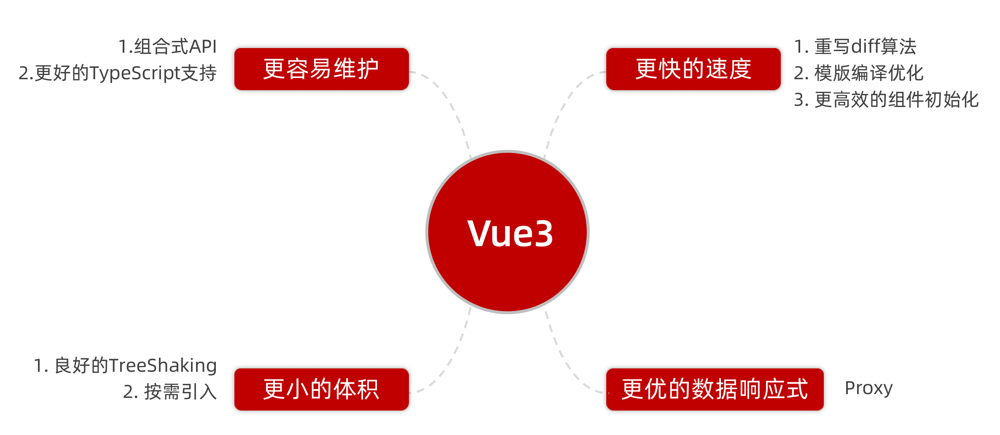
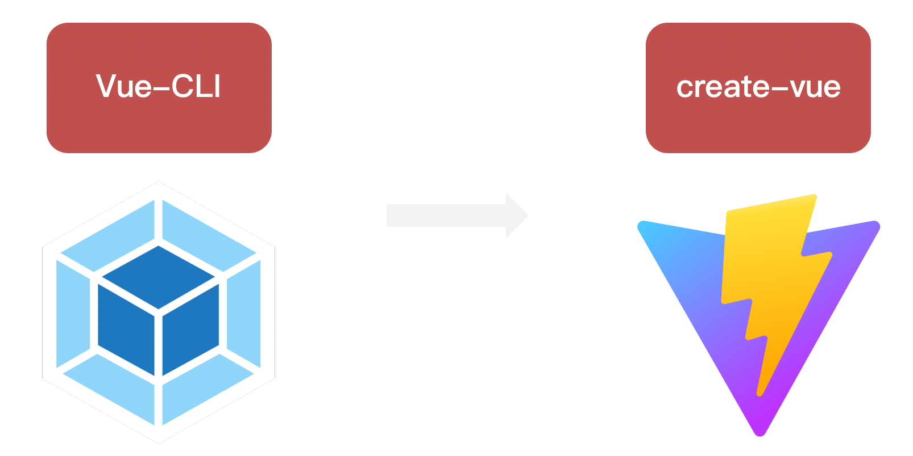
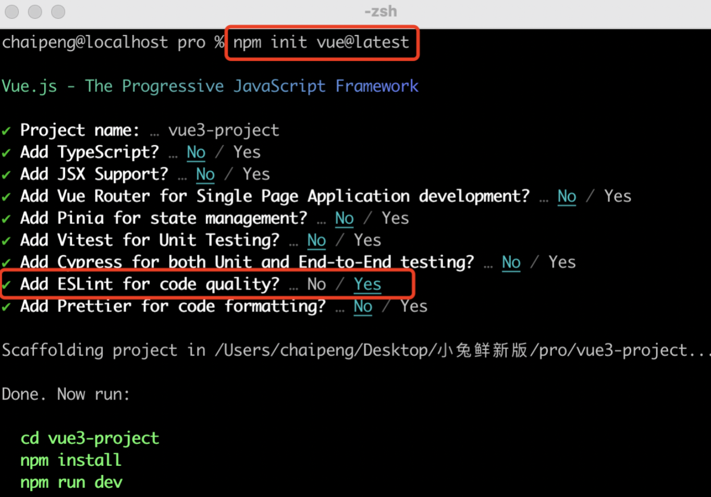
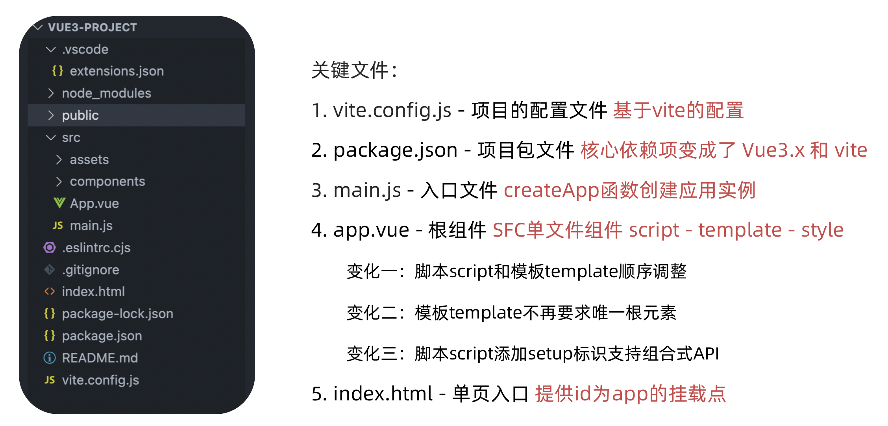

# Vue3
## 1. Vue3组合式API体验
```vue
<script>
// vue2 的代码
export default {
  data(){
    return {
      count:0
    }
  },
  methods:{
    addCount(){
      this.count++
    }
  }
}
</script>
```

```vue
<script setup>
// vue3 组合式api的实现
import { ref } from 'vue'
const count = ref(0)
const addCount = ()=> count.value++
</script>
```

特点：

1. 代码量变少
2. 分散式维护变成集中式维护
## 2. Vue3更多的优势



# 使用create-vue搭建Vue3项目

## 1. 认识create-vue
> create-vue是Vue官方新的脚手架工具，底层切换到了 vite （下一代前端工具链），为开发提供极速响应




## 2. 使用create-vue创建项目
> 前置条件 - 已安装16.0或更高版本的Node.js

执行如下命令，这一指令将会安装并执行 create-vue
```bash
npm init vue@latest
```




# 熟悉项目和关键文件



```js
// main.js 入口文件
import './assets/main.css'

// new Vue() 创建一个应用实例对象

import { createApp } from 'vue'
import App from './App.vue'

// 1. 以 App 作为参数生成一个应用实例对象
// 2. 挂载到id为app的节点上
createApp(App).mount('#app')
```


# setup选项

## 1. setup选项的写法和执行时机
写法
```vue
<script>
  export default {
    setup(){
      // setup 在 beforeCreate 钩子之前自动执行
    },
    beforeCreate(){
      
    }
  }
</script>
```
执行时机
> 在beforeCreate钩子之前执行


## 2. setup中写代码的特点
> 在setup函数中写的数据和方法需要在末尾以对象的方式return，才能给模版使用

```vue
<script>
export default {
  setup() {
     console.log('setup', this);  // this 指向 undefined, 没有 this 组件实例

     const message = 'this is message'

     const logMessage = () => console.log(message)

     // 必须 return 才能再模板中使用 (使用 setup 语法糖就不用导出)
     return { message, logMessage }
  },

  beforeCreate () {
    console.log('beforeCreate')
  }
}
</script>

<template>
  <div>{{ message }}</div>
</template>
```
## 3. **<script setup>**语法糖
> **script标签添加 setup标记，不需要再写导出语句，默认会添加导出语句**

```vue
<script setup>
  const message = 'this is message'
  const logMessage = ()=>{
    console.log(message)
  }
</script>
```


# reactive和ref函数

## 1. reactive
> 作用：接受**对象类型**数据的参数传入， 并返回一个响应式的对象
>
> reactive 函数，可以转换对象和数组为响应式数据
>
> vue3 实现响应式数据就是 proxy
>
> 通常定义：复杂类型的响应式数据
>
> 不能转换简单数据


```vue
<script setup>
 // 1. 导入 reactive 函数
 import { reactive } from 'vue'
    
 // 2. 执行函数 传入一个对象类型参数 变量接收
 const state = reactive({
   count: 0
 })
 
 const setCount = ()=>{
   // 修改数据更新视图
   state.count++
 }
 
</script>

<template>
     <div>{{ count }}<button @click="setCount"></button></div>
</template>
```

## 2. ref
> 接收简单类型或者对象类型的数据传入并，返回一个响应式的对象

```vue
<script setup>
 // 1. 导入 ref 函数
 import { ref } from 'vue'

 // 2. 执行函数 传入参数[简单类型 + 对象类型] 变量接收

 const count = ref(0)

 const setCount = () => {
  // 脚本区域修改 ref 产生的响应式对象数据  必须通过 .value 属性
  count.value++
 }
</script>

<template>
     <button @click="setCount">{{ count }}</button>
</template>
```
## 3. reactive 对比 ref

1. **都是用来生成响应式数据**
2. 不同点
   1. **reactive不能处理简单类型的数据**
   2. **ref参数类型支持更好，但是必须通过.value做访问修改**
   3. ref函数内部的实现依赖于reactive函数
3. 在实际工作中的推荐
   1. **推荐使用ref函数，减少记忆负担**
   2. 如果能确定数据是对象且字段名也确定，用 reactive


# computed

> 计算属性基本思想和Vue2保持一致，组合式API下的计算属性只是修改了API写法
>
> 使用 computed 函数，传入一个函数，函数返回计算好的数据。
>
> 最后setup函数返回一个对象，包含该计算属性的数据即可。
>
> 当需要依赖一个数据得到新的数据时使用计算属性

```vue
<script setup>
    
// 1. 导入 computed 函数
import {ref, computed } from 'vue'
    
// 原始数据
const list = ref([1,2,3,4,5,6,7,8])

// 2. 执行函数 return计算之后的值 变量接收
const filterList = computed(() => {
    // 做计算 根据一个数据计算得到一个新的数据
    return list.value.filter(item => item > 2)
})

setTimeout(() => {
    list.value.push(9,10)
},3000)

/*
   1. 计算属性中不应该有'副作用'    比如异步请求/修改dom
   2. 避免直接修改计算属性的值      计算属性应该是只读的
   
*/
</script>
```


# watch

> 侦听一个或者多个数据的变化，数据变化时执行回调函数
>
> 俩个额外参数 :     
>
> **immediate** 控制立刻执行
>
> **deep**   开启深度侦听

## 1. 侦听单个数据
```vue
<script setup>
    
// 1. 导入 watch
import {ref , watch} from 'vue'
const count = ref(0)
const setCount = () => {
  count.value++
}

// 2. 调用 watch 侦听变化
// ref对象不需要加 .value
watch(count,(newVal,oldVal) => {
   console.log('count变化了',newVal,oldVal)
})
    
</script>

<template>
   <dev><button @click="setCount">+{{ count }}</button></dev>
</template>
    
</script>
```
## 2. 侦听多个数据
> 侦听多个数据，第一个参数可以改写成数组的写法

```vue
<script setup>
  // 1. 导入 watch
import {ref , watch} from 'vue'
    
const count = ref(0)
const changeCount = () => {
  count.value++
}

const name = ref('cp')
const changeName = () => {
  name.value = 'pc'
}

// 2. 调用 watch 侦听变化
watch(
  [count,name],
  (
    [newCount,newName],
    [oldCount,oldName]
  ) => {
     console.log('count / name 变化了',[newCount,newName],[oldCount,oldName]);
})

</script>

<template>
   <dev><button @click="changeCount">{{ count }}</button></dev>
   <dev><button @click="changeName">{{ name }}</button></dev>
</template>
```
## 3. immediate
> 在侦听器创建时立即出发回调，响应式数据变化之后继续执行回调


```vue
<script setup>
    
  // 1. 导入watch
  import { ref, watch } from 'vue'
  const count = ref(0)
  
  // 2. 调用watch 侦听变化
  watch(count, (newValue, oldValue)=>{
     console.log('count变化了',newVal,oldVal)
  },{
    immediate: true
  })
    
</script>
```
## 4. deep
> 通过watch监听的ref对象默认是浅层侦听的，直接修改嵌套的对象属性不会触发回调执行，需要开启deep

```vue
<script setup>
    
  // 1. 导入watch
  import { ref, watch } from 'vue'  
  const state = ref({ count: 0 })
  // 2. 监听对象state
  watch(state, ()=>{
    console.log('数据变化了')
  }) 
  const changeStateByCount = ()=>{
    // 直接修改不会引发回调执行
    state.value.count++
  } 
</script>


<script setup>
    
  // 1. 导入watch
  import { ref, watch } from 'vue'
    
  const state = ref({ count: 0 })
  
  // 2. 监听对象state 并开启deep
  watch(state, ()=>{
    console.log('数据变化了')
  },{
      deep:true  // 如果开启了 deep, 不管层次嵌套有多深，都会做递归处理
  })
    
  const changeStateByCount = ()=>{
    // 此时修改可以触发回调
    state.value.count++
  }
  
</script>


<script setup>
    
  // 1. 导入watch
  import { ref, watch } from 'vue'
    
  const state = ref({ 
      name: 'xiaobai',
      age: 18
  })
  
   const changeName = ()=>{
    state.value.name = 'xiaohei'
  }
   
   const changeAge = () => {
       state.value.age = 20
   }
   // 精确侦听某个具体属性
   watch(
      () => state.value.age,   // 监听 age
      () => {
          console.log('age变化了')
      }
   )
    
 
  
</script>

```


# 生命周期函数

## 1. 选项式对比组合式

## 2. 生命周期函数基本使用
> 1. 导入生命周期函数
> 2. 执行生命周期函数，传入回调

```js
<scirpt setup>
    // 1. 引入函数
import { onMounted } from 'vue'

    // 2. 执行函数 传入回调
onMounted(()=>{
  // 自定义逻辑
  console.log('组件挂载完毕mounted执行了')
})
</script>
```
## 3. 执行多次
> 生命周期函数执行多次的时候，会按照顺序依次执行

```js
<scirpt setup>
    
import { onMounted } from 'vue'

// 生命周期是可以执行多次的，多次执行时传入的回调会在时机成熟时依次执行
onMounted(()=>{
  // 自定义逻辑
})

onMounted(()=>{
  // 自定义逻辑
})
</script>
```


#  父子通信

## 1. 父传子
> 基本思想
> 1. 父组件中给子组件绑定属性
> 2. 子组件内部通过props选项接收数据
>
> 注意：
>
> 1. 如果使用 defineProps 接收数据，这个数据只能在模板中渲染
> 2. 如果想要在 js 中页操作接收的数据，应接收返回值来使用。


## 2. 子传父
> 基本思想
> 1. 父组件中给子组件标签通过@绑定事件，父组件提供方法。
> 2. 子组件通过 defineEmit 获取 emit 函数（因为没有this）
> 3. 子组件通过 emit 触发事件，并且传递数据


# 模版引用

> 概念：通过 ref标识 获取真实的 dom对象或者组件实例对象

## 1. 基本使用
> 实现步骤：
> 1. 调用ref函数生成一个ref对象
> 2. 通过ref标识绑定ref对象到标签
> 3. 组件挂载完毕之后才能获取 onMounted(()=> {})


## 2. defineExpose
> 默认情况下在 <script setup>语法糖下组件内部的属性和方法是不开放给父组件访问的，可以通过defineExpose编译宏指定哪些属性和方法容许访问
> 说明：指定testMessage属性可以被访问到


# provide和inject

## 1. 作用和场景
> 顶层组件向任意的底层组件传递数据和方法，实现跨层组件通信


## 2. 跨层传递普通数据
> 实现步骤
> 1. 顶层组件通过 `provide` 函数提供数据
> 2. 底层组件通过 `inject` 函数获取数据


## 3. 跨层传递响应式数据
> 在调用provide函数时，第二个参数设置为ref对象


## 4. 跨层传递方法
> 顶层组件可以向底层组件传递方法，底层组件调用方法修改顶层组件的数据


# toRefs

> 掌握：在使用reactive创建的响应式数据被展开或解构的时候使用toRefs保持响应式
>
> - 解构响应式数据，踩坑
> - 使用 `toRefs` 处理响应式数据，爬坑
> - `toRefs` 函数的作用，与使用场景


```vue
<script setup>
import { reactive } from "vue";
const user = reactive({ name: "tom", age: 18 });
</script>

<template>
  <div>
    <p>姓名：{{ user.name }}</p>
    <p>年龄：{{ user.age }} <button @click="user.age++">一年又一年</button></p>
  </div>
</template>

```

- 使用响应式数据，踩坑

```vue
<script setup>
import { reactive } from "vue";
const { name, age } = reactive({ name: "tom", age: 18 });    // 丢失响应式
</script>

<template>
  <div>
    <p>姓名：{{ name }}</p>
    <!-- 响应式丢失 -->
    <p>年龄：{{ age }} <button @click="age++">一年又一年</button></p>
  </div>
</template>

```

- 使用 `toRefs` 处理响应式数据，爬坑

```js
import { reactive, toRefs } from "vue";

const user = reactive({ name: "tom", age: 18 });

const { name, age } = toRefs(user)

```

`toRefs` 函数的作用，与使用场景

- 作用：把对象中的每一个属性做一次包装成为响应式数据
- 响应式数据展开的时候使用，解构响应式数据的时候使用

**总结：**

- 当去解构和展开响应式数据对象使用 `toRefs` 保持响应式