本地仓库+注册登录

## git基础入门

> Git是一款免费、开源的**分布式** **版本控制系统** ，用于敏捷高效地处理任何或小或大的项目。

> Git 是 Linus Torvalds 为了帮助管理 Linux 内核开发而开发的一个开放源码的版本控制软件。

> 作用：**代码存档备份**（支持**多人协作开发**）

### git的安装

[下载地址](https://git-scm.com/download/win)

注意：

1. 不要安装在中文目录

2. 不要使用桌面管理软件

   

安装很简单，一直下一步即可。在任意的目录下右键，能看到菜单, 就表示安装成功了。


### git三个区

要对某个项目使用git进行管理，需要使用`git init`命令初始化git仓库
`git init`会在当前目录生成一个隐藏文件夹 **.git**  不要去修改这个文件夹下的任意东西。

git仓库会分成三个区

**工作区**：我们书写代码的地方，工作的目录就叫工作区。

**暂存区**：暂时存储的区域，在git中，代码无法直接从工作区提交到仓库区，而是需要先从工作区添加到暂存区，然后才能从暂存区提交到仓库区。暂存区的目的是避免误操作。

**本地仓库区**：将保存在暂存区域的内容永久转储到 Git 仓库中，生成版本号。生成版本号之后，就可以任何的回退到某一个具体的版本。


### git基本命令

#### git init

+ 作用：初始化git仓库，想要使用git对某个项目进行管理，需要`git init`进行初始化

```bash
# 初始化仓库， 在当前目录下生成一个隐藏文件夹.git
git init
```

#### git add

- 作用：将文件由 `工作区` 添加到 `暂存区`，在git中，文件无法直接从工作区直接添加到仓库区，必须先从工作区添加到暂存区，再从暂存区添加到仓库区。
- 命令：`git add 文件名/目录名`

```bash
# 将index.html添加到暂存区
git add index.html

# 将css目录下所有的文件添加到暂存区
git add css

# 将当前目录下所有的js文件添加到暂存区
git add *.js

# 添加当前目录下所有的文件
git add .
git add -A
git add --all
```

#### git commit

作用：将文件由 暂存区 添加到 仓库区，生成版本号

```bash
# 将文件从暂存区提交到仓库
git commit -m "提交说明"

# 如果是一个已经暂存过的文件，可以快速提交，如果是未追踪的文件，那么命令将不生效。
git commit -a -m '提交说明'

# 修改最近的一次提交说明， 如果提交说明不小心输错了，可以使用这个命令
git commit --amend -m "提交说明"
```

#### git config配置

如果是第一次提交，需要配置提交者信息，推荐和公司邮箱一致（可以用QQ邮箱）

```Bash
# git config  user.name 你的目标用户名
# git config  user.email 你的目标邮箱名

# 使用--global参数，配置全局的用户名和邮箱，只需要配置一次即可
git config  --global user.name jepson
git config  --global user.email jepsonpp@qq.com

# 查看配置信息
git config --list

# 取消配置
git config --unset --global user.name
git config --unset --global user.email 
```

#### git status

- 作用：查看文件的状态


- 命令：`git status` 
  - 红色：表示工作区中的文件需要提交
  - 绿色：表示暂存区中的文件需要提交
- 命令：`git stauts -s` 简化日志输出格式

#### git log

- 作用：查看提交日志
- `git log` 查看提交的日志
- `git log --oneline` 简洁的日志信息

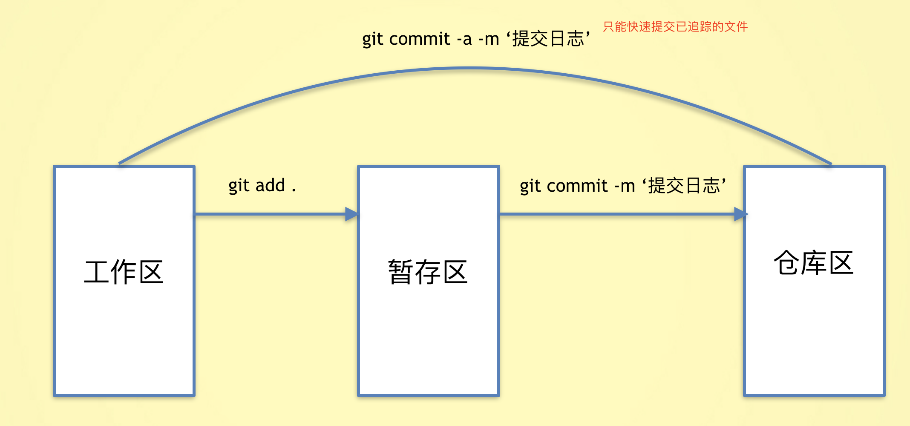


### git重置

#### git reset

- 作用：版本回退，将代码恢复到已经提交的某一个版本中。
- `git reset --hard 版本号` 将代码回退到某个指定的版本(版本号只要有前几位即可)
- `git reset --hard head~1`将版本回退到上一次提交
  - ~1:上一次提交
  - ~2:上上次提交
  - ~0:当前提交


- 当使用了`git reset`命令后，版本会回退，使用`git log`只能看到当前版本之前的信息。使用`git reflog`可以查看所有的版本信息

###  git忽视文件

> 在仓库中，有些文件是不想被git管理的，比如数据的配置密码、写代码的一些思路，node_modules等。git可以通过配置从而达到忽视掉一些文件，这样这些文件就可以不用提交了。

- 在仓库的根目录创建一个`.gitignore`的文件，文件名是固定的。
- 将不需要被git管理的文件路径添加到`.gitignore`中

```bash
# 忽视idea.txt文件
idea.txt

# 忽视css下的index.js文件
css/index.js

# 忽视css下的所有的js文件
css/*.js

# 忽视css文件夹
css
```

## git分支操作

分支就是科幻电影里面的平行宇宙，当你正在电脑前努力学习Git的时候，另一个你正在另一个平行宇宙里努力学习SVN。

如果两个平行宇宙互不干扰，那对现在的你也没啥影响。不过，在某个时间点，两个平行宇宙合并了，结果，你既学会了Git又学会了SVN！


### 为什么要有分支？

- 如果你要开发一个新的功能，需要2周时间，第一周你只能写50%代码，如果此时立即提交，代码没写完，不完整的代码会影响到别人无法工作。如果等代码写完再提交，代码很容易丢失，风险很大。
- 有了分支，你就可以创建一个属于自己的分支，别人看不到，也不影响别人，你在自己的分支上工作，提交到自己的分支上，等到功能开发完毕，一次性的合并到原来的分支。这样既安全，又不影响他人工作。                       

### git分支命令

> 可以保证功能开发的独立性。
>
> 在git中，分支实质上仅仅是一个**指针**，每次代码提交后，这个分支指针就会向后移动，保证一直指向最后一次提交的的版本。git中使用HEAD指向当前分支
>
> 注意：git 第一次提交时，就有一个**mster**的主分支(默认生成)，指向第一个提交版本。
>
> **master** 不参与过程开发

#### 创建分支

- `git branch 分支名称`创建分支，分支中的代码，在创建时与当前分支的内容完全相同。
- git在第一次提交时，就有了一个叫`master`的主分支。
- `git branch dev`，创建了一个叫做dev的分支

#### 查看分支

- `git branch`可以查看所有的分支，
- 在当前分支的前面会有一个`*`
- 在git中，有一个特殊指针`HEAD`,永远会指向当前分支

#### 切换分支

- `git checkout 分支名称`切换分支  HEAD指针指向了另一个分支
- 在当前分支的任何操作，都不会影响到其他的分支，除非进行了分支合并。
- 提交代码时，会生产版本号，当前分支会指向最新的版本号。

#### 创建并切换分支

- `git checkout -b 分支名称` 创建并切换分支
- 切换分支会做两件事情
  - 创建一个新分支
  - 把head指针指向当前的分支

#### 删除分支

- `git branch -d 分支名称` 可以删除分支
- 注意：不能在当前分支删除当前分支，需要切换到其他分支才能删除。
- 注意：`master`分支是可以删除的，但是不推荐那么做。

#### 合并分支

- 分支虽然能保证开发的独立性，但终究要合并代码。
- `git merge 分支名称` 将其他分支的内容合并到当前分支。
- 在`master`分支中执行`git merge dev` 将`dev`分支中的代码合并到`master`分支
- [分支合并](https://git-scm.com/book/zh/v1/Git-%E5%88%86%E6%94%AF-%E5%88%86%E6%94%AF%E7%9A%84%E6%96%B0%E5%BB%BA%E4%B8%8E%E5%90%88%E5%B9%B6)

### git合并冲突

- 对于同一个文件，如果有多个分支需要合并时，容易出现冲突。
- 合并分支时，如果出现冲突，只能手动处理，再次提交，一般的作法，把自己的代码放到冲突代码的后面即可。
- 工作中必然会遇到分支冲突！手动处理冲突，重新提交即可。
- CONFLICT


## 综合案例

### 接口地址

- **接口路径地址**：    http://ajax-api.itheima.net/

### 项目初始化

1. 基于模板，初始化仓库

```
git init
```

2. 提交到暂存区

```javascript
git add .

git commit -m '初始化仓库'
```

3. 创建develop分支

```
git checkout -b develop
```


### 注册功能

#### bootstrap轻提示 - 测试

官网地址：https://v5.bootcss.com/docs/components/toasts/

1. 准备结构,  必须有 `toast` 类

```jsx
<div id="box" class="toast">我是轻提示</div>
```

2. 引包 js 和 css

```jsx
<link rel="stylesheet" href="./bootstrap/bootstrap.min.css" />
<link rel="stylesheet" href="./bootstrap/bootstrap-icons.css" />
<script src="./bootstrap/bootstrap.min.js"></script>
```

3. 编写js代码实例化

```jsx
// bootstrap轻提示
const toastBox = document.querySelector('#box')
const toast = new bootstrap.Toast(toastBox, {
  animation: true, // 开启过渡动画
  autohide: true, // 开启自动隐藏
  delay: 3000 // 3000ms后自动隐藏
})

toast.show()
```

#### bootstrap轻提示 - 应用

1. 准备结构（已准备）
2. 引包（已引入）
3. 编写js代码

```jsx
// bootstrap轻提示 封装轻提示函数 tip 
const toastBox = document.querySelector('#myToast')
const toast = new bootstrap.Toast(toastBox, {
  animation: true, // 开启过渡动画
  autohide: true, // 开启自动隐藏
  delay: 3000 // 3000ms后自动隐藏
})
const tip = (msg) => {
  toastBox.querySelector('.toast-body').innerHTML = msg
  toast.show()
}


// === 测试代码 ===
tip('请输入用户名')
```


#### 表单数据收集 - 测试

文档地址：https://www.npmjs.com/package/form-serialize

1. 准备form表单, 表单元素需要添加 name

```html
<form id="form">
  <input type="text" name="username"> <br>
  <input type="password" name="password"> <br>
  <button>登录</button>
</form>
```

2. 引包

```jsx
<script src="./lib/form-serialize.js"></script>
```

3. 注册事件，收集表单信息

```jsx
const btn = document.querySelector('button')
const form = document.querySelector('#form')
btn.addEventListener('click', function(e) {
  e.preventDefault()
  console.log(serialize(form)) //键值对字符串格式
  console.log(serialize(form, { hash: true })) //js对象格式
})
```


#### 表单数据收集 - 应用

1. 准备form表单 (页面已准备)
2. 引包 （已引入）
2. 注册事件，收集表单信息

```jsx
document.querySelector('#btn-register').addEventListener('click', async () => {
  const data = serialize(document.querySelector('form'), { hash: true })
  console.log(data)
})
```


#### 注册逻辑实现

```javascript
//注册逻辑!!!!!!
        //1.配置基地址
        //2.注册点击事件，收集表单数据
        //3.非空校验，长度校验
        //4.ajax发送请求
        //5.处理响应
```

1. common.js 配置请求基地址

```jsx
axios.defaults.baseURL = 'http://ajax-api.itheima.net'
```

2. 非空检验后，请求注册，处理异常提示

```jsx
btnRegister.addEventListener('click', async function() {
  // 收集表单数据
  const data = serialize(form, { hash: true })
  
  // 非空校验，长度校验
  if (!data.username || data.username.trim() === '') return tip('用户名不能为空')
  if (!data.password || data.password.trim() === '') return tip('密码不能为空')
  if (data.password.length < 6) return tip('密码的长度不能小于 6 位')

  // 发送请求 await 只会等待成功的结果，如果要处理失败，需要try catch
  //try并不是只能捕获请求的错误，平时代码的错误也会被捕获到，需要在catch中打印错误，否则看不到错误
  //js是单线程的，一旦出错，会中断程序
  try {
    await axios.post('/register', data)
    tip('注册成功')
    
    setTimeout(() => {
      location.href = './login.html' // 注册成功跳转登录
    }, 500)
  } catch (e) {
    // console.dir(e)  //以对象的方式打印一些错误信息，默认错误信息只展示文本   //所有的错误信息，一律使用dir打印
    // 状态码409, 表示用户名已存在
    if (e.response.status === 409) {
      return tip(e.response.data.message)
    }
    tip('注册失败，服务器繁忙')
  }
})
```

**代码提交**

```
git add .

git commit -m '注册功能完成'
```


### 登录功能

登录的代码如下：

```jsx
document.querySelector('#btn-login').addEventListener('click', async function() {
  const data = serialize(document.querySelector('form'), { hash: true })
  // 非空校验
  if (!data.username || data.username.trim() === '') return tip('用户名不能为空')
  if (!data.password || data.password.trim() === '') return tip('密码不能为空')
  if (data.password.length < 6) return tip('密码的长度不能小于6位')

  try {
    await axios.post('/login', data)
    tip('登录成功')
    location.href = './index.html'
  }
  catch (e) {
    tip('用户名或者密码错误')
  }
})
```

**代码提交**

```
git add .

git commit -m '登录功能完成'
```


# 二：页面访问控制&远程仓库

## 页面访问权限控制

### 什么是jwt身份认证

> json web token

在前后端分离模式的开发中，服务器如何知道来访者的身份呢？

- 在登录后，服务器会响应给用户一个  令牌 （token）：包含身份信息的 字符串
- 令牌中会包括该用户的id等唯一标识
- 浏览器收到令牌后，自己保存
- 下次请求其他接口时，（在请求头中）携带这个令牌去请求
- 这样服务器就知道来访者的身份了，服务器就会为该用户开发接口的访问权限，并处理该用户的数据

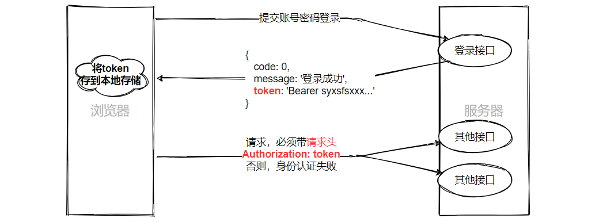

> 登录后：要将**token**保存到本地存储中了。顺带个人信息也存一下，用于回显。

```jsx
document.querySelector('#btn-login').addEventListener('click', async function() {
  const data = serialize(document.querySelector('form'), { hash: true })
  // 非空校验
  if (!data.username) return tip('请输入用户名')
  if (!data.password) return tip('请输入密码')
  if (data.password.length < 6) return tip('密码的长度不能小于6位')

  try {
    const res = await axios.post('/login', data)
    //console.log(res)
    //将个人信息 和 token令牌字符串，都存到本地
    localStorage.setItem('user-token', res.data.data.token)
    localStorage.setItem('user-name', res.data.data.username)
      
    tip('登录成功')
    location.href = './index.html'
  }
  catch (e) {
    tip('用户名或者密码错误')
  }
})
```

小结：

1. 什么是jwt？ 是一个基于 **token令牌** 的身份认证机制
2. 登录请求后，后台返回token，前端该如何操作？  将token存储与本地，下次请求时在请求头携带。
3. 未登录的用户可以直接访问首页吗？ 不可以
4. 如何判断有没有登录？ 判断是否有 token 令牌

### 页面访问拦截

> 核心思路：判断 token 是否存在

> 有token，允许访问，没有token，拦截到登录

浏览器端，可以通过合理使用令牌，控制页面的访问权限。

比如，用户默认只能访问登录页，如果不登录就不能访问首页，怎么做？


**登录拦截**：判断本地存储是否有token, 没有token拦截到登录

```html
<!-- 本地存储有token，则说明用户登录了；没有token，则说明用户没有登录，不允许访问首页 -->
 <!--一进来，结构都不管，先验证有没有令牌，有令牌才考虑渲染  写在index最上面-->
<script>
  if (localStorage.getItem('user-token') === null) location.href = './login.html'
</script>
```

> 注意：上述判断只能判断token有没有，但不能判断token的真假，所以将来需要发送Ajax请求，根据服务器响应结果再次判断

> 前端只能判断有没有token，无法界定真假后端是能知道真假的，所以将来我们请求后端后，需要对响应结果做判断 （后续会实现）

**代码提交**

```
git add .

git commit -m '页面访问拦截完成'
```


### 显示用户名称和退出登录

`common.js`

```js
// 显示用户名称和退出登录
const userName = document.querySelector('.navbar .font-weight-bold') //头像账号 Admin
const logout = document.querySelector('#logout')  //退出按钮

//登录页或注册页，没有个人信息的标签，无需展示名字
if (userName) {
  userName.innerHTML = localStorage.getItem('user-name')
}
if (logout) {
  logout.addEventListener('click', () => {
    localStorage.removeItem('user-token')
    localStorage.removeItem('user-name')
    location.href = './login.html'
  })
}
```


## axios 拦截器

### 请求接口 401 错误解决

在首页获取后台统计数据，发现401

```jsx
// DOMContentLoaded 当初始的 HTML 文档被完全加载和解析完成之后,DOMContentLoaded 事件被触发
// 而无需等待样式表、图像和子框架的完成加载
document.addEventListener('DOMContentLoaded', async () => {
    //保证dom内容是加载完了，不等待图片css资源的加载，性能高
  const res = await axios.get('/dashboard')
  console.log(res)
})

//load事件：等待我们的所有的结构以及样式表、图像和子框架的完成加载
//load事件 和 DOMContentLoaded事件 哪个执行的快？ DOMContentLoaded加载的快
```

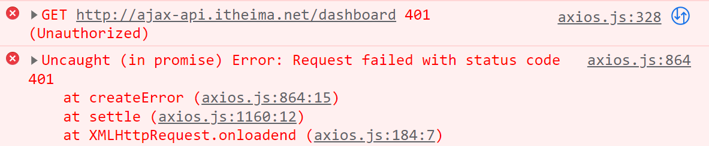

原因：

1. 后台 接口  需要进行身份认证，请求时，需要在请求头中携带 token
2. 未携带token，或token过期，后台都会返回**401**！！！

```jsx
document.addEventListener('DOMContentLoaded', async () => {
  const token = localStorage.getItem('user-token')
  const res = await axios.get('/dashboard', {
    //配置请求头,如果不携带请求头，后台返回的状态码是 401  身份认证失败（没token，token失效）
    headers: {
      'Authorization': token
    }
  })
  console.log(res);
})
```

但其他接口是否也需要携带token呢？每次都请求时手动携带？

### 请求拦截器

> axios请求拦截器：在所有axios请求 发送出去 之前，都会 先经过请求拦截器

> 应用场景：统一配置请求头令牌token。

> 请求拦截器 和 响应拦截器 直接从官网cv!  axios中文网 => 文档 => 拦截器

利用请求拦截器,  本地读取token， 设置给请求头

```jsx
// 添加请求拦截器
axios.interceptors.request.use(function (config) {
    
  // 在发送请求之前做些什么
    //如果有 token 的情况，应该将 token 携带在请求头中  （在拦截器中统一操作）
    //console.log('你要请求了么？没带token吧，我来帮你吧')
  const token = localStorage.getItem('user-token')
  if (token) {
      //如果有token，需要携带在请求头
        //console.log(config) //config就是请求
    config.headers.Authorization = token
  }
    
  return config;  //这里返回的是请求的配置项，不能删除！
}, function (error) {
  // 对请求错误做些什么
  return Promise.reject(error);
});

// 添加响应拦截器
axios.interceptors.response.use(function (response) {
  // 对响应数据做点什么
  return response;  ////response 就是响应的结果
}, function (error) {
  // 对响应错误做点什么
  return Promise.reject(error);
});
```

小结：

- 每个请求都要携带token，进行请求，如何操作？

​       利用请求拦截器，统一携带token

### 响应拦截器

> axios响应拦截器：在axios响应被.then/.catch处理之前，会先经过响应拦截器！

> 应用场景：1. 统一处理错误响应（比如：token过期、 服务器错误）      
>
> 2.  数据剥离 （去掉axios的默认一层data） 简化后台数据的访问层级

1. token时效两小时，修改本地token，发现401 （模拟token失效）
2. 处理401状态码， 清除本地信息，跳转登录
3. 分析数据层级，进行数据剥离

```jsx
// 添加响应拦截器
axios.interceptors.response.use(
  function (response) {
    // 对响应数据做点什么 
      //正常响应走上面
    return response.data  //.data去掉外面包的那一层 //剥离数据!!!!!!!!!!!!!数据剥离后，更新login逻辑
  },
  function (error) {
      
      //如果控制台报响应的错误，都是走错误响应 4xx 5xx
      //console.log(dir) //有错误一律使用dir 打印!!!
      // 对响应错误做点什么 //处理响应错误
    if (error.response.status === 401) {
       //token过期，需要将token信息移除，个人信息移除，拦截到登录，重新登陆
      localStorage.removeItem('user-token')
      localStorage.removeItem('user-name')
      location.href = './login.html'
    }
      
      
    return Promise.reject(error)
  }
)
```

4. 数据剥离后，更新login逻辑

```jsx
document.querySelector('#btn-login').addEventListener('click', async () => {
  ...
  try {
    const res = await axios.post('/login', data)
    console.log(res) //登录成功 少了最外面的一层
    localStorage.setItem('user-token', res.data.token)  //得去掉一个data
    localStorage.setItem('user-name', res.data.username)
    location.href = './index.html'
  } catch (e) {
    tip('用户名密码错误')
  }
})
```

**代码提交**

```
git add .

git commit -m 'axios拦截器添加完成'
```


## git远程仓库

> 远程仓库：托管在因特网或其他网络中，你的项目的版本库。支持多人协作，共同管理远程仓库。

> 解决了 1. 仓库备份（远程备份不易丢失）2.多人协作（远程仓库同步代码）

### github、gitee、gitlab

- git是一个版本控制工具。
- github是一个代码托管平台，开源社区，是git的一个远程代码仓库平台。

```javascript
//1. gitHub是一个面向开源及私有软件项目的托管平台，因为只支持git 作为唯一的版本库格式进行托管，故名gitHub。
//2. github免费，代码所有人都能看到，但是只有你自己能修改。付费的可以隐藏。
//3. 创建git项目时，不能有中文。
```

[github官网](https://github.com/)： 国外开源 git 代码托管平台     全球最大的开源项目托管平台 - 免费，国内访问受限，不稳定

[开源中国-git](https://git.oschina.net/):  国内开源 git 代码托管平台     码云，国产开源项目托管平台。免费，访问速度快、纯中文界面、使用友好

[gitlab](https://about.gitlab.com/)：企业级 git 代码托管平台      对代码私有性支持较好，企业用户多, 一般收费，允许自建 git 服务器


### 码云创建远程仓库

1. 新建右上角仓库

   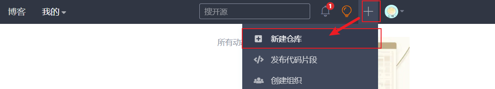

   

2. 输入仓库名  **不勾初始化！！！**

   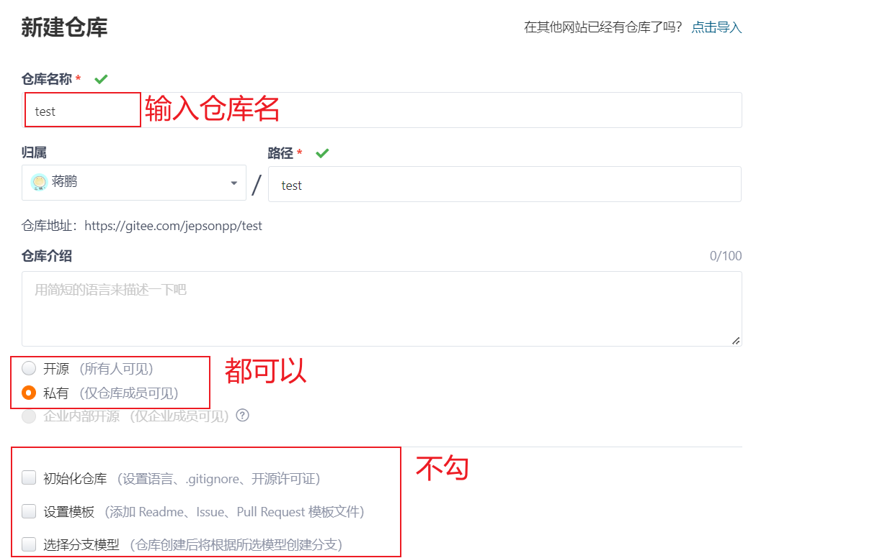


3. 点击创建

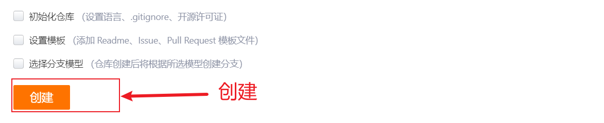


### SSH免密码登陆

git支持多种数据传输协议：

- https协议：`https://gitee.com/jepsonpp/test.git`  需要输入用户名和密码
- ssh协议：`git@gitee.com:jepsonpp/test.git`   需要配置密钥，可以免密码登录

注意：在实际公司开发中，ssh 的方式更为常见！更加安全可靠！

每次push或者pull代码，如果使用https协议，那么都需要输入用户名和密码进行身份的确认，非常麻烦。

- github为了账户的安全，需要对每一次push请求都要验证用户的身份，只有合法的用户才可以push
- 使用ssh协议，配置ssh免密码，可以做到免密码往github推送代码

ssh密钥得作用：

- ssh key 的**作用**：实现本地仓库和 gitee平台 之间免登录的加密数据传输。
- ssh key 由**两部分组成**，分别是： （本地生成公钥和私钥）
  1. id_rsa（私钥文件，存放于客户端的电脑中即可）  
  2. id_rsa.pub（公钥文件，需要配置到 gitee平台中）
- 私钥加密的信息，只能通过公钥解密。公钥加密的信息，只能通过私钥解密。安全性高。

### SSH免密码登录配置

-    1 .打开Git Bash ， 创建SSH Key：`ssh-keygen -t rsa`    （注意：这些命令需要在bash中敲）
- 2. 连续敲三次回车，在文件路径 `C:\用户\当前用户名\` 找到 `.ssh` 文件夹
- 3. 文件夹中有两个文件：

  - 私钥：`id_rsa`
  - 公钥：`id_rsa.pub`
- 4. 在 `码云-> 设置 -> SSH公钥`页面中
- 5. 粘贴 公钥 `id_rsa.pub` (用记事本打开)里面得文本内容到 对应文本框中， 添加公钥

  tips: mac获取公钥 https://juejin.cn/post/6844904169191522317

### github 生成ssh key

1. 打开 Git Bash
2. ssh-keygen - t rsa -b 4096 -C "your_email@example.com"
3. 连续敲击三次回车，可在  `C:\User\用户名文件夹\.ssh` 的目录生成密钥文件

### git push

- 作用：将本地仓库中代码提交到远程仓库
- `git push 仓库地址 分支名`   将代码提交到远程仓库对应分支
- 例子：`git push git@gitee.com:ccv-engineer/myfirst.git master` 

```
git push <远程主机名> <本地分支名>:<远程分支名>
如果本地分支名与远程分支名相同，则可以省略冒号
```


### git remote

每次push操作都需要带上远程仓库的地址，非常的麻烦，我们可以给仓库地址设置一个别名

```bash
# 给远程仓库设置一个别名
git remote add 仓库别名 仓库地址
git remote add origin git@gitee.com:ccv-engineer/myfirst.git

# 删除origin这个别名
git remote remove origin
```

演示命令：`git push -u 仓库别名 分支名`

tips：-u 可以记录push到远端分支的默认值，将来 git push 即可

首次需要加一次 -u ，后续好处是，设置了提交远程的默认值，将来只要 git push 即可


### git clone

- 作用：克隆远程仓库的代码到本地
- git clone [远程仓库地址]
- `git clone git@gitee.com:ccv-engineer/myfirst.git`会在本地新建一个`test`文件夹
- 在test中包含了一个`.git`目录，用于保存所有的版本记录，同时test文件中还有最新的代码，可以进行后续的开发。
- git克隆默认会使用远程仓库的项目名字，也可以自己指定。命令：`git clone [远程仓库地址] [本地项目名（文件夹名）]`

tips: `git branch -a`  查看分支


### git pull

- 作用：拉取更新，将远程的代码下载合并到本地的分支


- 通常在push前，需要先pull一次。（git push 之前一般先 git pull 一下）

```bash
# 获取远程仓库的更新，并且与本地的分支进行合并
git pull
git pull <远程主机名> <分支名>
git pull origin login  # 获取远程分支的更新，并更新合并到login分支
```


### 下载远端分支本地

`checkout` 的 `-t `(或) `--track `)选项仅在创建新的(本地)分支时使用

先在本地建立一个分支，并切换到该分支，然后从远程分支上同步代码到该分支上，并建立关联

```git
git checkout -t origin/develop     #远端分支名和本地新建分支名同名
```

**后续拉取该分支的更新，就是切换到该分支，git  pull  origin 分支名**

小技巧：这个命令不好记，可以利用vscode快速切换拉取


### git remote show

> 查看远程仓库所有的分支列表

```
git remote show 远程仓库名称
```

### 追踪分支

```js
//从远程仓库中，把对应的远程分支下载到本地仓库，保持本地分支和远程分支名相同
git checkout 远程分支的名称

//示例：git checkout pay

////从远程仓库中，把对应的远程分支下载到本地仓库，并把下载的本地分支进行重命名
git checkout -b 本地分支名称 远程仓库名称/远程分支名称
```

### 删除远程分支

```js
//删除远程仓库中，指定名称的远程分支
git push 远程仓库名称 --delete 远程分支名称

//示例
git push origin --delete login
```


## 综合练习

1. 将数据可视化项目上传到码云仓库,  主分支与开发分支均要上传

  注意：要推哪个分支，先切换到那个分支再推送。

```git
git push origin master

git checkout develop

git push origin develop
```

2. 删除本地项目，通过克隆把远端仓库项目拉取下来，切换到develop分支

```git
git clone 仓库地址

git checkout -t origin/develop
```


# Echarts数据可视化

>  借助图形手段, 清晰传达信息的表现方式
>
>  把枯燥的数字数据, 转换成图形, 数据特点更突出

## Echarts 入门

### Echarts-介绍

> ECharts，一个使用 JavaScript 实现的**开源可视化图表库**，可以流畅的运行在 PC 和移动设备上，兼容当前绝大部分浏览器（IE8/9/10/11，Chrome，Firefox，Safari等），底层依赖矢量图形库 [ZRender](https://github.com/ecomfe/zrender)，提供直观，交互丰富，可高度个性化定制的数据可视化图表。

大白话：

- 是一个JS插件
- 性能好可流畅运行PC与移动设备
- 兼容主流浏览器
- 提供很多常用图表，且可**定制**。

### Echarts-体验

官方教程：[快速上手ECharts](https://echarts.apache.org/handbook/zh/get-started/)

#### 使用步骤

- 下载echarts  https://echarts.apache.org/zh/download.html
- 引入echarts
- 准备一个具备大小（宽高）的 DOM

```html
<div id="main" style="width: 600px; height:400px;"></div>
```

- 初始化echart实例

```js
const myChart = echarts.init(document.querySelector('#main'))
```

- 指定图表的配置项和数据 (根据文档提供示例找到option)  CV

```js
// 指定图表的配置项和数据 CV
const option = {
  title: {
    text: 'ECharts 入门示例',
  },
  tooltip: {},
  legend: {
    data: ['销量'],
  },
  xAxis: {
    data: ['衬衫', '羊毛衫', '雪纺衫', '裤子', '高跟鞋', '袜子'],
  },
  yAxis: {},
  series: [
    {
      name: '销量',
      type: 'bar',
      data: [5, 20, 36, 10, 10, 20],
    },
  ],
}
```

- 使用刚指定的配置项和数据显示图表

```js
myChart.setOption(option)
```

使用步骤：

```html
      <!-- 1.具备宽高的容器 -->
    <div id="main" style="width:600px; height:400px"></div>
    <script src="./lib/echarts.min.js"></script>   

    <script>
        //2.初始化 echarts 实例
        const myChart = echarts.init(document.querySelector('#main'))

        //准备配置项 option  CV
        const option = {
                title: {
                    text: 'ECharts 入门示例',
                },
                tooltip: {},
                legend: {
                    data: ['销量'],
                },
                xAxis: {
                    data: ['衬衫', '羊毛衫', '雪纺衫', '裤子', '高跟鞋', '袜子'],
                },
                yAxis: {},
                series: [{
                    name: '销量',
                    type: 'bar',
                    data: [5, 20, 36, 10, 10, 20],
                }, ],
            }
            //3.基于配置项，渲染图表
        myChart.setOption(option)
    </script>
```


#### 示例配置项&文档查看方式

上节我们绘制了一个简单的柱状图图表，本节教大家如何通过文档中查看**配置项option**的一些说明

讲解内容:  通过文档找到刚刚完成的柱状图配置项对应的一些配置的说明

```js
// 指定图表的配置项和数据
const option = {
    title: {  // 标题组件
        text: 'ECharts 入门示例', // 主标题文本
    },
    tooltip: {}, // 提示框组件
    legend: {  // 图例组件
        data: ['销量2']  // 图例的数据数组,对应series里的name
    },
    xAxis: { // 直角坐标系 grid 中的 x 轴
        data: ["衬衫", "羊毛衫", "雪纺衫", "裤子", "高跟鞋", "袜子"]
    },
    yAxis: { // 直角坐标系 grid 中的 y 轴, y轴里的data没有指定会自动从series.data里获取
    },
    series: [{
        name: '销量2', // 系列名称，用于tooltip的显示，legend 的图例筛选
        type: 'bar',  // 柱状图
        data: [5, 20, 36, 10, 10, 20] // 系列中的数据内容数组。数组项通常为具体的数据项
    }]
};
```


#### 基本配置项

- series：系列列表（图标的数据项）。每个系列通过 `type` 决定（bar：柱状图，line：折线图，pie：饼图）自己的图表类型
- xAxis：直角坐标系 grid 中的 x 轴数据  type：category：离散型刻度
- yAxis：直角坐标系 grid 中的 y 轴数据   type：value ：值类型刻度
- grid：直角坐标系内绘图网格。   containLabel: true 绘图网格，是否包含刻度
- title：标题组件 
  1. text：主标题文本
  2. textStyle: 文字样式   color  fontSize
- tooltip：提示框组件 (鼠标划上去的提示)  trigger:提示触发显示的方式
- legend：图例组件   data中的数据标识，必须和下面的数据项series 的 name对应
- color：调色盘颜色列表
- toolbox：工具盒子  feature：{  saveAsImage：{} //是否保存图片 }


## 数据看板

### 展示概览

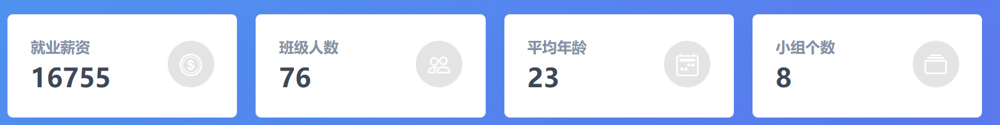

`js/index.js`

```js
//基本思路：
//1. 分析数据
//2. 遍历数据
//3. 获取元素，设置内容
document.addEventListener('DOMContentLoaded', async () => {
  const { data } = await axios.get('/dashboard')
  console.log(data)  //服务器响应回来的数据
    //console.log(data.overview) 数组 装的数据  // {salary: 16453, student_count: 80, age: 24, group_count: 8}
    //遍历overview 的数据，来渲染
  for (const key in data.overview) {
      //key 键
      //data.overview[key] 值
    document.querySelector(`[name=${key}]`).innerHTML = data.overview[key]
  }
})
```


### 薪资走势

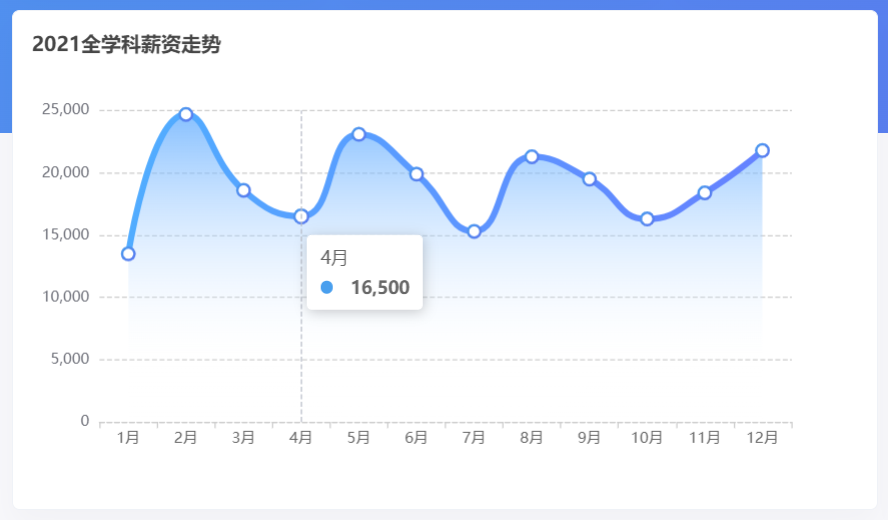

基本步骤：

1. 官网找到相似案例
2. 按照需求定制图表

相似案例：https://echarts.apache.org/examples/zh/editor.html?c=line-smooth

图表基本初始化：

```jsx
document.addEventListener('DOMContentLoaded', async () => {
  ...
  
  //调用函数 2021全学科薪资走势
  initYearChart()
})

//封装一个 渲染2021全学科薪资走势
const initYearChart = () => {
  // 1.基于准备好的dom，初始化echarts实例
  const myChart = echarts.init(document.querySelector('#line'))

  // 2.指定图表的配置项和数据
  const option = {
    xAxis: {
      type: 'category',
      data: ['Mon', 'Tue', 'Wed', 'Thu', 'Fri', 'Sat', 'Sun'],
    },
    yAxis: {
      type: 'value',
    },
    series: [
      {
        data: [820, 932, 901, 934, 1290, 1330, 1320],
        type: 'line',
        smooth: true,
      },
    ],
  }

  // 3.使用刚指定的配置项和数据显示图表。
  myChart.setOption(option)
}
```

按照需求定制：

完整代码：

- 基于数据，动态渲染，修改配色

```jsx
document.addEventListener('DOMContentLoaded', async () => {
  ...
  //2021全学科薪资走势
  initYearChart(data.year) //调用函数，把数据传输给形参
})


//封装一个函数
//渲染2021全学科薪资走势
function initYearChart(year) { //接收数据
    //初始化 echarts 实例
    const myChart = echarts.init(document.querySelector('#line'))
        //准备配置项
    const option = {
        //标题组件
        title: {
            show: true, //标题是否显示
            text: '2021全学科薪资走势', //标题文本
            textStyle: {
                fontSize: 16 //字体大小
            },
            left: 10, //距离左侧距离
            top: 15 //距离顶部距离
        },
        //x轴
        xAxis: {
            type: 'category',
            //数组需要的格式 ['1月','2月','3月',.....]
            //map会遍历数组，item就是数组的每一项
            //map会将遍历时每次 return 的值收集到一个新数组中，并返回
            data: year.map((item) => item.month),
            axisLine: {
                show: true, //显示x轴轴线
                lineStyle: {
                    color: '#ccc', //轴线颜色
                    type: 'dashed' //虚线
                }
            },
            axisLabel: { //x轴刻度
                show: true,
                color: '#666'
            }
        },
        //y轴
        yAxis: {
            type: 'value',
            //分割线配置
            splitNumber: 5,
            splitLine: {
                show: true,
                //分割线的样式
                lineStyle: {
                    //color: ['pink', 'skyblue', 'orange'], //线的颜色
                    color: '#ccc', //线的颜色
                    type: 'dashed' //虚线
                }
            }
        },
        //提示框组件
        tooltip: {
            trigger: 'axis'
        },
        //绘图网格
        grid: {
            left: '10%',
            top: '15%'
        },
        color: [{
            type: 'linear',
            x: 0,
            y: 0,
            x2: 1,
            y2: 1,
            colorStops: [{
                offset: 0,
                color: '#499dee' // 0% 处的颜色
            }, {
                offset: 1,
                color: '#5b78ef' // 100% 处的颜色
            }],
            global: false // 缺省为 false  如果配置成 true，则xy表示具体的坐标
        }],
        series: [{
            data: year.map(item => item.salary),
            type: 'line',
            //symbol: 'pin', //标记的形状图形
            symbolSize: 10, //标记图形的大小
            lineStyle: {
                width: 3
            },
            smooth: true, //是否平滑过渡
            areaStyle: { //阴影
                color: { // 线性渐变，前四个参数分别是 x0, y0, x2, y2, 范围从 0 - 1，相当于在图形包围盒中的百分比，如果                                globalCoord 为 `true`，则该四个值是绝对的像素位置
                    type: 'linear',
                    x: 0,
                    y: 0,
                    x2: 0,
                    y2: 1,
                    colorStops: [{
                        offset: 0,
                        color: 'rgba(146, 190, 244)' // 0% 处的颜色
                    }, {
                        offset: 1,
                        color: 'rgba(255,255,255,0.1)' // 80% 处的颜色
                    }],
                    global: false // 缺省为 false
                }
            }
        }]
    };
    //基于配置项渲染图标
    myChart.setOption(option)
}
```


### 薪资分布

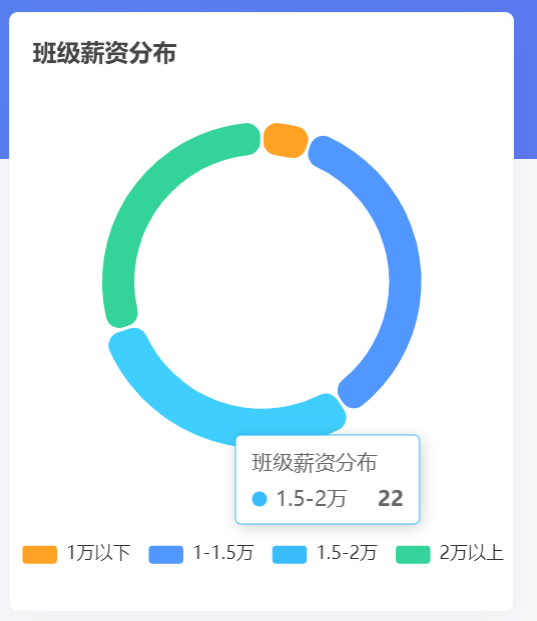

基本步骤：

1. 官网找到相似案例
2. 按照需求定制图表

相似案例：https://echarts.apache.org/examples/zh/editor.html?c=pie-borderRadius

基本初始化：

```jsx
document.addEventListener('DOMContentLoaded', async () => {
  ...
  // 班级薪资分布图
  initSalaryChart(data.salaryData)  //调用函数，传入数据给形参
})

const initSalaryChart = (salaryData) => {
  // 基于准备好的dom，初始化echarts实例
  const myChart = echarts.init(document.querySelector('#salary'))

  const option = {
    tooltip: {
      trigger: 'item',
    },
    legend: {
      top: '5%',
      left: 'center',
    },
    series: [
      {
        name: 'Access From',
        type: 'pie',
        radius: ['40%', '70%'],
        avoidLabelOverlap: false,
        itemStyle: {
          borderRadius: 10,
          borderColor: '#fff',
          borderWidth: 2,
        },
        label: {
          show: false,
          position: 'center',
        },
        emphasis: {
          label: {
            show: true,
            fontSize: '40',
            fontWeight: 'bold',
          },
        },
        labelLine: {
          show: false,
        },
        data: [
          { value: 1048, name: 'Search Engine' },
          { value: 735, name: 'Direct' },
          { value: 580, name: 'Email' },
          { value: 484, name: 'Union Ads' },
          { value: 300, name: 'Video Ads' },
        ],
      },
    ],
  }

  // 使用刚指定的配置项和数据显示图表。
  myChart.setOption(option)
}
```


完整代码：

- 基于数据，动态渲染

```jsx
document.addEventListener('DOMContentLoaded', async () => {
  ...
  
  // 班级薪资分布图
  initSalaryChart(data.salaryData)   //调用函数，传入数据给形参
})

const initSalaryChart = (salaryData) => {
  //console.log(salaryData)
  // 基于准备好的dom，初始化echarts实例
 const myChart = echarts.init(document.querySelector('#salary'))

  //准备配置项
    const option = {
        title: { //标题
            text: '班级薪资分布',
            top: 15,
            left: 10,
            textStyle: {
                fontSize: 16
            }
        },
        //提示框
        tooltip: {
            trigger: 'item'
        },
        //图例
        legend: {
            bottom: '6%', //居底
            left: 'center' //水平居中
        },
        //调色盘，修改配色  饼图从时钟12点位置，开始配色
        color: ['#fda224', '#5097ff', '#39bbf9', '#34d39a'],
        //数据项
        series: [{
            name: '班级薪资分布', //鼠标悬停的标识名
            type: 'pie', //饼图的类型
            center: ['50%', '45%'], //圆心坐标
            radius: ['50%', '65%'], //内圆半径和外圆半径
            //每一项的样式
            itemStyle: {
                borderRadius: 50, //圆角
                borderColor: '#fff',
                borderWidth: 4
            },
            label: {
                show: false, //文字说明，默认不显示
                position: 'center' //所有的文字中间显示
            },
            //控制样式效果
            emphasis: {
                label: {
                    show: true,
                    fontSize: 20,
                    fontWeight: 'bold',
                    color: 'pink'
                }
            },
            labelLine: { //文字和item之间的线
                show: false
            },
            /* data: [
                { value: 200, name: '1万以下' },
                { value: 735, name: '1-1.5万' },
                { value: 300, name: '1.5-2万' },
                { value: 500, name: '2万以上' }
            ] */
            data: salaryData.map(item => {
                return {
                    name: item.label,
                    value: item.g_count + item.b_count
                }
            })
        }]
    };
    //基于配置项渲染图标
    myChart.setOption(option)
}
```


### 每组薪资（期望&实际）

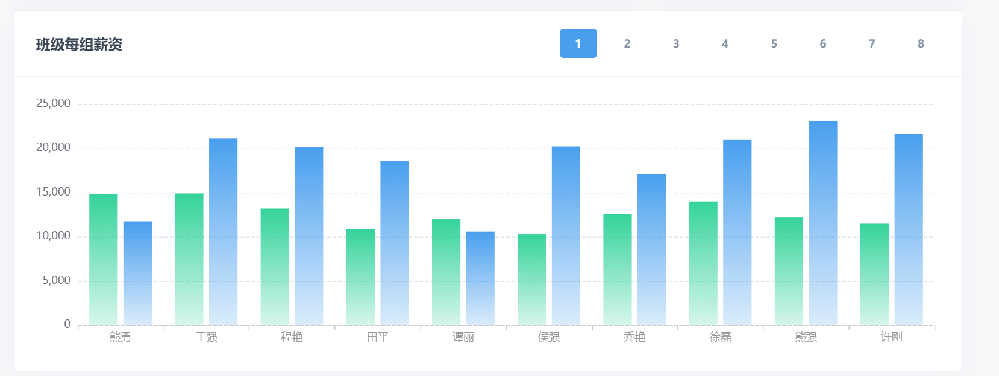

基本步骤：

1. 官网找到相似案例
2. 按照需求定制图表

相似案例：https://echarts.apache.org/examples/zh/editor.html?c=bar-simple

```jsx
document.addEventListener('DOMContentLoaded', async () => {
  ...
  initGroupChart(data.groupData)
})

const initGroupChart = (groupData) => {
  // 基于准备好的dom，初始化echarts实例
  const myChart = echarts.init(document.getElementById('lines'))

  const option = {
    xAxis: {
      type: 'category',
      data: ['Mon', 'Tue', 'Wed', 'Thu', 'Fri', 'Sat', 'Sun']
    },
    yAxis: {
      type: 'value'
    },
    series: [
      {
        data: [120, 200, 150, 80, 70, 110, 130],
        type: 'bar'
      }
    ]
  };

  // 使用刚指定的配置项和数据显示图表。
  myChart.setOption(option)
}
```


数据动态渲染，完整代码：

```jsx
const initGroupChart = (groupData) => {
  // 基于准备好的dom，初始化echarts实例
  const myChart = echarts.init(document.getElementById('lines'))

      //初始化 echarts 实例
    const myChart = echarts.init(document.querySelector('#lines'))
        //准备配置项
    const option = {
        grid: {
            left: 70,
            top: 30,
            right: 30,
            bottom: 50
        },
        xAxis: {
            type: 'category',
            data: groupData[1].map(item => item.name),
            axisLine: {
                show: true, //显示x轴轴线
                lineStyle: {
                    color: '#ccc', //轴线颜色
                    type: 'dashed' //虚线
                }
            },
            axisLabel: { //x轴刻度
                show: true,
                color: '#666'
            }
        },
        yAxis: {
            type: 'value',
            //分割线配置
            splitNumber: 5,
            splitLine: {
                show: true,
                //分割线的样式
                lineStyle: {
                    //color: ['pink', 'skyblue', 'orange'], //线的颜色
                    color: '#ccc', //线的颜色
                    type: 'dashed' //虚线
                }
            }
        },
        color: [{ // 线性渐变，前四个参数分别是 x0, y0, x2, y2, 范围从 0 - 1，相当于在图形包围盒中的百分比，如果 globalCoord 为 `true`，则该四个值是绝对的像素位置
            type: 'linear',
            x: 0,
            y: 0,
            x2: 0,
            y2: 1,
            colorStops: [{
                offset: 0,
                color: 'rgba(61, 213, 158, 1)' // 0% 处的颜色
            }, {
                offset: 1,
                color: 'rgba(204, 244, 229,0.6)' // 100% 处的颜色
            }],
            global: false // 缺省为 false
        }, {
            type: 'linear',
            x: 0,
            y: 0,
            x2: 0,
            y2: 1,
            colorStops: [{
                offset: 0,
                color: 'rgba(80, 162, 238, 1)' // 0% 处的颜色
            }, {
                offset: 1,
                color: 'rgba(205, 228, 250,0.6)' // 100% 处的颜色
            }],
            global: false // 缺省为 false
        }],
        tooltip: {
            trigger: 'item'
        },
        series: [{
                name: '期望薪资',
                data: groupData[1].map(item => item.hope_salary),
                type: 'bar'
            },
            {
                name: '实际薪资',
                data: groupData[1].map(item => item.salary),
                type: 'bar'
            }
        ]
    };
    //基于配置项渲染图标
    myChart.setOption(option)
    
    //每一组的薪资 点击切换功能写在这里 
}
```

小组切换展示：

```jsx
//点击切换 tab栏切换 
 //步骤：   //1.利用事件委托，给按钮绑定点击事件
           //2.先找到有btn-blue 类的盒子去掉类，再给当前点击的盒子加上 btn-blue 类
    const btns = document.querySelector('#btns')

    btns.addEventListener('click', function(e) {
        //console.log(e.target)
        if (e.target.tagName === 'BUTTON') {
            //找到有 btn-blue 类的盒子，干掉他（消灭别人）
            btns.querySelector('.btn-blue').classList.remove('btn-blue')
                //给自己加上
            e.target.classList.add('btn-blue')

            //获取组号
            const group = e.target.innerHTML
                //console.log(group) //拿到当前点击的组号
                //1.修改option 配置项（修改三个配置项）
            option.xAxis.data = groupData[group].map(item => item.name)
            option.series[0].data = groupData[group].map(item => item.hope_salary)
            option.series[1].data = groupData[group].map(item => item.salary)
                //2.重新setOption
            myChart.setOption(option)
        }
    })

```


### 男女薪资分布

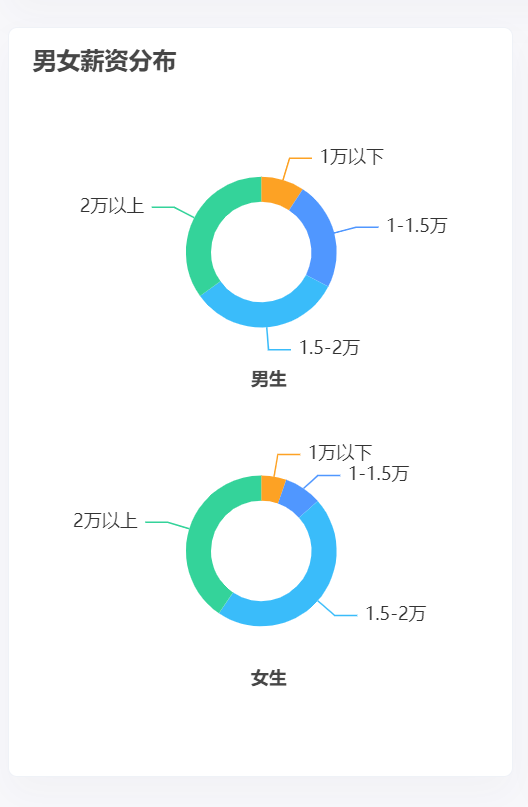

基本步骤：

1. 官网找到相似案例
2. 按照需求定制图表

相似案例：https://echarts.apache.org/examples/zh/editor.html?c=pie-simple

```jsx
document.addEventListener('DOMContentLoaded', async () => {
  ...
  initSalaryPieChart(data.salaryData)
})

const initSalaryPieChart = (salaryData) => {
  const myEchart = echarts.init(document.querySelector('#gender'))

  const option = {
    title: {
      text: 'Referer of a Website',
      subtext: 'Fake Data',
      left: 'center'
    },
    tooltip: {
      trigger: 'item'
    },
    legend: {
      orient: 'vertical',
      left: 'left'
    },
    series: [
      {
        name: 'Access From',
        type: 'pie',
        radius: '50%',
        data: [
          { value: 1048, name: 'Search Engine' },
          { value: 735, name: 'Direct' },
          { value: 580, name: 'Email' },
          { value: 484, name: 'Union Ads' },
          { value: 300, name: 'Video Ads' }
        ],
        emphasis: {
          itemStyle: {
            shadowBlur: 10,
            shadowOffsetX: 0,
            shadowColor: 'rgba(0, 0, 0, 0.5)'
          }
        }
      }
    ]
  }

  myEchart.setOption(option)
}
```


修改数据后，完整代码：

```jsx
document.addEventListener('DOMContentLoaded', async () => {
  ...
  
  //渲染男女薪资分布
  initSalaryPieChart(data.salaryData)
})


//渲染男女薪资分布
function initGenderChart(salaryData) {
    //初始化 echarts 实例
    const myChart = echarts.init(document.querySelector('#gender'))
        //准备配置项
    const option = {
        //大标题
        title: [{  //多个标题！！！
                text: '男女薪资分布',
                left: 10,
                top: 20,
                textStyle: {
                    fontSize: 16
                }
            },
            {
                text: '男生',
                left: 'center',
                top: '48%',
                textStyle: {
                    fontSize: 12
                }
            },
            {
                text: '女生',
                left: 'center',
                top: '88%',
                textStyle: {
                    fontSize: 12
                }
            }
        ],
        //提示框
        tooltip: {
            trigger: 'item'
        },
        //调色器
        color: ['#fda224', '#5097ff', '#3abcfa', '#34d39a'],
        //数据项
        series: [{ //准备两个饼图
                name: '男生',
                type: 'pie',
                radius: ['20%', '30%'],
                center: ['50%', '30%'],
                /*  data: [
                     { value: 1048, name: 'Search Engine' },
                     { value: 735, name: 'Direct' },
                     { value: 580, name: 'Email' },
                     { value: 300, name: 'Video Ads' }
                 ] */
            //渲染数据
                data: salaryData.map(item => {
                    return {
                        value: item.b_count,
                        name: item.label
                    }
                }),
                //高亮
                emphasis: {
                    itemStyle: {
                        shadowBlur: 10,
                        shadowOffsetX: 0,
                        shadowColor: 'rgba(0, 0, 0, 0.5)'
                    }
                }
            },
            {
                name: '男生',
                type: 'pie',
                radius: ['20%', '30%'],
                center: ['50%', '70%'],
                //渲染数据
                data: salaryData.map(item => {
                    return {
                        value: item.g_count,
                        name: item.label
                    }
                }),
                //高亮
                emphasis: {
                    itemStyle: {
                        shadowBlur: 10,
                        shadowOffsetX: 0,
                        shadowColor: 'rgba(0, 0, 0, 0.5)'
                    }
                }
            }
        ]
    };

    //基于配置项渲染图标
    myChart.setOption(option)
}
```


### 籍贯分布

echarts社区：https://www.makeapie.cn/echarts

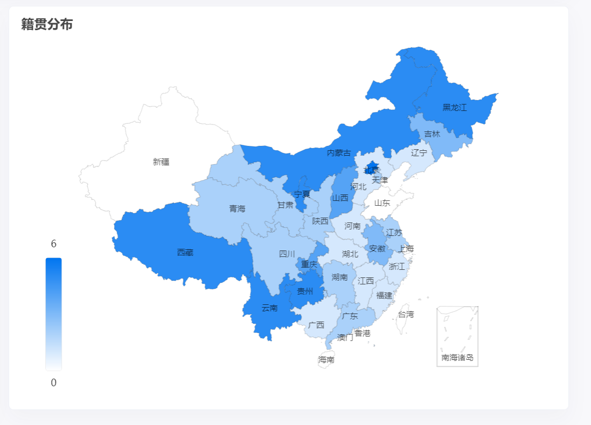

社区模板代码地址：https://www.makeapie.cn/echarts_content/xr1W9m5LOG.html

注意：直接 CV 下面的即可

```jsx
const initMapChart = (provinceData) => {
  const myEchart = echarts.init(document.querySelector('#map'))
  const dataList = [
    { name: '南海诸岛', value: 0 },
    { name: '北京', value: 0 },
    { name: '天津', value: 0 },
    { name: '上海', value: 0 },
    { name: '重庆', value: 0 },
    { name: '河北', value: 0 },
    { name: '河南', value: 0 },
    { name: '云南', value: 0 },
    { name: '辽宁', value: 0 },
    { name: '黑龙江', value: 0 },
    { name: '湖南', value: 0 },
    { name: '安徽', value: 0 },
    { name: '山东', value: 0 },
    { name: '新疆', value: 0 },
    { name: '江苏', value: 0 },
    { name: '浙江', value: 0 },
    { name: '江西', value: 0 },
    { name: '湖北', value: 0 },
    { name: '广西', value: 0 },
    { name: '甘肃', value: 0 },
    { name: '山西', value: 0 },
    { name: '内蒙古', value: 0 },
    { name: '陕西', value: 0 },
    { name: '吉林', value: 0 },
    { name: '福建', value: 0 },
    { name: '贵州', value: 0 },
    { name: '广东', value: 0 },
    { name: '青海', value: 0 },
    { name: '西藏', value: 0 },
    { name: '四川', value: 0 },
    { name: '宁夏', value: 0 },
    { name: '海南', value: 0 },
    { name: '台湾', value: 0 },
    { name: '香港', value: 0 },
    { name: '澳门', value: 0 },
  ]
  let option = {
    title: {
      text: '籍贯分布',
      top: 10,
      left: 10,
      textStyle: {
        fontSize: 16,
      },
    },
    tooltip: {
      trigger: 'item',
      formatter: '{b}: {c} 位学员',
      borderColor: 'transparent',
      backgroundColor: 'rgba(0,0,0,0.5)',
      textStyle: {
        color: '#fff',
      },
    },
    visualMap: {
      min: 0,
      max: 6,
      left: 'left',
      bottom: '20',
      text: ['6', '0'],
      inRange: {
        color: ['#ffffff', '#0075F0'],
      },
      show: true,
      left: 40,
    },
    geo: {
      map: 'china',
      roam: false,
      zoom: 1.0,
      label: {
        normal: {
          show: true,
          fontSize: '10',
          color: 'rgba(0,0,0,0.7)',
        },
      },
      itemStyle: {
        normal: {
          borderColor: 'rgba(0, 0, 0, 0.2)',
          color: '#e0ffff',
        },
        emphasis: {
          areaColor: '#34D39A',
          shadowOffsetX: 0,
          shadowOffsetY: 0,
          shadowBlur: 20,
          borderWidth: 0,
          shadowColor: 'rgba(0, 0, 0, 0.5)',
        },
      },
    },
    series: [
      {
        name: '籍贯分布',
        type: 'map',
        geoIndex: 0,
        data: dataList,
      },
    ],
  }
  myEchart.setOption(option)
}

```

动态设置数据后，完整代码：

```jsx
document.addEventListener('DOMContentLoaded', async () => {
  ...
  
  //渲染地图
  initMapChart(data.provinceData)
})

//渲染地图
const initMapChart = (provinceData) => {
    const myEchart = echarts.init(document.querySelector('#map'))
        //console.log(provinceData)
        //默认数据项
    const dataList = [
            { name: '南海诸岛', value: 0 },
            { name: '北京', value: 0 },
            { name: '天津', value: 0 },
            { name: '上海', value: 0 },
            { name: '重庆', value: 0 },
            { name: '河北', value: 0 },
            { name: '河南', value: 0 },
            { name: '云南', value: 0 },
            { name: '辽宁', value: 0 },
            { name: '黑龙江', value: 0 },
            { name: '湖南', value: 0 },
            { name: '安徽', value: 0 },
            { name: '山东', value: 0 },
            { name: '新疆', value: 0 },
            { name: '江苏', value: 0 },
            { name: '浙江', value: 0 },
            { name: '江西', value: 0 },
            { name: '湖北', value: 0 },
            { name: '广西', value: 0 },
            { name: '甘肃', value: 0 },
            { name: '山西', value: 0 },
            { name: '内蒙古', value: 0 },
            { name: '陕西', value: 0 },
            { name: '吉林', value: 0 },
            { name: '福建', value: 0 },
            { name: '贵州', value: 0 },
            { name: '广东', value: 0 },
            { name: '青海', value: 0 },
            { name: '西藏', value: 0 },
            { name: '四川', value: 0 },
            { name: '宁夏', value: 0 },
            { name: '海南', value: 0 },
            { name: '台湾', value: 0 },
            { name: '香港', value: 0 },
            { name: '澳门', value: 0 },
        ]
        //provinceData 后台返回的数据项，需要将后台返回的数据项，匹配设置给默认的数据项
        //遍历 dataList, 依次在后台返回的数据中找，看有没有相同 name的项，如果有，更新一下value
    dataList.forEach(item => {
        //尝试拿 item.name 去 provinceData数组中找对应项
        const obj = provinceData.find(v => {
                return v.name.replace(/省|回族自治区|吾尔自治区|壮族自治区|特别行政区|自治区/g, '') === item.name
            })
            //找到了，说明有这个省份的同学，更新
        if (obj) {
            item.value = obj.value
        }
    })


    let option = {
        title: {
            text: '籍贯分布',
            top: 20,
            left: 10,
            textStyle: {
                fontSize: 16,
            },
        },
        tooltip: {
            trigger: 'item',
            formatter: '{b}: {c} 位学员',
            borderColor: 'transparent',
            backgroundColor: 'rgba(0,0,0,0.5)',
            textStyle: {
                color: '#fff',
            },
        },
        visualMap: {
            min: 0,
            max: 6,
            left: 'left',
            bottom: '20',
            text: ['6', '0'],
            inRange: {
                color: ['#ffffff', '#0075F0'],
            },
            show: true,
            left: 40,
        },
        geo: {
            map: 'china',
            roam: false,
            zoom: 1.0,
            label: {
                normal: {
                    show: true,
                    fontSize: '10',
                    color: 'rgba(0,0,0,0.7)',
                },
            },
            itemStyle: {
                normal: {
                    borderColor: 'rgba(0, 0, 0, 0.2)',
                    color: '#e0ffff',
                },
                emphasis: {
                    areaColor: '#34D39A',
                    shadowOffsetX: 0,
                    shadowOffsetY: 0,
                    shadowBlur: 20,
                    borderWidth: 0,
                    shadowColor: 'rgba(0, 0, 0, 0.5)',
                },
            },
        },
        series: [{
            name: '籍贯分布',
            type: 'map',
            geoIndex: 0,
            data: dataList,
        }, ],
    }
    myEchart.setOption(option)
}
```


# 学生管理

## 学生信息渲染

封装获取数据渲染表格函数，页面初始化调用

```jsx
 //渲染功能 学生信息渲染
        //核心思路：
        //1.封装渲染函数
        //2.请求获取数据
        //3.基于数据，准备结构渲染
        //4.页面初始化调用

        //封装一个渲染函数 renderList
        async function renderList() {
            const res = await axios.get('/students')
            console.log(res) //查询学生列表成功
            document.querySelector('.table .list').innerHTML = res.data.map(item => {
                return `
                    <tr>
                      <td>${item.name}</td>
                      <td>${item.age}</td>
                      <td>${item.gender === 0 ? '男':'女'}</td>
                      <td>第${item.group}组</td>
                      <td>${item.hope_salary}</td>
                      <td>${item.salary}</td>
                      <td>${item.province} ${item.city} ${item.area}</td>
                      <td>
        <a href="javascript:;" class="text-success mr-3"><i data-id="${item.id}" class="bi bi-pen"></i></a>
        <a href="javascript:;" class="text-danger"><i data-id="${item.id}" class="bi bi-trash"></i></a>
                      </td>
                    </tr>
                `
            }).join('')
            //渲染一共多少位学员
            document.querySelector('.total').innerHTML = res.data.length
        }
        renderList()
```


## 学生信息删除

1. 事件委托绑定点击事件获取学生ID
2. 调用删除接口完成删除更新列表

```jsx
 //学生信息删除
        //核心思路：
        //1.事件委托绑定点击
        //2.渲染时绑定 id
        //3.点击获取绑定 id
        //4.调用删除接口
        //5.完成删除更新列表

        //删除或（编辑）功能（通过事件委托）
        document.querySelector('.list').addEventListener('click', async function(e) {
            //console.log(e.target)//当前点击的对象
            const btn = e.target
                //因为有两个按钮
                //判断当前点击的 i 按钮，有没有 bi-trash 的类，如果有，就是删除按钮
            if (btn.classList.contains('bi-trash')) {
                //获取要删除的 id
                const id = btn.dataset.id
                    //删除操作，发送删除请求，成功重新渲染
                try {
                    const res = await axios.delete(`/students/${id}`)   //：id 需要在地址栏就要传id！！！
                        //console.log(res)//无返回数据
                        //重新渲染页面
                    renderList()
                } catch (e) {
                    console.dir(e)
                }
            }
            
            //点击编辑功能
              ...
        })
```


## 学生信息添加

### bootstrap模态框

#### 模态框 - 显示

官方地址：https://v5.bootcss.com/docs/components/modal/#methods

1. 准备结构（已准备） 官网cv
1. 实例化模态框
2. API方式显示隐藏

```jsx
const modalBox = document.querySelector('#modal')
const modal = new bootstrap.Modal(modalBox)

modal.show() // 显示
modal.hide() // 隐藏
modal.toggle() // 切换
```

#### 模态框 - 优化

```jsx
         //实现点击加号，弹框的显示
        const modalBox = document.querySelector('#modal')
        const modal = new bootstrap.Modal(modalBox) //创建实例

        document.querySelector('#openModal').addEventListener('click', () => {
            //1.重置表单
            document.querySelector('#form').reset()
                //2.设置标题
            document.querySelector('#modal .modal-title').innerHTML = '添加学员'
                //3.添加一个标识，将来区分到底是添加还是修改
                //如果是添加，记录一个字符串 "add"
                //如果是修改，记录一个修改的id
                //发现记录的值是字符串，说明是添加 否则是修改
            modalBox.dataset.id = 'add'
            //显示弹框
            modal.show()
        })
```


### 省市区联动

核心思路：
1. 动态渲染省份
2. 监听省份选择
3. 选择省动态渲染市
4. 监听市的选择
5. 选择市动态渲染地区

```jsx
            const pSelect = document.querySelector('[name=province]') //省
            const cSelect = document.querySelector('[name=city]') //市
            const aSelect = document.querySelector('[name=area]') //区

            //初始化省市区联动的功能
            const initCity = async() => {
                //1.动态渲染省份
                //发送请求，组合结构，动态渲染
                const {data: province} = await axios.get('/api/province')
                    //console.log(province) //数组，每一项是各个省的名称
                    //把省的数据渲染到省的下拉框中
                    //细节：option 标签value 属性记得设置值
                const pStr = province.map(item => `<option value="${item}">${item}</option>`).join('')
                pSelect.innerHTML = `<option value="">--省份--</option>${pStr}`

                //2.监听省份的选择
                //给省注册change 事件，省改变的时候触发
                pSelect.addEventListener('change', async() => {
                    //console.log(pSelect.value) //当前省份

                    aSelect.value = '' //重置区

                    //动态渲染城市
                    const {data: city} = await axios.get('/api/city', {
                        params: {
                            pname: pSelect.value  //根据当前省份来获取对应的城市
                        }
                    })
                    const cStr = city.map(item => `<option value="${item}">${item}</option>`).join('')
                    cSelect.innerHTML = `<option value="">--城市--</option>${cStr}`
                })

                //3.监听城市的选择
                cSelect.addEventListener('change', async() => {
                    //console.log(aSelect.value) //当前城市

                    //动态渲染区
                    const { data: area } = await axios.get('/api/area', {
                        params: {
                            pname: pSelect.value,
                            cname: cSelect.value
                        }
                    })
                    const aStr = area.map(item => `<option value="${item}">${item}</option>`).join('')
                    aSelect.innerHTML = `<option value="">--地区--</option>${aStr}`
                })

            }
            initCity()
```


### 调用添加接口完成添加

核心思路：
1. 点击确认按钮
2. 收集表单数据, 处理格式
3. 判断操作类型
4. 提交表单，页面渲染

```jsx
const form = modalBox.querySelector('form')
const submitBtn = document.querySelector('#submit') //确认按钮

            submitBtn.addEventListener('click', async() => {
                //1.收集表单数据
                const data = serialize(form, {hash: true})
                    //console.log(data)
                //处理格式（后台部分数据需要number格式）
                data.age = +data.age
                data.gender = +data.gender
                data.hope_salary = +data.hope_salary
                data.salary = +data.salary
                data.group = +data.group
                    //2.发送请求提交,做个判断
                    //判断是否是添加操作，如果是，发送添加请求
                if (modalBox.dataset.id === 'add') {
                    //添加操作
                    try {
                        const res = await axios.post('/students', data)
                            //console.log(res)
                        //重新渲染页面
                        renderList()
                        //关闭弹窗
                        modal.hide()
                    } catch (e) {
                        console.log(e)
                        alert('添加失败！')
                    }
                } else {
                    //修改操作


                }
            })
```


## 学生信息修改

### 点修改 - 显示弹框

核心思路：
1. 事件委托 - 注册点击事件 
2. 设置弹框标题，记录操作 id
3. 调用API显示弹框

```jsx
//（通过事件委托）
document.querySelector('.list').addEventListener('click', async (e) => {
  const btn = e.target
  ...
  
  //判断当前点击的 i 按钮，有没有 bi-pen 的类，如果有，就是编辑按钮
  if (btn.classList.contains('bi-pen')) {
    modalBox.querySelector('.modal-title').innerHTML = '修改学员'
      //将点击的编辑按钮的id，存到对话框上（对话框是唯一的，要改谁，就存谁的id）
    modalBox.dataset.id = btn.dataset.id
    modal.show()
  }
})
```

### 显示弹框 - 请求回显

核心思路：
1. 根据 id 获取学生数据
2. 遍历表单实现基本回显
3. 处理性别回显
4. 处理省市区回显

核心代码：

基本回显

```jsx
document.querySelector('.list').addEventListener('click', async (e) => {
  const btn = e.target
  ...
  
   //判断当前点击的 i 按钮，有没有 bi-pen 的类，如果有，就是编辑按钮
            if (btn.classList.contains('bi-pen')) {
                modalBox.querySelector('.modal-title').innerHTML = '修改成员'
                    //将点击的编辑按钮的id，存到对话框上（对话框是唯一的，要改谁，就存谁的id）
                modalBox.dataset.id = btn.dataset.id

                //发送请求获取数据
                const {
                    data: student
                } = await axios.get(`/students/${modalBox.dataset.id}`)
                    //console.log(student) //查询学生详情成功
                    //遍历表单完成回显 获取表单里所有有name属性的表单元素
                    //伪数组转换为真数组
                const fields = Array.from(modalBox.querySelectorAll('#form [name]'))
                fields.forEach(item => {
                    
                        //处理性别回显
                        if (item.name === 'gender') {
                            //单选框要单独处理,两个单选框，不能都选中
                            if (+item.value === student.gender) {
                                item.checked = true
                            }
                        } else {
                            //input框，select框，都可以通过.value赋值
                            //item 就是每个有 name 属性的表单元素 （就是input输入框）
                            //item.name 就是每一项的name值
                            //利用 item.name 值，就可以去 student中用中括号语法去取值~
                            item.value = student[item.name]
                        }
                    })
                
                
                    // 处理省市区的回显
                    //获取省的数据，渲染
                const { data: province } = await axios.get('/api/province')
                const pStr = province.map(item => `<option value="${item}">${item}</option>`).join('')
                pSelect.innerHTML = `<option value="">--省份--</option>${pStr}`
                pSelect.value = student.province
                    //根据student.province(省)，要获取所有的市区，并且渲染市区，设置选中的是哪个城市
                const {data: city} = await axios.get('/api/city', {params: { pname: pSelect.value}})
                const cStr = city.map(item => `<option value="${item}">${item}</option>`).join('')
                cSelect.innerHTML = `<option value="">--城市--</option>${cStr}`
                cSelect.value = student.city
                    //根据student.city获取所有的地区，渲染地区，设置选中的是哪个地区
                const {data: area} = await axios.get('/api/area', { 
                     params: {pname: pSelect.value,  cname: cSelect.value} })
                const aStr = area.map(item => `<option value="${item}">${item}</option>`).join('')
                aSelect.innerHTML = `<option value="">--地区--</option>${aStr}`
                aSelect.value = student.area

                //回显完成，显示弹框
                modal.show()
            }
    
})
```


### 调用接口完成修改

核心思路：
1. 根据修改的 id 
2. 发送请求请求
3. 关闭弹框
4. 重新渲染

```jsx
// 添加 & 修改学生
submitBtn.addEventListener('click', async () => {
  // 收集表单数据
  const data = serialize(form, { hash: true })
  // 处理格式（后台部分数据需要number格式）
  data.age = +data.age
  data.hope_salary = +data.hope_salary
  data.salary = +data.salary
  data.gender = +data.gender
  data.group = +data.group

  if (modalBox.dataset.id === 'add') {
    // 添加逻辑
    try {
      await axios.post('/students', data)
      modal.hide()
      renderList()
      tip('添加成功')
    } catch (error) {
      alert('添加失败')
    }
  } else {
    // 修改逻辑
      
      //修改完成
    try {
      await axios.put(`/students/${modalBox.dataset.id}`, data)
      modal.hide()
      renderList()
    } catch (error) {
      alert('修改失败')
    }
  }
})
```


## 码云page服务

1. 合并到master分支,  推送远程仓库

```
git checkout master

git merge develop

git push origin master
```


2. 使用pages服务发布静态页面

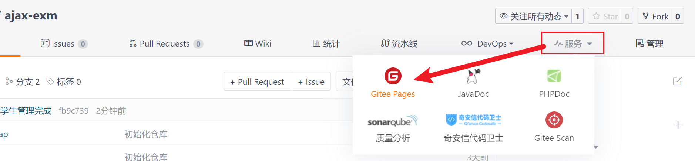


3. 实名认证

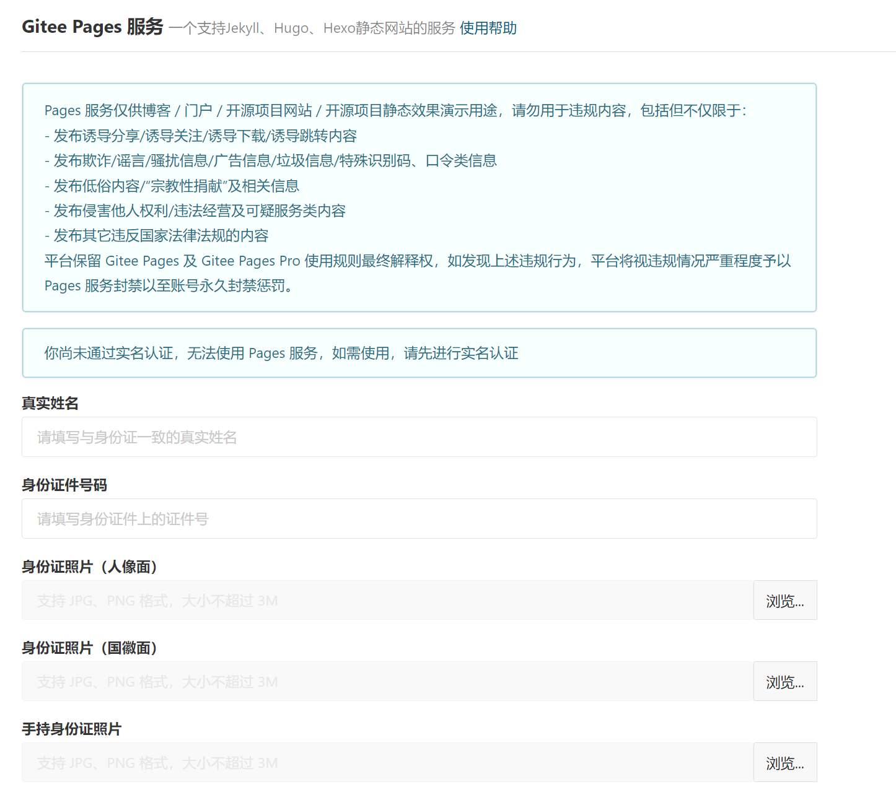


4. 开启服务

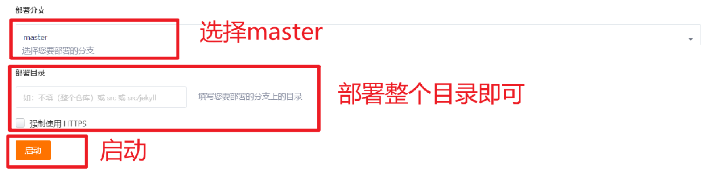
