# JavaScript 基础 - 第1天

> 了解变量、数据类型、运算符等基础概念，能够实现数据类型的转换，结合四则运算体会如何编程。

- JavaScript介绍
- 变量
- 常量
- 数据类型
- 运算符
- 实战案例

重点单词：

 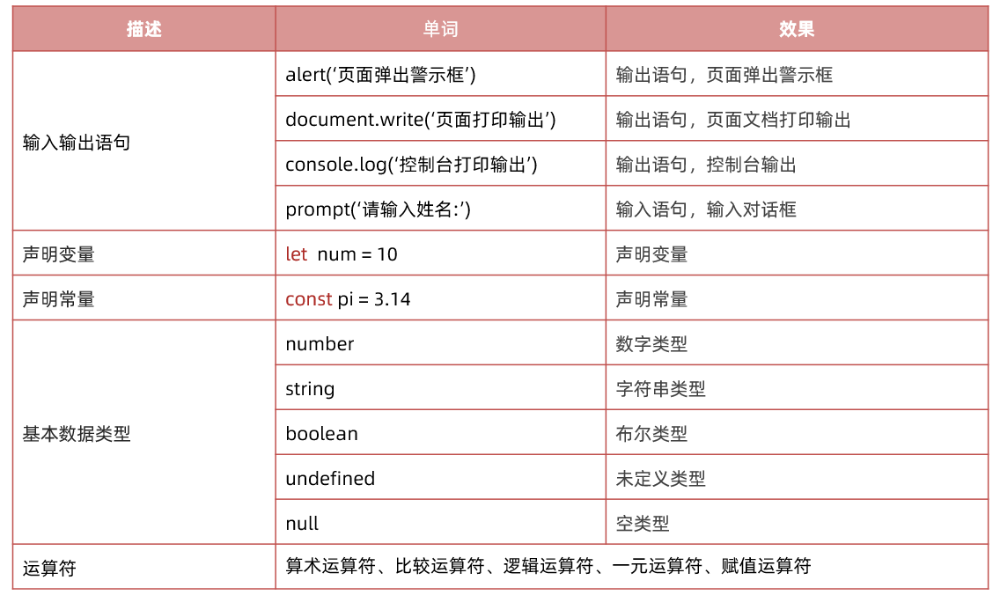

## `js`介绍

>是一种运行在客户端（浏览器）的编程语言，可以用来创建动态更新的内容，控制多媒体，制作图像动画等交互效果
>

### 怎么写?

JavaScript 程序不能独立运行，它需要被嵌入 HTML 中，然后浏览器才能执行 JavaScript 代码。通过 `script` 标签将 JavaScript 代码引入到 HTML 中，有两种方式：

#### 内部方式

通过 `script` 标签包裹 JavaScript 代码

```html
<!DOCTYPE html>
<html lang="en">
<head>
  <meta charset="UTF-8">
  <title>JavaScript 基础 - 引入方式</title>
</head>
<body>
  <!-- 内联形式：通过 script 标签包裹 JavaScript 代码 -->
  <script>
    alert('嗨，欢迎来传智播学习前端技术！')
  </script>
</body>
</html>
```

#### 外部形式

一般将 JavaScript 代码写在独立的以 .js 结尾的文件中，然后通过 `script` 标签的 `src` 属性引入

```javascript
// demo.js
document.write('嗨，欢迎来传智播学习前端技术！')
```

```html
<!DOCTYPE html>
<html lang="en">
<head>
  <meta charset="UTF-8">
  <title>JavaScript 基础 - 引入方式</title>
</head>
<body>
  <!-- 外部形式：通过 script 的 src 属性引入独立的 .js 文件 -->
  <script src="demo.js"></script>
</body>
</html>
```

如果 script 标签使用 src 属性引入了某 .js 文件，那么 标签的代码会被忽略！！！如下代码所示：

```html
<!DOCTYPE html>
<html lang="en">
<head>
  <meta charset="UTF-8">
  <title>JavaScript 基础 - 引入方式</title>
</head>
<body>
  <!-- 外部形式：通过 script 的 src 属性引入独立的 .js 文件 -->
  <script src="demo.js">
    // 此处的代码会被忽略掉！！！！
  	alert(666);  
  </script>
</body>
</html>
```

#### 注释和结束符

通过注释可以屏蔽代码被执行或者添加备注信息，JavaScript 支持两种形式注释语法：

#### 单行注释

使用 `// ` 注释单行代码

```html
<!DOCTYPE html>
<html lang="en">
<head>
  <meta charset="UTF-8">
  <title>JavaScript 基础 - 注释</title>
</head>
<body>
  
  <script>
    // 这种是单行注释的语法
    // 一次只能注释一行
    // 可以重复注释
    document.write('嗨，欢迎来传智播学习前端技术！');
  </script>
</body>
</html>
```

#### 多行注释

使用 `/* */` 注释多行代码

```html
<!DOCTYPE html>
<html lang="en">
<head>
  <meta charset="UTF-8">
  <title>JavaScript 基础 - 注释</title>
</head>
<body>
  
  <script>
    /* 这种的是多行注释的语法 */
    /*
    	更常见的多行注释是这种写法
    	在些可以任意换行
    	多少行都可以
      */
    document.write('嗨，欢迎来传智播学习前端技术！')
  </script>
</body>
</html>
```

**注：编辑器中单行注释的快捷键为 `ctrl + /`**

#### 结束符

在 JavaScript 中 `;` 代表一段代码的结束，多数情况下可以省略 `;` 使用回车（enter）替代。

```html
<!DOCTYPE html>
<html lang="en">
<head>
  <meta charset="UTF-8">
  <title>JavaScript 基础 - 结束符</title>
</head>
<body>
  
  <script> 
    alert(1);
    alert(2);
    alert(1)
    alert(2)
  </script>
</body>
</html>
```

实际开发中有许多人主张书写 JavaScript 代码时省略结束符 `;`

### 输入和输出语句

输出和输入也可理解为人和计算机的交互，用户通过键盘、鼠标等向计算机输入信息，计算机处理后再展示结果给用户，这便是一次输入和输出的过程。

#### 输出语句

~~~javascript
// 1. 输出语句
//  1.1 alert 页面弹出警示框
// alert('你好,js')
// 1.2 document.write 向页面文档输入内容 显示到页面body标签之内, 可以正常的解析标签
document.write('今日特价')
document.write('<h4>今日特价</h4>')
// 1.3 console.log 给我们程序员调试使用的   console 控制台
console.log('给咱们程序员使用的')
~~~

####  输入语句

向 `prompt()` 输入任意内容会以弹窗形式出现在浏览器中，一般提示用户输入一些内容。

```html
<!DOCTYPE html>
<html lang="en">
<head>
  <meta charset="UTF-8">
  <title>JavaScript 基础 - 输入输出</title>
</head>
<body>
  
  <script> 
    // 1. 输入的任意数字，都会以弹窗形式展示
    document.write('要输出的内容')
    alert('要输出的内容');

    // 2. 以弹窗形式提示用户输入姓名，注意这里的文字使用英文的引号
    prompt('请输入您的姓名:')
  </script>
</body>
</html>
```

## 变量

### 变量是什么&基本使用

> 理解变量是计算机存储数据的“容器”，掌握变量的声明方式

变量是计算机中用来存储数据的“容器”，变量不是数据本身，它们仅仅是一个用于存储数值的容器。可以理解为是一个个用来装东西的纸箱子。

 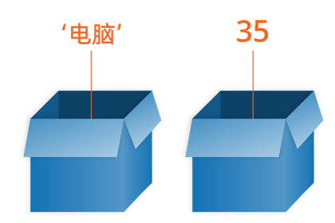

#### 声明

声明(定义)变量有两部分构成：声明关键字、变量名（标识）

```html
<!DOCTYPE html>
<html lang="en">
<head>
  <meta charset="UTF-8">
  <title>JavaScript 基础 - 声明和赋值</title>
</head>
<body>
  
  <script> 
    // let 变量名
    // 声明(定义)变量有两部分构成：声明关键字、变量名（标识）
    // let 即关键字，所谓关键字是系统提供的专门用来声明（定义）变量的词语
    // age 即变量的名称，也叫标识符
    let age
  </script>
</body>
</html>
```

关键字是 JavaScript 中内置的一些英文词汇（单词或缩写），它们代表某些特定的含义，如 `let` 的含义是声明变量的，看到 `let`  后就可想到这行代码的意思是在声明变量，如 `let age;` 

`let` 和 `var` 都是 JavaScript 中的声明变量的关键字，推荐使用 `let` 声明变量！！！

#### 赋值

声明（定义）变量相当于创造了一个空的“容器”，通过赋值向这个容器中添加数据。

```html
<!DOCTYPE html>
<html lang="en">
<head>
  <meta charset="UTF-8">
  <title>JavaScript 基础 - 声明和赋值</title>
</head>
<body>
  
  <script> 
    // 声明(定义)变量有两部分构成：声明关键字、变量名（标识）
    // let 即关键字，所谓关键字是系统提供的专门用来声明（定义）变量的词语
    // age 即变量的名称，也叫标识符
    let age
    // 赋值，将 18 这个数据存入了 age 这个“容器”中
    age = 18
    // 这样 age 的值就成了 18
    document.write(age)
    
    // 也可以声明和赋值同时进行
    let str = 'hello world!'
    alert(str);
  </script>
</body>
</html>
```

#### 变量更新

变量赋值后，还可以通过简单地给它一个不同的值来更新它。

~~~javascript
// 1.更新变量
let age = 18
age = 19
// 注意: 不要多次声明同一个变量
// let age = 19
console.log(age)
   
~~~

#### 声明多个变量

**语法**：多个变量中间用逗号隔开。

**说明**：看上去代码长度更短，但并不推荐这样。为了更好的可读性，一般情况下我们一行只声明一个变量。 

~~~javascript
// 2. 一次声明多个变量的简写方式 (了解 能认出来就可以了)
// let uname = 'pink老师', sex = '男'
let uname = 'pink老师'
let sex = '男'
console.log(uname, sex)
~~~

#### let 和 var 区别

在较旧的JavaScript，使用关键字 var 来声明变量 ，而不是 let

var 现在开发中一般不再使用它，只是我们可能再老版程序中看到它。

let 为了解决 var 的一些问题。

var 声明一些不合理的地方：

1. 可以先使用 在声明 (不合理)
2. var 声明过的变量可以重复声明(不合理)
3. 比如变量提升、全局变量、没有块级作用域等等

**结论：**

> var 就是个bug，别迷恋它了，以后声明变量我们统一使用 **let** 

### 变量的本质

内存：计算机中存储数据的地方，相当于一个空间

变量本质：是程序在内存中申请的一块用来存放数据的小空间

 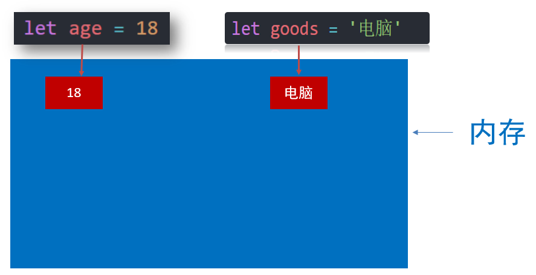

### 变量名命名规则

关于变量的名称（标识符）需要遵守：

**规则：**

1. 只能是字母、数字、下划线、$，且不能能数字开头
2. 字母区分大小写，如 Age 和 age 是不同的变量
3. JavaScript 内部已占用于单词（关键字或保留字）不允许使用
4. 尽量保证变量具有一定的语义，见字知义

**规范：**

1. 起名要有意义
2. 遵守小驼峰命名法
   1. 第一个单词首字母小写，后面每个单词首字母大写。例：userName

~~~javascript
// 1. 规则(法律)
// 1.1 变量名不能是关键字
// let let = 10
// 1.2 变量名的组成: 英文字母 数字 _  $ ，不能以数字开头
// let 1num = 10 错误
// let num! = 10 错误
// 1.3 js严格区分大小写
// let age = 18
// console.log(Age)

// 2. 规范(道德)
// 2.1 起名要有意义
// let age = 18
// let nl = 19
// 2.2 我们命名建议采取小驼峰命名法
let myName = 'pink老师'
let myFirstName = 'p'
~~~


## 常量

**是什么**：也是一个容器，用于保存数据的

**和变量的区别**： 常量里面保存的值是不允许改变的

**使用场景**：当某个值永远不会改变的时候，我们可以使用常量来保存，目的为了程序的安全

~~~javascript
// 常量： 也是一个容器用来保存的数据
const pi = 3.14
console.log(pi)
// 注意事项：
// 1. 常量里面的值是不允许修改的!!!   只读的
pi = 3.141592653
console.log(pi)
// 2. 常量必须要初始化(声明常量的时候必须要赋值)!!!
// const url
~~~

>注意： 常量不允许重新赋值,声明的时候必须赋值（初始化）

## 数据类型

> 计算机世界中的万事成物都是数据。

生活中会把物品进行归类，不同的物品不能混淆在一起。

计算机程序可以处理大量的数据，方便程序员的使用数据。

 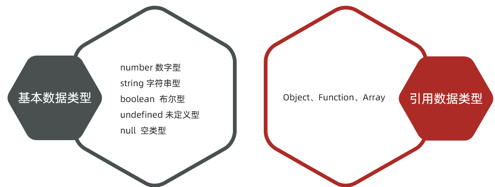


### 数字型和字符串型

**数字型：**

即我们数学中学习到的数字，可以是整数、小数、正数、负数

通过` typeof `关键字检测数据类型

**字符串：**

被引号包裹的一段文字信息

JS中的字符串:

通过单引号（ ‘’） 、双引号（ “”）或反引号( `` ) 包裹的数据都属于字符串

单引号和双引号没有本质上的区别，推荐使用单引号。

>注意事项：
>
>1. 单引号/双引号可以互相嵌套，但是不以自已嵌套自已（口诀：外双内单，或者外单内双）
>2. 一定注意变量名不要加引号，否则认为是字符串

~~~javascript
// 1. 数字型： 用于计算的， js数字类型包含： 整数、小数
// let num1 = 18
// let num1 = -18
let num1 = 18.88
// let num1 = -18.88
console.log(typeof num1)  // number   typeof 关键字检测数据类型

// 2. 字符串类型: 被引号包裹的一段文字信息   单引号 双引号  反引号
let goods = '笔记本电脑'
let address = "黑马程序员"
console.log(typeof goods)  // string
console.log(typeof address)  // string
let color = `粉红色`
let tel = '13612342234'
// 2.1 变量是不能加引号的,变量加了引号就不是盒子了，是一个字符串
console.log('goods')
// 2.2 字符串嵌套的问题. 不能嵌套自己, 外单内双  或者 外双内单
console.log('今日特价"跳楼大甩卖"速速抢购')
console.log("今日特价'跳楼大甩卖'速速抢购")
~~~

### 模板字符串

**使用场景:**

拼接字符串和变量

**语法**

~~~javascript
// 1. 字符串拼接
let age = 91
// console.log('pink老师今年' + age + '岁')
console.log('pink老师今年' + age + '岁')

// 2. 模板字符串
console.log(`pink老师今年${age}岁`)
// 3. 模板字符串里面的字符串可以换行
~~~

>  注意：反引号中间的字符串可以换行的

### 布尔类型

表示肯定或否定时在计算机中对应的是布尔类型数据，它有两个固定的值 `true` 和 `false`，表示肯定的数据用 `true`，表示否定的数据用 `false`。

```html
<!DOCTYPE html>
<html lang="en">
<head>
  <meta charset="UTF-8">
  <title>JavaScript 基础 - 数据类型</title>
</head>
<body>
  
  <script> 
    //  pink老师帅不帅？回答 是 或 否
    let isCool = true // 是的，摔死了！
    isCool = false // 不，套马杆的汉子！

    document.write(typeof isCool) // 结果为 boolean
  </script>
</body>
</html>
```

### undefined

未定义是比较特殊的类型，只有一个值 undefined，只声明变量，不赋值的情况下，变量的默认值为 undefined，一般很少【直接】为某个变量赋值为 undefined。

使用场景：我们可以通过检测变量里的值是否是undefined，如果是则代表还没有值传递过来，我们就不能随意的拿着这个变量来处理数据了。

```html
<!DOCTYPE html>
<html lang="en">
<head>
  <meta charset="UTF-8">
  <title>JavaScript 基础 - 数据类型</title>
</head>
<body>
  
  <script> 
    // 只声明了变量，并末赋值
    let tmp;
    document.write(typeof tmp) // 结果为 undefined
  </script>
</body>
</html>
```

**注：JavaScript 中变量的值决定了变量的数据类型。**

### null

```
空  值未知
表示赋值了，但是内容为空  返回值是 object
```


## 运算符

### 算术运算符

数字是用来计算的，比如：乘法 * 、除法 / 、加法 + 、减法 - 等等，所以经常和算术运算符一起。

算术运算符：也叫数学运算符，主要包括加、减、乘、除、取余（求模）等

| 运算符 | 作用                                                 |
| ------ | ---------------------------------------------------- |
| +      | 求和                                                 |
| -      | 求差                                                 |
| *      | 求积                                                 |
| /      | 求商                                                 |
| **%**  | 取模（取余数），开发中经常用于作为某个数字是否被整除 |

> 注意：在计算失败时，显示的结果是 NaN （not a number）

~~~javascript
// 算术运算符
console.log(1 + 2 * 3 / 2) //  4 
let num = 10
console.log(num + 10)  // 20
console.log(num + num)  // 20

// 1. 取模(取余数)  使用场景：  用来判断某个数是否能够被整除
console.log(4 % 2) //  0  
console.log(6 % 3) //  0
console.log(5 % 3) //  2
console.log(3 % 5) //  3

// 2. 注意事项 : 如果我们计算失败，则返回的结果是 NaN (not a number)
console.log('pink老师' - 2)
console.log('pink老师' * 2)
console.log('pink老师' + 2)   // pink老师2
~~~

### 赋值运算符

赋值运算符：对变量进行赋值的运算符

 =     将等号右边的值赋予给左边, 要求左边必须是一个容器

| 运算符 | 作用     |
| ------ | -------- |
| +=     | 加法赋值 |
| -+     | 减法赋值 |
| *=     | 乘法赋值 |
| /=     | 除法赋值 |
| %=     | 取余赋值 |

~~~javascript
// 赋值运算符
let num = 1
// 1. 需求 我们想要num变量里面的值 + 1， 加完之后再把计算结果存到num里面
// num = num + 1
// console.log(num)

// 2. += 赋值运算符
num += 1   // 当前情况下是等价于  num = num + 1
console.log(num)
~~~

### 自增/自减运算符

| 符号 | 作用 | 说明                       |
| ---- | ---- | -------------------------- |
| ++   | 自增 | 变量自身的值加1，例如: x++ |
| --   | 自减 | 变量自身的值减1，例如: x-- |

1. ++在前和++在后在单独使用时二者并没有差别，而且一般开发中我们都是独立使用
2. ++在后（后缀式）我们会使用更多

>注意：
>
>1. 只有变量能够使用自增和自减运算符
>2. ++、-- 可以在变量前面也可以在变量后面，比如: x++  或者  ++x 

~~~javascript
// 1. 自增运算符： 可以让变量里面的值加1
// let x = 3
// // x++   // x = x + 1 或者  x += 1 
// ++x
// console.log(x)

// 2. ++在前和++在后的区别。 如果单独使用，没有区别，如果参与了运算就有区别
// 2.1 ++在前  前缀式 ： 先对变量值+1， 然后拿着变量值做运算
// let x = 3
// let y = ++x
// console.log(y) // 4
// console.log(x) // 4

// 2.2 ++在后 后缀式 ： 先拿着变量值运算，再对变量值+1 
let x = 3
let y = x++
console.log(y) // 3
console.log(x) // 4
~~~

### 比较运算符

使用场景：比较两个数据大小、是否相等，根据比较结果返回一个布尔值（true / false）

| 运算符 | 作用                                   |
| ------ | -------------------------------------- |
| >      | 左边是否大于右边                       |
| <      | 左边是否小于右边                       |
| >=     | 左边是否大于或等于右边                 |
| <=     | 左边是否小于或等于右边                 |
| ===    | 左右两边是否`类型`和`值`都相等（重点） |
| ==     | 左右两边`值`是否相等                   |
| !=     | 左右值不相等                           |
| !==    | 左右两边是否不全等                     |

~~~javascript
// 比较运算符： 根据比较结果返回 布尔值 true / false 
console.log(3 > 5)  // false
console.log(3 < 5) // true
console.log(3 >= 5)  //  false 
console.log(3 >= 3)  // true
console.log(3 <= 5)  // true

// console.log(3 = 3)  // 错误
// 1. 判断是否相等我们使用 ===  要求 值 和 数据类型都相等返回的结果才是true,提倡使用三等  全等
console.log(3 === 3)    // true 
console.log(3 === '3') //  false 

console.log(3 !== 3)  // false 
console.log(3 !== '3') // true

// 2. == 判断是否相等，使用较少, 判断值是否相等，并不判断数据类型是否相等
console.log(3 == 3)  // true 
console.log(3 == '3') //  true 
console.log(3 != 3) // false 
~~~

### 逻辑运算符

使用场景：可以把多个布尔值放到一起运算，最终返回一个布尔值

| 符号 | 名称   | 日常读法 | 特点                       | 口诀           |
| ---- | ------ | -------- | -------------------------- | -------------- |
| &&   | 逻辑与 | 并且     | 符号两边有一个假的结果为假 | 一假则假       |
| \|\| | 逻辑或 | 或者     | 符号两边有一个真的结果为真 | 一真则真       |
| !    | 逻辑非 | 取反     | true变false  false变true   | 真变假，假变真 |

| A     | B     | A && B | A \|\| B | !A    |
| ----- | ----- | ------ | -------- | ----- |
| false | false | false  | false    | true  |
| false | true  | false  | true     | true  |
| true  | false | false  | true     | false |
| true  | true  | true   | true     | false |

~~~javascript
// 逻辑运算符:  逻辑与 &&  逻辑或 ||  逻辑非 ! 
// 1.逻辑与 &&  一假则假
console.log(false && false)  // false
console.log(false && true)  // false
console.log(true && false)  // false
console.log(true && true)  // true
console.log(3 > 5 && 2 < 4)  // false 
// 判断某个数字是否在 8096到36999 之间： 数字大于等于 8096 并且小于等于36999
let num = 1000
console.log(num >= 8096 && num <= 36999)  // false

console.log('------')
// 2. 逻辑或 ||   一真则真
console.log(true || false)  // true
console.log(false || true)  // true
console.log(true || true)  // true
console.log(false || false)  // false
console.log('------')

// 3. 逻辑非 取反
console.log(!false)  // true
console.log(!true)  // false
~~~

### 运算符优先级

 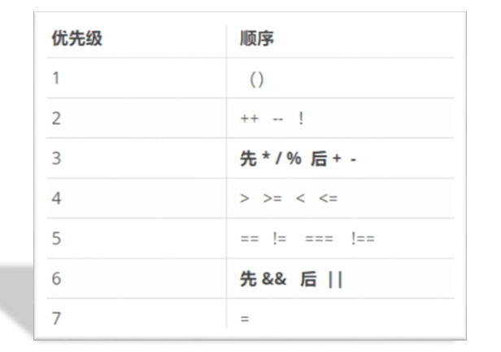

>  逻辑运算符优先级： ！> && >  ||  

## 综合案例

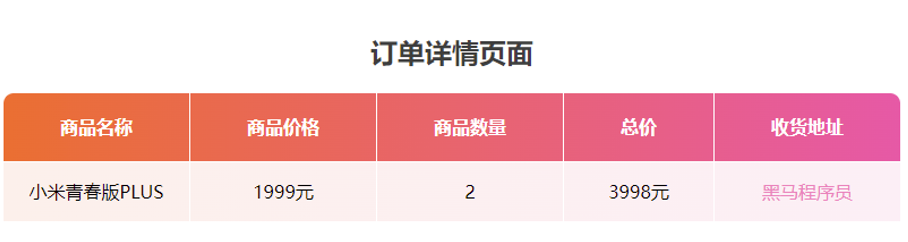

需求：用户输入商品价格和商品数量，以及收货地址，可以自动打印订单信息

分析：

①：输入数据

​      需要输入3个数据，所以需要3个变量来存储   价格 price、数量 num、地址 address

②：处理数据

​     需要计算总的价格保存变量：总计 total  = price *  num 

③：输出数据

​      页面打印生成表格，里面填充数据，使用模板字符串

**完整代码：**

~~~html
<!DOCTYPE html>
<html lang="en">

<head>
  <meta charset="UTF-8">
  <meta http-equiv="X-UA-Compatible" content="IE=edge">
  <meta name="viewport" content="width=device-width, initial-scale=1.0">
  <title>综合案例-商品订单信息页面</title>
  <style>
    .title {
      text-align: center;
      color: #3e3e3e;
    }

    .order {
      /* 合并相邻边框 */
      border-collapse: collapse;
      height: 80px;
      margin: 0 auto;
      text-align: center;
      border-radius: 10px 10px 0 0;
      overflow: hidden;
    }

    /* 给行添加渐变背景颜色 */
    .order tr:nth-child(1) {
      background-image: linear-gradient(to right, #f46e33, #f057a5);
    }

    .order tr:nth-child(2) {
      background-image: linear-gradient(to right, #fdf0eb, #fdeff6);
    }

    .order tr:nth-child(2) :last-child {
      color: #f282bb;
    }

    .order th {
      padding: 5px 50px;
      color: #fff;
    }

    .order,
    th,
    td {
      border: 1px solid #fff;
      line-height: 50px;
    }
  </style>
</head>

<body>
  <h2 class="title">订单详情页面</h2>

  <script>
    // 1. 输入数据
    let price = +prompt('请你输入商品单价:')
    let num = +prompt('请您输入商品数量:')
    let address = prompt('请您输入收货地址:')
    // 2. 处理数据
    let total = price * num  // 计算总价
    // alert(total)

    // 3. 输出数据
    document.write(`
    <table class="order">
      <tr>
        <th>商品名称</th>
        <th>商品价格</th>
        <th>商品数量</th>
        <th>总价</th>
        <th>收货地址</th>
      </tr>
      <tr>
        <td>小米青春版PLUS</td>
        <td>${price}元</td>
        <td>${num}</td>
        <td>${total}元</td>
        <td>${address}</td>
      </tr>
  </table>
  `)

  </script>
</body>

</html>
~~~


# JavaScript 基础 - 第2天

> 理解什么是流程控制，知道条件控制的种类并掌握其对应的语法规则，具备利用循环编写简易ATM取款机程序能力

- 类型转换
- 语句
- 综合案例


今日重点单词：

 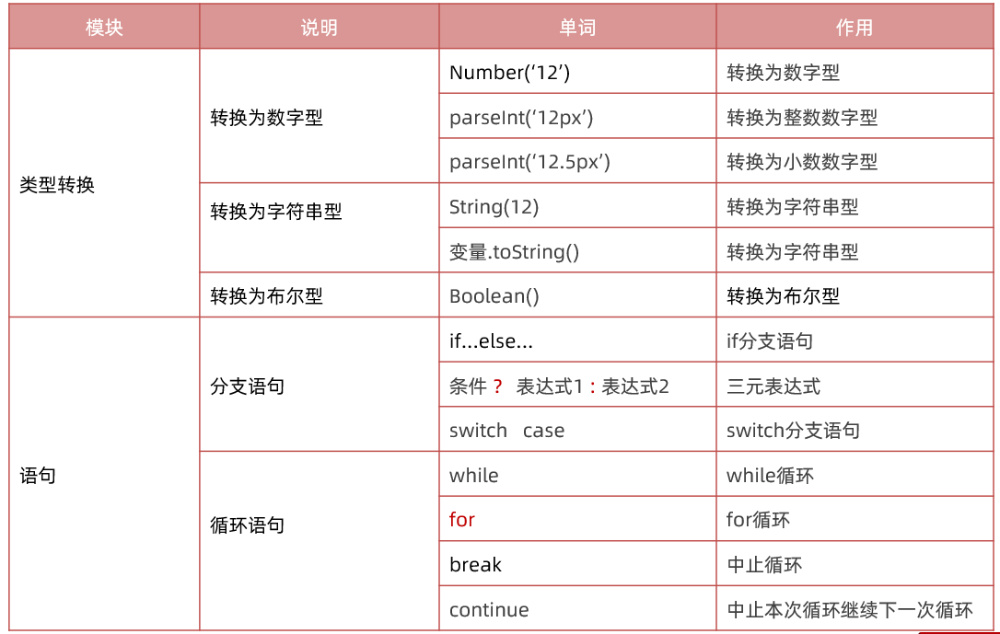

## 类型转换

类型转换：把一种数据类型转换成另外一种数据类型

**为什么需要类型转换呢？**

例如：使用表单、prompt 获取过来的数据默认是字符串类型的，此时就不能直接简单的进行加法运算

此时需要转换数据类型

数据类型转换可以分为： 显示转换和隐式转换

### 显示转换

自己手动写代码告诉系统该转成什么类型（数据类型明确、程序员主导）

#### 转换为数字型

1. Number(数据)
   - 转换成功返回一个数字类型
   - 转换失败则返回 NaN (例如数据里面包含非数字）
2. parseInt(数据)
   - 只保留整数
   - 如果数字开头的字符串，只保留整数数字 比如 12px 返回 12
3. parseFloat(数据)
   - 可以保留小数
   - 如果数字开头的字符串，可以保留小数 比如 12.5px 返回 12.5

~~~javascript
// 第一个数字
let num1 = prompt('请输入第一个月工资:')
// 第二个数字
let num2 = prompt('请输入第二个月工资:')
//  输出结果
alert(Number(num1) + Number(num2))

// 通过显示转换的方式把其他类型转换为数字型
// 1. Number() 最常用的一种方式 推荐 
// 1.1 把字符串转换为数字型
console.log(typeof Number('1')) // 1   number
console.log(Number('abcd')) // NaN 如果无法完成转换则返回NaN 

// 1.2 把布尔值转换为数字型 true false 
console.log(Number(true))  // 1
console.log(Number(false)) // 0

// 1.3 把 null undefined 转换为数字型
console.log(Number(null)) // 0
console.log(Number(undefined)) // NaN

// 2. parseInt() 和 parseFloat() 固定使用场景的   100px 只要100 不要px 
// 使用场景：把以数字开头的字符串，只保留数字这种情况下就可以使用 
console.log(parseInt('100px'))  // 100
console.log(parseInt('100.5px'))  // 100  parseInt() 只保留整数
console.log(parseFloat('100.5px'))  // 100.5 parseFloat() 可以返回小数
~~~

#### 转换为字符串和布尔型

 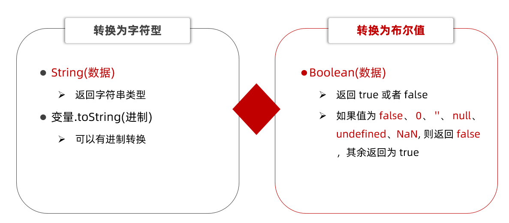

~~~javascript
// 1. 转换为字符串类型 
// 1.1 String(数据) 开发中提倡使用这种方式 
console.log(typeof String(1)) // '1'     string
console.log(String(true)) // 'true'     string

// 1.2 变量.toString(进制)
let num = 10
console.log(typeof num.toString()) //  string 
console.log(num.toString(10)) //  string   '10'
console.log(num.toString(8)) //  string   '8'

// 2. 转换为布尔型 Boolean  (重点) 因为接下来我们要学习分支语句需要用到
// 2.1 有6种情况为false： false 0 '' null undefined NaN (无，没有)
// 2.2 其余的都为true 
console.log(Boolean(false))  // false 
console.log(Boolean(0))  // false 
console.log(Boolean(1))  // true
console.log(Boolean(''))  // false
console.log(Boolean(null))  // false
console.log(Boolean(undefined))  // false
console.log(Boolean(NaN))  // false
~~~

### 隐式转换

某些运算符被执行时，系统内部自动将数据类型进行转换，这种转换称为隐式转换。

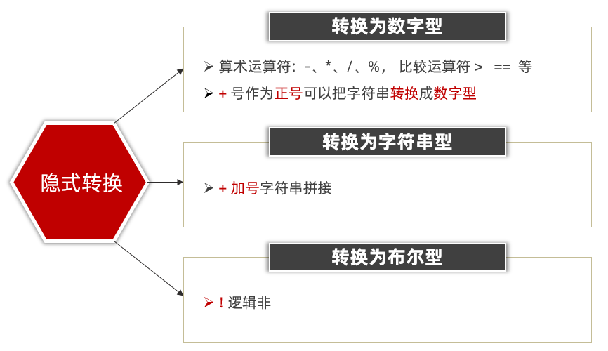

~~~javascript
// // 第一个数字
// let num1 = +prompt('请输入第一个月工资:')
// // 第二个数字
// let num2 = +prompt('请输入第二个月工资:')
// //  输出结果
// alert(num1 + num2)


// 1. 隐式转换为数字型的运算符
// 1.1 算术运算符 - *  /   比较运算符  >   ==
console.log(8 - '3') // 5
console.log('1999' * '2') //  3998
console.log(3 > '1')   // true
console.log(3 == '3')  // true

// 1.2 + 正号使用的时候，也会把字符串转换为 数字型
console.log('123')  // '123'
console.log(+'123')  // 123
console.log(typeof +'123')  // number

// 2. 隐式转换为字符串型的运算符   + 拼接字符串 两侧只要有一个是字符串，结果就是字符串
console.log('pink' + 18)
console.log('' + 18)  // '18'


// 3. 隐式转换为布尔型的运算符  ！逻辑非
console.log(!true)  // false 
console.log(!0)  // true
console.log(!'')  // true
console.log(!null) // true
console.log(!undefined)  // true
console.log(!NaN)  // true
console.log(!false)  // true
console.log(!'pink') // false
~~~

## 语句

### 表达式和语句

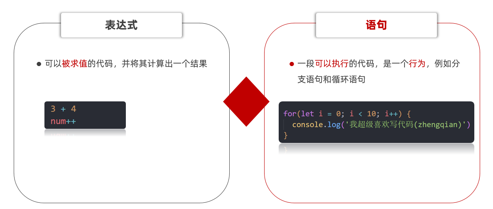


### 分支语句

分支语句可以根据条件判定真假，来选择性的执行想要的代码

分支语句包含：

1. if分支语句（重点）
2. 三元运算符
3. switch语句

#### if 分支语句

语法：

~~~javascript
if(条件表达式) {
  // 满足条件要执行的语句
}
~~~

小括号内的条件结果是布尔值，为 true 时，进入大括号里执行代码；为false，则不执行大括号里面代码

小括号内的结果若不是布尔类型时，会发生类型转换为布尔值，类似Boolean()

如果大括号只有一个语句，大括号可以省略，但是，俺们不提倡这么做~

~~~javascript
// if 分支语句 选择性的执行代码
// 1. 语法规范
// if (条件) {
//   满足条件要执行的代码
// }

// 2. 体验
// console.log('我想要被表扬')
// if (false) {
//   console.log('我想要被表扬')
// }

// if (3 < 5) {
//   console.log('我想要被表扬')
// }
if ('') {   // 类型转换 类似于 Boolean()
  console.log('我想要被表扬')
}

// 3. 需求： 用户输入高考成绩，如果分数大于等于700分，则提示 '恭喜考入黑马程序员'
let score = +prompt('请您输入高考成绩:')
if (score >= 700) {
  alert('恭喜您考入黑马程序员')
}
~~~

#### if双分支语句

如果有两个条件的时候，可以使用 if else 双分支语句

~~~javascript
if (条件表达式){
  // 满足条件要执行的语句
} else {
  // 不满足条件要执行的语句
}
~~~

例如：

~~~javascript
// if 双分支语句

// 案例1： 考试成绩判断
// 1. 如果成绩大于等于700分，提示 '恭喜您，考入黑马程序员'
// 2. 否则则提示 '非常抱歉，你没有考入黑马程序员，明年再战!'
// let score = +prompt('请您输入考试成绩:')
// if (score >= 700) {
//   alert('恭喜您，考入黑马程序员')
// } else {
//   alert('非常抱歉，你没有考入黑马程序员，明年再战!')
// }

// 案例2： 用户登录案例
// 1. 如果用户名是刘德华并且密码是123456 则提示登录成功
// 2. 否则则提示登录失败
let uname = prompt('请您输入用户名:')
let pwd = prompt('请您输入密码:')
if (uname === '刘德华' && pwd === '123456') {
  alert('登录成功，欢迎回来~')
} else {
  alert('登录失败，您输入的用户名和密码错误~')
}
~~~

#### if 多分支语句

使用场景： 适合于有多个条件的时候

~~~javascript
// if 多分支语句

// 案例： 根据成绩输出评语
// (1).成绩90以上是 优秀
// (2).成绩70~90是  良好
// (3).成绩是60~70之间是 及格
// (4).成绩60分以下是 不及格

// 1. 用户输入成绩
let score = +prompt('请您输入考试成绩:')

// 2. 根据成绩判断输出不同的结果
if (score >= 90) {
  alert('优秀，棒棒棒~')
} else if (score >= 70) {
  alert('良好，棒棒~')
} else if (score >= 60) {
  alert('及格，棒~')
} else {
  alert('不及格，好好加油，你可以的~')
}

// 3. 注意事项
// 3.1 因为我们判断用的是大于等于，则里面的成绩要从大往小写
// 3.2 else if 可以有任意多个， else 不是必须的
~~~

#### 三元运算符（三元表达式）

**使用场景**： 一些简单的双分支，可以使用  三元运算符（三元表达式），写起来比 if  else双分支 更简单

**符号**：? 与 : 配合使用

语法：

~~~javascript
条件 ? 表达式1 ： 表达式2
~~~

例如：

~~~javascript
// 三元运算符（三元表达式）
// 1. 语法格式
// 条件 ? 表达式1 : 表达式2 

// 2. 执行过程 
// 2.1 如果条件为真，则执行表达式1
// 2.2 如果条件为假，则执行表达式2

// 3. 验证
// 5 > 3 ? '真的' : '假的'
console.log(5 < 3 ? '真的' : '假的')

// 4. 练习  求2个数字的最大值
// let x = 10
let x = 100
let y = 20
console.log(x > y ? x : y)
~~~

#### switch语句（了解）

使用场景： 适合于有多个条件的时候，也属于分支语句，大部分情况下和 if多分支语句 功能相同

注意：

1. switch case语句一般用于等值判断, if适合于区间判断
2. switchcase一般需要配合break关键字使用 没有break会造成case穿透
3. if 多分支语句开发要比switch更重要，使用也更多

例如：

~~~javascript
// switch分支语句
// 1. 语法
// switch (表达式) {
//   case 值1:
//     代码1
//     break

//   case 值2:
//     代码2
//     break
//   ...
//   default:
//     代码n
// }

// 2. 体验: 查询水果价格，输入水果，得到当前水果价格
let fruits = '苹果'
switch (fruits) {
  case '香蕉':
    alert('香蕉的价格是: 3元/斤')
    break
    case '苹果':
    alert('苹果的价格是: 4元/斤')
    break
    case '橘子':
    alert('橘子的价格是: 2元/斤')
    break
    default:
    alert('没有查到此水果')
}

// 3. 注意事项
// 3.1  switch适合于等值判断， if多分支适合于区间判断
// 3.2  表达式的值要求 全等于 === case的值，才是能匹配上
// 3.3  break如果落下了，容易造成case穿透
~~~

#### 断点调试

**作用：**学习时可以帮助更好的理解代码运行，工作时可以更快找到bug

浏览器打开调试界面

1. 按F12打开开发者工具
2. 点到源代码一栏 （ sources ）
3. 选择代码文件

**断点：**在某句代码上加的标记就叫断点，当程序执行到这句有标记的代码时会暂停下来

  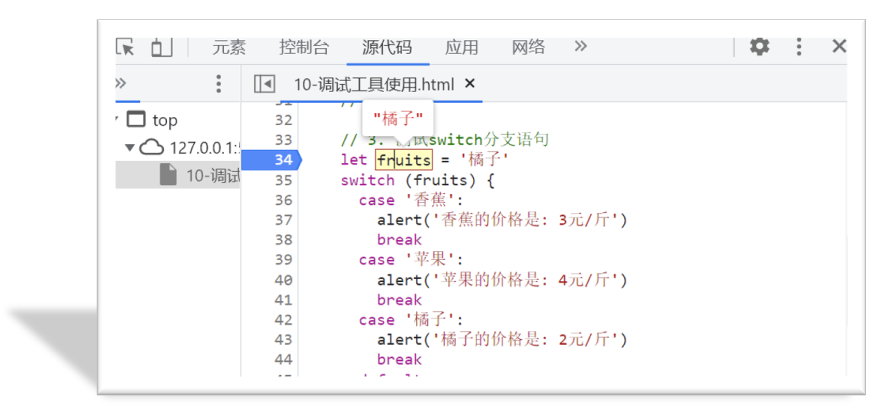


### 循环语句

使用场景：重复执行 指定的一段代码，比如我们想要输出10次 '我学的很棒'

学习路径：

1.while循环

2.for 循环（重点）

#### while循环

while :  在…. 期间， 所以 while循环 就是在满足条件期间，重复执行某些代码。

**语法：**

~~~javascript
while (条件表达式) {
   // 循环体    
}
~~~

例如：

~~~javascript
// while循环: 重复执行代码

// 1. 需求: 利用循环重复打印3次 '月薪过万不是梦，毕业时候见英雄'
let i = 1
while (i <= 3) {
  document.write('月薪过万不是梦，毕业时候见英雄~<br>')
  i++   // 这里千万不要忘了变量自增否则造成死循环
}
~~~

循环三要素：

1.初始值 （经常用变量）

2.循环条件

3.变量计数（常用自增或者自减）

#### for 循环

作用：重复执行指定的一段代码

好处：把声明初始值、循环条件、变量计数写到一起，让人一目了然，它是最常使用的循环形式

**语法：**

~~~javascript
for (初始值; 循环条件; 变量计数) {
  // 满足条件执行的循环体
}
~~~

例如：

~~~javascript
// for循环：重复执行一段代码
// 1. 语法
// for(初始值; 循环条件; 变量计数) {
//   // 循环体
// }

// 2. 需求： 重复打印3次
// '月薪过万不是梦，毕业时候见英雄。键盘敲烂要行动，前端行业一览众'
for (let i = 1; i <= 3; i++) {
  document.write('键盘敲烂要行动，前端行业一览众~ <br>')
}
~~~

#### 中止循环

`break`   中止整个循环，一般用于结果已经得到, 后续的循环不需要的时候可以使用（提高效率）  

`continue`  中止本次循环，一般用于排除或者跳过某一个选项的时候

~~~javascript
// 1.break中止整个for循环，一般用于结果已经得到, 后续的循环不需要的时候可以使用
// for (let i = 1; i <= 6; i++) {
//   document.write(`我是第${i}个孩子 <br>`)
//   if (i === 3) {
//     break
//   }
// }

// 2.continue中止本次循环，一般用于排除或者跳过某一个选项的时候
for (let i = 1; i <= 6; i++) {
  // 先验票，再进入电影院
  if (i === 3) {
    continue
  }
  document.write(`第${i}个孩子可以进入电影院<br>`)

}
~~~

#### 无限循环

1.while(true) 来构造“无限”循环，需要使用break退出循环。（常用）

2.for(;;) 也可以来构造“无限”循环，同样需要使用break退出循环。

~~~javascript
// 无限循环  
// 需求： 页面会一直弹窗询问你爱我吗？
// (1). 如果用户输入的是 '爱'，则退出弹窗
// (2). 否则一直弹窗询问

// 1. while(true) 无限循环
// while (true) {
//   let love = prompt('你爱我吗?')
//   if (love === '爱') {
//     break
//   }
// }

// 2. for(;;) 无限循环
for (; ;) {
  let love = prompt('你爱我吗?')
  if (love === '爱') {
    break
  }
}
~~~

## 综合案例-ATM存取款机


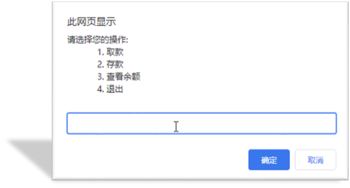


分析：

①：提示输入框写到循环里面（无限循环）

②：用户输入4则退出循环 break

③：提前准备一个金额预先存储一个数额 money

④：根据输入不同的值，做不同的操作

​     (1)  取钱则是减法操作， 存钱则是加法操作，查看余额则是直接显示金额

​     (2) 可以使用 if else if 多分支 来执行不同的操作

完整代码：

~~~javascript
// 综合案例 - ATM存取款机
// 提前声明金额变量 money
let money = 100
// 1.提示输入框写到循环里面（无限循环）
while (true) {
  let num = +prompt(`
请选择您的操作:
1.取款
2.存款
3.查看余额
4.退出
`)
  if (num === 1) {
    let qu = +prompt('请您输入取款金额:')
    // money = money - qu
    money -= qu
  } else if (num === 2) {
    let cun = +prompt('请您输入存款金额:')
    // money = money + cun
    money += cun
  } else if (num === 3) {
    alert(`您的银行卡余额是: ${money}`)
  } else if (num === 4) {
    // 2.用户输入4则退出循环 break   一定要小心数据类型
    break
  }

}
document.write(`滴，您的银行卡余额为: ${money}元，请节约消费`)
~~~


#  JavaScript 基础第三天笔记

>知道什么是数组及其应用的场景，掌握数组声明及访问的语法，具备利用数组渲染柱形图表的能力

**今日重点：**

- 循环嵌套
- 数组
- 综合案例

今日单词：

 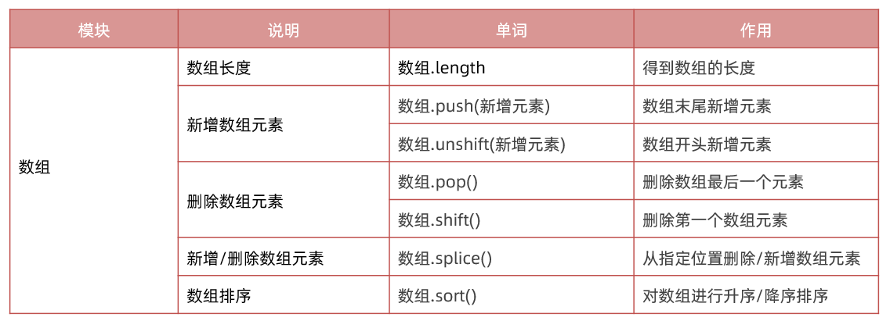

## 循环嵌套

利用循环的知识来对比一个简单的天文知识，我们知道地球在自转的同时也在围绕太阳公转，如果把自转和公转都看成是循环的话，就相当于是循环中又嵌套了另一个循环。


实际上 JavaScript 中任何一种循环语句都支持循环的嵌套，如下代码所示：

基本语法：

~~~javascript
for（初始化; 循环条件;变量计数） {
  for (初始化; 循环条件；变量计数）{
    //  要重复执行的代码
  }
}
~~~

例如：

```html
// 1. 外面的循环 记录第n天 
for (let i = 1; i < 4; i++) {
    document.write(`第${i}天 <br>`)
    // 2. 里层的循环记录 几个单词
    for (let j = 1; j < 6; j++) {
        document.write(`记住第${j}个单词<br>`)
    }
}
```

记住，外层循环循环一次，里层循环循环全部

### 三角型

~~~javascript
 // 外层打印几行
for (let i = 1; i <= 5; i++) {
    // 里层打印几个星星
    for (let j = 1; j <= i; j++) {
        document.write('★')
    }
    document.write('<br>')
}
~~~

 

### 九九乘法表

样式css

~~~css
span {
    display: inline-block;
    width: 100px;
    padding: 5px 10px;
    border: 1px solid pink;
    margin: 2px;
    border-radius: 5px;
    box-shadow: 2px 2px 2px rgba(255, 192, 203, .4);
    background-color: rgba(255, 192, 203, .1);
    text-align: center;
    color: hotpink;
}
~~~

javascript 

~~~javascript
 // 外层打印几行
for (let i = 1; i <= 9; i++) {
    // 里层打印几个星星
    for (let j = 1; j <= i; j++) {
        // 只需要把 ★ 换成  1 x 2 = 2   
        document.write(`
				<div> ${j} x ${i} = ${j * i} </div>
     `)
    }
    document.write('<br>')
}
~~~

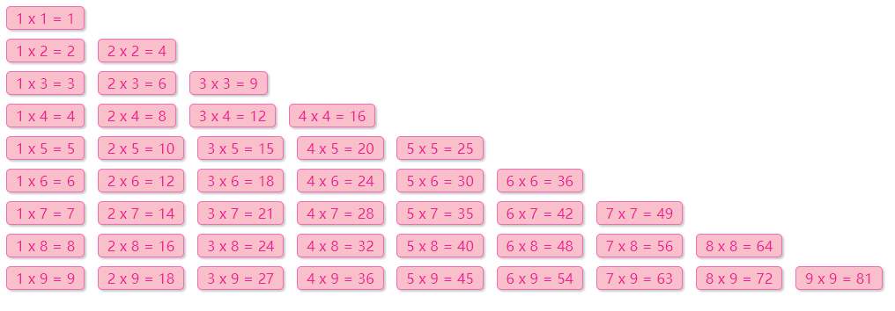

## 数组

> 知道什么是数组及其应用的场景，掌握数组声明及访问的语法。

### 数组是什么？

**数组**：(Array) 是一种数据类型，属于引用数据类型

**作用**: 在单个变量名下存储多个数据

例如我要保存咱们班同学的姓名，使用数组非常方便

### 数组的基本使用

#### 定义数组

```html
<script>
  // 1. 语法，使用 [] 来定义一个空数组
  // 定义一个空数组，然后赋值给变量 classes
  // let classes = []

  // 2. 定义非空数组
  let classes = ['小明', '小刚', '小红', '小丽', '小米']
</script>
```

通过 `[]` 定义数组，数据中可以存放真正的数据，如小明、小刚、小红等这些都是数组中的数据，我们这些数据称为数组单元，数组单元之间使用英文逗号分隔。

#### 访问数组和数组索引

使用数组存放数据并不是最终目的，关键是能够随时的访问到数组中的数据（单元）。其实 JavaScript 为数组中的每一个数据单元都编了号，通过数据单元在数组中的编号便可以轻松访问到数组中的数据单元了。

我们将数据单元在数组中的编号称为索引值，也有人称其为下标。

索引值实际是按着数据单元在数组中的位置依次排列的，注意是从` 0` 开始的，如下图所示：


观察上图可以数据单元【小明】对应的索引值为【0】，数据单元【小红】对应的索引值为【2】

```html
<script>
  // 数组： 可以单个变量下存储多个数据
  // 1. 声明数组
  let names = ['小明', '小刚', '小红', '小丽', '小米']
  // let names = ['小明', '小刚', true, '小丽', 1]
  console.log(names)
  // 1.1 数组是按照顺序来存储的，每个数据都有自己的编号
  // 1.2 编号是从0开始的， 0 1 2 3... 也称为 索引 或者 下标
  // 1.3 数组里面可以存放任意的数据类型

  // 2. 数组取值  数组名[下标]
  console.log(names[0])  // '小明'
  console.log(names[1])  // '小刚'
  console.log(names[2])  // '小红'
  console.log(names[3])  // '小丽'
  console.log(names[4])  // '小米'
</script>
```

数组做为数据的集合，它的单元值可以是任意数据类型

```html
<script>
  // 6. 数组单值类型可以是任意数据类型

  // a) 数组单元值的类型为字符类型
  let list = ['HTML', 'CSS', 'JavaScript']
  // b) 数组单元值的类型为数值类型
  let scores = [78, 84, 70, 62, 75]
  // c) 混合多种类型
  let mixin = [true, 1, false, 'hello']
</script>
```

#### 遍历数组

**遍历数组**：把数组中每个数据都访问到

**数组长度**： 数组.`length`

```html
<script>
  let arr = ['迪丽热巴', '古力娜扎', '佟丽丫丫', '玛尔扎哈', '哈尼克孜']
  // console.log(arr[0])
  // console.log(arr[1])
  // console.log(arr[2])
  // console.log(arr[3])
  // 遍历数组： 把数组里面的数据每个都会访问到
  // for (let i = 0; i < 4; i++) {
  //   // console.log(i)  数组名[索引号]
  //   console.log(arr[i])
  // }

  // 1. 数组的长度 数组.length 
  // console.log(arr.length)  // 4
  for (let i = 0; i < arr.length; i++) {
    console.log(arr[i])
  }
  // 2. 数组里面的数据也称为 数组元素
</script>
```

### 操作数组

数组本质是数据集合, 操作数据无非就是 增 删 改 查 语法

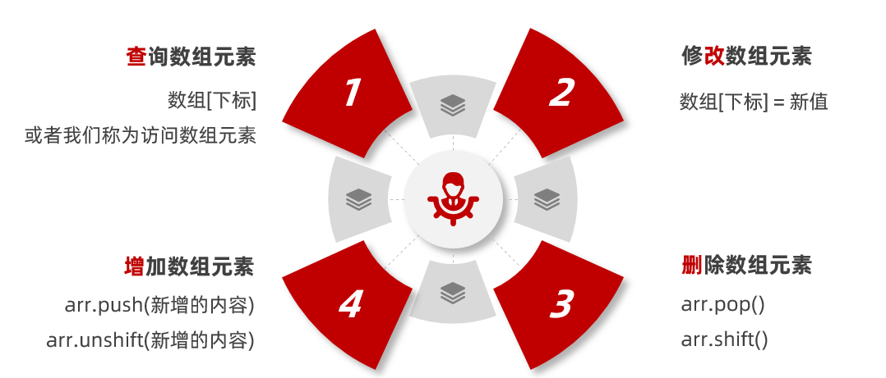

#### 查询和修改数组

**查询：**

​	语法：数组[索引]

​	返回值：如果查询不到则返回 undefined

**修改：**

​	语法：数组[索引]  = 新值

​	返回值：如果下标不存在，则是新增一个数组元素，并修改了数组长度（尽量避免）

```html
<script>
  // 1. 查询数组元素
  let arr = ['迪丽热巴', '古丽扎娜']
  console.log(arr[0]) //  '迪丽热巴'
  console.log(arr[1]) //  '古丽扎娜'
  console.log(arr[2]) //  undefined

  // 2. 修改数组元素   数组[索引] = 新值
  arr[1] = '佟丽丫丫'
  // console.log(arr)
  arr[3] = '古丽扎娜'  // 如果索引号不存在，则是增加数组元素 （不提倡）
  console.log(arr)
  console.log(arr.length)  // 4 修改了数组长度
</script>
```

#### 新增

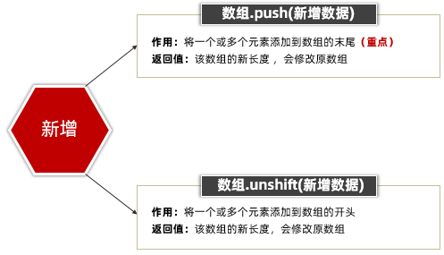

~~~javascript
// 数组新增元素
// 1. 可以向数组的末尾新增1个或者多个数组元素 数组.push(元素1...元素n)
let arr = ['迪丽热巴']
// console.log(arr.push('佟丽丫丫'))  // 返回的是新数组的长度 2
// arr.push('佟丽丫丫', '古丽扎娜')
// console.log(arr)  // 修改原数组

// 2. 可以向数组的开头增加1个或者多个数组元素 数组.unshift(元素1,...元素n)
// console.log(arr.unshift('佟丽丫丫'))  // 返回的是新数组的长度 2
arr.unshift('佟丽丫丫', '古丽扎娜')
console.log(arr) // 修改原数组
~~~

#### 删除

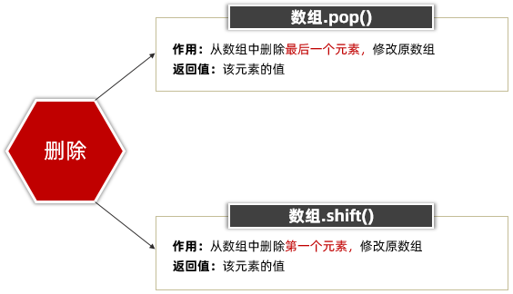

~~~javascript
<script>
  // 删除元素
  // 1. 删除数组中的最后一个元素  数组.pop()  修改原数组
  let arr = ['red', 'green']
// arr.pop()
// console.log(arr.pop())  // 返回的是被删除的元素
// console.log(arr)

// 2. 删除数组中的第一个元素 数组.shift() 修改原数组的
arr.shift()
// console.log(arr.shift())  // 返回的是被删除的元素
console.log(arr)
</script>
~~~

#### 数组 splice方法

数组.splice() 方法  可以添加也可以删除数组元素

说明：可以从指定位置删除或者增加的数组元素，注意它修改原数组

> splice(start,deleteCount, item1, item2...)

1. start 起始位置: 

   - 指定修改的开始位置（从0计数）

2. deleteCount 删除个数:  

   - 表示要移除的数组元素的个数


   - 可选的。如果省略则默认从指定的起始位置删除到最后

3. item1, item2...

   - 新增的元素

~~~javascript
<script>
  // splice 删除和增加数组元素
  let arr = ['迪丽热巴', '古力娜扎', '佟丽丫丫', '玛尔扎哈']
// 1. splice 删除  数组.splice(起始位置, 删除几个)
// arr.splice(1, 1) // 记住起始位置是索引号，从0 开始数
// arr.splice(1) // 如果第二个参数（删除几个）省略了，则默认删除到最后
// console.log(arr)

// 2. splice 增加  数组.splice(起始位置, 删除几个, 新增元素1,...新增元素n)
arr.splice(1, 0, '刘德华', 'pink老师')
// 2.1 注意如果是新增，则起始位置是目标位置的索引号， 删除几个（第二个参数）不能省略我们写为 0， 后面写新增的元素
console.log(arr)

// 3. splice 不是替换pop shift  unshift push.  arr.splice(0, 1)
// 开头结尾找前面 pop shift  unshift push
// splice管中间
</script>
~~~

## 综合案例

### 手风琴效果


小技巧： 利用循环拼接字符串  (原理跟累加和类似）

①：声明一个空的字符串 str = ''

②：循环里面利用 +=   进行拼接

③：把拼接完毕的字符串放入容器中

完整代码：

~~~javascript
<!DOCTYPE html>
<html lang="en">

<head>
  <meta charset="UTF-8">
  <meta name="viewport" content="width=device-width, initial-scale=1.0">
  <meta http-equiv="X-UA-Compatible" content="ie=edge">
  <title>Document</title>
  <style>
    .box {
      display: flex;
      overflow: hidden;
      width: 1120px;
      height: 260px;
      margin: 50px auto;
    }

    .box>div {
      width: 120px;
      border: 1px solid #fff;
      transition: all 0.5s;
    }

    .box>div:hover {
      width: 400px;
    }
  </style>
</head>

<body>
  <!-- <div class="box">
    <div></div>
    <div></div>
    <div></div>
    <div></div>
    <div></div>
    <div></div>
    <div></div>
  </div> -->

  <script>
    let arr = [
      './images/1.jpg',
      './images/2.jpg',
      './images/3.jpg',
      './images/4.jpg',
      './images/5.jpg',
      './images/6.jpg',
      './images/7.jpg',
    ]

    // 1. 声明一个空的字符串变量 str 
    let str = ''

    // 2. 利用for循环拼接字符串 +=
    for (let i = 0; i < arr.length; i++) {
      // console.log(arr[i])
      str += `
      <div></div>
      `
    }
    console.log(str)

    // 3. 把拼接的字符串放入 box盒子里面
    document.write(`
      <div class="box">
        ${str}
      </div>
    `)

  </script>
</body>

</html>
~~~

### 根据数据渲染柱形图效果

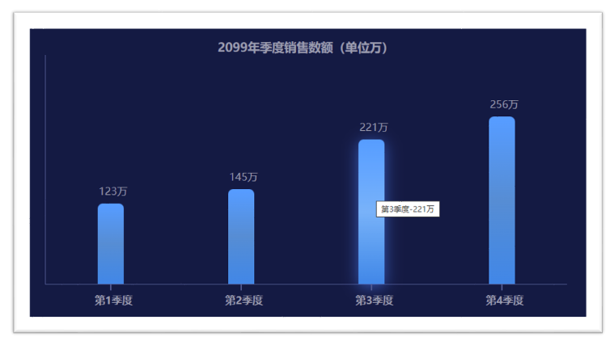

需求：用户输入四个季度的数据，可以生成柱形图

分析：

①：需要输入4次，所以可以把4个数据放到一个数组里面

- 声明一个空数组
- 利用循环，弹出4次框，同时把数据存到数组里面

②：遍历该数组，根据数据生成4个柱形图，渲染打印到页面中

- 声明一个空字符串str
- 根据数组利用循环拼接字符串，生成多个柱子
- 把生成的柱子添加到box盒子中

完整代码：

~~~javascript
<!DOCTYPE html>
<html lang="en">

<head>
  <meta charset="UTF-8">
  <meta http-equiv="X-UA-Compatible" content="IE=edge">
  <meta name="viewport" content="width=device-width, initial-scale=1.0">
  <title>Document</title>
  <style>
    * {
      margin: 0;
      padding: 0;
    }

    body {
      background-color: #0c143d;
    }

    .box {
      display: flex;
      justify-content: space-around;
      align-items: flex-end;
      width: 800px;
      min-height: 300px;
      border-left: 1px solid #4b578f;
      border-bottom: 1px solid #4b578f;
      margin: 0 auto;
      padding-top: 50px;
      text-align: center;
      color: #9799ab;
    }

    .box>div {
      position: relative;
      display: flex;
      flex-direction: column;
      justify-content: space-between;
      width: 40px;
      height: 0;
      background: linear-gradient(#3c99ff, #4489d0, #2283e4);
      cursor: pointer;
      border-radius: 8px 8px 0 0;
      transition: all .2s;
    }

    .box>div:hover {

      animation: bg .5s alternate infinite;

    }

    @keyframes bg {
      to {
        box-shadow: 0 5px 29px rgb(53 111 226 / 88%);
        background: linear-gradient(#3c99ff, #68aff6, #2283e4);
      }
    }

    .box>div::after {
      content: '';
      position: absolute;
      bottom: 0;
      left: 50%;
      width: 2px;
      height: 10px;
      background-color: #4b578f;
      transform: translate(-50%, 100%);
    }

    .box div span {
      width: 60px;
      margin: -30px 0 -5px -6px;
    }

    .box div h4 {
      width: 70px;
      margin: 0 0 -35px -10px;
    }

    .title {
      margin-top: 50px;
      text-align: center;
      color: #9799ab;
    }
  </style>
</head>

<body>
  <h3 class="title">2099年季度销售数额（单位万）</h3>
  <!-- <div class="box">
    <div style="height: 123px;" title="第1季度-123万">
      <span>123万</span>
      <h4>第1季度</h4>
    </div>
    <div style="height: 156px;" title="第2季度-156万">
      <span>156万</span>
      <h4>第2季度</h4>
    </div>
    <div style="height: 120px;" title="第3季度-120万">
      <span>120万</span>
      <h4>第3季度</h4>
    </div>
    <div style="height: 210px;" title="第4季度-210万">
      <span>210万</span>
      <h4>第4季度</h4>
    </div>
  </div> -->
  <script>
    // 功能1： 用户输入4次，并且把数据存放到数组里面

    // 1.1 声明一个空的数组
    let arr = []

    // 1.2 利用循环的形式让用户输入4次，并且把数据追加给数组
    for (let i = 1; i <= 4; i++) {
      let num = +prompt(`请您输入第${i}季度的销售额`)
      arr.push(num)
    }
    console.log(arr)

    // 功能2：根据数组生成柱形图

    // 2.1 声明一个空的字符串 str
    let str = ''

    // 2.2 利用循环拼接字符串，生成多个柱子
    for (let i = 0; i < arr.length; i++) {
      str += `
        <div style="height: ${arr[i]}px;" title="第${i + 1}季度-${arr[i]}万">
          <span>${arr[i]}万</span>
          <h4>第${i + 1}季度</h4>
        </div>
      `
    }
    console.log(str)

    // 2.3 把生成的柱子放到box盒子里面进行渲染
    document.write(`
      <div class="box">
        ${str}
      </div> 
    `)
  </script>
</body>

</html>
~~~

## 拓展知识

### 数组排序sort

数组. sort()  方法可以排序

语法：  

~~~javascript
<script>
    // 数组排序  数组.sort()  修改原数组
    let arr = [88, 78, 100, 34, 99]
    // arr.sort()
    // console.log(arr)  // [100, 34, 78, 88, 99]

    // 1. 升序排序
    // arr.sort(function (a, b) {
    //   return a - b
    // })
    // console.log(arr)  // [34, 78, 88, 99, 100]

    // 2. 降序排序
    arr.sort(function (a, b) {
      return b - a
    })
    console.log(arr)  //  [100, 99, 88, 78, 34]

    // 3. 获取数组最大值和最小值
    document.write(`数组的最大值：${arr[0]}`)
    document.write(`数组的最小值：${arr[arr.length - 1]}`)
  </script>
~~~

### 选择排序（了解）

选择排序原理：（了解）

就是从第一个数开始，与后面所有的数相比较，找出最小（最大）的数，放在第一个位置

以此类推，每一轮确定一个相对于这一轮最小（最大）的数

算法可视化网站地址： https://visualgo.net/zh/sorting

核心：利用循环嵌套比较，根据索引号来交换变量

①：外层循环是一共进行几轮相比较，通过观察，一共进行数组长度-1 次比较

- for (let i = 0; i < arr.length - 1; i++) 
- 把 i作为最小值起始索引  minIndex 

②：里层循环是每一轮的比较来查找最小值

- 里层循环起始值是 i + 1 个元素开始查找
- for (let j = i + 1; j < arr.length; j++)
- 进行比较的时候，发现最小的数组元素，把当前元素索引号给 minIndex

③：如果 minIndex 和 i 位置不一致，则交换变量

~~~javascript
<script>
  // 选择排序算法
  let arr = [4, 2, 5, 1, 3]
// 1  [1, 2, 5, 4, 3]
// 2  [1, 2, 5, 4, 3]
// 3  [1, 2, 3, 4, 5]
// 4  [1, 2, 3, 4, 5]
// 1. 外层循环控制是几轮能够比较出来
for (let i = 0; i < arr.length - 1; i++) {
  // 最小值的索引号
  let minIndex = i

  // 2. 里层循环来查找最小值，并且记录最小值的索引号
  for (let j = i + 1; j < arr.length; j++) {
    if (arr[j] < arr[minIndex]) {
      minIndex = j
    }
  }

  // 3. 交换变量  
  if (minIndex !== i) {
    let temp = arr[minIndex]
    arr[minIndex] = arr[i]
    arr[i] = temp
  }
}
console.log(arr)
~~~


# JavaScript 基础 - 第4天笔记

> 理解封装的意义，能够通过函数的声明实现逻辑的封装，知道对象数据类型的特征，结合数学对象实现简单计算功能。

- 函数
- 综合案例

## 函数

> 理解函数的封装特性，掌握函数的语法规则

### 函数的基本使用

**函数:** 是可以被重复使用的代码块

**作用：**函数可以把具有相同或相似逻辑的代码“包裹”起来，这么做的优势是有利于代码复用

#### 声明（定义）函数

声明（定义）一个完整函数包括关键字、函数名、形式参数、函数体、返回值5个部分

利用关键字 function 定义函数 （声明函数）

语法：

~~~javascript
<script>

// 函数： 是可以被重复使用的代码块，作用是有利于代码复用
// 1. 声明（定义）了最简单的函数，既没有形式参数，也没有返回值
function sayHi() {
console.log('嗨~')
}
~~~

注意：

1. 函数名命名跟变量一致，采用`小驼峰`命名法
2. 函数名经常采用 动词

#### 调用

声明（定义）的函数必须调用才会真正被执行，使用 `()` 调用函数。

```html
<!DOCTYPE html>
<html lang="en">
<head>
  <meta charset="UTF-8">
  <title>JavaScript 基础 - 声明和调用</title>
</head>
<body>
  <script>
    // 声明（定义）了最简单的函数，既没有形式参数，也没有返回值
    function sayHi() {
      console.log('嗨~')
    }
    // 函数调用，这些函数体内的代码逻辑会被执行
    // 函数名()
        
    sayHi()
    // 可以重复被调用，多少次都可以
    sayHi()
  </script>
</body>
</html>
```

> 注：函数名的命名规则与变量是一致的，并且尽量保证函数名的语义。


### 函数的整体认知

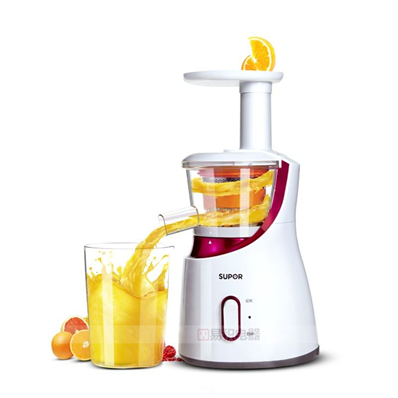

**语法：**

~~~javascript
function sum(参数1, 参数2...) {
    return 结果
}
console.log(sum(1, 2))  // 输出函数返回的结果

~~~

**说明：**

1. 函数参数，如果有多个则用逗号分隔，用于接受传递过来的数据
2. return 关键字可以把结果返回给调用者

###  函数参数

通过向函数传递参数，可以让函数更加灵活多变

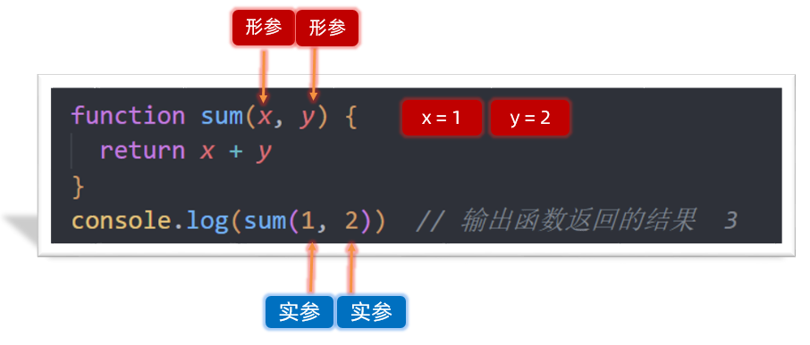

**形参：**声明函数时小括号里的叫形参（形式上的参数）

**实参：**调用函数时小括号里的叫实参（实际上的参数）

**执行过程：** 会把实参的数据传递给形参，从而提供给函数内部使用，我们可以把形参理解为变量

我们曾经使用过的 alert('打印')，parseInt('11px')，Number('11')本质上都是函数调用的传参

```html
<script>
  // 函数的参数  形参和实参个数不匹配

  // 1. 形参个数过多， 会自动补充 undefined 
  function sum(x, y) {  // 形参 
    return x + y
  }
  console.log(sum(1, 2))  // 实参   3
  console.log(sum(1))  // 实参  NaN  x = 1  y 没有给值默认值是 undefined
  //  1 + undefined  = NaN

  // 2. 实参个数过多，则多余的实参会被忽略
  console.log(sum(1, 2, 3)) // 实参 3

  // 3. 开发中提倡要保证实参和形参个数统一
</script>
```

在Javascript中 实参的个数和形参的个数可以不一致

- 如果形参过多 会自动填上undefined 
- 如果实参过多 那么多余的实参会被忽略 

### 逻辑中断

逻辑中断： 存在于逻辑运算符 && 和 || 中，左边如果满足一定条件会中断代码执行，也称为逻辑短路

>false && anything    // 逻辑与左边false则中断，如果左边为true，则返回右边代码的值
>
>true || anything       // 逻辑或左边true则中断，如果左边为false，则返回右边代码的值

~~~javascript
<script>
// 逻辑中断   && ||

// 1. 逻辑与中断：如果左边为假，则中断，如果左边为真，则返回右边的值
console.log(false && 1 + 2)  // false
console.log(0 && 1 + 2)  // 0
console.log('' && 1 + 2)  // ''
console.log(undefined && 1 + 2)  // undefined
console.log(true && 1 + 2)  // 3 此处不会发生逻辑中断
console.log(1 && 1 + 2)  // 3 此处不会发生逻辑中断

// 2. 逻辑或中断，如果左侧为真，则中断，如果左侧为假，则返回右边的值
console.log(true || 1 + 2) // true  发生了中断
console.log(1 || 1 + 2) // 1  发生了中断
console.log(false || 1 + 2) // 3 此处不会发生逻辑中断

// 3. 使用场景
// function sum(x, y) {
//   return x + y
// }
// console.log(sum(1, 2)) // 3
// console.log(sum()) // NaN

function sum(x, y) {   // x = undefined
  //  x = undefined || 0
  // x = 1 || 0
  x = x || 0
  y = y || 0
  return x + y
}
console.log(sum())  // 0
console.log(sum(1, 2)) // 3
</script>
~~~

### 函数默认参数

默认参数：可以给形参设置默认值

> 说明：这个默认值只会在缺少实参传递或者实参是undefined才会被执行

**默认参数和逻辑中断使用场景区别：**

1. 默认参数主要处理函数形参（处理参数要比逻辑中断更简单）
2. 逻辑中断除了参数还可以处理更多的需求

~~~javascript
<script>
  // 默认参数: 给形参一个默认值
  // 1. 默认参数里面的值执行：
  // 1.1 没有实参传递过来 x = 0 
  // 1.2 有实参传递但是传递的是undefined  x = 0
  function sum(x = 0, y = 0) {
  return x + y
	}
  console.log(sum()) // 0
  console.log(sum(undefined, undefined))  // 0
  console.log(sum(1, 2))  // 3

  // 2. 默认参数和逻辑中断使用场景的区别：
  // 2.1 默认参数主要针对的是形参
  // 2.2 逻辑中断除了处理参数之外，还可以做更多
</script>
~~~


### 函数返回值

函数的本质是封装（包裹），函数体内的逻辑执行完毕后，函数外部如何获得函数内部的执行结果呢？

要想获得函数内部逻辑的执行结果，需要通过 `return` 这个关键字，将内部执行结果传递到函数外部，这个被传递到外部的结果就是返回值。

>  返回值：把处理结果返回给调用者

```html
<script>
    // 函数返回值细节
    // 1. return 结束函数，return 后面的代码不会执行了， break退出循环或者switch
    // function sum(x, y) {
    //   return x + y
    //   console.log('我不会执行')
    // }
    // console.log(sum(1, 3))

    // 2. return 和被返回的结果不要换行
    // function sum(x, y) {
    //   return
    //   x + y
    // }
    // console.log(sum(1, 3))

    // 3. 如果函数没有return 则默认返回的是 undefined
    function fn() {

    }
    console.log(fn())  // undefined
  </script>
```

总结：

1. return会立即结束当前函数，所以后面代码不会再被执行
2. 在 return 关键字和被返回的表达式之间不允许使用换行符，否则内部执行相当于会自动补充分号
3. 函数可以没有 return，这种情况函数默认返回值为 undefined

### 作用域

**作用域（scope）**： 变量或者值在代码中可用性的范围

**作用：**作用域的使用提高了程序逻辑的局部性，增强了程序的可靠性，减少了名字冲突。

#### 全局作用域

作用于所有代码执行的环境(整个 script 标签内部)或者一个独立的 js 文件

处于全局作用域内的变量，称为全局变量

#### 局部作用域

1. 函数作用域。作用于函数内的代码环境
2. 块级作用域。{ } 大括号内部

处于局部作用域内的变量称为局部变量

>注意：
>
>1. 如果函数内部，变量没有声明，直接赋值，也当全局变量看，但是强烈不推荐
>2. 但是有一种情况，函数内部的形参可以看做是局部变量。

#### 变量的访问原则

访问原则：在能够访问到的情况下先局部，局部没有再找全局，总结： `就近原则`

### 匿名函数

函数可以分为具名函数和匿名函数

匿名函数：没有名字的函数,无法直接使用。

#### 函数表达式

将匿名函数赋值给一个变量，并且通过变量名称进行调用 我们将这个称为函数表达式

~~~javascript
// 声明
let fn = function() { 
   console.log('函数表达式')
}
// 调用
fn()
~~~

总结：

1. 其实函数也是一种数据类型
2. 函数表达式必须先定义，后使用
3. 函数的形参和实参使用跟具名函数一致

#### 立即执行函数

IIFE (立即执行函数表达式) (Immediately Invoked Function Expression)

**场景介绍:** 避免全局变量之间的污染

**注意：**多个立即执行函数要用 ; 隔开，要不然会报错

~~~javascript
(function(){ xxx  })();
(function(){xxxx}());
~~~

## 综合案例

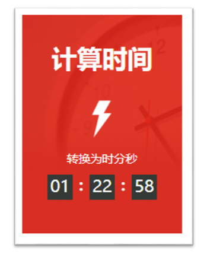

需求：用户输入秒数，可以自动转换为时分秒

分析：

①：用户弹窗输入 总秒数 

②：封装函数 getTime, 计算时分秒，注意：里面包含数字补0

③：打印输出

计算公式：计算时分秒

小时：  h =  parseInt(总秒数 / 60 / 60 %24)

分钟：  m = parseInt(总秒数 / 60 % 60 )

秒数:     s  = parseInt(总秒数 % 60) 

完整代码：

~~~html
<!DOCTYPE html>
<html lang="en">

<head>
  <meta charset="UTF-8">
  <meta http-equiv="X-UA-Compatible" content="IE=edge">
  <meta name="viewport" content="width=device-width, initial-scale=1.0">
  <title>综合案例-转换时间案例</title>
  <style>
    .box {
      position: relative;
      width: 190px;
      height: 260px;
      color: #fff;
      background: #e83632 url(./images/bg.png) 50%/contain no-repeat;
    }

    .title {
      width: 100%;
      text-align: center;
      font-size: 30px;
      font-weight: 700;
      padding-top: 31px;
    }

    .count {
      margin-top: 90px;
      font-size: 14px;
      text-align: center;
    }

    .timer {
      margin-left: auto;
      margin-right: auto;
      width: 130px;
      height: 30px;
      margin-top: 10px;
      display: block;
    }

    .timer span {
      position: relative;
      float: left;
      width: 30px;
      height: 30px;
      text-align: center;
      background-color: #2f3430;
      margin-right: 20px;
      color: white;
      font-size: 20px;
    }

    .timer span:nth-child(-n+2)::after {
      content: ":";
      display: block;
      position: absolute;
      right: -20px;
      font-weight: bolder;
      font-size: 18px;
      width: 20px;
      height: 100%;
      top: 0;
    }

    .timer span:last-child {
      margin-right: 0;
    }
  </style>
</head>

<body>
  <!-- <div class="box">
    <div class="title">计算时间</div>
    <div>
      <div class="count">转换为时分秒</div>
      <div class="timer">
        <span class="hour">01</span>
        <span class="minute">22</span>
        <span class="second">58</span>
      </div>
    </div>
  </div> -->

  <script>
    // 转换时分秒案例 
    // 计算公式：计算时分秒
    // 小时：  h = parseInt(总秒数 / 60 / 60 % 24)
    // 分钟：  m = parseInt(总秒数 / 60 % 60)
    // 秒数:   s = parseInt(总秒数 % 60) 

    // 1. 用户输入总的秒数
    let totalSeconds = +prompt('请您输入总的秒数:')

    // 2. 封装函数 getTime，把总的秒数转换为时分秒，注意记得数字补0 哦
    function getTime(t = 0) {
      // 转换小时
      let h = parseInt(t / 60 / 60 % 24)
      // 转换分钟
      let m = parseInt(t / 60 % 60)
      // 转换秒数
      let s = parseInt(t % 60)
      // 数字补0
      h = h < 10 ? '0' + h : h
      m = m < 10 ? '0' + m : m
      s = s < 10 ? '0' + s : s
      console.log(h, m, s)
      return `
        <span class="hour">${h}</span>
        <span class="minute">${m}</span>
        <span class="second">${s}</span>
      `
    }
    let str = getTime(totalSeconds) // 实参
    console.log(str)
    // 3. 页面打印输出
    document.write(`
       <div class="box">
        <div class="title">计算时间</div>
        <div>
          <div class="count">转换为时分秒</div>
          <div class="timer">
            ${str}
          </div>
        </div>
      </div>
    `)
  </script>
</body>

</html>
~~~


# JavaScript 基础 - 第5天

> 知道对象数据类型的特征，能够利用数组对象渲染页面

- 对象
- 综合案例
- 数据类型存储

## 对象

> 对象（Object）：JavaScript里的一种数据类型（引用类型），也是用于存储数据的
>
> 好处：可以用来详细的描述某个事物，是用键值对形式存储语义更明了
>
> 特点：对象数据是无序的，数组有序的  

### 对象基本使用

对象有属性和方法组成

#### 对象属性

数据描述性的信息称为属性，如人的姓名、身高、年龄、性别等，一般是名词性的。

1. 属性都是成 对出现的，包括属性名和值，它们之间使用英文 `:` 分隔
2. 多个属性之间使用英文 `,` 分隔
3. 属性就是依附在对象上的变量（对象外是变量，对象内是属性）

**1. 定义对象属性**

```html
<script>
  // 对象也是一种数据类型，保存数据同时可以更直观的描述事物
  // 1. 定义对象属性
  let pig = {
    sex: '女',
    age: 4,
    uname: '佩奇',
    weight: 12.6
  }
</script>
```

**2. 访问对象属性**

声明对象，并添加了若干属性后，可以使用 `.` 获得对象中属性对应的值，我称之为属性访问

```html
<script>
  // 对象也是一种数据类型，保存数据同时可以更直观的描述事物
  // 1. 定义对象属性
  let pig = {
    sex: '女',
    age: 4,
    uname: '佩奇',
    weight: 12.6
  }

  // 2. 访问对象属性  对象.属性
  console.log(pig.age)  // 4
  console.log(pig.weight)  // 12.6
</script>
```

#### 对象方法

数据行为性的信息称为方法，如跑步、唱歌等，一般是动词性的，其本质是函数。

1. 方法是由方法名和函数两部分构成，它们之间使用 : 分隔
2. 多个属性之间使用英文 `,` 分隔
3. 方法是依附在对象中的函数（对象外是函数，对象内是方法）

**1.定义对象方法**

~~~javascript
// let fn = function() {}
// 对象方法
// 1. 定义对象方法
let pig = {
  uname: '佩奇',
  sing: function () {
    console.log('唱歌')
  },
  dance: function () {
    console.log('跳舞')
  }
}
console.log(pig)

~~~

**2.调用对象方法**

声明对象，并添加了若干方法后，可以使用 `.`  调用对象中函数，我称之为方法调用。

~~~javascript
// let fn = function() {}
// 对象方法
// 1. 定义对象方法
let pig = {
  uname: '佩奇',
  sing: function () {
    console.log('唱歌')
  },
  dance: function () {
    console.log('跳舞')
  },
  sum: function (x, y) {  // 2
    // console.log(x + y)
    return x + y
  }
}
console.log(pig)

// 2. 调用对象方法
pig.sing() // 唱歌
pig.dance()  // 跳舞

// 3. 方法可以传递参数也可以有返回值，跟函数使用基本类似
let re = pig.sum(1, 2) // 1 实参
console.log(re)
~~~

**注：无论是属性或是方法，同一个对象中出现名称一样的，后面的会覆盖前面的。**

### 操作对象

对象本质是无序的数据集合, 操作对象数据无非就是 **增 删 改 查** 

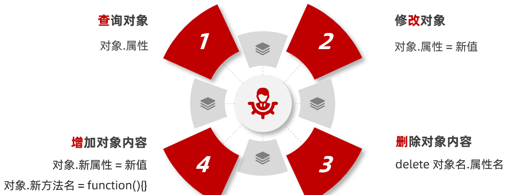

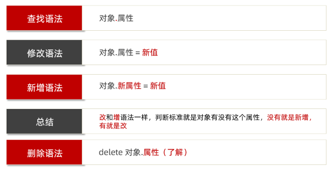


~~~javascript
<script>
  // 操作对象：对数据 查、增、改、删
  let pig = {
    uname: '佩奇',
    sing: function () {
      console.log('唱歌')
    }
  }

// 1. 查： 对象.属性 对象.方法
console.log(pig.uname)  // 得到属性值
pig.sing()

// 2. 增：对象.新属性 = 新值   对象.新方法 = function(){}
pig.age = 4
pig.dance = function () {
  console.log('跳舞')
}
console.log(pig)

// 3. 改：对象.属性 = 新值  对象.方法 = 新匿名函数
pig.uname = '小猪佩奇'
pig.sing = function () {
  console.log('哼哼哼！！')
}
console.log(pig)

// 4. 删： 了解，因为我们很少对对象里面的数据做删除操作  delete
delete pig.age
delete pig.dance
console.log(pig)
</script>
~~~

#### 查找属性的另外写法

对于多词属性比如中横线分割的属性，点操作就不能用了

我们可以采取：  对象['属性'] 方式， 单引号和双引号都阔以，当然也可以用于其他正常属性

~~~javascript
<script>
  // 查询属性的另外写法  对象['属性'] 这个属性必须加引号
  let pig = {
    'pig-name': '佩奇',
    age: 4
  }
// console.log(pig.pig - name)  // NaN
console.log(pig['pig-name']) // 佩奇
console.log(pig['age']) // 4    === pig.age 
</script>
~~~

> 总结：多词属性或者需要解析变量的时候使用 [] 语法，其余的直接使用点语法

### 遍历对象

for 遍历对象的问题：

- 对象没有长度length，而且是无序的

所以我们要利用 for in 遍历对象

**语法:**

~~~javascript
for (let 变量 in 对象) {
  console.log(变量) // 属性名
  console.log(对象[变量]) // 属性值
}
~~~

1. for in语法中的 k 是一个变量, 在循环的过程中依次代表对象的属性名
2. 由于 k 是变量, 所以必须使用 [ ] 语法解析 
3. 一定记住： k 是获得对象的属性名， 对象名[k] 是获得 属性值
4. 一般不用这种方式遍历数组、主要是用来遍历对象

~~~javascript
<script>
  // 遍历对象
  let pig = {
    sex: '女',
    age: 4,
    uname: '佩奇',
    weight: 12.6,

  }

// for (let key in pig) {
//   console.log(key)  // key 是属性  
//   console.log(pig[key]) // 对象[变量] 是值
// }

for (let key in pig) {
  console.log(key)  // key 是属性   对象.属性
  // console.log(pig.key)   // pig.key  undefined  因为key是个变量不是属性
  // key  'sex'  'age'    对象[key]  对象['sex']  对象['age']
  console.log(pig[key])
}


// 注意：数组遍历用传统for， for in 主要用来遍历对象
let arr = ['red', 'green', 'pink']
for (let k in arr) {
  console.log(k)// 得到字符串类型的索引号
}
</script>
~~~

## 内置对象

内置对象：JavaScript内部提供的对象，包含各种属性和方法给开发者调用

回想一下我们曾经使用过的 `console.log`，`console`其实就是 JavaScript 中内置的对象，该对象中存在一个方法叫 `log`，然后调用 `log` 这个方法，即 `console.log()`

除了 `console` 对象外，JavaScritp 还有其它的内置的对象

### Math

`Math` 是 JavaScript 中内置的对象，称为数学对象，这个对象下即包含了属性，也包含了许多的方法。

| 属性/方法 | 作用         | 说明                                                         |
| --------- | ------------ | ------------------------------------------------------------ |
| PI        | 圆周率       | Math.PI  属性，返回圆周率                                    |
| max       | 找最大值     | Math.max(8, 3, 1) 方法，返回 8                               |
| min       | 找最小值     | Math.min(8, 3, 1) 方法，返回 1                               |
| abs       | 绝对值       | Math.abs(-1) 方法，返回 1                                    |
| ceil      | 向上取整     | Math.ceil(3.1)    方法，返回 4                               |
| floor     | 向下取整     | Math.floor(3.8)  方法，返回 3                                |
| round     | 四舍五入取整 | Math.round(3.8)  方法，返回 4， 遇到.5则舍入到相邻的在正无穷（+∞）方向上的整数 |

~~~javascript
<script>
  // 内置对象Math 
  // 1. PI 属性 圆周率
  console.log(Math.PI)

// 2. max  方法 找最大值
console.log(Math.max(8, 4, 2)) // 8

// 3. min  方法 找最小值
console.log(Math.min(8, 4, 2)) // 2

// 4. abs 方法 取绝对值 
console.log(Math.abs(-1))  // 1

// 5. ceil 方法 向上取整   ceil 天花板   往大了取
console.log(Math.ceil(1.1)) // 2
console.log(Math.ceil(1.5)) // 2
console.log(Math.ceil(1.8)) // 2
console.log(Math.ceil(-1.1)) //  -1
console.log(Math.ceil(-1.5)) //  -1
console.log(Math.ceil(-1.8)) //  -1

// 6. floor 方法 向下取整  floor 地板  往小了取
console.log(Math.floor(1.1)) // 1
console.log(Math.floor(1.5)) // 1
console.log(Math.floor(1.8)) // 1
console.log(Math.floor(-1.1)) //  -2
console.log(Math.floor(-1.5)) //  -2
console.log(Math.floor(-1.8)) //  -2

// 7. round 方法 四舍五入取整 
console.log(Math.round(1.1)) // 1
console.log(Math.round(1.5)) // 2
console.log(Math.round(1.8)) // 2
console.log(Math.round(-1.1)) // -1
console.log(Math.round(-1.8)) // -2
console.log(Math.round(-1.5)) // -1
</script>
~~~

数学对象提供了比较多的方法，这里不要求强记，通过演示数学对象的使用，加深对对象的理解。

#### 随机数 random

lMath.random()  随机数， 返回一个0 - 1之间，并且包括0不包括1的随机小数  [0, 1）

如何生成0-10的随机整数呢？

~~~javascript
Math.floor(Math.random() * (10 + 1))
~~~

如何生成5-15的随机整数？

~~~javascript
Math.floor(Math.random() * (10 + 1)) + 5
~~~

如何生成N-M之间的随机整数

~~~javascript
Math.floor(Math.random() * (M - N + 1)) + N
Math.floor(Math.random() * (差值 + 1)) + 最小值
~~~

~~~javascript
<script>
  // 1. Math随机数  Math.random() 
  // 1.1 随机的小数 0 ~1 之间
  // 1.2 能取到0，但是取不到1 [0, 1)
  // console.log(Math.random())

  // 2. 取 0 ~ 10 之间的一个随机整数
  // Math.random() * (10 + 1)
  // (0 ~ 0.99999) * 11
  // 0 ~ 10.99999
  // Math.floor(Math.random() * (10 + 1))
  // console.log(Math.floor(Math.random() * (10 + 1)))

  // 3. 取 5 ~ 15 之间的一个随机整数
  // Math.floor(Math.random() * (10 + 1))  0 ~ 10 
  // Math.floor(Math.random() * (10 + 1)) + 5  5 ~ 15 
  // console.log(Math.floor(Math.random() * (10 + 1)) + 5)

  // 4. 取 n ~ m 之间的一个随机整数  4 ~ 12 
  // Math.floor(Math.random() * (差值 + 1)) + 最小值
  console.log(Math.floor(Math.random() * (8 + 1)) + 4)
</script>
~~~

#### 生成随机颜色

```js
 <script>
    // 生成随机颜色案例
    /*
     1. 封装一个颜色函数 getRandomColor 
     2. 返回rgb格式的颜色
     3. 返回十六进制的颜色
    */

    // 1. 封装一个颜色函数 getRandomColor
    function getRandomColor(flag = true) {
      // 2. 如果实参是true或者不传递实参，则返回 #ffffff
      if (flag) {
        let arr = ['0', '1', '2', '3', '4', '5', '6', '7', '8', '9', 'a', 'b', 'c', 'd', 'e', 'f']
        let str = '#'
        // 2.1 利用random 生成 0~15之间的随机数 但是要随机6次，所以利用循环
        for (let i = 1; i <= 6; i++) {
          let random = Math.floor(Math.random() * 16)

          // 2.2 利用生成的随机整数去数组里面找值，拼接到字符串里面最后返回
          // console.log(arr[random])  4  2  e
          str += arr[random]
        }
        return str
      } else {
        // 3. 如果实参是false 则返回的是rgb(255,255,255)
        // 3.1 利用random随机生成3个 0 ~ 255 之间的整数
        let r = Math.floor(Math.random() * 256)
        let g = Math.floor(Math.random() * 256)
        let b = Math.floor(Math.random() * 256)
        // 3.2 利用模板字符串填充
        return `rgb(${r}, ${g}, ${b})`
      }
    }

    console.log(getRandomColor())  // 返回的是 #ffffff
    console.log(getRandomColor(true))  // 返回的是 #ffffff
    console.log(getRandomColor(false))  // 返回的是 #ffffff

  </script>
```


## 综合案例


需求：根据数据渲染列表页面

分析：

①：根据对象数组的数据来渲染页面
②：核心利用循环来做字符串拼接生成多个标签，然后添加到容器中渲染页面

~~~html
<!DOCTYPE html>
<html lang="en">

<head>
  <meta charset="UTF-8">
  <meta http-equiv="X-UA-Compatible" content="IE=edge">
  <meta name="viewport" content="width=device-width, initial-scale=1.0">
  <title>学成在线</title>
  <link rel="stylesheet" href="./iconfont/iconfont.css">
  <link rel="stylesheet" href="./css/base.css">
  <link rel="stylesheet" href="./css/index.css">
</head>

<body>

  <!-- 精品课程 -->
  <script>
    // 综合案例代码
    // 1. 利用对象数组的数据渲染页面
    // 综合案例代码
    let data = [
      {
        src: './uploads/quality01.png',
        title: 'JavaScript数据看板项目实战',
        num: 1125
      },
      {
        src: './uploads/quality02.png',
        title: 'Vue.js实战——面经全端项目',
        num: 2726
      },
      {
        src: './uploads/quality03.png',
        title: '玩转Vue全家桶，iHRM人力资源项目',
        num: 9456
      },
      {
        src: './uploads/quality04.png',
        title: 'Vue.js实战医疗项目——优医问诊',
        num: 7192
      },
      {
        src: './uploads/quality05.png',
        title: '小程序实战：小兔鲜电商小程序项目',
        num: 2703
      },
      {
        src: './uploads/quality06.png',
        title: '前端框架Flutter开发实战',
        num: 2841
      },
      {
        src: './uploads/quality07.png',
        title: '熟练使用React.js——极客园H5项目',
        num: 95682
      },
      {
        src: './uploads/quality08.png',
        title: '熟练使用React.js——极客园PC端项目',
        num: 904
      },
      {
        src: './uploads/quality09.png',
        title: '前端实用技术，Fetch API 实战',
        num: 1516
      },
      {
        src: './uploads/quality10.png',
        title: '前端高级Node.js零基础入门教程',
        num: 2766
      },
      {
        src: './uploads/quality10.png',
        title: '前端高级Node.js零基础入门教程',
        num: 27669
      }
    ]
    // 2. 利用循环来做字符串拼接生成多个li标签，之后把生成的li标签放入容器 ul 里面渲染即可
    let str = ''
    for (let i = 0; i < data.length; i++) {
      // console.log(data[i]) // 每个对象
      str += `
         <li>
          <a href="#">
            <div class="pic">
              
            </div>
            <h4>${data[i].title}</h4>
            <p><span>高级</span> · <i>${data[i].num}</i>人在学习</p>
          </a>
        </li>
      `
    }
    console.log(str)

    document.write(`
      <div class="course wrapper">
        <div class="hd">
          <h3>精品推荐</h3>
          <a href="#">查看全部
            <span class="iconfont icon-arrow-right-bold">
            </span>
          </a>
        </div>
        <div class="bd">
          <ul class="common">
            ${str}
          </ul>
        </div>
      </div>
    `)

  </script>
</body>

</html>
~~~

## 数据存储

#### 内存中堆栈空间分配区别：

**栈:** 优点访问速度快，基本数据类型存放到栈里面

**堆:**优点存储容量大，引用数据类型存放到堆里面

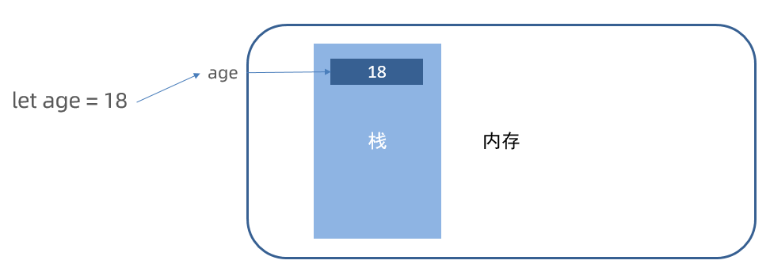

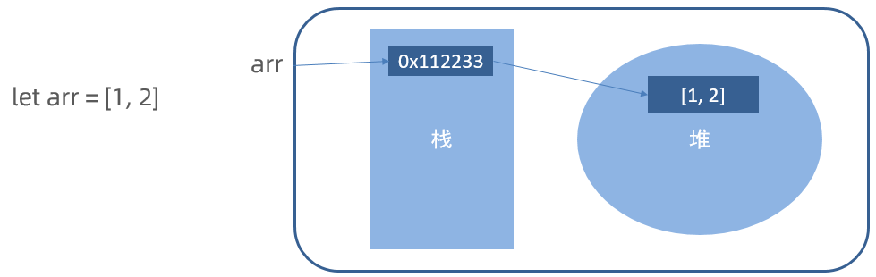

#### 变量声明

建议：  const 优先，尽量使用const，原因是：

- 很多变量声明的时候明确不会被更改了，为了安全性，那为什么不用 const 呢？
- 实际开发中也是，比如 React、Vue，基本 const 声明

总结：

有了变量先给const，如果发现它后面是要被修改的，再改为let

#### 专业术语

| 术语           | 解释                                                       | 举例                                              |
| -------------- | ---------------------------------------------------------- | ------------------------------------------------- |
| 关键字         | 在JavaScript中有特殊意义的词汇                             | let、var、function、if、else、switch、case、break |
| 保留字         | 在目前的JavaScript中没意义，但未来可能会具有特殊意义的词汇 | int、short、long、char                            |
| 标识（标识符） | 变量名、函数名的另一种叫法                                 | 无                                                |
| 表达式         | 可以被求值的代码，一般配合运算符出现                       | 10 + 3、age  >= 18                                |
| 语句           | 一段可执行的代码                                           | if ()    for()                                    |


