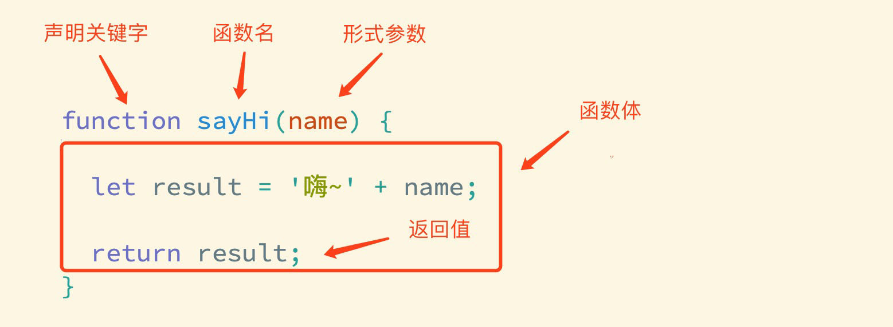

# js基础语法

## 引入方式

JavaScript 程序不能独立运行，它需要被嵌入 HTML 中，然后浏览器才能执行 JavaScript 代码。通过 `script` 标签将 JavaScript 代码引入到 HTML 中，有两种方式：

#### 内部方式

通过 `script` 标签包裹 JavaScript 代码

```html
<!DOCTYPE html>
<html lang="en">
<head>
  <meta charset="UTF-8">
  <title>JavaScript 基础 - 引入方式</title>
</head>
<body>
  <!-- 内联形式：通过<script> 标签包裹 JS 代码 -->
  <script>
    alert('你好！')
  </script>
</body>
</html>
```

#### 外部形式

一般将 JavaScript 代码写在独立的以 .js 结尾的文件中，然后通过 `script` 标签的 `src` 属性引入

```javascript
// demo.js
document.write('你好！')
```

```html
<!DOCTYPE html>
<html lang="en">
<head>
  <meta charset="UTF-8">
  <title>JavaScript 基础 - 引入方式</title>
</head>
<body>
  <!-- 外部形式：通过 script 的 src 属性引入独立的 .js 文件 -->
  <script src="demo.js"></script>
</body>
</html>
```

如果 script 标签使用 src 属性引入了某 .js 文件，那么 标签的代码会被忽略！！！如下代码所示：

```html
<!DOCTYPE html>
<html lang="en">
<head>
  <meta charset="UTF-8">
  <title>JavaScript 基础 - 引入方式</title>
</head>
<body>
  <!-- 外部形式：通过 script 的 src 属性引入独立的 .js 文件 -->
  <script src="demo.js">
    // 此处的代码会被忽略掉！！！！
  	alert(666);  
  </script>
</body>
</html>
```

##  注释和结束符

通过注释可以屏蔽代码被执行或者添加备注信息，JavaScript 支持两种形式注释语法：

#### 单行注释

> ctrl + /

使用 `// ` 注释单行代码

```html
   <script>
    // 这种是单行注释的语法
    // 一次只能注释一行
    // 可以重复注释
    document.write('你好!')
  </script>
```

#### 多行注释

> shift + alt + A

使用 `/* */` 注释多行代码

```html
<!DOCTYPE html>
<html lang="en">
<head>
  <meta charset="UTF-8">
  <title>JavaScript 基础 - 注释</title>
</head>
<body>
  
  <script>
     /* 这种的是多行注释的语法 */
    /*
    	更常见的多行注释是这种写法
    	在些可以任意换行
    	多少行都可以
    	shift + alt + A
      */
    document.write('你好！')
  </script>
</body>
</html>
```

**注：编辑器中单行注释的快捷键为 `ctrl + /`**

### 结束符

在 JavaScript 中 `;` 代表一段代码的结束，多数情况下可以省略 `;` 使用回车（enter）替代。

```html
<!DOCTYPE html>
<html lang="en">
<head>
  <meta charset="UTF-8">
  <title>JavaScript 基础 - 结束符</title>
</head>
<body>
  
  <script> 
    alert(1);
    alert(2);
    alert(1)
    alert(2)
  </script>
</body>
</html>
```

实际开发中有许多人主张书写 JavaScript 代码时省略结束符 `;`

## 输入和输出

```
输入语句：prompt('请输入内容')
弹出框：alert(1)
在浏览器控制台打印：console.log('aaa')
```

输出和输入也可理解为人和计算机的交互，用户通过键盘、鼠标等向计算机输入信息，计算机处理后再展示结果给用户，这便是一次输入和输出的过程。

举例说明：如按键盘上的方向键，向上/下键可以滚动页面，按向上/下键这个动作叫作输入，页面发生了滚动了这便叫输出。

#### 输出

JavaScript 可以接收用户的输入，然后再将输入的结果输出：

`alert()`、`document.wirte()`

以数字为例，向 `alert()` 或 `document.write()`输入任意数字，他都会以弹窗形式展示（输出）给用户。

####  输入

向 `prompt()` 输入任意内容会以弹窗形式出现在浏览器中，一般提示用户输入一些内容。

```html
<!DOCTYPE html>
<html lang="en">
<head>
  <meta charset="UTF-8">
  <title>JavaScript 基础 - 输入输出</title>
</head>
<body>
  
  <script> 
    // 1. 输入的任意数字，都会以弹窗形式展示
      
    document.write('要输出的内容')  //向body内输出内容
     //注意：如果输出的内容写的是标签，也会被解析成网页元素
      
      
    alert('要输出的内容') //作用：页面弹出警告对话框

    // 2. 以弹窗形式提示用户输入姓名，注意这里的文字使用英文的引号
    prompt('请输入您的姓名:')
      
  //javascript代码执行顺序：
  //按html 文档流顺序执行 javascript代码。
  //alert() 和 prompt() 他们会跳过页面渲染先被执行！！！
  </script>
</body>
</html>
```

## 变量

> 理解变量不是数据本身，他们仅仅是计算机存储数据的“容器”，掌握变量的声明方式

变量是计算机中用来存储数据的“容器”，它可以让计算机变得有记忆，通俗理解变量就是使用某个符号来代表某个具体的数值（数据）

```html
<script>
  // x 符号代表了 5 这个数值
  x = 5
  // y 符号代表了 6 这个数值
  y = 6
    
  //举例： 在 JavaScript 中使用变量可以将某个数据（数值）记录下来！

  // 将用户输入的内容保存在 num 这个变量（容器）中
  num = prompt('请输入一数字!')  //是一个字符串形式

  // 通过 num 变量（容器）将用户输入的内容输出出来
  alert(num)
  document.write(num)
</script>
```

### 声明

声明(定义)变量有两部分构成：声明关键字、变量名（标识）

```html
<!DOCTYPE html>
<html lang="en">
<head>
  <meta charset="UTF-8">
  <title>JavaScript 基础 - 声明和赋值</title>
</head>
<body>
  
  <script> 
    // let 变量名
    // 声明(定义)变量有两部分构成：声明关键字、变量名（标识）
    // let 即关键字，所谓关键字是系统提供的专门用来声明（定义）变量的词语
    // age 即变量的名称，也叫标识符
    let age
    
    //声明多个变量
    let age = 18,uname = 'qing' //多个变量之间用逗号隔开
    //为了更好的可读性，请一行只声明一个变量！
    
    //注：let 不允许多次声明一个变量！！！
  </script>
</body>
</html>
```

关键字是 JavaScript 中内置的一些英文词汇（单词或缩写），它们代表某些特定的含义，如 `let` 的含义是声明变量的，看到 `let`  后就可想到这行代码的意思是在声明变量，如 `let age;` 

`let` 和 `var` 都是 JavaScript 中的声明变量的关键字，推荐使用 `let` 声明变量！！！

### 赋值

声明（定义）变量相当于创造了一个空的“容器”，通过赋值向这个容器中添加数据。

```html
<!DOCTYPE html>
<html lang="en">
<head>
  <meta charset="UTF-8">
  <title>JavaScript 基础 - 声明和赋值</title>
</head>
<body>
  
  <script> 
    // 声明(定义)变量有两部分构成：声明关键字、变量名（标识）
    // let 即关键字，所谓关键字是系统提供的专门用来声明（定义）变量的词语
    // age 即变量的名称，也叫标识符
    let age
    // 赋值，将 18 这个数据存入了 age 这个“容器”中
    age = 18
    // 这样 age 的值就成了 18
    document.write(age)
    
    // 也可以声明和赋值同时进行
    let str = 'hello world!'   //初始化
    alert(str);
  </script>
</body>
</html>
```

### 关键字

JavaScript 使用专门的关键字 `let` 和 `var` 来声明（定义）变量，在使用时需要注意一些细节：

以下是使用 `let` 时的注意事项：

1. 允许声明和赋值同时进行
2. 不允许重复声明
3. 允许同时声明多个变量并赋值
4. JavaScript 中内置的一些关键字不能被当做变量名

以下是使用 `var` 时的注意事项：

> var 就是个bug！

- 可以先使用，在声明（不合理）
- var 声明过的变量可以重复声明！（不合理）
- 比如变量提升，全局变量，没有块级作用域等等。

大部分情况使用 `let` 和 `var` 区别不大，但是 `let` 相较 `var` 更严谨，因此推荐使用 `let`。

### 变量名命名规则

关于变量的名称（标识符）有一系列的规则需要遵守：

1. 只能是字母、数字、下划线、$，且不能能数字开头
2. 字母区分大小写，如 Age 和 age 是不同的变量
3. JavaScript 内部已占用于单词（关键字或保留字）不允许使用
4. 尽量保证变量具有一定的语义，见字知义
5. 遵守小驼峰命名法

注：所谓关键字是指 JavaScript 内部使用的词语，如 `let` 和`var`，保留字是指 JavaScript 内部目前没有使用的词语，但是将来可能会使用词语。

```html
<!DOCTYPE html>
<html lang="en">
<head>
  <meta charset="UTF-8">
  <title>JavaScript 基础 - 变量名命名规则</title>
</head>
<body>
  
  <script> 
    let age = 18 // 正确
    let age1 = 18 // 正确
    let _age = 18 // 正确

    // let 1age = 18; // 错误，不可以数字开头
    let $age = 18 // 正确
    let Age = 24 // 正确，它与小写的 age 是不同的变量
    // let let = 18; // 错误，let 是关键字
    let int = 123 // 不推荐，int 是保留字
  </script>
</body>
</html>
```


## 常量

概念：使用 const 声明的变量称为“常量”。

使用场景：当某个变量永远不会改变的时候，就可以使用 const 来声明，而不是let。

命名规范：和变量一致

~~~javascript
const PI = 3.14
~~~

>注意： 常量不允许重新赋值,声明的时候必须赋值（初始化）

> 不需要重新赋值的数据使用 const

## 数据类型

> 计算机世界中的万事成物都是数据。

计算机程序可以处理大量的数据，为了方便数据的管理，将数据分成了不同的类型：

注：通过 typeof 关键字检测数据类型

```html
<!DOCTYPE html>
<html lang="en">
<head>
  <meta charset="UTF-8">
  <title>JavaScript 基础 - 数据类型</title>
</head>
<body>
  
  <script> 
    // 检测 1 是什么类型数据，结果为 number
    document.write(typeof 1)
  </script>
</body>
</html>
```

### 数值类型

即我们数学中学习到的数字，可以是整数、小数、正数、负数

```html
<!DOCTYPE html>
<html lang="en">
<head>
  <meta charset="UTF-8">
  <title>JavaScript 基础 - 数据类型</title>
</head>
<body>
  
  <script> 
    let score = 100 // 正整数
    let price = 12.345 // 小数
    let temperature = -40 // 负数

    document.write(typeof score) // 结果为 number
    document.write(typeof price) // 结果为 number
    document.write(typeof temperature) // 结果为 number
  </script>
</body>
</html>
```

JavaScript 中的数值类型与数学中的数字是一样的，分为正数、负数、小数等。

```js
//js是弱数据类型，变量到底属于哪种类型，只有赋值之后，才能确认。

//算术运算符： + 求和   - 求差   * 求积   / 求商    % 取模
//优先级相同时以 从左向右 执行！
```


### 字符串类型

通过单引号（ `''`） 、双引号（ `""`）或反引号包裹的数据都叫字符串，单引号和双引号没有本质上的区别，推荐使用单引号。

注意事项：

1. 无论单引号或是双引号必须成对使用
2. 单引号/双引号可以互相嵌套，但是不以自已嵌套自已  （外双内单，or 外单内双）
3. 必要时可以使用转义符 `\`，输出单引号或双引号

```html
<!DOCTYPE html>
<html lang="en">
<head>
  <meta charset="UTF-8">
  <title>JavaScript 基础 - 数据类型</title>
</head>
<body>
  
  <script> 
    let user_name = '小明' // 使用单引号
    let gender = "男" // 使用双引号
    let str = '123' // 看上去是数字，但是用引号包裹了就成了字符串了
    let str1 = '' // 这种情况叫空字符串
		
    documeent.write(typeof user_name) // 结果为 string
    documeent.write(typeof gender) // 结果为 string
    documeent.write(typeof str) // 结果为 string
  </script>
</body>
</html>
```

字符串拼接

```
＋ 运算符  可以实现字符串的拼接
口诀：数字相加，字符相连
```

模板字符串

> 拼接字符串和变量，用 ${} 包住变量

```js
//在没有它之前，要拼接变量比较麻烦
document.write('大家好，我叫' + name + '，今年' + age + '岁')

//模板字符串
//语法： ``(反引号)
//内容拼接时， 用 ${} 包住变量
document.write(`大家好，我叫${name},今年${age}岁`)
```


### 布尔类型

```
true：肯定、是
false：否定
```

表示肯定或否定时在计算机中对应的是布尔类型数据，它有两个固定的值 `true` 和 `false`，表示肯定的数据用 `true`，表示否定的数据用 `false`。

```html
<!DOCTYPE html>
<html lang="en">
<head>
  <meta charset="UTF-8">
  <title>JavaScript 基础 - 数据类型</title>
</head>
<body>
  
  <script> 
    //  pink老师帅不帅？回答 是 或 否
    let isCool = true // 是的，摔死了！
    isCool = false // 不，套马杆的汉子！

    document.write(typeof isCool) // 结果为 boolean
  </script>
</body>
</html>

```

#### null

```
null：空、没有 值未知

null开发中使用场景：
官方解释：把 null 作为尚未创建的对象
将来有个变量里面存放的是一个对象，但是对象还没有创建好，可以先给个 null
```

#### NaN

> NaN代表一个计算错误，它是一个不正确的或者一个未定义的数学操作所得到的结果。

```js
console.log('老师' - 2) // NaN
//NaN 是粘性的，任何对NaN 的操作都会返回 NaN ！！！
```

### undefined

未定义是比较特殊的类型，只有一个值 undefined，只声明变量，不赋值的情况下，变量的默认值为 undefined，一般很少【直接】为某个变量赋值为 undefined。

```html
<!DOCTYPE html>
<html lang="en">
<head>
  <meta charset="UTF-8">
  <title>JavaScript 基础 - 数据类型</title>
</head>
<body>
  
  <script> 
    // 只声明了变量，并末赋值
    let tmp;
    document.write(typeof tmp) // 结果为 undefined
      
      //我们开发中经常声明一个变量，等待传送过来的数据。
  </script>
</body>
</html>
```

undefined 和 null 的区别：

```html
undefined 表示没有赋值
null 表示赋值了，但是内容为空
```

**注：JavaScript 中变量的值决定了变量的数据类型。**

#### typeof

> 查看数据类型

```js
console.log(typeof 234); // number
console.log(typeof NaN);  // number
console.log(typeof 'abc'); // string
console.log(typeof '123'); // string
console.log(typeof true); // boolean
console.log(typeof undefined); // undefined
console.log(typeof null); // object
```

## 类型转换

```js
//1. 将其它类型转换为字符串
var num = 10
num.toString() // 显式类型转换
String(10)	// 显式类型转换
10 + ''	// 隐式类型转换

//2. 将其它类型转换为数字类型
parseInt() // 转换为整数 - 显式类型转换
parseFloat() // 转换为浮点数 - 显式类型转换
Number() // 显式类型转换
+'123' // 隐式类型转换
'110' - '108' // 隐式类型转换
'10' * 1 // 隐式类型转换
'10' / 1 // 隐式类型转换

//3. 将其它类型转换为布尔型
Boolean('') // false
Boolean(0) // false
Boolean(NaN) // false
Boolean(null) // false
Boolean(undefined) // false

//注意：由于js在进行运算时会进行进制的转换，所以会丢失精度
//0.1 + 0.2
//0.0023 * 100

+prompt('') //数字型！！！
```

> 理解弱类型语言的特征，掌握显式类型转换的方法

在 JavaScript 中数据被分成了不同的类型，如数值、字符串、布尔值、undefined，在实际编程的过程中，不同数据类型之间存在着转换的关系。

### 隐式转换

规则：

1. ＋号两边只要有一个是字符串，都会把另外一个转成字符串。
2. 除了 ＋ 以外的算术运算符，比如 - * / 都会把数据转成数字类型。

缺点：转换类型不明确，靠经验才能总结。

- +号作为正号解析可以转换成数字型
- 任何数据和字符串相加结果都是字符串

某些运算符被执行时，系统内部自动将数据类型进行转换，这种转换称为隐式转换。

```html
<!DOCTYPE html>
<html lang="en">
<head>
  <meta charset="UTF-8">
  <title>JavaScript 基础 - 隐式转换</title>
</head>
<body>
  <script> 
    let num = 13 // 数值
    let num2 = '2' // 字符串

    // 结果为 132
    // 原因是将数值 num 转换成了字符串，相当于 '13'
    // 然后 + 将两个字符串拼接到了一起
    console.log(num + num2)

    // 结果为 11
    // 原因是将字符串 num2 转换成了数值，相当于 2
    // 然后数值 13 减去 数值 2
    console.log(num - num2)

    let a = prompt('请输入一个数字')
    let b = prompt('请再输入一个数字')

    alert(a + b);
  </script>
</body>
</html>
```

注：数据类型的隐式转换是 JavaScript 的特征，后续学习中还会遇到，目前先需要理解什么是隐式转换。

```html
<!DOCTYPE html>
<html lang="en">

<head>
  <meta charset="UTF-8">
  <meta http-equiv="X-UA-Compatible" content="IE=edge">
  <meta name="viewport" content="width=device-width, initial-scale=1.0">
  <title>Document</title>
</head>

<body>
  <script>
    // 1. 用户输入   prompt 得到是字符串类型 要转换为 数字型
    let num1 = +prompt('请输入第一个数字：')
    let num2 = +prompt('请输入第二个数字：')
    // 2. 输出
    alert(`两个数相加的和是:${num1 + num2}`)//模板字符串
      //`里面:${}`
  </script>
</body>

</html>
```


### 显式转换

编写程序时过度依靠系统内部的隐式转换是不严禁的，因为隐式转换规律并不清晰，大多是靠经验总结的规律。为了避免因隐式转换带来的问题，通常根逻辑需要对数据进行显示转换。

#### Number

```
Number(数据)
```

1. 转成数字类型
2. 如果字符串内容里有非数字，转换失败时结果为 NaN, 即不是一个数字
3. NaN 也是 number 类型的数据，代表非数字

#### parseInt

```js
parseInt(数据)  //只保留整数

parseInt('12px') //12
```

#### parseFloat

```js
parseFloat(数据) //可以保留小数

parseFloat('12.34px')  //12.34
```

通过 `Number` 显示转换成数值类型，当转换失败时结果为 `NaN`（Not a Number）即不是一个数字。

```html
<!DOCTYPE html>
<html lang="en">
<head>
  <meta charset="UTF-8">
  <title>JavaScript 基础 - 隐式转换</title>
</head>
<body>
  <script>
    let t = '12'
    let f = 8

    // 显式将字符串 12 转换成数值 12
    t = Number(t)

    // 检测转换后的类型
    // console.log(typeof t);
    console.log(t + f) // 结果为 20

    // 并不是所有的值都可以被转成数值类型
    let str = 'hello'
    // 将 hello 转成数值是不现实的，当无法转换成
    // 数值时，得到的结果为 NaN （Not a Number）
    console.log(Number(str))
  </script>
</body>
</html>
```

转换为字符型

```
String(数据)

变量.toString(进制)
```

```js
Boolean(内容)
//0 undefined null false NaN 转换为布尔值后都是 false
```


## 运算符

```js
注意：
  1.浮点数运算存在丢失精度问题，例如：0.1+0.2 结果为0.30000000000000004
  2.运算符存在优先级，提升运算符的优先级可以使用()，例如(1+2)*3，先执行括号里面的加法运算，再执行乘法运算
```

### 一元运算符

++num、num++、--num、num--

```js
前置运算：先执行运算，再获取执行运算后的结果
var a = 10
console.log(++a) // 11

后置运算：先获取执行运算之前的值，再执行运算
var b = 10
console.log(b++) // 10

let i = 1
console.log(i++ + ++i + i) //7
```

### 比较运算符

>、<、>=、<=、==、!=、===、!===

```
==：只比较数据内容
===：既比较数据内容，也比较数据类型
'a' > 'A'：比较的是ascii码值

注意：== 与 === 的区别
```

1. 字符串比较，是比较的字符对应的 ASCLL 码
2. NaN不等于任何值，包括它本身
3. 尽量不要比较小数，因为小数有精度问题
4. 不同类型之间会发生隐式转换，最终把数据隐式转换成 number 类型在比较
5. 在开发中，如果进行准确的比较我们更喜欢 === 或者 !==


### 逻辑运算符

&&、||、!

```
&&(与)特点：有一个条件结果为false，终止后续条件执行
||(或)：有一个条件结果为true，终止后续条件执行
!(非)：取反，也可以隐式类型转换boolean
```

### 赋值运算符

```
+=、-=、*=、%=、/=
num += 5 // num = num + 5
num -= 5 // num = num - 5
```

### 运算符优先级

> 从上到下排序

```js
()
++、--、!
先*  /  %  后+ -
>  >=  <  <=
==  !=  ===  !==
先 && 后 ||
=
,
```


## 条件分支语句

```js
当满足条件时执行if中的代码，否则执行else中的代码
if(执行结果){

}else{

}
```

### 条件分支语句 - if

```js
当满足条件时执行if中的代码，否则执行else中的代码
if(表达式1){

}else if(表达式2){

}else if(表达式3){

}else{

}
```

### 三元表达式

```js
条件?'结果1':'结果2' // 当条件执行结果为true时，返回结果1，否则返回结果2
10 > 2? true:false
```

### 条件分支语句 - switch

```js
switch(表达式){
case 值1:
	执行语句;
	break;
case 值2:
	执行语句;
	break;
default:
	执行语句;
}
```

## 断点调试

```
1. 在网页中F2打开调试工具，找到要调试的代码
	sources -> 在左侧点击要调试的文件
2. 设置断点：点击'行号' 添加 或 取消断点
3. 刷新网页后，代码会执行到断点处停止执行
4. 点击右侧工具栏中左侧'第二个' 或 '第三个'按钮一步一步的执行代码
```

## 循环  while

```js
// 先执行判断条件，再决定执不执行代码体
while (条件表达式) {
// 循环体
}
```

### 循环  do-while

```js
// 先执行代码体，再执行判断条件
do {
 // 循环体
} while (条件表达式)
```

#### continue

```
只要遇到continue，本次循环剩余代码不再执行，直接跳到下一次循环
```

#### break

```
跳出break所在当前循环，一个break跳出一层循环
```

## if 多分支语句和 switch的区别：

1. 共同点

   - 都能实现多分支选择， 多选1 
   - 大部分情况下可以互换

2. 区别：

   - switch…case语句通常处理case为比较**确定值**的情况，而if…else…语句更加灵活，通常用于**范围判断**(大于，等于某个范围)。
   - switch 语句进行判断后直接执行到程序的语句，效率更高，而if…else语句有几种判断条件，就得判断多少次
   - switch 一定要注意 必须是 ===  全等，一定注意 数据类型，同时注意break否则会有穿透效果
   - 结论：
     - 当分支比较少时，if…else语句执行效率高。
     - 当分支比较多时，switch语句执行效率高，而且结构更清晰。

   

## for 语句

> 掌握 for 循环语句，让程序具备重复执行能力

`for` 是 JavaScript 提供的另一种循环控制的话句，它和 `while` 只是语法上存在差异。

### for语句的基本使用

1. 实现循环的 3 要素

```html
<script>
  // 1. 语法格式
  // for(起始值; 终止条件; 变化量) {
  //   // 要重复执行的代码
  // }

  // 2. 示例：在网页中输入标题标签
  // 起始值为 1
  // 变化量 i++
  // 终止条件 i <= 6
  for(let i = 1; i <= 6; i++) {
    document.write(`<h${i}>循环控制，即重复执行<h${i}>`)
  }
</script>
```

2. 变化量和死循环，`for` 循环和 `while` 一样，如果不合理设置增量和终止条件，便会产生死循环。


3. 跳出和终止循环

```html
<script>
    // 1. continue 
    for (let i = 1; i <= 5; i++) {
        if (i === 3) {
            continue  // 结束本次循环，继续下一次循环
        }
        console.log(i)
    }
    // 2. break
    for (let i = 1; i <= 5; i++) {
        if (i === 3) {
            break  // 退出结束整个循环
        }
        console.log(i)
    }
</script>
```

结论：

- `JavaScript` 提供了多种语句来实现循环控制，但无论使用哪种语句都离不开循环的3个特征，即起始值、变化量、终止条件，做为初学者应着重体会这3个特征，不必过多纠结三种语句的区别。
- 起始值、变化量、终止条件，由开发者根据逻辑需要进行设计，规避死循环的发生。
- 当如果明确了循环的次数的时候推荐使用`for`循环,当不明确循环的次数的时候推荐使用`while`循环

>注意：`for` 的语法结构更简洁，故 `for` 循环的使用频次会更多。


### 循环嵌套

利用循环的知识来对比一个简单的天文知识，我们知道地球在自转的同时也在围绕太阳公转，如果把自转和公转都看成是循环的话，就相当于是循环中又嵌套了另一个循环。


实际上 JavaScript 中任何一种循环语句都支持循环的嵌套，如下代码所示：


```html
// 1. 外面的循环 记录第n天 
for (let i = 1; i < 4; i++) {
    document.write(`第${i}天 <br>`)
    // 2. 里层的循环记录 几个单词
    for (let j = 1; j < 6; j++) {
        document.write(`记住第${j}个单词<br>`)
    }
}
```

记住，外层循环循环一次，里层循环循环全部

#### 倒三角

~~~javascript
 // 外层打印几行
for (let i = 1; i <= 5; i++) {
    // 里层打印几个星星
    for (let j = 1; j <= i; j++) {
        document.write('★')
    }
    document.write('<br>')
}
~~~

 

#### 九九乘法表

样式css

~~~css
span {
    display: inline-block;
    width: 100px;
    padding: 5px 10px;
    border: 1px solid pink;
    margin: 2px;
    border-radius: 5px;
    box-shadow: 2px 2px 2px rgba(255, 192, 203, .4);
    background-color: rgba(255, 192, 203, .1);
    text-align: center;
    color: hotpink;
}
~~~

javascript 

~~~javascript
 // 外层打印几行
for (let i = 1; i <= 9; i++) {
    // 里层打印几个星星
    for (let j = 1; j <= i; j++) {
        // 只需要吧 ★ 换成  1 x 1 = 1   
        document.write(`
		<div> ${j} x ${i} = ${j * i} </div>
     `)
    }
    document.write('<br>')
}
~~~


## 数组

> 知道什么是数组及其应用的场景，掌握数组声明及访问的语法。

### 数组是什么？

```js
数组作用：一个变量可以保存多个数据

数组创建方式
  构造函数方式创建数组
	var arr = new Array()
  数组字面量方式创建数组
	var arr1 = [1,true,'abc']
	
通过索引访问数组元素
	通过索引(下标)访问数组元素：arr1[0]
	注意：数组的第一个元素索引为0

数组长度：arr.length
注意：根据数组的length属性遍历数组元素、追加数组元素，例如：arr[arr.length] = '新的数组元素'
```

**数组：**(Array)是一种可以按顺序保存数据的数据类型

**使用场景：**如果有多个数据可以用数组保存起来，然后放到一个变量中，管理非常方便

### 数组的基本使用

#### 定义数组和数组单元

```html
<script>
  // 1. 语法，使用 [] 来定义一个空数组
  // 定义一个空数组，然后赋值给变量 classes
  // let classes = [];

  // 2. 定义非空数组
  let classes = ['小明', '小刚', '小红', '小丽', '小米']
</script>
```

通过 `[]` 定义数组，数据中可以存放真正的数据，如小明、小刚、小红等这些都是数组中的数据，我们这些数据称为数组单元，数组单元之间使用英文逗号分隔。

#### 访问数组和数组索引

使用数组存放数据并不是最终目的，关键是能够随时的访问到数组中的数据（单元）。其实 JavaScript 为数组中的每一个数据单元都编了号，通过数据单元在数组中的编号便可以轻松访问到数组中的数据单元了。

我们将数据单元在数组中的编号称为索引值，也有人称其为下标。

索引值实际是按着数据单元在数组中的位置依次排列的，注意是从` 0` 开始的，如下图所示：


观察上图可以数据单元【小明】对应的索引值为【0】，数据单元【小红】对应的索引值为【2】

```html
<script>
  let classes = ['小明', '小刚', '小红', '小丽', '小米']
  
  // 1. 访问数组，语法格式为：变量名[索引值]
  document.write(classes[0]) // 结果为：小明
  document.write(classes[1]) // 结果为：小刚
  document.write(classes[4]) // 结果为：小米
  
  // 2. 通过索引值还可以为数组单重新赋值
  document.write(classes[3]) // 结果为：小丽
  // 重新为索引值为 3 的单元赋值
  classes[3] = '小小丽'
  document.wirte(classes[3]); // 结果为： 小小丽
</script>
```

#### 数据单元值类型

数组做为数据的集合，它的单元值可以是任意数据类型

```html
<script>
  // 6. 数组单值类型可以是任意数据类型

  // a) 数组单元值的类型为字符类型
  let list = ['HTML', 'CSS', 'JavaScript']
  // b) 数组单元值的类型为数值类型
  let scores = [78, 84, 70, 62, 75]
  // c) 混合多种类型
  let mixin = [true, 1, false, 'hello']
</script>
```

#### 数组长度属性

重申一次，数组在 JavaScript 中并不是新的数据类型，它属于对象类型。

```html
<script>
  // 定义一个数组
  let arr = ['html', 'css', 'javascript']
  // 数组对应着一个 length 属性，它的含义是获取数组的长度
  console.log(arr.length) // 3
</script>
```

### 操作数组

数组做为对象数据类型，不但有 `length` 属性可以使用，还提供了许多方法：

1. push 动态向数组的尾部添加一个单元
2. unshit 动态向数组头部添加一个单元
3. pop 删除最后一个单元
4. shift 删除第一个单元
5. splice 动态删除任意单元

使用以上4个方法时，都是直接在原数组上进行操作，即成功调任何一个方法，原数组都跟着发生相应的改变。并且在添加或删除单元时 `length` 并不会发生错乱。

```html
<script>
  // 定义一个数组
  let arr = ['html', 'css', 'javascript']

  // 1. push 动态向数组的尾部添加一个单元
  arr.push('Nodejs')
  console.log(arr)
  arr.push('Vue')

  // 2. unshit 动态向数组头部添加一个单元
  arr.unshift('VS Code')
  console.log(arr)

  // 3. splice 动态删除任意单元
  arr.splice(2, 1) // 从索引值为2的位置开始删除1个单元
  console.log(arr)

  // 4. pop 删除最后一个单元
  arr.pop()
  console.log(arr)

  // 5. shift 删除第一个单元
  arr.shift()
  console.log(arr)
</script>
```


## 函数

#### 函数的创建方式

```js
//1. 函数声明
// 注意：可以函数函数声明之前或之后调用
function fn(){}

//2. 函数表达式
// 注意：只能在赋值之后调用
var f = function(){}

//3. 构造函数创建(了解)
// var func = new Function('形参1','形参2','函数体')
var func = new Function('a','b','return a+b')
等价于
function func(a,b){
 return a + b
} 
```

#### 

> 理解函数的封装特性，掌握函数的语法规则

### 声明和调用

函数可以把具有相同或相似逻辑的代码“包裹”起来，通过函数调用执行这些被“包裹”的代码逻辑，这么做的优势是有利于精简代码方便复用。

#### 声明（定义）

声明（定义）一个完整函数包括关键字、函数名、形式参数、函数体、返回值5个部分



#### 调用

声明（定义）的函数必须调用才会真正被执行，使用 `()` 调用函数。

```html
<!DOCTYPE html>
<html lang="en">
<head>
  <meta charset="UTF-8">
  <title>JavaScript 基础 - 声明和调用</title>
</head>
<body>
  <script>
    // 声明（定义）了最简单的函数，既没有形式参数，也没有返回值
    function sayHi() {
      console.log('嗨~')
    }
    // 函数调用，这些函数体内的代码逻辑会被执行
    // 函数名()
        
    sayHi()
    // 可以重复被调用，多少次都可以
    sayHi()
  </script>
</body>
</html>
```

> 注：函数名的命名规则与变量是一致的，并且尽量保证函数名的语义。

小案例： 小星星

~~~javascript
<script>
        // 函数声明
        function sayHi() {
            // document.write('hai~')
            document.write(`*<br>`)
            document.write(`**<br>`)
            document.write(`***<br>`)
            document.write(`****<br>`)
            document.write(`*****<br>`)
            document.write(`******<br>`)
            document.write(`*******<br>`)
            document.write(`********<br>`)
            document.write(`*********<br>`)
        }
        // 函数调用
        sayHi()
        sayHi()
        sayHi()
        sayHi()
        sayHi()
    </script>
~~~

###  参数

```
参数：给函数内部传递数据

参数分为：形参、实参
  形参：声明函数时，()中包裹的内容就是形参：
  function add(形参1,形参2){
  
  }
  实参：调用函数时，()中包裹的内容就是实参
  add(实参1,实参2)
注意：形参的内容是由函数调用时的实参决定的，形参默认为undefined

```

通过向函数传递参数，可以让函数更加灵活多变，参数可以理解成是一个变量。

声明（定义）一个功能为打招呼的函数

- 传入数据列表
- 声明这个函数需要传入几个数据
- 多个数据用逗号隔开

```html
<!DOCTYPE html>
<html lang="en">
<head>
  <meta charset="UTF-8">
  <title>JavaScript 基础 - 函数参数</title>
</head>
<body>

  <script>
    // 声明（定义）一个功能为打招呼的函数
    // function sayHi() {
    //   console.log('嗨~')
    // }
    // 调用函数
    // sayHi()
	

    // 这个函数似乎没有什么价值，除非能够向不同的人打招呼
    // 这就需要借助参数来实现了
    function sayHi(name) {
      // 参数 name 可以被理解成是一个变量
      console.log(name)
      console.log('嗨~' + name)
    }

    // 调用 sayHi 函数，括号中多了 '小明'
    // 这时相当于为参数 name 赋值了
    sayHi('小明')// 结果为 小明

    // 再次调用 sayHi 函数，括号中多了 '小红'
    // 这时相当于为参数 name 赋值了
    sayHi('小红') // 结果为 小红
  </script>
</body>
</html>
```

总结：

1. 声明（定义）函数时的形参没有数量限制，当有多个形参时使用 `,` 分隔
2. 调用函数传递的实参要与形参的顺序一致

#### 形参和实参

形参：声明函数时写在函数名右边小括号里的叫形参（形式上的参数）

实参：调用函数时写在函数名右边小括号里的叫实参（实际上的参数）

形参可以理解为是在这个函数内声明的变量（比如 num1 = 10）实参可以理解为是给这个变量赋值

开发中尽量保持形参和实参个数一致

```html
<!DOCTYPE html>
<html lang="en">
<head>
  <meta charset="UTF-8">
  <title>JavaScript 基础 - 函数参数</title>
</head>
<body>
  <script>
    // 声明（定义）一个计算任意两数字和的函数
    // 形参 x 和 y 分别表示任意两个数字，它们是两个变量
    function count(x, y) {
      console.log(x + y);
    }
    // 调用函数，传入两个具体的数字做为实参
    // 此时 10 赋值给了形参 x
    // 此时 5  赋值给了形参 y
    count(10, 5); // 结果为 15
  </script>
</body>
</html>
```

### 返回值

```
function add(num1, num2) {
	return num1 + num2 // 返回函数的执行结果
	console.log('return后面的语句还会执行吗？');
}
1. return 返回函数的执行结果(默认：undefined)
2. 函数中return后面的代码不会执行    
```

函数的本质是封装（包裹），函数体内的逻辑执行完毕后，函数外部如何获得函数内部的执行结果呢？要想获得函数内部逻辑的执行结果，需要通过 `return` 这个关键字，将内部执行结果传递到函数外部，这个被传递到外部的结果就是返回值。

```html
<!DOCTYPE html>
<html lang="en">
<head>
  <meta charset="UTF-8">
  <title>JavaScript 基础 - 函数返回值</title>
</head>
<body>

  <script>
    // 定义求和函数
    function count(a, b) {
      let s = a + b
      // s 即为 a + b 的结果
      // 通过 return 将 s 传递到外部
      return s
    }

    // 调用函数，如果一个函数有返回值
    // 那么可将这个返回值赋值给外部的任意变量
    let total = count(5, 12)
  </script>
</body>
</html>
```

总结：

1. 在函数体中使用return 关键字能将内部的执行结果交给函数外部使用
2. 函数内部只能出现1 次 return，并且 return 下一行代码不会再被执行，所以return 后面的数据不要换行写
3. return会立即结束当前函数
4. 函数可以没有return，这种情况默认返回值为 undefined

### 作用域

```
全局作用域：script标签直接包裹的区域

局部作用域(函数作用域)：函数{}包裹的区域
```

通常来说，一段程序代码中所用到的名字并不总是有效和可用的，而限定这个名字的可用性的代码范围就是这个名字的作用域。

作用域的使用提高了程序逻辑的局部性，增强了程序的可靠性，减少了名字冲突。

#### 全局作用域

```
全局变量：
	1. 在全局作用域中声明的变量
	2. 没有通过var声明的变量(禁止使用该语法)
	
局部变量：在函数作用域中通过var声明的变量
```

作用于所有代码执行的环境(整个 script 标签内部)或者一个独立的 js 文件

处于全局作用域内的变量，称为全局变量

#### 局部作用域

作用于函数内的代码环境，就是局部作用域。 因为跟函数有关系，所以也称为函数作用域。

处于局部作用域内的变量称为局部变量

>如果函数内部，变量没有声明，直接赋值，也当全局变量看，但是强烈不推荐
>
>但是有一种情况，函数内部的形参可以看做是局部变量。

#### 块级作用域：被{ } 包裹的区域，作用范围等同于局部作用域

```js
注意：通过var声明的变量，没有块级作用域，只有全局作用域与局部作用域

let、const具有块级作用域

if (true) {
	var a = 'a1' // 全局变量
	let b = 'b2' // 局部变量
	const c = 'c3' // 局部变量
	console.log(a) // 正常打印
	console.log(b) // 正常打印
	console.log(c) // 正常打印
}
    console.log(a) // 正常打印
    console.log(b) // 报错
    console.log(c) // 报错
```

#### 

#### 变量的查找规则：

```
首先在当前作用域查找，如果没有找到那么根据作用域的嵌套的顺序，往上一层作用域查找，如果还没有找到就按照作用域链一层一层的查找，直到找到全局作用域为止。
```

#### 预解析：在当前作用域优先解析

```
1. var 声明的变量会被预解析(声明的变量会被预解析，但是赋值不会)
2. 函数声明创建的函数会被预解析
```


### 匿名函数

函数可以分为具名函数和匿名函数

匿名函数：没有名字的函数,无法直接使用。

#### 函数表达式

~~~javascript
// 声明
let fn = function() { 
   console.log('函数表达式')
}
// 调用
fn()
~~~

#### 立即执行函数

~~~javascript
(function(){ xxx  })();
(function(){xxxx}());
~~~

>无需调用，立即执行，其实本质已经调用了
>
>多个立即执行函数之间用分号隔开

在能够访问到的情况下 先局部 局部没有在找全局

### arguments

```js
作用：在函数内部，获取函数调用时所有的实参
注意：
	1. arguments是伪数组，不能调用数组中的属性或方法
    2. 只能在函数内部使用
```

## 对象

> 对象是 JavaScript 数据类型的一种，之前已经学习了数值类型、字符串类型、布尔类型、undefined。对象数据类型可以被理解成是一种数据集合。它由属性和方法两部分构成。


```js
// 1. 对象的创建
// 对象字面定义对象
var dog = {
  name: '可可',
  type: '阿拉斯加',
  age: 5,
  color: '棕红',
  bark: function () {
    console.log('汪汪。。。');
  },
  showFile: function () {
    console.log('演电影');
  }
}

// 2. 属性的两种调用方式
// 第一种调用方式 .语法
console.log(dog.name);
// 第二种调用方式 []语法
console.log(dog['color']);

// 3. 调用对象中的方法(函数)
// 第一种调用方式 .语法
dog.bark()
// 第二种调用方式 []语法
dog['showFile']()
```


### 语法

声明一个对象类型的变量与之前声明一个数值或字符串类型的变量没有本质上的区别。

```html
<!DOCTYPE html>
<html lang="en">
<head>
  <meta charset="UTF-8">
  <title>JavaScript 基础 - 对象语法</title>
</head>
<body>

  <script>
    // 声明字符串类型变量
    let str = 'hello world!'
    
    // 声明数值类型变量
    let num = 199

    // 声明对象类型变量，使用一对花括号
    // user 便是一个对象了，目前它是一个空对象
    let user = {}
  </script>
</body>
</html>
```

### 属性和访问

数据描述性的信息称为属性，如人的姓名、身高、年龄、性别等，一般是名词性的。

1. 属性都是成 对出现的，包括属性名和值，它们之间使用英文 `:` 分隔
2. 多个属性之间使用英文 `,` 分隔
3. 属性就是依附在对象上的变量
4. 属性名可以使用 `""` 或 `''`，一般情况下省略，除非名称遇到特殊符号如空格、中横线等

```html
<!DOCTYPE html>
<html lang="en">
<head>
  <meta charset="UTF-8">
  <title>JavaScript 基础 - 对象语法</title>
</head>
<body>

  <script>
    // 通过对象描述一个人的数据信息
    // person 是一个对象，它包含了一个属性 name
    // 属性都是成对出现的，属性名 和 值，它们之间使用英文 : 分隔
    let person = {
      name: '小明', // 描述人的姓名
      age: 18, // 描述人的年龄
      stature: 185, // 描述人的身高
      gender: '男', // 描述人的性别
    }
  </script>
</body>
</html>
```

声明对象，并添加了若干属性后，可以使用 `.` 或 `[]` 获得对象中属性对应的值，我称之为属性访问。

```html
<!DOCTYPE html>
<html lang="en">
<head>
  <meta charset="UTF-8">
  <title>JavaScript 基础 - 对象语法</title>
</head>
<body>

  <script>
    // 通过对象描述一个人的数据信息
    // person 是一个对象，它包含了一个属性 name
    // 属性都是成对出现的，属性名 和 值，它们之间使用英文 : 分隔
    let person = {
      name: '小明', // 描述人的姓名
      age: 18, // 描述人的年龄
      stature: 185, // 描述人的身高
      gender: '男', // 描述人的性别
    };
    
    // 访问人的名字
    console.log(person.name) // 结果为 小明
    // 访问人性别
    console.log(person.gender) // 结果为 男
    // 访问人的身高
    console.log(person['stature']) // 结果为 185
   // 或者
    console.log(person.stature) // 结果同为 185
  </script>
</body>
</html>
```

扩展：也可以动态为对象添加属性，动态添加与直接定义是一样的，只是语法上更灵活。

```html
<!DOCTYPE html>
<html lang="en">
<head>
  <meta charset="UTF-8">
  <title>JavaScript 基础 - 对象语法</title>
</head>
<body>

  <script>
    // 声明一个空的对象（没有任何属性）
	let user = {}
    // 动态追加属性
    user.name = '小明'
    user['age'] = 18
    
    // 动态添加与直接定义是一样的，只是语法上更灵活
  </script>
</body>
</html>
```

### 方法和调用

数据行为性的信息称为方法，如跑步、唱歌等，一般是动词性的，其本质是函数。

1. 方法是由方法名和函数两部分构成，它们之间使用 : 分隔
2. 多个属性之间使用英文 `,` 分隔
3. 方法是依附在对象中的函数
4. 方法名可以使用 `""` 或 `''`，一般情况下省略，除非名称遇到特殊符号如空格、中横线等

```html
<!DOCTYPE html>
<html lang="en">
<head>
  <meta charset="UTF-8">
  <title>JavaScript 基础 - 对象方法</title>
</head>
<body>

  <script>
    // 方法是依附在对象上的函数
    let person = {
      name: '小红',
      age: 18,
      // 方法是由方法名和函数两部分构成，它们之间使用 : 分隔
      singing: function () {
        console.log('两只老虎，两只老虎，跑的快，跑的快...')
      },
      run: function () {
        console.log('我跑的非常快...')
      }
    }
  </script>
</body>
</html>
```

声明对象，并添加了若干方法后，可以使用 `.` 或 `[]` 调用对象中函数，我称之为方法调用。

```html
<!DOCTYPE html>
<html lang="en">
<head>
  <meta charset="UTF-8">
  <title>JavaScript 基础 - 对象方法</title>
</head>
<body>

  <script>
    // 方法是依附在对象上的函数
    let person = {
      name: '小红',
      age: 18,
      // 方法是由方法名和函数两部分构成，它们之间使用 : 分隔
      singing: function () {
        console.log('两只老虎，两只老虎，跑的快，跑的快...')
      },
      run: function () {
        console.log('我跑的非常快...')
      }
    }
    
    // 调用对象中 singing 方法
    person.singing()
    // 调用对象中的 run 方法
    person.run()

  </script>
</body>
</html>
```

扩展：也可以动态为对象添加方法，动态添加与直接定义是一样的，只是语法上更灵活。

```html
<!DOCTYPE html>
<html lang="en">
<head>
  <meta charset="UTF-8">
  <title>JavaScript 基础 - 对象方法</title>
</head>
<body>

  <script>
    // 声明一个空的对象（没有任何属性，也没有任何方法）
	let user = {}
    // 动态追加属性
    user.name = '小明'
    user.['age'] = 18
    
    // 动态添加方法
    user.move = function () {
      console.log('移动一点距离...')
    }
    
  </script>
</body>
</html>
```

**注：无论是属性或是方法，同一个对象中出现名称一样的，后面的会覆盖前面的。**

### null

null 也是 JavaScript 中数据类型的一种，通常只用它来表示不存在的对象。使用 typeof 检测类型它的类型时，结果为 `object`。

### 遍历对象

~~~javascript
let obj = {
    uname: 'pink'
}
for(let k in obj) {
    // k 属性名  obj.'uname'     k ===  'uname'
    // obj[k]  属性值  obj['uname']   obj[k]
}
~~~

for in 不提倡遍历数组 因为 k 是 字符串  

## 内置对象

回想一下我们曾经使用过的 `console.log`，`console`其实就是 JavaScript 中内置的对象，该对象中存在一个方法叫 `log`，然后调用 `log` 这个方法，即 `console.log()`。

除了 `console` 对象外，JavaScritp 还有其它的内置的对象

### Math

```js
获取圆周率：Math.PI
取最大值：Math.max()
取最小值：Math.min()
取绝对值：Math.abs()
向下取整(地板函数)：Math.floor()
向上取整(天花板函数)：Math.ceil()
四舍五入(就近取整)：Math.round()
取随机数：Math.random() // 注意：包含0，不包含1之间的随机数
```

`Math` 是 JavaScript 中内置的对象，称为数学对象，这个对象下即包含了属性，也包含了许多的方法。

#### 属性

- Math.PI，获取圆周率

```javascript
// 圆周率
console.log(Math.PI);
```

#### 方法

- Math.random，生成 0 到 1 间的随机数

```javascript
// 0 ~ 1 之间的随机数, 包含 0 不包含 1
Math.random()
```

- Math.ceil，数字向上取整

```javascript
// 舍弃小数部分，整数部分加1
Math.ceil(3.4)
```

- Math.floor，数字向下取整

```javascript
// 舍弃小数部分，整数部分不变
Math.floor(4.68)
```

- Math.round，四舍五入取整

```javascript
// 取整，四舍五入原则
Math.round(5.46539)
Math.round(4.849)
```

- Math.max，在一组数中找出最大的

```javascript
// 找出最大值
Math.max(10, 21, 7, 24, 13)
```

- Math.min，在一组数中找出最小的

```javascript
// 找出最小值
Math.min(24, 18, 6, 19, 21)
```

- Math.pow，幂方法

```javascript
// 求某个数的多少次方
Math.pow(4, 2) // 求 4 的 2 次方
Math.pow(2, 3) // 求 2 的 3 次方
```

- Math.sqrt，平方根

```javascript
// 求某数的平方根
Math.sqrt(16)
```

数学对象提供了比较多的方法，这里不要求强记，通过演示数学对象的使用，加深对对象的理解。

### Date

```js
获取年份：getFullYear()
获取月份(月份的索引)：getMonth()
获取日：getDate()
获取星期几(索引)：getDay()	// 注意：周日是每星期的第一天
获取时：getHours()
获取分：getMinutes()
获取秒：getSeconds()

时间戳：根据时间生成的唯一标识
	1. valueOf()
	2. getTime()
	3. +new Date() // 推荐
	4. Date.now() // 推荐
```

### 填充字符串

```js
在字符串的前面填充：padStart(长度,填充内容)
在字符串的后面填充：padEnd(长度,填充内容)
```

## 检测数组

```js
arr instanceof Array
Array.isArray(arr)
```

#### 添加数组元素

> 添加一个或多个数组元素，返回添加元素后数组长度

```js
在数组后面追加：arr.push(元素1，元素2)
在数组前面追加：arr.unshift(元素1，元素2)
```

#### 删除数组元素

> (返回删除的数组元素，不需要传参

```js
删除数组的最后一个元素：arr.pop()
删除数组的第一个元素：arr.shift()
```

#### 翻转数组

```js
arr.reverse()
```

#### 数组排序

```js
arr.sort(function(a,b){
    return a - b	// 升序
    return b - a	// 降序
})
```

#### 获取数组元素索引

```js
indexOf()：从左到右查找数组元素的索引，元素不存在返回-1，存在返回元素索引
indexOf(数组元素,起始位置)	// 起始位置默认值为0

lastIndexOf()：从右到左查找数组元素的索引，元素不存在返回-1，存在返回元素索引
```

数组是否包含某个元素

```js
arr.indexOf(元素) // 如果返回-1 不包含，返回大于等于0的值包含
arr.includes(元素) // 返回true包含 返回false不包含
```

#### 将数组元素拼接为一个字符串

```js
arr.join('连接符')
arr1.join('')	//greenbluepink
arr1.join('&') // green&blue&pink
```

#### 基本包装类型

> String、Number、Boolean

```js
简单数据类型在调用内置的属性和方法时会临时转换为对应的复杂数据类型，调用完毕后再还原为简单数据类型
```


## 字符串

#### 根据索引返回字符

```js
charCodeAt(0)：根据索引返回字符的ascii码值 // 了解
charAt(3)：根据索引返回字符
str[0]：根据索引返回字符
```

#### 字符串拼接与截取

```js
拼接字符串(了解)：concat()
截取字符串：substr(起始索引,截取字符长度)
```

#### 字符串替换与分割

```js
字符串替换：replace('被替换的内容','替换后的内容')
字符串分割，返回数组：split('分割的字符')
```


