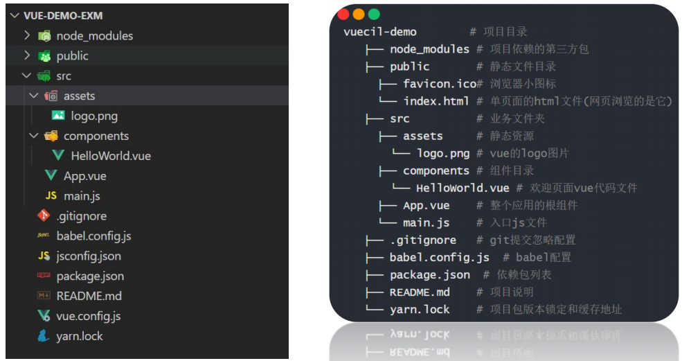
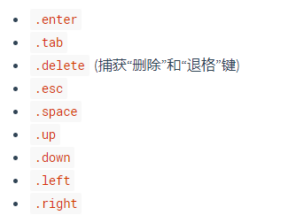

# vue基本概念 


+ 为什么要学习vue   （vue/react/angular）
  + 公司对vue有要求 [BOSS直聘](<https://www.zhipin.com/>)
  + 开发更加的效率和简洁，并且容易维护。

## vue介绍

- [vue 中文网](https://cn.vuejs.org/)  尤雨溪 
- [Vue.js 是什么](https://cn.vuejs.org/v2/guide/index.html#Vue-js-%E6%98%AF%E4%BB%80%E4%B9%88)
- Vue (读音 /vjuː/，类似于 **view**) 是一套用于构建用户界面的**渐进式javascript框架**。  

### 渐进式的概念

渐进式：逐渐增强，可以在项目中使用vue的一部分功能，也可以使用vue的全家桶来管理整个项目。

angular: 全家桶 


### 框架的概念

- [我们所说的前端框架与库的区别？](https://zhuanlan.zhihu.com/p/26078359?group_id=830801800406917120)

**Library**

+ 代表：moment  axios

+ 库，本质上是一些函数的集合。每次调用函数，实现一个特定的功能   工具箱

- 使用库的时候，把库当成工具使用，需要自己控制代码的执行逻辑。

**Framework**

+ 代表：vue、angular、react、bootstrap

+ 框架，是一套完整的解决方案

- 使用框架的时候，框架实现了大部分的功能，我们只需要按照框架的规则写代码

**库和框架的区别**

+ 使用库的时候，很自由，只要调用库提供的各种各样的方法就行，也可以不用其他的一些方法
+ 使用框架的时候，需要按照框架的规则写代码，限制会非常多，但同时框架的功能也很强大，可以极大的提升开发的效率。


### vue是 MVVM 的框架

+ MVVM思想：一种软件架构模式，决定了写代码的方式。
  + M：model数据模型(ajax获取到的数据)	
  + V：view视图（页面）
  + VM：ViewModel 视图模型  （既能操作View视图，又能操作Model数据模型）

- MVVM通过**`数据双向绑定`**让数据自动地双向同步  **不在需要操作DOM**
  - V（修改视图） -> M（数据自动同步）
  - M（修改数据） -> V（视图自动同步）


**1. 在vue中，不推荐直接手动操作DOM！！！**     

**2. 在vue中，通过数据驱动视图，不要在想着怎么操作DOM，而是想着如何 操作数据！！ 数据变化，视图自动更新**


### vue组件化思想

组件化：一个组件会包含（HTML+CSS+JS），完整的页面可以拆分成多个组件。

组件化优点：

1. 容易维护
2. 便于复用（HTML+CSS+JS）

## 开发vue的方式

开发vue有两种方式   

+ 传统开发模式：基于html/css/js文件开发vue 
+ **工程化开发方式：在webpack环境中开发vue，这是最推荐的方式。**
+ 现代化的项目也都是在webpack环境下进行开发的。


# vue-cli的使用

> `vue-cli`也叫**vue脚手架**,`vue-cli`是vue官方提供的一个全局命令工具，这个命令可以帮助我们**快速创建一个vue项目的基础架**子。

+ 开箱即用
+ 零配置（不用你配置webpack）
+ webpack、babel

## 基本使用

+ 全局安装命令 

```bash
npm install -g @vue/cli
# OR
yarn global add @vue/cli
```

+ 查看版本`vue`

```js
vue --version  vue -V
```

+ 找个目录，初始化一个vue项目

```js
vue create 项目名(不能用中文)
```

+ cd 进入目录，**启动项目**，打包项目

```
启动项目： yarn serve  或 npm run serve
打包项目： yarn build  或 npm run build
```


## 如何覆盖webpack配置

> 注意：我们在项目无法找到webpack.config.js文件，因为vue把它隐藏。

如果需要覆盖webpack的配置，可以修改vue.config.js文件，覆盖webpack配置文件

```jsx
//这个文件 => 提供我们需要覆盖的webpack配置
//想改webpack配置 => 在这个文件写
const { defineConfig } = require('@vue/cli-service')
module.exports = defineConfig({
    transpileDependencies: true,
    devServer: {
        port: 3000 //修改端口号，将webpack配置的默认端口进行修改
    }
})
```


## 目录分析与清理



+ **public/index.html不用动，提供一个最基础的页面**

  ```html
  
  <body>
      <!-- vue写的主流的应用 => 单页应用程序 => 一个页面就是一个项目(登录/注册/首页) -->
      <noscript>
        <strong>We're sorry but <%= htmlWebpackPlugin.options.title %> doesn't work properly without JavaScript enabled. Please enable it to continue.</strong>
      </noscript>
  
      <!-- 页面容器：承载展示组件的,这个容器的所有内容，将来通过组件动态渲染 -->
      <div id="app">
          <!-- 这里不写任何东西！！！ -->
      </div>
  
      <!-- 打包构建后的代码，会被自动引入 -->
      <!-- built files will be auto injected -->
  </body>
  ```

+ **src/main.js不用动，  渲染了App.vue组件**

  ```js
  // 导入 vue 核心包
  import Vue from 'vue'
  //导入 要渲染的 根组件
  import App from './App.vue'
  
  //配置说明信息的配置，默认即可，不用动
  Vue.config.productionTip = false
  
  //创建 vue 根实例，利用创建出来的根实例，渲染 index.html 的 div 盒子
  new Vue({
      render: h => h(App), //使用app组件进行渲染
  }).$mount('#app')
  
  // $mount('#app')=>挂载：得到结构后，渲染 index.html 的 div 盒子
  ```

+ **src/App.vue默认有很多的内容，可以全部删除**

```jsx
<template>
  <div>123</div>
</template>
```

+ **assets文件夹与components直接删除**


## vue单文件组件的说明

**一个`.vue`文件就是一个组件**,后续开发vue，所有的功能都是基于组件实现。

安装插件 (安装：Vue Language Features   和   ESLint  和  Vetur)


一个单文件组件由三部分构成

+ template(必须)      影响组件渲染的结构  html   （只能有一个根元素）

+ script                      逻辑   js

+ style                        样式   css less scss       style用于提供组件的样式，默认只能用css

  

  让组件支持 less

  **style标签，`lang="less"`开启less的功能**

  需要安装依赖包

```
yarn add less-loader@7.2.1 less -D
```


单文件组件的三个组成部分.vue

```vue
<template>
  <!-- 组件化思想：将一个完整的页面，拆分成一个个的小组件。每个组件包含结构、样式、行为！ -->
  <!-- template :结构 有且只能一个根元素 -->
  <div>
    <div class="one">
      <div class="son">{{ money }}</div>
    </div>
    <div>{{ msg }}</div>
    <div>{{ obj.desc }}</div>
    <button>按钮</button>
    <input type="text">
  </div>
</template>

<script>
// js 逻辑

  //核心代码 : 需要在script中，导出 当前vue组件 <js 配置项> （对象）
  export default {
      //vue中约定了固定的一些配置项，我们必须记忆这些配置项，达成想要的效果
      //data：函数，函数中需要return一个对象，用以提供数据
      data() {  //data:function(){}

            //return出去的对象 =>数据源，将来就是vue组件的数据
            return {
              money: 100,
              msg: 'hello',
              obj:{
                desc:'good'
              }
            }
      }
  }
</script>

<style lang="less">
  //关于less的支持，脚手架内部已经配好了，只不过，不会帮你默认装这个包
  //原则：你用到了less，你在装这个包  yarn add less-loader@7.2.1 less -D
.one {
  width: 200px;
  height: 100px;
  background-color: pink;
  .son {
    width: 50px;
    height: 50px;
    background-color: orange;
  }
}
</style>
```


# vue的插值表达式

## vue通过data提供数据

> vue中通过template可以提供模板，但是这样的数据是写死的。

vue可以通过data提供数据，注意：`data必须是一个函数，并且返回一个对象`

```jsx
<script>
export default {
  data () {
    return {
      money: 100,
      msg: 'hello'
    }
  }    
}
</script>
```


## 通过插值表达式显示数据

插值表达式, 小胡子语法  mustach语法` {{  }}`

1. 作用:  使用 data 中的数据渲染视图（模板）

2. 基本语法, 支持三元运算符

   ```jsx
   {{ msg }}
   {{ obj.name }}
   {{ msg.toUpperCase() }} /转大写
   {{ obj.age > 18 ? '成年' : '未成年' }}
   ```

3. vue中插值表达式的注意点

   (1)  使用的数据在 data 中要存在

   ```html
   //初学者，一定要注意，模板中使用的变量 和 data 中的变量名要统一
   //使用的数据，要在data中存在
//Property or method "xxx" is not defined => 你用的这个变量，它找不到
   <h1>{{ gaga }}</h1>
   ```

​         (2)  能使用表达式, 但是不能使用 if  for 

```html
 <h1>{{ if(obj.age>18){}}</h1>  
```

​         (3)  不能在标签属性中使用

   ```jsx
   <h1 id="box" class="box" title="{{ msg }}"></h1>  //不能在标签属性中使用{{}} 语法已被废弃    v-bind
   
   /正常标签的内容部分，可以使用 {{ }} 设置内容
   <h1 id="box" class="box" title="">{{ msg }}</h1> /t
   ```

## 安装vue开发者工具

+ 直接通过谷歌应用商店安装  需要梯子
+ 通过极简插件下载插件，本地安装。 https://chrome.zzzmh.cn/index

# vue指令

**vue指令, 实质上就是特殊的 html 标签 属性, 特点:  v- 开头**

每个 v- 开头的指令, 都有着自己独立的功能, 将来vue解析时, 会根据不同的指令提供不同的功能

## v-bind指令

- 描述：插值表达式不能用在html的属性上，如果想要动态的设置html元素的属性，需要使用v-bind指令
- 作用：**动态的设置html的属性**
- 语法：`v-bind:属性名="变量"`
- 简写：`:属性名="值"`

```jsx
<!-- 完整语法 -->
<a v-bind:href="url">去百度</a>
<div v-bind:title="hh">123</div>

<!-- 缩写 -->
<a :href="url">去百度</a>
<div :title="hh">123</div>


<script>
export default {
      data () {
        return {
          hh:'哈哈',
          url:'http://www.baidu.com'
        }
      }
}
</script>

/强调：
//  给标签设置属性
//  title="abc"    设置title属性,值是 'abc' 字符串 （写死的）
//  :title="abc"   设置title属性,值是 abc 变量，要去data 中取值的！！！！！
```

## v-on指令

### 基本使用

> 注册事件

语法：

**v-on:事件名=“要执行的少量代码"**
**v-on:事件名=“methods中的函数名"**

**v-on:事件名=“methods中的函数名(实参)"** 

**v-on 可以简写成 @**    **@事件名="xxx"**

+ 最基本的语法

  + `<button v-on:事件名="事件函数">按钮</button>`，需要在methods中提供事件处理函数

  ```jsx
      <!--         
           当点击时，就会执行下面的函数
  =====>2. v-on:事件名 = "methods中的函数名"
       -->
       <h3>银行卡余额:{{ money }}</h3>
       <button v-on:click="addMoney">开小卖部一个月</button>
       <button v-on:click="minusMoney">享受一小时</button>
  
  <script>
  export default {
      //data里面 用于存放 数据，只有值会经常发生变化的才会放到data中
      //methods 里面 用于存放 方法，方法是用于调用的 
       data () {
        return {
          money:10000   //这里提供的所有 data 的属性值，都会被挂载到 vue 实例上
        }
       },
       methods:{
        // methods中如果要访问或修改 data 中的数据， this.xxx = '值'
        // methods所有方法中的 this，指向当前vue实例 (vue内部绑好了)
        // 存放记录所有的方法
        addMoney() {
          //console.log(this)
          this.money+=8000     //methods中的所有函数都可以通过 this 访问当前组件
        },
        minusMoney() {
          this.money--
        }
       }
  }
  </script>
  ```

+ 需要传递参数

  + `<button v-on:事件名="事件函数(参数)">按钮</button>`，需要在methods中提供事件函数，接受参数

  ```jsx
      <!-- 
        3. v-on:事件名 = "methods中的函数名(传参1,传参2,...)"
       --> 
  
       <h3>银行卡余额:{{ money }}</h3>
       <button v-on:click="eat('销冠')">请销冠吃饭</button>
       <button v-on:click="eat('秘书')">请秘书吃饭</button>
  
  <script>
  export default {
      data () {
          return {
              money:10000
          }
      },
      methods: {
        eat(person) {
          if(person === '销冠') {
            this.money-=800
          }
          if(person === '秘书') {
            this.money-=900
          }
        }
      }
  }
  </script>
  ```

+ 如果事件的逻辑足够简单，可以不提供函数

```jsx
   <!-- 
      1. v-on:事件名 = "要执行的少量代码"
         当逻辑，只有一句话，就可以执行完毕 => 少量代码，可以直接写在代码中
     -->
     <h3>银行卡余额:{{ money }}</h3>
     <button v-on:click="money++">搬砖</button>
     <button v-on:click="money +=2">搬两块砖</button>

<script>
export default {
     data () {
      return {
        money:10000
      }
     }
}
</script>
```


### vue中获取事件对象(了解)

需求: 默认a标签点击会跳走,  希望阻止默认的跳转, 阻止默认行为  e.preventDefault()

vue中获取事件对象

(1) 没有传参, 通过形参接收 e

(2) 传参了, 通过$event指代事件对象 e

```jsx
<template>
  <div id="app">
    <a @click="fn" href="http://www.baidu.com">去百度</a>
    <a @click="fn2('女朋友', $event)" href="http://www.taobao.com">去淘宝</a>
  </div>
</template>        /$event 在模板中使用，可以获取到事件的形参 fn2的形参，就是点击事件的形参 event

methods : {
  fn(e) {
      console.log('去百度')
      e.preventDefault()
  },
  fn1(person,e) {
    console.log(person,'去淘宝')
    e.preventDefault()
  }
}
```

### v-on 事件修饰符

- vue中提供的事件修饰符，可以快速的 阻止默认行为 或 阻止冒泡

  **.prevent**    阻止默认行为       @事件名.prevent  ------>   e.preventDefault()

  **.stop**           阻止冒泡               @事件名.stop       ------->   e.stopPropagation()

```jsx
<div @click="fatherFn" id="app">
  <a @click.prevent="fn" href="http://www.baidu.com">去百度</a>
  <a @click.prevent.stop="fn1('冒泡')" href="http://www.taobao.com">去淘宝</a>  
</div>    /.prevent.stop 连用
```

### 按键修饰符

需求: 用户输入内容, 回车, 打印输入的内容

在监听键盘事件时，我们经常需要判断详细的按键。此时，可以为键盘相关的事件添加按键修饰符

- @keyup.enter  回车

- @keyup.esc  返回

```html
<div id="app">
  <input type="text" @keyup="handleKeyup"> <button>搜索</button><hr>
  <input @keyup.enter="fn" type="text"><button>搜索</button>
</div>

<script>
export default {
     methods:{
      /* handleKeyup(e) {
        if(e.key === 'Enter') {
          console.log('开始搜索')
        }  
      } */
      fn() {
          console.log('开始搜索') 
      }
     }
}
</script>
```



## v-if 和 v-show

### 基本使用

v-show 和 v-if 功能: 控制盒子的显示隐藏

1. v-show

   语法:  v-show="布尔值"    (true显示, false隐藏)

   原理:  实质是在控制元素的 css 样式,  `display: none;`

2. v-if   

   语法: v-if="布尔值"   (true显示, false隐藏)

   原理:  实质是在动态的**创建 或者 删除**元素节点

应用场景: 

- 如果是频繁的切换显示隐藏, 用 v-show

  v-if, 频繁切换会大量的创建和删除元素, **消耗性能**

- 如果是不用频繁切换, 要么显示, 要么隐藏的情况, 适合于用 v-if

  v-if 是惰性的, 如果初始值为 false, 那么这些元素就直接不创建了, 节省一些初始渲染开销

```html
<template>
  <div id="app">
    <!-- 模板中访问数据，无需 this. -->
       <button @click="isShow = !isShow">控制显示和隐藏</button>
       <!-- v-show="布尔值" true显示 false隐藏
      原理：控制css display：none
        -->
       <div v-show="isShow">我是v-show控制的盒子</div>
       <!-- v-if="布尔值" true显示 false隐藏 
       原理：动态删除 或 创建元素 (控制页面有无该节点)
       -->
       <div v-if="isShow">我是v-if控制的盒子</div>
  </div>
</template>

<script>
export default {
     data () {
      return {
        isShow:true
      }
     }
}
</script>
```

### v-else 和 v-else-if

```js
<template>
  <div id="app">
    <h3 v-if="flag">尊敬的svip,里面请</h3>
    <h3 v-else>你谁啊，请先登录</h3>

    <hr>

    <h3 v-if="age>=60">60岁以上,跳广场舞</h3>
   //中间不能加div，不能断，需要连着写
    <h3 v-else-if="age>=40">40岁以上,搓麻将</h3>
    <h3 v-else-if="age>=30">30岁以上,蹦迪</h3>
    <h3 v-else-if="age>=18">18岁以上,唱跳rap</h3>
    <h3 v-else>未成年,看动画片</h3>
  </div>
</template>

<script>
//联系js中的 if else / else if
//问题： if else / else if 需要连着写
export default {
   data () {
    return {
      flag:false,
      age:2
    }
   }
}
</script>
```

### 案例-折叠面板

需求: 点击展开或收起时，把内容区域显示或者隐藏


```jsx
/控制页面文字的显示切换，我们可以怎样的操作？
//插值表达式{{ }} 配合三元运算符
<template>
  <div id="app">
    <h3>案例：折叠面板</h3>
    <div class="box">
      <div class="title">
        <h4>芙蓉楼送辛渐</h4>
        <!-- 按钮位置 -->
        <span class="btn" @click="isShow = !isShow">
          {{ isShow ? '收起' : '展开' }}
        </span>
      </div>

      <!-- 切换显示隐藏的部分 (数据驱动) -->
      <div v-show="isShow" class="container">
        <p>寒雨连江夜入吴,</p>
        <p>平明送客楚山孤。</p>
        <p>洛阳亲友如相问，</p>
        <p>一片冰心在玉壶。</p>
      </div>
    </div>
  </div>
</template>

<script>
export default {
  data() {
    return {
      isShow: true
    }
  }
}
</script>

<style lang="less">
body {
  background-color: #ccc;
  #app {
    width: 400px;
    height: 320px;
    margin: 20px auto;
    background-color: #fff;
    border: 4px solid blueviolet;
    border-radius: 1em;
    box-shadow: 3px 3px 3px rgba(0, 0, 0, 0.5);
    padding: 1em 2em 2em;
    h3 {
      text-align: center;
    }
    .box {
      box-shadow: 0 1px 4px 0 rgba(0, 0, 0, 0.5);
      border-radius: 4px;
      border: 1px solid #ebeef5;
      background-color: #fff;
      overflow: hidden;
      color: #303133;
      transition: .3s;
    }
    .title {
      display: flex;
      justify-content: space-between;
      align-items: center;
      padding: 10px 20px;
    }
    .title h4 {
      line-height: 2;
      margin: 0;
    }
    .container {
      padding: 0 20px;
      border-top: 1px solid #ccc;
    }
    .btn {
      /* 鼠标改成手的形状 */
      cursor: pointer;
    }
  }
}
</style>
```


## v-model

### 基本使用

**作用: 给表单元素使用, 双向数据绑定 ** 

1. 数据变化了, 视图会跟着变

2. 视图变化了, 数据要跟着变

   输入框内容变化了(监听用户的输入, 监听input事件), 数据要跟着变

语法: v-model='值'

```jsx
<template>
  <div id="app">
        <!-- v-model：给表单元素使用,实现双向数据绑定 
        语法：v-model="变量值"
        作用：可以快速 收集 或 设置 表单信息，实现双向数据绑定
        -->
      姓名： <input type="text" v-model="username"> <br>
      密码： <input type="text" v-model="password"> <br>
      <button @click="login">登录</button>
      <button @click="reset">重置</button>
  </div>
</template>

<script>
export default {
    data () {
      return {
        username:'',
        password:''
      }
    },
    methods: {
      login() {
        console.log('用户名：',this.username)
        console.log('密码：',this.password)
      },
      reset() {
        this.username = '',
        this.password = ''
      }
    }
}
</script>
```


### v-model 处理其他表单元素

**v-model 会忽略掉表单元素原本的value, checked等初始值**

textarea, select, checkbox

```jsx
<template>
  <div id="app">
    <!-- v-model 可以和表单实现双向数据绑定 => 可以快速获取 或 设置表单 -->
    <select v-model="cityId">
      <option value="101">安徽</option>
      <option value="102">南京</option>
      <option value="103">上海</option>
    </select> {{ cityId }}

    <hr>

    是否单身：<input type="checkbox" v-model="isSingle">

    <hr>

    <textarea v-model="desc"></textarea> {{desc}}
  </div>
</template>

<script>
export default {
    data () {
      return {
        cityId: '103',
        isSingle:false,
        desc:''
      }
    }
}
</script>
```


### v-model 修饰符

- number

  如果想自动将用户的输入值, 用parseFloat转成数字类型, ，可以给 `v-model` 添加 `number` 修饰符：

  ```html
  <input v-model.number="age" type="number">
  ```

  如果这个值如果这个值无法转数字，则会返回原始的值。

- trim

  如果要自动过滤用户输入的首尾空白字符，可以给 `v-model` 添加 `trim` 修饰符：

  ```html
  <input v-model.trim="msg">
  ```

- lazy

  在`change`时触发，而非`input`时更新，可以给 `v-model` 添加 `lazy` 修饰符：

  ```jsx
  <input v-model.lazy="msg">  //change时触发
  ```

```jsx
<template>
  <div id="app">
    <!-- number 尝试将输入的内容，能转数字就转数字，如果转不了，不乱改 -->
    年纪：<input type="text" v-model.number="age"> <br><br>

    <!-- trim 去掉首尾空格 -->
    标题：<input type="text" v-model.trim="title"> <br><br>

    <!-- lazy   input事件，实时修改实时触发 /  change事件，失去焦点或回车触发 -->
    描述：<input type="text" v-model.lazy="desc"> <br><br>
  </div>
</template>

<script>
export default {
    data () {
      return {
        age:18,
        title:'大标题',
        desc:'号外号外~今天是陨石落地的日子'
      }
    }
}
</script>
```


## v-text 和 v-html

### v-text指令

- 解释：更新元素的 `textContent/innerText`。如果要更新部分的 `textContent` ，需要使用 `{{ Mustache }}` 插值。 

```html
<h1 v-text="msg"></h1>
```

### v-html指令

- 解释：更新DOM对象的` innerHTML`,html标签会生效

```html
<h1 v-html="msg"></h1>
```

**在网站上动态渲染任意 HTML 是非常危险的，因为容易导致 [XSS 攻击](https://en.wikipedia.org/wiki/Cross-site_scripting)。** 

**只在可信内容上使用 `v-html`，**永不**用在用户提交的内容上。** 

```jsx
<template>
  <div id="app">
       <!-- 了解不常用 => 一般常用的是插值表达式  -->
       <div v-text="str1"></div>

       <!-- 当后台返回一些标签节点时，经常会用v-html进行动态解析渲染
            但是永远不要直接直接将用户的输入，直接作为v-html的值，容易造成XSS攻击（跨站脚本攻击）
            用户的输入，可能是一些script脚本 => v-html 解析标签，解析script，执行js，容易有攻击漏洞
        -->
       <div v-html="str2"></div>  
  </div>
</template>

<script>
export default {
   data () {
    return {
      str1:'<a href="#">去百度</a>',
      str2:'<a href="#">去百度</a>',
    }
   }
}
</script>
```


# 综合案例 - 文章标题编辑


```js
<template>
  <div class="article-case">
    <div class="form-preview" v-if="!edit">
      <h2>{{article.title}}</h2>
      <small v-if="article.channel">{{article.channel}}</small>
      <a class="btn-edit" href="#" @click="editShow">编辑</a>
    </div>
    <div class="form-edit" v-else>
      <div class="form-item">
        <div class="label">标题：</div>
        <div class="input">
          <input v-model="form.title" type="text" placeholder="请输入标题" />
        </div>
      </div>
      <div class="form-item">
        <div class="label">频道：</div>
        <div class="input">
          <select v-model="form.channel">
            <option value="">请选择频道</option>
            <option value="前端">前端</option>
            <option value="运维">运维</option>
            <option value="测试">测试</option>
          </select>
        </div>
      </div>
      <div class="form-item">
        <div class="label"></div>
        <div class="input">
          <button @click="cancel" class="cancel">取消</button>
          <button @click="submit" class="submit">确认</button>
        </div>
      </div>
    </div>
  </div>
</template>

<script>
//实现思路
//1.控制显示隐藏
//2.进入编辑状态，输入框需要回显(设置输入框的值)
//  （1） v-model 和 单元元素绑定
//  （2） 一显示的时候，设置绑定的变量值
export default {
  name: 'ArticleCase',
  data() {
    return {
      edit: false,  //是否在编辑状态
      article: {
        title: '如何成为一名前端老鸟？',
        channel: '前端',
      },
      form: {
        title: '',
        channel: '',
      },
    };
  },
  methods: {
    editShow() {
      this.edit = true  //改为编辑状态
      //需要将文章的标题 和 频道，设置给form
      this.form = {
        ...this.article    // ...this.article=> 等价于 title: '如何成为一名前端老鸟？',channel: '前端'！！！！！！
      }
    },
    cancel() {
      this.edit = false
    },
    submit() {
      this.edit = false  //关闭编辑状态
      //提交修改，将form的内容更新给article
      this.article = {
        ...this.form
      }
    }
  },
};
</script>

<style scoped lang="less">
.form-preview {
  position: relative;
  display: flex;
  align-items: center;
}
.form-preview h2 {
  font-size: 18px;
  font-weight: normal;
}
.form-preview small {
  font-size: 12px;
  display: inline-block;
  padding: 2px 6px;
  background: #27ba9b;
  color: #fff;
  border-radius: 2px;
  transform: scale(0.8);
}
.form-preview .btn-edit {
  font-size: 12px;
  display: none;
  text-decoration: none;
  color: #069;
  margin-left: 20px;
}
.form-preview:hover .btn-edit {
  display: block;
}
.form-edit {
  padding-top: 20px;
}
.form-item {
  display: flex;
  margin-bottom: 20px;
  align-items: center;
}
.form-item .label {
  width: 60px;
  text-align: right;
  font-size: 14px;
}
.form-item .input {
  flex: 1;
}
.form-item input,
.form-item select {
  appearance: none;
  outline: none;
  border: 1px solid #ccc;
  width: 200px;
  height: 40px;
  box-sizing: border-box;
  padding: 10px;
  color: #666;
}
.form-item input::placeholder {
  color: #666;
}
.form-item .cancel,
.form-item .submit {
  appearance: none;
  outline: none;
  border: 1px solid #ccc;
  border-radius: 4px;
  padding: 4px 10px;
  margin-right: 10px;
  font-size: 12px;
  background: #ccc;
}
.form-item .submit {
  border-color: #069;
  background: #069;
  color: #fff;
}
</style>
```


# vue指令（下）

## v-for 

### 基本使用

 v-for 作用: 遍历对象和数组

1. 遍历数组 (重点)

```jsx
v-for="item in 数组名"           item每一项                      
v-for="(item, index) in 数组名"  item每一项 index下标

注意：item和index不是定死的，可以是任意的名字，但是需要注意 第一项是值  第二项是下标

<ul>
   <li v-for="item in arrList" :key="item">{{item}}</li>
</ul>
<ul>
   <li v-for="(item,index) in arrList" :key="item">{{item}} {{ index }}</li>
</ul>
export default {
   data () {
    return {
      arrList:['苹果','鸭梨','香蕉','榴莲']
    }
   }
```

2. 遍历对象 (一般不用)

```jsx
<!--
  v-for也可以遍历对象（不常用）
  v-for="(值, 键) in 对象名"
-->
<ul>
  <li v-for="value in user" :key="value">{{value}}</li>
</ul>
<ul>
  <li v-for="(value, key) in user" :key="key">{{value}} ---{{key}}</li>
</ul>
```

3. 遍历数字

```jsx
<!-- 
  遍历数字
  语法： v-for="(item, index) in 数字"
  作用：遍历具体的次数 item从1开始  index下标从0开始的
-->
<ul>
  <li v-for="(item, index) in 10" :key="item">{{item}} ---{{index}}</li>
</ul>
<div v-for="(item,index) in 10" :key="item">我是测试的盒子{{index}}</div> //快速生成10个盒子
```


### 虚拟DOM 和 diff算法

**vue就地复用策略：**Vue会尽可能的就地（同层级，同位置），对比虚拟dom，复用旧dom结构，进行差异化更新。


**虚拟dom**: 本质就是一个个保存节点信息, 属性和内容的 描述真实dom的 JS 对象

什么是虚拟dom呢？

对比虚拟dom？差异化更新？ 为啥不对比现成的真实 dom 呢？


**diff算法：**

- 策略1：

  先同层级根元素比较，如果根元素变化，那么不考虑复用，整个dom树删除重建

  先同层级根元素比较，如果根元素不变，对比出属性的变化更新，并考虑往下递归复用。

- 策略2：

  **对比同级兄弟元素时，默认按照下标进行对比复用**。

  **对比同级兄弟元素时，如果指定了 key，就会 按照相同 key 的元素 来进行对比**。
  
  

### v-for 的key的说明

1. 设置 和 不设置 key 有什么区别？

   - 不设置 key， 默认同级兄弟元素按照下标进行比较。
   - 设置了key，按照相同key的新旧元素比较。

   

   

2. key值要求是?

   - 字符串或者数值，唯一不重复
   - 有 id 用 id,  有唯一值用唯一值，实在都没有，才用索引

3. key的好处?

   key的作用：提高虚拟DOM的对比复用性能

​       以后：只要是写到列表渲染，都推荐加上 key 属性。且 key 推荐是设置成 id， 实在没有，就设置成 index


实际工作中的应用

```js
<template>
  <div>
     <ul>
      <li v-for="item in arr" :key="item.id">          
        <span>{{item.name}}</span>
        <input type="text">
      </li>
     </ul>

     <button @click="fn">下标为1的位置新增一个</button>
  </div>
</template>

<script>
export default {
  data () {
    return {
      arr:[
        { id: 1, name: '小明', age: 6},
        { id: 2, name: '小清', age: 6},
        { id: 3, name: '小华', age: 6},
      ]
    }
  },
  methods: {
    fn() {
      this.arr.splice(1,0,{
        id:+new Date(),
        name:'小蓝',
        age:8
      })
    }
  }
}
</script>
```


## 样式处理

###  v-bind 对于class的增强

v-bind 对于类名操作的增强, 注意点, :class 不会影响到原来的 class 属性

**:class="对象/数组"**

```jsx
<template>
  <div id="app">
    <h3>vue当中如何控制样式-控制类名</h3>
    <!-- 
      :class="对象/数组"
      (1) 传对象 :class="obj"
          { 键:值 , 键:值 } 如果值，是true,那么就会有这个类，类名就是对象的键
          { pink: true } 给这个盒子，加上了pink类  
          { pink: false } 这个盒子，不加上pink类 

      (2) 传数组 :class="arr"  (了解)
          [类名1,类名2,类名3,...]  数组里面有的项，就是要添加的类（适合添加多个类）
     -->
    <div class="box" :class="obj"></div>
    <div class="box" :class="{pink:isPink}"></div>

    <div class="box" :class="arr"></div>
  </div>
</template>

<script>
export default {
   data () {
    return {
      obj: {
        pink:true,
        orange:true
      },
      isPink:true,
      arr:['orange','big','circle']
    }
   }
}
</script>

<style lang="less">
    .box {
      width: 200px;
      height: 200px;
      border: 2px solid #000;
      margin: 10px;
    }
    .pink {
      background-color: pink;
    }
    .orange {
      background-color: orange;
    }
    .big {
      width: 250px;
      height: 250px;
    }
    .circle {
      border-radius: 50%;
    }
</style>
```

### v-bind对于style 的增强

```jsx
<template>
  <div>
    <!-- 
      v-bind:style="对象/数组"
            :style="样式对象"
            :style="[样式对象,样式对象]"
     -->
     <div :style="obj"></div>
     <div :style="{backgroundColor:'red',width:'200px',height:'200px'}"></div>

     <div :style="[obj,obj2]"></div>
  </div>
</template>

<script>
export default {
  data () {
    return {
      obj:{
        width:'200px',
        height:'200px',
        backgroundColor:'pink'
      },
      obj2:{
        borderRadius:'50%'
      }
    }
  }
}
</script>
```


# 成绩案例


## 基本结构与样式

```jsx
<template>
  <div class="score-case">
    <div class="table">
      <table>
        <thead>
          <tr>
            <th>编号</th>
            <th>科目</th>
            <th>成绩</th>
            <th>考试时间</th>
            <th>操作</th>
          </tr>
        </thead>
        <tbody>
          <tr >
            <td>1</td>
            <td>语文</td>
            <td class="red">56</td>
            <td>Tue Jun 07 2022 10:00:00 GMT+0800 (中国标准时间)</td>
            <td><a href="#">删除</a></td>
          </tr>
          <tr >
            <td>2</td>
            <td>数学</td>
            <td>100</td>
            <td>Tue Jun 07 2022 10:00:00 GMT+0800 (中国标准时间)</td>
            <td><a href="#">删除</a></td>
          </tr>
        </tbody>
        <!-- <tbody >
          <tr>
            <td colspan="5">
              <span class="none">暂无数据</span>
            </td>
          </tr>
        </tbody> -->
        <tfoot>
          <tr>
            <td colspan="5">
              <span>总分：321</span>
              <span style="margin-left:50px">平均分：80.25</span>
            </td>
          </tr>
        </tfoot>
      </table>
    </div>
    <div class="form">
      <div class="form-item">
        <div class="label">科目：</div>
        <div class="input">
          <input type="text" placeholder="请输入科目" />
        </div>
      </div>
      <div class="form-item">
        <div class="label">分数：</div>
        <div class="input">
          <input type="text" placeholder="请输入分数" />
        </div>
      </div>
      <div class="form-item">
        <div class="label"></div>
        <div class="input">
          <button class="submit" >添加</button>
        </div>
      </div>
    </div>
  </div>
</template>

<script>
export default {
  name: 'ScoreCase',
  data () {
    return {
      list: [
        {id: 15, subject: '语文', score: 89, date: new Date('2022/06/07 10:00:00')},
        {id: 27, subject: '数学', score: 100, date: new Date('2022/06/07 15:00:00')},
        {id: 32, subject: '英语', score: 56, date: new Date('2022/06/08 10:00:00')},
        {id: 41, subject: '物理', score: 76, date: new Date('2022/06/08 10:00:00')}
      ],
      subject: '',
      score: ''
    }
  }
};
</script>

<style lang="less">
.score-case {
  width: 1000px;
  margin: 50px auto;
  display: flex;
  .table {
    flex: 4;
    table {
      width: 100%;
      border-spacing: 0;
      border-top: 1px solid #ccc;
      border-left: 1px solid #ccc;
      th {
        background: #f5f5f5;
      }
      tr:hover td {
        background: #f5f5f5;
      }
      td,
      th {
        border-bottom: 1px solid #ccc;
        border-right: 1px solid #ccc;
        text-align: center;
        padding: 10px;
        &.red {
          color: red;
        }
      }
    }
    .none {
      height: 100px;
      line-height: 100px;
      color: #999;
    }
  }
  .form {
    flex: 1;
    padding: 20px;
    .form-item {
      display: flex;
      margin-bottom: 20px;
      align-items: center;
    }
    .form-item .label {
      width: 60px;
      text-align: right;
      font-size: 14px;
    }
    .form-item .input {
      flex: 1;
    }
    .form-item input,
    .form-item select {
      appearance: none;
      outline: none;
      border: 1px solid #ccc;
      width: 200px;
      height: 40px;
      box-sizing: border-box;
      padding: 10px;
      color: #666;
    }
    .form-item input::placeholder {
      color: #666;
    }
    .form-item .cancel,
    .form-item .submit {
      appearance: none;
      outline: none;
      border: 1px solid #ccc;
      border-radius: 4px;
      padding: 4px 10px;
      margin-right: 10px;
      font-size: 12px;
      background: #ccc;
    }
    .form-item .submit {
      border-color: #069;
      background: #069;
      color: #fff;
    }
  }
}
</style>
```

## 基本渲染

1. v-for 渲染结构
2. v-bind:class 控制样式

```jsx
<tbody>
  <tr v-for="(item, index) in list" :key="item.id">
    <td>{{ index + 1 }}</td>
    <td>{{ item.subject }}</td>
    <td :class="{ red: item.score < 60 }">{{ item.score }}</td>
    <td>{{ item.date }}</td>
    <td><a @click.prevent="del(item.id)" href="#">删除</a></td>
  </tr>
</tbody>
```


## 删除

删除思路：

1. 注册点击事件，传递参数，阻止默认行为
2. 在method中提供对应函数
3. 根据id删除对应项
4. 控制 tbody 展示

```jsx
<tbody v-if="list.length">
  <tr v-for="(item, index) in list" :key="item.id">
    <td>{{ index + 1 }}</td>
    <td>{{ item.subject }}</td>
    <td :class="{ red: item.score < 60 }">{{ item.score }}</td>
    <td>{{ item.date }}</td>
    <td><a @click.prevent="del(item.id)" href="#">删除</a></td>
  </tr>
</tbody>
<tbody v-else>  //删完了显示这个
  <tr>
    <td colspan="5">
      <span class="none">暂无数据</span>
    </td>
  </tr>
</tbody>


methods: {      // 根据 id 唯一标识（发请求 / 数组直接删）
  del (id) {    //删除某一项 => 过滤出所有不是该id的项  filter
    this.list = this.list.filter(item=>item.id !== id)
  }   
}
```


## 新增

添加思路：

1. 获取科目 和 分数
2. 给添加按钮注册点击事件
3. 给list数组添加一个对象
4. 重置表单数据

```jsx
<div class="form">
  <div class="form-item">
    <div class="label">科目：</div>
    <div class="input">
      <input v-model.trim="subject" @keyup.enter="add" type="text" placeholder="请输入科目" />
    </div>
  </div>
  <div class="form-item">
    <div class="label">分数：</div>
    <div class="input">
      <input v-model.number="score" @keyup.enter="add" type="text" placeholder="请输入分数" />
    </div>
  </div>
  <div class="form-item">
    <div class="label"></div>
    <div class="input">
      <button class="submit" @click="submit">添加</button>
    </div>
  </div>
</div>

data () {
    return {
      list: [
        {id: 15, subject: '语文', score: 89, date: new Date('2022/06/07 10:00:00')},
        {id: 27, subject: '数学', score: 100, date: new Date('2022/06/07 15:00:00')},
        {id: 32, subject: '英语', score: 56, date: new Date('2022/06/08 10:00:00')},
        {id: 41, subject: '物理', score: 76, date: new Date('2022/06/08 10:00:00')}
      ],
      subject: '',  //科目
      score: ''     //成绩
    }
  },
methods: {
  submit () {
    if (this.subject && (this.score >= 0 && this.score <= 100)) {
      // 提交
      this.list.push({
        id: this.list.length ? this.list.length + 1 : 0, //id: +new Date() //时间戳，数字类型，以时间戳作为唯一的id
        subject: this.subject,
        score: this.score,
        date: new Date()  //正常日期
      })
      this.subject = ''
      this.score = ''
    } else {
      alert('输入内容不正确')
    }
  },
      
  ...
}
```

## 处理日期格式

+ 安装moment

```jsx
yarn add moment
```

+ 引入moment 

```jsx
import moment from 'moment'
```

+ 定义格式化时间的函数

```jsx
methods: {
  	// 格式化时间
    formatDate(date) {
        return moment(date).format('YYYY-MM-DD HH:mm:ss')
    }
}
// 计算属性只要计算了一次，就会把结果缓存起来，以后多次使用计算属性，直接使用缓存的结果，只会计算一次。
// 计算属性依赖的属性一旦发生了改变，计算属性会重新计算一次，并且缓存
export default {
  data () {
    return {
      msg: 'hello'
    }
  },
  computed: {
    reverseMsg() {
      console.log('我执行了')
      return this.msg.split('').reverse().join('')
    }
  }
}
```

+ 页面中格式化使用

```jsx
<td>{{ formatDate(item.date) }}</td>
```


# 计算属性

## 基本使用

需求：翻转字符串案例

> 计算属性是一个属性，写法上是一个函数，这个函数的返回值就是计算属性最终的值。

> 1. 计算属性必须定义在 computed 节点中

> 2. 计算属性必须是一个 function,计算属性必须有返回值

> 3. 计算属性不能被当作方法调用,当成属性来用

定义计算属性

```jsx
// 组件的数据： 需要计算的属性
computed: {
  reverseMsg () {                                        //"计算属性名" () { return '值' }
    return this.msg.split('').reverse().join('')
  }
}
```

使用计算属性   **计算属性也是属性，所以不要和data里重名，用起来也和data类似**

```jsx
<p>{{ reverseMsg }}</p>
```

```js
<template>
  <div>
     <h3>计算属性</h3>
     <input v-model.number="num1" type="text">+
     <input v-model.number="num2" type="text">=
     <span>{{sum}}</span>
  </div>
</template>

<script>
export default {
  //结论：组件的配置项中，第一层 data computed methods... 只有data是一个函数
  //其他配置项一律是对象，配置项里面放什么，就看这个是什么配置项

  //methods => 内部，各种函数
  //computed => 内部，各种函数，且每个函数需要有返回值
   data () {
    return {
      num1:1,
      num2:2
    }
   },
   computed:{
    //在computed 的函数中，this也是指向当前vue实例
    //一旦计算属性依赖的值，变化了，会自动重新计算
      sum() {
        return this.num1+this.num2
      }
   }
}
</script>
```


## 计算属性的缓存的问题

计算属性： 缓存

计算属性只要计算了一次，就会把结果缓存起来，以后多次使用计算属性，直接使用缓存的结果，只会计算一次。

计算属性依赖的属性一旦发生了改变，计算属性会重新计算一次，并且缓存

```jsx
<template>
  <div>
     <h3>计算属性</h3>
     <input v-model.number="num1" type="text">+
     <input v-model.number="num2" type="text">=
     <hr>
     <p>计算属性算出的结果：</p><span>{{sum}}</span>
     <p>函数算出的结果：</p><span>{{sumFn()}}</span>  <!-- 函数要加括号 -->
     
  </div>
</template>
<script>
export default {
   data () {
    return {
      num1:1,
      num2:2
    }
   },
   methods:{
     sumFn() {
      console.log('函数运算了')
      return this.num1+this.num2
     }
   },
   computed:{
    //在computed 的函数中，this也是指向当前vue实例
    //一旦计算属性依赖的值，变化了，会自动重新计算
    //注意：计算属性相比于函数的优势 => 多次使用时，计算属性有缓存，性能大大的优先！
      sum() {
        console.log('计算属性求和了')
        return this.num1+this.num2
      }
   }
}
</script>
```


## 成绩案例-计算属性处理总分 和 平均分

+ 在computed中提供计算属性

```jsx
computed: {
    total () {
      //sum 上一次累加的结果，第一次就是后面传递的累加初始值
      //return 内函数的return 值，就是本次累加完的结果，给到下一次的sum
      return this.list.reduce((sum,item)=> {  
           return sum + item.score
      },0)
    },
    average () {
    const result = this.list.length>0? this.total / this.list.length : 0
    return result.toFixed(2) //保留两位小数
    }
   }
//在模板中直接渲染计算属性
<tfoot>
  <tr>
    <td colspan="5">
      <span>总分：{{total}}</span>
      <span style="margin-left:50px">平均分：{{average}}</span>
    </td>
  </tr>
</tfoot>
```


## 计算属性的设置问题-完整写法

1. 计算属性默认情况下只能获取，不能修改。
2. 要给计算属性赋值，就必须写计算属性的完整写法！

```jsx
/* 
  computed: {
    full() {},
    full: {
      get() {
        return this.first + ' ' + this.last
      },
      set(value) {
           ...
      }
    }
  }
*/
<template>
  <div>
    <input v-model="name1" type="text">+
    <input v-model="name2" type="text">=
    <span>{{fullName}}</span>
    <button @click="changeName" >修改名字</button>
  </div>
</template>

<script>
export default {
   data () {
    return {
      name1:'欧阳',
      name2:'霸天'
    }
   },
   methods: {
    changeName() {
      this.fullName = '慕容-云海'
    }
   }
   ,
   //计算属性
   computed: {
   //默认只配置了获取
   /*  fullName() {
      return this.name1 + this.name2
    } */

    //既要获取又要设置,需要写完整写法
    fullName: {                     //注意这里
      get() {
        return this.name1+ '-'+ this.name2
      },
      //就算是设置了计算属性，也不是直接改成功
      //要基于修改的值，更新依赖项，依赖项更新，计算属性自然而然就会更新
      set(value) {
          this.name1 = value.split('-')[0],
          this.name2 = value.split('-')[1]
      }
    }
   }
}
</script>
```

## 小案例- 全选反选

> 目标: 完成全选和反选的功能

注意: 小选框都选中(手选/点反选), 全选自动选中

图示:


标签和数据准备(可复制):

```vue
<template>
  <div>
    <span>全选:</span>
    <input type="checkbox" />
    <button >反选</button>
    <ul>
      <li >
        <input type="checkbox" />
        <span>名字</span>
      </li>
    </ul>
  </div>
</template>

<script>
export default {
  data() {
    return {
      arr: [
        {
          name: "猪八戒",
          c: false,
        },
        {
          name: "孙悟空",
          c: false,
        },
        {
          name: "唐僧",
          c: false,
        },
        {
          name: "白龙马",
          c: false,
        },
      ],
    };
  }
};
</script>

<style>
</style>
```

正确答案(==不可复制==):

```html
<template>
  <div>
    <span>全选:</span>
    <!-- 4. v-model 关联全选 - 选中状态 -->
    <input type="checkbox" v-model="isAll"/>
    <button @click="btn">反选</button>
    <ul>
      <li v-for="(item, index) in arr" :key="item">
        <!-- 3. 对象.c - 关联 选中状态 -->
        <input type="checkbox" v-model="item.c"/>
        <span>{{ item.name }}</span>
      </li>
    </ul>
  </div>
</template>

<script>
// 目标: 小选框 -> 全选
// 1. 标签+样式+js准备好
// 2. 把数据循环展示到页面上
export default {
  data() {
    return {
      arr: [
        {
          name: "猪八戒",
          c: false,
        },
        {
          name: "孙悟空",
          c: false,
        },
        {
          name: "唐僧",
          c: false,
        },
        {
          name: "白龙马",
          c: false,
        },
      ],
    };
  },
  //计算属性的使用场景
  //1.求和，求总价，计算求值...
  //2.全选反选...
  computed: {
    isAll: {
      get(){
        //必须每一个小选框都选中，isAll 才为true
        //every
      return  this.arr.every(item => item.c === true)
      },
      set(value){
        // 7. 全选框 - 选中状态(true/false)
        //value 就是我们设置的全选框的新状态，需要让所有的小选框同步
        this.arr.forEach(item => item.c = value) //一个 = 赋值
      }
    }
  },
  methods: {
    btn(){
      // 8. 让数组里对象的c属性取反再赋予回去
      this.arr.forEach(item => item.c = !item.c)
    }
  }
};
</script>

<style>
</style>
```


# 属性监听

## 基本使用

当需要监听某个数据是否发生改变，就要用到watch

```jsx
/* 
  watch: {
    // 只要属性发生了改变，这个函数就会执行
    属性: function () {
    }
  }
*/
watch: {
  // 参数1： value    变化后的值
  // 参数2： oldValue 变化前的值
  msg (newValue, oldValue) {
    console.log('你变了', value, oldValue)
  }
}
```

```js
<template>
  <div>
    <h3>银行卡余额</h3>
  <button @click="money+=2000">发工资</button>
  <hr>
  <div>{{obj}}</div>
  <button @click="obj.age++">过了一年</button>
  <hr>
  <div>{{person}}</div>
  <button @click="person.name = '大鹏'">偷偷改名</button>
  <button @click="person.age = 80">偷偷改年纪</button>
  </div>
</template>

<script>
export default {
  //组件的配置项中，除了data是函数，其它一律是对象
   data () {
    return {
      //需求：只要我卡里的钱，发生了变化，就发个短信通知我
      money:100,
      obj:{
        name:'小清',
        age:18 
      },
      person:{
        name:'小明',
        age:22,
        desc:'喜欢夜跑'
      }
    }
   },
   watch: {
    //1.监视简单类型
    //提供数据变化的处理函数
    'money' (newVal,oldVal) {
      console.log('尊敬的用户，您卡里的余额为：',newVal,'原：',oldVal)
    },
    //监视小清的年纪
    'obj.age' (newVal,oldVal) {
        console.log('小清你变了，年纪：',newVal,'之前：',oldVal)
    },
    //2.监视整个obj对象（复杂类型）=> 复杂类型中的任何一个属性发生了变化，我都要执行
    //需要深度监视，需要写监视的完整写法
    /* person (newVal,oldVal) {
      console.log(newVal,oldVal)
    } */
    person : {
      deep:true, //深度监视
      //数据变化的处理函数
      //对于复杂类型的监视，oldVal 和 newVal 会指向同一个对象，所以值相同，oldVal无意义
      handler (newVal) {  
          console.log(newVal)
      }
    }
   }
}
</script>
//非业务需求：尽可能不要直接深度监视 => 相对消耗性能
//如果是业务需求，就需要深度监视，就正常监视即可
```


## 复杂类型的监听-监听的完整写法

> 如果监听的是复杂数据类型，需要深度监听，需要指定deep为true,需要用到监听的完整的写法

```jsx
// 1. 默认情况下，watch只能监听到简单类型的数据变化,如果监听的是复杂类型，只会监听地址是否发生改变，不会监听对象内部属性的变化。
// 2. 需要使用监听的完整写法 是一个对象
watch: {
  // friend (value) {
  //   console.log('你变了', value)
  // }
  friend: {
    // handler 数据发生变化，需要执行的处理程序
    // deep: true  如果true,代表深度监听，不仅会监听地址的变化，还会监听对象内部属性的变化
    // immediate: 立即 立刻  是否立即监听 默认是false  如果是true,代表页面一加载，会先执行一次处理程序
    handler (value) {
      console.log('你变了', value)
    },
    deep: true,
    immediate: true  //立即执行，是否一进入页面，就执行
  }
},
```

## 成绩案例-监听数据进行缓存

+ 监听list的变化

```jsx
//1.监视list的变化
//2.一旦list变化，将变化后的数据，存到本地
//3.一进入页面，优先从本地读取
watch: {
  list: {
    deep: true,
    handler(newVal) {//复杂类型存本地，需要先转JSON
      localStorage.setItem('list', JSON.stringify(newVal))
    }
  }
},
```

+ 获取list数据的时候不能写死，从localStorage中获取

```jsx
data() {
  return {
    //优先从本地读取数据
      //如果本地取到了数据，那么就用本地的数据
      //如果本地没有取到数据，那么就用后面备用的
    list: JSON.parse(localStorage.getItem('list')) || [
        {id: 15, subject: '语文', score: 89, date: new Date('2022/06/07 10:00:00')},
        {id: 27, subject: '数学', score: 100, date: new Date('2022/06/07 15:00:00')},
        {id: 32, subject: '英语', score: 56, date: new Date('2022/06/08 10:00:00')},
        {id: 41, subject: '物理', score: 76, date: new Date('2022/06/08 10:00:00')}
      ],
    subject: '',
    score: '',
  }
}
//  || 除了正常的逻辑判断外，还可以用于指定默认值

function add(a,b) {
    a = a||0  // 如果前面的值为真，取前面的值，如果前面的值为假，就取后面的值
    b = b||0
    console.log(a+b)
}
add(1)
```


# vscode断点调试

前言：作为前端开发，我们经常会遇到代码错误，需要进行调试

常见的调试方案：

- 不调试，直接看代码找问题
- console.log 打印日志
- **用 VSCode 的 debugger 来调试** （**断点调试**）

前两种，适合找一些简易的错误，如果短时间错误没有排查出来，建议使用 **vscode断点调试**。


## 配置步骤 （两步）

1. 新建 `.vscode` 目录,  `launch.json` 文件， 填入配置内容

   注意：`端口号` 需要和 启动服务器 `端口号` 统一

```jsx
{
  "configurations": [
    {
      "name": "Launch Chrome",
      "request": "launch",
      "type": "pwa-chrome",
      "url": "http://localhost:8080",
      "sourceMapPathOverrides": {
        "webpack://src/*": "${workspaceFolder}/src/*"
      }
    }
  ]
}
```

效果如下图：


2. `vue.config.js` 填入配置内容

```jsx
const { defineConfig } = require('@vue/cli-service')
module.exports = defineConfig({
  transpileDependencies: true,
  // -----------------------------------------------------------
  configureWebpack: config => {
    // 配置断点调试，实际上线时，可删除
    config.output.devtoolModuleFilenameTemplate = info => {
      const resPath = info.resourcePath
      return `webpack://${resPath}`
    }
  }
  // -----------------------------------------------------------
})
```

效果如下：


两个配置加完，重新启动服务器，就可以在vscode源代码中进行断点调试啦！


## 使用演示

1. 代码行号前面，点击打上断点


2. 启动服务器


3. 开始调试


4. 效果预览


5. 左侧还有变量，监视，调用堆栈等，可以自行参考使用 （可选）

