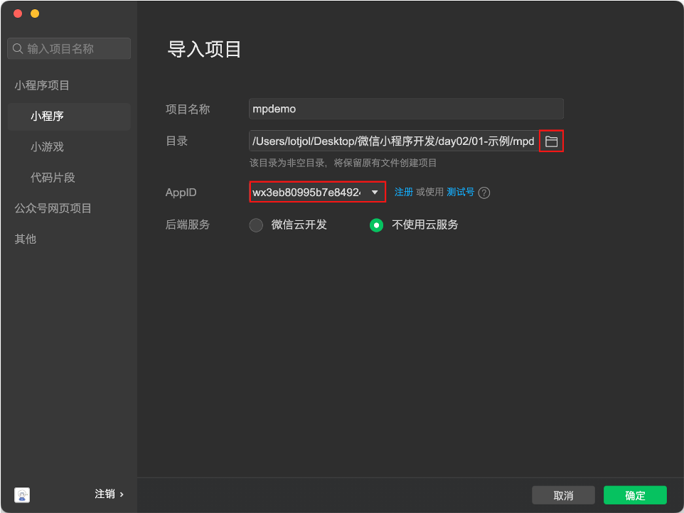

   


**为什么小程序这么受欢迎？**

- 方便易用，通过扫一扫、分享等方式轻松打开小程序
- 良好的用户体验，下载速度快，小程序单个包的体积不超过2M
- 强大的能力，提供大量硬件级别的API，如蓝牙、WIFI等
- 获客成本低，提供获取微信用户手机号、昵称、头像等信息的能力


**我们能学会什么？**

1. 小程序基础

​		组件、配置、生命周期、事件处理、数据渲染、API、自定义组件、Vant UI、分包加载等

2. 小程序项目

   通告管理、用户管理、房屋管理、报修管理、访客管理等各个功能模块

3. 技术和功能点：

- Vant 组件库
- 短信验证码
- Refresh Token
- 状态管理
- 地理定位
- 逆地址解析
- 地点搜索
- 路线规划
- 文件上传
- 自定义分享
- 相册访问


### 一、注册小程序账号

在[微信公众平台](https://mp.weixin.qq.com/)通过邮箱注册申请小程序账号。

注意事项：

- 每个邮箱只注册一个账号且邮箱没有申请过订阅号、服务号等公众号

- 完善主体信息填写个人真实信息且不要忘记绑定管理员微信（企业账号填写企业信息）
- 补充完善小程序账号信息，如logo、名称、简介以及小程序类目（类目不要选择游戏）

能够在小程序管理后台找到 AppID，开发小程序所必须的信息。


### 二、搭建开发环境

1. [下载微信开发者工具](https://developers.weixin.qq.com/miniprogram/dev/devtools/stable.html)，双击安装程序根据引导完成安装
2. 启动安装后的程序，使用微信扫码登录（电脑需要联网）
3. 创建小程序，需要指定代码位置、填写AppID、项目名称、选择基础模板，选择不使用云服务
4. 在小程序开发工具中点预览在真机中查看小程序效果


### 三、认识小程序

#### 3.1 页面布局

简单概要的理解一下小程序页面的构成及布局的实现方式（非常类似于网页布局）

**页面的构成**

一个完整的小程序页面需要包括 4 个类型的文件：

- `.wxml` 定义页面的结构，类似于 `.html`
- `.wxss` 定义页面的样式，类似于 `.css`
- `.js` 定义页面的逻辑，监听事件、发起请求等
- `.json` 定义页面的配置，如页面标题等

**页面结构**

- `view` 定义块级区域，相当于网页中的 `div` 标签
- `text` 定义行内区域，相当于网页中的 `span`标签

**页面样式**

- 类选择器，与网页中一致
- 标签选择器，与网页中一致
- ... 大部分的 css 样式都可以用到小程序中


#### 3.2 逻辑处理

快速了解一下小程序处理逻辑部分的内容，后续还会深入介绍。

每个页面都必须要调用 `Page` 函数来注册页面，否则看到页面的任何内容，且要传入对象类型的参数：

- `data` 初始化页面中的数据
- `this.setData` 更新数据
- `{{}}` 插值语法可以实现数据的渲染
- `bind: 事件类型 = 事件回调`

```javascript
Page({
  data: {
    message: '大家好，这是我的第一个小程序!'
  },
  changeMessage() {
    this.setData({
      message: 'Hello everyone this is my first miniprogram!'
    })
  }
})
```

```xml
<button bind:tap="changeMessage" type="primary" size="mini">点我试试</button>
```


#### 3.3 配置

小程序的配置可以配置页面路径、窗口表现、tabBar等，分为全局配置和页面配置，全局配置针对所有页面生效，页面配置只针对当前页生效。

**全局配置**

- `pages` 配置页面路径，未配置路径的页面无法被访问到    page 新建文件夹   新建 page

  ```json
  {
  	"pages": [
      "pages/index/index",
      "pages/logs/logs"
    ]
  }
  ```

- `entryPath` 配置小程序默认的启动页面（首页）

- `window` 窗口表现

  ```json
  {
    "pages": [
        "pages/index/index",
         "pages/logs/logs"
    ],
    "entryPagePath": "pages/logs/logs",   // 配置小程序默认的启动页面（首页）
    "window": {
          // 配置下拉刷新
          "enablePullDownRefresh": true,  // 是否启用下拉刷新
          "backgroundTextStyle": "dark",  // 下拉 loading 状态的样式  dark light
  
          // 配置导航栏
          "navigationBarBackgroundColor": "#f5a11c",  // 导航标背景颜色
          "navigationBarTitleText": "Weixin",         // 导航栏标题
          "navigationBarTextStyle": "black",          // 导航栏标题文字颜色  black white
          "navigationStyle": "custom"        // 自定义导航栏
    }
  }
  ```

- `tabBar` 底部 Tab 栏（tabBar 中的页面必须配置在 `pages` 中）

  ```json
  {
    "pages": [],
    "window": {},
    "tabBar": {
          "color": "#333",
          "selectedColor": "#e93b3d",    // color & selectedColor 配置tab文字的颜色
          "backgroundColor": "#ffffff",  // 配置tab栏的背景颜色
          "borderStyle": "black",        // 配置tab栏边框的样式
          "list": [{
              "text": "首页",                                            // 配置tab的文字
              "pagePath": "pages/index/index",                          // 配置tab的页面路径
              "iconPath": "static/tabbar/component_default.png",
              "selectedIconPath": "static/tabbar/component_active.png"
          },
          {
              "text": "日志",
              "pagePath": "pages/logs/logs",  
              "iconPath": "static/tabbar/framework_default.png",
              "selectedIconPath": "static/tabbar/framework_active.png"
          },
          {
              "text": "我的",
              "pagePath": "pages/demo/index",  
              "iconPath": "static/tabbar/subpackage_default.png",
              "selectedIconPath": "static/tabbar/subpackage_active.png"
          }
      ]
      },
  }
  ```


**页面配置**

页面配置大部分与全局配置中的 `window` 是重叠的，页面配置的优先级大于全局配置的。

- `disableScroll` 只能用在在页面配置中，禁用页面滚动
- `usingComponents` 后续学到自定义组件时再介绍

#### 3.4 长度单位

在小程序中除了支持 `px` 长度单位外还有一种特殊的长度单 `rpx`，它的特点是能够自动的适配置不同尺寸的手机屏幕，在实际使用中只需要将设计稿调整为 `750px` 宽，然后 `1:1` 的比例来写长度（单位使用 rpx），如：设计稿中某个区域（盒子）的大小为 `180*90px` ，写成小程序的尺寸为 `180*90rpx`。

注：上述的规则仅适用于设计稿宽度为 `750px`


### 四、小程序组件

小程序中内置了许多的组件，除了前面学习的 `view`、`text` 之外还有一些常用的，这小节来介绍一下

#### 4.1 navigator

`navigator` 组件相当于网页中的 `a` 标签，用来实现页面之间的跳转。

- `url` 属性支持相对和绝对路径，路径为空时会报错

- `hover-class` 属性定义点击态的样式，`none` 值表示禁用点击效果

- `open-type` 属性定义跳转方式，（`tabBar` 类型的页面时值为 `switchTab`），默认值为 `navigate`

  ```js
  <navigator open-type="switchTab" hover-class="none"  url="../demo/index">跳转到demo页面</navigator>
  // 如果跳转的页面是 tabBar 页面 ，必须指定 open-type="switchTab"
  ```

  

#### 4.2 image

`image` 组件用来在页面中显示图片相当于网页中的 `img` （注意单词不同）

- 占位容器，`image` 默认具有宽高尺寸（320*240px）

- 当占位容器与图片实际尺寸宽高比不一致时，图片无法正常显示

- `mode` 属性控制图片的显示方式
  
  - `scaleToFill` 图片提伸铺满占位容器
  - `aspectFit` 图片同比例缩放显示，长边完整显示出来（占位容器可能会留白）
  - `aspectFill` 图片同比例缩放显示，短边完整显示出来（图片可能被裁切）
  
- 一般根据设计稿设置 `image` 的宽高，如果图片宽高比与占位容器不一致时，指定 `mode="aspectFill"`

  

#### 4.3 swiper

`swiper` 组件在页面中创建可以滑动的区块，常常用来实现轮播图的交互效果。

- 组件的结构
  - `swiper` 滑块容器，内部只能嵌套 `swiper-item`，默认高度为 `150px`
  - `swiper-item` 滑块单元，内部嵌套任意内容，如 `image` 组件
- 组件属性
  - `indicator-dots` 是否显示面板指示点
  - `autoplay` 是否自动切换
  - `circular` 是否衔接滑动
- 可以控制 `swiper` 的样式宽高 , image 宽高为 100%  就不用设置mode


#### 4.4 表单相关

- `input` 输入框组件与网页中 `input` 标签的作用一致
  - `type` 属性指定表单类型，如 `text`、`number` 、`password`等
  - `placeholder` 属性指定输入框为空时的占位文字
- `radio-group` 和 `radio` 单选框组件，相当于网页中的 `<input type="radio" />`
  - `value` 属性定义该表单的数据内容
  - `checked` 属性定义选中的状态
- `checkbox-group` 和 `checkbox` 复选框组件，相当于网页中的 `<input type="checkbox" />`
  - `value` 属性定义该表单的数据内容
  - `checked` 属性定义选中的状态
- `picker` 选择框组件，相当于网页中的 `select` 标签
  - `mode` 属性定义选择框的类型，值为 `region` 时显示省市县三级联动效果、值为 `date` 时显示时间选择器


```xml
<!-- 提前准备好的布局结构代码 -->
<view class="register">
  <view class="legend">信息登记:</view>
  <view class="form-field">
    <label for="">姓名:</label>
    <view class="field">
        <!--  <input password type="text" placeholder="请输入您的姓名"/>   -->
        <input type="text" placeholder="请输入您的姓名"/>  
        
    </view>
  </view>
  <view class="form-field">
    <label for="">性别:</label>
    <view class="field">
        
        <radio-group bindchange="">
            <radio value="男" checked/>男
            <radio value="女"/>女
        </radio-group>
        
    </view>
  </view>
  <view class="form-field">
    <label for="">爱好:</label>
    <view class="field">
        
        <checkbox-group bindchange="">
            <checkbox value="写代码"/>写代码
            <checkbox value="睡大觉"/>睡大觉
            <checkbox value="吃饭饭"/>吃饭饭
        </checkbox-group>
        
    </view>
  </view>
  <view class="form-field">
    <label for="">籍贯:</label>
    <view class="field">
        
        <picker mode="region">
            请选择您的籍贯
        </picker>
        
    </view>
  </view>
  <view class="form-field">
    <label for="">生日:</label>
    <view class="field">
        
        <picker mode="date">
            请选择您的出生日期
        </picker>
        
    </view>
  </view>
</view>
```


#### 4.5 scroll-view

`scroll-view` 在页面中指定一个可以滚动的区域，并且这个可滚动的区域能够实现一些高级的交互，比如下拉刷新等。

`scroll-view` 中嵌套任意需要滚动的内容，要求必须有溢出，垂直滚动时 `scroll-view` 必须要指定高度。

- `scroll-x` 属性是否允许水平方面滚动
- `scroll-y` 属性是否允许垂直方向滚动
- `refresher-enable` 属性是否开启下拉刷新的交互


```xml
<!-- 提前准备好的布局结构代码 -->
<!-- 搜索框 -->
<view class="search-bar">
  <input type="text" placeholder="输入搜索关键字" />
</view>
<!-- 页面主体 -->
<view class="page-body">
  <scroll-view scroll-y class="aside">
    <view class="item"></view>
    <view class="item"></view>
    <view class="item"></view>
  </scroll-view>
  <scroll-view scroll-y class="content">
    <view class="item"></view>
    <view class="item"></view>
    <view class="item"></view>
  </scroll-view>
</view>

```


### 五、小程序样式

#### 5.1 全局样式

`app.wxss` 定义全局样式，该文件中的样式会以所有的页面生效。

注：`page` 在每个页面中都有，它是由小程序自动添加上的，相当于网页中的 `body` 标签。

#### 5.2 静态资源

小程序中 `.wxss` 文件中不支持使用本地路径的资源，比如背景图片是不允许使用本地国片路径的，必须使用网络路径（https:// 或 http:// 开头）或者转换成 base64 编码。

以搜索放大镜图标为例：

```css
/* 使用背景图定义放大镜 */
.search-bar .button {
  position: absolute;
  top: 50%;
  right: 60rpx;
  width: 50rpx;
  height: 50rpx;
  transform: translateY(-50%);
  /* background-color: pink; */

  /* 背景图片 */
  /* background-image: url(/static/images/search.png); */
  background-image: url(https://lotjol.github.io/static-store/enjoy-plus/images/search.png);
  background-size: contain;
}
```

#### 5.3 字体图标

小程序中字体图片的使用与网页中基本上是一致的，唯一的区别是小程序的 `.wxss` 文件中不支持使用本地字体文件，我们使用 iconfont 平台提供的服务生成字体文件后，直接使用其线上的字体文件地址。


```js
// fonts.wxss 中粘贴复制的代码 使用阿里提供的线上网络地址

/* app.wxss 引入字体文件 */
@import './fonts.wxss';

// 引用 字体图标 根据类名引用不同的字体图标
<text class="button iconfont icon-sousuo"></text>

  .search-bar .button {
    position: absolute;
    top: 50%;
    right: 60rpx;
    width: 50rpx;
    height: 50rpx;
    transform: translateY(-50%);
    /* background-color: pink; */
  
    /* 背景图片 */
    /* background-image: url(/static/images/search.png); */
   /*  background-image: url(https://lotjol.github.io/static-store/enjoy-plus/images/search.png);
    background-size: contain;  */
    /* 字体图标 */
    font-size: 50rpx;
    color: #666;
  }
```


### 一、导入小程序




- 选择代码目录

- 项目配置文件

  - `appid` 当前小程序的 AppID
  - `projectname` 当前小程序的项目名称

- 变更AppID（视情况而定，如果没有开发权限时需要变更成个人的 AppID）

  

### 二、模板语法

在页面中渲染数据时所用到的一系列语法叫做模板语法，对应到 Vue 中就是指令的概念。

#### 2.1 数据绑定

- 插值 `{{}}`

  小程序中使用 `{{}}` 实现数据与模板的绑定，与 Vue 中不同的是无论是属性的绑定还是内容的绑定都必须要使用 `{{}}`。

  ```xml
  <!-- 此处的 false 是字符串的 'false'，因此布尔结果为 true -->
  <switch checked="false" />
  
  <!-- 如下才是正确表示布尔值 false 的方法 -->
  <switch checked="{{false}}" />
  ```

- 简易数据绑定

  小程序中提供了 `model:value="{{数据名}}"` 语法来实现双向的数据绑定，但是目前只能用在 `input` 和 `textarea` 组件中。

本节中用到的演示代码如下：

```xml
<!-- 数据绑定 -->
<view class="binding">
    
  <!-- 开关组件 属性绑定-->
  <switch checked="{{isOpen}}"/>
    
  <!-- 双向数据绑定 只能用在 input 和 textarea 组件中-->
  <input type="text" model:value="{{message}}" />
    
   <!-- 内容绑定 -->
  <view class="message">{{message}}</view>
</view>
```

```javascript
Page({
  data: {
    isOpen: true,
    message: 'hello world!'
  }
})
```


#### 2.2 条件渲染

- 控制属性：相当于 Vue 中指令的概念，在小程序中做控制属性
  - `wx:if` 根据表达式的值渲染内容，值为真时显示，可以单独使用
  - `wx:else` 用在 `wx:else` 的后面，不可单独使用，`wx:if` 表达式值为假时显示
- 组件属性：
  - hidden 根据表达式的值渲染内容，值为真时隐藏
  - 通过 `[hidden] { display: none; }` 来实现内容的隐藏

本节中用到的演示代码如下：

```xml
<!-- 条件渲染 wx:if 和 wx:else -->
<view class="welcome">
  <text wx:if="{{isLogin}}">大师兄</text>
  <text wx:else>游客</text>你好:
</view>


<!-- 条件渲染 hidden -->
<view class="loading">
  <!-- 可以单独使用 -->
  <!-- <text wx:if="{{!loaded}}">正在加载...</text> -->
    
  <text hidden="{{loaded}}">正在加载...</text>
</view>
```

```javascript
Page({
  data: {
    isOpen: true,
    message: 'hello world!',
    isLogin: true,
    loaded: false
  }
})
```


#### 2.3 列表渲染

- `wx:for` 根据数组重复渲染组件内容
  - `index` 默认值，访问数组的索引值
  - `item` 默认值，访问数组的单元值
- `wx:key` 列表项的唯一标识符（不使用 {{}}）
  - 数组单元是对象时，只需要写属性名
  - 数组单元是简单类型时，推荐使用 `*this`！`wx:key = "*this"`
- `wx:for-index` 自定义访问数组索引的变量名   `wx:for-index = 'i'`
- `wx:for-item` 自定义访问数组单元的变量名     `wx:for-item = 'student'`


```xml
<!-- 列表渲染 -->
<view class="students">
  <view class="item">
    <text>序号</text>
    <text>姓名</text>
    <text>年龄</text>
    <text>性别</text>
    <text>级别</text>
  </view>
    <!-- wx:key = " " 不需要写 item.id  直接写 id ！！！！！！-->
  <view class="item" wx:for="{{students}}" wx:key="id">
    <text>{{ index + 1 }}</text>
    <text>{{ item.name }}</text>
    <text>{{ item.age }}</text>
    <text>{{ item.gender }}</text>
    <text>{{ item.level }}</text>
  </view>
</view>
<!-- 简单数组 -->
<view class="history">
    <!-- 数组单元是简单类型时，wx:key = " " 推荐使用 *this  -->
  <text wx:for="{{ history }}" wx:key="*this">{{item}}</text>
</view>
```

```javascript
Page({
  data: {
    isOpen: true,
    message: 'hello world!',
    isLogin: true,
    loaded: false,
    students: [
      {id: 1, name: '贺洋', age: 20, gender: '男', level: '菜鸟'},
      {id: 2, name: '唐刚', age: 18, gender: '女', level: '笨鸟'},
      {id: 3, name: '常超', age: 20, gender: '女', level: '老鸟'}
    ],
    history: ['苹果', '华为', 'OPPO', '三星']
  }
})
```


### 三、内置API

内置 API 实际上就是小程序提供的一系列的方法，这些方法都封装在了全局对象 `wx` 下，调用这些方法实现小程序提供的各种功能，如网络请求、本地存储、拍照、录音等。

#### 3.1 网络请求

调用 `wx.request` 能够在小程序中发起网络请求与后端接口进行数据的交互，其语法格式如下：

```javascript
wx.request({
  url: '这里是接口的地址',
  method: '这里是请求的方法',
  data: '请求时提交的数据',
  header: {/* 请求头信息 */},
  success: () => {/* 成功的回调 */},
  fail: () => {/* 失败的回调 */},
  complete: () => {/* 成功或失败的回调 */}
})
```

本节中用到的演示代码如下：

```xml
<button bind:tap="getBooks" class="button" size="mini" type="primary">查询书单</button>
<view class="books">
  <view class="item">
    <text>序号</text>
    <text>名称</text>
    <text>作者</text>
    <text>出版社</text>
    <text>操作</text>
  </view>
    <!-- 渲染页面 -->
 <view wx:for="{{ books }}" wx:key="id" class="item">
    <text>{{ index + 1 }}</text>
    <text>{{ item.bookname }}</text>
    <text>{{ item.author }}</text>
    <text>{{ item.publisher }}</text>
    <text>删除</text>
  </view>
</view>
```

```javascript
Page({
  data: {
    books: [], // 承载响应回来的图书数据
  },
  // 调用数据接口的方法
  getBooks() {
    // 调用小程序的 API 发起请求
    wx.request({
      url: 'https://hmajax.itheima.net/api/books',
      method: 'GET',
      data: {
        creator: 'zhangsan'
      },
      success: (result) => {
        // 更新数据，渲染页面
        this.setData({ 
            books: result.data.data 
        })
      }
    })
  }
})
```


```
配置合法域名：
 开发环境设置不校验合法域名
 在管理后台配置，必须为 https 协议
 多个域名同时使用 分号分隔
```


#### 3.2 界面交互

- `wx.showLoading` 显示 loading 提示框
- `title` 文字提示内容
  
- `mask` 是否显示透明蒙层，防止触摸穿透
  
- `wx.hideLoading` 隐藏 loading 提示框

- `wx.showToast` 消息提示框（轻提示）

  - `mask` 是否显示透明蒙层，防止触摸穿透
  - `duration` 延迟时间（提示框显示多久）
  - `icon` 指定图标，`none` 不使用图标

```js
 getBooks() {

    // 显示 loading 提示框，配合网络请求使用
    wx.showLoading({
      title: '正在加载...',
      mask: true              // mask : 防止触摸穿透
    })

    // 调用小程序 API 发起请求
    wx.request({
      url: 'https://hmajax.itheima.net/api/books',
      method: 'GET',
      data: {
        creator: 'zhangsan'
      },
      header: {},
      success: (result) => {
            // console.log(result)
            // 更新数据，渲染页面
            this.setData({
              books: result.data.data
            })
            // 渲染完成之后， 轻提示
            wx.showToast({
              title: '获取书单成功！',
              icon: 'none',
              duration: 3000
            })
      },
      fail() {
        // 失败回调
      },
      complete() {
        // 无论请求成功还是失败都去执行
        // 隐藏 loading 提示框
        wx.hideLoading()
      }
    })

  }
```


#### 3.3 本地存储

- `wx.setStorageSync` 存入一个数据，复杂类型数据不需要 `JSON.stringify` 处理
- `wx.getStorageSync` 读取一个数据，复杂类型数据不需要 `JSON.parse` 处理
- `wx.removeStorageSync` 删除一个数据
- `wx.clearStorageSync` 清空全部数据


```js
<!-- 本地存储 -->
<view class="storage">
  <button bind:tap="setStorage" size="mini" type="primary">存数据</button>
  <button bind:tap="getStorage" size="mini" type="primary">读数据</button>
  <button bind:tap="removeStorage" size="mini" type="primary">删数据</button>
  <button bind:tap="clearStorage" size="mini" type="primary">清数据</button>
</view>

  // 读取数据和存入数据，都不需要进行 JSON 的处理!!!!!!!!!!!!!!!!

  setStorage() {
    // 存入一个数据
    wx.setStorageSync('author', '一只小小清')
    // 存入复杂类型数据,直接存不需要 JSON 处理
    wx.setStorageSync('user', {name:'小小清',age: 18})
  },

  getStorage() {
    // 读取本地数据,结果保存到一个变量当中 
    const author = wx.getStorageSync('author')
    console.log(author)
    const user = wx.getStorageSync('user')
    console.log(user)
  },

  removeStorage() {
    // 删除本地数据
    wx.removeStorage({
      key: 'logs',
    })
  },

  clearStorage() {
    // 清空所有数据
    wx.clearStorageSync()
  }
```


#### 3.4 API 特征

小程序中提供的 API 数量相当的庞大，很难也没有必要将所有的 API 全部掌握，但是这些 API 具有一些共有的特征：

- 异步 API：绝大部分的 API 都是异步方式，通过回调函数获取 API 执行的结果
  - `success` API 调用成功时执行的回调
  - `fail` API 调用失败时执行的回调
  - `complete` API 调用结束时执行的回调（无论成功或失败）
- 同步 API：部分 API 支持以同步方式获取结果，这些 API 的名称都以 `Sync` 结尾，如 `wx.getStorageSync` 等
- Promise：部分异步的 API 也支持以 Promise 方式返回结果，此时可以配合 `asyc/await` 来使用


#### 3.5 相册/拍照

`wx.chooseMedia` 调起摄像头拍照或读取相册内容，该 API 既支持回调方式获取结果，也支持 Promise 方式返回结果：

```javascript
// 图片上传预览
<view bind:tap="chooseImage" class="preview">
  <image src="{{ filePath }}" mode=""/>
</view>


async chooseImage() {
    // 调用 API 获取图片 读取结果
    const result = await wx.chooseMedia({
      count: 1 ,                                // 只选取一张图片 
      mediaType: ['image'],                     // // 只选取图片
      // await 和 success 只能是其中的一种方式！！！！！！！！！！！！！！！！！！
     /*  success(result) {
         console.log(result)
      } */
    })
    // console.log(result)
    // 读取并渲染图片
    this.setData({
      filePath: result.tempFiles[0].tempFilePath
    })
  }

data: {
    filePath: ''
  }
```


#### 3.6 小练习 搜索历史


```js
 data: {
    keywords: '',
    // 在页面加载的时候，读取一下数据
    history: wx.getStorageSync('history') || []
  }

  searchByKeywords() {
   // 记录关键字到数组中
   const {keywords,history} = this.data
   history.push(keywords)

   // 更新数据，重新进行渲染
   this.setData({
     history: history,
     keywords: ''
   })
   // 3.记录数据到本地存储
   wx.setStorageSync('history', history)
  },
  
  removeHistory() {
    this.setData({
      history: []
    })
    // 本地存储清空
    wx.removeStorageSync('history')
  }


<!-- 搜索历史 -->
<view class="history">
  <view class="search-bar">
  <!-- 1.双向数据绑定 -->
    <input type="text" model:value="{{keywords}}"/>
    <text class="label" bind:tap="searchByKeywords">搜索</text>
  </view>
  <view class="title">
    历史搜索 <text class="icon-delete" bind:tap="removeHistory" wx:if="{{history.length}}">x</text>
  </view>
  <view class="keywords">
  <!-- 2.列表数据渲染 -->
    <navigator wx:for="{{history}}" wx:key="*this" url="/pages/test/index">{{item}}</navigator>
  </view>
</view>

```


### 四、事件处理


#### 4.1 事件对象

前面已经介绍过小程序事件监听的语法：`bind:事件类型=事件回调`，但是小程序的事件回调不支持传参数，因此要将模板中的数据传递到事件回调中就必须要通过事件对象来实现。

小程序**事件回调函数的第1个参数即为事件对象**，事件对象中包括了一些有用的信息：

```javascript
Page({
  data: {
    menuIndex: 0
  },
  onMenuTap(ev) {
    // 查看事件对象  事件回调函数的第1个参数即为事件对象
    // console.log(ev)
    // console.log(ev.mark.key)
    // 获取当前 tab 的索引值
    this.setData({
      menuIndex: ev.mark.key
    })
  }
})
```

本节练习用到的演示代码如下：

```xml
<!-- 搜索框 -->
<view class="search-bar">
  <input type="text" placeholder="输入搜索关键字" />
</view>
<!-- 页面主体 -->
<view class="page-body">
  <scroll-view scroll-y class="aside">
  <!-- mark:key="{{index}}" index索引值  mark: {key: "1"} 在组件当中向事件回调来传递数据!!!!!!!!!!!!!!-->
    <view 
      bind:tap="onMenuTap" 
      mark:key="{{index}}"                          // 推荐使用 mark
      data-index="0"
      wx:for="{{6}}" 
      wx:key="*this" 
      class="item {{ index === menuIndex ? 'active' : '' }}"
      >
    </view>
  </scroll-view>
  <scroll-view scroll-y refresher-enabled class="content">
    <view 
      wx:for="{{6}}" 
      wx:key="*this" 
      class="item"
      >
    </view>
  </scroll-view>
</view>

```


#### 4.2 组件事件

前面介绍的 `tap` 事件可以在绝大部分组件是监听，我们可以将其理解为通用事件类型，然而也有事件类型只属于某个组件，我们将其称为组件事件。

**`scroll-view` 组件中的事件：**

- `bind:scrolltolower` 当滚动内容到达底部或最右侧时触发
- `bind:refresherrefresh` 执行下拉操作时触发
- `refresher-enable` 启用自定义下拉刷新


```javascript
  <scroll-view 
    bind:scrolltolower="onScrollBottom" 
    bind:refresherrefresh="onScrollPulling"
    refresher-triggered="{{isPulling}}"
    scroll-y
    refresher-enabled 
    class="content"
     >
    <view 
      wx:for="{{12}}" 
      wx:key="*this" 
      class="item"
      >
    </view>
  </scroll-view>


Page({
  data: {
    isPulling: false
  },
 
  onScrollBottom() {
    // console.log('上拉加载...')

    // 显示 loading 提示框
    wx.showLoading({
      title: '正在加载...',
      mask: true
    })

    // 请求更多数据
    wx.request({
      url: 'https://hmajax.itheima.net/api/books',
      data: {creator: 'zhangsan'},
      success: (result) => {},
      complete() {
        // 隐藏 loading 提示框
        wx.hideLoading()
      }
    })
  },
    
  onScrollPulling() {
    // console.log('下拉刷新...')

    // 请求最新的数据
    wx.request({
      url: 'https://hmajax.itheima.net/api/books',
      data: {creator: 'zhangsan'},
      success: (result) => {},
      complete: () => {
        // 停止下拉刷新
        this.setData({
          isPulling: false
        })
      }
    })
  }
})
```


**表单组件中的事件：**

- `change` 表单数据发生改变时触发（input 不支持）
- `submit` 表单提交时触发，`button` 按钮必须指定 `form-type` 属性


```vue
<!-- 用户信息 -->
<view class="register">
  <form bind:submit="submitForm">
    <view class="form-field">
      <label for="">姓名:</label>
      <view class="field">
        <input type="text" placeholder="请输入您的姓名" />
      </view>
    </view>
    <view class="form-field">
      <label for="">性别:</label>
      <view class="field">
        <radio-group bind:change="getRadioValue">
          <radio value="男" checked />男
          <radio value="女" />女
        </radio-group>
      </view>
    </view>
    <view class="form-field">
      <label for="">爱好:</label>
      <view class="field">
        <checkbox-group>
          <checkbox value="写代码" checked />写代码
          <checkbox value="睡大觉" />睡大觉
        </checkbox-group>
      </view>
    </view>
    <view class="form-field">
      <label for="">籍贯:</label>
      <view class="field">
        <picker mode="region" bind:change="getRegionValue">请选择籍贯</picker>
      </view>
    </view>
    <button size="mini" type="primary" form-type="submit">保存</button>
  </form>
</view>

 getRadioValue(ev) {
    // 在事件对象当中有 detail 属性可以获取表单的值
    console.log(ev.detail.value)  // 男来自于radio中的value
  },
  getRegionValue(ev) {
    // 在事件对象中通过 detail 可以获取省市县
    // 包含了编码形式和文字形式
    console.log(ev)
  },
  submitForm(ev) {
    console.log('表单提交了');
    console.log(ev);
  }
```


### 五、生命周期

生命周期是一些名称固定自动执行的函数。

#### 5.1 页面生命周期

- `onLoad` 在页面加载完成时执行，只会执行 1 次，常用于获取地址参数和网络请求
- `onShow` 在页面处于可见状态时执行，常用于动态更新数据或状态
- `onReady` 在页面初次渲染完成时执行，只会执行 1 次，常用于节点操作或动画交互等场景
- `onHide` 在页面处于不见状态时执行，常用于销毁长时间运行的任务，如定时器


```xml
<view class="history">
  <view class="title">历史搜索</view>
  <view class="keywords">
    <navigator
      wx:for="{{history}}"
      wx:key="*this"
      url="/pages/test/index">
      {{item}}
    </navigator>
  </view>
</view>

<view class="form-field">
  <input type="text" placeholder="请输入手机号" />
  <text
    wx:if="{{time === 0}}"
    bind:tap="getSMSCode"
    class="label"
  >获取短信验证码</text>
  <text wx:else class="label">{{time}}后重新获取</text>
</view>

```

```javascript
// 定时器ID
let timer = null
Page({
  data: {
    history: [],
    time: 0
  },

  // 生命周期函数--监听页面加载
  onLoad(options) {
    console.log('页面加载完成时去执行');
  },

  // 生命周期函数--监听页面显示
  onShow() {
    console.log('页面处于可见状态时去执行，常用于动态更新数据');
    // 读取本地存储的历史
    const history = wx.getStorageSync('history')
    this.setData({
      history:history
    })
  },

  // 生命周期函数--监听页面隐藏
  onHide() {
    console.log('页面处于不可见状态时去执行');
    // 停掉定时器
    clearInterval(timer)
  },

  getSMSCode() {
    let time = 60 // 初始数据
    // 倒计时
    timer = setInterval(() => {
      // 停止定时器
      if(--time < 0) return clearInterval(timer)
      this.setData({time}) // 渲染结果
    }, 1000)
  },
})
```


#### 5.2 应用生命周期

- `onLaunch` 小程序启动时执行1次，常用于获取场景值或者启动时的一些参数（如自定义分享）
- `onShow` 小程序前台运行时执行，常用于更新数据或状态
- `onHide` 小程序后台运行时执地，常用于销毁长时间运行的任务，如定时器


```javascript

App({

  // 生命周期
  onLaunch(options) {
    console.log('小程序启动了');
    // 场景值：是指打开小程序的方式
    console.log(options.scene);
  },

  onShow() {
    console.log('小程序处于前台运行当中');
  },

  onHide() {
    console.log('小程序处于后台运行当中');
  }
})


// pages/lifetimes/index.js 
Page({
  
  // 小程序转发/分享
  onShareAppMessage() {
    return {
      title: '小程序学习',
      path: '/pages/index/index?test=测试数据',
      imageUrl: '/static/images/cover.png'
    }
  }
})
```


### 一、分包加载

分包加载是优化小程序加载速度的一种手段。

#### 1.1 为什么？

- 微信平台对小程序单个包的代码体积限制为 2M，超过 2M 的情况下可以采用分包来解决

- 即使小程序代码体积没有超过 2M 时也可以拆分成多个包来实现按需加载

- 配置文件能忽略的只有静态资源，代码无法被忽略

  ```js
  // project.config.json
  
  "ignore": [
        {
          "value": "static/uploads",       // 路径    // 忽略静态资源 uploads
          "type": "folder"                 // 类型 文件夹
        }
      ],
  ```

  

#### 1.2 使用分包

在全局配置中使用 `subPackages` 来配置分包的 根目录 和分包中的 页面路径 ：

```json
// app.json
{
  "subPackages": [
    {
      "root": "subpkg_test",    // 也可以用传统的方式在此文件中新建文件夹-新建page,会自动添加到"pages"里面
      "pages": [
        "pages/test/index"
      ]
    },
    {
      "root": "subpkg_user",
      "pages": [
        "pages/profile/index"
      ]
    }
  ],
}
```

- `root` 指定 分包的根目录
- `pages` 指定分包中的页面路径
- **`tabBar` 的页面不允许分包**
- 所有包不超过`20m`

注：**根目录和路径不存在时，小程序开发者工具会自动创建**。


#### 1.3 分包预加载

在实际使用分包的过程中，纯粹的按需加载也不是最优的方案，可以将即将访问的页面的包预先下载下来，这样能进一步提升小程序加载的速度，通过 `preloadRule` 来配置预加载的包：

- 页面路径作为 key (属性)
- network    预加载的网络环境
- packages  需要预加载的包

```json
// app.json

{
  "preloadRule": {
    "pages/framework/index": {
      "network": "all",
      "packages": ["subpkg_user"]
    }
  },
}
```

上述代码的含义是在加载 `pages/framework/index` 页面时，自动的去加载 `subpkg_user` 这个分包，等到要访问这个分包中的页面时会直接打开。


### 二、自定义组件

小程序中内置了许多的组件供开发者使用，不仅如此开发者还可根据需要自定义组件。

#### 2.1 基本语法

- 创建自定义组件

  通过小程序开发者工具可以快速创建组件。 （新建文件夹 - 新建 component）

  创建好的自定义组件从结构上看与页面是完全一致的，由 `.wxml`、`.wxss`、`.js`、`.json` 构成，也有两点重要的区别：

  - `.json` 文件中必须有 `component: true` 
  - `.js` 文件中调用的是 `Component` 函数

  

  - 使用组件  （ **全局 或 页面配置 `usingComponents`** ） !

  组件需要在页面或全局中注册后才可以使用，注册组件会用到配置项 `usingComponents` ，它的值是对象类型数据，属性名为自定义组件的名称，属性的值为自定义组件的路径

  ```json
  // component/index.json 页面配置 只能在页面component下使用组件
  
  {
    "usingComponents": {
      
      "自定义组件命名名称": "自定义组件的路径",
      "navigation-bar": "./navigation-bar/index"
    }
  }
  ```

  

#### 2.2 组件样式

在开发中经常会需要修改自定义组件内部的样式，有两种方式可以实现这个目的。

- 样式隔离：默认情况下页面的样式无法影响自定义组件的样式

  - 组件 `.js` 文件中传入options：{ `addGlobalClass: true` }允许在页面中修改自定义组件的样式，但必须使用组件本身的类名
  - **在组件中 定义样式时使用的选择器不能是 标签选择器、ID选择器或属性选择器**

- 外部样式类：

  - `externalClasses: ['xxx-class', 'yyy-class']` 开发自定义的样式类
  - `xxx-class` 和 `yyy-class` 可以接收外部传入的类名，并应用到组件的布局结构中

  ```javascript
  // 组件的 .js文件
  Component({
    options: {
      addGlobalClass: true,   // 允许在页面中修改自定义组件的样式  必须使用组件本身的类名
    },
    // 开发自定义的样式类
    externalClasses: ['custom-class', 'title-class']
  })
  ```
```
  <!-- 页面中使用组件 -->
  <navigation-bar
    custom-class="my-navigation-bar" 
    title-class="my-navigation-bar-title"
></navigation-bar>
```

  ```vue
  <!-- 组件的wxml -->
  <view class="navigation-bar custom-class">
    <view class="navigation-bar-title title-class">
      自定义标题
    </view>
  </view>
  ```


#### 2.3 slot（插槽）

小程序中默认只能使用一个 `slot` 需要多个插槽时需要传入 `options: { multipleSlots: true }`。

- 创建插槽：在组件的任意位置使用 `<slot />` 进行占位
  - 默认只能使用 1 个 `<slot>`
  - `options: { multipleSlots: true }` 启用多插槽
  - `name` 为不同的 `<slot />` 命名来区分不同的插槽

- 使用插槽
  - 单个插槽的情况下直接在组件中间填充内容即可
  - 多外插槽的情况下需要使用 `slot` 属性来指定插槽位置

```vue
<!-- 组件的 wxml  -->
<view class="navigation-bar custom-class">
  <view class="navigation-bar-title title-class">
    <!-- 单个插槽 创建插槽-->
    <slot></slot>
  </view>
</view>

<!-- 页面使用组件， 单个插槽的情况下直接在组件中间填充内容即可  使用插槽-->
<navigation-bar custom-class="my-navigation-bar" title-class="my-navigation-bar-title">
    自定义标题1
</navigation-bar>
<navigation-bar custom-class="my-navigation-bar" title-class="my-navigation-bar-title">
    自定义标题2
</navigation-bar>
```

```vue
<!-- 组件的 .js文件  -->
Component({
  options: {
   
    multipleSlots:true   // 启用多插槽,一般直接开启，方便扩展插槽
  }
})

<view class="navigation-bar custom-class">
  <view class="navigation-bar-title title-class">
    <!-- 多个插槽 定义插槽-->
    <slot name="title"></slot>
    <slot name="test"></slot>
  </view>
</view>


<navigation-bar custom-class="my-navigation-bar" title-class="my-navigation-bar-title">
    <!-- 使用插槽-->
   <text slot="title">自定义标题1</text>
   <text slot="test">测试</text>
</navigation-bar>
```


#### 2.4 生命周期

小程序自定义组件的生命周期需要定义在 `lifetimes` 中：

```javascript
// pages/component/navigation-bar/index.js  组件的 .js文件
Component({
  options: {
    addGlobalClass:true,
    multipleSlots:true
  },
  // 开发自定义的样式类
  externalClasses:['custom-class','title-class'],

  data: {
     message:'自定义组件的内容。',
     statusBarHeight: 0,  // 初始数据，状态栏的高度
  },
    
  lifetimes: {
    created() {
      console.log('组件创建成功...');
      // 在此不能调用 setData (或者无效)
      this.setData({message: 'created 生命周期中不能调用 `this.setData`'})
      // 该生命周期 一般用来初始数据
      this.xxx = 123
    },
    attached() {
      console.log('组件加载完成...');
      this.setData({message: '自定义组件的内容？.....'})
      
      // 调用 API 获取系统信息
      const systemInfo = wx.getSystemInfoSync()
      // console.log(systemInfo);
      // console.log(systemInfo.statusBarHeight); // 状态栏的高度

      // 更新状态栏高度的初始值
      this.setData({
        statusBarHeight: systemInfo.statusBarHeight
      })
    }
  }
})

// 组件的 wxml 文件
<view 
   class="navigation-bar custom-class" 
   style="padding-top: {{statusBarHeight}}px;"     // 状态栏的高度
    >
  <view class="navigation-bar-title title-class">
    <!-- 多个插槽 -->
    <slot name="title"></slot>
    <slot name="test"></slot>
  </view>
</view>

<view>
  {{message}}
</view>
```

- `created` 组件创建时触发，类似于 Vue 中的 `created` 生命周期，该生命周期中不能调用 `this.setData`

- `attached` 组件初始化完毕时触发，类似于 Vue 中的 `mounted` 生命周期，该生命周期函数使用最频繁


#### 2.5 组件通信

组件通信是指将页面或组件的数据传入子组件内部或者将子组件的数据传入父组件或页面当中。

**自定义属性（父传子）：**

组件通过自定义的属性接收来自于组件外部（父组件或页面）的数据：

```javascript
// 组件的 .js文件
Component({
    
  properties: {
    // 控制返回按钮是否显示
    back: Boolean,
    // 控制返回的步数
    delta: {
      type: Number, 
      value: 1
    }
  },
    
    methods: {
    goBack() {
      // console.log('点击了');
      // 调用 API 实现返回操作 路由返回
      wx.navigateBack({delta:this.data.delta})  // 返回几步？ 接收的delta 的值
    }
  }
})
```

```xml
// 自定义组件
<view 
   class="navigation-bar custom-class" 
   style="padding-top: {{statusBarHeight}}px;"
    >
    <!-- 返回按钮 传了back 才会显示 <  , 定义一个点击事件实现返功能-->
  <view  
      bind:tap="goBack" 
      wx:if="{{back}}" 
      class="navigation-bar-back"
      >
  </view>
  <view class="navigation-bar-title title-class">
    <!-- 多个插槽 -->
    <slot name="title"></slot>
    <slot name="test"></slot>
  </view>
</view>

```

```vue
// login页面中使用组件,给组件传递值
// back 默认为true 传了back，显示返回按钮  delta 返回步数

<navigation-bar back delta=”1>
  <text slot="title">用户登录</text>
</navigation-bar>

<view class="login">
  <view class="form-field">
    <input type="text" placeholder="请输入手机号" />
    <text class="label">获取短信验证码</text>
  </view>
  <view class="form-field">
    <input type="text" placeholder="请输入短信验证码" />
  </view>
  <button>登录</button>
</view>

// component 页面使用组件 
// 没有传入 back 就不显示返回按钮 也就没有传delta
<navigation-bar 
  custom-class="my-navigation-bar" 
  title-class="my-navigation-bar-title"
 
  >
   <text slot="title">自定义标题1</text>
</navigation-bar>

<navigator class="link" url="/pages/login/index">去登录</navigator>
```


**自定义事件（子传父）：**

组件自定义事件的监听：`bind:事件类型（自定义）="事件回调"`

组件自定义事件的触发：`this.triggerEvent('事件类型（自定义）', 参数)`


```vue
<!-- 组件的wxml -->

<view class="count-down custom-class">
  <slot wx:if="{{useSlot}}"></slot>
  <text wx:else class="time">{{time}}</text>
</view>

```


```javascript
// 组件的 .js文件

Component({
  externalClasses: ['custom-class'], // 外部样式类
  properties: {
      // 接收传入的倒计时
    time: {
      type: Number,
      value: 60,
    },
    useSlot: Boolean, // 接收父组件传过来的布尔值，默认为 true ，控制组件的显示  给用户开放一个属性来控制
  },
  lifetimes: {
    attached() {
      // 一加载组件的时候，开始倒计时
      this.countStart()
    },
  },
  methods: {
    countStart() {
      let timer = null
      // 停止定时器
      if (this.data.time === 0) return clearTimeout(timer)
      // 更新渲染
      this.setData({
        time: (this.data.time -= 1),
      })
      // 定时器
      timer = setTimeout(this.countStart.bind(this), 1000)
      // 触发自定义事件，传递数据到组件外部,子传父!!!!!!!!!!!!!!!!!!!!!!!!!!!!!!!!!!
      // 把 倒计时的时间 time 传给父组件
      this.triggerEvent('change', this.data.time)
    },
  },
})
```

```vue
<!--pages/login/index.wxml-->
<!-- 使用自定义组件 -->
<navigation-bar back>
  <text slot="title">用户登录</text>
</navigation-bar>

<view class="login">
  <view class="form-field">
    <input type="text" placeholder="请输入手机号" />
    <!-- 使用组件 
         countDownVisible 控制组件的显示与隐藏
         time 传给组件一个 time 倒计时
         useSlot 传给组件一个 布尔值 默认为true
-->
    <count-down 
      custom-class="label" 
      wx:if="{{ countDownVisible }}" 
      time="60" 
      useSlot
      bind:change="countdownChange"
      >
      {{time}}秒后再次获取
    </count-down>
    <text wx:else bind:tap="getSMCode" class="label">获取短信验证码</text>
  </view>
  <view class="form-field">
    <input type="text" placeholder="请输入短信验证码" />
  </view>
  <button>登录</button>
</view>

```

```js
// login.js
Page({
  data: {
    countDownVisible: false,  // 控制组件的显示与隐藏
    time: 0                   // 用来接收子组件传过来的倒计时
  },
  getSMCode() {
    // 显示倒计时组件
    this.setData({countDownVisible: true})
  },
  // 子传父过来的，自定义事件
  countdownChange(ev) {
    // console.log(ev.detail); // 倒计时的数字
    // 渲染数据
    this.setData({time: ev.detail})

    // 隐藏倒计时组件
    if(ev.detail === 0) {
      this.setData({countDownVisible: false})
    }
  }
})
```


#### 2.6 Vant 组件库

Vant 组件库有 Vue 和小程序两个版本，在使用时要注意区分！

- 安装，在小程序的根目录中安装

  ```bash
  npm install @vant/weapp
  ```

- **构建 npm**，小程序中凡是通过 npm 下载的模板都必须经过构建才能使用，构建后的代码会存放在 miniprogram_npm 中。

- 移除全局配置 `"style": "v2"`，否则 Vant 组件的样式会受到影响

- 全局注册，在 `app.json` 中注册 Vant 的组件，组件的路径不以 `/` 或 `./` 开头


```js
// app.json 全局注册

"usingComponents": {
    "van-button": "@vant/weapp/button/index"
  },
      
    
```

Vant 组件库的使用请见官方文档


### 三、框架接口


#### 3.1 昵称和头像

- 用户昵称
  - `input` 组件的 `type` 属性设置为 `nickname`
  - 监听 `input` 组件的 `blur` 事件（在开发者工具中需要失去焦点两次）
  - 事件回调中通过事件对象 `ev.detail` 获取用户昵称

- 用户头像
  - `button` 组件的 `open-type` 属性设置为 `chooseAvatar`
  - 监听 `button` 组件的 `chooseavatar` 事件（没有大写字母）
  - 事件回调中通过事件对象 `ev.detail.avatarUrl`


```xml
<view class="profile">
  <!-- 用户昵称 -->
  <view class="nickname">
    <label for="">昵称:</label>
    <input bind:blur="getUserNickname" type="nickname" />
  </view>
  <!-- 用户头像 -->
  <view class="avatar">
    <label for="">头像:</label>
    <button open-type="chooseAvatar" bind:chooseavatar="getUserAvatar">
      <image src="{{avatar}}" mode="aspectFill"/>
    </button>
  </view>

</view>

```

```js
// subpkg_user/pages/profile/index.js
// 获取应用实例
const app = getApp()

Page({

  data: {
     avatar:''
  },

  // 获取用户昵称
  getUserNickname(ev) {
    // console.log(ev);
    // 存储用户昵称
    wx.setStorageSync('nickname', ev.detail.value)
    // 更新应用实例
    app.nickname = ev.detail.value
  },
  // 获取用户头像
  getUserAvatar(ev) {
    // console.log(ev)
    // 存储头像地址
    wx.setStorageSync('avatar', ev.detail.avatarUrl)
    // 更新应用实例
    app.avatar = ev.detail.avatarUrl
    // 页面中渲染
    this.setData({avatar:ev.detail.avatarUrl})
  }
})
```


#### 3.2 应用实例（数据共享）

在 `app.js` 中调用 App 时会注册应用实例，这个实例具有全局唯一性，通过调用 `getApp` 函数来获取。

**在应用实例中可以添加一些需要共享的数据或方法**：

```javascript
// app.js
App({

  onLaunch() {
    // 获取用户的昵称和头像
    const nickname = wx.getStorageSync('nickname')
    const avatar = wx.getStorageSync('avatar')
    // 记录到应用实例当中 // this 指向应用实例本身!!!!!!!
    this.nickname = nickname
    this.avatar = avatar
  },  
    
  message:'应用实例中的数据...',

  updateMessage() {
    console.log('更新message的数据...');
  }
})
```

```javascript
// 获取用应实例（全局唯一性）
const app = getApp()

Page({
    
  data: {
   message:app.message
  },
    
  onShow() {
    // 查看应用实例中的内容（app里面有定义的数据和方法）
    // console.log(app);
    this.setData({
      nickname: app.nickname,
      avatar: app.avatar
    })
  },
    
  updateMessage() {
    // app.message = 'xxx更新后的数据xxx'
    app.updateMessage()
  }
    
})
```


#### 3.3 页面栈（页面实例）

页面栈本质上是一个数组，它记录着当前打开的全部页面历史，页面栈中的每个单元即为一个页面实例（调用 Page 函数时会注册页面实例）。

全局调用 `getCurrentPages` 函数可以获取当前的页面栈，通过页面栈可以看到所有的页面实例，借助于页面栈可以获取到页面中的一些有用信息：

- `data` 页面的初始数据
- `setData` 更新数据
- `onShow`、`onLoad` 等生命周期
- `route` 页面的路径
- 后续开发中还有其它...

```js
 onLoad() {
     // 获取页面栈  
  const pageStack = getCurrentPages()
  console.log(pageStack);

  // 页面实例
  const pageInstance = pageStack[0]
  // console.log(pageInstance.data);   // 获取页面的初始数据
  
  // pageInstance.setData({message:'通过页面实例更新数据...'})
  
  // pageInstance.onShow = function() {
  //   console.log('生命周期函数被重新定义了...');
  // }
  
  // console.log(pageInstance.route);  // 获取页面路径

  
  // 取出最后一个页面实例
  const currentPage = pageStack.pop()

  
  // 判断登录状态
   const isLogin = !!app.token
   if(!isLogin) {
       
     // wx.navigateTo 保留当前页，再跳转到新页面
     // wx.navigateTo({
     //   url: '/pages/login/index',
     // })
       
     // wx.redirectTo 关闭当前页，在跳转到新页面（在哪个页面调用的，条状的时候，就销毁哪个页面）
      wx.redirectTo({
        url: '/pages/login/index?redirectURL=/' + currentPage.route,
      })
       
   }
 },
```

