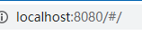
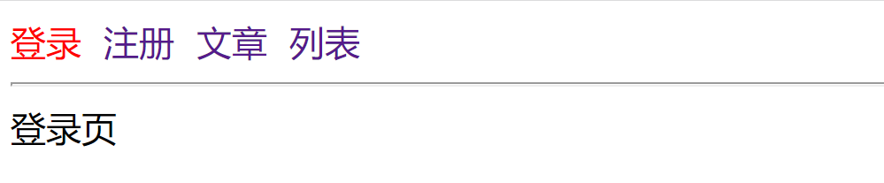
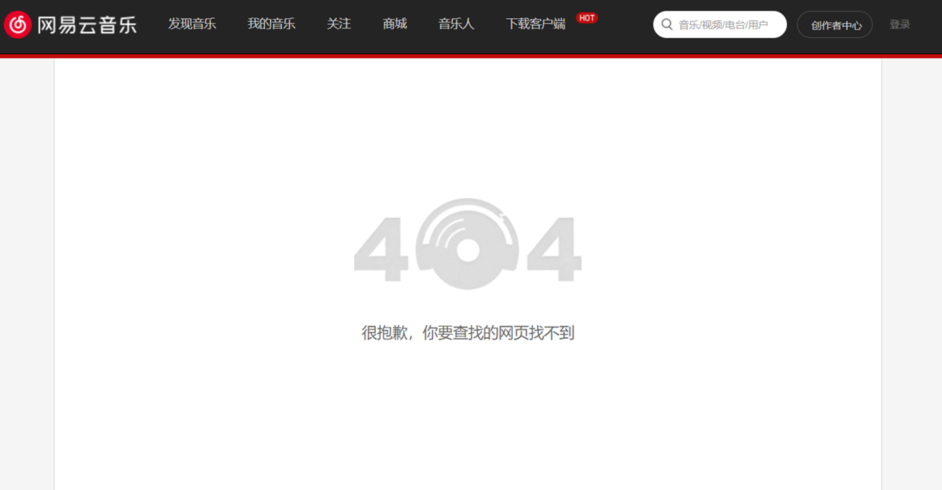
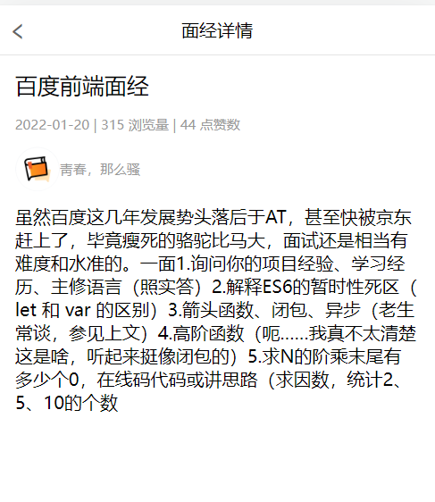
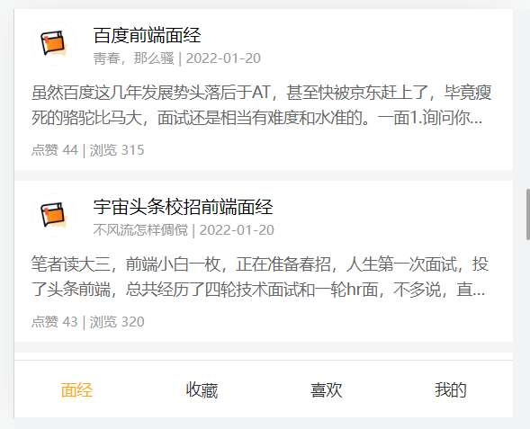

# 生命周期

## 研究生命周期的意义

生命周期 => 一个事物从出生 到 消亡的全部过程 

生命周期（Life Cycle）是指一个组件从`创建`-> `运行` -> `销毁`的整个阶段，强调的是一个时间段

- 张三出生，表示这个人生命周期的开始
- 张三离世，表示这个人生命周期的结束
- 中间张三的一生，就是张三的生命周期

我们可以把`每个 vue 组件运行的过程`，也概括为生命周期：

- vue 组件的初始化，表示生命周期的开始
- vue 组件的销毁，表示生命周期的结束
- **vue 组件中间运行的过程，就是组件的生命周期**


## 生命周期函数(钩子函数)

**生命周期函数：是由 vue 框架提供的内置函数，会伴随着组件的生命周期，自动按次序执行。**

生命周期函数的作用：允许程序员在**`特定的时间点`**，执行某些特定的操作。

例如，组件创建完毕后，可以在created 生命周期函数中发起Ajax 请求，从而初始化 data 数据。

## 组件生命周期分类

vue 组件的生命周期函数，可以分为 3 大类：

- 组件**`初始化阶段`**的生命周期函数
- 组件**`运行阶段`**的生命周期函数
- 组件**`销毁阶段`**的生命周期函数


```js
1. beforeCreate：data数据初始化之前，组件还没有数据
2. created: data数据初始化之后，可以获取到组件的数据
3. beforeMount：DOM渲染之前，DOM还没渲染
4. mounted：DOM渲染之后，可以操作DOM了
5. beforeUpdate: 数据更新，DOM更新前
6. updated: 数据更新，DOM更新后
7. beforeDestroy: 组件销毁前
8. destroyed: 组件销毁后
```


# 单页应用程序与路由

## SPA - 单页应用程序

- SPA： `Single Page Application`  单页面应用程序
- `MPA `: `Multiple Page Application`多页面应用程序 

[SPA ](https://baike.baidu.com/item/SPA/17536313?fr=aladdin)

[网易云音乐](https://music.163.com/)

### 优势

- 传统的多页面应用程序，每次请求服务器返回的都是一整个完整的页面
- 单页面应用程序只有第一次会加载完整的页面
- 以后每次请求仅仅获取必要的数据，减少了请求体积，加快页面响应速度，降低了对服务器的压力
- SPA更好的用户体验，运行更加流畅

### 缺点

1. 开发成本高 (需要学习路由)  `vue-router   react-router`
2. **不利于` SEO`** 搜索引擎优化    谷歌浏览器在解决这个问题    ssr:服务端渲染 server side rendering

## 路由介绍

- **路由** : 是浏览器 **URL 中的哈希值**( # hash) 与 **展示视图内容(组件)** 之间的对应规则
  - 简单来说,路由就是一套映射规则(一对一的对应规则), 由开发人员制定规则.- 
  - 当 URL 中的哈希值( `#` hash) 发生改变后,路由会根据制定好的**规则**, 展示对应的视图内容(组件)
- **为什么要学习路由?**
  - 渐进式` =>vue => vuer-router `(管理组件之间的跳转)
  - 在` web App `中, 经常会出现通过一个页面来展示和管理整个应用的功能.
  - SPA 往往是功能复杂的应用,为了有效管理所有视图内容,前端路由 应运而生.
- **`vue` 中的路由** : 是 **hash** 和 **component** 的对应关系, **一个哈希值对应一个组件**

> 目标: 设备和ip的映射关系


> 目标: **路径和组件的映射关系**


# `vue-router`

## `vue-router`介绍

> 目标: 如何在`Vue`项目中集成路由

官网: https://router.vuejs.org/zh/

### 路由 - 组件分类

> 目标:  .`vue`文件分2类, 一个是页面组件, 一个是复用组件

`.vue`文件本质无区别, 方便大家学习和理解, 总结的一个经验

`src`/views(或pages) 文件夹 和 `src`/components文件夹

* 页面组件 - 页面展示 - 配合路由用
* 复用组件 - 展示数据/常用于复用


> 总结: **views下的页面组件, 配合路由切换, components下的一般引入到views下的`vue`中复用展示数据**

## `vue-router`使用

> 目标: 学会`vue`官方提供的`vue-router`路由系统功能模块使用


`App.vue` - 页面标签和样式准备

```vue
<template>
  <div>
    <div class="footer_wrap">
      <a href="#/find">发现音乐</a>
      <a href="#/my">我的音乐</a>
      <a href="#/part">朋友</a>
    </div>
    <div class="top">
      
    </div>
  </div>
</template>

<script>
export default {};
</script>

<style scoped>
.footer_wrap {
  position: fixed;
  left: 0;
  top: 0;
  display: flex;
  width: 100%;
  text-align: center;
  background-color: #333;
  color: #ccc;
}
.footer_wrap a {
  flex: 1;
  text-decoration: none;
  padding: 20px 0;
  line-height: 20px;
  background-color: #333;
  color: #ccc;
  border: 1px solid black;
}
.footer_wrap a:hover {
  background-color: #555;
}
.top {
  padding-top: 62px;
}
</style>
```

[vue-router文档](https://router.vuejs.org/zh/)

- 安装

```bash
yarn add vue-router@3.5.3
```

+ 导入路由 `main.js`中

```js
import VueRouter from 'vue-router'
```

+ 使用路由插件

```jsx
// 在vue中，使用使用vue的插件，都需要调用Vue.use()
Vue.use(VueRouter)
```

+ 创建路由对象

```jsx
const router = new VueRouter({
})
```

+ 关联到`vue`实例

```jsx
new Vue({
  router
})
```

效果：地址栏中自动增加了 #



## 配置路由规则


```js
// 4. 创建一个路由对象
const router = new VueRouter({
  // 路由的规则
  // route: 一条路由规则
  routes: [
    {
      // 路径 锚点
      // 组件
      path: '/find',
      component: Find,
    },
    {
      path: '/my',
      component: My,
    },
    {
      path: '/friend',
      component: Friend,
    },
  ],
})
```

必须指定路由的出口

```js
<div class="top">
  <!-- 路由的出口 -->
  <router-view></router-view>
</div>
```


## 路由的封装

目标：将路由模块抽离出来。好处：**拆分模块，利于维护。**


+ 新建文件`router/index.js`

```js
import Vue from 'vue'
// 2. 导入VueRouter
import VueRouter from 'vue-router'

import Find from '../views/Find'
import My from '../views/My'
import Friend from '../views/Friend'

// 3. 使用vue插件  vue的插件想要生效必须调用一个方法  Vue.use(XXXX)
Vue.use(VueRouter)

// 4. 创建一个路由对象
const router = new VueRouter({
  // 路由的规则
  // route: 一条路由规则
  routes: [
    {
      // 路径 锚点
      // 组件
      path: '/find',
      component: Find,
    },
    {
      path: '/my',
      component: My,
    },
    {
      path: '/friend',
      component: Friend,
    },
  ],
})

export default router

```

+ main.js中

```js
import router from './router'

new Vue({
  // 5. 关联路由对象和vue实例 data methods
  render: (h) => h(App),
  router,
}).$mount('#app')
```


## `vue`路由 - 声明式导航

### 声明式导航 - 基础使用

> 目标: 可用全局组件router-link来替代a标签，能跳转，能高亮

1.  `vue-router`提供了一个全局组件 router-link
2.  `router-link`实质上最终会渲染成a链接 to属性等价于提供 `href`属性(to无需#)
3.  `router-link`提供了声明式导航高亮的功能(自带类名)


```vue
<template>
  <div>
    <div class="footer_wrap">
      <router-link to="/find">发现音乐</router-link>
      <router-link to="/my">我的音乐</router-link>
      <router-link to="/part">朋友</router-link>
    </div>
    <div class="top">
      <router-view></router-view>
    </div>
  </div>
</template>

<script>
export default {};
</script>

<style scoped>
/* 省略了 其他样式 */
.router-link-exact-active,
.router-link-active {
  background-color: #555 !important;
}
</style>
```

> 总结: 链接导航, 用router-link配合to, 实现点击切换路由

### 导航高亮

> `RouterLink`会自动给当前导航添加两个类名

```jsx
<!-- 
  RouterLink会自动给当前的链接添加两个类名
    router-link-active: 激活的导航链接   模糊匹配  to="/my" 可以匹配 /my  /my/a  /my/b ...
    router-link-exact-active:  激活的导航链接 精确匹配  to="/my"  仅可以匹配 /my

    exact: 必须要精确匹配
  -->
 <RouterLink to="/" exact>发现音乐</RouterLink>
<RouterLink to="/my">我的音乐</RouterLink>
<RouterLink to="/friend">朋友</RouterLink>
      
```

可以修改默认高亮的类名


```js
const router = new VueRouter({
  linkActiveClass: 'aa',
  linkExactActiveClass: 'aa',
  // route: 一条规则
}
```


### 路由使用巩固 - 练习

目标：实现以下切换效果




### 声明式导航 - 跳转传参

> 目标: 在跳转路由时, 可以给路由对应的组件内传值

在router-link上的to属性传值, 语法格式如下

* /path?参数名=值

* /path/:id – 需要路由对象提前配置 path: “/path/参数名”

对应页面组件接收传递过来的值

* `$route.query.参数名`

* `$route.params.参数名`

​    1.第一个语法：


2.第二个语法：


## `vue`路由 - 重定向和模式

### 路由 - 重定向

> 目标: **匹配path后, 强制切换到目标path上**

* 网页打开url默认hash值是 / 路径
* redirect是设置要重定向到哪个路由路径

例如: 网页默认打开, 匹配路由"/", 强制切换到"/find"上


```js
const routes = [
  {
    path: "/", // 默认hash值路径
    redirect: "/find" // 重定向到/find
    // 浏览器url中#后的路径被改变成/find-重新匹配数组规则
  }
]
```

> 总结: 强制重定向后, 还会重新来数组里匹配一次规则


### 路由 - 404页面

> 目标: **如果路由hash值, 没有和数组里规则匹配**

默认给一个404页面



语法: 路由最后, path匹配*(任意路径) – 前面不匹配就命中最后这个, 显示对应组件页面


1. 创建`NotFound`页面

   ```vue
   <template>
     
   </template>
   
   <script>
   export default {
   
   }
   </script>
   
   <style scoped>
       img{
           width: 100%;
       }
   </style>
   ```

2. 在`main.js` - 修改路由配置

   ```js
   import NotFound from '@/views/NotFound'
   
   const routes = [
     // ...省略了其他配置
     // 404在最后(规则是从前往后逐个比较path)
     {
       path: "*",
       component: NotFound
     }
   ]
   ```

> 总结: 如果路由未命中任何规则, 给出一个兜底的404页面


### 路由 - 模式设置

> 目标: 修改路由在地址栏的模式

hash路由例如:  http://localhost:8080/#/home

history路由例如: http://localhost:8080/home  (以后上线需要服务器端支持)

[模式文档](https://router.vuejs.org/zh/api/#mode)

router/index.js

```js
const router = new VueRouter({
  routes:[{},{},...],
  mode: "history" // 打包上线后需要后台支持, 模式是hash
})
//前端，history 还是 hash，前端代码不用做任何的修改  后台需要一定的配置
```


## `vue`路由 - 编程式导航

> **编程式导航用`JS`代码跳转**
>
> **声明式导航用a标签**

### 编程式导航 - 基础使用

> 目标: **用`JS`代码来进行跳转**

语法:

```js
this.$router.push({
    path: "路由路径", // 都去 router/index.js定义
    name: "路由名"
})
```


1. `main.js `- 路由数组里, 给路由起名字

```json
{
    path: "/find",
    name: "Find",
    component: Find
},
{
    path: "/my",
    name: "My",
    component: My
},
{
    path: "/part",
    name: "Part",
    component: Part
},
```

2. `App.vue` - 换成span 配合`js`的编程式导航跳转

```vue
<template>
  <div>
    <div class="footer_wrap">
      <span @click="btn('/find', 'Find')">发现音乐</span>
      <span @click="btn('/my', 'My')">我的音乐</span>
      <span @click="btn('/part', 'Part')">朋友</span>
    </div>
    <div class="top">
      <router-view></router-view>
    </div>
  </div>
</template>

<script>
// 目标: 编程式导航 - js方式跳转路由
// 语法:
// this.$router.push({path: "路由路径"})
// this.$router.push({name: "路由名"})
// 注意:
// 虽然用name跳转, 但是url的hash值还是切换path路径值
// 场景:
// 方便修改: name路由名(在页面上看不见随便定义)
// path可以在url的hash值看到(尽量符合组内规范)
export default {
  methods: {
    btn(targetPath, targetName){
      // 方式1: path跳转
      this.$router.push({
        // path: targetPath,
        name: targetName
      })
    }
  }
};
</script>
```


### 编程式导航 - 跳转传参

> 目标: `JS`跳转路由, 传参

语法 `query` / `params` 任选 一个

```js
this.$router.push({
    path: "路由路径"
    name: "路由名",
    query: {
    	"参数名": 值
    }
    params: {
		"参数名": 值
    }
})

// 对应路由接收   $route.params.参数名   取值
// 对应路由接收   $route.query.参数名    取值
```

格外注意: **使用path会自动忽略`params`**


`App.vue`

```vue
<template>
  <div>
    <div class="footer_wrap">
      <span @click="btn('/find', 'Find')">发现音乐</span>
      <span @click="btn('/my', 'My')">我的音乐</span>
      <span @click="oneBtn">朋友-小传</span>
      <span @click="twoBtn">朋友-小智</span>
    </div>
    <div class="top">
      <router-view></router-view>
    </div>
  </div>
</template>

<script>
// 目标: 编程式导航 - 跳转路由传参
// 方式1:
// params => $route.params.参数名
// 方式2:
// query => $route.query.参数名
// 重要: path会自动忽略params
// 推荐: name+query方式传参
// 注意: 如果当前url上"hash值和?参数"与你要跳转到的"hash值和?参数"一致, 爆出冗余导航的问题, 不会跳转路由
export default {
  methods: {
    btn(targetPath, targetName){
      // 方式1: path跳转
      this.$router.push({
        // path: targetPath,
        name: targetName
      })
    },
    oneBtn(){
      this.$router.push({
        name: 'Part',
        params: {
          username: '小传'
        }
      })
    },
    twoBtn(){
      this.$router.push({
        name: 'Part',
        query: {
          name: '小智'
        }
      })
    }
  }
};
</script>
```


## 综合练习 - 面经基础版

首页：一级

- 面经：二级
- 收藏：二级
- 喜欢：二级
- 我的：二级

文章详情：一级




### 配置一级路由

配置首页 和 详情页两个一级路由

```jsx
const router = new VueRouter({
  routes: [
    {
      path: '/',
      component: Layout
    },
    {
      path: '/detail',
      component: ArticleDetail
    }
  ]
})
```


### 配置二级嵌套路由

目标: 在现有的一级路由下, 再嵌套二级路由

利用 children 配置二级路由

`router/index.js`

```jsx
import Article from '@/views/article.vue';
import ArticleDetail from '@/views/article-detail.vue';
import Collect from '@/views/collect.vue';
import Like from '@/views/like.vue';
import User from '@/views/user.vue';
import Layout from '@/views/layout.vue';
import Vue from 'vue'
import VueRouter from "vue-router";
Vue.use(VueRouter)

const router = new VueRouter({
  routes: [
    {
      path: '/',
      component: Layout,
      children: [
        { path: '/article', component: Article },
        { path: '/collect', component: Collect },
        { path: '/like', component: Like },
        { path: '/user', component: User },
      ]
    },
    {
      path: '/detail',
      component: ArticleDetail
    }
  ]
})

export default router
```

配置路由出口，配置导航链接,   a 标签 替换成  router-link

`views/layout.vue`

```jsx
<template>
  <div class="h5-wrapper">
    <div class="content">
        <!-- 二级路由出口，当二级路由匹配后，匹配的组件这里展示 -->
      <router-view></router-view>
    </div>
    <nav class="tabbar">
      <router-link to="/article">面经</router-link>
      <router-link to="/collect">收藏</router-link>
      <router-link to="/like">喜欢</router-link>
      <router-link to="/user">我的</router-link>
    </nav>
  </div>
</template>
```


### 动态渲染首页

1 安装  `axios`

```
yarn  add  axios
```

2 接口文档说明：

```txt
请求地址: https://mock.boxuegu.com/mock/3083/articles
请求方式: get
```

3 data中提供数据， created 中发送请求，获取数据

`src/views/article.vue`

```jsx
<script>
import axios from 'axios';
export default {
  name: 'ArticlePage',
  data() {
    return {
      articles: []
    };
  },
  async created() {
    const { data } = await axios.get(
      'https://mock.boxuegu.com/mock/3083/articles',
    );
    this.articles = data.result.rows;
  },
};
</script>
```

4 结合数据动态渲染

`src/views/Article.vue`

```jsx
<template>
  <div class="article-page" v-if="articles">
    <div
      v-for="item in articles"
      :key="item.id"
      class="article-item">
      <div class="head">
        
        <div class="con">
          <p class="title">{{ item.stem }}</p>
          <p class="other">{{ item.creatorName }} | {{ item.createdAt }}</p>
        </div>
      </div>
      <div class="body">{{ item.content }}</div>
      <div class="foot">点赞 {{ item.likeCount }} | 浏览 {{ item.views }}</div>
    </div>
  </div>
</template>
```


### 跳转传参到详情页

1 修改详情页路由， 改成动态路由

`router/index.js`

```jsx
const router = new VueRouter({
  routes: [
    {
      path: '/',
      component: Layout,
      children: [
        { path: '/article', component: Article },
        { path: '/collect', component: Collect },
        { path: '/like', component: Like },
        { path: '/user', component: User },
      ]
    },
    {
      path: '/detail/:id',
      component: ArticleDetail
    }
  ]
})
```

2 注册点击事件，跳转传递参数

`src/views/Article.vue`

```jsx
<div
  v-for="item in articles"
  :key="item.id"
  class="article-item"
  @click="$router.push(`/detail/${item.id}`)"
>
```

3 获取解析参数

`src/views/ArticleDetail.vue`

```jsx
export default {
  name: 'ArticleDetailPage',
  created() {
    console.log(this.$route.params.id)
  }
};
```

4 点击返回键，返回上一页

`src/views/ArticleDetail.vue`

```jsx
<span class="back" @click="$router.back()">&lt;</span>   //@click="$router.go(-1)  也可以
```


### 动态渲染详情页

接口文档说明：

```txt
请求地址: https://mock.boxuegu.com/mock/3083/articles/:id
请求方式: get
```

1 发送请求获取数据

`src/views/ArticleDetail.vue`

```jsx
<script>
import axios from 'axios'
export default {
  name: 'ArticleDetailPage',
  data() {
    return {
      article: {},
    }
  },
  async created() {
    // console.log(this.$route.params.id)
    const { data } = await axios.get(
      `https://mock.boxuegu.com/mock/3083/articles/${this.$route.params.id}`
    )
    // console.log(data)
    this.article = data.result
    //console.log(this.article)
  },
}
</script>
```

2 页面渲染

`src/views/ArticleDetail.vue`

```jsx
<template>
  <div class="article-detail-page" v-if="article.id">
    <nav class="nav"> <span class="back" @click="$router.back()">&lt;</span> 面经详情</nav>
    <header class="header">
      <h1>{{article.stem}}</h1>
      <p>{{article.createdAt}} | {{article.views}} 浏览量 | {{article.likeCount}} 点赞数</p>
      <p> <span>{{article.creatorName}}</span> </p>
    </header>
    <main class="body"> {{article.content}} </main>
  </div>
</template>
```


## 路由传参复习

```
1.动态路由传参：(优雅)
(1).配置动态路由（路径中携带参数）
    routes:[
      { path:'/detail/:id' , component:组件名 }
    ]
(2).跳转
    <router-link to="/detail/123">去某页面</router-link>

    this.$router.push('/detail/123')
    this.$router.push({
      path:'/detail/123'
    })
(3).获取参数
    this.$router.params.id

2.query传参(查询参数传参) 适合传多个参数
(1).路由正常配置 
     routes:[
      { path:'/detail' , component:组件名 }
    ]
(2).跳转携带参数
    <router-link to="detail?id=123"></router-link>

    this.$router.push('/detail?id=123')
    this.$router.push({
      path:'/detail',
      query:{
        id:123
      },
      //这里params会被忽略
    })
(3).获取参数
    this.$route.query.id

3.params传参,配合name使用,基于内容的参数传递(相对鸡肋，刷新会丢失，不太常用)
(1). 路由正常配置,额外起个名字 
     routes:[
      { path:'/detail' ,name='detail', component:组件名 }
    ]
(2).跳转，必须通过 name 跳转
   this.$router.push({
     name:'detail',
     query:{} ,
    params:{}
   })
(3).获取参数
    this.$route.params
```


## 组件缓存 keep-alive

### 基本语法

思考：从面经 点到 收藏，又点回 面经，面经的数据需要重新加载么？不需要，希望缓存下来！

如果希望组件被缓存下来，可以在外面包一个 keep-alive 组件 ~



`src/views/Layout.vue`

```jsx
<template>
  <div class="h5-wrapper">
    <div class="content">
      <!-- 被keep-alive包裹的组件，当切换时，不会销毁,而是缓存下来 -->
      <keep-alive>
        <router-view></router-view>
      </keep-alive>
    </div>
    <nav class="tabbar">
      <router-link to="/article">面经</router-link>
      <router-link to="/collect">收藏</router-link>
      <router-link to="/like">喜欢</router-link>
      <router-link to="/user">我的</router-link>
    </nav>
  </div>
</template>
```


### keep-alive对应的两个钩子

当组件被keep-alive管理时，会多出两个生命周期钩子，activated  /  deactivated

`src/views/Article.vue`

```jsx
export default {
  name: 'ArticlePage',
  data() {
    return {
      articles: []
    }
  },
  async created() {
    const { data } = await axios.get(
      'https://mock.boxuegu.com/mock/3083/articles',
    )
    this.articles = data.result.rows
    //console.log(this.articles)
  },
    ////一旦组件被keep-alive包裹，从包裹的那刻开始，这个组件就又多了两个钩子
  activated() {
    console.log('缓存组件被激活')
  },
  deactivated() {
    console.log('缓存组件被隐藏')
  }
}
```


